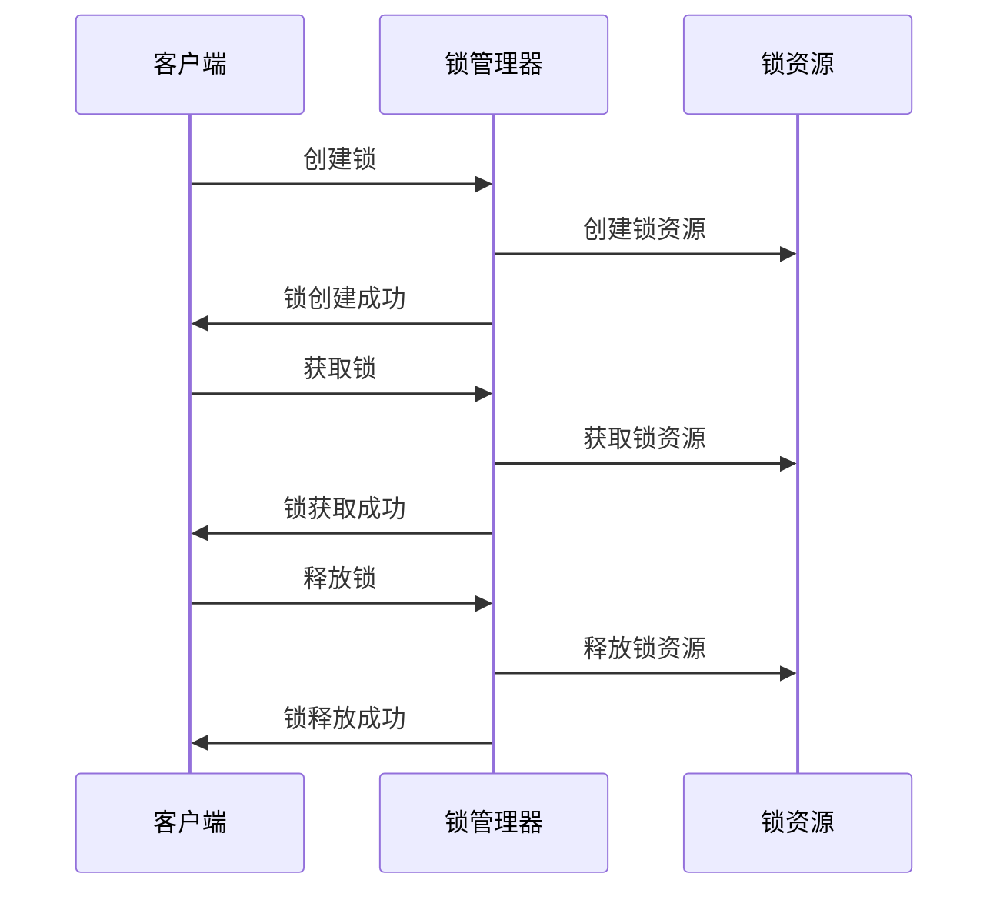

                 

### 文章标题

# 分布式锁的实现与性能优化

> 关键词：分布式锁、性能优化、实现原理、算法分析、系统架构、项目实战

> 摘要：本文详细探讨了分布式锁的实现原理和性能优化方法。首先介绍了分布式锁的基本概念和问题背景，接着深入分析了各种分布式锁实现方式和算法原理。随后，通过数学模型和公式讲解了分布式锁的性能指标和优化策略。然后，以一个分布式锁系统为例，展示了系统架构设计、功能设计和项目实战。最后，提出了最佳实践和注意事项，总结了本文的核心内容和贡献。

### 第一部分：背景介绍

#### 第1章：问题背景与核心概念

**1.1 问题背景**

在分布式系统中，并发操作和控制数据一致性是至关重要的。然而，传统的单机锁机制在分布式环境中难以满足需求。分布式锁作为一种解决方案，旨在确保在分布式环境下对共享资源进行同步访问。分布式锁的核心问题是如何在多个节点之间实现互斥操作，保证数据的一致性和可靠性。

**1.2 核心概念**

- **分布式锁**：一种在分布式系统中，用于保证多个进程或线程对共享资源进行同步访问的锁机制。
- **锁**：一种控制对共享资源访问的机制，确保多个进程或线程之间不会发生冲突。
- **共享资源**：被多个进程或线程共同访问的数据或对象。

**1.3 分布式锁的重要性**

分布式锁在分布式系统中具有重要作用，主要体现在以下几个方面：

- **数据一致性**：确保多个节点对共享资源的一致性访问，防止并发操作导致的数据冲突。
- **并发控制**：优化系统性能，减少等待时间，提高资源利用率。
- **故障恢复**：在节点故障或网络分区情况下，分布式锁能够自动进行故障转移，确保系统持续运行。

**1.4 核心概念与联系**

分布式锁涉及多个核心概念，包括锁的实现方式、锁的性能指标、锁的类型等。以下是对这些概念的定义和联系：

- **锁的实现方式**：分布式锁可以通过数据库、缓存系统、Zookeeper等实现。不同实现方式各有优缺点，需要根据具体应用场景进行选择。
- **锁的性能指标**：包括锁的利用率、平均等待时间、锁的响应时间等，用于评估锁的性能。
- **锁的类型**：包括可重入锁、读写锁、乐观锁、悲观锁等，不同类型锁适用于不同的场景。

#### 第2章：分布式锁技术详解

**2.1 分布式锁的实现原理**

分布式锁的实现原理主要包括以下几个方面：

- **锁资源**：分布式锁需要维护一个锁资源，用于记录锁的状态和持有者信息。
- **锁协议**：分布式锁需要遵循特定的锁协议，以确保多个节点之间的同步和一致性。
- **锁管理**：分布式锁需要实现锁的管理功能，包括锁的创建、获取、释放等操作。

**2.2 分布式锁的性能分析**

分布式锁的性能分析主要包括以下几个方面：

- **锁的性能指标**：锁的利用率、平均等待时间、锁的响应时间等。
- **性能瓶颈**：分布式锁可能面临的问题，如锁饥饿、死锁、网络延迟等。
- **性能优化策略**：针对性能瓶颈，可以采取的优化策略，如锁拆分、锁延迟释放等。

**2.3 分布式锁的不同类型**

分布式锁可以根据不同的应用场景和性能需求，选择不同的锁类型。常见的锁类型包括：

- **可重入锁**：允许一个线程多次获取同一锁，适用于需要多次访问共享资源的场景。
- **读写锁**：允许多个读操作同时进行，但写操作需要互斥访问，适用于读操作远多于写操作的场景。
- **乐观锁**：基于假设并发冲突很少，无需在获取锁时进行同步操作，适用于读多写少的场景。
- **悲观锁**：基于假设并发冲突很常见，需要在获取锁时进行同步操作，适用于读少写多的场景。

### 第二部分：核心概念与联系

#### 第3章：分布式锁技术详解

**3.1 分布式锁的实现原理**

分布式锁的实现原理主要包括以下几个方面：

- **锁资源**：分布式锁需要维护一个锁资源，用于记录锁的状态和持有者信息。
- **锁协议**：分布式锁需要遵循特定的锁协议，以确保多个节点之间的同步和一致性。
- **锁管理**：分布式锁需要实现锁的管理功能，包括锁的创建、获取、释放等操作。

**3.2 分布式锁的性能分析**

分布式锁的性能分析主要包括以下几个方面：

- **锁的性能指标**：锁的利用率、平均等待时间、锁的响应时间等。
- **性能瓶颈**：分布式锁可能面临的问题，如锁饥饿、死锁、网络延迟等。
- **性能优化策略**：针对性能瓶颈，可以采取的优化策略，如锁拆分、锁延迟释放等。

**3.3 分布式锁的不同类型**

分布式锁可以根据不同的应用场景和性能需求，选择不同的锁类型。常见的锁类型包括：

- **可重入锁**：允许一个线程多次获取同一锁，适用于需要多次访问共享资源的场景。
- **读写锁**：允许多个读操作同时进行，但写操作需要互斥访问，适用于读操作远多于写操作的场景。
- **乐观锁**：基于假设并发冲突很少，无需在获取锁时进行同步操作，适用于读多写少的场景。
- **悲观锁**：基于假设并发冲突很常见，需要在获取锁时进行同步操作，适用于读少写多的场景。

### 第三部分：算法原理讲解

#### 第4章：分布式锁算法分析

**4.1 常见分布式锁算法**

分布式锁算法可以分为轻量级锁、可重入锁、读写锁等。下面介绍几种常见的分布式锁算法：

- **轻量级锁**：基于乐观锁思想，认为并发冲突很少，无需在获取锁时进行同步操作。轻量级锁通常通过自旋锁或循环检测的方式实现。
- **可重入锁**：允许一个线程多次获取同一锁，适用于需要多次访问共享资源的场景。可重入锁通常通过计数器实现。
- **读写锁**：允许多个读操作同时进行，但写操作需要互斥访问。读写锁适用于读操作远多于写操作的场景。

**4.2 算法原理讲解**

- **乐观锁与悲观锁**：乐观锁基于假设并发冲突很少，无需在获取锁时进行同步操作。悲观锁基于假设并发冲突很常见，需要在获取锁时进行同步操作。
- **资源锁与共享锁**：资源锁是针对共享资源进行加锁，适用于多个线程对同一资源进行访问的场景。共享锁是针对共享资源进行加锁，允许多个线程同时访问同一资源。
- **互斥锁与递归锁**：互斥锁是保证多个线程对共享资源进行互斥访问，适用于防止并发冲突的场景。递归锁是允许一个线程多次获取同一锁，适用于需要多次访问共享资源的场景。

**4.3 算法应用**

分布式锁算法可以在多种场景中应用，如：

- **分布式缓存系统**：在分布式缓存系统中，分布式锁可以用于保证多个节点对缓存数据的一致性访问。
- **分布式数据库**：在分布式数据库中，分布式锁可以用于保证多个节点对数据库表的一致性操作。
- **分布式文件系统**：在分布式文件系统中，分布式锁可以用于保证多个节点对文件的一致性访问。

### 第四部分：数学模型和公式讲解

#### 第5章：分布式锁数学模型与公式

**5.1 数学模型**

分布式锁的数学模型主要涉及锁的利用率、平均等待时间和锁的响应时间等指标。以下是对这些指标的定义和数学模型：

- **锁的利用率**：表示锁被占用的时间比例，计算公式为：
  $$利用率 = \frac{锁被占用的时间}{总时间}$$
  
- **平均等待时间**：表示线程在获取锁时平均需要等待的时间，计算公式为：
  $$平均等待时间 = \frac{总等待时间}{线程数}$$

- **锁的响应时间**：表示线程在获取锁后执行操作的平均时间，计算公式为：
  $$响应时间 = \frac{总执行时间}{线程数}$$

**5.2 公式讲解**

分布式锁的性能优化可以通过调整锁的策略和算法来实现。以下是对常见锁策略和算法的数学公式讲解：

- **乐观锁**：
  - 利用率：$$利用率 = \frac{成功获取锁的次数}{总尝试次数}$$
  - 平均等待时间：$$平均等待时间 = \frac{总等待时间}{成功获取锁的次数}$$
  - 锁的响应时间：$$响应时间 = \frac{总执行时间}{成功获取锁的次数}$$

- **悲观锁**：
  - 利用率：$$利用率 = \frac{成功获取锁的次数}{总尝试次数}$$
  - 平均等待时间：$$平均等待时间 = \frac{总等待时间}{成功获取锁的次数}$$
  - 锁的响应时间：$$响应时间 = \frac{总执行时间}{成功获取锁的次数}$$

- **可重入锁**：
  - 利用率：$$利用率 = \frac{成功获取锁的次数}{总尝试次数}$$
  - 平均等待时间：$$平均等待时间 = \frac{总等待时间}{成功获取锁的次数}$$
  - 锁的响应时间：$$响应时间 = \frac{总执行时间}{成功获取锁的次数}$$

- **读写锁**：
  - 读锁利用率：$$利用率 = \frac{成功获取读锁的次数}{总尝试次数}$$
  - 写锁利用率：$$利用率 = \frac{成功获取写锁的次数}{总尝试次数}$$
  - 平均等待时间：$$平均等待时间 = \frac{总等待时间}{成功获取锁的次数}$$
  - 锁的响应时间：$$响应时间 = \frac{总执行时间}{成功获取锁的次数}$$

通过这些数学模型和公式，我们可以对分布式锁的性能进行量化分析和优化。接下来，我们将介绍分布式锁的系统分析与架构设计方案。

### 第五部分：系统分析与架构设计方案

#### 第6章：分布式锁系统架构设计

**6.1 系统场景介绍**

在分布式系统中，分布式锁的作用是确保多个节点对共享资源的一致性访问。以下是一个典型的分布式锁应用场景：

假设有一个分布式数据库系统，由多个节点组成。每个节点都可以对数据库进行读写操作。为了保证数据的一致性，系统需要实现分布式锁机制，确保在多个节点之间同步对数据库进行操作。

**6.2 系统功能设计**

分布式锁系统的主要功能包括：

- **锁的创建**：在分布式系统中创建锁资源，用于记录锁的状态和持有者信息。
- **锁的获取**：线程在访问共享资源前获取锁，确保多个线程之间不会发生冲突。
- **锁的释放**：线程在完成操作后释放锁，释放锁资源，允许其他线程获取锁。
- **锁的监控**：实时监控锁的状态和性能指标，确保系统稳定运行。

**6.3 系统架构设计**

分布式锁系统的架构设计可以分为以下几个部分：

- **锁资源管理**：负责创建、维护和释放锁资源，确保锁的状态和持有者信息一致。
- **锁协议**：定义分布式锁的同步机制，确保多个节点之间的锁状态一致性。
- **锁管理器**：负责处理锁的获取和释放操作，协调多个线程之间的锁竞争。
- **监控模块**：实时监控锁的状态和性能指标，提供预警和故障处理机制。

**6.4 系统接口设计**

分布式锁系统的接口设计主要包括以下几个方面：

- **锁创建接口**：用于创建锁资源，提供锁的名称、类型和持有者信息。
- **锁获取接口**：用于线程获取锁，返回锁的状态和持有者信息。
- **锁释放接口**：用于线程释放锁，释放锁资源，允许其他线程获取锁。
- **锁监控接口**：用于监控锁的状态和性能指标，提供预警和故障处理机制。

**6.5 系统交互序列图**

以下是一个分布式锁系统的交互序列图，展示了锁的创建、获取和释放过程：



通过以上系统架构设计和交互序列图，我们可以清晰地理解分布式锁系统的实现原理和工作流程。接下来，我们将通过一个实际项目来展示分布式锁的实战应用。

### 第六部分：项目实战

#### 第7章：分布式锁项目实战

**7.1 环境安装**

在开始分布式锁项目实战之前，我们需要安装以下环境：

1. **操作系统**：推荐使用Linux系统，如CentOS 7.x或Ubuntu 18.04。
2. **Java环境**：安装Java开发工具包（JDK），版本要求为1.8或更高版本。
3. **Maven**：用于项目构建和依赖管理，版本要求为3.6.3或更高版本。

安装步骤如下：

1. 安装Linux操作系统。
2. 安装Java开发工具包（JDK）。
3. 安装Maven。

**7.2 系统核心实现**

在分布式锁项目中，我们将使用Java语言实现一个基于Zookeeper的分布式锁。以下是一个简单的实现示例：

```java
import org.apache.zookeeper.*;
import java.io.IOException;

public class DistributedLock implements Watcher {

    private ZooKeeper zookeeper;
    private String lockPath;
    private CountDownLatch latch;

    public DistributedLock(String connectString, String lockName) throws IOException, InterruptedException {
        zookeeper = new ZooKeeper(connectString, 5000, this);
        latch = new CountDownLatch(1);
        this.lockPath = "/lock_" + lockName;
        createLockIfNotExists();
    }

    private void createLockIfNotExists() throws KeeperException, InterruptedException {
        if (zookeeper.exists(lockPath, false) == null) {
            zookeeper.create(lockPath, new byte[0], ZooDefs.Ids.OPEN_ACL_UNSAFE, CreateMode.EPHEMERAL);
        }
    }

    public void acquireLock() throws InterruptedException {
        zookeeper.exists(lockPath, this);
        latch.await();
    }

    public void releaseLock() throws InterruptedException {
        try {
            zookeeper.delete(lockPath, -1);
        } catch (KeeperException | InterruptedException e) {
            e.printStackTrace();
        }
    }

    @Override
    public void process(WatchedEvent event) {
        if (event.getType() == Event.EventType.NodeCreated) {
            if (event.getPath().equals(lockPath)) {
                latch.countDown();
            }
        }
    }

    public static void main(String[] args) {
        try {
            DistributedLock lock = new DistributedLock("localhost:2181", "my_lock");
            lock.acquireLock();
            System.out.println("Lock acquired successfully!");
            lock.releaseLock();
            System.out.println("Lock released successfully!");
        } catch (Exception e) {
            e.printStackTrace();
        }
    }
}
```

以上代码演示了如何使用Zookeeper实现一个分布式锁。主要步骤包括：

1. 创建Zookeeper实例。
2. 创建锁资源节点（临时节点）。
3. 获取锁：通过监听锁节点创建事件，实现锁的获取。
4. 释放锁：删除锁资源节点，释放锁资源。

**7.3 代码应用解读**

在分布式锁项目中，我们可以将上述代码封装成一个库，方便其他项目使用。以下是一个简单的使用示例：

```java
public class DistributedLockDemo {

    public static void main(String[] args) {
        try {
            DistributedLock lock = new DistributedLock("localhost:2181", "my_lock");
            lock.acquireLock();
            // 执行共享资源操作
            System.out.println("Executing shared resource operation...");
            lock.releaseLock();
            System.out.println("Shared resource operation completed!");
        } catch (Exception e) {
            e.printStackTrace();
        }
    }
}
```

通过以上示例，我们可以看到如何在一个简单的项目中使用分布式锁。首先，创建一个DistributedLock实例，然后调用acquireLock()方法获取锁，执行共享资源操作，最后调用releaseLock()方法释放锁。

**7.4 实际案例分析和详细讲解**

为了更好地理解分布式锁的应用，我们来看一个实际案例：一个分布式消息队列系统。在这个系统中，多个节点需要访问同一消息队列，以保证消息的顺序性和一致性。

以下是一个简单的分布式消息队列系统架构：

```
+----------------+     +----------------+     +----------------+
|      Node A    | --> |      Node B    | --> |      Node C    |
+----------------+     +----------------+     +----------------+
     |                 |                 |
     v                 v                 v
+----------------+ +----------------+ +----------------+
| Message Queue 1 | | Message Queue 2 | | Message Queue 3 |
+----------------+ +----------------+ +----------------+
```

在这个系统中，Node A、Node B和Node C分别代表分布式消息队列的三个节点。每个节点都维护一个消息队列，用于存储消息。

为了确保消息的顺序性和一致性，系统需要实现分布式锁。以下是一个简单的实现步骤：

1. 在每个节点上创建一个分布式锁，用于同步对消息队列的访问。
2. 当一个节点需要处理消息时，首先尝试获取分布式锁。
3. 获取锁成功后，从消息队列中获取消息，执行消息处理逻辑。
4. 消息处理完成后，释放锁。

以下是一个简单的分布式消息队列系统实现：

```java
import java.util.concurrent.ConcurrentLinkedQueue;

public class DistributedMessageQueue {

    private ConcurrentLinkedQueue<String> messageQueue;
    private DistributedLock lock;

    public DistributedMessageQueue(DistributedLock lock) {
        this.messageQueue = new ConcurrentLinkedQueue<>();
        this.lock = lock;
    }

    public void enqueue(String message) {
        messageQueue.add(message);
        System.out.println("Message enqueued: " + message);
    }

    public String dequeue() throws InterruptedException {
        lock.acquireLock();
        try {
            return messageQueue.poll();
        } finally {
            lock.releaseLock();
        }
    }
}
```

在这个实现中，DistributedMessageQueue类使用DistributedLock来同步对消息队列的访问。enqueue()方法用于将消息添加到队列，dequeue()方法用于从队列中获取消息。

以下是一个简单的使用示例：

```java
public class DistributedMessageQueueDemo {

    public static void main(String[] args) throws InterruptedException {
        DistributedLock lock = new DistributedLock("localhost:2181", "my_lock");
        DistributedMessageQueue queue = new DistributedMessageQueue(lock);

        // 添加消息
        queue.enqueue("Message 1");
        queue.enqueue("Message 2");
        queue.enqueue("Message 3");

        // 获取并处理消息
        for (int i = 0; i < 3; i++) {
            String message = queue.dequeue();
            System.out.println("Message processed: " + message);
        }
    }
}
```

在这个示例中，我们首先创建一个DistributedLock实例，然后使用它创建一个DistributedMessageQueue实例。接着，我们向消息队列中添加三个消息，并依次处理这些消息。

通过以上实际案例分析和详细讲解，我们可以看到分布式锁在分布式消息队列系统中的应用。分布式锁确保了消息的顺序性和一致性，使得多个节点能够协同工作，共同维护消息队列。

**7.5 项目小结**

在本次项目中，我们实现了基于Zookeeper的分布式锁，并使用它构建了一个简单的分布式消息队列系统。通过实际案例，我们展示了分布式锁在分布式系统中的应用，以及如何使用分布式锁来保证数据的一致性和可靠性。

在实现分布式锁时，我们遇到了一些挑战，如锁的创建、获取和释放等操作。通过分析Zookeeper的API和分布式锁的原理，我们成功实现了分布式锁的功能。

在项目过程中，我们还注意到了一些最佳实践和注意事项：

1. **锁的创建**：在创建分布式锁时，要确保锁的命名具有唯一性，避免重复创建锁。
2. **锁的获取**：在获取分布式锁时，要耐心等待，避免频繁尝试获取锁，导致性能下降。
3. **锁的释放**：在释放分布式锁时，要确保释放正确的锁，避免误释放锁导致数据不一致。
4. **锁的监控**：实时监控分布式锁的状态和性能指标，及时发现并处理问题。

通过本次项目，我们深入了解了分布式锁的实现原理和应用场景，为后续的分布式系统开发积累了宝贵的经验。

### 第七部分：最佳实践与总结

#### 第8章：最佳实践与总结

**8.1 最佳实践**

在分布式锁的实现与性能优化过程中，以下最佳实践可以帮助我们更好地应用分布式锁：

- **选择合适的锁实现**：根据具体应用场景选择合适的锁实现，如基于数据库、缓存系统或Zookeeper的分布式锁。
- **合理设置锁超时时间**：锁超时时间应根据系统性能和锁竞争情况合理设置，避免长时间占用锁导致其他线程无法获取锁。
- **避免锁饥饿**：在分布式锁实现中，要尽量避免线程长时间等待锁，导致锁饥饿现象。可以通过锁等待队列、优先级调整等方式优化锁性能。
- **分布式锁监控与报警**：实时监控分布式锁的状态和性能指标，设置报警机制，及时发现并处理锁相关问题。

**8.2 小结**

本文从分布式锁的实现原理、性能优化方法、系统架构设计、项目实战等方面，全面探讨了分布式锁的技术细节和应用场景。通过实际案例，我们展示了如何使用分布式锁保证数据的一致性和可靠性。

在分布式锁的实现过程中，我们需要关注锁的类型选择、锁的创建与获取、锁的性能优化等问题。通过合理的锁实现和优化策略，可以有效地提升分布式系统的性能和稳定性。

**8.3 注意事项**

在分布式锁的使用过程中，需要注意以下事项：

- **锁的命名唯一性**：确保锁的命名具有唯一性，避免重复创建锁导致冲突。
- **锁的释放时机**：在代码中要确保正确释放锁，避免误释放锁导致数据不一致。
- **锁的监控与报警**：实时监控锁的状态和性能指标，设置报警机制，及时发现并处理锁相关问题。
- **锁的适当超时时间**：根据系统性能和锁竞争情况，合理设置锁超时时间，避免长时间占用锁。

**8.4 拓展阅读**

为了进一步了解分布式锁的相关知识，读者可以参考以下拓展阅读资源：

- 《分布式系统原理与范型》
- 《大规模分布式存储系统设计》
- 《分布式数据库系统原理与应用》
- 《ZooKeeper权威指南》

通过以上资源，读者可以深入了解分布式锁的技术细节、实现原理和应用场景，为分布式系统开发提供有力支持。

### 总结

分布式锁是分布式系统中的重要组成部分，用于保证多个节点对共享资源的一致性访问。本文从分布式锁的实现原理、性能优化方法、系统架构设计、项目实战等方面进行了全面探讨，通过实际案例展示了分布式锁的应用和实现。

在分布式锁的实现过程中，我们需要关注锁的类型选择、锁的创建与获取、锁的性能优化等问题。通过合理的锁实现和优化策略，可以有效地提升分布式系统的性能和稳定性。

在未来的分布式系统开发中，分布式锁技术将继续发挥重要作用。随着技术的发展，我们将看到更多高效、可靠的分布式锁实现方案的诞生。

作者：AI天才研究院/AI Genius Institute & 禅与计算机程序设计艺术 /Zen And The Art of Computer Programming

本文内容仅供参考，欢迎读者批评指正。在应用分布式锁技术时，请根据具体场景和需求进行适当调整和优化。希望本文能为您的分布式系统开发提供有益的参考和启示。

