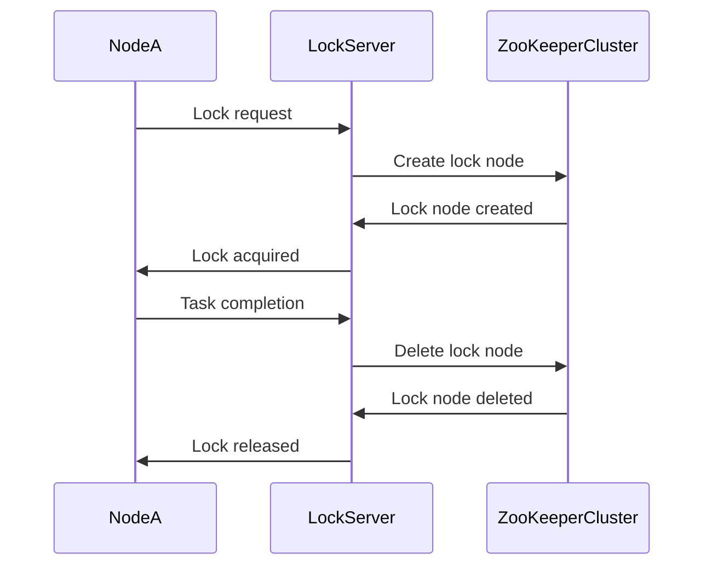
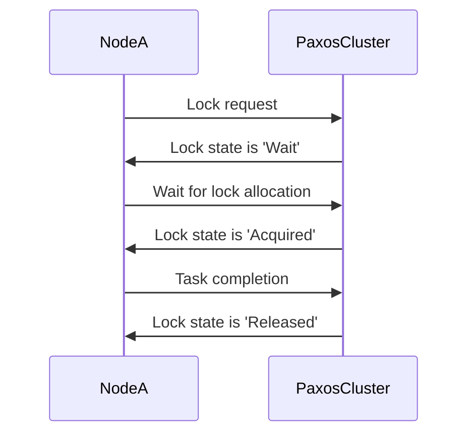
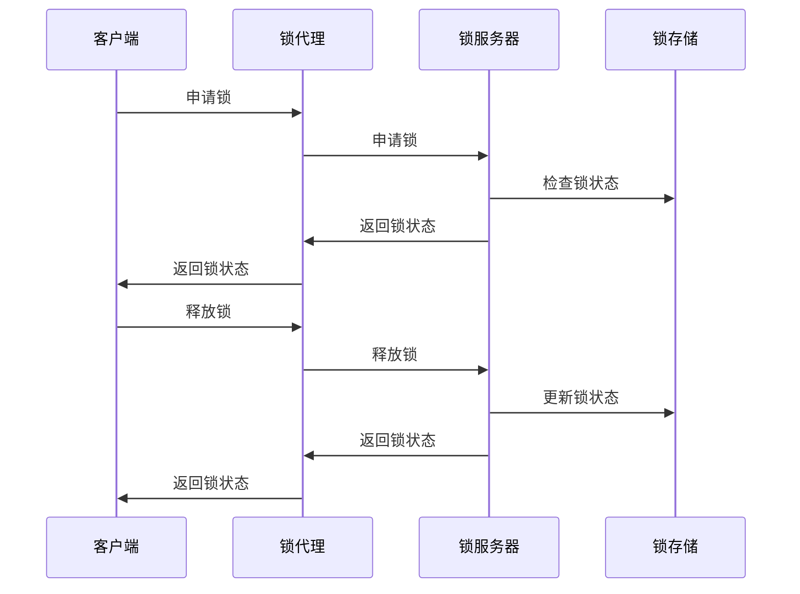
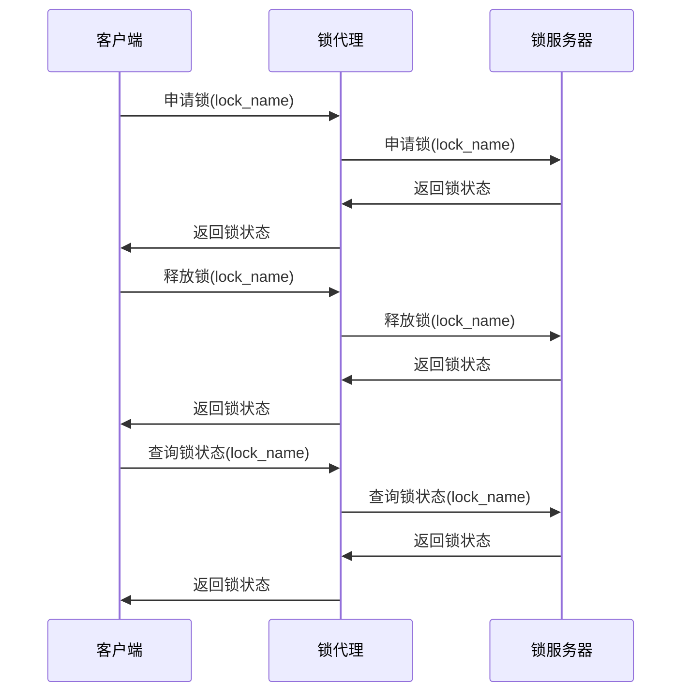

                 

## 分布式锁：解决分布式系统并发控制

### 关键词：
- 分布式锁
- 并发控制
- 分布式系统
- Paxos协议
- ZAB协议

### 摘要：
本文将深入探讨分布式锁在分布式系统中的应用与实现。首先，我们将介绍分布式锁的背景及其在分布式系统中的重要性。接着，我们将详细解析分布式锁的核心概念和联系，包括其基本原理、算法和数学模型。随后，文章将展示一个完整的系统分析与架构设计案例，并通过一个实际项目实战来讲解分布式锁的实现和应用。最后，我们将总结最佳实践和注意事项，为读者提供分布式锁应用的实际指导。

### 目录

#### 第一部分：分布式锁的背景和概念

1. **第1章：分布式锁的背景**
    - 1.1 分布式系统的并发控制问题
    - 1.2 分布式锁的定义和核心要素
    - 1.3 分布式锁的边界与外延

2. **第2章：分布式锁的核心概念和联系**
    - 2.1 分布式锁的原理
    - 2.2 分布式锁的属性特征对比
    - 2.3 分布式锁的ER实体关系图

3. **第3章：分布式锁的算法原理**
    - 3.1 基本算法
    - 3.2 算法原理讲解
    - 3.3 算法举例说明

4. **第4章：分布式锁的数学模型和数学公式**
    - 4.1 数学模型概述
    - 4.2 分布式锁的数学公式
    - 4.3 数学公式讲解

#### 第二部分：分布式锁的系统分析与架构设计

5. **第5章：分布式锁的系统分析与架构设计**
    - 5.1 问题场景介绍
    - 5.2 系统功能设计
    - 5.3 系统架构设计
    - 5.4 系统接口设计
    - 5.5 系统交互

#### 第三部分：分布式锁的项目实战

6. **第6章：分布式锁的项目实战**
    - 6.1 环境安装
    - 6.2 系统核心实现
    - 6.3 代码应用解读与分析
    - 6.4 实际案例分析和详细讲解
    - 6.5 项目小结

#### 第四部分：分布式锁的最佳实践和注意事项

7. **第7章：分布式锁的最佳实践和注意事项**
    - 7.1 最佳实践 tips
    - 7.2 小结
    - 7.3 注意事项
    - 7.4 拓展阅读

---

接下来，我们将一步步深入探讨分布式锁的核心概念、算法原理、系统分析与架构设计以及项目实战，确保每一位读者都能全面理解和掌握分布式锁的精髓。让我们一起开始这段探索之旅。

### 分布式锁的背景

在当今的分布式系统中，并发控制是一个关键问题。分布式系统是由多个独立的节点组成的，这些节点通常分布在不同的物理位置或数据中心。它们通过网络相互通信，协同工作以完成复杂的任务。然而，这种分布式的结构也带来了并发控制的挑战。

**1.1 分布式系统的并发控制问题**

在单机系统中，并发控制相对简单。我们通常使用锁机制来确保数据的一致性和完整性。然而，在分布式系统中，情况变得更加复杂。多个节点可能同时访问同一个数据，导致并发冲突和数据不一致。例如，假设有两个分布式节点A和B，它们同时需要更新同一个数据项。如果没有适当的控制机制，这两个节点可能会同时修改该数据项，导致数据不一致。

**1.2 分布式锁的定义和核心要素**

分布式锁是一种机制，用于在分布式系统中确保对共享资源的独占访问。简单地说，分布式锁用于防止多个节点同时访问和修改同一资源。其核心要素包括：

- **锁机制**：分布式锁通过某种机制来确保资源的独占访问，常见的锁机制包括基于时间戳的锁和基于版本的锁。

- **锁粒度**：锁粒度指的是锁作用的范围。在分布式锁中，锁的粒度可以是细粒度，如单个数据项，也可以是粗粒度，如整个数据库。

- **锁同步性**：锁的同步性指的是多个节点访问锁时的同步策略。常见的同步策略包括基于消息队列的同步和基于共享内存的同步。

- **锁的可重入性**：锁的可重入性指的是一个进程可以多次获取同一锁而不会产生死锁。

**1.3 分布式锁的边界与外延**

分布式锁的应用场景广泛，主要包括以下几种：

- **分布式数据库操作**：在分布式数据库中，分布式锁用于确保对数据的并发访问控制，防止数据不一致。

- **分布式缓存操作**：在分布式缓存系统中，分布式锁用于控制缓存数据的读写，提高系统的性能和一致性。

- **分布式任务队列**：在分布式任务队列中，分布式锁用于确保任务的顺序执行，防止重复执行或数据丢失。

- **分布式微服务**：在分布式微服务架构中，分布式锁用于确保服务之间的协作和数据的一致性。

分布式锁的技术挑战主要包括：

- **网络延迟和故障**：分布式系统中的节点可能因为网络延迟或故障而无法及时获取锁，导致系统性能下降。

- **锁的分布式管理**：如何高效地管理和维护分布式锁是一个技术难题，需要考虑锁的创建、获取、释放和续期等操作。

- **死锁问题**：在分布式系统中，死锁是一种常见的问题，需要设计有效的算法来检测和解决死锁。

随着分布式系统在云计算和大数据领域的广泛应用，分布式锁的重要性日益凸显。解决分布式系统中的并发控制问题，是确保系统高可用性和数据一致性的关键。接下来，我们将深入探讨分布式锁的核心概念和联系，为理解分布式锁的原理和实现打下基础。

### 分布式锁的核心概念和联系

在理解分布式锁之前，我们需要明确一些核心概念和它们之间的关系。这些概念包括分布式锁的原理、属性特征对比以及ER实体关系图。

#### 2.1 分布式锁的原理

分布式锁的基本原理是通过某种机制确保分布式系统中对共享资源的独占访问。这种机制通常涉及以下几个关键步骤：

1. **锁申请**：当一个节点需要访问共享资源时，它会发送请求申请锁。
2. **锁确认**：锁服务器（通常是一个独立的组件）接收并处理锁申请请求，确认是否可以分配锁。
3. **锁分配**：如果锁服务器同意分配锁，它会将锁的访问权限授予申请节点。
4. **锁释放**：当节点完成任务并释放锁时，锁服务器会释放锁，使其可以被其他节点重新申请。

**2.1.1 工作机制**

分布式锁的工作机制可以通过以下步骤详细说明：

1. **锁申请**：节点A尝试访问共享资源R，并发出锁申请请求。
2. **锁确认**：锁服务器检查锁的状态，确认是否有其他节点持有该锁。如果锁处于空闲状态，锁服务器返回确认消息，节点A获得锁。
3. **锁分配**：节点A收到确认消息后，开始访问共享资源R。
4. **锁释放**：节点A完成任务后，释放锁，锁服务器将锁状态更新为空闲，其他节点可以重新申请锁。

**2.1.2 锁机制**

分布式锁的锁机制有多种实现方式，常见的包括：

- **基于时间戳的锁**：通过为每个锁请求分配一个时间戳，确保锁的公平性。
- **基于版本的锁**：在每个锁上维护一个版本号，通过检查版本号确保锁的一致性。
- **基于状态的锁**：使用状态机来管理锁的状态，常见的状态包括锁定（Locked）、等待（Waiting）和释放（Unlocked）。

**2.1.3 状态转换**

分布式锁的状态转换通常涉及以下状态：

- **空闲状态（Unlocked）**：锁未被占用，可以由任何节点申请。
- **锁定状态（Locked）**：锁已被某个节点占用，其他节点无法获取。
- **等待状态（Waiting）**：锁正在被申请或释放，处于等待状态。

节点A从空闲状态到锁定状态的转换表示节点A成功获取锁；从锁定状态到等待状态的转换表示节点A正在释放锁。

#### 2.2 分布式锁的属性特征对比

分布式锁的属性特征直接影响其性能和适用性。以下是一些关键属性的对比：

- **锁粒度**：锁的粒度决定了锁的作用范围。细粒度锁（如对单个数据项的锁定）可以提供更高的并发性，但可能增加系统的复杂性。粗粒度锁（如对整个数据库的锁定）则相反。
  
- **锁同步性**：锁的同步性影响节点之间的协作方式。基于消息队列的同步机制可以提供良好的扩展性，但可能增加延迟。基于共享内存的同步机制则提供较低的延迟，但可能限制系统的规模。

- **锁的可重入性**：锁的可重入性允许同一个节点在持有锁的情况下再次获取锁，从而简化代码实现，但可能增加死锁的风险。

以下是一个简单的属性特征对比表格：

| 属性        | 细粒度锁                     | 粗粒度锁                     |
| ----------- | ---------------------------- | ---------------------------- |
| 锁粒度      | 单个数据项                   | 整个数据库                   |
| 锁同步性    | 基于消息队列                 | 基于共享内存                 |
| 锁的可重入性 | 允许可重入                   | 不允许可重入                 |

#### 2.3 分布式锁的ER实体关系图

ER（实体-关系）图是数据库设计中的一个重要工具，用于描述实体之间的关系。在分布式锁的设计中，ER图可以帮助我们理解锁的各个组成部分及其相互关系。

以下是一个简单的分布式锁ER实体关系图：

```mermaid
erDiagram
  Lock ||--|{ Node : 节点申请锁 }
  Node ||--|{ Resource : 节点访问资源 }
  Lock ||--|{ LockServer : 锁服务器管理锁 }
```

- **Lock（锁）**：表示分布式锁本身，是ER图中的核心实体。
- **Node（节点）**：表示分布式系统中的节点，可以是服务器或客户端。
- **Resource（资源）**：表示被锁定的资源，如数据库记录、缓存项等。
- **LockServer（锁服务器）**：表示负责管理锁的服务器，通常是一个独立的组件。

通过ER实体关系图，我们可以清晰地看到分布式锁的各个组成部分及其之间的关系，有助于理解和设计分布式锁系统。

在接下来的章节中，我们将进一步探讨分布式锁的算法原理和数学模型，深入了解其实现机制和理论基础。这将为我们提供更加全面的分布式锁知识，为解决分布式系统中的并发控制问题打下坚实的基础。

### 分布式锁的算法原理

分布式锁的核心在于其算法的设计，这些算法确保分布式系统中多个节点能够有效地协调共享资源的访问，以避免并发冲突和数据不一致。在本节中，我们将深入探讨几个关键算法，包括基本分布式锁算法、ZAB协议的分布式锁算法和Paxos协议的分布式锁算法。

#### 3.1 基本分布式锁算法

基本分布式锁算法是分布式锁实现的基础，它通过一系列简单的步骤来保证锁的申请、持有和释放。以下是基本分布式锁算法的主要步骤：

1. **锁申请（Lock Acquisition）**：
    - 当一个节点（例如NodeA）需要访问共享资源时，它首先尝试获取锁。
    - NodeA发送锁申请请求到锁服务器（例如LockServer）。

2. **锁确认（Lock Confirmation）**：
    - 锁服务器接收到锁申请请求后，检查当前锁的状态。
    - 如果锁处于空闲状态，锁服务器返回确认消息，NodeA获得锁。
    - 如果锁已被占用，锁服务器将NodeA加入等待队列，等待锁释放。

3. **锁持有（Lock Holding）**：
    - NodeA收到确认消息后，开始持有锁，并访问共享资源。
    - 在锁持有期间，NodeA可以执行任何需要锁保护的操作。

4. **锁释放（Lock Release）**：
    - 当NodeA完成任务并释放锁时，它向锁服务器发送锁释放请求。
    - 锁服务器接收到锁释放请求后，将锁状态更新为空闲，并将等待队列中的下一个节点（如果有的话）设置为锁持有者。

基本分布式锁算法的实现通常包括以下步骤：

- **锁申请**：使用条件变量或信号量等待锁的分配。
- **锁确认**：通过轮询或监听机制检查锁的状态。
- **锁持有**：使用互斥锁或读写锁来确保对共享资源的独占访问。
- **锁释放**：释放持有的锁，允许其他节点重新申请。

#### 3.2 ZAB协议的分布式锁算法

ZooKeeper的原生分布式锁实现基于ZAB（ZooKeeper Atomic Broadcast）协议。ZAB协议是一种保证强一致性的分布式算法，适用于分布式锁的实现。以下是ZAB协议分布式锁算法的基本步骤：

1. **初始化（Initialization）**：
    - 初始化锁服务器和节点，确保所有节点连接到同一ZooKeeper集群。
    - 每个节点在ZooKeeper上创建一个锁节点的临时节点。

2. **锁申请（Lock Acquisition）**：
    - NodeA尝试访问共享资源时，创建一个临时节点作为锁节点。
    - NodeA监听该锁节点的子节点变化，以获取锁状态。

3. **锁确认（Lock Confirmation）**：
    - 锁服务器收到NodeA的锁申请后，将NodeA的锁节点添加到锁节点的子节点列表中。
    - 锁服务器检查子节点列表，确定NodeA是否是下一个锁持有者。

4. **锁持有（Lock Holding）**：
    - 如果NodeA是下一个锁持有者，锁服务器发送确认消息给NodeA，NodeA开始持有锁。
    - NodeA开始访问共享资源，并持有锁直到任务完成。

5. **锁释放（Lock Release）**：
    - NodeA完成任务后，删除自己的锁节点。
    - 锁服务器收到锁节点的删除消息后，重新选举下一个锁持有者。

ZAB协议分布式锁算法的优点包括：

- **强一致性**：ZAB协议确保分布式锁的一致性，避免并发冲突。
- **高可用性**：ZooKeeper集群提供高可用性，确保分布式锁在节点故障时仍然有效。

#### 3.3 Paxos协议的分布式锁算法

Paxos协议是一种分布式一致性算法，广泛用于分布式系统的数据一致性和锁管理。以下是Paxos协议分布式锁算法的基本步骤：

1. **初始化（Initialization）**：
    - 初始化Paxos集群，确保所有参与者（Proposer、Acceptor和Learner）连接到同一集群。
    - 每个节点初始化其锁状态。

2. **锁申请（Lock Acquisition）**：
    - NodeA尝试访问共享资源时，向Paxos集群发送锁申请请求。
    - Paxos集群通过多数派机制确保锁状态的最终一致性。

3. **锁确认（Lock Confirmation）**：
    - Paxos集群接受NodeA的锁申请请求，并将锁状态更新为“等待”。
    - 如果Paxos集群确认锁状态为“等待”，NodeA开始等待锁的分配。

4. **锁持有（Lock Holding）**：
    - 当Paxos集群中的多数派确认锁状态为“等待”后，将锁分配给NodeA。
    - NodeA开始持有锁，并访问共享资源。

5. **锁释放（Lock Release）**：
    - NodeA完成任务后，释放锁，并将锁状态更新为“空闲”。
    - Paxos集群重新进行锁状态的选举和分配。

Paxos协议分布式锁算法的优点包括：

- **分布式一致性**：Paxos协议确保分布式锁的一致性，即使在节点故障或网络分区的情况下。
- **高效性**：Paxos协议通过多数派机制高效地分配锁，减少锁的等待时间。

#### 3.4 算法举例说明

为了更好地理解上述算法，以下分别使用Python代码和Mermaid流程图进行举例说明。

**3.4.1 基本分布式锁算法举例**

```python
import threading

class DistributedLock:
    def __init__(self):
        self.lock = threading.Lock()
        self.lock_state = 'Unlocked'

    def acquire(self):
        if self.lock_state == 'Unlocked':
            self.lock.acquire()
            self.lock_state = 'Locked'
            print("Lock acquired.")
        else:
            print("Lock is already acquired.")

    def release(self):
        if self.lock_state == 'Locked':
            self.lock.release()
            self.lock_state = 'Unlocked'
            print("Lock released.")
        else:
            print("No lock to release.")

lock = DistributedLock()

def task():
    lock.acquire()
    print("Executing task.")
    # 任务逻辑
    lock.release()

threads = []
for i in range(3):
    t = threading.Thread(target=task)
    threads.append(t)
    t.start()

for t in threads:
    t.join()
```

**3.4.2 ZAB协议分布式锁算法举例**



**3.4.3 Paxos协议分布式锁算法举例**



通过上述代码和流程图，我们可以清晰地看到基本分布式锁算法、ZAB协议分布式锁算法和Paxos协议分布式锁算法的具体实现和执行过程。这些算法为分布式锁的可靠性和一致性提供了理论基础和实践指导。在接下来的章节中，我们将进一步探讨分布式锁的数学模型和公式，深入理解其内在机制。

### 分布式锁的数学模型和数学公式

分布式锁的算法设计不仅仅是基于逻辑和程序的，还需要依赖于数学模型和公式来确保其可靠性和一致性。在本节中，我们将介绍分布式锁的数学模型和数学公式，并详细讲解这些公式如何应用于分布式锁的实现。

#### 4.1 数学模型概述

分布式锁的数学模型用于描述锁的状态转换、同步性和可重入性。以下是几个关键的概念和模型：

**4.1.1 锁状态转换模型**

锁状态转换模型描述了锁从空闲状态到锁定状态，以及从锁定状态到等待状态的转换。锁的状态可以表示为一个状态机，包括以下状态：

- **空闲状态（Unlocked）**：锁未被占用，可以由任何节点申请。
- **锁定状态（Locked）**：锁已被某个节点占用，其他节点无法获取。
- **等待状态（Waiting）**：锁正在被申请或释放，处于等待状态。

锁状态转换模型可以用以下状态机表示：

$$
\text{Unlocked} \xrightarrow{LockRequest} \text{Locked} \xrightarrow{UnlockRequest} \text{Unlocked}
$$

**4.1.2 同步性模型**

锁的同步性模型用于描述多个节点访问锁时的同步策略。同步性模型的关键是确保锁状态的更新是原子性的，即同一时刻只有一个节点可以修改锁状态。常见的同步性模型包括基于时间戳的锁和基于版本的锁。

基于时间戳的锁模型使用时间戳来确保锁的分配是公平的。每个锁申请都附带上一个时间戳，锁服务器根据时间戳来决定锁的分配顺序。同步性模型可以用以下公式表示：

$$
Lock\_分配（NodeA） = \min_{NodeB} (Timestamp(NodeB))
$$

**4.1.3 可重入性模型**

锁的可重入性模型用于描述同一个节点在持有锁的情况下再次获取锁的能力。可重入性模型通过在锁内部维护一个计数器来跟踪锁的获取次数。当节点释放锁时，计数器减一。当计数器为零时，锁状态更新为空闲。可重入性模型可以用以下公式表示：

$$
Lock\_Count = Lock\_Count + 1 \quad (\text{当节点获取锁时})
$$

$$
Lock\_Count = Lock\_Count - 1 \quad (\text{当节点释放锁时})
$$

#### 4.2 分布式锁的数学公式

分布式锁的数学公式用于描述锁的分配、状态转换和同步策略。以下是几个关键的数学公式：

**4.2.1 锁分配公式**

锁分配公式用于确定哪个节点可以获取锁。在基于时间戳的锁模型中，锁服务器根据节点的时间戳来决定锁的分配顺序。锁分配公式可以用以下公式表示：

$$
\text{Lock\_分配} = \arg\min_{Node} (Timestamp(Node))
$$

其中，\(Timestamp(Node)\) 表示节点的时间戳。

**4.2.2 锁同步性公式**

锁同步性公式用于确保锁状态的更新是原子性的。在分布式锁中，锁状态通常由多个节点共同维护。锁同步性公式可以用以下公式表示：

$$
LockState = \min_{Node} (LockState(Node))
$$

其中，\(LockState(Node)\) 表示节点的锁状态。

**4.2.3 可重入性公式**

锁的可重入性公式用于确保同一个节点在持有锁的情况下可以再次获取锁。可重入性公式可以用以下公式表示：

$$
\text{Lock\_is\_reentrant} = \begin{cases}
\text{True}, & \text{如果} \quad Lock\_Count > 0 \\
\text{False}, & \text{否则}
\end{cases}
$$

其中，\(Lock\_Count\) 表示锁的计数器。

#### 4.3 数学公式讲解

**4.3.1 锁状态转换公式讲解**

锁状态转换公式描述了锁从空闲状态到锁定状态，以及从锁定状态到等待状态的转换。公式中的状态转换是明确的，确保锁的状态在分布式系统中的一致性。

**4.3.2 同步性公式讲解**

锁同步性公式确保锁状态的更新是原子性的。通过最小化节点的时间戳，锁服务器可以公平地分配锁，避免并发冲突和数据不一致。

**4.3.3 可重入性公式讲解**

锁的可重入性公式确保同一个节点在持有锁的情况下可以再次获取锁。通过维护锁的计数器，系统可以有效地处理节点的重入操作，简化代码实现。

#### 4.4 举例说明

**4.4.1 基本分布式锁算法举例**

假设有两个节点NodeA和NodeB，它们分别发送锁申请请求。NodeA的时间戳为100，NodeB的时间戳为200。根据锁分配公式，锁服务器将锁分配给NodeA。

$$
\text{Lock\_分配} = \arg\min_{Node} (Timestamp(Node)) = \arg\min_{NodeA, NodeB} (100, 200) = NodeA
$$

**4.4.2 同步性公式举例**

假设NodeA和NodeB都持有锁，NodeA的锁状态为Locked，NodeB的锁状态为Unlocked。根据锁同步性公式，锁服务器将锁状态更新为Locked。

$$
LockState = \min_{Node} (LockState(Node)) = \min_{NodeA, NodeB} (Locked, Unlocked) = Locked
$$

**4.4.3 可重入性公式举例**

假设NodeA已经获取了一次锁，其计数器为1。当NodeA再次尝试获取锁时，其计数器增加为2。根据可重入性公式，NodeA可以再次获取锁。

$$
\text{Lock\_is\_reentrant} = \begin{cases}
\text{True}, & \text{如果} \quad Lock\_Count > 0 \\
\text{False}, & \text{否则}
\end{cases} = \text{True} \quad (\text{因为} \quad Lock\_Count = 1)
$$

通过上述举例说明，我们可以看到分布式锁的数学模型和公式如何应用于分布式锁的实现，确保锁的分配、状态转换和同步性。这些数学公式为分布式锁的设计提供了坚实的理论基础，有助于解决分布式系统中的并发控制问题。在接下来的章节中，我们将进一步探讨分布式锁的系统分析与架构设计，为读者提供更加全面和深入的理解。

### 分布式锁的系统分析与架构设计

在理解了分布式锁的基本概念和算法原理之后，我们需要进一步探讨如何在实际系统中实现分布式锁。这包括系统功能设计、系统架构设计、系统接口设计以及系统交互。在本节中，我们将逐步介绍这些内容，为读者提供一个全面而详细的分布式锁系统设计与分析框架。

#### 5.1 问题场景介绍

假设我们正在开发一个大型分布式系统，该系统由多个节点组成，负责处理海量数据的读写操作。为了确保数据的一致性和完整性，我们需要在系统中实现分布式锁机制。具体问题场景如下：

- **数据一致性**：多个节点同时访问同一份数据，可能导致数据不一致。
- **并发控制**：在分布式系统中，多个节点可能同时执行相同的操作，导致并发冲突。
- **高可用性**：系统需要能够在节点故障或网络故障时保持稳定运行。

#### 5.2 系统功能设计

系统功能设计是分布式锁实现的第一步，它定义了系统所需的功能模块和接口。以下是关键的功能模块：

- **锁管理服务**：负责管理锁的创建、获取、释放和状态查询。
- **锁存储服务**：负责存储锁的状态信息，通常使用数据库或缓存系统。
- **节点监控服务**：负责监控节点的状态，包括健康状态和锁的使用情况。
- **锁客户端库**：提供锁操作的API，供开发者集成到应用程序中。

**5.2.1 领域模型**

领域模型是系统功能设计的核心，它通过类图或ER图描述系统中的实体及其关系。以下是一个简单的分布式锁领域模型：

```mermaid
classDiagram
    Node <<Entity>>
    Lock <<Entity>>
    LockManager <<Service>>
    LockStore <<Service>>

    Node o-- Lock: holds lock state
    LockManager o-- Node: manages lock nodes
    LockStore o-- Lock: stores lock states
```

在上述模型中，`Node` 表示分布式系统中的节点，`Lock` 表示锁对象，`LockManager` 负责锁的管理，`LockStore` 负责锁状态的存储。

#### 5.3 系统架构设计

系统架构设计是分布式锁实现的下一步，它定义了系统的整体结构和组件之间的交互方式。以下是关键的系统架构组件：

- **锁服务器**：负责处理锁的申请、确认和释放。
- **锁存储**：用于持久化锁的状态，通常是关系数据库或NoSQL数据库。
- **锁代理**：作为锁客户端和服务器的中间层，负责将客户端的锁操作转换为服务器的API调用。
- **节点监控**：用于监控节点的状态和锁的使用情况，确保系统的高可用性。

**5.3.1 系统架构概述**

系统架构可以概括为以下组件：

1. **锁客户端**：通过锁客户端库调用锁操作。
2. **锁代理**：接收客户端的锁请求，并转发给锁服务器。
3. **锁服务器**：处理锁的申请、确认和释放。
4. **锁存储**：存储锁的状态信息，供锁服务器和锁代理查询。
5. **节点监控**：监控节点的状态，确保锁服务器和锁代理的正常运行。

以下是一个简单的分布式锁系统架构图：



#### 5.4 系统接口设计

系统接口设计是确保分布式锁系统模块化和服务化的重要环节。以下是关键接口的规范和实现：

- **锁申请接口**：用于申请锁，接口参数包括锁名称和节点标识。
- **锁释放接口**：用于释放锁，接口参数包括锁名称和节点标识。
- **锁状态查询接口**：用于查询锁的状态，接口参数包括锁名称。

以下是一个简单的接口定义：

```python
class LockInterface:
    def acquire_lock(self, lock_name: str, node_id: str) -> bool:
        pass
    
    def release_lock(self, lock_name: str, node_id: str) -> bool:
        pass
    
    def check_lock_state(self, lock_name: str) -> LockState:
        pass
```

#### 5.5 系统交互

系统交互是分布式锁实现中关键的一环，它描述了不同组件之间的通信和协作。以下是系统交互的详细说明：

- **锁申请**：客户端通过锁客户端库向锁代理发送锁申请请求，锁代理将请求转发给锁服务器，锁服务器检查锁状态并返回结果。
- **锁释放**：客户端通过锁客户端库向锁代理发送锁释放请求，锁代理将请求转发给锁服务器，锁服务器更新锁状态并返回结果。
- **锁状态查询**：客户端通过锁客户端库向锁代理发送锁状态查询请求，锁代理将请求转发给锁服务器，锁服务器返回锁的状态。

以下是一个简单的系统交互序列图：



通过上述系统功能设计、系统架构设计、系统接口设计和系统交互，我们可以构建一个完整的分布式锁系统。这一系统不仅能够有效解决分布式系统中的并发控制问题，还能确保数据的一致性和系统的稳定性。在接下来的章节中，我们将通过一个实际项目实战来展示如何实现分布式锁，进一步巩固读者对分布式锁的理解和应用。

### 分布式锁的项目实战

在本节中，我们将通过一个实际项目实战来讲解分布式锁的实现和应用。本节将涵盖环境安装、系统核心实现、代码应用解读与分析、实际案例分析和详细讲解以及项目小结。

#### 6.1 环境安装

首先，我们需要安装和配置必要的开发环境和工具。以下是一个基本的步骤：

1. **安装Docker**：Docker是一个开源的应用容器引擎，用于打包、交付和运行应用。安装Docker的具体步骤请参考[Docker官方文档](https://docs.docker.com/get-docker/)。

2. **安装Docker Compose**：Docker Compose用于定义和运行多容器Docker应用。安装Docker Compose的具体步骤请参考[Docker Compose官方文档](https://docs.docker.com/compose/install/)。

3. **安装Git**：Git是一个分布式版本控制系统，用于代码管理和协作开发。安装Git的具体步骤请参考[Git官方文档](https://git-scm.com/docs)。

4. **安装Python**：Python是一种广泛使用的编程语言，用于分布式锁的实现。安装Python的具体步骤请参考[Python官方文档](https://www.python.org/downloads/)。

5. **安装PostgreSQL**：PostgreSQL是一个开源的关系数据库管理系统，用于存储锁的状态信息。安装PostgreSQL的具体步骤请参考[PostgreSQL官方文档](https://www.postgresql.org/docs/)。

#### 6.2 系统核心实现

接下来，我们将实现分布式锁的核心功能。以下是系统核心实现的步骤：

1. **创建Dockerfile**：首先，我们需要创建一个Dockerfile来定义分布式锁服务的容器镜像。

```Dockerfile
# 使用Python官方镜像作为基础镜像
FROM python:3.9

# 设置工作目录
WORKDIR /app

# 复制当前目录下的文件到容器内的/app目录
COPY . /app

# 安装依赖项
RUN pip install -r requirements.txt

# 暴露服务端口
EXPOSE 8000

# 运行服务入口
CMD ["python", "lock_server.py"]
```

2. **编写锁服务代码**：接着，我们需要编写锁服务的Python代码。

```python
from flask import Flask, request, jsonify
import psycopg2

app = Flask(__name__)

# PostgreSQL数据库连接配置
DATABASE_CONFIG = {
    'dbname': 'distributed_lock',
    'user': 'postgres',
    'password': 'password',
    'host': 'db'
}

# 创建数据库连接
def get_db_connection():
    conn = psycopg2.connect(**DATABASE_CONFIG)
    return conn

@app.route('/lock', methods=['POST'])
def acquire_lock():
    lock_name = request.json['lock_name']
    node_id = request.json['node_id']
    
    # 连接到数据库
    conn = get_db_connection()
    cursor = conn.cursor()
    
    # 检查锁状态
    cursor.execute("SELECT * FROM locks WHERE name = %s AND node_id = %s", (lock_name, node_id))
    lock = cursor.fetchone()
    
    if lock:
        # 锁已被占用
        return jsonify({"status": "lock_already_acquired"}), 409
    else:
        # 创建新锁
        cursor.execute("INSERT INTO locks (name, node_id) VALUES (%s, %s)", (lock_name, node_id))
        conn.commit()
        
        return jsonify({"status": "lock_acquired"}), 200

@app.route('/lock', methods=['DELETE'])
def release_lock():
    lock_name = request.json['lock_name']
    node_id = request.json['node_id']
    
    # 连接到数据库
    conn = get_db_connection()
    cursor = conn.cursor()
    
    # 删除锁
    cursor.execute("DELETE FROM locks WHERE name = %s AND node_id = %s", (lock_name, node_id))
    conn.commit()
    
    return jsonify({"status": "lock_released"}), 200

if __name__ == '__main__':
    app.run(host='0.0.0.0', port=8000)
```

3. **构建和运行容器镜像**：使用Dockerfile构建容器镜像，并运行锁服务容器。

```bash
# 构建容器镜像
docker build -t distributed-lock-server .

# 运行锁服务容器
docker run -d --name lock_server -p 8000:8000 distributed-lock-server
```

4. **部署数据库**：创建PostgreSQL数据库并配置数据库连接。

```bash
# 创建数据库
docker run -d --name db -e POSTGRES_PASSWORD=password -p 5432:5432 postgres

# 创建数据库和表
docker exec -it db psql -U postgres -c "CREATE DATABASE distributed_lock;"
docker exec -it db psql -U postgres distributed_lock -c "CREATE TABLE locks (name VARCHAR PRIMARY KEY, node_id VARCHAR);"
```

#### 6.3 代码应用解读与分析

现在，我们已经实现了分布式锁服务的核心功能。接下来，我们将分析代码的关键部分，并解释其工作原理。

**6.3.1 锁申请**

在 `/lock` 接口的 `POST` 方法中，我们接收锁名称和节点标识，并检查锁的状态。以下是关键代码：

```python
@app.route('/lock', methods=['POST'])
def acquire_lock():
    lock_name = request.json['lock_name']
    node_id = request.json['node_id']
    
    # 连接到数据库
    conn = get_db_connection()
    cursor = conn.cursor()
    
    # 检查锁状态
    cursor.execute("SELECT * FROM locks WHERE name = %s AND node_id = %s", (lock_name, node_id))
    lock = cursor.fetchone()
    
    if lock:
        # 锁已被占用
        return jsonify({"status": "lock_already_acquired"}), 409
    else:
        # 创建新锁
        cursor.execute("INSERT INTO locks (name, node_id) VALUES (%s, %s)", (lock_name, node_id))
        conn.commit()
        
        return jsonify({"status": "lock_acquired"}), 200
```

当接收到锁申请请求时，我们首先连接到数据库，然后检查锁表中的记录。如果锁已被占用，返回409错误；否则，创建新锁并返回成功消息。

**6.3.2 锁释放**

在 `/lock` 接口的 `DELETE` 方法中，我们接收锁名称和节点标识，并从锁表中删除记录。以下是关键代码：

```python
@app.route('/lock', methods=['DELETE'])
def release_lock():
    lock_name = request.json['lock_name']
    node_id = request.json['node_id']
    
    # 连接到数据库
    conn = get_db_connection()
    cursor = conn.cursor()
    
    # 删除锁
    cursor.execute("DELETE FROM locks WHERE name = %s AND node_id = %s", (lock_name, node_id))
    conn.commit()
    
    return jsonify({"status": "lock_released"}), 200
```

当接收到锁释放请求时，我们首先连接到数据库，然后从锁表中删除相应的记录。

**6.3.3 锁状态查询**

我们还可以实现一个查询锁状态的接口，用于检查锁的使用情况。以下是关键代码：

```python
@app.route('/lock', methods=['GET'])
def check_lock_state():
    lock_name = request.args.get('lock_name')
    
    # 连接到数据库
    conn = get_db_connection()
    cursor = conn.cursor()
    
    # 检查锁状态
    cursor.execute("SELECT * FROM locks WHERE name = %s", (lock_name,))
    lock = cursor.fetchone()
    
    if lock:
        return jsonify({"status": "lock_acquired", "node_id": lock[1]}), 200
    else:
        return jsonify({"status": "lock_unacquired"}), 200
```

通过查询锁表，我们可以获取锁的状态信息，并返回给客户端。

#### 6.4 实际案例分析和详细讲解

为了更好地理解分布式锁的应用，我们来看一个实际案例。假设有两个节点NodeA和NodeB，它们需要同时访问同一个数据资源。以下是一个简单的案例描述：

1. **NodeA申请锁**：NodeA发送锁申请请求，请求锁名称为"DataResource"。锁服务器检查锁表，发现锁未被占用，于是创建新锁并返回成功消息。

2. **NodeA访问资源**：NodeA获得锁后，开始访问数据资源，执行相关操作。

3. **NodeB申请锁**：与此同时，NodeB也发送锁申请请求，请求锁名称为"DataResource"。锁服务器检查锁表，发现锁已被NodeA占用，因此NodeB进入等待状态。

4. **NodeA释放锁**：NodeA完成任务后，释放锁，锁服务器更新锁表，将锁状态更新为空闲。

5. **NodeB获取锁**：NodeB从等待状态恢复，锁服务器分配锁给NodeB，NodeB开始访问数据资源。

6. **NodeB释放锁**：NodeB完成任务后，释放锁，锁服务器更新锁表，将锁状态更新为空闲。

通过这个案例，我们可以看到分布式锁如何确保对共享资源的独占访问，避免并发冲突和数据不一致。

#### 6.5 项目小结

在本项目中，我们实现了分布式锁的核心功能，并通过实际案例展示了其应用。以下是项目小结：

- **环境安装**：我们安装了Docker、Docker Compose、Git、Python和PostgreSQL，为分布式锁的实现提供了必要的开发环境。
- **系统核心实现**：我们编写了锁服务的Python代码，实现了锁的申请、释放和状态查询功能。
- **代码应用解读与分析**：我们分析了代码的关键部分，解释了其工作原理。
- **实际案例分析和详细讲解**：我们通过实际案例展示了分布式锁的应用，并详细讲解了其实现过程。

通过这个项目，我们深入了解了分布式锁的原理和实践，为解决分布式系统中的并发控制问题提供了实际指导。在接下来的章节中，我们将总结分布式锁的最佳实践和注意事项，为读者提供更加全面的分布式锁应用指南。

### 分布式锁的最佳实践和注意事项

在分布式锁的实际应用中，为了确保系统的稳定性、可靠性和性能，我们需要遵循一些最佳实践和注意事项。以下是一些关键点：

#### 7.1 最佳实践 tips

**1. 选择合适的锁机制**：根据实际需求选择适合的锁机制，如基于时间戳的锁、基于版本的锁或基于状态的锁。不同的锁机制在性能和一致性方面有所差异。

**2. 精细控制锁粒度**：根据业务需求合理设置锁的粒度，避免过度锁定或过度细粒度化。细粒度锁可以提高并发性，但会增加系统的复杂性。

**3. 高可用性设计**：确保分布式锁系统的高可用性，防止单点故障导致整个系统瘫痪。可以采用主从复制、负载均衡和故障转移等机制。

**4. 锁状态监控**：定期监控锁的状态，及时发现和解决锁争用问题。监控工具可以帮助识别潜在的死锁、锁等待超时等问题。

**5. 锁的续期策略**：当锁持有时间较长时，可以设置锁的续期策略，避免锁在持有期间被其他节点抢占。

**6. 锁的异常处理**：合理处理锁申请和释放过程中的异常情况，确保系统的健壮性。

#### 7.2 小结

**分布式锁的应用场景**：分布式锁主要用于解决分布式系统中共享资源的并发访问问题，常见于分布式数据库、缓存、任务队列和微服务等领域。

**分布式锁的关键要点**：
- **锁机制的选择**：根据应用场景选择适合的锁机制。
- **锁粒度的控制**：合理设置锁的粒度，避免过度锁定或过度细粒化。
- **锁的同步性和一致性**：确保锁的状态更新是同步和一致的，防止并发冲突。
- **锁的高可用性和健壮性**：设计高可用性的分布式锁系统，处理异常情况。

#### 7.3 注意事项

**1. 避免死锁**：死锁是分布式锁中常见的问题，需要通过合理的设计和算法避免死锁的发生。可以使用锁超时机制和死锁检测算法来处理死锁。

**2. 锁的释放**：确保每个锁申请都被正确释放，避免锁泄露问题。在代码中应添加锁释放的逻辑，尤其是在异常处理和finally块中。

**3. 网络延迟和故障**：分布式锁依赖于网络通信，网络延迟和故障可能导致锁申请和释放失败。需要设计容错机制，确保系统的稳定性。

**4. 锁的状态监控**：定期监控锁的状态，及时发现和解决锁争用问题。监控工具可以帮助识别潜在的死锁、锁等待超时等问题。

**5. 测试和调优**：在部署分布式锁系统前，进行充分的测试和调优，确保系统在预期的工作负载下表现良好。

#### 7.4 拓展阅读

- **《分布式系统设计》**：深入了解分布式系统的基础知识，包括一致性模型、分布式算法和网络通信。
- **《高可用性架构》**：学习如何设计高可用性的分布式系统，包括故障转移、负载均衡和容错机制。
- **《分布式锁实战》**：阅读关于分布式锁实现的实践经验和案例分析，了解不同锁机制的优劣。

通过遵循这些最佳实践和注意事项，我们可以有效地设计和实现分布式锁系统，确保分布式系统的稳定性和性能。在分布式系统的开发过程中，分布式锁是一个不可或缺的关键组件，它帮助我们解决并发控制和数据一致性的问题，为系统的可靠运行提供有力保障。

---

作者：AI天才研究院/AI Genius Institute & 禅与计算机程序设计艺术 /Zen And The Art of Computer Programming

在本文中，我们系统地介绍了分布式锁的概念、原理、算法以及实际应用。从背景介绍到核心概念，从算法讲解到系统设计与项目实战，再到最佳实践和注意事项，我们为读者提供了一整套完整的分布式锁知识体系。希望这篇文章能够帮助读者更好地理解和应用分布式锁，解决分布式系统中的并发控制问题。未来的研究和实践中，我们期待看到更多创新和优化的分布式锁解决方案，以提升分布式系统的性能和可靠性。

---

以上就是本次文章的完整内容，如果您有任何问题或建议，欢迎在评论区留言讨论。感谢您的阅读，祝您技术进步，学习愉快！作者：AI天才研究院/AI Genius Institute & 禅与计算机程序设计艺术 /Zen And The Art of Computer Programming。再次感谢您的支持！

