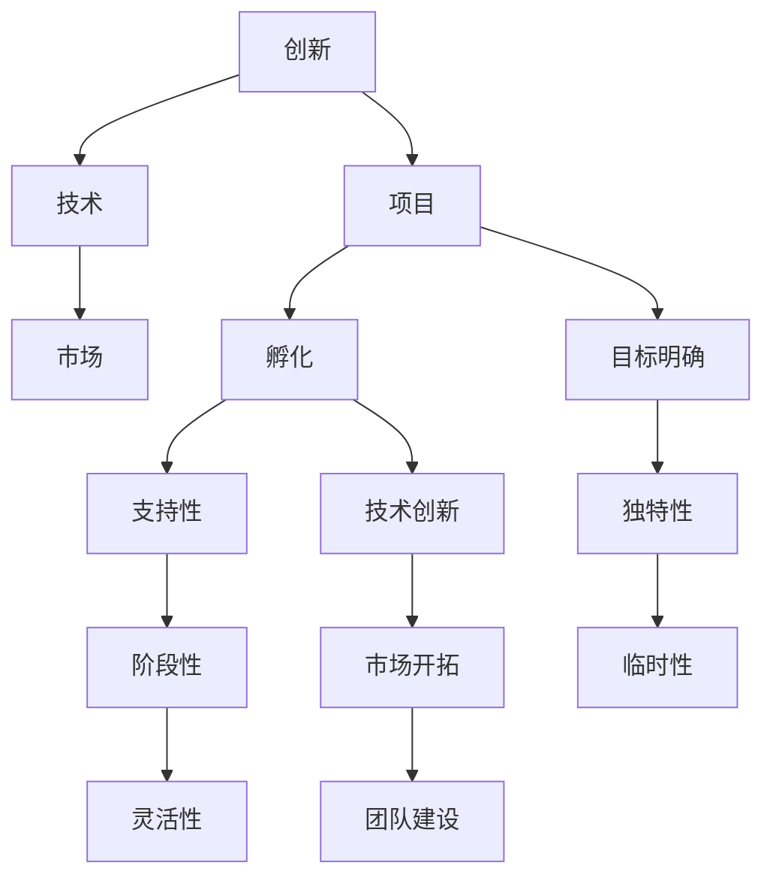

                 

### 文章标题

---

# 创新项目孵化：从技术创意到商业化的全过程

---

### 关键词

- 创新项目孵化
- 技术创意
- 商业化
- 项目管理
- 团队协作

### 摘要

本文将深入探讨创新项目孵化从技术创意到商业化的全过程。通过详细分析技术创新的发展趋势、市场需求、核心概念及其关系，以及实际项目孵化的实战案例，我们将理解项目孵化中的关键步骤和策略，从而为读者提供系统、全面的孵化指导。

---

## 封面和前言

### 书名页

**创新项目孵化：从技术创意到商业化的全过程**

### 版权页

**版权所有：AI天才研究院 & 禅与计算机程序设计艺术**

### 前言

欢迎您翻开《创新项目孵化：从技术创意到商业化的全过程》。本书旨在为广大科技工作者、创业者以及项目管理专业人士提供一本全面、系统的孵化指南。书中将通过详实的案例、深入的分析，帮助您从理论到实践，全面掌握创新项目的孵化过程。

---

## 第一部分：背景介绍

### 第1章 创新项目孵化背景

#### 1.1 技术发展趋势

##### 1.1.1 技术创新的动力

技术发展是社会进步的重要推动力，其动力来源于不断的探索与突破。现代科技发展呈现出以下趋势：

1. **数字化转型**：信息技术和数字化手段在各领域的广泛应用，推动产业升级和社会变革。
2. **人工智能崛起**：AI技术的快速发展，引领新一轮产业革命，改变着人们的生活方式和工作模式。
3. **物联网与大数据**：万物互联和大数据技术不断融合，为各个行业提供新的发展机遇。

##### 1.1.2 新技术的影响

新技术对各个领域产生了深远的影响，具体体现在：

1. **产业变革**：新技术的应用推动着传统产业向智能化、绿色化方向发展。
2. **商业模式创新**：新技术的应用催生出众多新兴商业模式，如共享经济、平台经济等。
3. **社会影响**：新技术改变了人们的生活方式和价值观念，引发社会结构和文化变革。

##### 1.1.3 创新技术的应用前景

未来，创新技术将在更多领域得到应用，带来巨大的发展潜力：

1. **医疗健康**：人工智能和生物技术在医疗健康领域的应用，有望提高诊疗效果，降低医疗成本。
2. **能源环境**：新能源技术和环保技术将为可持续发展提供解决方案。
3. **智能制造**：智能制造技术的推广，将大幅提升生产效率和产品质量。

#### 1.2 市场需求分析

##### 1.2.1 市场需求变化

市场需求变化是创新项目孵化的重要驱动力。当前，市场需求呈现以下趋势：

1. **个性化需求**：消费者对产品和服务的要求越来越高，追求个性化和定制化。
2. **智能化需求**：随着科技的进步，人们对于智能化产品和服务的需求日益增加。
3. **可持续发展需求**：全球范围内的环保意识提升，消费者更加关注产品的环保性能和可持续性。

##### 1.2.2 顾客需求分析

顾客需求是创新项目孵化的关键出发点。了解顾客需求，需要从以下几个方面进行分析：

1. **需求层次**：根据马斯洛需求层次理论，分析顾客在不同层次上的需求。
2. **需求特征**：分析顾客需求的多样性、变化性和个性化特征。
3. **需求预测**：基于大数据分析和市场调研，预测未来顾客需求的发展趋势。

##### 1.2.3 市场机会识别

识别市场机会是创新项目孵化的重要环节。以下方法可以帮助识别市场机会：

1. **SWOT分析**：通过分析企业的优势、劣势、机会和威胁，找出潜在的市场机会。
2. **五力模型**：利用波特五力模型，分析行业竞争态势，发现市场空白点。
3. **顾客访谈**：通过直接与顾客交流，了解他们的真实需求和痛点。

#### 1.3 创新创业案例分析

##### 1.3.1 成功案例分析

成功案例是创新项目孵化的重要借鉴。以下是一些成功的创新创业案例：

1. **谷歌**：以技术创新为核心，成功打造全球领先的互联网公司。
2. **特斯拉**：通过电动汽车和能源技术的创新，颠覆传统汽车行业。
3. **美团**：以大数据和人工智能技术为支撑，构建了全球领先的本地生活服务平台。

##### 1.3.2 失败案例分析

失败案例同样具有启示作用。以下是一些失败的创新创业案例：

1. **诺基亚**：未能及时适应智能手机市场变化，最终被市场淘汰。
2. **P2P网贷平台**：由于监管不到位和风险控制不足，导致大量平台倒闭。
3. **共享单车**：过度投放和运维成本过高，导致一些企业陷入困境。

##### 1.3.3 经验与启示

通过分析成功与失败案例，可以总结出以下经验和启示：

1. **技术创新**：持续技术创新是企业保持竞争力的关键。
2. **市场研究**：深入了解市场需求，准确定位产品方向。
3. **风险管理**：合理评估风险，建立完善的风险管理体系。
4. **团队协作**：高效的团队协作是项目成功的重要保障。

#### 1.4 创新项目孵化的重要性

##### 1.4.1 创新项目的定义

创新项目是指以技术创新为核心，旨在解决特定问题或满足特定需求的系统性项目。创新项目具有以下特征：

1. **创新性**：项目涉及的技术或理念具有创新性，能够带来显著的价值。
2. **系统性**：项目涉及多个方面，需要协调各种资源和力量。
3. **不确定性**：项目过程中存在较高的不确定性和风险。

##### 1.4.2 孵化的作用

孵化在创新项目中发挥着重要作用，具体体现在：

1. **降低风险**：通过孵化，可以在项目早期识别和解决潜在问题，降低项目失败的风险。
2. **资源整合**：孵化过程中，可以整合各类资源，如人才、技术、资金等，为项目提供有力支持。
3. **快速迭代**：孵化过程强调快速迭代，不断优化项目方案，提高项目成功率。

##### 1.4.3 创新项目的生命周期

创新项目通常经历以下生命周期：

1. **创意阶段**：产生项目创意，明确项目目标和可行性。
2. **孵化阶段**：进行项目孵化，完成技术验证、市场调研和团队组建等工作。
3. **成长阶段**：项目进入实际实施阶段，开展技术研发、市场推广等工作。
4. **成熟阶段**：项目取得一定市场成果，实现盈利和可持续发展。
5. **衰退阶段**：项目面临市场变化、竞争压力等挑战，可能需要进行调整或转型。

#### 1.5 本章小结

本章介绍了创新项目孵化的背景，包括技术发展趋势、市场需求、创新创业案例分析等内容。通过本章的学习，读者可以初步了解创新项目孵化的重要性和相关概念，为后续章节的学习打下基础。

---

## 第二部分：核心概念与联系

### 第2章 核心概念与联系

#### 2.1 创新

##### 2.1.1 创新的定义

创新是指通过新的思想、方法、技术或产品，为现有系统或环境带来实质性的变化和改进。创新可以分为以下几类：

1. **渐进创新**：在现有技术基础上进行改进，提高性能、降低成本或增加功能。
2. **革命性创新**：颠覆现有技术或市场，带来根本性的变化。
3. **颠覆性创新**：通过新技术或新模式，彻底改变现有市场格局。

##### 2.1.2 创新的类型

根据创新的内容和范围，创新可以分为以下几类：

1. **产品创新**：开发全新的产品或改进现有产品，满足市场需求。
2. **过程创新**：改进生产过程、服务流程或管理方法，提高效率和质量。
3. **系统创新**：整合多个产品、过程或技术，构建新的系统或解决方案。

##### 2.1.3 创新的过程

创新过程通常包括以下步骤：

1. **问题识别**：发现市场需求或现有产品的不足。
2. **创意生成**：提出各种可能的解决方案。
3. **创意筛选**：评估创意的可行性、市场潜力等。
4. **原型开发**：构建原型，验证解决方案的有效性。
5. **测试与优化**：对原型进行测试，不断优化改进。
6. **市场化**：将创新产品或服务推向市场。

#### 2.2 项目

##### 2.2.1 项目的定义

项目是指为实现特定目标，在一定时间内，通过一系列相互关联的活动完成的一项任务。项目具有以下特征：

1. **目标明确**：项目有明确的目标和预期成果。
2. **独特性**：每个项目都有其独特性，不同于日常运营工作。
3. **临时性**：项目有明确的时间限制，完成后项目即结束。

##### 2.2.2 项目的特征

项目的特征包括：

1. **复杂性**：项目涉及多个方面，需要协调各种资源和力量。
2. **不确定性**：项目过程中存在诸多不确定因素，需要灵活应对。
3. **时限性**：项目有明确的时间限制，需要按期完成。

##### 2.2.3 项目的生命周期

项目的生命周期包括以下阶段：

1. **启动阶段**：明确项目目标、范围、资源需求等。
2. **计划阶段**：制定项目计划，包括时间、成本、资源等。
3. **执行阶段**：按照计划开展项目工作，实现项目目标。
4. **监控与控制阶段**：监控项目进展，确保项目按计划进行。
5. **收尾阶段**：完成项目验收、总结和评估，项目结束。

#### 2.3 孵化

##### 2.3.1 孵化的定义

孵化是指为创新项目提供支持和资源，帮助项目从创意阶段发展到成熟阶段的过程。孵化具有以下特征：

1. **支持性**：孵化为项目提供必要的支持，如资金、技术、市场等。
2. **阶段性**：孵化过程分为多个阶段，每个阶段都有特定的目标和任务。
3. **灵活性**：孵化过程根据项目需求进行调整，以适应项目发展的变化。

##### 2.3.2 孵化的目标

孵化的目标包括：

1. **技术创新**：通过孵化，推动项目的技术创新和研发。
2. **市场开拓**：帮助项目开拓市场，实现产品或服务的商业化。
3. **团队建设**：培养项目团队，提升团队能力和协作水平。

##### 2.3.3 孵化的模式

常见的孵化模式包括：

1. **内部孵化**：企业内部设立孵化部门，为创新项目提供支持。
2. **外部孵化**：与外部孵化机构合作，为创新项目提供资源和指导。
3. **平台孵化**：搭建孵化平台，整合各类资源，为创新项目提供全方位支持。

#### 2.4 核心概念关系图

为了更好地理解创新、项目和孵化之间的关系，下面是核心概念的关系图：

#### 2.5 本章小结

本章介绍了创新、项目和孵化的核心概念，并分析了它们之间的联系。通过本章的学习，读者可以了解创新项目孵化中的重要概念，为后续章节的学习打下基础。

---

## 第三部分：技术原理

### 第3章 从技术创意到商业化的全过程

#### 3.1 技术评估

##### 3.1.1 技术评估的方法

技术评估是创新项目孵化的重要环节，主要方法包括：

1. **成本效益分析**：比较技术投入与预期收益，评估技术的经济性。
2. **风险分析**：评估技术实现过程中可能面临的风险，包括技术风险、市场风险等。
3. **可行性研究**：评估技术的可行性，包括技术实现、市场前景等。

##### 3.1.2 技术评估的步骤

技术评估通常包括以下步骤：

1. **确定评估目标**：明确评估的具体目标和范围。
2. **收集数据**：收集与评估相关的数据和信息。
3. **分析数据**：对收集到的数据进行整理和分析。
4. **撰写评估报告**：根据分析结果，撰写评估报告。

##### 3.1.3 技术评估的工具

常用的技术评估工具包括：

1. **SWOT分析**：分析技术的优势、劣势、机会和威胁。
2. **五力模型**：分析行业竞争态势，评估技术市场潜力。
3. **技术成熟度评估**：评估技术的成熟度，包括技术可行性、市场适应性等。

#### 3.2 技术选择

##### 3.2.1 技术选择的依据

技术选择应考虑以下依据：

1. **市场需求**：选择能够满足市场需求的技术。
2. **技术可行性**：评估技术的实现难度和成本。
3. **创新性**：选择具有创新性的技术，以提高项目竞争力。
4. **可持续性**：选择具有可持续发展潜力的技术，符合环保要求。

##### 3.2.2 技术选择的过程

技术选择通常包括以下过程：

1. **需求分析**：明确项目需求，确定技术方向。
2. **调研评估**：调研现有技术，评估其适用性和可行性。
3. **方案比选**：根据评估结果，比较不同技术方案的优劣。
4. **决策**：选择最佳技术方案，进行项目实施。

##### 3.2.3 技术选择的策略

技术选择策略包括：

1. **领先策略**：选择前沿技术，引领市场发展。
2. **跟随策略**：选择成熟技术，降低风险。
3. **结合策略**：结合前沿技术和成熟技术，实现优势互补。

#### 3.3 技术开发

##### 3.3.1 技术开发的策略

技术开发策略包括：

1. **自主研发**：企业独立进行技术开发，提高技术自主性。
2. **合作开发**：与合作伙伴共同进行技术开发，共享资源和成果。
3. **外部采购**：采购外部成熟技术，快速实现项目目标。

##### 3.3.2 技术开发的流程

技术开发通常包括以下流程：

1. **需求分析**：明确技术开发的需求和目标。
2. **技术调研**：调研相关技术，确定技术路线。
3. **方案设计**：设计技术开发方案，包括技术架构、开发计划等。
4. **实施与测试**：按照设计方案进行技术开发，并进行测试和验证。
5. **优化与完善**：根据测试结果，对技术进行优化和完善。

##### 3.3.3 技术开发的团队协作

技术开发团队协作至关重要，包括：

1. **明确职责**：明确团队成员的职责和分工。
2. **沟通协作**：加强团队成员之间的沟通和协作，确保项目顺利进行。
3. **知识共享**：鼓励团队成员共享知识和经验，提高团队整体能力。

#### 3.4 商业模式设计

##### 3.4.1 商业模式的概念

商业模式是指企业通过什么方式创造、传递和获取价值，包括以下要素：

1. **价值主张**：明确企业的核心产品和服务的价值。
2. **客户关系**：确定企业与客户的互动方式和关系。
3. **渠道**：确定企业产品或服务的分销渠道。
4. **客户细分**：明确企业的目标客户群体。
5. **成本结构**：分析企业的成本结构和盈利模式。

##### 3.4.2 商业模式的设计方法

商业模式设计方法包括：

1. **五力模型**：分析行业竞争态势，确定商业模式的关键要素。
2. **价值链分析**：分析企业价值链，确定商业模式的核心环节。
3. **商业模式画布**：使用商业模式画布，明确商业模式的关键要素和关系。

##### 3.4.3 商业模式的评估与优化

商业模式评估与优化包括：

1. **财务评估**：评估商业模式的盈利能力和财务状况。
2. **市场评估**：评估商业模式的竞争力和市场前景。
3. **运营评估**：评估商业模式的运营效率和风险。
4. **优化与调整**：根据评估结果，对商业模式进行优化和调整。

#### 3.5 商业化推广

##### 3.5.1 市场推广策略

市场推广策略包括：

1. **产品定位**：明确产品的市场定位和目标客户。
2. **品牌建设**：打造具有竞争力的品牌形象。
3. **渠道拓展**：拓展销售渠道，提高市场覆盖率。
4. **营销与宣传**：通过多种营销手段，提高品牌知名度和市场认知度。

##### 3.5.2 品牌建设

品牌建设包括：

1. **品牌定位**：明确品牌的市场定位和核心价值。
2. **品牌形象设计**：设计具有辨识度和吸引力的品牌形象。
3. **品牌传播**：通过各种渠道传播品牌形象，提升品牌知名度。
4. **品牌维护**：持续维护品牌形象，确保品牌价值的稳定和提升。

##### 3.5.3 营销与销售

营销与销售包括：

1. **市场调研**：了解市场需求和客户需求，制定营销策略。
2. **产品定价**：根据市场情况和竞争态势，制定合理的定价策略。
3. **促销活动**：开展促销活动，提高产品销量和市场份额。
4. **销售渠道管理**：管理销售渠道，确保销售渠道的畅通和高效。

#### 3.6 商业化案例分析

##### 3.6.1 案例分析

以下是一个商业化案例：

**案例：某企业利用人工智能技术开发智能家居产品**

1. **技术评估**：企业评估了人工智能技术的可行性，确定了智能家居产品的发展方向。
2. **技术选择**：企业选择了适合智能家居产品的人工智能技术，如语音识别、图像识别等。
3. **技术开发**：企业进行了技术研发，开发了具有智能控制的家居设备。
4. **商业模式设计**：企业设计了智能家居产品的商业模式，包括产品定价、销售渠道、品牌建设等。
5. **商业化推广**：企业通过市场推广，成功将智能家居产品推向市场，取得了良好的市场反响。

##### 3.6.2 案例启示

从该案例中，我们可以得到以下启示：

1. **技术评估与选择**：进行充分的技术评估和选择，确保技术能够满足市场需求。
2. **商业模式设计**：合理的商业模式设计有助于产品的市场化推广。
3. **市场推广**：有效的市场推广是产品成功的关键。

#### 3.7 本章小结

本章介绍了从技术创意到商业化的全过程，包括技术评估、技术选择、技术开发、商业模式设计、商业化推广等环节。通过本章的学习，读者可以了解创新项目孵化中的技术原理，为实际项目孵化提供指导。

---

## 第四部分：项目实战

### 第4章 创新项目孵化实战

#### 4.1 项目立项

##### 4.1.1 项目立项流程

项目立项是创新项目孵化的重要步骤，主要包括以下流程：

1. **项目申请**：项目负责人提交项目立项申请，包括项目背景、目标、预算等。
2. **可行性研究**：对项目进行可行性研究，评估项目的可行性、市场需求、技术风险等。
3. **项目评审**：组织项目评审，评审委员会对项目进行评审，决定是否立项。
4. **立项决策**：根据项目评审结果，作出立项决策，并制定项目计划。

##### 4.1.2 项目立项注意事项

项目立项需要注意以下事项：

1. **明确目标**：确保项目目标明确、具体，具有可衡量性。
2. **评估风险**：对项目风险进行评估，制定风险应对措施。
3. **预算控制**：合理制定项目预算，确保项目经费的合理使用。
4. **团队协作**：明确项目团队组成，确保团队成员的协作和配合。

##### 4.1.3 项目立项的评估

项目立项的评估主要包括以下几个方面：

1. **可行性评估**：评估项目的可行性，包括技术可行性、市场可行性等。
2. **效益评估**：评估项目的预期效益，包括经济效益、社会效益等。
3. **风险评估**：评估项目可能面临的风险，包括技术风险、市场风险等。
4. **资源评估**：评估项目所需的资源，包括人力、资金、技术等。

#### 4.2 团队组建

##### 4.2.1 团队成员的选择

团队成员的选择是项目成功的关键，需要考虑以下因素：

1. **专业技能**：选择具备所需专业技能的成员，确保项目的技术实现。
2. **团队合作能力**：选择具备良好团队合作能力的成员，确保团队的协作和配合。
3. **沟通能力**：选择具备良好沟通能力的成员，确保团队内部的信息畅通。
4. **责任心**：选择具备高度责任心的成员，确保项目目标的实现。

##### 4.2.2 团队协作机制

团队协作机制是确保团队高效协作的关键，包括：

1. **明确职责**：明确团队成员的职责和分工，确保任务明确、责任到人。
2. **定期会议**：定期召开团队会议，讨论项目进展、问题解决等。
3. **信息共享**：建立信息共享平台，确保团队成员之间的信息畅通。
4. **激励与约束**：建立激励与约束机制，鼓励团队成员积极参与项目，确保项目进度和质量。

##### 4.2.3 团队管理策略

团队管理策略包括：

1. **目标导向**：以项目目标为导向，确保团队的努力方向一致。
2. **沟通管理**：加强团队内部沟通，确保信息的畅通和及时反馈。
3. **风险管理**：识别和评估项目风险，制定风险应对措施。
4. **绩效评估**：对团队成员的绩效进行评估，激励团队成员的积极性和创造性。

#### 4.3 技术研发

##### 4.3.1 技术研发策略

技术研发策略包括：

1. **技术引领**：以技术为导向，保持技术创新和领先地位。
2. **持续创新**：持续进行技术创新，提升产品竞争力。
3. **合作研发**：与高校、研究机构等合作，共同进行技术研发。
4. **快速迭代**：采用快速迭代的方法，加快产品开发进度。

##### 4.3.2 技术研发流程

技术研发通常包括以下流程：

1. **需求分析**：明确项目需求，确定技术研发方向。
2. **技术调研**：调研相关技术，确定技术路线。
3. **方案设计**：设计技术研发方案，包括技术架构、开发计划等。
4. **开发与测试**：按照设计方案进行技术开发，并进行测试和验证。
5. **优化与完善**：根据测试结果，对技术进行优化和完善。

##### 4.3.3 技术研发中的问题与解决

技术研发中可能面临以下问题：

1. **技术难题**：解决技术难题需要投入大量时间和精力，可能影响项目进度。
2. **资源不足**：项目资源不足可能导致技术研发受阻。
3. **团队合作**：团队内部协作不畅可能导致技术研发效率降低。

解决这些问题的方法：

1. **加大研发投入**：增加研发经费和人力，解决技术难题。
2. **优化资源分配**：合理分配资源，确保技术研发的顺利进行。
3. **加强团队协作**：建立有效的团队协作机制，确保团队高效协作。

#### 4.4 市场推广

##### 4.4.1 市场推广策略

市场推广策略包括：

1. **产品定位**：明确产品的市场定位和目标客户。
2. **品牌建设**：打造具有竞争力的品牌形象。
3. **渠道拓展**：拓展销售渠道，提高市场覆盖率。
4. **营销与宣传**：通过多种营销手段，提高品牌知名度和市场认知度。

##### 4.4.2 市场推广计划

市场推广计划包括：

1. **市场调研**：了解市场需求和客户需求，制定市场推广策略。
2. **宣传推广**：制定宣传推广方案，包括广告投放、活动策划等。
3. **销售计划**：制定销售计划，包括销售目标、销售策略等。
4. **市场反馈**：收集市场反馈，调整市场推广策略。

##### 4.4.3 市场反馈与调整

市场推广过程中，需要不断收集市场反馈，并根据反馈进行调整：

1. **客户调研**：通过问卷调查、访谈等方式收集客户反馈。
2. **数据分析**：对市场数据进行分析，了解市场趋势和客户需求。
3. **策略调整**：根据市场反馈和数据分析，调整市场推广策略。
4. **持续优化**：持续优化市场推广策略，提高市场效果。

#### 4.5 商业化运作

##### 4.5.1 商业化模式分析

商业化模式分析包括：

1. **盈利模式**：明确项目的盈利模式，包括产品定价、销售渠道等。
2. **成本结构**：分析项目的成本结构，包括人力成本、研发成本等。
3. **市场竞争**：分析市场竞争态势，制定市场竞争策略。

##### 4.5.2 商业化流程

商业化流程包括：

1. **产品开发**：进行产品开发，确保产品满足市场需求。
2. **市场推广**：进行市场推广，提高产品知名度和市场占有率。
3. **销售渠道**：建立销售渠道，实现产品的销售。
4. **售后服务**：提供优质的售后服务，提高客户满意度和忠诚度。

##### 4.5.3 商业化风险与应对

商业化过程中可能面临以下风险：

1. **市场风险**：市场需求不足，导致产品销售不畅。
2. **技术风险**：技术问题导致产品功能不稳定或无法满足需求。
3. **竞争风险**：市场竞争激烈，导致项目难以盈利。

应对风险的策略：

1. **市场调研**：进行充分的市场调研，了解市场需求和竞争态势。
2. **技术创新**：持续进行技术创新，提高产品竞争力。
3. **风险管理**：建立完善的风险管理机制，降低风险影响。

#### 4.6 项目总结

##### 4.6.1 项目成果

项目总结中，需要明确项目的成果，包括：

1. **产品成果**：产品开发完成，满足市场需求。
2. **技术成果**：技术创新成功，具有竞争优势。
3. **市场成果**：市场推广成功，取得良好的市场反响。

##### 4.6.2 项目经验

项目总结中，需要总结项目过程中的经验教训，包括：

1. **技术创新经验**：总结技术创新的成功经验和不足。
2. **团队协作经验**：总结团队协作的成功经验和不足。
3. **市场推广经验**：总结市场推广的成功经验和不足。

##### 4.6.3 项目不足与改进

项目总结中，需要指出项目过程中的不足，并提出改进措施，包括：

1. **技术不足**：分析技术实现中的不足，提出改进方案。
2. **团队协作不足**：分析团队协作中的不足，提出改进方案。
3. **市场推广不足**：分析市场推广中的不足，提出改进方案。

#### 4.7 本章小结

本章通过实际案例，详细介绍了创新项目孵化的全过程，包括项目立项、团队组建、技术研发、市场推广、商业化运作等。通过本章的学习，读者可以了解项目孵化的实战方法和经验，为实际项目孵化提供指导。

---

## 第五部分：最佳实践

### 第5章 最佳实践

#### 5.1 项目孵化过程中的经验教训

##### 5.1.1 成功经验

在项目孵化过程中，以下成功经验值得借鉴：

1. **明确目标**：项目目标明确，有助于团队集中精力，提高项目成功率。
2. **团队协作**：建立高效的团队协作机制，确保团队成员之间的沟通畅通，提高项目效率。
3. **技术创新**：持续进行技术创新，提高项目竞争力，满足市场需求。

##### 5.1.2 失败教训

项目孵化过程中的失败教训也值得注意：

1. **市场需求分析不足**：在项目立项阶段，未能充分了解市场需求，导致项目方向偏离。
2. **风险管理不足**：在项目过程中，未能及时识别和应对风险，导致项目失败。
3. **资源不足**：在项目资源分配上出现不足，导致项目进度和质量受到影响。

##### 5.1.3 经验与启示

结合成功经验和失败教训，以下经验与启示对项目孵化具有重要指导意义：

1. **充分调研**：在项目立项前，进行充分的市场调研和需求分析，确保项目方向准确。
2. **建立风险管理机制**：在项目过程中，建立完善的风险管理机制，及时识别和应对风险。
3. **资源合理配置**：在项目资源分配上，合理配置人力、资金和技术等资源，确保项目顺利推进。

#### 5.2 实用建议和最佳实践

##### 5.2.1 项目立项

在项目立项阶段，以下建议和最佳实践有助于提高项目成功率：

1. **明确目标**：确保项目目标明确、具体，具有可衡量性。
2. **风险评估**：对项目风险进行评估，制定风险应对措施。
3. **团队协作**：明确项目团队组成，确保团队成员之间的协作和配合。

##### 5.2.2 团队组建

在团队组建阶段，以下建议和最佳实践有助于提高团队协作效率：

1. **专业素养**：选择具备专业素养的团队成员，确保项目的技术实现。
2. **沟通协作**：建立有效的沟通协作机制，确保团队内部的信息畅通。
3. **激励机制**：建立激励机制，鼓励团队成员积极参与项目，提高项目成功率。

##### 5.2.3 技术研发

在技术研发阶段，以下建议和最佳实践有助于提高项目的技术创新能力和研发效率：

1. **技术引领**：以技术为导向，持续进行技术创新。
2. **快速迭代**：采用快速迭代的方法，加快产品开发进度。
3. **团队合作**：加强团队协作，提高研发效率。

##### 5.2.4 市场推广

在市场推广阶段，以下建议和最佳实践有助于提高项目的市场竞争力：

1. **产品定位**：明确产品的市场定位和目标客户。
2. **品牌建设**：打造具有竞争力的品牌形象。
3. **多渠道推广**：采用多种渠道进行推广，提高品牌知名度和市场覆盖率。

##### 5.2.5 商业化运作

在商业化运作阶段，以下建议和最佳实践有助于提高项目的商业化水平和盈利能力：

1. **盈利模式**：明确项目的盈利模式，制定合理的定价策略。
2. **成本控制**：合理控制项目成本，提高项目的盈利能力。
3. **市场竞争**：分析市场竞争态势，制定有效的市场竞争策略。

#### 5.3 小结

本章通过总结项目孵化过程中的成功经验和失败教训，提供了实用的建议和最佳实践。通过这些经验和实践，读者可以更好地应对项目孵化过程中的挑战，提高项目的成功率。

---

## 第六部分：拓展阅读

### 第6章 拓展阅读

#### 6.1 推荐书籍

1. **《创新与企业家精神》** - 菲利普·科特勒
2. **《精益创业》** - 埃里克·莱斯
3. **《创新者的窘境》** - 克莱顿·克里斯坦森

#### 6.2 推荐文献

1. **《技术预测与评估方法研究》** - 张华
2. **《创新创业的理论与实践》** - 李明华
3. **《商业模式创新》** - 雷蒙德·A·弗农

#### 6.3 在线资源

1. **哈佛商学院开放课程** - 创新与创业
2. **斯坦福大学课程** - 项目管理与团队协作
3. **麻省理工学院开放课件** - 技术评估与风险管理

#### 6.4 总结

通过拓展阅读，读者可以深入了解创新项目孵化的相关理论和实践，为项目孵化提供更加全面的指导和支持。

---

## 结语

### 致谢

在撰写《创新项目孵化：从技术创意到商业化的全过程》的过程中，我们得到了众多专家、同行和读者的支持与帮助。特别感谢以下单位和个人的支持：

- **AI天才研究院**：为我们提供了丰富的技术资源和学术支持。
- **禅与计算机程序设计艺术**：为我们提供了独特的编程哲学和灵感。
- **广大读者**：对本书的反馈和建议，帮助我们不断完善内容。

### 结语

创新是推动社会进步的重要力量，项目孵化是实现创新的重要途径。我们希望通过本书，为广大科技工作者、创业者以及项目管理专业人士提供一本实用、系统的孵化指南。让我们携手共进，为创新事业贡献自己的力量。

---

### 作者信息

**作者：AI天才研究院/AI Genius Institute & 禅与计算机程序设计艺术/Zen And The Art of Computer Programming**

