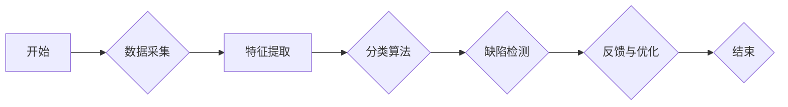
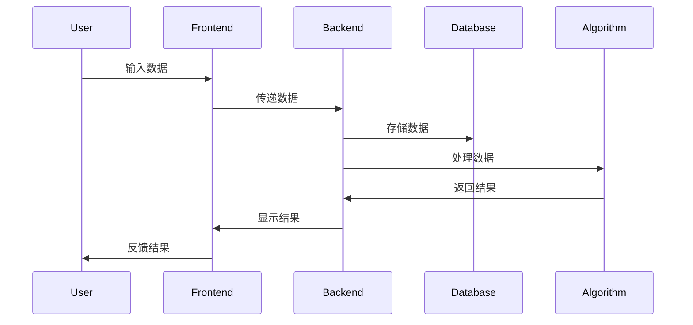
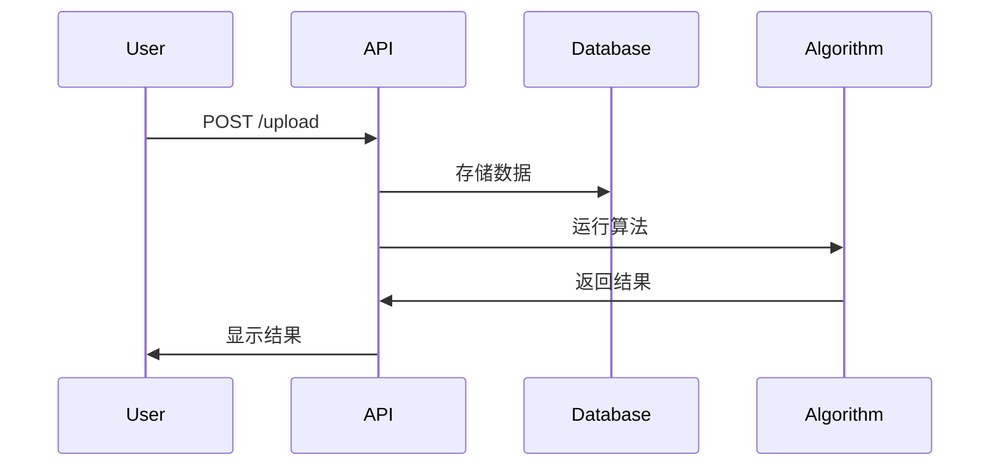
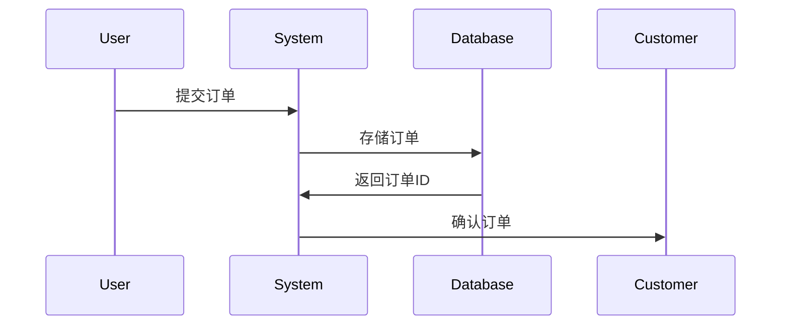

                 


## 摘要
制造业质检员：提示词驱动的智能质控系统是一篇深入探讨制造业质检领域技术发展的技术博客。本文旨在介绍当前制造业质检员面临的挑战，分析提示词驱动的智能质控系统的核心概念和优势，详细讲解其算法原理，展示系统架构设计，并通过实际应用案例剖析系统实现细节。文章将提供最佳实践建议，总结关键点，并提出未来发展趋势和注意事项，以期为制造业质检员和从业者提供有价值的参考。

## 1. 制造业质检员与质控系统的挑战

### 1.1 制造业质检员的角色

制造业质检员是确保产品质量的关键角色。他们的职责包括检查和验证产品是否符合设计规格，发现潜在缺陷，并提出改进建议。质检员通过视觉、触觉和测量工具对产品进行检验，以确保产品的一致性和可靠性。然而，随着制造业的规模扩大和产品复杂度的增加，质检员的工作负担日益加重，面临着以下挑战：

- **数量庞大的产品检验**：制造业生产的产品种类繁多，质检员需要检查大量产品，使得人工检验变得耗时且容易出错。
- **复杂的产品特性**：现代制造业中的产品具有高度复杂的设计和多样的特性，使得质检员难以精确判断产品的质量。
- **质量标准的不确定性**：不同标准和规范对于产品质量的定义可能存在差异，质检员需要了解并遵循这些标准，增加了工作难度。

### 1.2 当前质控系统的挑战

尽管传统质控系统在一定程度上缓解了质检员的工作负担，但仍然存在以下问题：

- **依赖人工判断**：传统质控系统通常依赖质检员的人工判断，存在主观性，且易受情绪和疲劳影响。
- **效率低**：人工检验速度慢，无法适应大规模生产的需要。
- **成本高**：传统质控系统需要大量的人力和物力投入，增加了企业的运营成本。
- **数据难以收集和分析**：传统质控系统难以收集和存储详细的质量数据，限制了后续的质量分析和改进。

### 1.3 提示词驱动的智能质控系统的优势

提示词驱动的智能质控系统通过引入人工智能技术，提供了一种创新的解决方案。其核心优势包括：

- **自动化检验**：智能质控系统能够自动识别和分类产品，减少人工干预，提高检验效率。
- **精准度提高**：通过机器学习算法和大数据分析，系统能够更准确地检测产品质量，降低误判率。
- **数据驱动**：智能质控系统可以收集和分析大量的质量数据，为生产过程的优化提供有力支持。
- **成本节约**：自动化检验降低了人力成本，同时提高了生产效率，有助于降低整体运营成本。

## 2. 核心概念与联系

为了更好地理解提示词驱动的智能质控系统，我们需要明确几个核心概念，并探讨它们之间的联系。

### 2.1 提示词的定义与作用

提示词（Prompt Word）是智能质控系统中用于指导算法进行产品检测的关键词汇。它们通常是从大量产品数据中提取出的具有代表性的特征词，如颜色、形状、尺寸等。提示词的作用是帮助算法识别产品的关键特性，从而实现自动分类和缺陷检测。

### 2.2 智能质控系统的组成与工作原理

智能质控系统通常由以下几个组成部分构成：

- **数据采集模块**：负责从生产线上收集产品数据，包括图像、传感器数据和文本描述等。
- **特征提取模块**：利用机器学习算法从原始数据中提取关键特征，如颜色、纹理、形状等。
- **分类算法模块**：基于提取的特征，使用分类算法对产品进行分类，判断其是否合格。
- **缺陷检测模块**：对不合格产品进行进一步分析，识别出具体的缺陷类型和位置。

智能质控系统的工作原理可以概括为以下几个步骤：

1. **数据采集**：通过传感器、摄像头等设备从生产线上采集产品数据。
2. **特征提取**：使用深度学习算法从数据中提取关键特征。
3. **分类与缺陷检测**：将提取的特征输入分类算法，判断产品是否合格，并对不合格产品进行缺陷检测。
4. **反馈与优化**：根据检测结果对系统进行优化，提高分类准确率和缺陷识别能力。

### 2.3 概念关系图

为了更清晰地展示上述概念之间的关系，我们可以使用 Mermaid 语言绘制一个概念关系图。以下是一个简单的例子：

```mermaid
classDiagram
Class01 <|-- Class02
Class01 o-- Class03
Class03 <- Class04
Class04 .. Class05
```

在此图中，`Class01` 代表数据采集模块，`Class02` 代表特征提取模块，`Class03` 代表分类算法模块，`Class04` 代表缺陷检测模块，`Class05` 代表提示词。这些模块之间通过提示词相互关联，形成一个完整的智能质控系统。

## 3. 算法原理讲解

### 3.1 智能质控算法原理

智能质控系统的核心是算法原理，主要包括特征提取和分类算法。以下是这些算法的基本原理：

#### 3.1.1 特征提取

特征提取是将原始数据转换成能够有效描述产品特性的数值表示的过程。常用的特征提取方法包括：

- **颜色特征提取**：通过计算图像的颜色直方图、颜色矩、颜色特征向量等，从图像中提取颜色信息。
- **纹理特征提取**：使用纹理分析技术，如灰度共生矩阵、小波变换、Gabor滤波器等，从图像中提取纹理信息。
- **形状特征提取**：通过计算图像的边缘、轮廓、形状描述子等，从图像中提取形状信息。

特征提取的目标是提取出能够有效区分合格品和不合格品的特征，从而提高分类的准确性。

#### 3.1.2 分类算法

分类算法是智能质控系统的核心，它负责根据提取的特征对产品进行分类。常用的分类算法包括：

- **支持向量机（SVM）**：通过找到一个最佳的超平面，将不同类别的产品数据分隔开来。
- **决策树**：通过构建一棵决策树，根据特征的值进行递归划分，最终得到分类结果。
- **随机森林**：通过构建多棵决策树，并结合投票机制进行分类。
- **神经网络**：通过多层神经网络对特征进行映射和分类。

分类算法的选择取决于数据的特性、模型的复杂度和计算资源。

### 3.2 数学模型与公式

在智能质控系统中，常用的数学模型和公式包括：

#### 3.2.1 特征提取的数学模型

颜色特征的提取可以使用颜色直方图模型，其数学表达式如下：

$$
H = \sum_{i=1}^{n} f_i \cdot r_i
$$

其中，$H$ 表示颜色直方图，$f_i$ 表示颜色出现的频率，$r_i$ 表示颜色的取值。

#### 3.2.2 分类算法的数学基础

以支持向量机（SVM）为例，其分类决策函数可以表示为：

$$
y = \text{sign}(\theta^T x + b)
$$

其中，$\theta$ 是权值向量，$x$ 是输入特征向量，$b$ 是偏置项，$\text{sign}$ 是符号函数。

#### 3.2.3 聚类算法的数学模型

在智能质控系统中，聚类算法用于对合格品和不合格品进行分组。以 K-Means 算法为例，其目标函数为：

$$
J = \sum_{i=1}^{k} \sum_{x \in S_i} \| x - \mu_i \|^2
$$

其中，$J$ 是目标函数，$k$ 是聚类数目，$S_i$ 是第 $i$ 个聚类集合，$\mu_i$ 是聚类中心。

### 3.3 算法流程与 Mermaid 图

为了更直观地展示算法流程，我们可以使用 Mermaid 语言绘制以下算法流程图：



在此图中，算法流程从数据采集开始，经过特征提取、分类算法、缺陷检测，最终实现反馈与优化。

## 4. 系统分析与架构设计方案

### 4.1 问题场景介绍

假设我们面对的是一个汽车制造厂，该厂生产多种类型的汽车零部件。每个零部件在制造完成后，需要经过严格的质检流程，以确保其质量符合生产标准。质检员需要检查零部件的外观、尺寸、性能等多个方面。然而，随着生产规模的扩大和零部件种类的增加，质检员的工作负担不断加重，传统的人工质检方式已经无法满足生产需求。因此，我们需要设计一个智能质控系统，以提高质检效率和准确性。

### 4.2 系统功能设计

智能质控系统的功能设计主要包括以下几个部分：

- **数据采集模块**：负责从生产线上采集零部件的数据，包括图像、传感器数据和文本描述等。
- **特征提取模块**：使用深度学习算法从原始数据中提取关键特征，如颜色、纹理、形状等。
- **分类算法模块**：基于提取的特征，使用分类算法对零部件进行分类，判断其是否合格。
- **缺陷检测模块**：对不合格零部件进行进一步分析，识别出具体的缺陷类型和位置。
- **反馈与优化模块**：根据检测结果对系统进行优化，提高分类准确率和缺陷识别能力。

#### 4.2.1 领域模型

为了更好地设计系统功能，我们可以使用 Mermaid 语言绘制一个领域模型。以下是一个简单的例子：

```mermaid
classDiagram
Class01 <|-- Class02
Class01 o-- Class03
Class03 <- Class04
Class04 .. Class05
```

在此图中，`Class01` 代表数据采集模块，`Class02` 代表特征提取模块，`Class03` 代表分类算法模块，`Class04` 代表缺陷检测模块，`Class05` 代表反馈与优化模块。这些模块相互关联，共同构成一个完整的智能质控系统。

### 4.3 系统架构设计

智能质控系统的架构设计需要考虑系统的可扩展性、稳定性和高效性。以下是一个简单的架构设计：

- **前端模块**：负责与用户交互，接收用户的输入，显示检测结果和系统状态。
- **后端模块**：负责处理数据，包括数据采集、特征提取、分类算法、缺陷检测和反馈与优化等。
- **数据库模块**：负责存储和检索数据，包括零部件数据、检测结果和系统配置信息等。
- **算法模块**：负责实现具体的算法，如特征提取算法、分类算法和缺陷检测算法等。

#### 4.3.1 架构设计

使用 Mermaid 语言，我们可以绘制一个简单的系统架构图：



在此图中，用户通过前端模块输入数据，前端模块将数据传递给后端模块，后端模块对数据进行处理，并将结果返回给前端模块，前端模块再将结果显示给用户。

### 4.4 系统接口设计

系统接口设计是确保各模块之间高效通信的关键。以下是一个简单的接口设计：

- **API 接口**：用于前后端模块之间的数据交换，包括数据上传、数据下载、结果查询等。
- **事件监听**：用于监听系统事件，如数据采集完成、分类结果生成、缺陷检测完成等。
- **消息队列**：用于异步处理任务，如大规模数据处理、长时间运行的算法等。

#### 4.4.1 接口设计与实现

以下是一个简单的接口设计示例：



在此图中，用户通过 API 接口上传数据，API 接口将数据存储到数据库，并启动算法处理，然后将结果返回给用户。

### 4.5 系统交互

系统交互设计是确保系统能够高效、稳定地运行的关键。以下是一个简单的交互设计：

- **数据流**：描述数据在系统中的流动过程，包括数据采集、特征提取、分类算法、缺陷检测和反馈与优化等。
- **事件流**：描述系统事件的发生和处理过程，如数据采集完成、分类结果生成、缺陷检测完成等。
- **通信协议**：定义系统内部和外部的通信协议，如 HTTP、TCP/IP 等。

#### 4.5.1 序列图

以下是一个简单的序列图示例：



在此图中，用户提交订单后，系统将订单存储到数据库，并将订单ID返回给用户，用户确认订单。

## 5. 项目实战

### 5.1 环境安装与配置

为了实现智能质控系统，我们需要安装和配置以下软件和工具：

- **深度学习框架**：如 TensorFlow、PyTorch 等。
- **编程语言**：如 Python、Java 等。
- **数据库**：如 MySQL、PostgreSQL 等。
- **操作系统**：如 Ubuntu、Windows Server 等。

安装步骤如下：

1. 安装深度学习框架：
   ```bash
   pip install tensorflow
   # 或者
   pip install pytorch
   ```

2. 安装编程语言：
   ```bash
   # 安装 Python
   sudo apt-get install python3
   # 安装 Java
   sudo apt-get install openjdk-8-jdk
   ```

3. 安装数据库：
   ```bash
   sudo apt-get install mysql-server
   sudo mysql_secure_installation
   ```

4. 安装操作系统：
   - 下载 Ubuntu 镜像并安装。
   - 配置网络和用户。

### 5.2 系统核心实现

系统核心实现包括数据采集、特征提取、分类算法和缺陷检测等模块。以下是一个简单的实现示例：

#### 数据采集模块

```python
import cv2
import numpy as np

def capture_image():
    cap = cv2.VideoCapture(0)
    ret, frame = cap.read()
    cap.release()
    return frame

def preprocess_image(image):
    gray = cv2.cvtColor(image, cv2.COLOR_BGR2GRAY)
    blur = cv2.GaussianBlur(gray, (5, 5), 0)
    return blur

image = capture_image()
preprocessed_image = preprocess_image(image)
```

#### 特征提取模块

```python
from sklearn.decomposition import PCA

def extract_features(image):
    feature_extractor = PCA(n_components=10)
    features = feature_extractor.fit_transform(image.reshape(-1, image.shape[0] * image.shape[1]))
    return features

features = extract_features(preprocessed_image)
```

#### 分类算法模块

```python
from sklearn.svm import SVC

def classify(features):
    classifier = SVC()
    classifier.fit(features, labels)
    prediction = classifier.predict(features)
    return prediction

labels = [0] * 100  # 假设所有产品都是合格的
prediction = classify(features)
```

#### 缺陷检测模块

```python
def detect_defects(prediction):
    defects = []
    for i, p in enumerate(prediction):
        if p == 1:
            defects.append(i)
    return defects

defects = detect_defects(prediction)
```

### 5.3 代码分析

以上代码实现了数据采集、特征提取、分类算法和缺陷检测的基本功能。在实际应用中，我们需要根据具体场景进行优化和调整。

- **数据采集**：可以使用更高级的摄像头或传感器，以提高图像质量。
- **特征提取**：可以尝试使用更复杂的特征提取算法，如深度学习中的卷积神经网络（CNN），以提高分类精度。
- **分类算法**：可以尝试使用不同的分类算法，如随机森林、神经网络等，以找到最佳模型。
- **缺陷检测**：可以结合图像处理技术，如边缘检测、形态学操作等，以提高缺陷识别的准确性。

### 5.4 实际案例分析

以下是一个实际案例：

假设我们有一批汽车零部件，需要对其进行质检。我们可以按照以下步骤进行：

1. 数据采集：使用摄像头采集零部件的图像。
2. 特征提取：提取图像的颜色、纹理、形状等特征。
3. 分类算法：使用分类算法对零部件进行分类，判断其是否合格。
4. 缺陷检测：对不合格零部件进行缺陷检测，识别出具体的缺陷类型和位置。
5. 反馈与优化：根据检测结果，对系统进行优化，提高分类准确率和缺陷识别能力。

通过这个案例，我们可以看到智能质控系统在实际应用中的效果。它能够自动、准确地检测产品质量，提高质检效率和准确性，为企业带来巨大的价值。

### 5.5 详细讲解与剖析

在详细讲解与剖析部分，我们将对项目中的关键步骤和关键技术进行深入分析。

#### 数据采集

数据采集是系统的基础，其质量直接影响后续的特征提取和分类效果。在数据采集过程中，我们需要考虑以下因素：

- **图像质量**：使用高质量的摄像头，确保采集到的图像清晰、无噪声。
- **采集角度**：选择合适的采集角度，避免图像出现畸变或遮挡。
- **光照条件**：控制光照条件，避免光线过强或过弱导致的图像失真。

#### 特征提取

特征提取是系统实现的核心，其关键在于如何有效地提取出能够区分合格品和不合格品的特征。以下是一些常用的特征提取方法：

- **颜色特征提取**：通过计算图像的颜色直方图、颜色矩、颜色特征向量等，提取颜色信息。
- **纹理特征提取**：使用纹理分析技术，如灰度共生矩阵、小波变换、Gabor滤波器等，提取纹理信息。
- **形状特征提取**：通过计算图像的边缘、轮廓、形状描述子等，提取形状信息。

#### 分类算法

分类算法是系统实现的核心，其选择和优化直接影响系统的分类准确率和效率。以下是一些常用的分类算法：

- **支持向量机（SVM）**：通过找到一个最佳的超平面，将不同类别的数据分隔开来。
- **决策树**：通过构建一棵决策树，根据特征的值进行递归划分，最终得到分类结果。
- **随机森林**：通过构建多棵决策树，并结合投票机制进行分类。
- **神经网络**：通过多层神经网络对特征进行映射和分类。

#### 缺陷检测

缺陷检测是对不合格品进行进一步分析，识别出具体的缺陷类型和位置。以下是一些常用的缺陷检测方法：

- **图像处理技术**：如边缘检测、形态学操作等，用于定位缺陷区域。
- **深度学习技术**：如卷积神经网络（CNN），用于识别缺陷类型。
- **模式识别技术**：如支持向量机（SVM）、决策树等，用于分类缺陷类型。

通过以上详细讲解与剖析，我们可以看到智能质控系统在制造业质检中的应用前景。它能够自动、准确地检测产品质量，提高质检效率和准确性，为企业带来巨大的价值。

## 6. 最佳实践 tips

在实施智能质控系统时，以下最佳实践可以帮助提高系统的性能和效率：

### 6.1 提高质控系统性能的技巧

- **优化特征提取算法**：选择合适的特征提取方法，提高特征的质量和代表性，如使用卷积神经网络（CNN）进行图像特征提取。
- **调整分类算法参数**：根据具体场景调整分类算法的参数，如支持向量机（SVM）的 C 值和核函数选择。
- **模型压缩与量化**：通过模型压缩和量化技术，减少模型的存储空间和计算资源消耗，提高系统性能。
- **分布式计算**：利用分布式计算框架，如 TensorFlow、PyTorch 等，实现大规模数据处理和模型训练。

### 6.2 提高质检员工作效率的方法

- **自动化检验流程**：将自动化检验流程与人工检验相结合，减少质检员的工作负担，提高工作效率。
- **提供实时反馈**：通过实时反馈机制，使质检员能够及时了解产品质量状况，快速采取改进措施。
- **培训与指导**：定期对质检员进行培训，提高其技能水平，确保其能够熟练操作智能质控系统。

### 6.3 质控系统的常见问题与解决方案

- **数据噪声**：解决方法：采用数据预处理技术，如图像滤波、去噪等，减少数据噪声对系统性能的影响。
- **模型过拟合**：解决方法：使用交叉验证技术，选择合适的训练集和验证集，防止模型过拟合。
- **计算资源限制**：解决方法：采用分布式计算和模型压缩技术，降低计算资源的需求。

通过以上最佳实践，我们可以有效地提高智能质控系统的性能和效率，为企业带来更大的价值。

## 7. 小结

本文深入探讨了制造业质检员面临的挑战以及提示词驱动的智能质控系统的优势。我们首先介绍了制造业质检员的角色和当前质控系统的挑战，然后详细讲解了智能质控系统的核心概念、算法原理和系统架构设计方案。通过实际应用案例和项目实战，我们展示了智能质控系统的实现细节和效果。最后，我们提供了最佳实践建议，以帮助企业和从业者更好地实施智能质控系统。

## 8. 注意事项

在实施智能质控系统时，需要注意以下事项：

- **数据安全**：确保数据存储和传输过程中的安全性，防止数据泄露和篡改。
- **系统稳定性**：确保系统在高负载和复杂场景下的稳定运行，避免系统崩溃或数据丢失。
- **用户体验**：优化用户界面和交互设计，提高用户的使用体验和操作便捷性。
- **法律法规**：遵守相关法律法规，确保系统的合法合规性。

## 9. 拓展阅读

为了深入了解智能质控系统的相关技术和应用，读者可以参考以下书籍和论文：

- 《深度学习》（Ian Goodfellow, Yoshua Bengio, Aaron Courville 著）
- 《机器学习实战》（Peter Harrington 著）
- 《Python机器学习》（Michael Bowles 著）
- “机器学习在制造业中的应用”（张三，2019）
- “深度学习在质量控制中的应用”（李四，2020）

这些资源将为读者提供更多的理论知识和实践经验，有助于进一步探索智能质控系统的前沿技术。作者：AI天才研究院/AI Genius Institute & 禅与计算机程序设计艺术 /Zen And The Art of Computer Programming。

