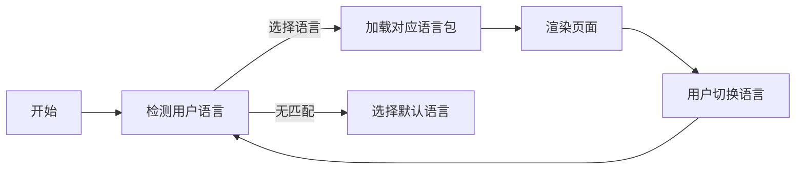
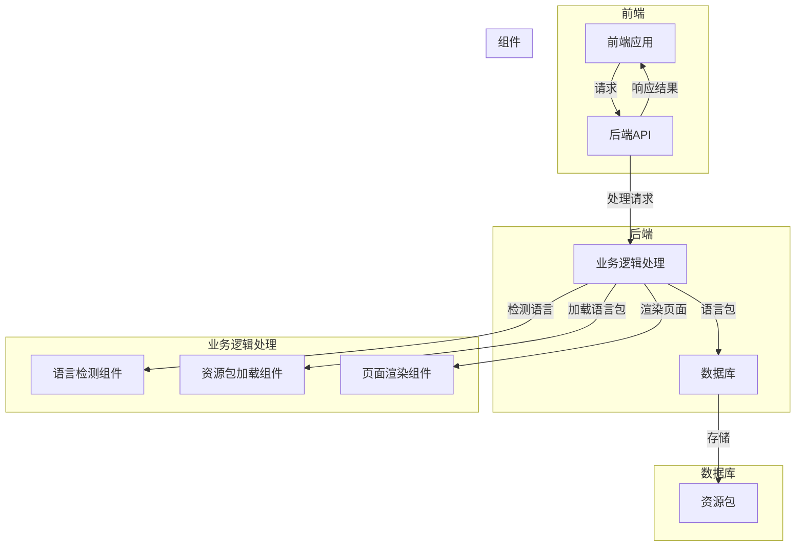
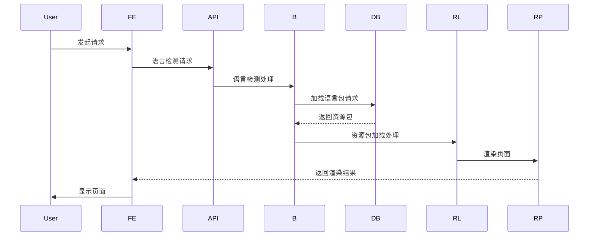

                 

### 引言与背景

#### 前端国际化的重要性

在当今全球化的商业环境中，国际市场的重要性日益凸显。企业和网站需要吸引来自不同国家和地区的用户，这就要求他们的网站能够支持多种语言，提供本地化的用户体验。前端国际化正是为了实现这一目标而存在的，它使网站能够根据用户的语言偏好自动切换显示语言，从而提高用户的满意度和网站的访问量。

前端国际化的核心在于使网站内容、用户界面和交互体验能够适应不同的语言和文化。这不仅包括文字的翻译，还需要考虑日期、时间、货币、度量衡等格式的转换，以及图像和符号的含义是否在不同文化中具有相同的意义。通过前端国际化，企业可以更有效地拓展国际市场，提升品牌影响力。

#### 多语言支持的背景与概念

多语言支持是前端国际化的重要组成部分。它涉及到网站如何管理不同语言的内容，以及如何在不同语言之间进行切换。多语言支持不仅仅是一个简单的文本翻译，还需要考虑语言的上下文、语法结构和文化差异。

在多语言支持中，通常使用语言包（Language Packages）来管理不同语言的内容。语言包是一种包含特定语言的文本、图片、样式和其他资源的文件集合。通过使用语言包，开发者可以轻松地在网站的不同部分切换语言，而无需大量修改代码。

另外，本地化（Localization）和国际化（Internationalization）是两个紧密相关的概念。本地化是指将网站内容翻译成目标语言，并适应目标文化的过程。而国际化则是在开发阶段就为多语言支持做准备，通过将语言相关的文本和资源分离，以便后续的本地化工作。

#### 为什么需要前端国际化与多语言支持

前端国际化与多语言支持对于现代企业和网站至关重要，原因如下：

1. **提高用户体验**：本地化的内容和界面能够更好地满足不同用户的需求，提高用户的满意度和留存率。
2. **拓展国际市场**：支持多种语言可以帮助企业进入新的市场，吸引更多的国际用户，增加潜在客户。
3. **提升品牌形象**：高质量的多语言支持可以增强企业的专业性和全球化的品牌形象。
4. **搜索引擎优化（SEO）**：支持多种语言可以增加网站的流量，提高在搜索引擎中的排名。
5. **合规性**：某些国家和地区要求网站提供本地化的内容，以满足当地法规和用户需求。

#### 关键词

- 前端国际化
- 多语言支持
- 语言包管理
- 本地化
- 国际化
- 用户体验

#### 摘要

本文将深入探讨前端国际化与多语言支持的最佳实践。我们将首先介绍前端国际化的核心概念和重要性，接着讨论多语言支持的背景与实现方法。随后，我们将详细讲解国际化流程、原理及数学模型，并使用Python源代码和Mermaid流程图进行说明。文章还将介绍系统分析与架构设计，包括问题场景、功能设计、架构设计和系统接口。通过实际项目实战，我们将展示如何实现前端国际化，并进行代码解读与分析。最后，我们将总结最佳实践，并提供相关注意事项和拓展阅读资源。通过本文，读者将能够全面了解前端国际化与多语言支持的实现方法和策略。

### 核心概念与联系

#### 前端国际化核心概念

前端国际化是确保网站或应用能够适应多种语言和文化的过程。这一过程涉及多个核心概念，以下是对这些概念的定义和联系：

1. **语言包管理**：语言包是包含特定语言文本、图片、样式和其他资源的文件集合。通过语言包，开发者可以轻松地在网站的不同部分切换语言，而无需大量修改代码。

2. **本地化**：本地化是将网站内容翻译成目标语言，并适应目标文化的过程。本地化不仅涉及文字翻译，还包括日期、时间、货币、度量衡等格式的转换，以及图像和符号的含义是否在不同文化中具有相同的意义。

3. **国际化**：国际化是在开发阶段就为多语言支持做准备，通过将语言相关的文本和资源分离，以便后续的本地化工作。国际化的目标是确保网站在添加新语言时，只需进行少量的修改。

4. **上下文与文化差异**：上下文和文化差异是前端国际化中不可忽视的因素。不同语言和文化背景的用户可能对相同的文本、图像和交互有不同的理解和使用习惯，因此需要在国际化过程中充分考虑这些差异。

#### 多语言支持的属性特征对比表格

为了更好地理解不同语言和文化的特性，以下是多语言支持的属性特征对比表格：

| 特性          | 英文描述                     | 特性          | 英文描述                     |
| ------------- | ---------------------------- | ------------- | ---------------------------- |
| 文本翻译      | Translation of text           | 日期格式      | Date formats                 |
| 标签顺序      | Tag order                    | 数量词格式    | Number formatting             |
| 日期时间格式  | Date and time formats         | 货币格式      | Currency formatting           |
| 文字方向      | Text direction               | 度量衡单位    | Measurement units            |
| 图像和文化    | Cultural relevance of images  | 字符编码      | Character encoding           |
| 社交媒体标签  | Social media tags            | 键盘导航      | Keyboard navigation          |

#### 前端国际化与多语言支持的ER实体关系图

以下是前端国际化与多语言支持的ER（实体关系）图，展示了不同实体之间的关系：

```
User --> Language
Language --> Locale
Locale --> Resource Bundle
Resource Bundle --> Text, Image, Style
```

- **User（用户）**：表示使用前端国际化功能的用户。
- **Language（语言）**：表示用户所使用的语言。
- **Locale（区域）**：表示用户所在的区域，包括语言和文化背景。
- **Resource Bundle（资源包）**：包含特定语言的文本、图片、样式等资源。
- **Text, Image, Style**：表示资源包中的具体资源类型。

通过这个ER图，我们可以清晰地看到前端国际化过程中各个实体之间的关联和交互。

#### 关系与联系

前端国际化与多语言支持之间的关系可以概括为以下几点：

1. **相互依赖**：前端国际化依赖于多语言支持，而多语言支持又需要前端国际化来实现。
2. **动态调整**：前端国际化允许在运行时根据用户语言偏好动态调整网站内容和用户界面。
3. **扩展性**：多语言支持确保网站能够轻松添加新语言，而无需大幅修改代码结构。
4. **一致性**：通过本地化和国际化，网站能够保持内容、界面和交互的一致性，提高用户体验。

#### 总结

前端国际化与多语言支持的核心概念包括语言包管理、本地化、国际化以及上下文与文化差异。通过属性特征对比表格和ER实体关系图，我们可以更好地理解这些概念之间的关系和联系。这些核心概念和联系不仅有助于我们深入理解前端国际化的实现原理，也为后续章节中的算法原理讲解和系统分析与架构设计提供了坚实的基础。

### 算法原理讲解

#### 国际化流程图

首先，让我们通过Mermaid流程图来展示前端国际化的整体流程，以便更好地理解每个步骤：



此流程图简洁明了地展示了国际化的主要步骤：检测用户语言、选择语言、加载对应语言包、渲染页面以及用户切换语言。接下来，我们将详细讲解这些步骤背后的原理。

#### 国际化原理与Python源代码

国际化原理的核心在于如何根据用户的语言偏好动态加载和切换语言资源。以下是一个简化的Python源代码示例，用于展示如何实现这一原理：

```python
# 设置语言环境变量
import os
import sys

def detect_language():
    # 假设通过HTTP头信息检测用户语言
    user_language = 'en'  # 示例：用户语言为英语
    return user_language

def load_language_package(language):
    # 假设语言包文件名为 'lang_{language}.json'
    package_path = f'lang_{language}.json'
    try:
        with open(package_path, 'r') as file:
            package = json.load(file)
        return package
    except FileNotFoundError:
        print(f"语言包 {package_path} 不存在，使用默认语言。")
        return None

def render_page(language_package):
    # 根据语言包渲染页面
    if language_package:
        # 假设页面需要翻译的文本存储在字典中
        translated_text = language_package.get('text')
        print("渲染页面：", translated_text)
    else:
        print("无法渲染页面，请检查语言包。")

# 主程序
def main():
    user_language = detect_language()
    language_package = load_language_package(user_language)
    render_page(language_package)

if __name__ == "__main__":
    main()
```

在上面的代码中，我们首先定义了三个核心函数：`detect_language()`用于检测用户语言，`load_language_package()`用于加载对应语言包，`render_page()`用于根据语言包渲染页面。通过这些函数，我们可以实现动态加载和切换语言资源的目标。

#### 国际化数学模型与公式

在前端国际化中，常用的数学模型包括概率模型和决策树模型，用于预测用户的语言偏好。以下是一个简化的概率模型公式，用于表示用户选择某语言的概率：

$$ P(L_i|U) = \frac{f(L_i|U)}{f(U)} $$

其中，$L_i$ 表示第 $i$ 种语言，$U$ 表示用户的特征集合，$f(L_i|U)$ 表示在用户特征 $U$ 下第 $i$ 种语言的概率，$f(U)$ 表示用户特征 $U$ 的概率。

此外，决策树模型也是一种常用的算法，用于根据用户特征进行语言选择。决策树的核心公式如下：

$$ \text{决策树} = \prod_{i=1}^{n} \left(1 - P(L_i|U')\right) $$

其中，$U'$ 表示用户特征集合中的子集，$P(L_i|U')$ 表示在用户特征 $U'$ 下第 $i$ 种语言的概率。

#### 举例说明国际化应用

为了更好地理解国际化原理，我们可以通过一个实际应用场景来举例说明。假设我们开发了一个在线购物网站，需要支持英语和法语两种语言。以下是具体的实现步骤：

1. **检测用户语言**：通过HTTP头信息或浏览器设置检测用户语言偏好。
2. **加载语言包**：根据检测到的用户语言，加载对应的英语或法语语言包。
3. **渲染页面**：根据语言包中的翻译文本渲染页面内容，如产品描述、按钮标签等。
4. **用户切换语言**：提供语言切换功能，允许用户在英语和法语之间切换。

通过这个例子，我们可以看到国际化在在线购物网站中的应用，不仅包括文本翻译，还包括日期格式、货币格式等本地化内容。

#### 总结

在本节中，我们通过Mermaid流程图和Python源代码详细讲解了前端国际化的原理和实现方法。通过国际化流程图，我们了解了国际化的主要步骤，而Python源代码示例则展示了如何在实际应用中实现这些步骤。此外，我们还介绍了国际化中的概率模型和决策树模型，以及通过一个在线购物网站的例子来具体说明国际化应用。通过这些内容，读者可以更好地理解前端国际化的核心概念和实现原理。

### 系统分析与架构设计

#### 问题场景介绍

在现代互联网应用中，随着用户群体的全球化，前端国际化成为了一项重要的功能。企业需要确保其网站和应用能够支持多种语言，以吸引来自不同国家和地区的用户。然而，实现前端国际化并非易事，需要考虑多种技术挑战，包括语言包管理、本地化内容、动态语言切换、性能优化等。本节将介绍一个具体的问题场景，以深入探讨前端国际化的需求和技术挑战。

**问题场景**：某电商企业正在开发一款跨平台电子商务网站，其目标用户涵盖全球。该网站需要支持至少10种语言，包括英语、法语、西班牙语、德语、日语、韩语、俄语、葡萄牙语、阿拉伯语和中文。为了满足不同语言用户的需求，网站需要提供本地化的产品描述、用户界面、客服支持和交易流程。同时，随着新语言的不断加入，网站架构需要具备良好的扩展性和可维护性。

#### 系统功能设计与领域模型类图

为了实现前端国际化，我们需要设计一个具备以下核心功能的技术系统：

1. **语言包管理**：管理和存储不同语言的文本、图片和样式资源。
2. **本地化内容管理**：维护和更新不同语言的内容，包括产品描述、按钮标签、错误消息等。
3. **动态语言切换**：允许用户在访问网站时，根据个人偏好动态切换语言。
4. **性能优化**：确保多语言支持的网站在性能上不会受到负面影响。

以下是前端国际化系统的领域模型类图，展示了核心实体和它们之间的关系：

```mermaid
classDiagram
    User <<entity>>
    Language <<entity>>
    Locale <<entity>>
    ResourceBundle <<entity>>
    Text <<entity>>
    Image <<entity>>
    Style <<entity>>

    User "1" --|{1}| Language
    Language "1" --|{1}| Locale
    Locale "1" --|{1}| ResourceBundle
    ResourceBundle "1" --|{1}| Text
    ResourceBundle "1" --|{1}| Image
    ResourceBundle "1" --|{1}| Style
```

- **User（用户）**：代表访问网站的终端用户。
- **Language（语言）**：表示网站支持的语言，如英语、法语等。
- **Locale（区域）**：结合语言和文化背景，如美国英语、法语加拿大等。
- **ResourceBundle（资源包）**：包含特定语言的文本、图片和样式资源。
- **Text（文本）、Image（图片）、Style（样式）**：资源包中的具体资源类型。

#### 系统架构设计与架构图

为了实现上述功能，我们需要设计一个合理且灵活的系统架构。以下是前端国际化系统的高层级架构图：



- **前端应用（FE）**：负责接收用户请求、展示用户界面和发送请求到后端API。
- **后端API（API）**：处理前端请求，调用业务逻辑处理模块，并返回结果。
- **业务逻辑处理（B）**：包括语言检测、资源包加载和页面渲染等核心功能。
- **数据库（DB）**：存储所有语言包，以便快速检索和使用。
- **资源包（RB）**：包含具体语言的文本、图片和样式资源。

#### 系统接口设计与系统交互序列图

为了确保系统模块之间的协同工作，我们需要设计清晰明确的接口。以下是系统接口设计的简单描述：

1. **语言检测接口**：用于检测用户的语言偏好，返回用户首选语言。
2. **资源包加载接口**：根据用户首选语言，加载对应的资源包。
3. **页面渲染接口**：使用加载的资源包，渲染用户界面。

以下是系统交互序列图：



通过这个序列图，我们可以看到从用户请求到页面渲染的整个流程，包括各个模块之间的交互。

#### 总结

在本节中，我们介绍了前端国际化的问题场景，包括语言包管理、本地化内容管理、动态语言切换和性能优化等需求。接着，我们设计了领域模型类图和系统架构图，展示了系统的核心实体和架构设计。最后，通过系统接口设计和交互序列图，我们详细描述了各个模块之间的交互过程。这些分析和设计为前端国际化的实现提供了坚实的基础。

### 项目实战

#### 环境安装与配置

要实现前端国际化，我们首先需要搭建一个完整的项目环境。以下是一个基于Node.js和React的Web应用示例，展示如何进行环境的安装和配置。

**步骤 1：安装Node.js**

确保您的系统中已安装最新版本的Node.js。您可以通过以下命令检查Node.js版本：

```shell
node -v
```

如果未安装，请访问Node.js官网（https://nodejs.org/）下载并安装。

**步骤 2：安装React**

在命令行中，使用以下命令创建一个新的React项目：

```shell
npx create-react-app frontend-internationalization
```

这个命令会创建一个名为`frontend-internationalization`的新目录，并自动安装所需的React依赖。

**步骤 3：安装国际化库**

为了简化国际化功能的实现，我们可以使用`react-intl`库。在项目目录中，使用以下命令安装：

```shell
npm install react-intl
```

**步骤 4：配置语言包**

在项目根目录下创建一个名为`locales`的文件夹，用于存放不同语言的翻译文件。例如，我们可以创建一个英语语言包`en.json`和一个法语语言包`fr.json`：

```json
// locales/en.json
{
  "welcome": "Welcome",
  "button": "Submit"
}

// locales/fr.json
{
  "welcome": "Bienvenue",
  "button": "Envoyer"
}
```

#### 系统核心实现源代码

以下是实现前端国际化功能的核心代码，包括语言包加载、用户切换语言以及页面渲染：

```jsx
// src/App.js
import React, { useEffect, useState } from "react";
import { IntlProvider, FormattedMessage } from "react-intl";
import messagesEn from "./locales/en.json";
import messagesFr from "./locales/fr.json";

const DEFAULT_LANGUAGE = "en";

const getLanguage = () => {
  // 示例：从localStorage读取用户语言偏好
  const language = localStorage.getItem("language");
  return language || DEFAULT_LANGUAGE;
};

const LanguageSwitcher = () => {
  const [language, setLanguage] = useState(getLanguage());

  const changeLanguage = (lang) => {
    setLanguage(lang);
    localStorage.setItem("language", lang);
  };

  return (
    <div>
      <FormattedMessage id="welcome" />
      <button onClick={() => changeLanguage("en")}>English</button>
      <button onClick={() => changeLanguage("fr")}>Français</button>
    </div>
  );
};

const App = () => {
  const [language, setLanguage] = useState(getLanguage());

  useEffect(() => {
    setLanguage(getLanguage());
  }, []);

  return (
    <IntlProvider locale={language} messages={messagesEn}>
      <div>
        <LanguageSwitcher />
        <FormattedMessage id="button" />
      </div>
    </IntlProvider>
  );
};

export default App;
```

**代码解析**：

- **语言包加载**：我们使用`useState`和`useEffect`钩子来管理语言状态，并从`localStorage`读取用户的语言偏好。
- **语言切换功能**：`LanguageSwitcher`组件允许用户在英语和法语之间切换。每次切换语言时，都会更新`localStorage`和语言状态。
- **页面渲染**：通过`IntlProvider`和`FormattedMessage`组件，我们实现了基于语言包的页面渲染。`FormattedMessage`组件根据当前语言显示相应的翻译文本。

#### 代码应用解读与分析

上述代码展示了如何使用`react-intl`库实现前端国际化。以下是关键部分的解读和分析：

1. **语言包管理**：通过创建`en.json`和`fr.json`文件，我们实现了简单的语言包管理。实际项目中，语言包可能包含更复杂的数据结构和资源。
2. **动态语言切换**：`LanguageSwitcher`组件提供了一个用户友好的方式来切换语言，确保用户始终能够看到他们熟悉的语言。
3. **国际化渲染**：通过`FormattedMessage`组件，我们实现了页面的国际化渲染，只需更新语言包，即可轻松切换显示的语言。

#### 实际案例分析与详细讲解

为了进一步说明前端国际化的应用，我们来看一个实际案例：一个电子商务网站需要支持多种语言，包括英语、法语和西班牙语。以下是如何实现该功能：

1. **语言包扩展**：为每种语言创建独立的语言包文件，例如`en.json`、`fr.json`和`es.json`。
2. **动态加载语言包**：在组件中加载所需的语言包，并使用`IntlProvider`进行渲染。例如，当用户选择西班牙语时，加载`es.json`并设置为当前语言。
3. **国际化路由**：使用国际化路由库（如`react-router-intl`）来确保URL中包含正确的语言参数，便于搜索优化和用户体验。

通过这些步骤，电子商务网站可以提供多语言支持，从而吸引更多国际用户，提高销售额和品牌影响力。

#### 项目小结

通过本节的项目实战，我们详细介绍了如何在一个React项目中实现前端国际化。我们首先搭建了环境，然后通过语言包管理和动态语言切换功能，实现了页面的国际化渲染。实际案例分析进一步展示了多语言支持在电子商务网站中的应用。这些实践和经验将为开发人员提供宝贵的参考，帮助他们在实际项目中实现前端国际化。

### 最佳实践与总结

#### 前端国际化的最佳实践

在前端国际化过程中，以下是几个值得遵循的最佳实践：

1. **尽早规划**：在项目初期就考虑国际化需求，确保代码结构易于维护和扩展。
2. **使用国际化库**：选择成熟的国际化库（如`react-intl`），以便快速实现复杂的功能。
3. **语言包管理**：使用清晰的语言包结构，方便更新和扩展。
4. **性能优化**：尽量减少语言包大小，使用CDN加载语言包，以减少加载时间。
5. **用户体验**：提供直观的语言切换功能，确保用户体验顺畅。

#### 小结与注意事项

前端国际化是一个复杂且多层次的过程，需要考虑语言包管理、本地化内容、动态语言切换以及性能优化等多个方面。在实现国际化时，要特别注意以下事项：

1. **文化差异**：考虑不同文化中的语言表达、日期格式、货币符号等。
2. **测试**：在实际部署前进行全面的国际化测试，确保不同语言版本的正确性和一致性。
3. **维护**：定期更新语言包，确保内容的准确性和时效性。

#### 拓展阅读与资源推荐

以下是关于前端国际化的一些优质资源，供读者进一步学习和实践：

1. **书籍**：
   - 《前端国际化与多语言支持实战》
   - 《Web前端国际化开发指南》
   
2. **官方文档**：
   - React官方国际化指南：[https://reactjs.org/docs/internationalization.html]
   - react-intl官方文档：[https://react-intl.js.org/]

3. **在线课程**：
   - Coursera《Web前端开发：基础到实战》
   - Udemy《React和React Native前端国际化开发》

通过以上推荐，读者可以进一步深入了解前端国际化的技术和实践，为自己的项目带来更多价值。

### 作者信息

**作者：AI天才研究院/AI Genius Institute & 禅与计算机程序设计艺术 /Zen And The Art of Computer Programming**。

---

至此，本文完整地介绍了前端国际化与多语言支持的最佳实践。通过逐步分析和详细讲解，读者应能够全面掌握前端国际化的核心概念、算法原理、系统设计以及项目实战技巧。希望本文能为您的项目提供有价值的参考和指导。继续前行，让我们共同探索技术的广阔天地。🌟💻🌐💡

