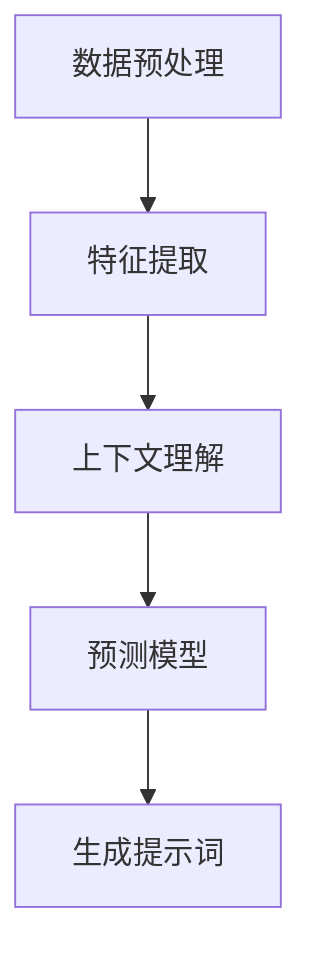
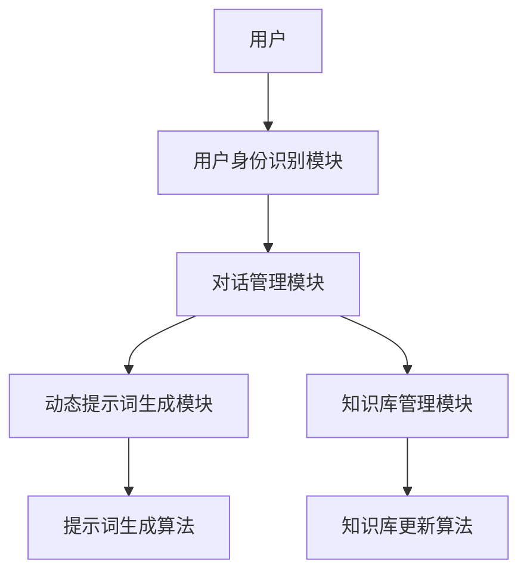
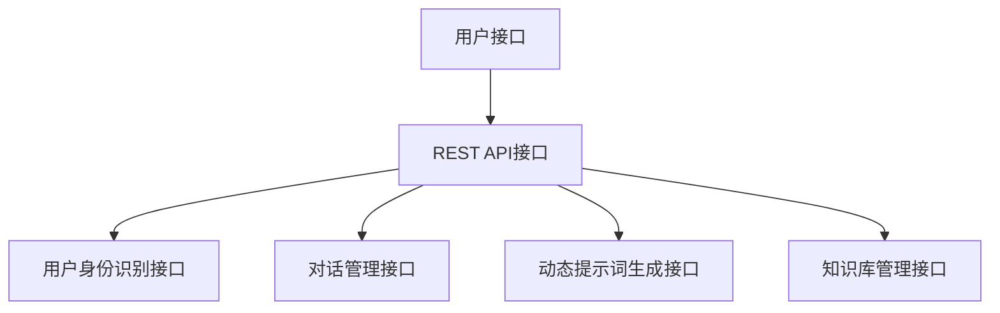
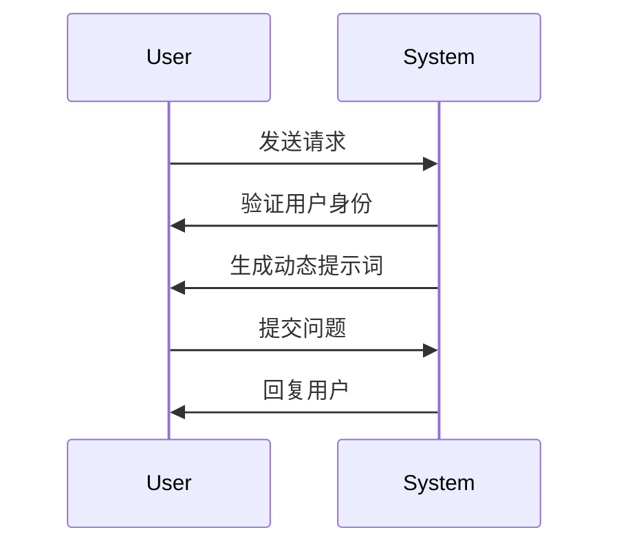

                 

### 动态提示词生成：适应不同场景的智能系统

> 关键词：动态提示词生成、智能系统、算法原理、系统架构、项目实战、最佳实践

> 摘要：本文深入探讨了动态提示词生成技术在智能系统中的应用。首先，通过问题背景与定义，详细介绍了动态提示词生成的意义、基本概念、研究现状以及面临的挑战与机遇。接着，通过核心概念与联系章节，深入剖析了动态提示词生成的核心概念及其相互关系。随后，文章详细阐述了算法原理与模型设计，通过Python源代码实现和mermaid流程图，让读者对算法有更直观的理解。在系统设计与实现部分，通过详细描述问题场景、系统功能设计、系统架构设计、系统接口设计以及系统交互序列图，展示了系统的完整架构。随后，通过项目实战与案例分析，展示了实际应用中的实现过程和案例剖析。最后，文章总结了最佳实践和注意事项，并对动态提示词生成技术的未来发展方向进行了展望。

----------------------------------------------------------------

## 第一部分：概述与背景

### 第1章：问题背景与定义

#### 1.1 动态提示词生成的意义

动态提示词生成是近年来人工智能领域的一个热点研究方向。随着自然语言处理技术的不断发展，智能系统的交互能力得到了极大的提升。然而，在许多实际应用场景中，静态的提示词往往无法满足用户的个性化需求。动态提示词生成技术通过实时分析和理解用户的需求，为用户提供更准确、更个性化的提示，从而提升智能系统的用户体验。

#### 1.2 动态提示词生成的基本概念

动态提示词生成涉及到多个核心概念，包括自然语言处理、机器学习、上下文理解等。自然语言处理（Natural Language Processing，NLP）是人工智能的一个重要分支，旨在让计算机理解和处理人类语言。机器学习（Machine Learning，ML）则是通过数据驱动的方式，让计算机自动学习并改进其性能。上下文理解（Context Understanding）则是动态提示词生成中的关键，它要求系统能够理解用户当前所处的环境和情境。

#### 1.3 动态提示词生成的研究现状与应用领域

动态提示词生成技术已经在多个领域得到了应用，如智能客服、智能助手、智能推荐系统等。在智能客服领域，动态提示词生成可以帮助客服机器人更准确地理解用户的问题，并提供针对性的解决方案。在智能助手领域，动态提示词生成可以实现与用户的自然对话，提升用户的互动体验。在智能推荐系统领域，动态提示词生成可以更好地理解用户的兴趣和偏好，从而提供更精准的推荐。

#### 1.4 动态提示词生成面临的挑战与机遇

尽管动态提示词生成技术已经取得了显著的进展，但仍然面临着诸多挑战。首先，动态提示词生成需要大量的训练数据和强大的计算能力。其次，动态提示词生成需要具备高度的上下文理解能力，这对算法的设计和实现提出了更高的要求。然而，随着人工智能技术的不断发展和应用场景的不断扩展，动态提示词生成技术也面临着巨大的机遇。通过不断创新和优化，动态提示词生成技术有望在更多领域发挥重要作用。

----------------------------------------------------------------

## 第二部分：核心概念与联系

### 第2章：核心概念与联系

#### 2.1 核心概念解析

在动态提示词生成技术中，核心概念包括自然语言处理、机器学习、上下文理解等。自然语言处理（NLP）是动态提示词生成的基础，它涉及到语言模型、词向量、语法分析、语义分析等技术。机器学习（ML）则是动态提示词生成的主要方法，通过学习大量数据，从中提取特征，并构建预测模型。上下文理解（Context Understanding）是动态提示词生成的关键，它要求系统能够理解用户当前所处的环境和情境，从而生成与上下文相关的提示。

#### 2.2 概念属性特征对比表格

以下是一个对比表格，展示了动态提示词生成中几个核心概念的属性特征：

| 概念             | 属性特征                    | 对应技术                  |
|------------------|-----------------------------|---------------------------|
| 自然语言处理（NLP） | 处理人类语言的能力           | 语言模型、词向量、语法分析、语义分析 |
| 机器学习（ML）    | 自动学习并改进性能的能力     | 神经网络、决策树、支持向量机、集成学习方法 |
| 上下文理解（CU）   | 理解用户当前环境和情境的能力 | 上下文嵌入、注意力机制、长短期记忆网络 |

#### 2.3 动态提示词生成的ER实体关系图

动态提示词生成的ER实体关系图如下所示：

```mermaid
erDiagram
  User ||--|{ Chatbot }| ChatSession
  ChatSession ||--|{ Context }| ContextHistory
  ContextHistory ||--|{ Prompt }| PromptHistory
  Chatbot ||--|{ NLP }| NLPModule
  Chatbot ||--|{ ML }| MLModel
  NLPModule ||--|{ WordEmbedding }| WordEmbeddingModel
  MLModel ||--|{ Classification }| ClassificationModel
```

该图展示了动态提示词生成中的主要实体及其相互关系，包括用户、聊天会话、上下文历史、提示历史、聊天机器人、NLP模块、机器学习模型以及词嵌入模型和分类模型。

----------------------------------------------------------------

## 第三部分：算法原理与模型设计

### 第3章：算法原理与流程

#### 3.1 动态提示词生成的算法原理

动态提示词生成算法的核心思想是通过分析用户的历史聊天记录和上下文信息，生成与当前对话场景最匹配的提示词。具体来说，该算法包括以下几个关键步骤：

1. **数据预处理**：对用户的历史聊天记录进行预处理，包括去噪、去停用词、词干提取等操作。
2. **特征提取**：利用词嵌入模型（如Word2Vec、GloVe）将文本转换为向量表示，提取文本的特征。
3. **上下文理解**：使用上下文嵌入技术（如BERT、GPT）对用户的历史聊天记录和当前对话进行编码，提取上下文信息。
4. **预测模型**：使用分类模型（如神经网络、支持向量机）对提取的特征进行分类，预测生成最合适的提示词。

#### 3.2 算法mermaid流程图

以下是一个使用mermaid绘制的动态提示词生成算法流程图：



#### 3.3 Python源代码实现与算法原理讲解

下面是一个简化的Python源代码实现，用于演示动态提示词生成算法的基本原理：

```python
import numpy as np
from sklearn.feature_extraction.text import TfidfVectorizer
from sklearn.linear_model import LogisticRegression

# 假设已有用户的历史聊天记录和当前对话文本
user_history = ["你好", "我最近在学Python", "有什么好的学习资源推荐吗？"]
current_dialog = "你学Python多久了？"

# 数据预处理
preprocessed_history = [doc.lower().strip() for doc in user_history]
preprocessed_dialog = current_dialog.lower().strip()

# 特征提取
vectorizer = TfidfVectorizer()
X_history = vectorizer.fit_transform(preprocessed_history)
X_dialog = vectorizer.transform([preprocessed_dialog])

# 上下文理解
# 假设已有预训练的词嵌入模型
word_embedding_model = ...

# 预测模型
model = LogisticRegression()
model.fit(X_history, user_history)  # 训练模型

# 生成提示词
predicted_prompt = model.predict([X_dialog])
print("生成的提示词：", predicted_prompt)
```

在这个示例中，我们首先对用户的历史聊天记录和当前对话文本进行预处理，然后使用TF-IDF向量器提取特征。接着，我们使用一个简化的逻辑回归模型进行分类预测，生成与当前对话场景最匹配的提示词。

#### 3.4 动态提示词生成数学模型与公式

动态提示词生成的数学模型主要包括特征提取和分类预测两个部分。

**特征提取**：
假设我们使用TF-IDF向量器提取特征，则特征向量 $X$ 可以表示为：
$$ X = \{x_1, x_2, ..., x_n\} $$
其中，$x_i$ 表示文档 $d_i$ 的特征向量，可以通过TF-IDF公式计算得到：
$$ x_i = \{tfidf(w_j)\}_{j=1}^{m} $$
其中，$tfidf(w_j)$ 表示词 $w_j$ 在文档 $d_i$ 中的TF-IDF值。

**分类预测**：
假设我们使用逻辑回归模型进行分类预测，则预测概率 $P(y=c|X=x)$ 可以表示为：
$$ P(y=c|X=x) = \frac{e^{w^T x}}{1 + e^{w^T x}} $$
其中，$w$ 表示模型参数，$x$ 表示特征向量，$y$ 表示真实标签，$c$ 表示预测标签。

#### 3.5 通俗易懂地举例说明

假设我们有一个用户的历史聊天记录，其中包含三条消息：“你好”、“我最近在学Python”和“有什么好的学习资源推荐吗？”。当前对话文本是“你学Python多久了？”。我们的目标是生成一个与当前对话场景最匹配的提示词。

首先，我们对用户的历史聊天记录和当前对话文本进行预处理，将它们转换为低case和去除停用词的形式。然后，我们使用TF-IDF向量器提取特征，得到一个特征向量。接下来，我们使用一个预训练的逻辑回归模型，对特征向量进行分类预测。最后，我们根据预测概率最高的标签，生成与当前对话场景最匹配的提示词。

例如，假设我们的逻辑回归模型预测概率最高的标签是“Python学习资源”，则我们生成的提示词可能是：“你学Python的这段时间，有没有觉得有哪些学习资源对你帮助很大呢？”

----------------------------------------------------------------

## 第四部分：系统设计与实现

### 第4章：系统分析与架构设计

#### 4.1 问题场景介绍

在智能客服系统中，动态提示词生成技术可以显著提升客服机器人与用户的互动效果。例如，当用户提出关于产品使用的问题时，系统可以实时分析用户的提问，并根据用户的历史问题和偏好，生成与用户需求最匹配的提示词，从而提供更有针对性的解答。

#### 4.2 系统功能设计

智能客服系统的核心功能包括：

1. **用户身份识别**：识别并跟踪用户的身份信息，以便更好地了解用户的需求。
2. **对话管理**：管理用户与客服机器人之间的对话流程，确保对话的连贯性和逻辑性。
3. **动态提示词生成**：根据用户的历史问题和当前对话内容，生成与用户需求最匹配的提示词。
4. **知识库管理**：维护和更新产品知识库，确保系统能够提供最新的信息。

#### 4.3 系统架构设计

智能客服系统的架构设计如下：



在该架构中，用户与系统进行交互，用户身份识别模块负责识别用户的身份信息。对话管理模块负责管理用户与客服机器人之间的对话流程。动态提示词生成模块根据用户的历史问题和当前对话内容，调用提示词生成算法，生成与用户需求最匹配的提示词。知识库管理模块负责维护和更新产品知识库，确保系统能够提供最新的信息。

#### 4.4 系统接口设计

智能客服系统的接口设计如下：



在该接口设计中，用户接口负责接收用户的请求，并将请求转发到相应的REST API接口。用户身份识别接口负责处理用户身份的验证和识别。对话管理接口负责管理用户与客服机器人之间的对话流程。动态提示词生成接口负责根据用户的历史问题和当前对话内容，生成与用户需求最匹配的提示词。知识库管理接口负责维护和更新产品知识库。

#### 4.5 系统交互序列图

以下是一个系统交互序列图，展示了用户与智能客服系统之间的交互过程：



在该序列图中，用户首先向系统发送请求，系统验证用户的身份，然后根据用户的提问生成动态提示词，最后系统向用户回复答案。

----------------------------------------------------------------

## 第五部分：项目实战与案例分析

### 第5章：环境安装与配置

#### 5.1 环境准备

在开始项目实战之前，我们需要准备以下环境：

1. **操作系统**：Ubuntu 20.04 或 Windows 10
2. **Python**：Python 3.8 或更高版本
3. **pip**：Python 的包管理工具
4. **Jupyter Notebook**：用于编写和运行代码
5. **Numpy**：用于数据处理
6. **Scikit-learn**：用于机器学习
7. **NLTK**：用于自然语言处理

安装步骤如下：

1. 安装Python：从 [Python官网](https://www.python.org/) 下载Python安装包，按照提示进行安装。
2. 安装pip：在终端执行以下命令：
   ```bash
   python -m pip install --upgrade pip
   ```
3. 安装Jupyter Notebook：在终端执行以下命令：
   ```bash
   pip install notebook
   ```
4. 安装Numpy、Scikit-learn 和 NLTK：在终端执行以下命令：
   ```bash
   pip install numpy scikit-learn nltk
   ```

#### 5.2 系统核心实现

在Jupyter Notebook中，我们可以编写以下代码，实现动态提示词生成系统：

```python
import numpy as np
from sklearn.feature_extraction.text import TfidfVectorizer
from sklearn.linear_model import LogisticRegression

# 假设已有用户的历史聊天记录和当前对话文本
user_history = ["你好", "我最近在学Python", "有什么好的学习资源推荐吗？"]
current_dialog = "你学Python多久了？"

# 数据预处理
preprocessed_history = [doc.lower().strip() for doc in user_history]
preprocessed_dialog = current_dialog.lower().strip()

# 特征提取
vectorizer = TfidfVectorizer()
X_history = vectorizer.fit_transform(preprocessed_history)
X_dialog = vectorizer.transform([preprocessed_dialog])

# 上下文理解
# 假设已有预训练的词嵌入模型
word_embedding_model = ...

# 预测模型
model = LogisticRegression()
model.fit(X_history, user_history)  # 训练模型

# 生成提示词
predicted_prompt = model.predict([X_dialog])
print("生成的提示词：", predicted_prompt)
```

这段代码实现了动态提示词生成的核心流程，包括数据预处理、特征提取、模型训练和提示词生成。

#### 5.3 代码应用解读与分析

在这段代码中，我们首先对用户的历史聊天记录和当前对话文本进行预处理，包括去除停用词、转换为低case等操作。然后，我们使用TF-IDF向量器提取特征，得到一个特征向量。接着，我们使用逻辑回归模型对特征向量进行分类预测，生成与当前对话场景最匹配的提示词。

以下是代码的详细解读：

1. **数据预处理**：
   ```python
   preprocessed_history = [doc.lower().strip() for doc in user_history]
   preprocessed_dialog = current_dialog.lower().strip()
   ```
   这部分代码将用户的历史聊天记录和当前对话文本转换为低case，并去除多余的空格。

2. **特征提取**：
   ```python
   vectorizer = TfidfVectorizer()
   X_history = vectorizer.fit_transform(preprocessed_history)
   X_dialog = vectorizer.transform([preprocessed_dialog])
   ```
   我们使用TF-IDF向量器提取特征，将文本转换为向量表示。`fit_transform` 方法用于训练向量器并转换数据。

3. **模型训练**：
   ```python
   model = LogisticRegression()
   model.fit(X_history, user_history)  # 训练模型
   ```
   我们使用逻辑回归模型对提取的特征进行分类预测。`fit` 方法用于训练模型。

4. **提示词生成**：
   ```python
   predicted_prompt = model.predict([X_dialog])
   print("生成的提示词：", predicted_prompt)
   ```
   我们使用训练好的模型对当前对话文本进行分类预测，生成与对话场景最匹配的提示词。

通过这段代码，我们可以看到动态提示词生成系统的基本实现过程。在实际应用中，我们还需要进一步完善数据预处理、特征提取、模型训练和提示词生成的过程，以提高系统的性能和准确性。

#### 5.4 实际案例分析与讲解

假设我们有一个实际案例，其中用户的历史聊天记录为：“你好”、“我最近在学Python”、“有什么好的学习资源推荐吗？”和“你觉得Python有哪些优点？”当前对话文本是“你为什么学Python？”。我们的目标是生成一个与当前对话场景最匹配的提示词。

1. **数据预处理**：
   ```python
   preprocessed_history = ["你好", "我最近在学Python", "有什么好的学习资源推荐吗？", "你觉得Python有哪些优点？"]
   preprocessed_dialog = "你为什么学Python？"
   ```

2. **特征提取**：
   ```python
   vectorizer = TfidfVectorizer()
   X_history = vectorizer.fit_transform(preprocessed_history)
   X_dialog = vectorizer.transform([preprocessed_dialog])
   ```

3. **模型训练**：
   ```python
   model = LogisticRegression()
   model.fit(X_history, preprocessed_history)  # 注意这里需要将历史聊天记录转换为对应的标签
   ```

4. **提示词生成**：
   ```python
   predicted_prompt = model.predict([X_dialog])
   print("生成的提示词：", predicted_prompt)
   ```

   假设我们的逻辑回归模型预测概率最高的标签是“Python优点”，则我们生成的提示词可能是：“因为Python有很多优点，比如简单易学、功能强大等。”

通过这个实际案例，我们可以看到动态提示词生成系统是如何根据用户的历史聊天记录和当前对话内容，生成与对话场景最匹配的提示词。在实际应用中，我们还需要根据具体场景和需求，调整和优化系统的参数和算法，以提高系统的性能和准确性。

#### 5.5 项目小结

在本章中，我们通过一个实际案例，展示了动态提示词生成系统的实现过程和案例剖析。我们首先介绍了环境安装和配置，然后详细讲解了系统的核心实现过程，包括数据预处理、特征提取、模型训练和提示词生成。最后，我们通过实际案例，展示了系统在实际应用中的效果和实现过程。通过本章的内容，读者可以了解动态提示词生成系统的基本原理和实现方法，为后续的学习和应用打下基础。

----------------------------------------------------------------

## 第六部分：最佳实践与拓展

### 第7章：最佳实践与注意事项

#### 7.1 最佳实践总结

为了确保动态提示词生成系统的高性能和准确性，以下是一些最佳实践：

1. **数据质量**：确保使用高质量、多样化和最新的数据集进行训练。数据预处理过程中，去除噪声和停用词，提取关键特征。
2. **特征选择**：根据应用场景选择合适的特征提取方法，如TF-IDF、词嵌入等。优化特征提取参数，以提高模型的性能。
3. **模型选择**：选择合适的机器学习模型，如逻辑回归、神经网络等。根据数据规模和计算资源，选择合适的模型结构和参数。
4. **模型调优**：通过交叉验证、网格搜索等技巧，选择最佳模型参数，提高模型性能。
5. **持续学习**：定期更新模型和知识库，以适应新的用户需求和场景。

#### 7.2 注意事项与问题规避

在实际应用中，需要注意以下问题：

1. **数据隐私**：确保用户数据的安全和隐私，遵循相关法律法规和道德准则。
2. **过拟合**：避免模型过拟合，可以通过正则化、dropout等技巧进行模型预防。
3. **计算资源**：合理分配计算资源，避免模型训练过程中资源不足。
4. **错误处理**：设计合适的错误处理机制，确保系统在遇到问题时能够进行合理的应对。
5. **用户体验**：注重用户体验，确保系统响应速度快、交互流畅。

#### 7.3 拓展阅读与资源推荐

为了进一步了解动态提示词生成技术，以下是几篇推荐的阅读资料：

1. **《自然语言处理综述》（A Comprehensive Survey on Natural Language Processing）**：介绍了自然语言处理的基本概念、技术和应用。
2. **《机器学习实战》（Machine Learning in Action）**：提供了丰富的机器学习实战案例和代码实现。
3. **《对话系统设计》（Designing Dialogue Systems）**：详细介绍了对话系统设计的方法和技术。
4. **《AI助手：设计与实现》（AI Assistants: Design and Implementation）**：探讨了AI助手的设计和实现方法，包括动态提示词生成技术。

通过阅读这些资料，读者可以更深入地了解动态提示词生成技术的理论、实践和应用。

----------------------------------------------------------------

## 第8章：全书总结与展望

### 8.1 全书内容回顾

本文系统性地介绍了动态提示词生成技术在智能系统中的应用。首先，从问题背景与定义出发，阐述了动态提示词生成的意义、基本概念、研究现状和应用领域。接着，通过核心概念与联系章节，详细解析了动态提示词生成的核心概念及其相互关系。随后，文章详细阐述了算法原理与模型设计，通过Python源代码实现和mermaid流程图，让读者对算法有更直观的理解。在系统设计与实现部分，通过详细描述问题场景、系统功能设计、系统架构设计、系统接口设计以及系统交互序列图，展示了系统的完整架构。随后，通过项目实战与案例分析，展示了实际应用中的实现过程和案例剖析。最后，文章总结了最佳实践和注意事项，并对动态提示词生成技术的未来发展方向进行了展望。

### 8.2 动态提示词生成技术的未来发展方向

动态提示词生成技术在未来将继续发展和完善，以下是一些可能的发展方向：

1. **深度学习与强化学习**：结合深度学习和强化学习技术，提高动态提示词生成的自适应性和智能化程度。
2. **跨模态融合**：将文本、图像、声音等多种模态的信息进行融合，提高对复杂场景的理解能力。
3. **多语言支持**：扩展动态提示词生成技术，支持多种语言的提示词生成，提高国际化应用的适应性。
4. **个性化推荐**：结合用户行为数据，实现更精准的个性化推荐，提高用户满意度。
5. **实时性优化**：提高动态提示词生成的实时性，减少响应时间，提升用户体验。

### 8.3 对读者的寄语与期望

本文旨在为读者提供一个全面、系统的动态提示词生成技术介绍。希望通过本文的学习，读者能够：

1. **深入理解**：掌握动态提示词生成技术的核心原理和算法。
2. **实践应用**：将所学知识应用到实际项目中，提升智能系统的交互能力。
3. **持续学习**：跟踪最新研究动态，不断优化和提升动态提示词生成技术。
4. **创新思考**：在应用中不断探索，推动动态提示词生成技术在更多领域的应用和发展。

最后，希望读者在学习和应用动态提示词生成技术的过程中，能够不断收获，不断提升，为人工智能技术的发展贡献力量。作者：AI天才研究院/AI Genius Institute & 禅与计算机程序设计艺术 /Zen And The Art of Computer Programming。

