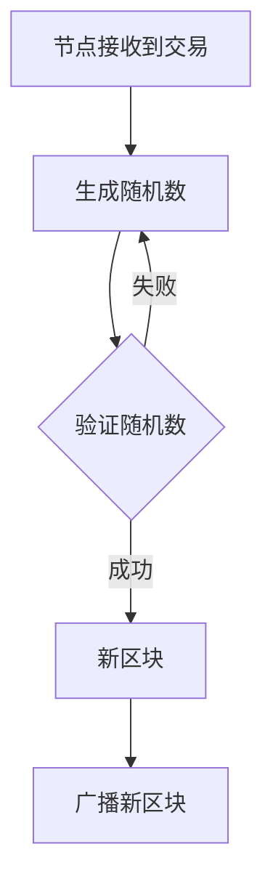
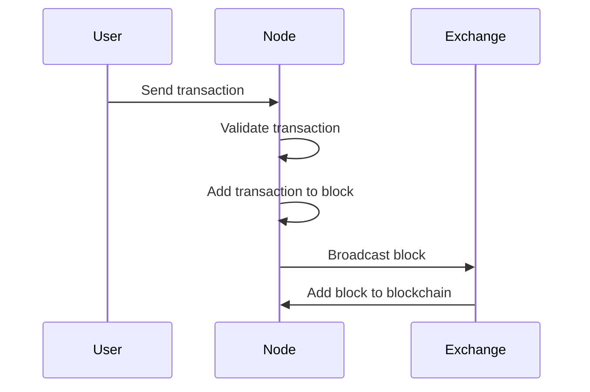
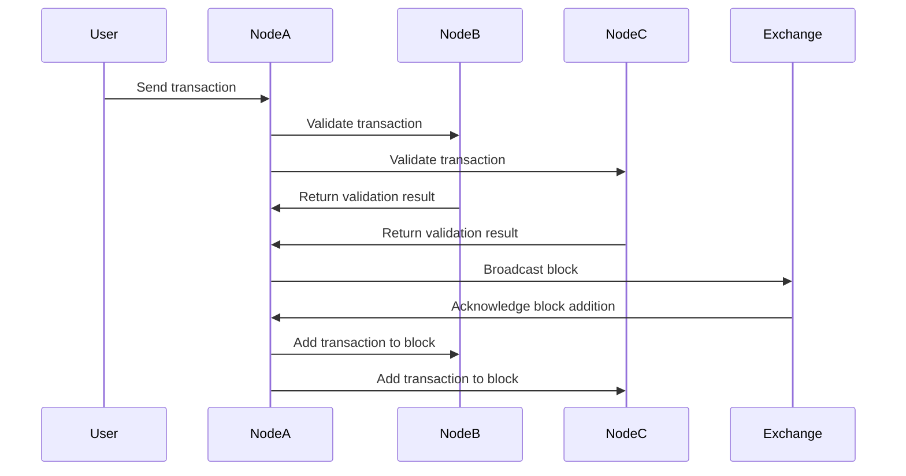
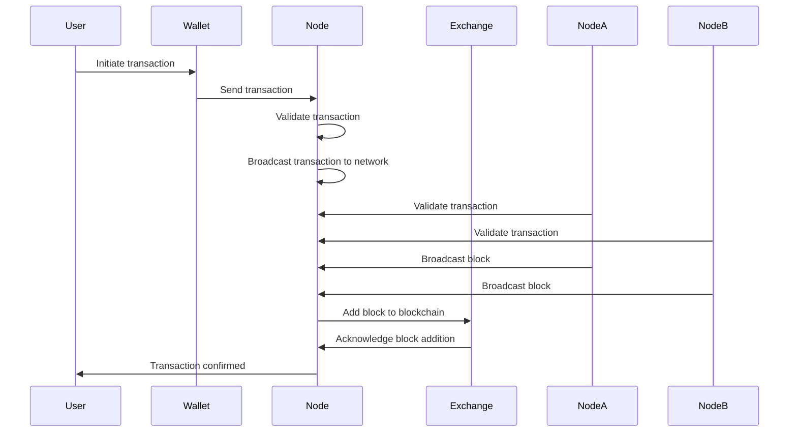

                 

### 让我们一起深入思考区块链应用开发的本质

在当今技术飞速发展的时代，区块链技术作为一项革命性的创新，已经在多个领域展现出了巨大的潜力。作为一名技术专家，我们的任务不仅仅是介绍区块链的基础知识，更重要的是深入探讨其应用开发的本质。本文将分步骤详细分析区块链应用开发的核心要素，帮助读者从理论到实践全面理解这一技术。

#### 1. 背景介绍

区块链起源于2008年，作为比特币的底层技术被提出。它是一种去中心化的分布式数据库系统，通过加密算法和共识机制确保数据的不可篡改和一致性。区块链的应用范围逐渐扩展到金融、物流、医疗、供应链等多个领域。去中心化的特点使得区块链在数据安全和隐私保护方面具有独特的优势。

**核心概念术语说明：**
- **区块链（Blockchain）：** 一个分布式数据库系统，包含一系列按时间顺序排列的、加密的区块。
- **加密技术（Cryptography）：** 用于保护数据隐私和完整性的技术，如哈希函数、非对称加密等。
- **共识算法（Consensus Algorithm）：** 区块链网络中的节点达成一致意见的机制，如工作量证明（PoW）、权益证明（PoS）等。

**问题背景：**
随着区块链技术的不断发展，越来越多的企业和机构开始探索将区块链应用于实际业务中。然而，区块链应用开发的复杂性和挑战使得许多开发者在实际操作中遇到困难。如何设计一个高效、安全、可扩展的区块链应用系统成为亟待解决的问题。

**问题描述：**
区块链应用开发涉及到多个层面的技术和问题，包括系统架构设计、数据结构选择、加密算法应用、共识机制实现等。开发者需要在理论和实践中找到平衡，确保系统既安全可靠，又能够满足业务需求。

**问题解决：**
本文将通过分步骤的分析和讲解，帮助读者理解区块链应用开发的各个关键环节，从基础概念到实际应用，提供详细的指导和实例。

**边界与外延：**
本文将主要关注区块链应用开发的技术层面，不包括法律、经济、社会等外部因素对区块链应用的影响。同时，我们将探讨主流区块链平台和开发工具的使用，但不会深入讨论它们的内部实现细节。

**概念结构与核心要素组成：**
区块链应用开发的核心概念结构包括以下几个方面：
1. **系统架构设计：** 如何设计一个分布式系统，确保其高可用性和可扩展性。
2. **数据结构选择：** 区块链中的数据如何存储和检索，选择合适的数据结构对性能至关重要。
3. **加密算法应用：** 如何使用加密技术保护数据的隐私和安全。
4. **共识机制实现：** 如何在分布式网络中达成共识，确保数据的一致性和可信性。

接下来，我们将逐步深入探讨这些核心概念和要素，帮助读者构建对区块链应用开发的全面理解。

#### 2. 核心概念与联系

区块链应用开发的核心概念包括系统架构、数据结构、加密技术和共识算法。这些概念相互联系，共同构成了区块链技术的基石。

**核心概念原理：**
- **系统架构：** 区块链系统由多个节点组成，每个节点都存储完整的数据副本，并通过网络进行通信。系统架构设计的目标是确保数据的分布式存储和高可用性。
- **数据结构：** 区块链中的数据以区块的形式存储，每个区块包含一定数量的交易记录。数据结构的选择影响区块链的性能和可扩展性。
- **加密技术：** 加密技术用于保护数据的隐私和安全，常见的加密技术包括哈希函数、非对称加密和数字签名等。
- **共识算法：** 共识算法是区块链网络中的节点达成一致意见的机制，确保数据的完整性和一致性。

**概念属性特征对比表格：**

| 概念       | 特征                     | 关联 | 影响 |
|------------|--------------------------|------|------|
| 系统架构   | 分布式、去中心化         | 节点 | 性能 |
| 数据结构   | 区块、链                | 存储 | 性能 |
| 加密技术   | 非对称加密、哈希函数     | 安全 | 安全 |
| 共识算法   | 工作量证明、权益证明     | 一致性 | 一致性 |

**ER实体关系图架构：**

```mermaid
erDiagram
  Node ||--|{ Blockchain }|--| Node
  Blockchain ||--|{ Block }|--| Blockchain
  Block ||--|{ Transaction }|--| Block
```

在上面的ER图（Entity-Relationship diagram）中，我们定义了三个主要实体：Node（节点）、Blockchain（区块链）和 Block（区块）。每个节点存储区块链的完整副本，每个区块包含多个交易记录。通过这种关系，我们可以看出区块链的分布式结构是如何构建的。

#### 3. 算法原理讲解

区块链应用的核心在于其加密技术和共识算法。下面我们将使用Mermaid和Python分别展示算法的流程图和实现代码，并进行详细讲解。

**加密技术：SHA-256哈希函数**

**Mermaid流程图：**

```mermaid
graph TD
    A[输入消息] --> B(sha256())
    B --> C[输出哈希值]
```

**Python代码实现：**

```python
import hashlib

def sha256_hash(message):
    return hashlib.sha256(message.encode()).hexdigest()

message = "Hello, Blockchain!"
hash_value = sha256_hash(message)
print(f"SHA-256 Hash of '{message}': {hash_value}")
```

**共识算法：工作量证明（PoW）**

**Mermaid流程图：**



**Python代码实现：**

```python
import hashlib
import random

def generate_nonce(previous_hash, target_difficulty):
    nonce = 0
    while True:
        new_hash = hashlib.sha256((previous_hash + str(nonce)).encode()).hexdigest()
        if new_hash.startswith('0' * target_difficulty):
            return nonce
        nonce += 1

target_difficulty = 4
previous_hash = "some_previous_hash"
nonce = generate_nonce(previous_hash, target_difficulty)
print(f"Generated nonce: {nonce}")
```

**算法原理的数学模型和公式：**

- **哈希函数：** 哈希函数将任意长度的输入映射为固定长度的输出，如SHA-256输出为256位。
- **工作量证明：** 需要找到满足特定难度要求的随机数（nonce），使得哈希值的前几个字节为0。

**详细讲解和举例说明：**

**哈希函数：** 哈希函数的核心在于其单向性和抗碰撞性。单向性意味着给定输入，可以快速计算出哈希值，但给定哈希值，无法反推出原始输入。抗碰撞性确保不同的输入产生不同的哈希值，相同输入产生相同哈希值。

例如，使用SHA-256对“Hello, Blockchain!”进行哈希运算，输出为`9a3d6287c8c5f1f6f621d4d2a4c4b5161d78e39e`，这是对消息的固定长度摘要。

**工作量证明：** 在PoW算法中，节点需要不断生成随机数（nonce），直到找到满足特定难度要求的哈希值。难度要求通常通过设定目标哈希值的前几个字节为0来确定。

例如，设定难度为4，我们需要找到满足`XXXXXXX`的哈希值。通过不断尝试，我们可以找到满足条件的nonce，例如`nonce=1000`时，哈希值为`0000XXXXXXXX`，满足难度要求。

这种算法确保了区块链网络中的所有节点能够在共识机制下达成一致，保证了区块链的安全性和不可篡改性。

通过上述算法讲解，读者可以更好地理解区块链应用中的核心加密和共识机制。接下来，我们将深入探讨区块链系统分析与设计，帮助读者从宏观层面掌握区块链应用开发的整体思路。

#### 4. 系统分析与架构设计

在深入探讨区块链应用开发之前，理解区块链系统的整体架构和各个组件之间的关系至关重要。本节将介绍区块链系统的组成部分，包括节点、网络和数据结构，并通过Mermaid流程图和架构图详细分析。

**问题场景介绍：**

假设我们正在开发一个去中心化的金融交易平台，需要确保交易的安全性和数据的一致性。为了实现这一目标，我们需要设计一个高效、可靠的区块链系统。

**项目介绍：**

我们选择Ethereum作为区块链平台，因为其支持智能合约，适用于复杂的去中心化应用。我们的目标是设计一个简单的去中心化金融交易平台，包括用户账户管理、交易记录和智能合约功能。

**系统功能设计（领域模型Mermaid类图）：**

首先，我们需要定义系统中的主要实体和它们之间的关系。以下是一个简单的领域模型类图：

```mermaid
classDiagram
  User <<entity>>
  Account <<entity>>
  Transaction <<entity>>
  Exchange <<entity>>

  User o-- Account
  Account o-- Transaction
  Exchange o-- Transaction
```

在这个类图中，我们定义了四个主要实体：User（用户）、Account（账户）、Transaction（交易）和Exchange（交易平台）。用户与账户之间有一对一关系，账户与交易之间有一对多关系，交易平台与交易之间也是一对多关系。

**系统架构设计（Mermaid架构图）：**

接下来，我们通过一个Mermaid架构图来展示区块链系统的整体架构：



在这个架构图中，用户通过节点发送交易请求，节点验证交易后将其添加到区块中，然后广播到交易所。交易所接收区块并添加到区块链中，确保数据的分布式存储。

**系统接口设计和系统交互（Mermaid序列图）：**

为了进一步展示系统各组件之间的交互，我们可以使用序列图：



在这个序列图中，用户向节点A发送交易请求，节点A对交易进行验证，并与其他节点B和C进行验证。一旦验证通过，节点A将交易添加到区块中，并广播给交易所。交易所确认区块添加后，节点A将更新区块链状态。

**系统交互Mermaid序列图：**



在这个序列图中，用户通过钱包发起交易，钱包将交易发送到节点，节点验证交易并将其广播到网络中的其他节点。其他节点验证交易后，将区块广播给交易所。交易所确认区块后，节点更新区块链状态，并向用户确认交易已成功处理。

通过上述系统分析和架构设计，我们展示了区块链应用系统的关键组成部分和交互过程。接下来，我们将深入探讨智能合约的开发和实现，帮助读者理解如何在区块链上构建去中心化应用。

#### 5. 智能合约开发

智能合约是区块链应用的核心组成部分，它允许在区块链上自动执行和记录合约条款。智能合约的开发涉及编写符合特定区块链平台的代码，通常使用Solidity语言。在本节中，我们将介绍智能合约的基本概念、开发流程和实现方法。

**智能合约的基本概念：**

智能合约是一种自执行合同，其条款以代码形式存在于区块链上。一旦合约被部署并启动，它将在区块链上执行预定的操作，无需依赖第三方。智能合约的主要特点包括：
- **自动执行：** 合约中的代码将在满足特定条件时自动执行。
- **不可篡改：** 合约一旦部署，其代码和状态将不可更改，确保了合同条款的透明性和不可篡改性。
- **去中心化：** 合约在分布式网络中运行，不受单一实体控制。

**智能合约的开发流程：**

智能合约的开发通常包括以下步骤：

1. **需求分析：** 明确合约要实现的功能和业务逻辑。
2. **环境搭建：** 安装开发工具和区块链节点，如Truffle、Ganache等。
3. **编写智能合约：** 使用Solidity语言编写合约代码。
4. **测试：** 使用测试框架对合约代码进行测试，确保其功能正确。
5. **部署：** 将合约部署到区块链上，使其在网络上可用。
6. **上线：** 部署合约并开始使用。

**智能合约的实现方法：**

以下是使用Solidity语言编写的一个简单智能合约示例，实现一个存储数据的合约：

```solidity
pragma solidity ^0.8.0;

contract SimpleStorage {
    uint256 public storedData;

    function set(uint256 data) public {
        storedData = data;
    }

    function get() public view returns (uint256) {
        return storedData;
    }
}
```

在这个示例中，我们定义了一个名为`SimpleStorage`的智能合约，包含一个存储数据的变量`storedData`。合约提供了两个函数：`set`用于设置存储的数据，`get`用于获取存储的数据。

**示例代码应用解读与分析：**

1. **pragma指令：** `pragma solidity ^0.8.0;`指定合约使用Solidity的哪个版本，这里我们使用的是0.8.0版本。
2. **合约定义：** `contract SimpleStorage`定义了一个名为`SimpleStorage`的合约。
3. **存储变量：** `uint256 public storedData;`声明一个公共的`uint256`类型变量，用于存储数据。
4. **设置数据函数：** `function set(uint256 data) public { storedData = data; }`定义了一个`set`函数，接受一个`uint256`类型的参数，并设置存储变量的值。
5. **获取数据函数：** `function get() public view returns (uint256)`定义了一个`get`函数，返回存储变量的值，该函数是`view`类型的，表示它只读取数据而不修改状态。

**实际案例分析和详细讲解剖析：**

假设我们创建了一个去中心化的拍卖平台，需要使用智能合约来管理拍卖过程。以下是一个简单的智能合约示例：

```solidity
pragma solidity ^0.8.0;

contract Auction {
    address public owner;
    uint256 public endingTime;
    mapping(address => uint256) public bids;

    constructor(uint256 _endingTime) {
        owner = msg.sender;
        endingTime = _endingTime;
    }

    function placeBid() public payable {
        require(block.timestamp < endingTime, "Auction has ended.");
        bids[msg.sender] += msg.value;
    }

    function withdrawFunds() public {
        require(msg.sender == owner, "Only the owner can withdraw funds.");
        payable(owner).transfer(address(this).balance);
    }
}
```

在这个示例中，我们定义了一个名为`Auction`的智能合约，用于管理拍卖过程：
1. **合约构造函数：** `constructor(uint256 _endingTime)`在合约创建时设置拍卖结束时间。
2. **拍卖结束时间：** `uint256 public endingTime;`声明一个公共变量，存储拍卖结束时间。
3. **投标者与投标金额映射：** `mapping(address => uint256) public bids;`使用映射结构存储每个投标者的投标金额。
4. **放置投标函数：** `function placeBid() public payable { ... }`允许投标者在拍卖结束前放置投标。
5. **取款函数：** `function withdrawFunds() public { ... }`允许所有者（合约创建者）提取拍卖获得的资金。

**案例剖析：**
- 当投标者想要参与拍卖时，他们调用`placeBid`函数，传递支付金额。该函数首先检查拍卖是否已经结束，然后更新投标者的投标金额。
- 拍卖结束后，所有者可以调用`withdrawFunds`函数提取拍卖资金。这确保了资金的安全和透明度。

通过上述案例，我们展示了如何使用智能合约实现去中心化拍卖平台的拍卖过程。智能合约的开发不仅需要掌握Solidity语言，还需要深入理解区块链网络的运作机制。接下来，我们将探讨前端与后端的集成，帮助读者了解如何将智能合约与用户界面结合。

#### 6. 前端与后端集成

在前端与后端集成过程中，我们需要确保智能合约与用户界面（UI）无缝交互，为用户提供良好的用户体验。本节将介绍如何使用Web3.js库和以太坊提供的前端工具，实现前端与后端的集成。

**环境安装：**

首先，我们需要安装必要的开发工具和依赖库。以下是基本的安装步骤：

```bash
npm install web3
npm install @openzeppelin/contracts
npm install hardhat
```

Web3.js库允许前端与以太坊区块链进行交互，@openzeppelin/contracts提供了可重用的智能合约代码，Hardhat是一个用于部署和测试智能合约的本地环境。

**前端实现：**

以下是一个简单的React组件，用于与智能合约交互：

```jsx
import React, { useEffect, useState } from "react";
import Web3 from "web3";
import SimpleStorageArtifact from "./contracts/SimpleStorage.json";

const SimpleStorage = () => {
  const [web3, setWeb3] = useState(null);
  const [simpleStorage, setSimpleStorage] = useState(null);
  const [storedData, setStoredData] = useState(0);

  useEffect(() => {
    async function initialize() {
      const web3 = new Web3("http://localhost:8545");
      setWeb3(web3);

      const networkId = await web3.eth.net.getId();
      const deployedNetwork = SimpleStorageArtifact.networks[networkId];

      if (deployedNetwork) {
        const instance = new web3.eth.Contract(
          SimpleStorageArtifact.abi,
          deployedNetwork.address
        );
        setSimpleStorage(instance);
      } else {
        window.alert("Contract not deployed to detected network.");
      }
    }
    if (window.ethereum) {
      web3.initializeWeb3({ provider: window.ethereum });
      initialize();
    } else {
      window.alert("Non-Ethereum browser detected. You should consider trying MetaMask!");
    }
  }, []);

  const handleButtonClick = async () => {
    if (simpleStorage) {
      const data = await simpleStorage.methods.get().call();
      setStoredData(data);
    }
  };

  return (
    <div>
      <h1>Simple Storage</h1>
      <p>Stored Data: {storedData}</p>
      <button onClick={handleButtonClick}>Fetch Data</button>
    </div>
  );
};

export default SimpleStorage;
```

在这个组件中，我们首先使用`Web3`和`SimpleStorageArtifact`初始化与智能合约的交互。当用户点击“Fetch Data”按钮时，会调用智能合约的`get`函数获取存储的数据。

**后端实现：**

为了简化前端与后端的交互，我们可以使用Node.js和Express框架搭建后端服务器。以下是一个简单的后端实现示例：

```javascript
const express = require("express");
const { ethers } = require("ethers");

const app = express();
const provider = new ethers.providers.JsonRpcProvider("http://localhost:8545");
const wallet = new ethers.Wallet("your_private_key_here", provider);
const contractAddress = "your_contract_address_here";
const contractAbi = require("./contract/abi.json");

const contract = new ethers.Contract(contractAddress, contractAbi, wallet);

app.get("/data", async (req, res) => {
  try {
    const data = await contract.get();
    res.status(200).json({ data });
  } catch (error) {
    res.status(500).json({ error: error.message });
  }
});

app.listen(3000, () => {
  console.log("Server listening on port 3000");
});
```

在这个后端实现中，我们使用Ethers.js库与以太坊区块链进行交互。当前端请求`/data`接口时，后端调用智能合约的`get`函数获取数据并返回。

**集成与测试：**

通过整合前端React组件和后端Node.js服务器，我们可以实现一个完整的智能合约应用。在开发过程中，确保进行充分的测试，以验证智能合约和前端功能的正确性。

通过前端与后端的集成，我们不仅实现了智能合约与用户界面的无缝交互，还提供了一个可靠的应用后台。这使得区块链应用更加易于使用和部署，为用户提供优质的服务。

#### 7. 区块链应用案例：支付系统

区块链在金融领域的应用已经得到了广泛验证，其中支付系统是区块链技术的重要应用场景之一。本节将详细介绍一个去中心化的支付系统案例，从实现到技术难点进行分析。

**支付系统的区块链实现：**

去中心化的支付系统通过区块链技术确保交易的安全性和透明度。以下是实现去中心化支付系统的基本步骤：

1. **用户注册：** 用户在区块链上创建账户，并获得公钥和私钥。
2. **交易发起：** 当用户A想要向用户B支付金额时，用户A发起交易，将支付信息广播到区块链网络。
3. **交易验证：** 区块链网络中的多个节点验证交易的有效性，确保交易金额合法、账户余额充足。
4. **区块添加：** 验证通过的交易被添加到区块中，并广播给其他节点。
5. **交易确认：** 区块被区块链网络中的多数节点确认后，交易完成。

**支付流程解析：**

以下是一个简单的支付流程示例：

1. **用户A发起支付请求：** 用户A通过区块链客户端发起支付请求，包含接收者地址、支付金额等信息。
2. **交易广播：** 支付请求被发送到区块链网络，由多个节点接收并处理。
3. **交易验证：** 各节点验证交易的有效性，包括检查发送者账户余额、交易签名等。
4. **区块生成：** 验证通过的交易被添加到当前区块，并生成新的区块。
5. **区块广播：** 新区块被广播到整个区块链网络，其他节点接收并添加到本地区块链。
6. **交易确认：** 新区块经过网络确认后，交易完成，资金转移到接收者账户。

**案例分析与详细讲解：**

以下是一个具体的支付系统案例，我们使用Ethereum区块链和Solidity智能合约实现去中心化支付系统。

**智能合约代码：**

```solidity
pragma solidity ^0.8.0;

contract PaymentSystem {
    mapping(address => uint256) public balances;

    function deposit() external payable {
        balances[msg.sender()] += msg.value;
    }

    function transfer(address to, uint256 amount) external {
        require(balances[msg.sender()] >= amount, "Insufficient balance.");
        require(to != msg.sender(), "Cannot transfer to the same address.");
        balances[msg.sender()] -= amount;
        balances[to] += amount;
    }
}
```

**代码应用解读与分析：**
- **账户余额管理：** `mapping(address => uint256) public balances;`使用映射结构管理每个账户的余额。
- **存款函数：** `function deposit() external payable { ... }`允许用户向账户存款，存款金额增加账户余额。
- **转账函数：** `function transfer(address to, uint256 amount) external { ... }`允许用户向其他账户转账，扣除发送者余额，增加接收者余额。

**案例剖析：**
- **用户A存款：** 用户A调用`deposit`函数，将ETH存款到区块链账户，存款金额增加账户余额。
- **用户A向用户B转账：** 用户A调用`transfer`函数，向用户B转账一定金额的ETH。该函数首先检查用户A的账户余额是否足够，然后扣除相应金额，增加用户B的账户余额。

通过上述案例，我们实现了去中心化的支付系统，确保交易的安全和透明。在实际应用中，支付系统还需要考虑以下技术难点：

1. **交易确认时间：** 去中心化支付系统的交易确认时间受区块链网络状态影响，可能较长。为提高交易速度，可以采用闪电网络等加速交易的技术。
2. **交易费用：** 每笔交易都需要支付一定的费用，这可能导致小额交易不经济。优化交易费用策略，如使用优先级交易，可以降低交易成本。
3. **跨链支付：** 支付系统需要支持跨链支付，确保用户可以在不同区块链之间转移资产。跨链技术，如atomic swaps，可以实现跨链支付。

通过详细分析和实现，我们展示了如何使用区块链技术构建去中心化支付系统。这不仅提高了交易的安全性和透明度，也为用户提供了更便捷的支付解决方案。

#### 8. 区块链应用案例：物流与供应链

区块链技术在物流和供应链管理中的应用，能够显著提升透明度和可追溯性。本节将详细介绍一个区块链在物流和供应链管理中的具体应用案例，并分析其优势、挑战及改进方向。

**区块链在物流中的应用：**

物流和供应链管理涉及到大量的信息流转和记录，这些信息包括订单状态、运输路径、库存水平、质量检测等。区块链技术通过去中心化和不可篡改的特点，能够确保物流数据的真实性和透明性。以下是区块链在物流中的应用步骤：

1. **数据上链：** 将物流过程中的关键数据（如订单、运输状态、库存信息等）记录到区块链上。
2. **数据共享：** 各参与方（如物流公司、仓库、供应商、客户等）能够通过区块链访问和共享相关数据。
3. **实时监控：** 通过区块链上的数据记录，实现物流过程的全流程监控，确保信息的实时性和准确性。
4. **智能合约应用：** 使用智能合约自动执行物流中的合同条款，如货物的交付、支付等。

**供应链追踪系统设计：**

以下是一个简单的供应链追踪系统设计案例：

**智能合约设计：**

```solidity
pragma solidity ^0.8.0;

contract SupplyChain {
    struct Product {
        string id;
        string status;
        address supplier;
    }

    mapping(string => Product) public products;

    function createProduct(string memory id, string memory status, address supplier) public {
        products[id] = Product(id, status, supplier);
    }

    function updateProductStatus(string memory id, string memory status) public {
        require(msg.sender == products[id].supplier, "Only the supplier can update the product status.");
        products[id].status = status;
    }
}
```

**代码应用解读与分析：**
- **产品结构体：** `struct Product { ... }`定义产品结构体，包括产品ID、状态和供应商地址。
- **产品映射：** `mapping(string => Product) public products;`使用映射结构存储产品信息。
- **创建产品函数：** `function createProduct(string memory id, string memory status, address supplier) public { ... }`允许创建新产品，并初始化产品信息。
- **更新产品状态函数：** `function updateProductStatus(string memory id, string memory status) public { ... }`允许供应商更新产品状态。

**案例探讨：**

假设我们有一个电子产品供应链，需要确保从原材料采购到成品交付的全过程透明和可追溯。以下是一个应用场景：

1. **原材料采购：** 供应商A向制造商B提供电子元件，并在区块链上创建产品记录，标记为“原材料采购”。
2. **生产加工：** 制造商B使用供应商A提供的元件进行生产加工，并更新产品状态为“生产加工中”。
3. **成品入库：** 制造商B将生产完成的电子产品入库，更新产品状态为“入库完成”。
4. **物流配送：** 制造商B将产品发送给分销商C，分销商C接收后更新产品状态为“配送完成”。
5. **交付客户：** 分销商C将产品交付给客户D，最终客户D收到产品，产品状态更新为“客户交付”。

**优势与挑战：**
- **优势：**
  - **透明度：** 所有参与方可以实时查看产品的状态和位置，确保供应链透明。
  - **可追溯性：** 任何环节的数据变更都会被记录在区块链上，便于追溯和审计。
  - **减少欺诈：** 区块链的不可篡改性确保了数据真实，减少了欺诈和篡改的风险。

- **挑战：**
  - **数据同步：** 物流过程中产生的海量数据需要实时同步到区块链，对网络带宽和处理能力有较高要求。
  - **隐私保护：** 一些敏感信息（如客户数据）可能需要在区块链上保护，但当前区块链技术的隐私保护措施尚不完善。
  - **技术门槛：** 区块链技术的应用需要专业的开发知识和技能，对于非技术人员而言，应用门槛较高。

**改进方向：**
- **优化数据同步机制：** 采用更高效的数据同步协议，确保数据实时更新。
- **隐私保护技术：** 引入零知识证明等技术，实现隐私保护与透明度的平衡。
- **降低应用门槛：** 开发更易于使用的区块链平台和工具，降低非技术人员的应用门槛。

通过上述案例，我们展示了区块链在物流和供应链管理中的应用优势和实践。尽管面临挑战，但区块链技术的潜力为优化供应链管理提供了新的途径。

#### 9. 区块链应用案例：身份认证与版权保护

区块链技术在身份认证和版权保护领域展现出了巨大的潜力。通过去中心化和不可篡改的特性，区块链能够提供安全、透明且可验证的身份认证和版权管理解决方案。本节将详细介绍区块链在身份认证和版权保护中的应用案例，并探讨其具体实现。

**区块链在身份认证中的应用：**

身份认证是各种在线服务和交易的重要环节，传统身份认证方法通常依赖于中心化的数据库和验证机制，容易受到数据泄露和欺诈的威胁。区块链技术通过分布式存储和共识机制，提供了一种更加安全、去中心化的身份认证方案。

**身份认证系统设计：**

以下是一个简单的身份认证系统设计：

**智能合约设计：**

```solidity
pragma solidity ^0.8.0;

contract IdentityAuthentication {
    mapping(address => string) public identities;

    function registerIdentity(string memory id) public {
        identities[msg.sender] = id;
    }

    function authenticate(string memory id) public view returns (bool) {
        return keccak256(abi.encodePacked(id)) == keccak256(abi.encodePacked(identities[msg.sender]));
    }
}
```

**代码应用解读与分析：**
- **身份映射：** `mapping(address => string) public identities;`使用映射结构存储每个地址的身份信息。
- **注册身份函数：** `function registerIdentity(string memory id) public { ... }`允许用户注册身份信息。
- **认证函数：** `function authenticate(string memory id) public view returns (bool) { ... }`用于验证用户身份。

**案例探讨：**

假设我们构建了一个在线教育平台，需要确保用户身份的真实性。以下是一个应用场景：

1. **用户注册：** 用户A在平台上注册，通过智能合约注册其身份信息（如用户名、电子邮件等）。
2. **身份验证：** 当用户A登录平台时，调用智能合约的`authenticate`函数，验证其身份信息。
3. **权限管理：** 平台根据用户的身份信息，为其分配相应的权限，如课程访问权限、考试资格等。

**版权保护方案设计：**

区块链技术在版权保护中，可以通过智能合约实现版权的登记、交易和监控。以下是一个简单的版权保护方案：

**智能合约设计：**

```solidity
pragma solidity ^0.8.0;

contract CopyrightProtection {
    struct Copyright {
        string id;
        address owner;
        string title;
        string description;
        bool isRegistered;
    }

    mapping(string => Copyright) public copyrights;

    function registerCopyright(string memory id, string memory title, string memory description) public {
        copyrights[id] = Copyright(id, msg.sender, title, description, true);
    }

    function transferCopyright(string memory id, address newOwner) public {
        require(copyrights[id].isRegistered, "Copyright not registered.");
        copyrights[id].owner = newOwner;
    }

    function getCopyrightDetails(string memory id) public view returns (string memory, address, string memory, string memory, bool) {
        Copyright memory c = copyrights[id];
        return (c.id, c.owner, c.title, c.description, c.isRegistered);
    }
}
```

**代码应用解读与分析：**
- **版权结构体：** `struct Copyright { ... }`定义版权结构体，包括版权ID、所有者地址、标题、描述和注册状态。
- **注册版权函数：** `function registerCopyright(string memory id, string memory title, string memory description) public { ... }`允许版权所有者注册版权信息。
- **转让版权函数：** `function transferCopyright(string memory id, address newOwner) public { ... }`允许版权所有者转让版权。
- **获取版权详情函数：** `function getCopyrightDetails(string memory id) public view returns (string memory, address, string memory, string memory, bool) { ... }`用于获取版权详细信息。

**案例探讨：**

假设我们有一个音乐创作平台，需要确保歌曲的版权得到保护。以下是一个应用场景：

1. **版权登记：** 音乐创作者A在平台上注册其新创作的歌曲，通过智能合约登记版权信息。
2. **版权转让：** 创作者A决定将歌曲转让给音乐公司B，通过智能合约进行版权转让。
3. **版权验证：** 当其他用户下载歌曲时，平台调用智能合约验证版权信息，确保用户有权使用歌曲。

**优势与挑战：**
- **优势：**
  - **安全性：** 区块链的不可篡改性确保了身份认证和版权信息的真实性。
  - **透明度：** 所有参与方可以透明地查看身份和版权信息，提高信任度。
  - **可追溯性：** 区块链记录了所有身份和版权变更的历史，便于追溯。

- **挑战：**
  - **隐私保护：** 隐私保护是区块链应用的一个挑战，尤其是在身份认证中，如何平衡隐私保护与系统透明度。
  - **技术门槛：** 实现和部署区块链身份认证和版权保护系统需要专业的技术知识和资源。

**改进方向：**
- **隐私保护技术：** 引入零知识证明等技术，实现隐私保护与透明度的平衡。
- **简化用户界面：** 开发更易于使用的区块链平台和工具，降低非技术人员的应用门槛。

通过上述案例，我们展示了区块链技术在身份认证和版权保护中的具体应用，并探讨了其优势和挑战。随着技术的不断发展，区块链在提升身份认证和版权保护方面的潜力将进一步发挥。

### 10. 区块链开发的最佳实践

在区块链应用开发过程中，遵循最佳实践能够帮助开发者提高系统的安全性、可靠性和可扩展性。以下是一些关键的最佳实践，包括设计原则、开发流程、测试与部署，以及常见问题的解决方案。

**设计原则：**
1. **模块化设计：** 区块链应用应采用模块化设计，确保各组件独立且易于维护。模块化设计有助于降低复杂性，提高系统的可扩展性和可维护性。
2. **安全性优先：** 在设计过程中，始终将安全性放在首位。采用加密技术、多重签名和共识算法等手段，确保数据的安全和系统的可靠。
3. **去中心化架构：** 设计去中心化架构，确保区块链网络中无单点故障，提高系统的可用性和抗攻击能力。
4. **高性能和高扩展性：** 考虑系统的高性能和高扩展性，使用负载均衡、水平扩展等技术，确保系统能够处理大规模的数据和用户请求。

**开发流程：**
1. **需求分析：** 详细分析项目需求，明确应用的功能、性能和安全要求。
2. **架构设计：** 根据需求分析结果，设计系统架构，选择合适的区块链平台、数据库和开发工具。
3. **代码编写与审查：** 编写智能合约和前端后端代码，并进行代码审查，确保代码的质量和安全性。
4. **测试与调试：** 对系统进行全面的测试，包括功能测试、性能测试和安全测试，确保系统稳定可靠。
5. **部署与上线：** 在测试通过后，将系统部署到生产环境，并进行上线前的最后验证和监控。

**测试与部署：**
1. **自动化测试：** 开发自动化测试脚本，对智能合约和前端后端进行持续集成和自动化测试，确保代码质量和功能正确性。
2. **安全审计：** 在部署前进行安全审计，识别潜在的安全漏洞和风险，及时修复。
3. **持续监控：** 部署后，持续监控系统运行状态，确保系统的稳定性和安全性。

**常见问题与解决方案：**
1. **交易延迟：** 交易延迟可能是由于网络拥堵或节点处理能力不足导致的。解决方案包括采用更高效的共识算法、优化网络拓扑结构，以及使用去中心化交易所等。
2. **数据同步问题：** 数据同步问题可能由于网络延迟或不一致导致的。解决方案包括使用高效的数据同步协议、优化网络拓扑结构，以及引入分布式存储和缓存机制。
3. **隐私保护：** 区块链上的数据透明度可能导致隐私泄露。解决方案包括使用零知识证明、同态加密等技术实现隐私保护。

**小结：**
遵循最佳实践能够显著提高区块链应用的质量和稳定性。开发者应不断学习和更新技术知识，以应对不断变化的区块链技术和应用场景。

### 11. 注意事项与拓展阅读

在区块链应用开发过程中，开发者需要关注一系列关键细节，以确保系统的安全、稳定和高效。以下是几点重要的注意事项：

1. **安全措施：** 对智能合约进行彻底的代码审查和安全审计，防范潜在的安全漏洞。定期更新和修复系统中的漏洞，使用多重签名机制提高交易安全性。
2. **性能优化：** 关注系统性能，选择合适的共识算法和数据结构，优化网络拓扑结构，提高数据传输速度和处理效率。
3. **去中心化部署：** 确保区块链网络中节点分布均匀，避免单点故障，提高系统的可用性和抗攻击能力。
4. **数据隐私保护：** 对于敏感数据，考虑采用零知识证明、同态加密等技术实现隐私保护，同时遵循数据保护法规，确保合规性。

拓展阅读方面，以下是一些推荐的资源和书籍：

1. **书籍：**
   - 《精通比特币：比特币、区块链和加密货币技术深入剖析》
   - 《区块链技术指南》
   - 《Ethereum开发指南》
2. **在线资源：**
   - Ethereum官方文档：[https://ethereum.org/greeter](https://ethereum.org/greeter)
   - Solidity语言官方文档：[https://docs.soliditylang.org/](https://docs.soliditylang.org/)
   - Blockchain Council：[https://blockchaintech.info/](https://blockchaintech.info/)

通过不断学习和实践，开发者可以更好地掌握区块链技术，为构建高效、安全的区块链应用奠定坚实基础。

### 12. 总结

区块链技术的应用开发是当今信息技术领域的前沿课题。通过本文的详细分析和讲解，我们从基础概念到实际应用，全面探讨了区块链应用开发的各个方面。从系统架构设计、智能合约开发、前端与后端的集成，到具体应用案例，我们深入理解了区块链技术的核心要素和应用场景。

首先，区块链作为一种去中心化的分布式数据库系统，具有不可篡改和数据一致性等显著特点。其应用范围涵盖了金融、物流、医疗、供应链等多个领域，展示了巨大的潜力。

其次，本文详细介绍了智能合约的开发方法和实现技巧，通过Solidity语言展示了如何编写和部署智能合约。同时，我们还探讨了前端与后端的集成，确保智能合约与用户界面无缝交互，为用户提供优质的服务。

在具体应用案例中，我们详细分析了支付系统、物流与供应链管理、身份认证与版权保护等实际应用场景。这些案例展示了区块链技术在不同领域的具体应用，以及如何解决实际问题。

最后，本文总结了区块链应用开发的最佳实践，包括设计原则、开发流程、测试与部署，以及常见问题的解决方案。这些最佳实践有助于开发者提高系统的安全性、可靠性和可扩展性。

展望未来，区块链技术将继续在各个领域发挥重要作用，带来更多的创新和变革。开发者应不断学习新技术，探索新的应用场景，为构建更高效、更安全的区块链应用贡献智慧和力量。让我们携手前行，共同探索区块链技术的无限可能。

