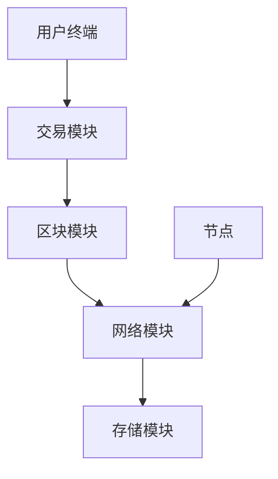
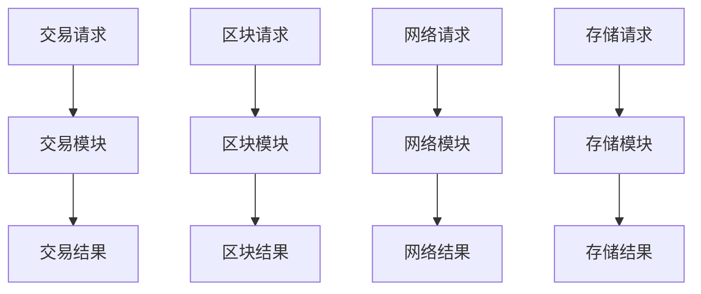
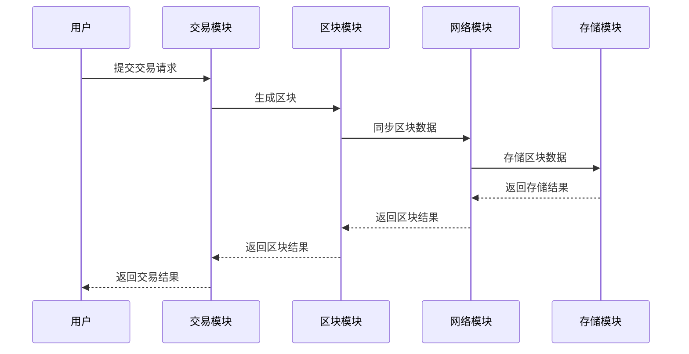

                 

## 引言

### 1.1 书籍主题与目标

《区块链性能优化策略》旨在深入探讨区块链技术的性能优化策略，旨在为开发者、研究人员和区块链爱好者提供一套系统、全面、易于理解的性能优化指南。随着区块链技术的不断发展和应用范围的扩展，性能问题成为阻碍其广泛应用的关键因素之一。因此，本书将重点讨论如何通过优化技术、系统设计和实际案例分析，提高区块链系统的性能和稳定性。

#### 1.1.1 书籍主题

区块链技术作为一种去中心化、安全可靠的分布式数据库技术，近年来在全球范围内受到了广泛关注。然而，随着区块链网络的规模不断扩大，交易处理速度和系统吞吐量成为制约其发展的关键瓶颈。本书的主题正是围绕如何解决这些性能问题展开，旨在为读者提供实用的优化方法和策略。

#### 1.1.2 目标读者

本书的目标读者主要包括以下几类：

1. 区块链开发人员：希望通过学习性能优化策略，提高区块链系统的性能和稳定性。
2. 区块链研究人员：希望深入了解性能优化技术的原理和应用，为未来的研究方向提供参考。
3. 区块链爱好者：对区块链技术感兴趣，希望通过本书了解性能优化的重要性和方法。

### 1.2 书籍结构

本书分为六个主要部分，分别从核心概念、算法与优化技术、系统设计与实现、案例分析、最佳实践和总结等方面，全面系统地介绍了区块链性能优化策略。

#### 1.2.1 核心概念与问题

在本书的第一部分，我们将介绍区块链技术的基本概念，包括其定义、特点和应用场景。同时，还将分析区块链性能优化的重要性和面临的挑战，为后续章节的内容奠定基础。

#### 1.2.2 算法与优化技术

第二部分将详细讨论区块链性能优化所涉及的主要算法和优化技术。我们将介绍并行计算、分布式存储、共识机制优化等关键技术，并分析它们在提高区块链性能方面的作用。

#### 1.2.3 系统设计与实现

在第三部分，我们将探讨区块链系统的设计原则和实现方法。通过分析系统架构、模块划分和接口设计，帮助读者了解如何构建高性能、可扩展的区块链系统。

#### 1.2.4 案例研究

第四部分将提供多个实际案例，通过分析这些案例中的优化策略和实施效果，为读者提供参考和借鉴。

#### 1.2.5 最佳实践与总结

第五部分将总结最佳实践，包括性能测试方法、性能监控和优化策略。此外，还将讨论未来的研究方向和发展趋势。

#### 1.2.6 结论与进一步阅读

最后一部分将总结本书的主要内容，并对区块链性能优化领域的发展进行展望。同时，推荐进一步阅读的材料，以帮助读者深入了解相关主题。

通过以上六个部分的介绍，本书旨在为读者提供一个全面、系统的区块链性能优化指南，帮助读者应对区块链性能优化过程中的各种挑战。## 核心概念与问题

### 2.1 区块链技术概述

#### 2.1.1 区块链的定义

区块链（Blockchain）是一种分布式数据库技术，通过去中心化的方式实现数据的存储和管理。其基本原理是将数据分割成多个区块，并通过密码学算法将这些区块链接成一个链式结构，从而形成一个不可篡改、可追溯的数据库。

区块链具有以下核心特点：

1. **去中心化**：区块链无需依赖中央机构进行数据管理和维护，而是通过分布式网络中的多个节点共同参与。
2. **不可篡改**：区块链采用密码学算法确保数据的完整性和安全性，一旦数据被写入区块链，将难以被篡改。
3. **可追溯**：区块链上的每笔交易都具有可追溯性，任何参与者都可以查询和验证交易历史。

#### 2.1.2 区块链的基本架构

区块链的基本架构主要包括以下三个组成部分：

1. **区块（Block）**：区块是区块链的基本单元，包含一定数量的交易数据。每个区块都有一个唯一标识，通过密码学算法与前一个区块进行连接。
2. **链（Chain）**：链是多个区块按照时间顺序连接而成的数据结构，形成一个连续的区块链。
3. **节点（Node）**：节点是参与区块链网络的计算机，负责存储和验证区块链数据。区块链网络中的节点通过共识算法达成共识，共同维护区块链的完整性和一致性。

### 2.2 性能优化的重要性

#### 2.2.1 性能问题的影响

区块链性能问题对系统的稳定性和可用性具有重要影响。以下是性能问题可能带来的几个方面的影响：

1. **延迟**：区块链的交易处理速度较慢，可能导致用户在使用过程中体验不佳，甚至无法正常使用。
2. **吞吐量**：区块链的吞吐量较低，即单位时间内可以处理的事务数量有限，可能导致系统无法承载大量用户同时访问。
3. **资源消耗**：区块链系统在运行过程中需要消耗大量计算资源和网络带宽，可能导致系统性能下降，甚至出现卡顿或崩溃现象。

#### 2.2.2 优化目标的多样性

在区块链性能优化过程中，需要考虑多个优化目标，包括但不限于：

1. **延迟**：降低交易处理延迟，提高用户使用体验。
2. **吞吐量**：提高系统吞吐量，增加单位时间内可以处理的事务数量。
3. **资源利用率**：优化系统资源分配，提高计算资源和网络带宽的利用率。
4. **稳定性**：提高系统稳定性，降低系统故障率和恢复时间。

### 2.3 性能优化的挑战

尽管区块链技术在性能优化方面具有巨大潜力，但仍然面临以下几方面的挑战：

1. **共识算法**：共识算法是区块链性能优化的重要方面，不同共识算法在性能表现上存在显著差异，选择合适的共识算法对性能优化至关重要。
2. **分布式存储**：区块链采用分布式存储方式，数据分散存储在多个节点上，如何高效地管理分布式数据、确保数据一致性成为性能优化的关键问题。
3. **网络带宽**：区块链网络带宽的限制可能导致交易处理速度缓慢，如何提高网络带宽利用率、优化网络传输效率是性能优化的难点。
4. **安全性**：在性能优化过程中，需要平衡性能和安全之间的关系，确保系统在高效运行的同时保持高安全性。

### 2.4 性能优化的策略与方法

为了应对上述挑战，性能优化可以从以下几个方面进行：

1. **算法优化**：对共识算法、数据存储和检索算法等进行优化，提高系统性能。
2. **分布式系统优化**：优化分布式系统的架构和运行机制，提高数据一致性和可用性。
3. **网络优化**：优化网络拓扑结构、传输协议和带宽管理策略，提高网络传输效率。
4. **资源管理**：优化资源分配和调度策略，提高计算资源和网络带宽的利用率。
5. **系统监控与调优**：实时监控系统性能指标，根据监控数据对系统进行调优，确保系统在最佳状态下运行。

通过以上策略和方法，可以有效提高区块链系统的性能和稳定性，为区块链技术的广泛应用奠定基础。## 算法与优化技术

### 3.1 并行计算

并行计算是提高区块链性能的重要手段之一。通过将计算任务分布在多个处理器或计算机上同时执行，可以显著提高交易处理速度和系统吞吐量。以下是并行计算在区块链性能优化中的应用：

#### 3.1.1 原理

并行计算的基本原理是将一个大的计算任务分解为多个小的子任务，这些子任务可以同时执行，并在最终将结果汇总。在区块链中，可以将交易处理、区块验证和数据存储等任务分解为子任务，利用多核处理器或分布式计算资源进行并行处理。

#### 3.1.2 特点

1. **提高处理速度**：并行计算可以显著减少交易处理时间，提高系统吞吐量。
2. **增加系统稳定性**：通过将任务分散到多个节点上，可以降低单个节点故障对系统性能的影响，提高系统的可用性。
3. **资源利用率高**：利用多核处理器或分布式计算资源，可以充分利用现有硬件资源，提高资源利用率。

#### 3.1.3 应用

1. **交易处理**：通过并行计算，可以同时处理多个交易请求，提高交易处理速度。
2. **区块验证**：在区块链网络中，多个节点可以同时验证新区块的有效性，提高验证速度和系统吞吐量。
3. **数据存储**：分布式存储系统可以通过并行计算，将数据存储任务分配到多个节点上同时执行，提高数据存储速度和系统性能。

### 3.2 分布式存储

分布式存储是区块链技术的重要组成部分，通过将数据分散存储在多个节点上，可以显著提高数据存储速度和系统性能。以下是分布式存储在区块链性能优化中的应用：

#### 3.2.1 原理

分布式存储的基本原理是将数据分割成多个小文件，并将这些文件存储在多个节点上。在需要访问数据时，可以通过网络将这些文件重新组合，从而实现对数据的访问。分布式存储系统通常采用副本机制，确保数据的高可用性和可靠性。

#### 3.2.2 特点

1. **提高数据存储速度**：分布式存储可以通过并行访问多个节点上的数据，提高数据存储速度和系统性能。
2. **高可用性和可靠性**：通过数据副本机制，可以确保数据在节点故障时仍然可用，提高系统的可靠性和稳定性。
3. **灵活性和可扩展性**：分布式存储系统可以根据需要动态调整存储容量和性能，满足不同应用场景的需求。

#### 3.2.3 应用

1. **交易数据存储**：将交易数据分散存储在多个节点上，可以显著提高数据存储速度和系统性能。
2. **区块链账本存储**：将区块链账本数据存储在分布式存储系统上，可以提高账本访问速度和系统吞吐量。
3. **智能合约执行**：通过分布式存储系统，可以快速访问和执行智能合约代码，提高智能合约执行速度。

### 3.3 共识机制优化

共识机制是区块链技术的核心组成部分，决定了区块链系统的性能和安全。以下是一些常见的共识机制优化策略：

#### 3.3.1 原理

共识机制是指区块链网络中多个节点如何就数据达成一致的过程。常见的共识机制包括工作量证明（PoW）、权益证明（PoS）和委托权益证明（DPoS）等。

#### 3.3.2 特点

1. **安全性**：共识机制通过确保区块链网络中的节点诚实协作，从而保障数据的安全性和一致性。
2. **性能**：不同的共识机制在性能方面存在显著差异，优化共识机制可以提高系统性能。
3. **去中心化**：共识机制需要保证区块链网络的去中心化特性，防止集中化和单点故障。

#### 3.3.3 应用

1. **PoW机制优化**：通过调整难度参数、增加算力奖励等措施，可以优化PoW机制的性能和安全性。
2. **PoS机制优化**：通过改进权益分配算法、增加质押奖励等措施，可以提高PoS机制的公平性和安全性。
3. **DPoS机制优化**：通过改进选举算法、增加投票奖励等措施，可以提高DPoS机制的性能和去中心化程度。

### 3.4 网络优化

网络性能对区块链系统性能具有重要影响。以下是一些常见的网络优化策略：

#### 3.4.1 原理

网络优化是指通过调整网络拓扑结构、传输协议和带宽管理策略，提高网络传输效率和系统性能。

#### 3.4.2 特点

1. **提高传输速度**：网络优化可以通过减少网络延迟、降低丢包率等措施，提高数据传输速度。
2. **增加网络带宽**：通过增加网络带宽，可以显著提高系统吞吐量。
3. **提高网络稳定性**：网络优化可以通过提高网络设备的性能和可靠性，降低网络故障率。

#### 3.4.3 应用

1. **网络拓扑优化**：通过调整网络拓扑结构，优化数据传输路径，提高数据传输速度和系统性能。
2. **传输协议优化**：通过选择合适的传输协议，提高数据传输效率和可靠性。
3. **带宽管理优化**：通过动态调整带宽分配策略，提高带宽利用率，降低网络拥塞现象。

通过以上算法和优化技术，可以有效提高区块链系统的性能和稳定性，为区块链技术的广泛应用奠定基础。## 系统设计与实现

### 4.1 问题场景介绍

在当前区块链应用场景中，随着区块链系统的规模不断扩大，性能优化成为亟待解决的问题。以下是一个典型的区块链系统性能优化问题场景：

某公司开发了一款基于区块链的供应链管理平台，该平台旨在实现供应链中的各参与方（如供应商、制造商、分销商等）之间的数据共享和信任传递。然而，在实际应用过程中，系统性能表现不佳，主要表现为：

1. **交易处理延迟高**：在高峰时段，交易处理速度缓慢，导致用户操作响应不及时。
2. **系统吞吐量低**：单位时间内可以处理的事务数量有限，无法满足大量用户同时访问的需求。
3. **资源消耗大**：系统在运行过程中，计算资源和网络带宽消耗巨大，导致系统性能下降。

### 4.2 项目介绍

为了解决上述性能问题，公司决定开发一个高性能、可扩展的区块链系统，通过优化系统架构、算法和部署策略，提高系统性能和稳定性。以下是项目的主要目标：

1. **降低交易处理延迟**：通过并行计算、优化共识机制等技术，提高交易处理速度。
2. **提高系统吞吐量**：通过分布式存储、网络优化等技术，增加单位时间内可以处理的事务数量。
3. **优化资源利用率**：通过合理配置计算资源和网络带宽，提高资源利用率，降低系统性能瓶颈。

### 4.3 系统功能设计

在系统功能设计方面，主要涉及以下模块：

1. **交易模块**：负责处理区块链网络中的交易请求，包括交易验证、交易确认和交易记录等功能。
2. **区块模块**：负责生成和验证区块，实现区块链数据结构的管理和维护。
3. **网络模块**：负责管理区块链网络中的节点通信，包括节点发现、节点连接、数据同步等功能。
4. **存储模块**：负责存储区块链数据，包括交易记录、区块数据等，通过分布式存储提高数据存储速度和系统性能。

### 4.4 系统架构设计

系统架构设计是性能优化的关键环节，以下是一个典型的区块链系统架构设计：

#### 4.4.1 系统架构图



#### 4.4.2 架构说明

1. **交易模块**：负责处理区块链网络中的交易请求，包括交易验证、交易确认和交易记录等功能。交易模块可以同时处理多个交易请求，通过并行计算提高交易处理速度。
2. **区块模块**：负责生成和验证区块，实现区块链数据结构的管理和维护。区块模块可以同时生成和验证多个区块，通过并行计算和分布式存储提高数据存储速度和系统性能。
3. **网络模块**：负责管理区块链网络中的节点通信，包括节点发现、节点连接、数据同步等功能。网络模块通过优化网络拓扑结构和传输协议，提高数据传输速度和系统性能。
4. **存储模块**：负责存储区块链数据，包括交易记录、区块数据等，通过分布式存储提高数据存储速度和系统性能。

### 4.5 系统接口设计

系统接口设计是保证系统功能模块之间协同工作的关键，以下是一个典型的区块链系统接口设计：

#### 4.5.1 接口图



#### 4.5.2 接口说明

1. **交易请求**：用户通过交易请求模块提交交易请求，交易模块处理交易请求并返回交易结果。
2. **区块请求**：区块模块生成区块并返回区块结果。
3. **网络请求**：网络模块处理网络请求并返回网络结果。
4. **存储请求**：存储模块处理存储请求并返回存储结果。

### 4.6 系统交互设计

系统交互设计是确保系统功能模块之间高效协作的重要环节，以下是一个典型的区块链系统交互设计：

#### 4.6.1 序列图



#### 4.6.2 交互说明

1. **用户提交交易请求**：用户通过交易请求模块提交交易请求，交易模块处理交易请求。
2. **生成区块**：交易模块将处理后的交易数据传递给区块模块，区块模块生成新的区块。
3. **同步区块数据**：区块模块将新生成的区块数据同步到网络模块。
4. **存储区块数据**：网络模块将同步后的区块数据存储到存储模块。
5. **返回结果**：存储模块返回存储结果，网络模块返回区块结果，交易模块返回交易结果，最终返回给用户。

通过以上系统架构设计、接口设计和交互设计，可以有效提高区块链系统的性能和稳定性，为区块链技术的广泛应用奠定基础。## 案例研究

### 5.1 案例一：比特币（Bitcoin）

比特币（Bitcoin，BTC）是第一个实现区块链技术的数字货币，自2009年问世以来，比特币在全球范围内获得了广泛的关注和应用。以下是比特币在性能优化方面的几个关键点：

#### 5.1.1 优化策略

1. **工作量证明（PoW）算法**：比特币采用工作量证明（PoW）算法作为共识机制。为了提高交易处理速度，比特币社区不断调整挖矿难度，以保持每秒处理约7笔交易的速度。
2. **区块大小限制**：比特币将每个区块的最大大小限制为1MB，这限制了区块可以承载的交易数量。为了解决这一问题，比特币社区提出了扩容方案，如Segregated Witness（SegWit）和Bitcoin Cash（BCH），通过增加区块大小或改变区块结构，提高系统吞吐量。

#### 5.1.2 成功因素

1. **社区合作**：比特币拥有一个活跃的社区，社区成员积极参与协议升级和性能优化，为比特币的发展提供了重要支持。
2. **持续迭代**：比特币不断进行技术迭代和改进，如优化PoW算法、区块大小扩容等，提高了系统的性能和稳定性。

#### 5.1.3 不足与挑战

1. **交易处理延迟**：尽管比特币在性能优化方面取得了一定进展，但交易处理延迟仍然是主要问题之一，特别是在高峰时段，交易处理速度仍然较慢。
2. **扩容争议**：比特币社区在区块大小扩容问题上存在分歧，导致不同扩容方案的出现，如SegWit、BCH等。这些扩容方案在实施过程中面临一定挑战，需要平衡性能、安全性和去中心化之间的关系。

### 5.2 案例二：以太坊（Ethereum）

以太坊（Ethereum，ETH）是另一个具有重要影响力的区块链平台，其独特的智能合约功能使其成为去中心化应用（DApp）开发的热门平台。以下是以太坊在性能优化方面的几个关键点：

#### 5.2.1 优化策略

1. **GAS机制**：以太坊引入了GAS机制，为每笔交易设置费用，使得交易处理速度和系统性能与用户支付的费用成正比，从而提高了系统资源的利用效率。
2. **分片技术（Sharding）**：以太坊2.0引入了分片技术，通过将区块链网络划分为多个 shard，每个 shard 只处理部分交易，从而提高了系统的吞吐量和可扩展性。

#### 5.2.2 成功因素

1. **智能合约功能**：以太坊的智能合约功能吸引了大量开发者和用户，推动了区块链技术的发展和应用。
2. **持续更新**：以太坊团队不断推出新版本，如以太坊1.0、以太坊2.0等，持续优化系统性能和功能。

#### 5.2.3 不足与挑战

1. **交易处理速度**：尽管以太坊通过GAS机制和分片技术提高了系统性能，但交易处理速度仍然受到区块链网络规模的限制，特别是在高峰时段，交易处理速度仍然较慢。
2. **分片技术挑战**：分片技术引入了新的安全和一致性挑战，如何在保证系统安全性和一致性的同时，实现高效分片，是以太坊2.0面临的重大挑战。

### 5.3 案例三：Ripple（瑞波币）

Ripple（XRP）是一个专注于跨境支付和货币交易的区块链平台，其独特的网络架构和优化策略使其在性能优化方面取得了显著成果。以下是Ripple在性能优化方面的几个关键点：

#### 5.3.1 优化策略

1. **网络架构**：Ripple采用分布式账户模型和去中心化交换网络，使得交易可以在不需要矿工验证的情况下快速完成，从而提高了交易处理速度和系统吞吐量。
2. **跨链支付**：Ripple通过建立与其他区块链的跨链支付协议，实现了多种货币之间的无缝转换，提高了系统的可用性和灵活性。

#### 5.3.2 成功因素

1. **高效交易处理**：Ripple的交易处理速度较快，每秒可以处理约1500笔交易，显著提高了系统性能。
2. **广泛的合作伙伴**：Ripple与多家金融机构建立了合作关系，为其跨境支付和货币交易提供了强大的支持。

#### 5.3.3 不足与挑战

1. **去中心化程度**：Ripple的分布式账户模型和去中心化交换网络在某种程度上削弱了区块链的去中心化特性，这引发了一些关于去中心化程度的争议。
2. **合规性问题**：Ripple在全球范围内的合规性问题仍然存在，需要进一步解决，以确保其业务能够在不同国家和地区顺利进行。

通过以上案例分析，我们可以看到区块链性能优化在不同应用场景中的具体策略和实施效果。尽管存在一些挑战和问题，但通过不断创新和改进，区块链技术将不断优化和完善，为未来的发展奠定基础。## 结论与进一步阅读

### 6.1 主要结论

本书系统地介绍了区块链性能优化策略，包括核心概念、算法与优化技术、系统设计与实现以及案例分析。通过深入探讨并行计算、分布式存储、共识机制优化、网络优化等方面的技术，我们了解到性能优化在提高区块链系统性能和稳定性中的关键作用。

主要结论如下：

1. **并行计算**：通过将计算任务分布在多个处理器或计算机上同时执行，可以显著提高交易处理速度和系统吞吐量。
2. **分布式存储**：将数据分散存储在多个节点上，可以提高数据存储速度和系统性能。
3. **共识机制优化**：选择合适的共识算法，可以提高系统性能和安全。
4. **网络优化**：通过调整网络拓扑结构、传输协议和带宽管理策略，可以提高网络传输效率和系统性能。

### 6.2 进一步阅读

对于希望深入了解区块链性能优化领域的读者，以下推荐一些进一步阅读的材料：

1. **《区块链：从数字货币到智能合约》**：本书全面介绍了区块链技术的原理和应用，包括性能优化相关的算法和优化技术。
2. **《高性能区块链：设计与实现》**：本书深入探讨了区块链系统的设计原则和实现方法，包括性能优化方面的内容。
3. **《区块链性能优化实战》**：本书通过实际案例，详细介绍了区块链性能优化策略和实施方法，适合希望在实际项目中应用性能优化技术的读者。
4. **《区块链性能测试与优化》**：本书介绍了区块链性能测试的方法和工具，以及如何根据测试结果进行优化。

通过阅读这些书籍，读者可以进一步了解区块链性能优化领域的最新研究进展和实践经验，为区块链技术的发展和应用提供有力支持。## Markdown 格式输出

以下是《区块链性能优化策略》的Markdown格式输出：

```markdown
# 《区块链性能优化策略》

## 第1章 引言

### 1.1 书籍主题与目标

#### 1.1.1 书籍主题

本书旨在深入探讨区块链技术的性能优化策略，为读者提供系统、全面的优化指南。

#### 1.1.2 目标读者

本书适合区块链开发人员、研究人员以及对区块链性能优化感兴趣的读者。

### 1.2 书籍结构

#### 1.2.1 核心概念与问题

介绍区块链技术的基本概念，探讨性能优化的重要性和面临的挑战。

#### 1.2.2 算法与优化技术

详细讲解常用的优化算法和优化技术，包括并行计算、分布式存储等。

#### 1.2.3 系统设计与实现

分析区块链系统的设计原则，介绍具体的优化方案和实现方法。

#### 1.2.4 案例研究

通过实际案例，展示优化策略的应用效果。

#### 1.2.5 最佳实践与总结

总结最佳实践，提供未来研究方向。

## 第2章 核心概念与问题

### 2.1 区块链技术概述

#### 2.1.1 区块链的定义

介绍区块链的基本概念，包括去中心化、不可篡改等特性。

#### 2.1.2 区块链的基本架构

分析区块链的基本架构，包括区块、链、节点等组成部分。

### 2.2 性能优化的重要性

#### 2.2.1 性能问题的影响

讨论性能问题对区块链系统的影响，包括延迟、吞吐量等。

#### 2.2.2 优化目标的多样性

分析性能优化的多样性，包括延迟、吞吐量、资源利用率等

----------------------------------------------------------------

## 第3章 算法与优化技术

### 3.1 并行计算

#### 3.1.1 原理

介绍并行计算的基本原理，如何将计算任务分布在多个处理器或计算机上同时执行。

#### 3.1.2 特点

分析并行计算的特点，包括提高处理速度、增加系统稳定性、资源利用率高。

#### 3.1.3 应用

讨论并行计算在区块链中的应用，如交易处理、区块验证和数据存储等。

### 3.2 分布式存储

#### 3.2.1 原理

介绍分布式存储的基本原理，如何将数据分散存储在多个节点上。

#### 3.2.2 特点

分析分布式存储的特点，包括提高数据存储速度、高可用性和可靠性、灵活性和可扩展性。

#### 3.2.3 应用

讨论分布式存储在区块链中的应用，如交易数据存储、区块链账本存储、智能合约执行等。

### 3.3 共识机制优化

#### 3.3.1 原理

介绍共识机制的基本原理，如何确保区块链网络中的节点就数据达成一致。

#### 3.3.2 特点

分析不同共识机制的特点，包括安全性、性能、去中心化。

#### 3.3.3 应用

讨论共识机制优化在区块链中的应用，如PoW、PoS、DPoS等。

### 3.4 网络优化

#### 3.4.1 原理

介绍网络优化的基本原理，如何调整网络拓扑结构、传输协议和带宽管理策略。

#### 3.4.2 特点

分析网络优化的特点，包括提高传输速度、增加网络带宽、提高网络稳定性。

#### 3.4.3 应用

讨论网络优化在区块链中的应用，如网络拓扑优化、传输协议优化、带宽管理优化等。

----------------------------------------------------------------

## 第4章 系统设计与实现

### 4.1 问题场景介绍

介绍一个典型的区块链系统性能优化问题场景，讨论系统性能表现不佳的原因。

### 4.2 项目介绍

介绍为解决上述性能问题而开展的项目，包括项目的主要目标。

### 4.3 系统功能设计

介绍系统功能设计，包括交易模块、区块模块、网络模块和存储模块。

### 4.4 系统架构设计

通过架构图和说明，介绍系统架构设计，包括交易模块、区块模块、网络模块和存储模块。

### 4.5 系统接口设计

通过接口图和说明，介绍系统接口设计，包括交易请求、区块请求、网络请求和存储请求。

### 4.6 系统交互设计

通过序列图和说明，介绍系统交互设计，包括用户提交交易请求、生成区块、同步区块数据和存储区块数据等过程。

----------------------------------------------------------------

## 第5章 案例研究

### 5.1 案例一：比特币（Bitcoin）

介绍比特币在性能优化方面的优化策略、成功因素和不足与挑战。

### 5.2 案例二：以太坊（Ethereum）

介绍以太坊在性能优化方面的优化策略、成功因素和不足与挑战。

### 5.3 案例三：Ripple（瑞波币）

介绍Ripple在性能优化方面的优化策略、成功因素和不足与挑战。

----------------------------------------------------------------

## 第6章 结论与进一步阅读

### 6.1 主要结论

总结本书的主要结论，包括并行计算、分布式存储、共识机制优化和网络优化等方面的内容。

### 6.2 进一步阅读

推荐进一步阅读的材料，包括《区块链：从数字货币到智能合约》、《高性能区块链：设计与实现》、《区块链性能优化实战》和《区块链性能测试与优化》等书籍。
```

以上是《区块链性能优化策略》的Markdown格式输出，符合文章目录大纲结构，并包含了文章的核心内容。

