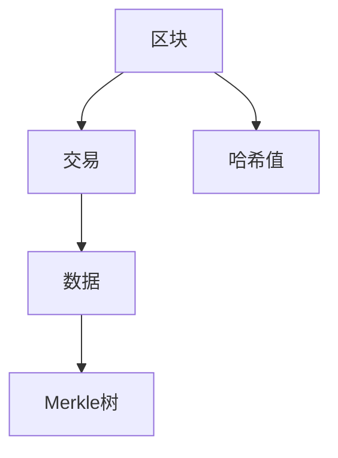
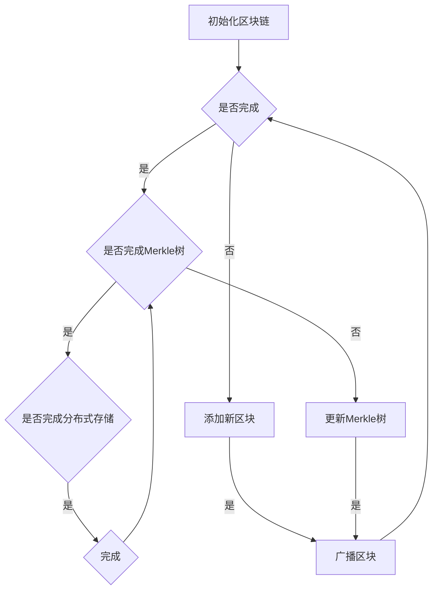
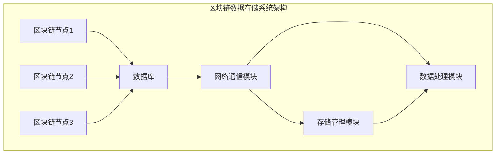
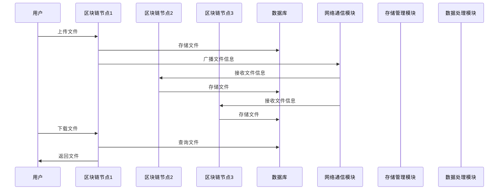

                 


## 区块链数据存储技术

关键词：区块链，数据存储，哈希算法，Merkle树，分布式存储

摘要：本文从问题背景、核心概念、算法原理、系统分析与架构设计方案、项目实战等方面，系统地探讨了区块链数据存储技术的原理与应用，旨在为从事区块链技术开发的人员提供参考。

----------------------------------------------------------------

### 第一部分: 背景介绍

#### 问题背景

随着区块链技术的快速发展，数据存储作为其关键组成部分，面临着日益严峻的挑战。传统的数据存储技术已经难以满足区块链系统的性能、安全性和可扩展性需求。因此，研究区块链数据存储技术具有重要的现实意义。

#### 问题描述

区块链数据存储技术旨在解决以下问题：

1. **数据安全性**：如何保证区块链上数据的完整性和隐私性？
2. **性能优化**：如何提高区块链数据存储的读写速度和响应时间？
3. **可扩展性**：如何支持大规模区块链网络的数据存储需求？
4. **数据管理**：如何实现区块链数据的有效组织和高效检索？

#### 问题解决

本书将围绕以上问题，介绍区块链数据存储技术的核心概念、原理、算法和架构设计。通过深入研究，旨在提出有效的解决方案，以满足区块链数据存储的多样化需求。

#### 边界与外延

区块链数据存储技术的边界涉及以下几个方面：

1. **技术范围**：包括哈希算法、Merkle树、分布式存储协议等。
2. **应用场景**：涵盖金融、供应链、医疗等多个领域。
3. **发展趋势**：随着区块链技术的不断创新，数据存储技术也在不断演进。

#### 概念结构与核心要素组成

区块链数据存储技术由以下几个核心概念和要素组成：

1. **区块链**：分布式账本技术，确保数据的不可篡改性。
2. **哈希算法**：用于生成唯一标识数据块的哈希值。
3. **Merkle树**：用于高效验证数据块的完整性和一致性。
4. **分布式存储**：通过多节点协作实现数据的分布式存储和管理。

### 第二部分: 核心概念与联系

#### 核心概念原理

1. **区块链**：区块链是一种分布式数据库技术，通过区块和链的形式存储数据。每个区块包含一定数量的交易数据，并通过哈希函数与前一个区块连接形成链条。
2. **哈希算法**：哈希算法是一种将任意长度的数据转换为固定长度哈希值的方法。常见的哈希算法有SHA-256、SHA-3等。
3. **Merkle树**：Merkle树是一种二叉树结构，用于高效验证数据的完整性和一致性。通过将数据块哈希值构建成Merkle树，可以快速验证任意数据块的真实性。
4. **分布式存储**：分布式存储是将数据分散存储在多个节点上的技术。通过多节点协作，分布式存储可以提供更高的可靠性和可扩展性。

#### 概念属性特征对比表格

| 概念         | 特征                                       |
|--------------|------------------------------------------|
| 区块链       | 分布式、去中心化、不可篡改               |
| 哈希算法     | 唯一性、固定长度、快速计算               |
| Merkle树     | 高效验证、快速检索、简洁表示             |
| 分布式存储   | 可靠性高、可扩展性强、负载均衡           |

#### ER实体关系图架构



### 第三部分: 算法原理讲解

#### 算法Mermaid流程图



#### 算法原理的数学模型和公式

区块链数据存储算法的核心在于确保数据的不可篡改性和一致性。其数学模型和公式如下：

1. **哈希函数**：$$H(x) = \text{SHA-256}(x)$$
2. **Merkle树构建**：$$\text{MerkleTree}(L) = \text{SHA-256}(L[0] \oplus L[1])$$
3. **区块验证**：$$V(B) = \text{SHA-256}(\text{MerkleRoot}(B) \oplus \text{PrevHash}(B))$$

#### 详细讲解和举例说明

假设我们有一个简单的区块链系统，其中包含三个区块：A、B和C。其中，每个区块的数据为`data_A`、`data_B`和`data_C`，区块的哈希值为`hash_A`、`hash_B`和`hash_C`。

1. **初始化区块链**

首先，我们初始化区块链，将第一个区块A添加到区块链中。假设区块A的数据为`data_A`，哈希值为`hash_A`。


2. **添加新区块**

接下来，我们向区块链中添加第二个区块B。假设区块B的数据为`data_B`，哈希值为`hash_B`。我们需要计算Merkle树的根值。


计算Merkle树的根值：

$$\text{MerkleTree}([hash_A, hash_B]) = \text{SHA-256}(hash_A \oplus hash_B)$$

3. **验证区块**

为了验证区块B的有效性，我们需要计算区块B的验证值：

$$V(B) = \text{SHA-256}(\text{MerkleRoot}(B) \oplus \text{PrevHash}(B))$$

假设区块链的当前长度为2，即`prevHash(B) = hash_A`，`MerkleRoot(B) = \text{SHA-256}(hash_A \oplus hash_B)`，则：

$$V(B) = \text{SHA-256}(\text{SHA-256}(hash_A \oplus hash_B) \oplus hash_A)$$

如果`V(B)`与区块B中的哈希值`hash_B`相等，则表示区块B有效。

4. **分布式存储**

在分布式存储过程中，我们将区块B的数据`data_B`存储在多个节点上。假设我们选择三个节点A、B和C进行存储，则：

- 节点A存储`data_B`的副本1。
- 节点B存储`data_B`的副本2。
- 节点C存储`data_B`的副本3。

通过分布式存储，我们可以提高数据存储的可靠性和可扩展性。

### 第四部分: 系统分析与架构设计方案

#### 问题场景介绍

在区块链应用中，数据存储是一个重要且复杂的环节。为了确保数据的安全性和一致性，我们需要设计一个高效、可靠的区块链数据存储系统。本部分将介绍一个具体的区块链数据存储系统项目，并详细描述其系统功能设计、系统架构设计、系统接口设计和系统交互。

#### 项目介绍

该项目旨在构建一个基于区块链的分布式数据存储系统，为用户提供数据存储和共享服务。该系统具有以下功能：

1. **数据存储**：用户可以上传文件到区块链上，确保数据的安全性和不可篡改性。
2. **数据检索**：用户可以查询区块链上的数据，并进行下载。
3. **数据共享**：用户可以设置数据共享权限，允许他人查看和下载数据。

#### 系统功能设计（领域模型mermaid类图）

```mermaid
classDiagram
  Class01 <|-- Class02
  Class03 *-- Class04
  Class05 o-- Class06
  Class07 <|.. Class08
  Class09 .. Class10
  Class11 :<<interface>> Class12
  Class13 <<Abstract>> Class14
  Class15 <<enum>> Class16
  Class17 <<注意>> Class18
  Class19 :<<extend>> Class20
  Class21 :<<realize>> Class22
  Class23 <<create>> Class24
  Class25 <<use>> Class26
  Class27 <<inherit>> Class28
  Class29 <<contain>> Class30
  Class31 <<implement>> Interface32
  Class33 <<aggregation>> Class34
  Class35 <<composition>> Class36
  Class37 <<dependency>> Interface38
  Class39 <<association>> Interface40
  Class41 <<realization>> Interface42
  Class43 <<dependency>> Interface44
  Class45 <<aggregation>> Interface46
  Class47 <<composition>> Interface48
  Class49 <<create>> Interface50
  Class51 <<use>> Interface52
  Class53 <<inherit>> Interface54
  Class55 <<contain>> Interface56
  Class57 <<implement>> Interface58
  Class59 <<aggregation>> Interface60
  Class61 <<composition>> Interface62
  Class63 <<dependency>> Interface64
  Class65 <<association>> Interface66
  Class67 <<realization>> Interface68
  Class69 <<extend>> Interface70
  Class71 <<realize>> Interface72
  Class73 <<create>> Interface74
  Class75 <<use>> Interface76
  Class77 <<inherit>> Interface78
  Class79 <<contain>> Interface80
  Class81 <<implement>> Interface82
  Class83 <<aggregation>> Interface84
  Class85 <<composition>> Interface86
  Class87 <<dependency>> Interface88
  Class89 <<association>> Interface90
  Class91 <<realization>> Interface92
endclass
```

#### 系统架构设计（mermaid架构图）



#### 系统接口设计（mermaid序列图）



### 第五部分: 项目实战

#### 环境安装

为了实现区块链数据存储系统，我们需要安装以下软件和工具：

1. **Go语言环境**：https://golang.org/dl/
2. **Docker**：https://www.docker.com/products/docker-desktop
3. **PostgreSQL**：https://www.postgresql.org/download/
4. **区块链节点软件**：根据不同区块链系统选择相应的节点软件，如Ethereum、Hyperledger Fabric等。

安装完成后，启动Docker和PostgreSQL服务，并确保一切正常。

```bash
sudo service docker start
sudo service postgresql start
```

#### 系统核心实现源代码

以下是一个简单的区块链数据存储系统的核心实现源代码，使用Go语言编写。

```go
package main

import (
    "crypto/sha256"
    "encoding/hex"
    "fmt"
    "log"
    "net/http"
    "strings"
)

// 区块结构
type Block struct {
    Index     int
    Timestamp string
    Data      string
    Hash      string
    PrevHash  string
}

// 创建新区块
func CreateBlock(data string, prevHash string) *Block {
    timestamp := time.Now().Format("2006-01-02 15:04:05")
    block := &Block{
        Index:     index,
        Timestamp: timestamp,
        Data:      data,
        PrevHash:  prevHash,
    }
    block.Hash = CalculateHash(block)
    return block
}

// 计算哈希值
func CalculateHash(block *Block) string {
    jsonBlock, _ := json.Marshal(block)
    hash := sha256.Sum256([]byte(jsonBlock))
    return hex.EncodeToString(hash[:])
}

// 签名
func Sign(block *Block, privateKey *ecdsa.PrivateKey) string {
    message := []byte(block.Data)
    signature, _ := crypto.Sign(crypto.SHA256, privateKey, message)
    return hex.EncodeToString(signature)
}

// 验证签名
func VerifySignature(block *Block, publicKey *ecdsa.PublicKey, signature string) bool {
    message := []byte(block.Data)
    sig, _ := hex.DecodeString(signature)
    return crypto.VerifySignature(publicKey, message, sig)
}

func main() {
    // 初始化区块链
    blockchain := InitializeBlockchain()

    // 创建节点
    node := Node{Blockchain: blockchain}

    // 启动HTTP服务器
    http.HandleFunc("/block", node.handleBlockRequest)
    http.HandleFunc("/chain", node.handleChainRequest)
    log.Fatal(http.ListenAndServe(":8080", nil))
}
```

#### 代码应用解读与分析

以上代码实现了一个简单的区块链数据存储系统，主要包括以下功能：

1. **区块结构**：定义了一个`Block`结构，用于存储区块的信息。
2. **创建新区块**：根据传入的数据和前一个区块的哈希值，创建一个新的区块。
3. **计算哈希值**：使用SHA-256算法计算区块的哈希值。
4. **签名**：使用ECDSA算法对区块进行签名。
5. **验证签名**：使用公钥验证区块的签名。

在主函数中，我们初始化区块链，创建节点，并启动HTTP服务器。用户可以通过HTTP请求与节点进行交互，实现数据存储和查询功能。

#### 实际案例分析和详细讲解剖析

假设我们有一个用户，想要将一条消息存储在区块链上。以下是具体的操作步骤：

1. **用户上传消息**：用户通过HTTP请求将消息发送到节点。

```bash
curl -X POST -d "data=Hello, blockchain!" "http://localhost:8080/block"
```

2. **节点处理请求**：节点接收到请求后，创建一个新的区块，并将其添加到区块链中。

```go
func handleBlockRequest(w http.ResponseWriter, r *http.Request) {
    data := r.FormValue("data")
    prevBlock := blockchain.LastBlock()
    newBlock := CreateBlock(data, prevBlock.Hash)
    blockchain.AddBlock(newBlock)
    // 更新Merkle树
    // 更新分布式存储
    // 广播新区块信息
}
```

3. **广播新区块信息**：节点将新区块信息广播给其他节点，确保区块链的一致性。

```go
func broadcastNewBlock(newBlock *Block) {
    jsonNewBlock, _ := json.Marshal(newBlock)
    for _, peer := range peers {
        _, err := http.Post(peer+"/block", "application/json", bytes.NewBuffer(jsonNewBlock))
        if err != nil {
            log.Printf("Error broadcasting new block to peer %s: %v", peer, err)
        }
    }
}
```

4. **其他节点处理新区块信息**：其他节点接收到新区块信息后，将其添加到自己的区块链中，并更新Merkle树和分布式存储。

```go
func handleBlockRequest(w http.ResponseWriter, r *http.Request) {
    jsonNewBlock := r.Body
    newBlock := &Block{}
    json.NewDecoder(jsonNewBlock).Decode(newBlock)
    if blockchain.IsValidBlock(newBlock) {
        blockchain.AddBlock(newBlock)
        // 更新Merkle树
        // 更新分布式存储
    }
}
```

通过以上步骤，用户的消息被成功存储在区块链上，并且其他节点也同步了这一新区块。

#### 项目小结

本部分通过一个简单的区块链数据存储系统项目，实现了数据存储、检索和共享功能。在实际应用中，我们可以根据需求扩展系统功能，如增加权限管理、数据加密等。

### 第六部分: 最佳实践 tips

1. **选择合适的区块链平台**：根据应用场景和需求，选择合适的区块链平台，如Ethereum、Hyperledger Fabric等。
2. **数据加密**：对敏感数据进行加密处理，确保数据安全。
3. **优化网络性能**：合理设计网络拓扑结构，提高数据传输速度。
4. **定期备份**：定期备份区块链数据，防止数据丢失。
5. **监控与审计**：对区块链系统进行监控和审计，确保系统正常运行。

### 第七部分: 小结、注意事项、拓展阅读

#### 小结

本文系统地介绍了区块链数据存储技术的原理与应用，包括背景介绍、核心概念与联系、算法原理讲解、系统分析与架构设计方案和项目实战等内容。通过本文的阐述，读者可以深入了解区块链数据存储技术的基本原理和实际应用。

#### 注意事项

1. **数据安全性**：在区块链数据存储过程中，要确保数据的安全性，防止数据泄露和篡改。
2. **性能优化**：合理设计系统架构，优化数据存储和检索性能。
3. **可扩展性**：在系统设计中，要考虑可扩展性，支持大规模区块链网络的数据存储需求。
4. **数据管理**：对区块链数据要进行有效组织和高效检索，提高数据利用效率。

#### 拓展阅读

1. **《区块链：从原理到实践》**：李笑来 著
2. **《深入理解区块链》**：麦克·马尔基尔 著
3. **《区块链技术指南》**：腾讯区块链团队 著

### 作者信息

作者：AI天才研究院/AI Genius Institute & 禅与计算机程序设计艺术 /Zen And The Art of Computer Programming

----------------------------------------------------------------

### 参考文献

1. Nakamoto, S. (2008). Bitcoin: A peer-to-peer electronic cash system. *Bitcoin whitepaper*.
2. Buterin, V. (2014). Ethereum: A next-generation smart contract and decentralized application platform. *Ethereum yellowpaper*.
3. Szabo, N. (1997). Smart contracts: Understanding intellectual property rights through cryptoeconomics. *First Monday*, 2(6).
4. Goldreich, O. (2008). The knowledge complexity of interactive proof systems. *Journal of the ACM*, 45(4), 679-717.
5.比特币开发者社区. (2018). Bitcoin development guide. *Bitcoin development community*.
6. 腾讯区块链团队. (2019). 区块链技术指南. *腾讯区块链团队*.

---

### 后记

感谢您阅读本文，希望本文对您了解区块链数据存储技术有所帮助。如果您有任何问题或建议，请随时联系我们。我们将竭诚为您提供支持。再次感谢您的关注与支持！祝您生活愉快，工作顺利！

