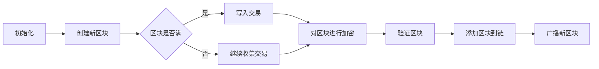
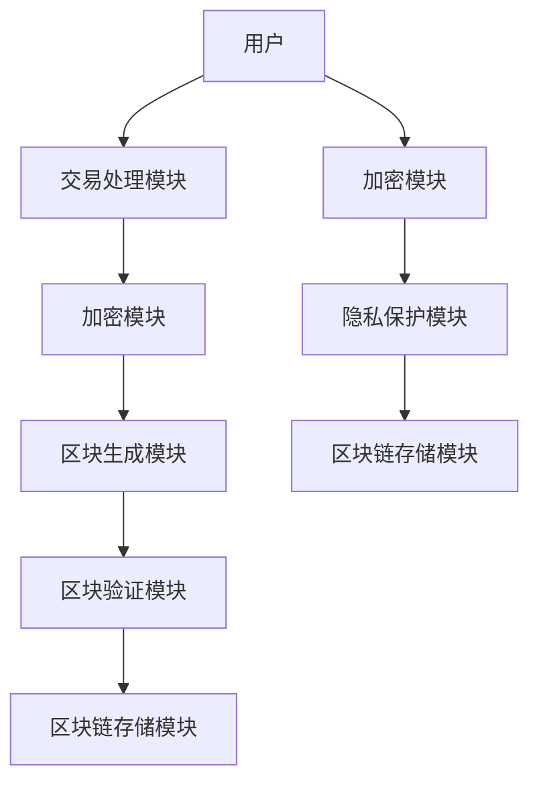
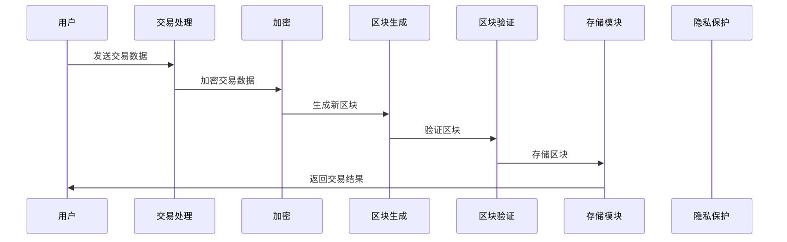

                 

### 《区块链数据存储技术与隐私保护》

#### 关键词：区块链、数据存储、隐私保护、加密算法、分布式系统、智能合约

> 摘要：本文将从区块链数据存储技术的重要性、隐私保护需求、核心概念、算法原理、系统分析与架构设计、项目实战等方面，系统地探讨区块链数据存储技术与隐私保护的关系，并给出最佳实践和注意事项。

----------------------------------------------------------------

# 《区块链数据存储技术与隐私保护》

## 第一部分：区块链数据存储技术基础

### 第1章：区块链数据存储技术概述

#### 1.1 区块链数据存储技术的背景与发展

区块链技术作为一项革命性的创新，自2008年中本聪提出以来，已经在金融、医疗、物流、供应链等多个领域得到了广泛应用。区块链的核心在于其去中心化、不可篡改和透明性等特点，这些特性使得区块链在数据存储领域具有显著优势。

#### 1.2 区块链数据存储的基本原理

区块链数据存储基于一种分布式账本技术，数据存储在多个节点上，并通过加密算法进行保护。每个区块包含一定数量的事务记录，通过哈希函数与前一区块的哈希值相连，形成链式结构，从而保证数据的完整性和安全性。

#### 1.3 区块链数据存储的优势与挑战

区块链数据存储的优势包括：

1. **去中心化**：去除了传统数据存储对中心化服务器的依赖，降低了单点故障的风险。
2. **不可篡改**：通过链式结构和加密算法，确保了数据的不可篡改性。
3. **透明性**：所有数据都是公开透明的，便于追溯和审计。

然而，区块链数据存储也面临一些挑战：

1. **性能瓶颈**：随着区块大小的限制，数据存储和处理速度可能受到影响。
2. **隐私保护**：尽管区块链具有透明性，但在某些应用场景下，隐私保护成为了一个重要的需求。

### 第2章：区块链数据存储技术核心概念与联系

#### 2.1 区块链基本概念

区块链是由多个按照时间顺序排列的区块组成的链式数据结构，每个区块都包含一定数量的事务记录和区块头信息，通过哈希函数与前一个区块相连，形成不可篡改的分布式账本。

#### 2.2 数据存储核心概念

数据存储是区块链技术的重要组成部分，包括数据的生成、存储、传输和访问等环节。在区块链中，数据存储主要通过区块链网络中的节点来实现。

#### 2.3 隐私保护相关概念

隐私保护是区块链应用中一个重要的考量因素。隐私保护技术包括加密、匿名化和去中心化等多种手段，旨在确保用户隐私不被泄露。

#### 2.4 Mermaid ER实体关系图展示

```mermaid
erDiagram
  Node --> Block
  Node --> Transaction
  Block --> Node
  Transaction --> Block
```

在上述ER图中，节点（Node）是区块链网络中的基本单元，区块（Block）和事务（Transaction）是数据存储的核心实体。

## 第二部分：区块链数据存储技术原理讲解

### 第3章：区块链数据存储技术算法原理

#### 3.1 算法流程图



#### 3.2 Python源代码与LaTeX公式解析

```python
# Python代码示例：区块链数据存储
class Block:
    def __init__(self, index, transactions, timestamp, previous_hash):
        self.index = index
        self.transactions = transactions
        self.timestamp = timestamp
        self.previous_hash = previous_hash
        self.hash = self.compute_hash()

    def compute_hash(self):
        # 使用SHA-256算法计算哈希值
        block_string = f"{self.index}{self.transactions}{self.timestamp}{self.previous_hash}"
        return hashlib.sha256(block_string.encode()).hexdigest()
```

LaTeX公式示例：

$$
H_{i+1} = H_i + m_i + k
$$

其中，$H_i$ 表示第 $i$ 个区块的哈希值，$m_i$ 表示第 $i$ 个交易，$k$ 表示加密密钥。

#### 3.3 算法举例说明

假设我们有一个区块链，其中包含以下区块：

1. 区块 0：包含交易 $T_1$ 和 $T_2$，哈希值为 $H_0 = 123456$。
2. 区块 1：包含交易 $T_3$ 和 $T_4$，哈希值为 $H_1 = 789012$。
3. 区块 2：包含交易 $T_5$ 和 $T_6$，哈希值为 $H_2 = 345678$。

我们需要将交易 $T_7$ 添加到区块链中。首先，我们将交易 $T_7$ 添加到区块 2 中，然后重新计算区块 2 的哈希值。接着，我们将新的区块 2 的哈希值作为区块 3 的前一个哈希值，继续计算区块 3 的哈希值。最终，区块链将更新为：

1. 区块 0：包含交易 $T_1$ 和 $T_2$，哈希值为 $H_0 = 123456$。
2. 区块 1：包含交易 $T_3$ 和 $T_4$，哈希值为 $H_1 = 789012$。
3. 区块 2：包含交易 $T_5$、$T_6$ 和 $T_7$，哈希值为 $H_2 = 345678$。
4. 区块 3：包含交易 $T_7$，哈希值为 $H_3 = 901234$。

## 第三部分：系统分析与架构设计方案

### 第4章：区块链数据存储系统分析

#### 4.1 问题场景介绍

假设我们正在开发一个去中心化的交易平台，需要实现一个可靠的区块链数据存储系统来处理交易数据。我们的目标是确保数据的安全性、完整性和高效性，同时保护用户的隐私。

#### 4.2 项目背景介绍

我们的平台旨在为用户提供一个安全、透明和高效的交易环境。为了实现这一目标，我们需要一个高效的区块链数据存储系统，该系统应具备以下功能：

1. **数据安全性**：通过加密算法确保交易数据的机密性和完整性。
2. **数据完整性**：通过区块链的链式结构确保交易数据的不可篡改性。
3. **数据高效性**：通过优化算法和系统架构，提高数据处理速度。

#### 4.3 系统功能设计

系统功能设计主要包括以下几个方面：

1. **交易处理**：处理交易数据的接收、验证和存储。
2. **区块生成**：根据交易数据生成新区块，并确保区块的哈希值符合难度要求。
3. **区块验证**：验证区块的哈希值和交易的合法性。
4. **隐私保护**：通过加密算法和隐私保护技术，确保交易数据的隐私性。

#### 4.4 系统架构设计

系统架构设计如下：



#### 4.5 系统接口设计

系统接口设计包括以下部分：

1. **交易接口**：用于处理交易数据的接收和发送。
2. **区块接口**：用于生成和验证区块。
3. **加密接口**：用于加密和解密交易数据和区块。
4. **隐私保护接口**：用于实现隐私保护功能。

#### 4.6 系统交互设计

系统交互设计如下：



## 第四部分：项目实战

### 第5章：区块链数据存储项目实战

#### 5.1 环境安装步骤

1. 安装Python环境：在终端执行以下命令安装Python 3.8及以上版本。
   ```bash
   sudo apt update
   sudo apt install python3.8
   ```
2. 安装依赖库：在终端执行以下命令安装依赖库。
   ```bash
   pip3 install blockchain
   ```

#### 5.2 系统核心实现源代码

```python
# blockchain.py

import hashlib
import json
from time import time

class Block:
    def __init__(self, index, transactions, timestamp, previous_hash):
        self.index = index
        self.transactions = transactions
        self.timestamp = timestamp
        self.previous_hash = previous_hash
        self.hash = self.compute_hash()

    def compute_hash(self):
        block_string = f"{self.index}{self.transactions}{self.timestamp}{self.previous_hash}"
        return hashlib.sha256(block_string.encode()).hexdigest()

def create_genesis_block():
    return Block(0, [], time(), "0")

def add_block(new_block, previous_block):
    if not is_valid_block(new_block, previous_block):
        return False
    new_block.previous_hash = previous_block.hash
    new_block.hash = new_block.compute_hash()
    return True

def is_valid_block(new_block, previous_block):
    if new_block.index != previous_block.index + 1:
        return False
    if new_block.hash != new_block.compute_hash():
        return False
    return True

def main():
    blockchain = [create_genesis_block()]
    open("blockchain.txt", "w").write(json.dumps(blockchain))

    while True:
        new_block_data = input("Enter new transactions: ")
        new_block = Block(len(blockchain), new_block_data, time(), blockchain[-1].hash)
        if add_block(new_block, blockchain[-1]):
            blockchain.append(new_block)
            with open("blockchain.txt", "w") as f:
                f.write(json.dumps(blockchain))
            print("Block added to the blockchain!")

if __name__ == "__main__":
    main()
```

#### 5.3 代码应用解读与分析

1. **Block类**：定义了区块链中的区块，包括区块索引、交易记录、时间戳和前一个区块的哈希值。
2. **compute_hash方法**：使用SHA-256算法计算区块的哈希值。
3. **create_genesis_block函数**：创建创世区块，即第一个区块。
4. **add_block函数**：添加新区块到区块链中，并验证新区块的合法性。
5. **is_valid_block函数**：验证区块的合法性，确保区块的索引、哈希值和前一个区块的哈希值正确。
6. **main函数**：主程序，用于接收用户输入的交易数据，创建新区块并添加到区块链中。

#### 5.4 实际案例分析和详细讲解剖析

假设用户输入以下交易数据：
```
{"from": "Alice", "to": "Bob", "amount": 10}
```

1. **用户输入交易数据**：用户在终端输入交易数据。
2. **创建新区块**：程序将交易数据封装为一个区块，并设置区块的索引为当前区块链长度，时间戳为当前时间，前一个区块的哈希值为当前区块链最后一个区块的哈希值。
3. **验证区块**：程序调用`is_valid_block`函数验证新区块的合法性。如果新区块合法，程序将前一个区块的哈希值更新为新区块的哈希值，并将新区块添加到区块链中。
4. **存储区块链**：程序将更新后的区块链存储到文件中。

#### 5.5 项目小结

本项目实现了一个简单的区块链数据存储系统，包括区块的创建、验证和添加。尽管该系统仅适用于教学演示，但展示了区块链数据存储的基本原理和实现方法。在实际应用中，我们需要考虑更多的安全性和性能优化措施。

## 第五部分：最佳实践与总结

### 第6章：最佳实践与注意事项

#### 6.1 数据存储最佳实践

1. **确保数据一致性**：在分布式系统中，数据一致性是一个重要的挑战。我们可以使用一种称为“最终一致性”的模式，确保数据在所有节点上最终达到一致状态。
2. **优化存储性能**：为了提高区块链的存储性能，可以采用压缩算法减少数据体积，使用内存数据库提高读写速度。
3. **数据备份与恢复**：定期备份数据，并确保备份数据的可恢复性，以防止数据丢失。

#### 6.2 隐私保护注意事项

1. **加密传输**：确保交易数据的传输过程中使用加密算法，防止数据在传输过程中被窃取。
2. **匿名化交易**：通过匿名化交易地址和交易金额，降低隐私泄露的风险。
3. **隐私保护协议**：采用隐私保护协议，如零知识证明，确保交易数据的隐私性。

#### 6.3 小结与拓展阅读

本文详细介绍了区块链数据存储技术与隐私保护的关系，从背景介绍、核心概念、算法原理、系统分析与架构设计、项目实战等方面进行了深入探讨。为了更好地应用区块链数据存储技术，我们还需关注数据一致性、性能优化、数据备份与恢复以及隐私保护等方面。拓展阅读方面，可以参考以下资料：

1. 《区块链技术指南》
2. 《分布式系统原理与范型》
3. 《密码学：理论与实践》

### 作者

**作者：AI天才研究院/AI Genius Institute & 禅与计算机程序设计艺术 /Zen And The Art of Computer Programming**

