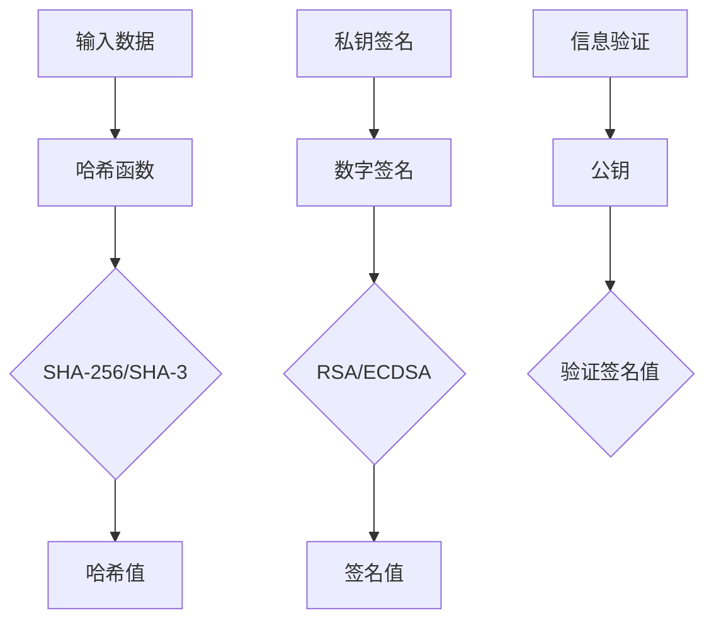
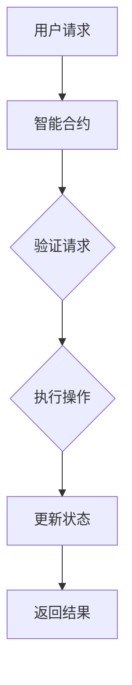
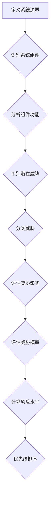

                 

### 文章标题

《区块链系统安全设计考量》

关键词：区块链安全、共识算法、加密技术、智能合约、威胁建模、风险管理

摘要：本文将深入探讨区块链系统安全设计的关键考量，从基础概念到具体实施策略，全面解析区块链技术的安全性问题。通过对比共识算法、详细讲解加密技术、分析智能合约安全挑战、介绍威胁建模和风险管理方法，本文旨在为区块链系统开发者提供全面的指导，确保系统的安全性和可靠性。

### 引言

区块链技术作为近年来最为热门的数字技术之一，已经成为金融、供应链管理、智能合约、数字身份认证等多个领域的关键技术。其去中心化、不可篡改、透明性等特点，使得区块链在数据存储和传输方面具有显著优势。然而，随着区块链应用的广泛普及，区块链系统的安全性问题也日益凸显。

在区块链系统中，安全性不仅仅是一个技术问题，更是一个关乎系统信誉和用户信任的关键因素。由于区块链网络的去中心化特性，任何一个节点的安全漏洞都可能对整个网络造成严重影响。因此，确保区块链系统的安全性是每个开发者都需要重视的重要任务。

本文将围绕区块链系统安全设计的关键考量展开，通过详细的剖析和实例说明，帮助读者理解区块链安全设计的核心概念、技术手段和最佳实践。文章将从以下方面进行深入探讨：

1. **核心概念和原则**：介绍区块链安全的基本概念，如共识算法、加密技术和智能合约，并比较不同共识算法的安全特性。
2. **加密技术**：详细讲解区块链中常用的加密技术，包括哈希函数、数字签名和加密算法。
3. **智能合约安全**：探讨智能合约在区块链系统中的角色及其安全挑战，并提供防范措施。
4. **威胁建模和风险评估**：解释威胁建模和风险评估的重要性，并描述其具体步骤。
5. **攻击和对策**：分析常见的区块链攻击类型，如51%攻击、Sybil攻击和智能合约漏洞，并提出相应的对策。
6. **安全框架和标准**：介绍现有的区块链安全框架和标准，以及它们在实际应用中的作用。
7. **最佳实践和总结**：总结区块链系统安全设计的最佳实践，并提出注意事项和拓展阅读建议。

通过本文的深入分析，读者将能够全面了解区块链系统安全设计的要点，从而在开发过程中更好地保障系统的安全性和可靠性。

### 核心概念与原则

在深入探讨区块链系统安全设计之前，我们需要先了解一些核心概念和原则。这些概念和原则是构建安全区块链系统的基石，它们包括共识算法、加密技术以及智能合约。

#### 共识算法

共识算法是区块链系统的核心机制之一，它负责确保区块链网络的参与者能够达成一致。共识算法的主要功能是选择哪一个交易最先被添加到区块链中，从而保证区块链的有序性和不可篡改性。

常见的共识算法有：

1. **工作量证明（PoW，Proof of Work）**：节点通过解决复杂的数学问题来证明其工作量，从而获得生成新区块的权利。这种算法具有较高的安全性，但也消耗大量计算资源。
   
2. **权益证明（PoS，Proof of Stake）**：节点根据其持有的代币数量和持有时间来决定生成新区块的几率。与PoW相比，PoS算法消耗的资源较少，但可能存在“富者愈富”的问题。

3. **委托权益证明（DPoS，Delegated Proof of Stake）**：通过选举代表来执行共识任务，这些代表按照其被投票的数量来决定生成新区块的顺序。

不同共识算法的安全特性有所不同。例如，PoW算法因其较高的计算难度而具有较好的抗攻击性，但可能导致资源浪费；而PoS算法则更注重资源效率，但在安全性上可能有所妥协。

#### 加密技术

区块链系统中的加密技术用于确保数据的机密性、完整性和真实性。以下是一些关键的加密技术：

1. **哈希函数**：哈希函数是将任意长度的数据映射为固定长度的字符串的函数。区块链中的每个区块都包含前一个区块的哈希值，从而形成一种链式结构，确保区块链的不可篡改性。

2. **数字签名**：数字签名是一种用于验证信息发送者身份和确保信息完整性的加密技术。发送者使用私钥对信息进行签名，接收者使用公钥验证签名。

3. **加密算法**：加密算法用于保护数据的机密性，防止未授权访问。常用的加密算法有对称加密（如AES）和非对称加密（如RSA）。

#### 智能合约

智能合约是区块链上的可编程协议，它自动执行合同条款，无需人工干预。智能合约的安全性对其可靠性至关重要。

智能合约的主要特点包括：

1. **自主性**：智能合约一旦部署，即会按照预设条件自动执行，不受人为干预。

2. **透明性**：智能合约的代码和执行过程对所有网络参与者可见，增加了透明度和信任度。

3. **不可篡改性**：智能合约一旦被添加到区块链上，其代码和状态便不可更改，保证了合同的执行一致性。

然而，智能合约也存在安全风险。由于代码的复杂性和开发者经验不足，智能合约可能存在漏洞，导致恶意攻击者利用漏洞进行非法操作。

#### 比较表格

为了更好地理解这些核心概念和原则，我们提供了一个比较表格，列出了不同共识算法和加密技术的特点：

| **共识算法** | **特点** | **安全性** | **资源消耗** |
|:-------------:|:--------:|:----------:|:------------:|
| 工作量证明（PoW） | 通过计算复杂性问题证明工作量 | 高 | 较高 |
| 权益证明（PoS） | 根据持有代币数量和持有时间决定权益 | 中等 | 较低 |
| 委托权益证明（DPoS） | 选举代表来执行共识任务 | 较高 | 中等 |

| **加密技术** | **特点** | **安全性** | **适用场景** |
|:-------------:|:--------:|:----------:|:------------:|
| 哈希函数 | 将数据映射为固定长度字符串 | 高 | 数据完整性验证 |
| 数字签名 | 验证信息发送者身份 | 高 | 身份验证和信息完整性 |
| 加密算法 | 保护数据机密性 | 高 | 数据机密性保护 |

通过上述核心概念和原则的介绍，我们可以为后续区块链系统安全设计的具体实施提供理论基础。在接下来的章节中，我们将深入探讨各种加密技术及其在区块链系统中的应用，以及智能合约的安全性和威胁建模方法。

#### 加密技术详解

区块链系统中的加密技术是其安全性保障的核心，它们包括哈希函数、数字签名和加密算法。这些技术共同作用，确保区块链上的数据在传输和存储过程中不会被未授权的第三方访问、篡改或伪造。

##### 哈希函数

哈希函数是将任意长度的输入数据映射为固定长度输出值的函数。在区块链系统中，哈希函数主要用于确保数据的完整性和不可篡改性。常见的哈希函数包括SHA-256、SHA-3和MD5等。

- **SHA-256**：SHA-256是一种安全哈希算法，将输入数据映射为256位的输出值。由于其高安全性和广泛的采用，SHA-256被广泛应用于区块链系统中，例如比特币的区块哈希。
  
- **SHA-3**：SHA-3是SHA-2系列算法的替代品，具有更高的安全性。它是一个基于Keccak算法的哈希函数，能够处理更大规模的数据。

- **MD5**：尽管MD5在过去被广泛使用，但由于其安全性较低，已经不再推荐用于安全敏感的场景。MD5的输出长度仅为128位，容易受到碰撞攻击。

哈希函数的工作原理可以概括为以下步骤：

1. **输入数据**：哈希函数接受任意长度的输入数据。
2. **处理数据**：哈希函数通过一系列的算法处理输入数据，将其压缩为固定长度的输出值。
3. **输出哈希值**：哈希函数输出一个唯一的哈希值，该值具有高度的随机性和不可逆性。

在区块链系统中，每个区块都包含前一个区块的哈希值，从而形成一个链接的链条。这种链式结构确保了区块链的不可篡改性。任何对区块链数据的修改都会导致哈希值的改变，进而破坏整个链的完整性。

##### 数字签名

数字签名是一种用于验证信息发送者身份和确保信息完整性的加密技术。它基于非对称加密算法，包括公钥和私钥对。数字签名的主要过程如下：

1. **签名过程**：发送者使用自己的私钥对信息进行签名，生成一个签名值。
2. **验证过程**：接收者使用发送者的公钥对签名值进行验证，以确认信息确实由发送者发送，并且未被篡改。

常用的数字签名算法包括RSA和ECDSA（椭圆曲线数字签名算法）。

- **RSA**：RSA是一种基于大整数分解难题的非对称加密算法。它使用一对密钥，即公钥和私钥。公钥用于验证签名，私钥用于生成签名。RSA算法安全性较高，但计算复杂度较大，不适用于大规模交易。

- **ECDSA**：ECDSA是基于椭圆曲线密码学的数字签名算法，具有更高的安全性和效率。与RSA相比，ECDSA使用的密钥长度较短，计算速度更快，因此在区块链系统中得到广泛应用。

数字签名的工作流程可以总结为：

1. **生成密钥对**：发送者生成公钥和私钥对。
2. **信息签名**：发送者使用私钥对信息进行签名，生成签名值。
3. **信息验证**：接收者使用公钥验证签名值，以确认信息的完整性和发送者身份。

##### 加密算法

加密算法用于保护区块链上数据的机密性，防止未授权的第三方访问。常见的加密算法包括对称加密和非对称加密。

- **对称加密**：对称加密使用相同的密钥进行加密和解密。常见的对称加密算法包括AES（高级加密标准）和DES（数据加密标准）。对称加密的优点是速度快、计算成本低，但密钥分发和管理复杂。

- **非对称加密**：非对称加密使用一对密钥，即公钥和私钥。公钥用于加密，私钥用于解密。常见的非对称加密算法包括RSA和ECDSA。非对称加密的优点是解决了密钥分发问题，但计算复杂度较高。

在区块链系统中，加密算法主要用于保护用户的交易数据和智能合约代码。通过加密，可以确保数据在传输过程中不会被窃取或篡改，从而增强系统的安全性。

##### Mermaid图解

为了更好地理解加密技术的工作原理，我们使用Mermaid绘制了一些流程图：

通过这些加密技术，区块链系统能够有效地保护数据的完整性、真实性和机密性，从而确保系统的安全性和可靠性。在接下来的章节中，我们将探讨智能合约的安全挑战及其应对策略。

#### 智能合约安全

智能合约是区块链系统中的一个重要组成部分，它们通过自动执行预设的合同条款，实现了去中心化的交易和管理。然而，智能合约的安全问题也一直是区块链领域研究的热点。本文将探讨智能合约在区块链系统中的角色、常见的安全挑战，并提出相应的安全对策。

##### 智能合约在区块链系统中的角色

智能合约是一种自执行的合约，其代码被部署在区块链上，并在满足特定条件时自动执行。智能合约的出现，解决了传统合约执行过程中存在的信息不对称和信任问题。在区块链系统中，智能合约的主要角色包括：

1. **交易执行**：智能合约可以自动处理和执行各种交易，如加密货币转账、合同执行等。
2. **去中心化治理**：智能合约可以用于去中心化的决策和治理，如投票、资产管理等。
3. **自动化管理**：智能合约可以自动执行复杂的业务流程，减少人为干预，提高效率。

智能合约的优点包括：

- **透明性**：智能合约的代码和执行过程对所有网络参与者可见，增加了透明度和信任度。
- **不可篡改性**：一旦智能合约被部署到区块链上，其代码和状态就不可更改，保证了合同的执行一致性。
- **高效性**：智能合约自动执行，减少了人工干预，提高了业务处理速度。

##### 常见的安全挑战

尽管智能合约具有诸多优点，但其安全性问题也不容忽视。以下是一些常见的智能合约安全挑战：

1. **代码漏洞**：智能合约的代码可能存在漏洞，如整数溢出、数组越界等。这些漏洞可能导致智能合约被攻击者利用，从而造成资金损失。
2. **前端攻击**：攻击者通过恶意前端代码，诱导用户执行不安全的操作，如发送大量无效交易，导致智能合约拒绝服务。
3. **重入攻击**：攻击者通过多次调用智能合约中的函数，使得合约在处理外部调用时，可能被重复执行，从而盗取资金。
4. **回滚攻击**：攻击者通过制造多个交易，使得智能合约在执行过程中回滚到之前的交易状态，从而逃避合约条款。
5. **逻辑漏洞**：智能合约的逻辑设计可能存在缺陷，导致在特定条件下，合约无法按预期执行。

##### 安全对策

为了应对智能合约的安全挑战，开发者和安全专家可以采取以下安全对策：

1. **代码审计**：对智能合约代码进行详细审计，寻找潜在的漏洞。安全专家可以使用静态分析、动态分析等技术，检测代码中的潜在问题。
2. **测试用例**：编写全面的测试用例，对智能合约进行自动化测试。测试用例应涵盖各种可能的输入和执行路径，确保智能合约在各种情况下都能正确执行。
3. **安全编程**：采用安全编程实践，如使用安全库、避免使用易受攻击的函数等，减少智能合约代码中的漏洞。
4. **共识算法**：选择合适的共识算法，如PoS或DPoS，确保区块链网络具有较高的安全性和可信度。
5. **透明度**：提高智能合约代码的透明度，让更多开发者参与审计和测试，共同发现和修复漏洞。
6. **安全标准**：遵循现有的智能合约安全标准和最佳实践，如OpenZeppelin的安全库，提高智能合约的安全性。

##### Mermaid图解

为了更好地理解智能合约的工作原理和安全挑战，我们使用Mermaid绘制了一个简单的智能合约执行流程图：

通过上述对策，我们可以显著提高智能合约的安全性，减少潜在的安全威胁。在接下来的章节中，我们将探讨威胁建模和风险评估的方法，帮助开发者识别和应对区块链系统的潜在风险。

#### 威胁建模和风险评估

在区块链系统设计中，威胁建模和风险评估是确保系统安全性的关键步骤。通过系统化的方法，开发者可以识别潜在的安全威胁，评估其可能的影响，并采取相应的防护措施。以下我们将详细解释威胁建模和风险评估的过程，并使用一个具体的区块链系统实例进行说明。

##### 威胁建模

威胁建模是一个系统化识别和分析系统潜在威胁的过程。以下是进行威胁建模的步骤：

1. **定义系统边界**：首先，明确区块链系统的边界，包括网络节点、智能合约、前端应用等。
2. **识别系统组件**：列出系统中的所有组件，如区块链节点、存储节点、交易处理器、前端应用等。
3. **分析组件功能**：详细分析每个组件的功能和交互方式，理解其安全需求。
4. **识别潜在威胁**：根据组件的功能和安全需求，识别可能对系统造成威胁的因素，如恶意攻击、系统漏洞、网络钓鱼等。
5. **分类威胁**：将识别出的威胁进行分类，例如按照威胁类型（如信息泄露、拒绝服务、财产损失等）进行归类。

##### 风险评估

风险评估是评估威胁对系统可能造成的影响和概率的过程。以下是进行风险评估的步骤：

1. **确定威胁**：根据威胁建模的结果，确定系统面临的威胁。
2. **评估威胁影响**：分析每个威胁可能对系统造成的负面影响，如数据丢失、服务中断、财务损失等。
3. **评估威胁概率**：评估每个威胁发生的概率，这可以通过历史数据、专家判断或统计模型来确定。
4. **计算风险水平**：使用威胁影响和威胁概率来计算每个威胁的风险水平。常用的方法有风险评分法、风险矩阵等。
5. **优先级排序**：根据风险水平对威胁进行排序，确定优先级，以便采取相应的防护措施。

##### 实例分析

假设我们正在开发一个去中心化的金融交易平台，以下是如何进行威胁建模和风险评估的实例：

1. **定义系统边界**：
   - 区块链网络：包含多个节点，负责处理交易和验证。
   - 智能合约：处理交易逻辑，如存款、提款、转账等。
   - 前端应用：用户进行交易操作的平台。

2. **识别系统组件**：
   - 区块链节点：负责存储交易记录、处理交易请求。
   - 存储节点：负责存储用户信息和交易历史。
   - 交易处理器：处理区块链中的交易请求。

3. **分析组件功能**：
   - 区块链节点：确保交易记录的准确性和一致性。
   - 智能合约：确保交易的逻辑和执行。
   - 前端应用：提供用户界面和交易操作。

4. **识别潜在威胁**：
   - 恶意节点攻击：可能通过控制多数节点来篡改交易记录。
   - 智能合约漏洞：可能导致资金损失或操作失败。
   - 网络钓鱼：可能诱导用户泄露个人信息或密码。

5. **分类威胁**：
   - 信息泄露：涉及用户数据和交易记录。
   - 拒绝服务：可能导致系统瘫痪，交易处理受阻。
   - 财产损失：直接涉及资金的盗取和损失。

6. **评估威胁影响**：
   - 恶意节点攻击：可能使系统完全失控，导致大量资金损失。
   - 智能合约漏洞：可能导致特定交易失败或资金被锁。
   - 网络钓鱼：可能导致用户个人信息泄露，间接影响系统安全。

7. **评估威胁概率**：
   - 恶意节点攻击：高度依赖区块链网络规模和治理机制，概率中等。
   - 智能合约漏洞：高度依赖代码质量和安全审计，概率较高。
   - 网络钓鱼：高度依赖用户意识和安全措施，概率中等。

8. **计算风险水平**：
   - 使用风险评分法，综合考虑威胁影响和威胁概率，对每个威胁进行评分。

9. **优先级排序**：
   - 根据风险评分，确定优先级，例如恶意节点攻击和高危漏洞。

通过上述步骤，我们可以系统化地识别和评估区块链系统中的潜在威胁，为后续的安全设计和防护措施提供依据。

##### Mermaid图解

为了更直观地展示威胁建模和风险评估的过程，我们使用Mermaid绘制了一个流程图：

通过详细的威胁建模和风险评估，开发者可以更好地理解和应对区块链系统中的潜在风险，从而设计出更加安全可靠的系统。在接下来的章节中，我们将探讨常见的区块链攻击类型及其对策。

#### 常见攻击类型

在区块链系统中，尽管其设计初衷是去中心化和高度安全，但仍然存在多种潜在的攻击方式，这些攻击可能对系统的完整性、可用性和保密性造成威胁。以下我们将介绍几种常见的区块链攻击类型，包括51%攻击、Sybil攻击和智能合约漏洞，并讨论各自的防范措施。

##### 51%攻击（51% Attack）

51%攻击，也称为 majority attack，是指攻击者控制了区块链网络中超过一半的算力或验证权，从而能够操纵区块链的运作。攻击者可以采取以下行动：

- **双花攻击（Double Spending）**：攻击者可以生成两个不同的交易，分别将同一笔资金花在不同的地方，导致资金被重复使用。
- **拒绝服务攻击（Denial of Service, DoS）**：攻击者可以制造大量无效交易，占满区块链网络，使得其他交易无法正常进行。

防范措施：

- **增加网络难度**：通过增加共识算法的难度，提高攻击者所需的算力，从而降低攻击成功率。
- **多节点验证**：采用多个独立的验证节点，减少单一节点被攻击的风险。
- **经济激励**：通过奖励机制激励更多的节点参与网络，提高网络的整体算力和安全性。

##### Sybil攻击（Sybil Attack）

Sybil攻击是一种攻击者创建多个虚假身份来操纵区块链系统的一种攻击方式。攻击者通过这些虚假身份获取更多的控制权，从而影响区块链的决策过程。Sybil攻击的主要目的是：

- **操纵共识机制**：通过控制多数节点，攻击者可以操纵区块链的决策过程，如投票结果等。
- **伪造交易记录**：攻击者可以通过虚假身份进行虚假交易，从而篡改区块链上的交易记录。

防范措施：

- **身份验证**：引入严格的身份验证机制，确保每个节点都是真实可信的。
- **节点奖励机制**：通过奖励机制鼓励更多节点参与网络，减少虚假身份的出现。
- **随机性节点选择**：采用随机性机制选择参与共识的节点，减少攻击者控制节点的可能性。

##### 智能合约漏洞（Smart Contract Vulnerability）

智能合约作为区块链系统的重要组成部分，由于其代码执行的自动化特性，可能存在各种安全漏洞。以下是一些常见的智能合约漏洞：

- **整数溢出/下溢**：由于编程错误，导致整数运算结果超出预期范围，从而可能导致合约崩溃或资金损失。
- **重入攻击（Reentrancy Attack）**：攻击者通过反复调用某个函数，使合约在处理外部调用时多次执行，从而盗取资金。
- **代码注入**：攻击者通过插入恶意代码，篡改合约的正常执行流程。

防范措施：

- **代码审计**：对智能合约代码进行详细审计，查找潜在的安全漏洞。
- **安全编程实践**：遵循安全编程规范，避免使用易受攻击的函数和库。
- **测试用例**：编写全面的测试用例，对智能合约进行自动化测试，确保在各种情况下都能正确执行。
- **使用安全库**：使用经过验证的安全库和框架，如OpenZeppelin，提高智能合约的安全性。

##### 对策总结

针对上述常见的区块链攻击类型，开发者可以采取以下综合措施来提高区块链系统的安全性：

- **多层次的防御体系**：通过多种安全机制，如共识算法改进、节点验证、智能合约审计等，形成多层次的防御体系。
- **定期安全审计**：定期对区块链系统和智能合约进行安全审计，及时发现和修复漏洞。
- **教育和培训**：加强对开发者和用户的培训，提高其对安全威胁的认识和应对能力。
- **透明度和社区参与**：提高区块链系统的透明度，鼓励社区参与安全审计和漏洞报告，共同维护系统安全。

通过上述措施，开发者可以显著提高区块链系统的安全性，减少潜在的安全威胁，确保系统的稳定运行和用户信任。

#### 安全框架和标准

为了提高区块链系统的安全性，业界已经制定了一系列安全框架和标准，这些框架和标准为区块链系统的安全设计和实现提供了指导。以下将介绍几种常见的区块链安全框架和标准，并分析它们在实际应用中的作用。

##### OWASP Blockchain Security Project

OWASP Blockchain Security Project是一个开源的安全项目，旨在帮助开发者和安全专家识别和解决区块链应用中的安全问题。该项目提供了详细的威胁模型、安全测试方法和最佳实践。

- **威胁模型**：OWASP Blockchain Security Project提供了一个全面的威胁模型，涵盖从共识算法到智能合约的各个层面，帮助开发者识别潜在的安全风险。
- **安全测试方法**：项目提供了多种安全测试方法，包括静态代码分析、动态代码分析和渗透测试等，帮助开发者发现和修复安全漏洞。
- **最佳实践**：OWASP Blockchain Security Project列出了许多最佳实践，如加密技术的使用、智能合约代码审计和安全编程规范，为开发者提供实际操作指南。

##### ISO/IEC 27000系列标准

ISO/IEC 27000系列标准是国际标准化组织（ISO）和国际电工委员会（IEC）制定的关于信息安全管理的标准。虽然这些标准不是专门针对区块链的，但它们为区块链系统的信息安全提供了重要的指导。

- **信息安全管理体系（ISMS）**：ISO/IEC 27001标准提供了一个框架，帮助组织建立和维护一个有效的信息安全管理系统。通过实施ISMS，区块链系统可以确保数据保护、隐私保护和业务连续性。
- **信息安全控制**：ISO/IEC 27002标准提供了详细的信息安全控制措施，包括物理安全、网络安全、应用安全和数据处理安全等，为区块链系统的安全设计提供了具体指导。

##### NIST区块链框架

美国国家标准与技术研究院（NIST）发布了区块链框架，旨在为区块链技术的应用提供标准化指导。NIST区块链框架分为五个主要部分：概述、框架概念、框架应用、框架实施和框架评估。

- **概述**：框架概述了区块链的基本概念和关键特征，帮助用户了解区块链的基本原理。
- **框架概念**：框架定义了区块链系统的关键组件，如共识算法、数据结构、加密技术等，并提供了一个概念性框架，帮助开发者设计安全的区块链系统。
- **框架应用**：框架描述了区块链在不同应用场景中的潜在用途，包括供应链管理、身份验证、数据共享等。
- **框架实施**：框架提供了实施区块链系统的指导，包括设计、开发、部署和维护等环节。
- **框架评估**：框架提供了一个评估框架，帮助组织评估区块链系统的安全性和有效性。

##### ISO/IEC 29134区块链安全标准

ISO/IEC 29134标准是专门针对区块链安全的国际标准，它提供了区块链系统安全性的评估方法和安全控制措施。

- **安全评估方法**：标准定义了评估区块链系统安全性的方法和流程，包括风险评估、漏洞评估和安全测试等。
- **安全控制措施**：标准列出了各种安全控制措施，如加密技术、访问控制、审计和监控等，帮助开发者设计安全的区块链系统。

##### 最佳实践

在实际应用中，以下是一些最佳实践可以帮助提高区块链系统的安全性：

- **代码审计**：对智能合约代码进行详细审计，确保代码没有漏洞。
- **安全编程**：遵循安全编程规范，避免使用易受攻击的函数和库。
- **定期更新**：定期更新区块链系统和智能合约，修复已知漏洞。
- **社区参与**：鼓励社区参与安全审计和漏洞报告，共同维护系统安全。
- **透明度**：提高区块链系统的透明度，增强用户对系统的信任。

通过遵循这些安全框架和标准，开发者可以设计出更加安全可靠的区块链系统，减少潜在的安全威胁，确保系统的稳定运行和用户信任。

#### 最佳实践

在设计区块链系统时，确保系统安全是开发者的首要任务。以下是一些最佳实践，旨在帮助开发者创建一个安全可靠的区块链系统。

##### 设计原则

1. **去中心化**：区块链系统的核心特性之一是去中心化。确保系统中的所有关键功能都分布在不同节点上，避免单点故障。
2. **最小权限原则**：每个节点和模块都应该只有完成其任务所需的最低权限，避免不必要的权限提升。
3. **代码审计**：在部署智能合约和核心代码之前，进行彻底的代码审计，使用静态和动态分析工具检测潜在的安全漏洞。

##### 实施策略

1. **多层次的防护**：在系统设计中采用多层次的安全机制，如身份验证、访问控制、加密和审计等。
2. **定期更新**：定期更新区块链系统和智能合约，修补已知漏洞，确保系统保持最新状态。
3. **共识算法选择**：选择适合业务需求的共识算法，并定期评估其安全性和性能。
4. **智能合约设计**：遵循安全编程规范，避免使用易受攻击的函数和库。设计简单且健壮的智能合约，减少逻辑漏洞。

##### 安全措施

1. **身份验证**：引入严格的身份验证机制，确保所有参与者都是真实可信的。
2. **加密技术**：使用强加密算法保护数据传输和存储过程中的机密性和完整性。
3. **访问控制**：为系统中的不同角色和模块设置适当的访问权限，防止未授权访问。
4. **审计和监控**：实施全面的审计和监控机制，记录所有重要操作和交易，以便在出现安全事件时进行追溯和调查。

##### 案例分析

假设我们开发一个去中心化的金融交易平台，以下是一些具体的安全措施：

1. **身份验证**：引入多因素身份验证机制，包括密码、生物识别和二次验证，确保用户身份的真实性。
2. **加密技术**：对交易数据和用户信息使用AES-256进行加密，确保数据在传输和存储过程中的机密性。
3. **智能合约设计**：使用ERC20标准设计安全的代币合约，并进行严格的代码审计，确保没有漏洞。
4. **审计和监控**：记录所有交易和系统操作，并设置实时监控警报，以便在出现异常时及时响应。

##### 注意事项

1. **持续关注安全动态**：区块链安全领域不断演变，开发者需要持续关注最新的安全威胁和漏洞，并及时更新系统和合约。
2. **用户教育和培训**：提高用户对区块链安全意识，教育他们如何保护自己的资产和隐私。
3. **社区参与**：鼓励社区成员参与安全审计和漏洞报告，共同维护系统的安全性。

通过遵循这些最佳实践，开发者可以显著提高区块链系统的安全性，确保其稳定运行和用户信任。

### 结论

通过本文的深入探讨，我们可以看到区块链系统安全设计的重要性。从核心概念到具体实施策略，本文详细解析了区块链安全设计的方方面面，包括共识算法、加密技术、智能合约安全、威胁建模和风险评估等。通过这些分析，我们不仅了解了区块链系统面临的潜在威胁，还学习了如何采取有效的对策来确保系统的安全性。

在区块链技术的快速发展的今天，安全设计已成为每个开发者不可忽视的重要任务。开发者需要不断更新知识和技能，遵循最佳实践，以应对日益复杂的安全挑战。同时，社区成员的参与和合作也是保障区块链系统安全的关键。通过共同努力，我们可以构建一个更加安全、可靠和透明的区块链生态系统。

希望本文能为区块链系统开发者提供有价值的参考和指导，助力他们在未来的开发过程中，打造出更加安全可靠的区块链应用。

### 作者信息

作者：AI天才研究院/AI Genius Institute & 禅与计算机程序设计艺术 /Zen And The Art of Computer Programming

