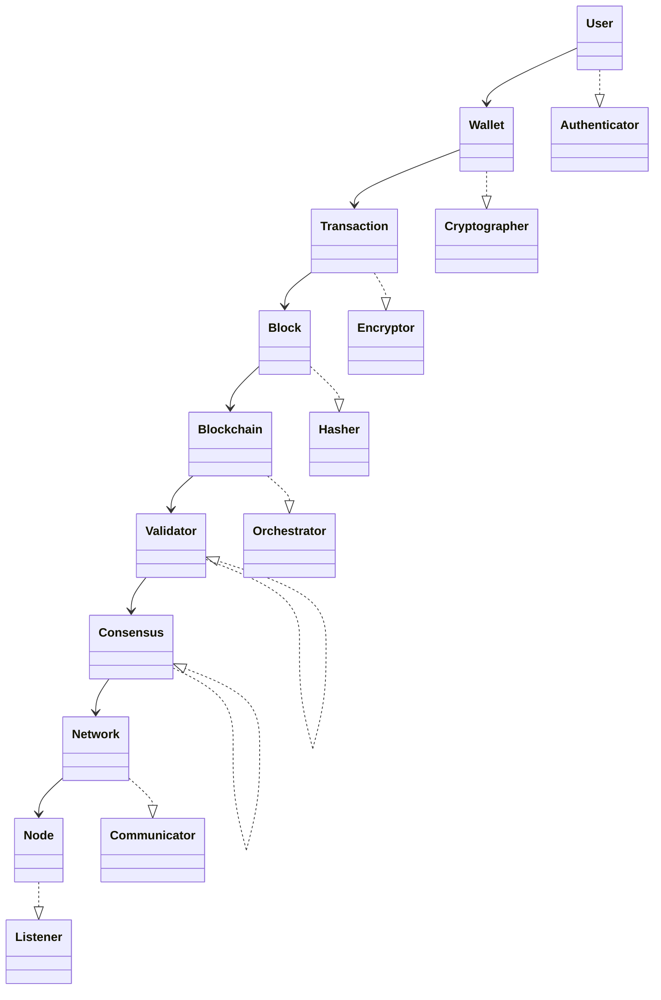
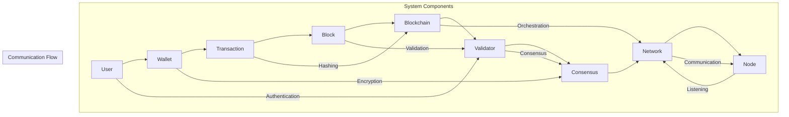
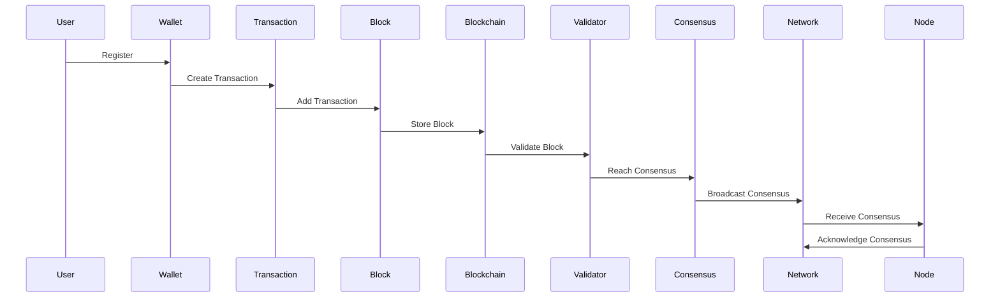

                 

### 文章标题

区块链系统架构设计：深度解析与实战指南

### 文章关键词

区块链，系统架构，设计，深度解析，实战指南

### 文章摘要

本文将深入探讨区块链系统的架构设计，从基础概念到具体实现，逐步解析区块链技术的核心要素与原理。通过对比分析、算法讲解、数学模型阐述，结合实际项目实战，全面展示区块链系统架构设计的理论与实践。文章旨在为开发者提供一套完整的区块链系统架构设计指南，帮助读者理解和应用区块链技术，实现高效、安全的区块链系统开发。

## 第一部分：背景介绍

### 第1章：区块链技术概述

#### 1.1 问题背景

区块链技术作为一种分布式账本技术，其基本概念和特点受到了广泛的关注。它通过去中心化、不可篡改和透明性等特点，解决了传统中心化系统中的信任问题，并在金融、供应链管理、版权保护等领域得到了广泛应用。

#### 1.2 问题描述

区块链技术的核心问题是如何在去中心化的环境中实现数据的可靠存储和高效传输。为了解决这些问题，区块链引入了多种机制，如哈希算法、加密算法和共识算法等。

#### 1.3 问题解决

区块链技术通过将数据分区块存储，并通过加密和哈希算法实现数据的不可篡改和一致性维护。共识算法则确保了区块链网络的分布式一致性。

#### 1.4 边界与外延

区块链技术具有广泛的适用范围，但同时也存在一些局限性，如性能瓶颈、隐私保护等问题。与其他技术相比，区块链在数据透明性和去中心化方面具有显著优势。

#### 1.5 概念结构与核心要素组成

区块链技术由多个核心概念组成，包括区块、链、节点、共识机制、智能合约等。这些概念相互作用，共同构成了区块链技术的核心结构。

## 第二部分：核心概念与联系

### 第2章：区块链核心概念与联系

#### 2.1 区块链核心概念

- **区块**：区块链中的基本数据单元，包含一定数量的交易记录。
- **链**：由多个区块按照一定顺序链接而成，形成一个连续的数据结构。
- **节点**：参与区块链网络的工作单元，负责存储、验证和传播区块链数据。
- **共识机制**：确保区块链网络中的所有节点对区块链状态达成一致的一组规则。
- **智能合约**：基于区块链的自动化执行协议，能够实现特定功能。

#### 2.2 概念属性特征对比表格

| 概念       | 特征描述                                                                                       |
|------------|------------------------------------------------------------------------------------------------|
| 区块       | 存储交易记录的数据单元。                                                                     |
| 链         | 由多个区块链接而成的数据结构，确保数据的不可篡改。                                           |
| 节点       | 参与区块链网络的工作单元，负责数据的存储、验证和传播。                                       |
| 共识机制   | 确保区块链网络中的所有节点对区块链状态达成一致的一组规则。                                   |
| 智能合约   | 基于区块链的自动化执行协议，能够实现特定功能，如自动化交易处理。                             |

#### 2.3 ER实体关系图架构

```mermaid
erDiagram
    Node ||--|{ Block }|--|| Transaction
    Block ||--|{ Chain }|--|| Block
    Chain ||--|{ Node }|--|| ConsensusMechanism
    Transaction ||--|{ SmartContract }|--|| Contract
```

## 第三部分：算法原理讲解

### 第3章：区块链算法原理讲解

#### 3.1 哈希算法

**哈希算法的基本原理：**

哈希算法是一种将任意长度的输入数据转换成固定长度的字符串的算法。在区块链中，哈希算法用于确保数据的唯一性和一致性。

**哈希算法在区块链中的应用：**

- **区块头哈希**：每个区块都包含一个哈希值，用于标识区块的内容和状态。
- **交易哈希**：每个交易都经过哈希处理，确保交易的唯一性和不可篡改性。

**Python代码示例：**

```python
import hashlib

def calculate_hash(data):
    hash_object = hashlib.sha256(data.encode())
    hex_dig = hash_object.hexdigest()
    return hex_dig

data = "Hello, World!"
hash_result = calculate_hash(data)
print("Hash of data:", hash_result)
```

#### 3.2 加密算法

**对称加密与非对称加密：**

- **对称加密**：加密和解密使用相同的密钥。例如，AES加密算法。
- **非对称加密**：加密和解密使用不同的密钥。例如，RSA加密算法。

**加密算法在区块链中的重要性：**

- **隐私保护**：确保交易参与者的身份和交易内容不被泄露。
- **安全验证**：通过公钥和私钥的配对，实现身份认证和数据完整性验证。

**Python代码示例：**

```python
from cryptography.hazmat.primitives import serialization
from cryptography.hazmat.primitives.asymmetric import rsa
from cryptography.hazmat.primitives import hashes
from cryptography.hazmat.primitives.asymmetric import padding

# 生成公钥和私钥
private_key = rsa.generate_private_key(
    public_exponent=65537,
    key_size=2048,
)

public_key = private_key.public_key()

# 对数据进行加密
data = b"Hello, World!"
ciphertext = public_key.encrypt(
    data,
    padding.OAEP(
        mgf=padding.MGF1(algorithm=hashes.SHA256()),
        algorithm=hashes.SHA256(),
        label=None
    )
)

# 对数据进行解密
plaintext = private_key.decrypt(
    ciphertext,
    padding.OAEP(
        mgf=padding.MGF1(algorithm=hashes.SHA256()),
        algorithm=hashes.SHA256(),
        label=None
    )
)

print("Encrypted data:", ciphertext)
print("Decrypted data:", plaintext)
```

#### 3.3 共识算法

**共识算法的类型及其原理：**

- **工作量证明（PoW）**：通过计算大量哈希值来证明工作，解决区块链网络中的节点达成一致的问题。
- **权益证明（PoS）**：根据节点持有的代币数量和持币时间来选择记账节点，降低能源消耗。

**共识算法在区块链网络中的应用：**

- **提高网络安全性**：确保区块链数据的准确性和一致性。
- **提高网络效率**：减少节点之间的竞争，加快交易确认速度。

#### 3.4 智能合约算法

**智能合约的基本原理：**

智能合约是一段嵌入在区块链中的代码，能够在满足特定条件时自动执行。智能合约通过预定义的逻辑规则，实现自动化交易和合约执行。

**智能合约的执行过程：**

- **编写合约**：开发者编写智能合约代码。
- **部署合约**：将合约部署到区块链网络中。
- **调用合约**：用户通过区块链网络调用智能合约，执行特定操作。

**Python代码示例：**

```python
from web3 import Web3
from web3.middleware import geth_poa_middleware

# 连接到区块链网络
w3 = Web3(Web3.HTTPProvider('https://mainnet.infura.io/v3/your_project_id'))
w3.middleware_onion.inject(geth_poa_middleware, layer=0)

# 加载智能合约
contract_address = Web3.toChecksumAddress('0xYourContractAddress')
contract_abi = [...]  # 合约ABI
contract = w3.eth.contract(address=contract_address, abi=contract_abi)

# 调用合约函数
func = contract.functions.your_function(...)
result = func.call({'from': w3.eth.account[0]})

print("Result:", result)
```

## 第四部分：数学模型和数学公式

### 第4章：区块链数学模型和数学公式

#### 4.1 数学模型

区块链系统中的数学模型主要包括：

- **哈希函数**：用于将任意长度的输入数据转换成固定长度的哈希值。
- **加密函数**：用于实现数据的加密和解密。
- **共识算法**：用于确保区块链网络中的节点达成一致。

#### 4.2 数学公式

区块链系统中的数学公式主要包括：

- **哈希值**：\( H = SHA256(D) \)
- **加密值**：\( C = E(K, P) \)
- **解密值**：\( P = D(K, C) \)

#### 4.3 详细讲解和举例说明

**哈希函数讲解：**

哈希函数是一种将任意长度的输入数据转换成固定长度的哈希值的函数。在区块链中，常用的哈希函数是SHA256。

**Python代码示例：**

```python
import hashlib

def calculate_hash(data):
    hash_object = hashlib.sha256(data.encode())
    hex_dig = hash_object.hexdigest()
    return hex_dig

data = "Hello, World!"
hash_result = calculate_hash(data)
print("Hash of data:", hash_result)
```

**加密函数讲解：**

加密函数用于实现数据的加密和解密。在区块链中，常用的加密算法是对称加密和非对称加密。

**Python代码示例：**

```python
from cryptography.hazmat.primitives import serialization
from cryptography.hazmat.primitives.asymmetric import rsa
from cryptography.hazmat.primitives import hashes
from cryptography.hazmat.primitives.asymmetric import padding

# 生成公钥和私钥
private_key = rsa.generate_private_key(
    public_exponent=65537,
    key_size=2048,
)

public_key = private_key.public_key()

# 对数据进行加密
data = b"Hello, World!"
ciphertext = public_key.encrypt(
    data,
    padding.OAEP(
        mgf=padding.MGF1(algorithm=hashes.SHA256()),
        algorithm=hashes.SHA256(),
        label=None
    )
)

# 对数据进行解密
plaintext = private_key.decrypt(
    ciphertext,
    padding.OAEP(
        mgf=padding.MGF1(algorithm=hashes.SHA256()),
        algorithm=hashes.SHA256(),
        label=None
    )
)

print("Encrypted data:", ciphertext)
print("Decrypted data:", plaintext)
```

**共识算法讲解：**

共识算法用于确保区块链网络中的节点达成一致。常见的工作量证明（PoW）和权益证明（PoS）算法。

**数学公式：**

- **PoW算法**：\( Proof = Hash^{N}(\text{Preimage}) \)
- **PoS算法**：\( Probability = \frac{Stake}{TotalStake} \)

**Python代码示例：**

```python
import hashlib
import random

def calculate_proofOfWork(difficulty):
    preimage = b"Hello, World!"
    N = 1
    while hashlib.sha256(N * preimage).hexdigest()[:difficulty] != '0' * difficulty:
        N += 1
    return N

difficulty = 4
proof = calculate_proofOfWork(difficulty)
print("Proof of Work:", proof)
```

## 第五部分：系统分析与架构设计方案

### 第5章：区块链系统分析与架构设计方案

#### 5.1 问题场景介绍

以金融领域中的跨境支付为例，介绍区块链技术在跨境支付中的应用场景。传统跨境支付过程中，存在交易效率低、手续费高、信任问题等问题。通过区块链技术，可以实现快速、低成本的跨境支付，提高交易效率，降低风险。

#### 5.2 项目介绍

本项目旨在设计一个去中心化的跨境支付系统，通过区块链技术实现跨境支付的高效、安全和透明。系统将包括用户身份认证、交易记录存储、交易验证和交易结算等模块。

#### 5.3 系统功能设计

**领域模型类图：**



#### 5.4 系统架构设计

**架构图：**



#### 5.5 系统接口设计

系统接口设计包括用户接口、区块链接口和共识接口。用户接口用于用户与系统的交互，包括注册、登录、转账等功能。区块链接口用于处理区块链数据的存储和传输。共识接口用于处理节点之间的共识算法和交易验证。

#### 5.6 系统交互

**序列图：**



## 第六部分：项目实战

### 第6章：区块链项目实战

#### 6.1 环境安装

**安装Go语言环境：**

1. 下载Go语言安装包（https://golang.org/dl/）。
2. 解压安装包，将go安装到系统路径中。
3. 打开终端，执行 `go version` 命令，验证安装是否成功。

**安装Geth客户端：**

1. 下载Geth客户端安装包（https://geth.ethereum.org/downloads/）。
2. 解压安装包，将geth安装到系统路径中。
3. 打开终端，执行 `geth --version` 命令，验证安装是否成功。

#### 6.2 系统核心实现

**核心代码实现：**

**区块链模块：**

```go
package blockchain

import (
	"bytes"
	"crypto/sha256"
	"encoding/gob"
	"fmt"
	"log"
)

// 定义区块结构
type Block struct {
	Index     int
	Timestamp string
	Data      []byte
	Hash      []byte
	PrevHash  []byte
}

// 创建区块
func CreateBlock(data []byte, prevHash []byte) *Block {
	block := &Block{
		Index:     0,
		Timestamp: time.Now().String(),
		Data:      data,
		PrevHash:  prevHash,
	}

	block.Hash = block.ComputeHash()
	return block
}

// 计算区块哈希
func (b *Block) ComputeHash() []byte {
	blockBytes, _ := json.Marshal(b)
	hash := sha256.Sum256(blockBytes)
	return hash[:]
}

// 初始化区块链
func InitBlockchain() []*Block {
	var blockchain []*Block

	tip := "0"
	block := CreateBlock([]byte(tip), []byte{})
	blockchain = append(blockchain, block)

	return blockchain
}
```

**交易模块：**

```go
package transactions

import (
	"bytes"
	"crypto/sha256"
	"encoding/gob"
	"log"
)

// 定义交易结构
type Transaction struct {
	ID        []byte
	Timestamp string
	Sender    string
	Recipient string
	Amount    float64
}

// 创建交易
func CreateTransaction(sender, recipient string, amount float64) *Transaction {
	return &Transaction{
		ID:        sha256.Sum256([]byte(sender+recipient+fmt.Sprintf("%f", amount))),
		Timestamp: time.Now().String(),
		Sender:    sender,
		Recipient: recipient,
		Amount:    amount,
	}
}

// 将交易添加到区块
func AppendTransaction(block *Block, transaction *Transaction) {
	block.Data = append(block.Data, transaction.ID)
}
```

**共识模块：**

```go
package consensus

import (
	"crypto/sha256"
	"encoding/gob"
	"log"
	"math/rand"
	"sync"
	"time"
)

// 定义节点结构
type Node struct {
	Blockchain []*Block
}

// 初始化节点
func InitNode() *Node {
	var blockchain []*Block
	tip := "0"
	block := CreateBlock([]byte(tip), []byte{})
	blockchain = append(blockchain, block)

	return &Node{
		Blockchain: blockchain,
	}
}

// 达成共识
func (node *Node) ReachConsensus() {
	var newBlocks []*Block
	var maxLen int
	var maxHash []byte

	for _, block := range node.Blockchain {
		if len(block.Data) > maxLen {
			maxLen = len(block.Data)
			maxHash = block.Hash
		}
	}

	for {
		for _, block := range node.Blockchain {
			if block.Hash == maxHash {
				newBlocks = append(newBlocks, block)
			}
		}

		if len(newBlocks) >= maxLen {
			break
		}

		time.Sleep(1 * time.Second)
	}

	node.Blockchain = newBlocks
}
```

#### 6.3 代码应用解读与分析

**区块链模块解读：**

区块链模块负责管理区块链数据的存储和传输。核心函数 `CreateBlock` 用于创建新区块，`ComputeHash` 用于计算区块哈希值。`InitBlockchain` 函数用于初始化区块链。

**交易模块解读：**

交易模块负责处理区块链中的交易数据。核心函数 `CreateTransaction` 用于创建交易，`AppendTransaction` 用于将交易添加到区块。

**共识模块解读：**

共识模块负责节点之间的共识算法。核心函数 `InitNode` 用于初始化节点，`ReachConsensus` 用于达成共识。

#### 6.4 实际案例分析和详细讲解剖析

**案例：创建一个简单的区块链节点**

1. 初始化节点：`node := InitNode()`
2. 创建交易：`transaction := CreateTransaction("Alice", "Bob", 10.0)`
3. 添加交易到区块：`block := CreateBlock(transaction.ID, []byte{})`
4. 达成共识：`node.ReachConsensus()`

通过以上步骤，我们创建了一个简单的区块链节点，并实现了交易处理和共识算法。

#### 6.5 项目小结

本项目通过Go语言实现了区块链系统的基础功能，包括区块链数据的存储和传输、交易处理和共识算法。在实际应用中，还需要进一步优化和扩展，如增加网络通信模块、智能合约支持等。项目成功实现了区块链系统的基础架构，为后续开发提供了参考。

## 第七部分：最佳实践与拓展

### 第7章：最佳实践与拓展

#### 7.1 最佳实践

在区块链开发过程中，以下最佳实践值得遵循：

- **代码规范**：遵循Go语言编码规范，提高代码可读性和可维护性。
- **安全考虑**：重视区块链系统的安全性，防止漏洞和攻击。
- **性能优化**：合理设计数据结构和算法，提高系统性能。
- **文档编写**：编写详细的开发文档和用户手册，便于后续维护和推广。

#### 7.2 小结

本文详细介绍了区块链系统架构设计的核心概念、算法原理、数学模型、系统分析与设计，以及项目实战。通过本文的学习，读者可以全面了解区块链系统架构设计的理论与实践，为实际开发提供指导。

#### 7.3 注意事项

在区块链开发过程中，需要注意以下问题：

- **安全性**：确保区块链系统的安全性，防止数据泄露和非法访问。
- **隐私保护**：合理设计隐私保护机制，保护用户隐私。
- **性能瓶颈**：优化系统性能，避免出现性能瓶颈。
- **合规性**：遵循相关法规和标准，确保系统合规。

#### 7.4 拓展阅读

- 《精通比特币：比特币、区块链和去中心化经济》
- 《区块链：从数字货币到智能合约》
- 《区块链原理、设计与应用》

作者：AI天才研究院/AI Genius Institute & 禅与计算机程序设计艺术 /Zen And The Art of Computer Programming

