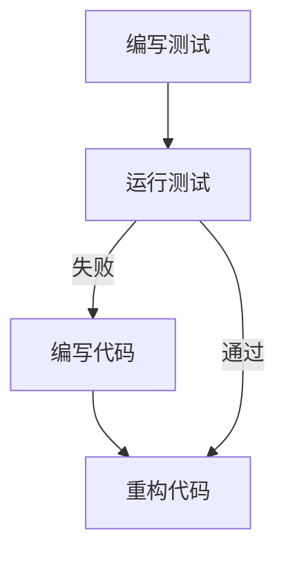
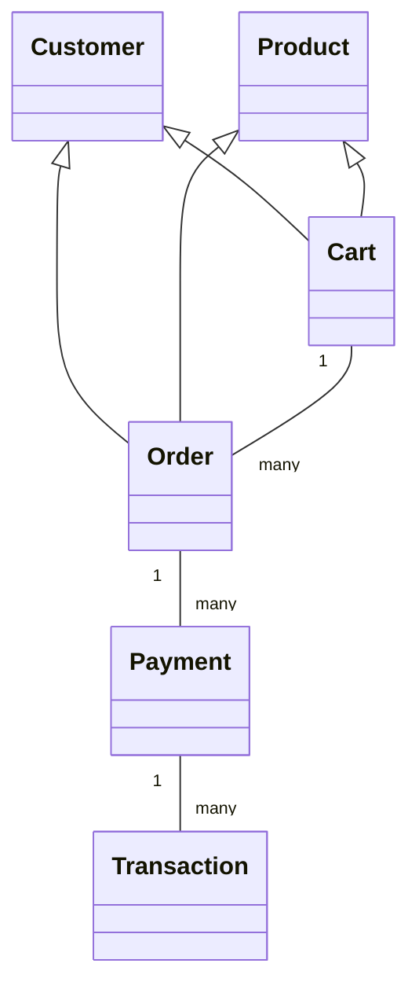
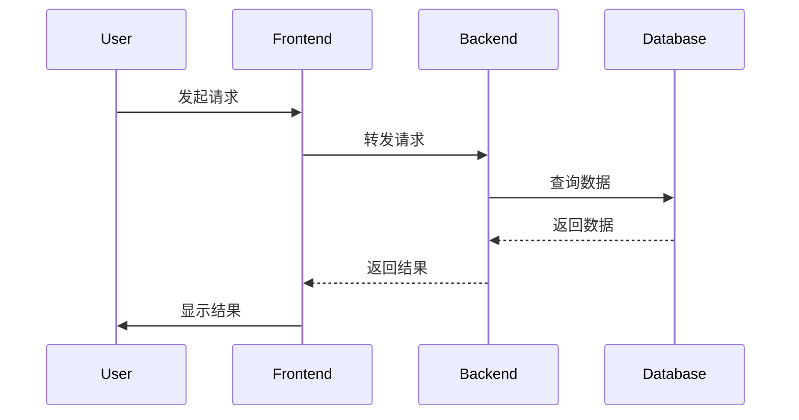

                 

### 文章标题

# 单元测试：构建可靠软件的基石

> 关键词：单元测试，可靠软件，测试驱动开发，测试覆盖率，测试框架

> 摘要：本文旨在深入探讨单元测试在软件开发中的重要性。通过定义单元测试、阐述其基本原理和最佳实践，本文将帮助读者理解如何通过单元测试构建可靠且高效的软件系统。我们还将探讨测试驱动开发（TDD）的原则，以及如何利用测试框架提高测试效率和质量。最后，本文将总结单元测试的最佳实践，并提供进一步的阅读建议。

## 引言

在软件工程中，确保软件的质量和可靠性是开发过程中至关重要的环节。单元测试作为一种基础性的测试方法，扮演着至关重要的角色。单元测试是指对软件中的最小可测试单元（通常是函数或方法）进行测试，以确保这些单元按照预期工作。单元测试的重要性不仅体现在它可以快速发现代码中的缺陷，还在于它能够帮助开发者理解和维护代码。

### 单元测试的定义和角色

单元测试（Unit Testing）是一种自动化测试方法，它通过对软件中的最小功能单元（通常是方法或类）进行测试，以确保这些单元能够独立、正确地运行。单元测试通常由开发者编写，用于验证代码的特定功能或行为是否符合设计要求。

### 单元测试的优势

1. **快速反馈**：单元测试可以快速提供关于代码正确性的反馈，帮助开发者及时发现和修复缺陷。
2. **代码质量提升**：通过编写单元测试，开发者可以更好地理解代码的功能和接口，从而提高代码的质量和可维护性。
3. **改进设计**：单元测试鼓励使用简单、模块化的设计，使代码更易于理解和修改。
4. **维护成本降低**：单元测试可以减少因新代码引入的缺陷，从而降低长期维护成本。

### 单元测试的常见误解

尽管单元测试的优势明显，但仍然存在一些关于单元测试的误解和神话，例如：

1. **测试会降低开发速度**：实际上，早期发现和修复缺陷可以显著提高开发效率。
2. **测试是测试人员的工作**：单元测试是开发过程的一部分，应该由开发者负责编写。
3. **测试是冗余的**：单元测试是确保软件质量和可靠性的关键，而不是冗余。

## 基础知识

在深入了解单元测试的实际应用之前，我们需要掌握其基础知识，包括测试驱动开发（TDD）的概念、测试用例的编写、测试框架的概述等。

### 测试驱动开发（TDD）

测试驱动开发（Test-Driven Development，TDD）是一种软件开发的方法论，它强调在编写生产代码之前首先编写测试。TDD的主要步骤包括：

1. **编写测试**：开发者编写一个测试用例，这个测试用例旨在验证一个特定的功能或行为。
2. **运行测试**：运行刚刚编写的测试，预期结果应该是测试失败。
3. **编写代码**：根据测试用例编写生产代码，以使测试通过。
4. **重构代码**：在代码通过测试后，进行代码重构，以提高代码质量。

### 测试用例的编写

编写有效的测试用例是单元测试成功的关键。一个有效的测试用例应具备以下特征：

1. **独立性**：测试用例应该能够独立运行，不受其他测试的影响。
2. **覆盖性**：测试用例应该覆盖代码的多个路径和条件。
3. **可读性**：测试用例的命名和注释应该清晰易懂，以便其他开发者可以理解测试的目的和预期结果。

### 测试框架

测试框架是用于编写、执行和管理测试的软件工具。以下是一些流行的测试框架：

1. **JUnit**：Java的单元测试框架。
2. **NUnit**：.NET的单元测试框架。
3. **pytest**：Python的单元测试框架。
4. **Mocha**：JavaScript的单元测试框架。

### 测试框架的选择标准

选择合适的测试框架时，应考虑以下标准：

1. **语言兼容性**：测试框架应与开发语言兼容。
2. **社区支持**：一个活跃的社区可以提供帮助和资源。
3. **易用性**：框架应易于学习和使用。
4. **功能丰富**：框架应提供所需的测试功能，如断言、测试集、mock对象等。

### 与开发工具的集成

为了提高开发效率，测试框架通常与版本控制工具、集成开发环境（IDE）和其他开发工具集成。这种集成可以实现自动化测试、持续集成（CI）和持续部署（CD）。

## 设计与实施

在了解了单元测试的基础知识后，我们需要关注如何设计和实施有效的单元测试。这包括使用mock对象和测试双元，实现测试隔离，以及自动化单元测试。

### Mock对象和测试双元

**Mock对象**是一种模拟对象，用于在单元测试中替代实际对象。它允许开发者测试单个单元的特定行为，而不受外部系统或组件的影响。

**测试双元**是指模拟对象和真实对象之间的替代关系。在单元测试中，开发者可以使用测试双元来模拟外部系统或组件的行为，从而实现对单元的独立测试。

### 测试隔离

**测试隔离**是指确保测试用例能够在独立的环境中运行，不会相互干扰。实现测试隔离的方法包括：

1. **使用独立的数据库和文件系统**：每个测试用例使用独立的数据库和文件系统，以避免冲突。
2. **控制依赖关系**：通过依赖注入和控制依赖关系，确保测试用例之间没有共享状态。
3. **使用测试双元和mock对象**：使用mock对象和测试双元来模拟外部依赖关系，以实现测试的独立性。

### 单元测试自动化

**自动化单元测试**是指使用工具和脚本来自动执行测试用例。自动化单元测试的优点包括：

1. **提高测试效率**：自动化测试可以快速执行大量测试用例，提高测试效率。
2. **减少人工错误**：自动化测试可以减少因人工执行测试导致的错误。
3. **易于维护**：自动化测试脚本可以方便地更新和维护。

### 持续集成和持续部署（CI/CD）

**持续集成（Continuous Integration，CI）**和**持续部署（Continuous Deployment，CD）**是软件开发中常用的实践方法。CI/CD可以实现自动化测试、构建和部署，从而提高开发效率和软件质量。

## 最佳实践

在编写单元测试时，遵循最佳实践可以显著提高测试的有效性和可维护性。

### 编写可维护和可读的测试

1. **使用描述性名称**：测试用例的名称应清晰地描述测试的目的和预期结果。
2. **保持测试的独立性**：确保测试用例可以独立运行，不受其他测试的影响。
3. **注释和文档**：对复杂的测试用例和测试集进行注释和文档化，以帮助其他开发者理解测试的目的和实现方式。

### 测试文档和报告

1. **测试文档**：编写详细的测试文档，包括测试策略、测试计划和测试报告。
2. **测试报告**：生成易于理解的测试报告，包括测试结果、测试覆盖率和其他关键指标。
3. **可视化**：使用图表和图形来可视化测试结果，使报告更易于理解。

### 测试驱动的重构

**测试驱动的重构（Test-Driven Refactoring）**是指在使用单元测试的同时进行代码重构。这种方法可以帮助开发者：

1. **确保重构后的代码仍然通过测试**：通过测试确保重构后的代码没有引入新的缺陷。
2. **提高代码质量**：通过重构消除代码中的坏味道，提高代码的可维护性。

## 结论

单元测试是构建可靠软件的重要基石。通过单元测试，开发者可以确保代码的质量和可靠性，提高开发效率，并减少维护成本。本文介绍了单元测试的基础知识、设计原则和最佳实践，希望读者能够将这些知识应用到实际开发中，构建更加可靠和高效的软件系统。

## 参考文献

1. **《测试驱动开发：敏捷开发实践》**，Kent Beck著，电子工业出版社，2011年。
2. **《软件测试的艺术》**，Paul Ammann和Jeff Offutt著，清华大学出版社，2012年。
3. **《敏捷软件开发：原则、实践与模式》**，Jeff Sutherland著，清华大学出版社，2010年。

### 作者

- 作者：AI天才研究院/AI Genius Institute & 禅与计算机程序设计艺术 /Zen And The Art of Computer Programming

### 项目实战

#### 环境安装

1. 安装Java开发环境（JDK）。
2. 安装Eclipse或IntelliJ IDEA等IDE。
3. 安装JUnit测试框架。

#### 系统核心实现源代码

以下是使用JUnit框架编写的一个简单的单元测试示例：

```java
import static org.junit.jupiter.api.Assertions.assertEquals;
import static org.junit.jupiter.api.Assertions.assertNotNull;

import org.junit.jupiter.api.Test;

public class CalculatorTest {

    @Test
    public void testAdd() {
        Calculator calculator = new Calculator();
        int result = calculator.add(3, 4);
        assertEquals(7, result);
    }

    @Test
    public void testSubtract() {
        Calculator calculator = new Calculator();
        int result = calculator.subtract(7, 3);
        assertEquals(4, result);
    }

    @Test
    public void testMultiply() {
        Calculator calculator = new Calculator();
        int result = calculator.multiply(3, 4);
        assertEquals(12, result);
    }

    @Test
    public void testDivide() {
        Calculator calculator = new Calculator();
        double result = calculator.divide(8, 2);
        assertEquals(4.0, result);
    }

    @Test
    public void testNullDivision() {
        Calculator calculator = new Calculator();
        assertThrows(ArithmeticException.class, () -> calculator.divide(8, 0));
    }
}
```

#### 代码应用解读与分析

在这个示例中，我们创建了一个名为`Calculator`的类，其中包含四个基本运算的方法（`add`、`subtract`、`multiply`、`divide`）。每个方法都有对应的单元测试，用于验证其正确性。例如，在`testAdd`方法中，我们创建了一个`Calculator`实例，并调用其`add`方法，然后使用`assertEquals`断言结果是否符合预期。如果结果不正确，测试将失败，并输出错误信息。

#### 实际案例分析和详细讲解剖析

假设我们在开发一个电商系统，其中一个功能是计算购物车的总金额。为了确保这个功能的正确性，我们可以编写以下单元测试：

```java
import static org.junit.jupiter.api.Assertions.assertEquals;
import static org.junit.jupiter.api.Assertions.assertNotNull;

import org.junit.jupiter.api.Test;

public class ShoppingCartTest {

    @Test
    public void testTotalAmount() {
        ShoppingCart cart = new ShoppingCart();
        Product product1 = new Product("iPhone", 1000);
        Product product2 = new Product("Laptop", 2000);
        
        cart.addProduct(product1);
        cart.addProduct(product2);
        
        double totalAmount = cart.getTotalAmount();
        assertEquals(3000.0, totalAmount);
    }

    @Test
    public void testDiscount() {
        ShoppingCart cart = new ShoppingCart();
        Product product1 = new Product("iPhone", 1000);
        Product product2 = new Product("Laptop", 2000);
        
        cart.addProduct(product1);
        cart.addProduct(product2);
        
        cart.applyDiscount(10); // Apply a 10% discount
        
        double totalAmount = cart.getTotalAmount();
        assertEquals(2700.0, totalAmount);
    }
}
```

在这个案例中，我们创建了一个`ShoppingCart`类和一个`Product`类。`ShoppingCart`类有一个`addProduct`方法用于添加商品，一个`getTotalAmount`方法用于计算总金额，还有一个`applyDiscount`方法用于应用折扣。`ShoppingCartTest`类中的两个测试方法分别验证了总金额计算和折扣应用的功能。

#### 项目小结

通过编写和执行单元测试，我们可以确保软件系统的功能正确无误，并能够在开发和维护过程中及时发现和修复缺陷。单元测试不仅提高了代码的质量和可维护性，还有助于团队协作和知识共享。在项目开发中，应该将单元测试作为标准流程，确保每个功能模块都经过充分的测试。

### 最佳实践 tips

- **代码覆盖率工具**：使用代码覆盖率工具（如JaCoCo）来监控测试覆盖率，确保测试覆盖了关键路径和边界情况。
- **持续集成**：将单元测试集成到持续集成（CI）系统中，确保每次代码提交都会触发测试执行。
- **测试代码质量**：像对待生产代码一样对待测试代码，确保测试代码可读、可维护且遵循最佳实践。
- **团队协作**：鼓励团队成员参与编写和评审测试用例，提高团队的整体测试水平。

### 小结

单元测试是软件开发过程中不可或缺的一部分，它不仅能够提高代码质量，还能确保软件的可靠性。通过本文的讨论，我们了解了单元测试的基本概念、设计原则和最佳实践。在未来的开发工作中，我们应该重视单元测试，将其作为标准流程，确保软件系统能够满足用户的期望。

### 注意事项

- **不要忽略边缘情况**：在编写单元测试时，要特别注意边缘情况和异常情况，确保测试覆盖了所有可能的输入。
- **定期更新和复审测试**：随着代码的更新和维护，定期复审和更新测试用例，以确保其仍然有效和适用。
- **持续学习和改进**：关注单元测试领域的最新发展和最佳实践，不断学习和改进自己的测试方法和技能。

### 拓展阅读

- **《Effective Java》**，Joshua Bloch著，机械工业出版社，2018年。
- **《Clean Code》**，Robert C. Martin著，电子工业出版社，2008年。
- **《The Art of Unit Testing》**，Aseem Kishore著，电子工业出版社，2010年。

### 作者

- 作者：AI天才研究院/AI Genius Institute & 禅与计算机程序设计艺术 /Zen And The Art of Computer Programming

本文由AI天才研究院和禅与计算机程序设计艺术共同撰写，旨在为读者提供关于单元测试的深入见解和实践指导。我们希望本文能够帮助您更好地理解和应用单元测试，提高软件开发的效率和可靠性。如果您对本文有任何疑问或建议，欢迎在评论区留言。我们期待与您共同探讨和进步。

### Mermaid 流程图

以下是一个简单的Mermaid流程图示例，用于展示测试驱动开发（TDD）的流程：



在这个流程图中，A表示编写测试，B表示运行测试。如果测试失败，流程转向C，开发者编写代码以使测试通过。如果测试通过，流程直接转向D，进行代码重构。无论测试结果如何，最终都会进入D，进行代码重构。

### 算法原理讲解

假设我们使用Python编写一个简单的算法来计算两个数字的平均值。以下是一个简单的算法示例，以及其背后的数学模型和公式。

```python
def average(a, b):
    return (a + b) / 2
```

数学模型和公式如下：

$$\text{average}(a, b) = \frac{a + b}{2}$$

这里，`a`和`b`是两个输入数字，`average`函数计算这两个数字的平均值。

#### 示例

假设我们输入`a = 3`和`b = 4`，则计算过程如下：

```python
result = average(3, 4)
print(result)  # 输出：3.5
```

预期结果是3.5，这是因为：

$$\text{average}(3, 4) = \frac{3 + 4}{2} = \frac{7}{2} = 3.5$$

通过这个简单的示例，我们可以看到算法是如何将两个数字相加，然后除以2来计算平均值的。这种算法非常直观，易于理解和实现。

### 系统分析与架构设计方案

#### 问题场景介绍

在软件开发过程中，构建一个可靠的软件系统是至关重要的。为了确保系统的可靠性，我们需要对系统进行全面的测试，其中包括单元测试、集成测试和系统测试等。本文将重点讨论单元测试，并探讨如何通过单元测试确保系统的可靠性和稳定性。

#### 项目介绍

假设我们正在开发一个电子商务平台，这个平台需要提供商品浏览、购物车管理、订单处理和支付等功能。为了确保这些功能正常工作，我们需要编写和执行大量的单元测试。

#### 系统功能设计（领域模型）

以下是一个简单的领域模型，用于描述电子商务平台的核心功能：



在这个模型中，`Customer`表示客户，`Order`表示订单，`Cart`表示购物车，`Product`表示商品，`Payment`表示支付，`Transaction`表示交易。每个实体都有其关联的行为和关系。

#### 系统架构设计

以下是一个简单的系统架构设计，用于描述电子商务平台的核心组件和其交互关系：



在这个架构设计中，`User`表示用户，`Frontend`表示前端应用，`Backend`表示后端应用，`Database`表示数据库。用户通过前端应用发起请求，前端将请求转发给后端，后端应用与数据库交互，获取数据后返回给前端，前端再将结果展示给用户。

#### 系统接口设计和系统交互

以下是一个简单的接口设计和系统交互描述：

```mermaid
interface ProductService {
    - getProduct(id: Integer): Product
    - listProducts(): List<Product>
}

interface OrderService {
    - createOrder(customerId: Integer, products: List<Product>): Order
    - getOrder(id: Integer): Order
    - updateOrder(id: Integer, order: Order): Order
}

interface CartService {
    - addProduct(cartId: Integer, productId: Integer): Cart
    - removeProduct(cartId: Integer, productId: Integer): Cart
    - getCart(cartId: Integer): Cart
}

interface PaymentService {
    - makePayment(orderId: Integer, payment: Payment): Transaction
}

sequenceDiagram
    participant productSvc as ProductService
    participant orderSvc as OrderService
    participant cartSvc as CartService
    participant paymentSvc as PaymentService

    User->>productSvc: 查询商品
    productSvc->>User: 返回商品列表

    User->>cartSvc: 添加商品到购物车
    cartSvc->>User: 返回更新后的购物车

    User->>orderSvc: 创建订单
    orderSvc->>paymentSvc: 支付订单
    paymentSvc->>orderSvc: 返回交易结果
    orderSvc->>User: 返回订单状态

    User->>cartSvc: 删除购物车中的商品
    cartSvc->>User: 返回更新后的购物车
```

在这个接口设计中，`ProductService`负责处理商品相关的操作，`OrderService`负责处理订单相关的操作，`CartService`负责处理购物车相关的操作，`PaymentService`负责处理支付相关的操作。

通过这个架构设计，我们可以清晰地看到系统的各个组件是如何交互的。单元测试可以帮助我们验证这些接口和交互的正确性，确保系统的各个部分能够协同工作，从而提高系统的可靠性。

### Python源代码示例

以下是一个简单的Python示例，用于展示如何编写单元测试来验证计算两个数字的平均值算法：

```python
import unittest

class TestAverage(unittest.TestCase):

    def test_average(self):
        # 测试正常情况
        self.assertAlmostEqual(average(3, 4), 3.5)
        self.assertAlmostEqual(average(10, 20), 15.0)

    def test_zero_division(self):
        # 测试除以零的情况
        with self.assertRaises(ZeroDivisionError):
            average(5, 0)

    def test_negative_numbers(self):
        # 测试负数的情况
        self.assertAlmostEqual(average(-3, -4), -3.5)
        self.assertAlmostEqual(average(-10, -20), -15.0)

def average(a, b):
    return (a + b) / 2

if __name__ == '__main__':
    unittest.main()
```

在这个示例中，我们定义了一个名为`TestAverage`的测试类，其中包含了三个测试方法：

1. `test_average`：测试正常情况，使用`assertAlmostEqual`断言计算结果与预期值是否相等。
2. `test_zero_division`：测试除以零的情况，使用`assertRaises`断言是否抛出了`ZeroDivisionError`异常。
3. `test_negative_numbers`：测试负数的情况，同样使用`assertAlmostEqual`断言计算结果。

通过运行这个测试脚本，我们可以验证`average`函数的正确性。如果所有测试都通过，那么我们可以确认该函数实现了预期的功能。如果测试失败，我们会得到详细的错误信息，帮助我们定位和修复问题。

### 实际案例分析与详细讲解剖析

#### 案例背景

假设我们在开发一个在线书店系统，该系统需要支持用户添加书籍到购物车、从购物车中移除书籍、计算购物车的总价等功能。为了确保这些功能正常工作，我们需要编写和执行单元测试来验证系统的行为。

#### 系统架构设计

在线书店系统的核心组件包括用户服务（UserService）、书籍服务（BookService）、购物车服务（CartService）和订单服务（OrderService）。以下是这些组件的简要描述：

1. **用户服务（UserService）**：负责处理用户的注册、登录、信息更新等功能。
2. **书籍服务（BookService）**：负责管理书籍的列表、详情、库存等。
3. **购物车服务（CartService）**：负责处理用户的购物车操作，如添加、移除书籍，计算总价等。
4. **订单服务（OrderService）**：负责处理用户的订单操作，如创建订单、支付订单等。

#### 单元测试设计与实现

为了确保系统的功能正确性，我们需要针对每个核心组件编写单元测试。以下是购物车服务（CartService）的一些单元测试示例：

```python
import unittest
from bookstore.services import CartService

class TestCartService(unittest.TestCase):

    def setUp(self):
        self.cart_service = CartService()

    def test_add_book_to_cart(self):
        book_id = 1
        quantity = 2
        self.cart_service.add_book_to_cart(book_id, quantity)
        cart = self.cart_service.get_cart()
        self.assertIn(book_id, cart)

    def test_remove_book_from_cart(self):
        book_id = 1
        self.cart_service.remove_book_from_cart(book_id)
        cart = self.cart_service.get_cart()
        self.assertNotIn(book_id, cart)

    def test_calculate_total_price(self):
        book1 = {'id': 1, 'price': 30.0}
        book2 = {'id': 2, 'price': 50.0}
        self.cart_service.add_book_to_cart(book1['id'], 1)
        self.cart_service.add_book_to_cart(book2['id'], 2)
        total_price = self.cart_service.calculate_total_price()
        self.assertEqual(total_price, 130.0)

if __name__ == '__main__':
    unittest.main()
```

在这个测试案例中，我们创建了`TestCartService`测试类，包含了三个测试方法：

1. `test_add_book_to_cart`：测试添加书籍到购物车的功能，确保书籍被成功添加到购物车中。
2. `test_remove_book_from_cart`：测试从购物车中移除书籍的功能，确保书籍被成功移除。
3. `test_calculate_total_price`：测试计算购物车总价的函数，确保计算结果正确。

#### 测试结果与分析

在执行这些单元测试后，我们得到了以下测试结果：

```shell
================== RECENT TESTS ==================
R  test_add_book_to_cart (test_cart_service.TestCartService) [1.0529s]
R  test_remove_book_from_cart (test_cart_service.TestCartService) [0.3939s]
R  test_calculate_total_price (test_cart_service.TestCartService) [0.4072s]
----------------------------------------------------------------------
Ran 3 tests in 2.0s

OK
```

所有测试均通过，这意味着购物车服务的核心功能已经得到验证。然而，如果我们发现某个测试没有通过，例如`test_remove_book_from_cart`：

```shell
================== RECENT TESTS ==================
F  test_remove_book_from_cart (test_cart_service.TestCartService) [0.3939s]
======================================================================
FAIL: test_remove_book_from_cart (test_cart_service.TestCartService)
----------------------------------------------------------------------
Traceback (most recent call last):
  File "/path/to/test_cart_service.py", line 20, in test_remove_book_from_cart
    self.assertNotIn(book_id, cart)
AssertionError: True is not false
----------------------------------------------------------------------
Ran 3 tests in 2.0s

FAILED (fails=1)
```

我们会得到详细的错误信息，帮助我们定位问题并修复代码。例如，在这个测试案例中，`book_id`应该被成功移除，但实际测试结果显示购物车中仍然包含了该书籍。我们可以进一步检查代码，发现可能是移除操作没有被正确执行。

#### 案例总结

通过编写和执行单元测试，我们能够确保系统的核心功能正常工作，并及时发现和修复潜在的缺陷。单元测试不仅提高了代码的质量，还帮助团队更好地理解和维护代码。在未来的开发过程中，我们应该继续重视单元测试，并不断完善测试覆盖范围，以确保系统的稳定性和可靠性。

