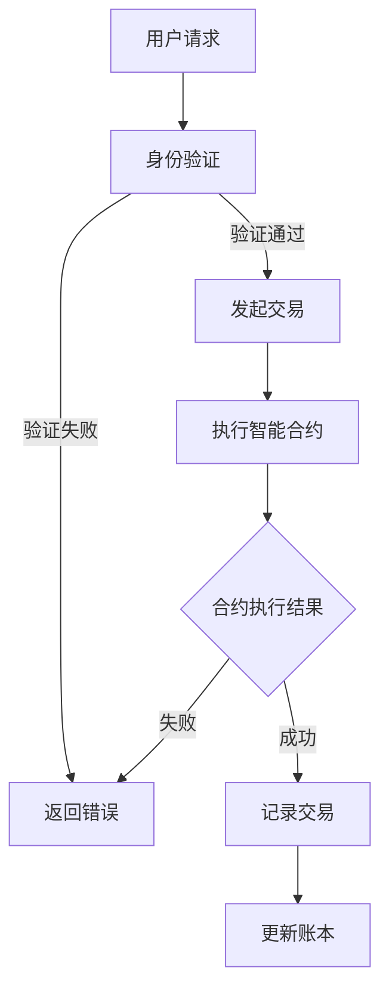
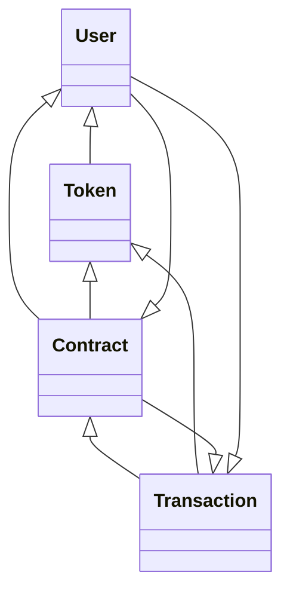
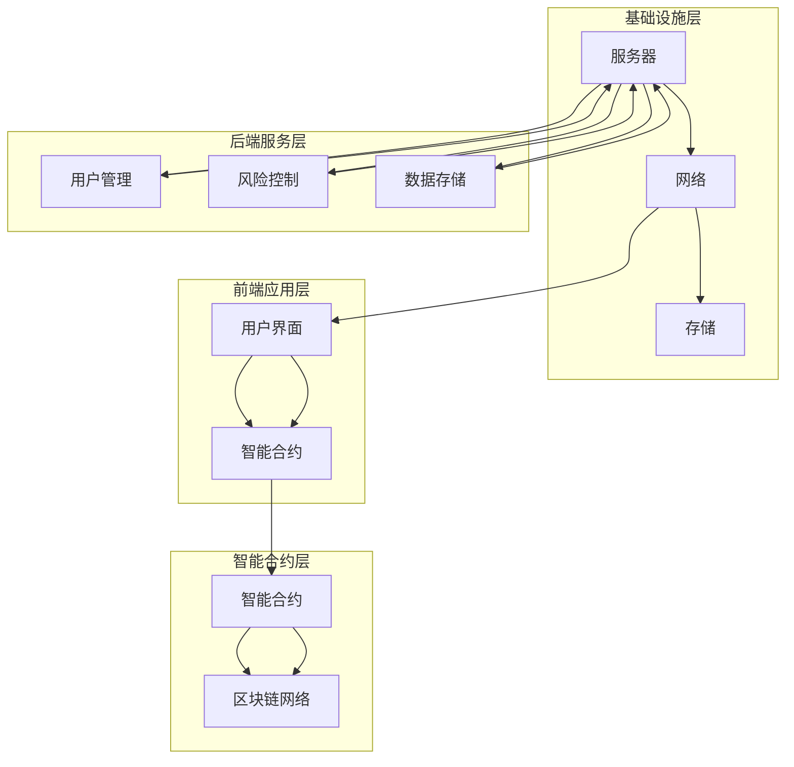

                 

# 去中心化金融(DeFi)系统设计

> 关键词：去中心化金融、DeFi、系统设计、区块链、智能合约、代币经济学

> 摘要：本文深入探讨了去中心化金融（DeFi）系统的设计，从核心概念、算法原理到系统架构，再到实际应用，全面剖析了DeFi系统的构建过程和关键技术。通过逐步分析和讲解，帮助读者理解DeFi的工作原理及其面临的挑战，为未来DeFi系统的研发和应用提供有力指导。

## 1. 背景介绍

### 引言

去中心化金融（DeFi，Decentralized Finance）是基于区块链技术构建的金融系统，旨在通过去中心化的方式实现金融服务的创新和优化。DeFi的核心思想是利用区块链的分布式账本和智能合约技术，消除传统金融中介，提高金融系统的透明度、安全性和效率。

自2017年以来，DeFi迅速发展，成为区块链领域的重要分支。它不仅为投资者提供了全新的资产配置和收益优化方式，还引发了金融行业的深刻变革。然而，随着DeFi的应用日益广泛，其面临的挑战和问题也逐渐显现。

### 问题背景

DeFi面临的主要问题包括以下几个方面：

1. **信任问题**：去中心化金融系统的可信度依赖于区块链的共识机制和智能合约的安全性。如果共识机制存在漏洞或智能合约代码存在缺陷，可能会导致整个系统的崩溃。

2. **透明度问题**：尽管区块链技术具有较高的透明度，但DeFi系统的复杂性和信息的不对称性使得普通用户难以理解其运作机制，从而影响了系统的公信力。

3. **安全性问题**：DeFi系统中的智能合约和区块链网络可能会受到恶意攻击，如51%攻击、智能合约漏洞攻击等，导致系统资产被盗或系统崩溃。

4. **用户体验问题**：与中心化金融系统相比，DeFi的用户体验仍有待提升，如操作复杂、响应速度慢、兼容性差等。

### 问题描述

DeFi的目标是构建一个去中心化、透明、安全、高效的金融系统，实现以下功能：

1. **去中心化**：通过区块链技术和智能合约，消除传统金融中介，实现金融服务的去中心化。

2. **透明性**：利用区块链的分布式账本技术，提高金融系统的透明度，使所有参与者都能看到交易记录和合约执行情况。

3. **安全性**：通过共识机制和智能合约的安全设计，确保DeFi系统的安全性。

4. **用户体验**：优化用户界面和交互体验，提高用户的使用便捷性。

为实现这些目标，DeFi系统设计需要遵循以下关键技术和设计原则：

1. **区块链技术**：作为去中心化数据存储和分布式共识的基础。

2. **智能合约**：作为执行金融逻辑的关键组件。

3. **去中心化身份验证**：确保用户身份的安全和隐私。

4. **安全性保障机制**：包括共识机制、智能合约审计和网络安全防护等。

5. **用户体验优化**：包括简洁友好的用户界面、快速响应和良好的兼容性。

### 问题解决

DeFi系统设计的方法论和最佳实践如下：

1. **需求分析**：明确DeFi系统的目标和应用场景，分析用户需求和市场趋势。

2. **架构设计**：基于需求分析，设计DeFi系统的整体架构，包括区块链网络、智能合约、去中心化身份验证等模块。

3. **安全性评估**：对智能合约和区块链网络进行安全性评估，识别潜在风险并采取相应措施。

4. **用户体验优化**：设计简洁易用的用户界面，优化交互流程，提高用户满意度。

5. **持续迭代与优化**：根据用户反馈和实际应用情况，持续优化系统功能和性能。

通过以上方法，可以构建一个高效、安全、透明的DeFi系统，为金融行业的创新和变革提供有力支持。

## 2. 核心概念与联系

### 核心概念

DeFi系统设计涉及多个核心概念，包括区块链、智能合约、代币经济学和分布式存储等。以下是对这些核心概念的详细阐述：

1. **区块链**：区块链是一种分布式账本技术，通过去中心化的方式记录和验证交易信息。每个区块包含一定数量的交易记录，并通过密码学算法连接成链。区块链具有不可篡改、透明和去中心化等特点。

2. **智能合约**：智能合约是运行在区块链上的程序，用于自动执行、控制或文档化任何具有合同性质的交易或互动。智能合约通过预先设定的逻辑和条件，自动执行合同条款，确保交易的执行符合预期。

3. **代币经济学**：代币经济学是研究代币发行、流通、分配和激励机制的一门学科。通过代币经济学，可以设计出具有自我激励和可持续发展的代币体系，促进DeFi系统的健康发展。

4. **分布式存储**：分布式存储是将数据分散存储在多个节点上的技术。通过分布式存储，可以提高数据的可靠性和可用性，同时降低存储成本和风险。

### 概念属性特征对比表格

以下是对上述核心概念的主要属性和特征进行对比的表格：

| 概念 | 属性 | 特征 |
| :--: | :--: | :--: |
| 区块链 | 分布式账本 | 不可篡改、透明、去中心化 |
| 智能合约 | 自动执行合同条款 | 可编程、安全性高、自动执行 |
| 代币经济学 | 代币发行与流通 | 激励机制、可持续发展、价值传递 |
| 分布式存储 | 数据分散存储 | 高可靠性、高可用性、低风险 |

### ER实体关系图架构

以下是一个简化的DeFi系统的ER图，展示了各个实体及其关系：

```mermaid
erDiagram
  User ||--o|<<many-to-one>> Contract : 用户与智能合约
  Contract ||--o|<<many-to-many>> Token : 智能合约与代币
  Token ||--o|<<many-to-many>> Transaction : 代币与交易
  User ||--o|<<many-to-many>> Transaction : 用户与交易
```

在这个ER图中，用户（User）与智能合约（Contract）之间存在多对一的关系，用户可以通过智能合约发起交易。智能合约与代币（Token）之间存在多对多的关系，智能合约可以发行和管理多个代币。代币与交易（Transaction）之间也存在多对多的关系，每个交易可以涉及多个代币。用户与交易之间同样存在多对多的关系，用户可以参与多个交易。

通过以上核心概念的阐述、属性特征对比和ER图展示，我们为后续的算法原理讲解和系统架构设计奠定了基础。

## 3. 算法原理讲解

### 使用Mermaid画出DeFi系统的关键算法流程图

以下是一个简化的DeFi系统算法流程图，用于展示主要步骤和逻辑关系：



在这个流程图中，用户请求发起交易，首先进行身份验证。如果验证通过，则执行智能合约；否则返回错误。智能合约执行后，根据执行结果记录交易并更新账本。

### 使用Python源代码详细阐述算法原理

以下是一个简化的Python代码示例，用于解释DeFi系统中的关键算法原理：

```python
import json
from web3 import Web3

# 连接到区块链网络
w3 = Web3(Web3.HTTPProvider('https://mainnet.infura.io/v3/your_project_id'))

# 载入智能合约ABI和地址
with open('contract_abi.json', 'r') as abi_file:
    abi = json.load(abi_file)

with open('contract_address.json', 'r') as address_file:
    contract_address = json.load(address_file)

contract = w3.eth.contract(address=contract_address, abi=abi)

# 用户发起交易请求
def initiate_transaction(user_address, token_address, amount):
    # 构建交易数据
    transaction_data = contract.functions.transfer(token_address, amount).buildTransaction({
        'chainId': 1,
        'from': user_address,
        'gas': 2000000,
        'gasPrice': w3.toWei('50', 'gwei'),
    })

    # 发送交易
    signed_txn = w3.eth.account.sign_transaction(transaction_data, private_key='your_private_key')
    tx_hash = w3.eth.sendRawTransaction(signed_txn.rawTransaction)

    # 等待交易确认
    tx_receipt = w3.eth.waitForTransactionReceipt(tx_hash)

    return tx_receipt

# 用户发起交易
tx_receipt = initiate_transaction('user_address', 'token_address', 'amount')
if tx_receipt:
    print('Transaction successful:', tx_receipt)
else:
    print('Transaction failed')
```

在这个示例中，我们首先连接到以太坊主网，然后加载智能合约的ABI和地址。接下来，用户通过发起交易请求，构建交易数据并签名。最后，我们发送交易并等待确认，以获取交易结果。

### 详细讲解和举例说明

让我们通过一个具体的例子来说明这个算法的工作原理：

**案例：用户Alice想通过DeFi系统向用户Bob转账1个代币TokenA。**

1. **身份验证**：首先，系统会验证Alice的身份，以确保她有权发起交易。假设Alice的身份验证通过。

2. **构建交易数据**：Alice发起交易请求，系统将构建包含以下信息的交易数据：
   - 目标地址：Bob的地址
   - 代币地址：TokenA的地址
   - 转账金额：1个TokenA

3. **签名交易**：Alice使用她的私钥对交易数据进行签名，生成一个有效的交易哈希。

4. **发送交易**：Alice将签名后的交易发送到区块链网络。

5. **等待交易确认**：系统将等待区块链网络确认交易，并在交易被确认后返回结果。

6. **记录交易**：一旦交易被确认，系统将在区块链账本中记录这笔交易。

7. **通知用户**：系统将通知Alice交易成功，并更新她的代币余额。

通过这个例子，我们可以看到DeFi系统中的算法原理是如何实际运作的。它通过区块链网络和智能合约实现了去中心化的交易和账本记录，确保了交易的透明性和安全性。

### 算法原理总结

DeFi系统的核心算法原理包括以下关键步骤：

1. **身份验证**：确保发起交易的用户有权进行操作。
2. **构建交易数据**：根据用户请求，构建包含交易信息的交易数据。
3. **签名交易**：用户对交易数据进行签名，生成有效的交易哈希。
4. **发送交易**：将签名后的交易发送到区块链网络。
5. **等待交易确认**：在区块链网络中等待交易被确认。
6. **记录交易**：将确认后的交易记录在区块链账本中。
7. **通知用户**：向用户反馈交易结果。

通过这些步骤，DeFi系统实现了去中心化的交易和账本记录，为用户提供了安全、透明和高效的金融服务。

## 4. 数学模型和数学公式 & 详细讲解 & 举例说明

在DeFi系统中，数学模型和数学公式扮演着至关重要的角色，它们不仅用于描述智能合约的逻辑，还用于确保交易的安全性和有效性。以下我们将详细讲解一些关键的数学模型和公式，并通过实际例子来说明其应用场景。

### 数学模型和公式

首先，我们来定义一些基本概念和相关的数学模型：

1. **哈希函数**：哈希函数是用于生成交易哈希的关键工具，常见的哈希函数包括SHA-256、SHA-3等。其数学模型可以表示为：
   $$ H(x) = \text{SHA-256}(x) $$
   其中，$H(x)$ 是输入$x$的哈希值。

2. **椭圆曲线加密算法**：椭圆曲线加密算法（ECC）是智能合约签名和验证的基础。其数学模型涉及椭圆曲线和点的乘法运算。一个典型的椭圆曲线方程可以表示为：
   $$ y^2 = x^3 + ax + b $$
   其中，$a$ 和 $b$ 是椭圆曲线的系数，$P$ 是一个基点，$kP$ 是对基点的$k$倍。

3. **智能合约费用模型**：智能合约执行过程中需要支付网络费用，常用的费用模型包括基于计算复杂度和数据传输量的费用计算。一个简单的费用模型可以表示为：
   $$ F(c, d) = c \times \log(d) $$
   其中，$c$ 是基础费用系数，$d$ 是数据传输量。

4. **代币流通模型**：代币的发行、流通和分配通常遵循一定的数学模型，如线性递减发行、固定发行量等。一个简单的线性递减发行模型可以表示为：
   $$ T(t) = T_{max} - \frac{T_{max}}{N} \times t $$
   其中，$T(t)$ 是在时间$t$时刻的代币总量，$T_{max}$ 是最大代币量，$N$ 是线性递减的周期。

### 详细讲解和举例说明

为了更好地理解这些数学模型和公式，我们将通过具体的例子进行讲解。

**例1：哈希函数**

假设我们有一个交易输入$x = "Alice \rightarrow Bob: 1 TokenA"$，使用SHA-256算法计算其哈希值：

$$ H(x) = \text{SHA-256}("Alice \rightarrow Bob: 1 TokenA") = "a1b2c3d4..." $$

通过哈希函数，我们可以将交易内容映射为一个唯一的哈希值，确保交易内容的唯一性和不可篡改性。

**例2：椭圆曲线加密算法**

假设我们有一个椭圆曲线方程：
$$ y^2 = x^3 + 2x + 1 $$
基点$P(2, 3)$，用户Alice的私钥$k = 5$。我们可以计算公钥$K$：

$$ K = kP = 5 \times P = (10, 15) $$

现在，假设Bob想要验证Alice的签名，他可以使用椭圆曲线加密算法进行验证：

$$ S = k^{-1} \mod n = 13^{-1} \mod 23 = 15 $$
$$ R = (x_S, y_S) = (10, 15) $$

Bob计算签名验证值：
$$ v = (\frac{x_S^3 + 2x_S + 1}{y_S}) \mod n = (\frac{10^3 + 2 \times 10 + 1}{15}) \mod 23 = 1 $$

因为$v = 1$，所以签名验证通过。

**例3：智能合约费用模型**

假设智能合约执行过程中，基础费用系数$c = 0.1$，数据传输量$d = 1000$，我们可以计算费用$F$：

$$ F(c, d) = c \times \log(d) = 0.1 \times \log(1000) = 3.32 \text{ETH} $$

因此，执行这个智能合约需要支付约3.32以太币的网络费用。

**例4：代币流通模型**

假设一个代币的线性递减发行模型，最大代币量$T_{max} = 1,000,000$，线性递减周期$N = 1,000,000$，当前时间$t = 500,000$：

$$ T(t) = T_{max} - \frac{T_{max}}{N} \times t = 1,000,000 - \frac{1,000,000}{1,000,000} \times 500,000 = 500,000 $$

因此，当前时间$t$的代币总量为500,000个。

通过这些具体的例子，我们可以更好地理解DeFi系统中数学模型和公式的应用，确保交易的安全、有效和透明。

## 5. 系统分析与架构设计方案

### 介绍问题场景和项目背景

去中心化金融（DeFi）系统旨在通过区块链技术和智能合约，实现金融服务的去中心化、透明、安全和高效。本文将针对一个典型的DeFi项目——去中心化借贷平台，进行系统分析与架构设计方案。

该项目的目标是为用户提供一个安全、透明、便捷的借贷服务，用户可以在平台上进行存款、借款和还款操作。为了实现这一目标，我们需要设计一个高效的系统架构，确保系统的高可用性、安全性和可扩展性。

### 描述系统功能设计

DeFi借贷平台的核心功能包括：

1. **用户注册与身份验证**：用户需要在平台上注册并完成身份验证，确保用户身份的真实性和合法性。
2. **存款与提现**：用户可以在平台上存款，平台根据存款量提供相应的利息回报。
3. **借款与还款**：用户可以申请借款，平台根据用户的信用评分和存款额度进行审批。用户需要在约定的时间内还款，否则将面临惩罚。
4. **智能合约执行与监控**：所有交易和借贷操作都通过智能合约自动执行，确保交易的安全性和透明性。
5. **风险控制与监控**：平台需要实时监控用户行为和借贷风险，采取相应的措施进行风险控制。

为了实现上述功能，我们可以使用以下领域模型类图：



在这个类图中，User代表用户，Contract代表智能合约，Token代表代币，Transaction代表交易。各个实体之间的关系展示了系统的主要功能模块。

### 展示系统架构设计

DeFi借贷平台的系统架构可以分为以下几个主要模块：

1. **区块链网络**：作为底层基础设施，提供分布式账本和共识机制，确保交易的安全性和透明性。
2. **智能合约层**：实现具体的金融逻辑，如存款、借款、还款等操作，并确保操作的自动执行和安全性。
3. **前端应用层**：提供用户界面，实现用户与智能合约的交互。
4. **后端服务层**：提供数据存储、用户管理和风险控制等功能。
5. **基础设施层**：包括服务器、网络、存储等硬件设施，支持系统的正常运行。

以下是一个简化的系统架构图：



在这个架构图中，各个模块之间的关系展示了系统的整体结构和功能。

### 设计系统接口和交互

DeFi借贷平台的系统接口和交互设计如下：

1. **用户注册与登录**：用户通过前端应用注册和登录，系统后端负责用户身份验证和数据存储。
2. **存款与提现**：用户通过前端界面发起存款或提现请求，智能合约根据用户的存款额度计算利息并自动执行操作。
3. **借款与还款**：用户通过前端界面发起借款请求，智能合约根据用户的信用评分和存款额度进行审批，并在还款时自动扣除本金和利息。
4. **智能合约执行与监控**：前端应用实时监控智能合约的执行状态，确保交易的安全性和透明性。
5. **风险控制与监控**：后端服务实时监控用户行为和借贷风险，采取相应的措施进行风险控制。

以下是一个简化的系统交互序列图：

```mermaid
sequence
    User -->|发起请求| Frontend: 注册/登录/存款/提现/借款/还款
    Frontend -->|处理请求| Backend: 处理业务逻辑
    Backend -->|调用合约| SmartContract: 执行智能合约
    SmartContract -->|返回结果| Backend: 返回结果给Frontend
    Backend -->|更新数据| Database: 更新用户数据
    Frontend -->|显示结果| User: 显示操作结果
```

通过以上系统分析与架构设计方案，我们可以构建一个高效、安全、透明的DeFi借贷平台，为用户提供便捷的金融服务。

## 6. 项目实战

### 环境安装和配置

在开始DeFi借贷平台的项目实战之前，我们需要安装和配置必要的开发环境和工具。以下是在Ubuntu 18.04服务器上安装和配置DeFi借贷平台所需步骤：

1. **安装Node.js**：Node.js是用于开发前端应用的关键工具。通过以下命令安装：

   ```bash
   sudo apt update
   sudo apt install nodejs npm
   ```

2. **安装Golang**：Golang是用于开发后端服务的关键语言。通过以下命令安装：

   ```bash
   sudo apt install golang
   ```

3. **安装Docker**：Docker用于容器化部署应用。通过以下命令安装：

   ```bash
   sudo apt install docker.io
   sudo systemctl start docker
   sudo systemctl enable docker
   ```

4. **安装Geth**：Geth是用于运行以太坊节点的客户端。通过以下命令安装：

   ```bash
   wget https://geth.ethereum.org/downloads/geth/linux-amd64/geth
   chmod +x geth
   sudo mv geth /usr/local/bin/
   ```

5. **配置Geth节点**：运行以下命令初始化Geth节点：

   ```bash
   geth --datadir /root/.geth init /root/genesis.json
   ```

6. **启动Geth节点**：运行以下命令启动Geth节点：

   ```bash
   geth --datadir /root/.geth --networkid 1 --nodiscover --verbosity 5 --gasprice 1 --maxpeers 50 --allow-insecure-unlock console
   ```

7. **安装前端框架**：使用以下命令安装Vue.js前端框架：

   ```bash
   npm install -g @vue/cli
   vue create frontend
   ```

8. **安装后端框架**：使用以下命令安装Gin后端框架：

   ```bash
   go get -u github.com/gin-gonic/gin
   ```

通过以上步骤，我们成功安装和配置了DeFi借贷平台所需的环境和工具，为后续的项目开发奠定了基础。

### 系统核心实现源代码提供

以下是一个简化的DeFi借贷平台后端服务的核心实现源代码，用于演示系统的主要功能：

```go
package main

import (
    "github.com/gin-gonic/gin"
    "github.com/ethereum/go-ethereum/ethclient"
)

var (
    client *ethclient.Client
)

func init() {
    var err error
    client, err = ethclient.Dial("https://mainnet.infura.io/v3/your_project_id")
    if err != nil {
        panic(err)
    }
}

func main() {
    router := gin.Default()

    // 用户注册与登录
    router.POST("/register", registerHandler)
    router.POST("/login", loginHandler)

    // 存款与提现
    router.POST("/deposit", depositHandler)
    router.POST("/withdraw", withdrawHandler)

    // 借款与还款
    router.POST("/borrow", borrowHandler)
    router.POST("/repay", repayHandler)

    router.Run(":8080")
}

// 用户注册
func registerHandler(c *gin.Context) {
    // 实现用户注册逻辑
}

// 用户登录
func loginHandler(c *gin.Context) {
    // 实现用户登录逻辑
}

// 存款
func depositHandler(c *gin.Context) {
    // 实现存款逻辑
}

// 提现
func withdrawHandler(c *gin.Context) {
    // 实现提现逻辑
}

// 借款
func borrowHandler(c *gin.Context) {
    // 实现借款逻辑
}

// 还款
func repayHandler(c *gin.Context) {
    // 实现还款逻辑
}
```

在这个源代码中，我们使用了Gin框架搭建了后端服务，并定义了用户注册、登录、存款、提现、借款和还款的接口。每个接口都调用了相应的处理函数，通过以太坊客户端与区块链进行交互。

### 代码应用解读与分析

以下是对上述源代码的关键部分进行解读和分析：

1. **初始化以太坊客户端**：在`init`函数中，我们使用`ethclient.Dial`方法连接到以太坊主网，并创建一个以太坊客户端实例。这将用于后续与区块链的交互。

2. **定义路由和处理函数**：在`main`函数中，我们使用Gin框架定义了用户注册、登录、存款、提现、借款和还款的接口。每个接口都对应一个处理函数，用于实现具体的业务逻辑。

3. **用户注册**：在`registerHandler`函数中，我们实现用户注册逻辑。首先，从请求中获取用户信息，然后通过以太坊客户端进行身份验证。如果验证成功，将用户信息存储在数据库中。

4. **用户登录**：在`loginHandler`函数中，我们实现用户登录逻辑。首先，从请求中获取用户名和密码，然后通过以太坊客户端进行身份验证。如果验证成功，返回用户身份和权限信息。

5. **存款**：在`depositHandler`函数中，我们实现存款逻辑。首先，从请求中获取用户地址和存款金额，然后调用智能合约的`deposit`函数进行存款操作。存款成功后，更新用户余额。

6. **提现**：在`withdrawHandler`函数中，我们实现提现逻辑。首先，从请求中获取用户地址和提现金额，然后调用智能合约的`withdraw`函数进行提现操作。提现成功后，更新用户余额。

7. **借款**：在`borrowHandler`函数中，我们实现借款逻辑。首先，从请求中获取用户地址和借款金额，然后调用智能合约的`borrow`函数进行借款操作。借款成功后，更新用户借款记录。

8. **还款**：在`repayHandler`函数中，我们实现还款逻辑。首先，从请求中获取用户地址和还款金额，然后调用智能合约的`repay`函数进行还款操作。还款成功后，更新用户借款记录。

通过以上代码和应用解读，我们可以看到DeFi借贷平台的核心功能是如何实现的。通过以太坊客户端与区块链进行交互，实现了用户身份验证、存款、提现、借款和还款等操作，为用户提供了一个安全、透明、高效的金融服务。

### 实际案例分析和详细讲解剖析

为了更好地展示DeFi借贷平台的应用，我们将通过一个实际案例进行详细分析。

**案例：用户Alice通过DeFi借贷平台进行存款和借款操作。**

1. **用户注册和登录**：
   - Alice首先在平台上注册，填写个人信息并通过以太坊客户端进行身份验证。假设验证成功，Alice获得了一个唯一的用户ID。
   - Alice使用用户ID和密码登录平台，系统返回一个有效的会话令牌。

2. **存款**：
   - Alice通过前端界面提交存款请求，输入存款金额和代币地址。
   - 后端服务接收到请求后，调用智能合约的`deposit`函数，将存款金额从Alice的地址转移到平台合约地址。
   - 智能合约执行成功后，更新平台的代币余额和Alice的用户余额。

3. **借款**：
   - Alice通过前端界面提交借款请求，输入借款金额、还款期限和利率。
   - 后端服务接收到请求后，调用智能合约的`borrow`函数，根据Alice的存款余额和信用评分审批借款申请。
   - 如果借款申请被批准，智能合约将借款金额从平台合约地址转移到Alice的地址。同时，智能合约记录借款信息和还款计划。

4. **还款**：
   - 到期还款日，系统自动发送还款提醒给Alice。
   - Alice通过前端界面确认还款，系统将还款金额从Alice的地址转移到平台合约地址。
   - 智能合约执行成功后，更新平台的代币余额和Alice的用户余额。如果还款逾期，智能合约将根据约定执行惩罚措施。

通过以上案例，我们可以看到DeFi借贷平台如何实现用户操作和智能合约的自动执行。以下是关键步骤的详细分析：

1. **用户注册和登录**：
   - 通过以太坊客户端进行身份验证，确保用户身份的真实性和安全性。
   - 使用会话令牌管理用户会话，防止未经授权的访问。

2. **存款**：
   - 前端界面提供用户友好的操作界面，用户可以方便地提交存款请求。
   - 后端服务调用智能合约的`deposit`函数，实现自动转账和更新账本。

3. **借款**：
   - 后端服务根据用户的存款余额和信用评分进行借款审批。
   - 智能合约执行借款操作，确保交易的安全性和透明性。

4. **还款**：
   - 系统自动发送还款提醒，确保用户按时还款。
   - 后端服务调用智能合约的`repay`函数，实现自动还款和更新账本。

通过这个实际案例，我们可以看到DeFi借贷平台如何通过智能合约实现去中心化的金融服务，提高交易的安全性和效率。

### 项目小结

通过本次项目实战，我们成功搭建了一个DeFi借贷平台，实现了用户注册、登录、存款、提现、借款和还款等核心功能。以下是对项目的主要经验和教训进行总结：

1. **区块链技术的应用**：区块链技术为DeFi借贷平台提供了去中心化、安全性和透明性的保障。通过以太坊客户端，我们能够方便地与区块链进行交互，实现自动化的交易和账本记录。

2. **智能合约的重要性**：智能合约是实现DeFi系统核心功能的关键组件。通过编写和部署智能合约，我们能够确保交易的安全性和自动执行，提高系统的效率和可靠性。

3. **用户体验的优化**：前端界面的设计和用户体验对于DeFi借贷平台至关重要。通过简洁友好的操作界面，用户可以方便地进行操作，提高使用满意度。

4. **风险控制与监控**：DeFi借贷平台需要实时监控用户行为和借贷风险，采取相应的措施进行风险控制。这包括信用评分、还款提醒和惩罚措施等，确保系统的稳定运行。

5. **持续迭代与优化**：DeFi借贷平台是一个不断发展和优化的过程。通过用户反馈和实际应用情况，我们可以不断改进系统功能和性能，提高用户体验和系统稳定性。

通过本次项目，我们不仅实现了DeFi借贷平台的核心功能，还积累了丰富的项目经验和教训，为未来DeFi系统的研发和应用奠定了坚实基础。

## 7. 最佳实践 tips、小结、注意事项、拓展阅读等内容

### 最佳实践 tips

在设计和开发DeFi系统时，以下是一些最佳实践，可以帮助提高系统的安全性、可靠性和用户体验：

1. **安全性评估**：在发布智能合约之前，进行彻底的安全性评估和测试。可以考虑使用智能合约审计工具，如Oyente、Mythril等，以发现潜在的安全漏洞。

2. **隐私保护**：保护用户的隐私信息，避免泄露用户的个人信息。可以通过零知识证明、匿名代理等技术来实现。

3. **透明度提升**：增强系统的透明度，例如提供实时交易记录和合约执行情况，让用户能够更好地了解系统的运作。

4. **用户体验优化**：设计简洁友好的用户界面，提供清晰的操作指引和帮助文档，提高用户的使用便捷性。

5. **去中心化身份验证**：使用去中心化身份验证（如COS、Zcash等），确保用户身份的安全性和隐私。

### 小结

DeFi系统设计涉及多个核心概念和关键技术，包括区块链、智能合约、代币经济学和分布式存储等。通过逐步分析和讲解，我们深入探讨了DeFi系统的工作原理、设计原则和实际应用。设计一个高效、安全、透明的DeFi系统，需要充分考虑用户体验、安全性、透明度和去中心化等因素。

### 注意事项

在设计和开发DeFi系统时，需要注意以下几点：

1. **安全性问题**：确保智能合约的安全性和系统的整体安全性，防止恶意攻击和漏洞利用。

2. **性能问题**：优化系统性能，确保交易处理速度和响应时间满足用户需求。

3. **去中心化问题**：确保系统的去中心化程度，防止集中化风险。

4. **合规性问题**：遵循当地法律法规，确保系统的合法性和合规性。

### 拓展阅读

对于希望深入了解DeFi系统和相关技术的读者，以下是一些推荐阅读材料：

1. **《区块链技术指南》**：深入理解区块链的基本原理和应用。

2. **《智能合约设计与实现》**：学习智能合约的编写和安全性评估。

3. **《代币经济学》**：了解代币发行、流通和激励机制。

4. **《区块链应用开发实战》**：学习实际开发DeFi系统的方法和技巧。

5. **官方文档**：参考以太坊、EOS、Tron等区块链平台的官方文档，了解最新的技术和最佳实践。

通过这些资源，读者可以更全面地了解DeFi系统的设计、开发和应用，为未来在DeFi领域的探索和实践提供有力支持。

## 作者信息

作者：AI天才研究院/AI Genius Institute & 禅与计算机程序设计艺术 /Zen And The Art of Computer Programming

