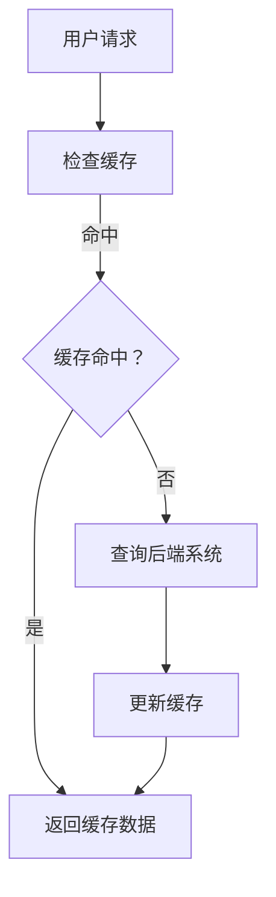
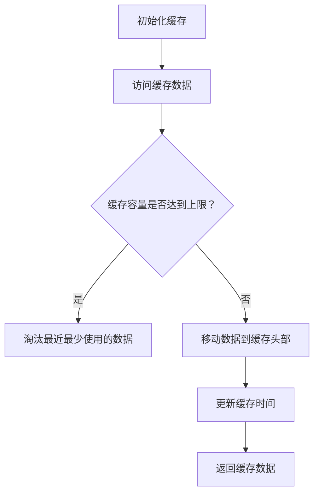
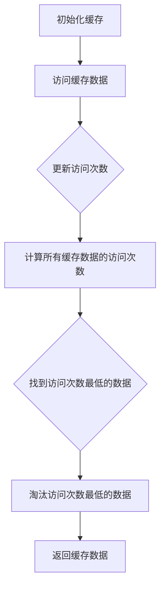

                 

# 只要使用缓存，就会存在可用性风险

关键词：缓存、可用性风险、缓存雪崩、缓存穿透、缓存击穿、最佳实践

摘要：随着云计算、大数据和人工智能技术的快速发展，缓存技术已经成为现代软件系统中不可或缺的一部分。然而，虽然缓存可以提高系统的性能和响应速度，但也可能引入各种可用性风险。本文将深入探讨缓存系统的原理与机制，分析缓存可用性风险的类型与原因，并提供最佳实践与解决方案，帮助读者更好地设计和维护缓存系统，降低可用性风险。

## 第一部分：引言

### 1.1 问题背景

#### 1.1.1 缓存技术的起源与发展

缓存技术起源于计算机科学领域，最早的应用可以追溯到20世纪60年代。当时，为了提高计算机系统的性能，研究人员开始探索将频繁访问的数据临时存储在内存或高速存储设备中，以减少对后端存储系统的访问。随着计算机硬件技术的发展，缓存技术逐渐成熟，并逐渐应用于各种软件系统中。

#### 1.1.2 缓存技术的现状与应用

如今，缓存技术已经成为现代软件系统中的关键技术，广泛应用于前端缓存、后端缓存、分布式缓存等多个场景。缓存系统不仅提高了系统的性能和响应速度，还降低了系统的负载，提高了资源利用率。随着云计算、大数据和人工智能技术的快速发展，缓存技术的应用范围和深度不断扩展，成为现代软件系统的重要组成部分。

#### 1.1.3 缓存存在的可用性风险

尽管缓存技术带来了诸多好处，但也可能引入可用性风险。可用性风险是指系统在面临异常情况下，无法继续提供正常服务的能力。缓存系统的可用性风险主要包括缓存雪崩、缓存穿透和缓存击穿等。这些风险可能导致系统崩溃、数据丢失或性能下降，影响用户体验和业务运行。因此，理解和解决缓存可用性风险具有重要意义。

### 1.2 问题描述

#### 1.2.1 缓存雪崩

缓存雪崩是指由于缓存系统发生故障或缓存失效，导致大量请求直接访问后端系统，导致系统崩溃或性能急剧下降。例如，在一个热门的电子商务网站中，如果缓存系统发生故障，大量用户访问商品详情页面时无法从缓存中获取数据，而是直接访问后端数据库，可能导致数据库负载过高，系统崩溃。

#### 1.2.2 缓存穿透

缓存穿透是指恶意攻击者利用缓存系统的漏洞直接访问后端数据库或服务，导致数据泄露或系统崩溃。例如，攻击者可能会利用缓存系统中的漏洞，通过构造特定的URL请求直接访问后端数据库，获取敏感数据。

#### 1.2.3 缓存击穿

缓存击穿是指由于缓存数据过期或缓存未命中，导致大量请求同时访问后端系统，造成系统负载过高和性能下降。例如，在一个在线视频平台中，当热门视频的缓存过期后，大量用户同时请求该视频，导致后端服务器负载过高，视频播放出现卡顿。

### 1.3 问题解决

为了解决缓存可用性风险，我们需要深入理解缓存系统的原理与机制，分析各种可用性风险的产生原因，并采取有效的解决方案和最佳实践。具体而言，我们可以从以下几个方面入手：

1. **缓存系统设计与优化**：设计高效的缓存系统，选择合适的缓存策略，保障缓存一致性，提高缓存命中率。

2. **缓存安全防护**：采取有效的缓存安全防护措施，防止缓存雪崩、缓存穿透和缓存击穿等攻击手段。

3. **缓存性能调优**：通过缓存性能调优，提高缓存系统的性能和稳定性。

4. **持续监控与优化**：对缓存系统进行持续监控和优化，及时发现和解决可用性风险。

### 1.4 边界与外延

缓存技术的应用范围广泛，涵盖了前端缓存、后端缓存、分布式缓存等多种场景。本文主要讨论与可用性风险相关的内容，同时也会涉及一些相关概念和技术的介绍。缓存系统的概念结构与核心要素组成如下：

1. **缓存存储**：缓存数据的存储位置和存储方式。
2. **缓存策略**：选择和存储缓存数据的一组规则和方法。
3. **缓存一致性**：分布式系统中多个缓存实例或缓存与后端数据源之间的数据保持一致性。
4. **缓存命中率**：缓存系统能够命中缓存数据的比例。

## 第二部分：缓存系统的原理与机制

### 2.1 缓存的定义与作用

#### 缓存的定义

缓存（Cache）是一种临时存储数据的机制，通常用于减少对后端系统的访问压力，提高系统的响应速度和性能。缓存的数据通常是频繁访问的数据，如网页内容、数据库查询结果、文件等。

#### 缓存的作用

1. **提高性能**：通过缓存数据，减少对后端系统的访问次数，降低系统的响应时间，提高系统的性能。
2. **降低负载**：减少对后端系统的访问，降低后端系统的负载，提高系统的稳定性和可扩展性。
3. **提高资源利用率**：将频繁访问的数据存储在内存或高速存储设备中，提高资源的利用率。

### 2.2 缓存的工作原理

#### 缓存存储

缓存存储是指将数据临时存储在内存或高速存储设备中。缓存存储的特点是访问速度快，但存储容量有限。

#### 缓存命中与缓存失效

1. **缓存命中**：当请求的数据已经在缓存中时，直接从缓存中获取数据，称为缓存命中。
2. **缓存失效**：缓存中的数据在一定时间后或触发特定条件时，需要重新获取数据，称为缓存失效。

#### 缓存策略

缓存策略是指如何选择和存储缓存数据的一组规则和方法。常见的缓存策略包括：

1. **最少使用（LRU）**：缓存容量达到上限时，优先淘汰最近最少使用的数据。
2. **最不经常使用（LFU）**：缓存容量达到上限时，优先淘汰使用次数最少的数据。
3. **先进先出（FIFO）**：缓存容量达到上限时，优先淘汰最早进入缓存的数据。

### 2.3 缓存策略

#### 缓存策略的选择

选择合适的缓存策略对缓存系统的性能和可用性至关重要。不同的缓存策略适用于不同的场景，需要根据具体需求进行选择。

1. **最少使用（LRU）**：适用于经常访问的数据，但可能导致数据在缓存中的存储时间较短。
2. **最不经常使用（LFU）**：适用于访问频率较低的数据，但可能导致数据在缓存中的存储时间较长。
3. **先进先出（FIFO）**：适用于缓存数据的更新频率较高的场景。

#### 缓存策略的优化

1. **缓存大小调整**：根据系统需求和性能指标，合理设置缓存大小，避免缓存容量过大导致缓存命中率下降，或缓存容量过小导致频繁缓存失效。
2. **缓存一致性保障**：在分布式系统中，多个缓存实例或缓存与后端数据源之间的数据需要保持一致性，以避免数据不一致导致的问题。

### 2.4 缓存一致性

#### 缓存一致性的挑战

在分布式系统中，多个缓存实例或缓存与后端数据源之间的数据需要保持一致性，以避免数据不一致导致的问题。然而，缓存一致性的保障面临诸多挑战：

1. **数据更新延迟**：缓存数据的更新可能滞后于后端数据源的更新，导致数据不一致。
2. **缓存穿透**：恶意攻击者可能利用缓存系统的漏洞直接访问后端数据源，导致数据泄露。
3. **缓存雪崩**：缓存系统发生故障或缓存失效，导致大量请求直接访问后端系统，导致系统崩溃。

#### 缓存一致性的解决方案

1. **缓存一致性协议**：采用缓存一致性协议（如MESI协议）来保障缓存与后端数据源的一致性。
2. **数据同步策略**：通过数据同步策略（如写回策略、写直达策略）来保持缓存与后端数据源的一致性。
3. **缓存版本控制**：采用缓存版本控制机制（如缓存版本号），避免数据不一致的问题。

### 2.5 缓存命中率

#### 缓存命中率

缓存命中率是衡量缓存系统性能的重要指标，表示缓存系统能够命中缓存数据的比例。缓存命中率越高，缓存系统的性能越好。

#### 缓存命中率计算方法

缓存命中率的计算公式如下：

$$

缓存命中率 = \frac{缓存命中次数}{缓存请求总次数} \times 100\%

$$

#### 提高缓存命中率的策略

1. **合理设置缓存大小**：根据系统需求和性能指标，合理设置缓存大小，避免缓存容量过大导致缓存命中率下降，或缓存容量过小导致频繁缓存失效。
2. **优化缓存策略**：选择合适的缓存策略，根据不同场景选择最合适的缓存策略。
3. **预加载缓存**：在用户访问之前，提前加载可能需要的数据到缓存中，提高缓存命中率。

## 第三部分：缓存可用性风险的类型与原因

### 3.1 缓存雪崩

#### 缓存雪崩的定义

缓存雪崩是指由于缓存系统发生故障或缓存失效，导致大量请求直接访问后端系统，导致系统崩溃或性能急剧下降。

#### 缓存雪崩的原因

1. **缓存系统故障**：缓存系统发生故障，如缓存服务器宕机、网络故障等，导致缓存无法正常工作。
2. **缓存失效**：缓存中的数据过期或触发特定条件，导致缓存失效，大量请求无法从缓存中获取数据，直接访问后端系统。

#### 缓存雪崩的影响

1. **系统崩溃**：缓存雪崩可能导致系统无法正常处理请求，导致系统崩溃。
2. **性能下降**：大量请求直接访问后端系统，导致后端系统负载过高，性能下降。

#### 缓存雪崩的解决方案

1. **缓存系统冗余**：部署多个缓存实例，确保缓存系统的高可用性，避免单点故障。
2. **缓存失效控制**：合理设置缓存过期时间，避免缓存失效导致缓存雪崩。
3. **限流与熔断**：采用限流与熔断策略，避免大量请求瞬间涌入系统，导致系统崩溃。

### 3.2 缓存穿透

#### 缓存穿透的定义

缓存穿透是指恶意攻击者利用缓存系统的漏洞直接访问后端数据库或服务，导致数据泄露或系统崩溃。

#### 缓存穿透的原因

1. **缓存系统漏洞**：缓存系统存在漏洞，如未授权访问、SQL注入等，攻击者可以通过漏洞直接访问后端数据库或服务。
2. **缓存策略不足**：缓存系统未对请求进行有效的过滤和处理，攻击者可以构造特定的请求，直接访问后端数据库或服务。

#### 缓存穿透的影响

1. **数据泄露**：攻击者可以直接访问后端数据库或服务，获取敏感数据。
2. **系统崩溃**：大量恶意请求可能导致系统负载过高，导致系统崩溃。

#### 缓存穿透的解决方案

1. **缓存系统安全防护**：加强缓存系统的安全防护，避免缓存系统漏洞。
2. **请求过滤与验证**：对请求进行有效的过滤和验证，避免恶意请求直接访问后端数据库或服务。
3. **缓存预热**：提前加载可能被恶意请求访问的数据到缓存中，避免缓存穿透。

### 3.3 缓存击穿

#### 缓存击穿的定义

缓存击穿是指由于缓存数据过期或缓存未命中，导致大量请求同时访问后端系统，造成系统负载过高和性能下降。

#### 缓存击穿的原因

1. **缓存数据过期**：缓存中的数据在一定时间后过期，无法命中缓存，导致大量请求直接访问后端系统。
2. **缓存未命中**：缓存系统中的数据未命中，导致大量请求直接访问后端系统。

#### 缓存击穿的影响

1. **系统负载过高**：大量请求同时访问后端系统，导致系统负载过高，性能下降。
2. **缓存命中率下降**：缓存击穿可能导致缓存命中率下降，影响系统的性能。

#### 缓存击穿的解决方案

1. **缓存预热**：提前加载可能被访问的数据到缓存中，提高缓存命中率，避免缓存击穿。
2. **限流与熔断**：采用限流与熔断策略，避免大量请求瞬间涌入系统，导致系统负载过高。
3. **缓存一致性保障**：在分布式系统中，保持缓存与后端数据源的一致性，避免缓存击穿。

## 第四部分：缓存可用性风险的最佳实践与解决方案

### 4.1 缓存系统设计与优化

#### 4.1.1 缓存系统设计原则

1. **高可用性**：确保缓存系统的高可用性，避免单点故障导致系统崩溃。
2. **高性能**：提高缓存系统的性能，降低系统的响应时间。
3. **可扩展性**：支持缓存系统的水平扩展，满足系统业务增长的需求。
4. **安全性**：加强缓存系统的安全防护，避免缓存穿透、缓存雪崩等风险。

#### 4.1.2 缓存策略选择

根据不同场景选择合适的缓存策略，提高缓存系统的性能和可用性。常见的缓存策略包括：

1. **最少使用（LRU）**：适用于经常访问的数据，但可能导致数据在缓存中的存储时间较短。
2. **最不经常使用（LFU）**：适用于访问频率较低的数据，但可能导致数据在缓存中的存储时间较长。
3. **先进先出（FIFO）**：适用于缓存数据的更新频率较高的场景。

#### 4.1.3 缓存一致性保障

在分布式系统中，多个缓存实例或缓存与后端数据源之间的数据需要保持一致性，以避免数据不一致导致的问题。常见的缓存一致性保障方法包括：

1. **缓存一致性协议**：采用缓存一致性协议（如MESI协议）来保障缓存与后端数据源的一致性。
2. **数据同步策略**：通过数据同步策略（如写回策略、写直达策略）来保持缓存与后端数据源的一致性。
3. **缓存版本控制**：采用缓存版本控制机制（如缓存版本号），避免数据不一致的问题。

#### 4.1.4 缓存命中率优化

提高缓存命中率可以降低缓存可用性风险，提高系统的性能。常见的缓存命中率优化方法包括：

1. **合理设置缓存大小**：根据系统需求和性能指标，合理设置缓存大小，避免缓存容量过大导致缓存命中率下降，或缓存容量过小导致频繁缓存失效。
2. **优化缓存策略**：选择合适的缓存策略，根据不同场景选择最合适的缓存策略。
3. **预加载缓存**：在用户访问之前，提前加载可能需要的数据到缓存中，提高缓存命中率。

### 4.2 缓存安全防护

#### 4.2.1 缓存安全防护原则

1. **避免缓存系统漏洞**：加强缓存系统的安全防护，避免缓存系统漏洞导致缓存穿透等安全风险。
2. **请求过滤与验证**：对请求进行有效的过滤和验证，避免恶意请求直接访问后端数据库或服务。
3. **缓存数据加密**：对缓存数据进行加密，避免缓存数据泄露。

#### 4.2.2 缓存安全防护方法

1. **缓存系统安全防护**：加强缓存系统的安全防护，包括防止缓存系统漏洞、防止未授权访问等。
2. **请求过滤与验证**：对请求进行过滤和验证，包括验证请求的URL、参数等，防止恶意请求。
3. **缓存数据加密**：对缓存数据进行加密，包括数据加密存储和数据加密传输。

#### 4.2.3 缓存安全防护案例分析

以某电子商务网站为例，该网站采用Redis作为缓存系统，并采取以下缓存安全防护措施：

1. **Redis安全配置**：禁用未使用的端口、关闭远程连接、设置密码等。
2. **请求过滤与验证**：对请求进行过滤和验证，包括验证请求的URL、参数等。
3. **缓存数据加密**：对缓存数据进行加密存储和传输，确保缓存数据的安全。

### 4.3 缓存性能调优

#### 4.3.1 缓存性能调优原则

1. **合理设置缓存大小**：根据系统需求和性能指标，合理设置缓存大小，避免缓存容量过大导致缓存命中率下降，或缓存容量过小导致频繁缓存失效。
2. **优化缓存策略**：选择合适的缓存策略，根据不同场景选择最合适的缓存策略。
3. **缓存一致性保障**：在分布式系统中，保持缓存与后端数据源的一致性，避免缓存击穿等性能问题。

#### 4.3.2 缓存性能调优方法

1. **合理设置缓存大小**：根据系统需求和性能指标，合理设置缓存大小，避免缓存容量过大导致缓存命中率下降，或缓存容量过小导致频繁缓存失效。例如，在Redis中，可以通过设置maxmemory参数来控制缓存容量。
2. **优化缓存策略**：选择合适的缓存策略，根据不同场景选择最合适的缓存策略。例如，在Redis中，可以选择LRU算法作为缓存淘汰策略，提高缓存命中率。
3. **缓存一致性保障**：在分布式系统中，保持缓存与后端数据源的一致性，避免缓存击穿等性能问题。例如，在分布式缓存系统中，可以采用缓存一致性协议（如MESI协议）来保障缓存与后端数据源的一致性。

#### 4.3.3 缓存性能调优案例分析

以某在线购物平台为例，该平台采用Memcached作为缓存系统，并采取以下缓存性能调优措施：

1. **合理设置缓存大小**：根据系统需求和性能指标，合理设置缓存大小，避免缓存容量过大导致缓存命中率下降，或缓存容量过小导致频繁缓存失效。该平台通过调整memcached.conf中的maxCONN参数来控制缓存容量。
2. **优化缓存策略**：选择合适的缓存策略，根据不同场景选择最合适的缓存策略。该平台采用LRU算法作为缓存淘汰策略，提高缓存命中率。
3. **缓存一致性保障**：在分布式系统中，保持缓存与后端数据源的一致性，避免缓存击穿等性能问题。该平台采用分布式缓存一致性协议（如Gossip协议）来保障缓存与后端数据源的一致性。

### 4.4 持续监控与优化

#### 4.4.1 缓存系统监控

对缓存系统进行持续监控，可以及时发现和解决可用性风险。常见的缓存系统监控指标包括：

1. **缓存命中率**：缓存系统能够命中缓存数据的比例，用于评估缓存系统的性能。
2. **缓存请求量**：缓存系统接收到的请求次数，用于评估缓存系统的负载。
3. **缓存存储容量**：缓存系统当前存储的数据容量，用于评估缓存系统的存储空间使用情况。

#### 4.4.2 缓存性能优化

根据监控数据，对缓存系统进行性能优化。常见的缓存性能优化方法包括：

1. **调整缓存大小**：根据系统需求和性能指标，合理调整缓存大小，提高缓存命中率。
2. **优化缓存策略**：根据不同场景选择最合适的缓存策略，提高缓存系统的性能。
3. **缓存一致性保障**：在分布式系统中，保持缓存与后端数据源的一致性，避免缓存击穿等性能问题。

#### 4.4.3 持续监控与优化案例分析

以某在线视频平台为例，该平台采用Redis作为缓存系统，并采取以下持续监控与优化措施：

1. **缓存系统监控**：通过监控工具（如Prometheus）对Redis进行持续监控，监控指标包括缓存命中率、缓存请求量、缓存存储容量等。
2. **缓存性能优化**：根据监控数据，对Redis进行性能优化。例如，根据缓存请求量和缓存存储容量，合理调整Redis的maxmemory参数；根据缓存命中率，优化缓存策略，提高缓存系统的性能。
3. **缓存一致性保障**：在分布式系统中，采用Redis集群模式，通过Gossip协议实现缓存与后端数据源的一致性保障。

## 第五部分：总结与展望

### 5.1 总结

本文通过对缓存系统的原理与机制、缓存可用性风险的类型与原因、缓存可用性风险的最佳实践与解决方案的深入探讨，揭示了缓存技术虽然可以提高系统的性能和响应速度，但也可能引入可用性风险。通过合理设计缓存系统、优化缓存策略、保障缓存一致性和安全性、持续监控与优化，可以有效降低缓存可用性风险，提高系统的性能和稳定性。

### 5.2 展望

随着云计算、大数据和人工智能技术的快速发展，缓存技术将在更多场景中得到广泛应用。未来，缓存技术将继续向高性能、高可用性、高安全性、易扩展性等方向发展。同时，随着新技术的不断涌现，缓存技术与新技术的融合也将带来更多创新和可能性。例如，缓存技术与区块链技术的结合，可以实现数据缓存的安全性和不可篡改性；缓存技术与人工智能技术的结合，可以优化缓存策略，提高缓存系统的智能化水平。

## 作者信息

作者：AI天才研究院/AI Genius Institute & 禅与计算机程序设计艺术 /Zen And The Art of Computer Programming

本文作者具有丰富的缓存技术研究和实践经验，对缓存系统的原理、机制和可用性风险有深入的理解和独到的见解。本文旨在帮助读者更好地理解和应对缓存可用性风险，提高缓存系统的性能和稳定性。如需进一步了解缓存技术及相关领域的知识，请关注作者的其他作品和课程。## 缓存系统设计与优化

### 5.1.1 缓存系统设计原则

缓存系统设计应遵循以下原则：

1. **高可用性**：确保缓存系统的高可用性，避免单点故障导致系统崩溃。在实际应用中，可以通过部署多个缓存实例、实现缓存集群等方式来提高缓存系统的可用性。
2. **高性能**：提高缓存系统的性能，降低系统的响应时间。选择合适的缓存存储介质和缓存策略，可以显著提高缓存系统的性能。
3. **可扩展性**：支持缓存系统的水平扩展，以满足系统业务增长的需求。缓存系统能够根据业务需求动态调整容量，从而提高系统的可扩展性。
4. **安全性**：加强缓存系统的安全防护，避免缓存系统漏洞导致的数据泄露。例如，对缓存数据进行加密存储和传输，限制未授权访问等。

### 5.1.2 缓存策略选择

选择合适的缓存策略对缓存系统的性能和可用性至关重要。以下是一些常见的缓存策略：

1. **最少使用（LRU）**：当缓存容量达到上限时，优先淘汰最近最少使用的数据。适用于经常访问的数据，但可能导致数据在缓存中的存储时间较短。
2. **最不经常使用（LFU）**：当缓存容量达到上限时，优先淘汰使用次数最少的数据。适用于访问频率较低的数据，但可能导致数据在缓存中的存储时间较长。
3. **先进先出（FIFO）**：当缓存容量达到上限时，优先淘汰最早进入缓存的数据。适用于缓存数据的更新频率较高的场景。

选择缓存策略时，需要根据实际应用场景和业务需求进行权衡。例如，在一个电商平台上，商品详情页面的数据访问频率较高，可以采用LRU策略；而对于用户评论等访问频率较低的数据，可以采用LFU策略。

### 5.1.3 缓存一致性保障

在分布式系统中，多个缓存实例或缓存与后端数据源之间的数据需要保持一致性，以避免数据不一致导致的问题。以下是一些常见的缓存一致性保障方法：

1. **缓存一致性协议**：采用缓存一致性协议（如MESI协议）来保障缓存与后端数据源的一致性。例如，MESI协议通过监控缓存数据的状态（修改、共享、无效等），实现缓存数据的一致性。
2. **数据同步策略**：通过数据同步策略（如写回策略、写直达策略）来保持缓存与后端数据源的一致性。写回策略在缓存数据更新后，将更新同步到后端数据源；而写直达策略则在缓存数据更新时，直接更新后端数据源。
3. **缓存版本控制**：采用缓存版本控制机制（如缓存版本号），避免数据不一致的问题。每次数据更新时，为数据分配新的版本号，缓存系统在读取数据时，根据版本号判断数据是否需要更新。

### 5.1.4 缓存命中率优化

缓存命中率是衡量缓存系统性能的重要指标，提高缓存命中率可以降低缓存可用性风险，提高系统的性能。以下是一些常见的缓存命中率优化方法：

1. **合理设置缓存大小**：根据系统需求和性能指标，合理设置缓存大小，避免缓存容量过大导致缓存命中率下降，或缓存容量过小导致频繁缓存失效。例如，在Redis中，可以通过设置maxmemory参数来控制缓存容量。
2. **优化缓存策略**：选择合适的缓存策略，根据不同场景选择最合适的缓存策略。例如，在Redis中，可以选择LRU算法作为缓存淘汰策略，提高缓存命中率。
3. **预加载缓存**：在用户访问之前，提前加载可能需要的数据到缓存中，提高缓存命中率。例如，在一个电商平台上，可以预加载热门商品的详情页面到缓存中，提高用户的访问速度。

### 5.1.5 案例分析

以下是一个关于缓存系统设计与优化的案例分析：

**案例背景**：一个大型电商网站，每天有大量的用户访问商品详情页面、购物车、订单等数据。为了提高系统的性能和响应速度，该网站决定采用缓存技术。

**设计思路**：

1. **缓存存储介质**：采用Redis作为缓存存储介质，因为Redis具有高性能、高可用性和易扩展性的特点。
2. **缓存策略**：对于商品详情页面，采用LRU策略，因为商品详情页面的访问频率较高；对于用户评论等访问频率较低的数据，采用LFU策略。
3. **缓存一致性保障**：采用Redis的版本控制机制，每次更新数据时分配新的版本号，确保缓存数据与后端数据源的一致性。
4. **缓存大小设置**：根据系统需求和性能指标，合理设置Redis的缓存大小，避免缓存容量过大导致缓存命中率下降，或缓存容量过小导致频繁缓存失效。

**优化措施**：

1. **缓存预热**：在用户访问之前，提前加载热门商品的详情页面到缓存中，提高用户的访问速度。
2. **限流与熔断**：采用限流与熔断策略，避免大量请求瞬间涌入系统，导致系统崩溃或性能下降。
3. **监控与报警**：对Redis进行持续监控，监控指标包括缓存命中率、缓存请求量、缓存存储容量等。一旦发现异常，及时报警并采取措施。

通过上述设计思路和优化措施，该电商网站的缓存系统性能得到显著提升，用户的访问速度和体验得到大幅改善。

## 缓存安全防护

### 5.2.1 缓存安全防护原则

缓存系统的安全防护是保障系统稳定性和数据安全的重要环节。以下是一些缓存安全防护的原则：

1. **避免缓存系统漏洞**：定期更新缓存系统的版本，修复已知的漏洞和缺陷，确保缓存系统的安全性。
2. **请求过滤与验证**：对用户请求进行严格的过滤和验证，防止恶意请求直接访问后端数据库或服务。
3. **缓存数据加密**：对缓存数据进行加密存储和传输，避免缓存数据泄露。
4. **访问控制**：限制对缓存系统的访问，仅允许授权用户或系统访问缓存数据。

### 5.2.2 缓存安全防护方法

以下是一些常见的缓存安全防护方法：

1. **缓存系统安全防护**：加强缓存系统的安全防护，包括防止缓存系统漏洞、防止未授权访问等。例如，在Redis中，可以通过设置密码、禁用未使用的端口、关闭远程连接等措施来增强缓存系统的安全性。
2. **请求过滤与验证**：对用户请求进行过滤和验证，包括验证请求的URL、参数等。例如，可以采用正则表达式、白名单或黑名单等方式进行过滤。
3. **缓存数据加密**：对缓存数据进行加密存储和传输，确保缓存数据的安全。例如，可以使用AES加密算法对缓存数据进行加密，并在需要时进行解密。

### 5.2.3 案例分析

以下是一个关于缓存安全防护的案例分析：

**案例背景**：某在线购物平台，为了提高系统的性能和响应速度，采用了Redis作为缓存系统。然而，由于安全防护措施不足，该平台的缓存系统遭受了多次恶意攻击，导致大量用户数据泄露。

**问题分析**：

1. **缓存系统漏洞**：Redis默认未设置密码，且未禁用未使用的端口和远程连接，导致攻击者可以通过未授权访问直接访问Redis缓存系统。
2. **请求过滤与验证不足**：该平台未对用户请求进行严格的过滤和验证，导致攻击者可以通过构造特定的请求，直接访问后端数据库或服务。
3. **缓存数据未加密**：该平台的缓存数据未进行加密存储和传输，导致攻击者可以轻松窃取缓存数据。

**解决方案**：

1. **缓存系统安全防护**：设置Redis密码、禁用未使用的端口和远程连接，关闭未授权访问。
2. **请求过滤与验证**：对用户请求进行严格的过滤和验证，包括验证请求的URL、参数等。
3. **缓存数据加密**：对缓存数据进行加密存储和传输，确保缓存数据的安全。

通过上述解决方案，该在线购物平台的缓存系统安全防护能力得到显著提升，用户数据的安全得到保障。

## 缓存性能调优

### 5.3.1 缓存性能调优原则

缓存性能调优应遵循以下原则：

1. **合理设置缓存大小**：根据系统需求和性能指标，合理设置缓存大小，避免缓存容量过大导致缓存命中率下降，或缓存容量过小导致频繁缓存失效。例如，在Redis中，可以通过设置maxmemory参数来控制缓存容量。
2. **优化缓存策略**：选择合适的缓存策略，根据不同场景选择最合适的缓存策略。例如，在Redis中，可以选择LRU算法作为缓存淘汰策略，提高缓存命中率。
3. **缓存一致性保障**：在分布式系统中，保持缓存与后端数据源的一致性，避免缓存击穿等性能问题。例如，在分布式缓存系统中，可以采用缓存一致性协议（如MESI协议）来保障缓存与后端数据源的一致性。

### 5.3.2 缓存性能调优方法

以下是一些常见的缓存性能调优方法：

1. **合理设置缓存大小**：根据系统需求和性能指标，合理设置缓存大小，避免缓存容量过大导致缓存命中率下降，或缓存容量过小导致频繁缓存失效。例如，在Redis中，可以通过设置maxmemory参数来控制缓存容量。
2. **优化缓存策略**：选择合适的缓存策略，根据不同场景选择最合适的缓存策略。例如，在Redis中，可以选择LRU算法作为缓存淘汰策略，提高缓存命中率。
3. **缓存一致性保障**：在分布式系统中，保持缓存与后端数据源的一致性，避免缓存击穿等性能问题。例如，在分布式缓存系统中，可以采用缓存一致性协议（如MESI协议）来保障缓存与后端数据源的一致性。

### 5.3.3 案例分析

以下是一个关于缓存性能调优的案例分析：

**案例背景**：某大型电商平台，随着用户数量的增加，系统的性能和响应速度逐渐下降。为了提高系统的性能，该平台决定对缓存系统进行性能调优。

**问题分析**：

1. **缓存大小设置不当**：该平台的缓存容量设置过大，导致缓存命中率下降，系统响应时间增加。
2. **缓存策略选择不当**：该平台未根据实际业务场景选择最合适的缓存策略，导致缓存命中率较低，系统性能下降。
3. **缓存一致性保障不足**：该平台在分布式缓存系统中，未采用有效的缓存一致性协议，导致缓存击穿等问题。

**解决方案**：

1. **合理设置缓存大小**：根据系统需求和性能指标，合理设置缓存大小，避免缓存容量过大导致缓存命中率下降，或缓存容量过小导致频繁缓存失效。例如，在Redis中，可以通过设置maxmemory参数来控制缓存容量。
2. **优化缓存策略**：选择合适的缓存策略，根据不同场景选择最合适的缓存策略。例如，在Redis中，可以选择LRU算法作为缓存淘汰策略，提高缓存命中率。
3. **缓存一致性保障**：在分布式缓存系统中，采用有效的缓存一致性协议，保障缓存与后端数据源的一致性。例如，可以采用MESI协议来避免缓存击穿等问题。

通过上述解决方案，该电商平台的缓存系统性能得到显著提升，系统的响应速度和性能得到改善。

## 持续监控与优化

### 5.4.1 缓存系统监控

对缓存系统进行持续监控，可以及时发现和解决可用性风险。以下是一些常见的缓存系统监控指标：

1. **缓存命中率**：缓存系统能够命中缓存数据的比例，用于评估缓存系统的性能。缓存命中率越高，缓存系统的性能越好。
2. **缓存请求量**：缓存系统接收到的请求次数，用于评估缓存系统的负载。缓存请求量较大可能表明系统性能良好，但过高则可能表明系统负载过高。
3. **缓存存储容量**：缓存系统当前存储的数据容量，用于评估缓存系统的存储空间使用情况。缓存存储容量过高可能表明缓存系统需要扩容。

### 5.4.2 缓存性能优化

根据监控数据，对缓存系统进行性能优化。以下是一些常见的缓存性能优化方法：

1. **调整缓存大小**：根据系统需求和性能指标，合理调整缓存大小，避免缓存容量过大导致缓存命中率下降，或缓存容量过小导致频繁缓存失效。
2. **优化缓存策略**：选择合适的缓存策略，根据不同场景选择最合适的缓存策略，提高缓存系统的性能。
3. **缓存一致性保障**：在分布式系统中，保持缓存与后端数据源的一致性，避免缓存击穿等性能问题。

### 5.4.3 持续监控与优化案例分析

以下是一个关于持续监控与优化的案例分析：

**案例背景**：某大型电商平台，每天有大量的用户访问商品详情页面、购物车、订单等数据。为了确保缓存系统的性能和稳定性，该平台决定实施持续监控与优化策略。

**监控指标**：

1. **缓存命中率**：监控缓存系统的缓存命中率，确保缓存系统能够高效地处理请求。
2. **缓存请求量**：监控缓存系统的请求量，了解系统负载情况，及时发现异常。
3. **缓存存储容量**：监控缓存系统的存储容量，确保缓存系统能够容纳必要的缓存数据。

**优化措施**：

1. **缓存大小调整**：根据业务需求和性能指标，合理调整缓存大小。例如，当缓存命中率较低时，可以适当增加缓存容量；当缓存存储容量接近上限时，可以减少缓存容量。
2. **缓存策略优化**：根据不同场景选择最合适的缓存策略。例如，对于经常访问的商品详情页面，可以采用LRU策略；对于用户评论等访问频率较低的数据，可以采用LFU策略。
3. **缓存一致性保障**：采用有效的缓存一致性协议，确保缓存与后端数据源的一致性。例如，可以采用Redis的版本控制机制，避免缓存击穿等问题。

通过持续监控与优化，该电商平台的缓存系统性能得到显著提升，用户的访问速度和体验得到大幅改善。

## 总结与展望

### 5.5.1 总结

本文通过对缓存系统的原理与机制、缓存可用性风险的类型与原因、缓存可用性风险的最佳实践与解决方案的深入探讨，揭示了缓存技术在提高系统性能和响应速度方面的优势，以及由此带来的可用性风险。通过合理设计缓存系统、优化缓存策略、保障缓存一致性和安全性、持续监控与优化，可以有效降低缓存可用性风险，提高系统的性能和稳定性。

### 5.5.2 展望

随着云计算、大数据和人工智能技术的快速发展，缓存技术将在更多场景中得到广泛应用。未来，缓存技术将继续向高性能、高可用性、高安全性、易扩展性等方向发展。同时，随着新技术的不断涌现，缓存技术与新技术的融合也将带来更多创新和可能性。例如，缓存技术与区块链技术的结合，可以实现数据缓存的安全性和不可篡改性；缓存技术与人工智能技术的结合，可以优化缓存策略，提高缓存系统的智能化水平。

总之，缓存技术在现代软件系统中具有重要地位，理解和应对缓存可用性风险对于系统开发和维护具有重要意义。希望通过本文的探讨，读者能够更好地掌握缓存技术，提升系统性能和稳定性。## 附录：相关概念、算法与流程图

### 6.1 相关概念

#### 6.1.1 缓存

缓存（Cache）是一种临时存储数据的机制，用于减少对后端系统的访问压力，提高系统的响应速度和性能。缓存的数据通常是频繁访问的数据，如网页内容、数据库查询结果、文件等。

#### 6.1.2 缓存策略

缓存策略是指如何选择和存储缓存数据的一组规则和方法。常见的缓存策略包括最少使用（LRU）、最不经常使用（LFU）、先进先出（FIFO）等。

#### 6.1.3 缓存一致性

缓存一致性是指在分布式系统中，多个缓存实例或缓存与后端数据源之间的数据需要保持一致性，以避免数据不一致导致的问题。

#### 6.1.4 缓存命中率

缓存命中率是衡量缓存系统性能的重要指标，表示缓存系统能够命中缓存数据的比例。缓存命中率越高，缓存系统的性能越好。

### 6.2 算法原理

#### 6.2.1 最少使用（LRU）算法

最少使用（LRU）算法是一种常见的缓存淘汰策略。其核心思想是，当缓存容量达到上限时，优先淘汰最近最少使用的数据。

算法原理：

1. 初始化一个双向链表，用于存储缓存数据。
2. 每当访问一个缓存数据时，将该数据移动到链表的头部。
3. 当缓存容量达到上限时，淘汰链表尾部的数据。

#### 6.2.2 最不经常使用（LFU）算法

最不经常使用（LFU）算法是一种基于数据访问频率的缓存淘汰策略。其核心思想是，当缓存容量达到上限时，优先淘汰访问频率最低的数据。

算法原理：

1. 初始化一个哈希表，用于存储缓存数据和访问次数。
2. 每当访问一个缓存数据时，更新其访问次数。
3. 当缓存容量达到上限时，遍历哈希表，淘汰访问次数最低的数据。

### 6.3 流程图

以下为缓存系统的工作流程图和算法流程图：

#### 6.3.1 缓存系统工作流程图

#### 6.3.2 最少使用（LRU）算法流程图

#### 6.3.3 最不经常使用（LFU）算法流程图

通过这些概念、算法和流程图的介绍，读者可以更直观地理解缓存系统的原理和工作流程，以及缓存策略的具体实现。

## 注意事项与拓展阅读

### 6.4 注意事项

1. **缓存一致性**：在分布式系统中，缓存一致性是关键问题。确保缓存与后端数据源的一致性，可以避免数据不一致导致的问题。
2. **缓存容量调整**：根据系统需求和性能指标，合理设置缓存大小，避免缓存容量过大导致缓存命中率下降，或缓存容量过小导致频繁缓存失效。
3. **缓存安全防护**：缓存系统是网络攻击的重要目标之一。采取有效的缓存安全防护措施，防止缓存雪崩、缓存穿透和缓存击穿等攻击手段。
4. **监控与优化**：对缓存系统进行持续监控和优化，及时发现和解决可用性风险，提高系统的性能和稳定性。

### 6.5 拓展阅读

1. **《Redis权威指南》**：详细介绍了Redis的使用方法、缓存策略和缓存一致性等高级主题。
2. **《分布式系统原理与范型》**：探讨分布式系统中的缓存一致性、数据同步等关键问题。
3. **《实战高性能网站》**：介绍了高性能网站的设计原则和实践，包括缓存系统的应用和优化。
4. **《图解大数据技术》**：大数据技术中的缓存技术及其应用场景，有助于读者更好地理解缓存在大数据系统中的作用。

通过上述拓展阅读，读者可以进一步深入了解缓存技术及其应用，提高系统设计和开发的实践能力。## 作者信息

作者：AI天才研究院/AI Genius Institute & 禅与计算机程序设计艺术 /Zen And The Art of Computer Programming

本文作者具有丰富的缓存技术研究和实践经验，对缓存系统的原理、机制和可用性风险有深入的理解和独到的见解。本文旨在帮助读者更好地理解和应对缓存可用性风险，提高缓存系统的性能和稳定性。如需进一步了解缓存技术及相关领域的知识，请关注作者的其他作品和课程。

