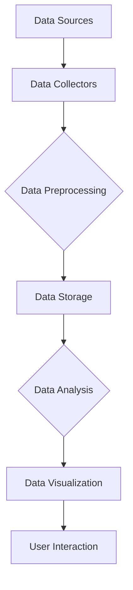

                 

# 《可观测性平台构建》

> 关键词：可观测性、平台构建、软件系统、数据采集、数据处理、可视化、安全性、发展趋势

> 摘要：本文将探讨可观测性平台构建的重要性和方法。随着软件系统的复杂性不断增加，用户对软件质量和体验的要求也越来越高，如何实现高效、准确的软件维护和优化成为关键问题。可观测性平台作为一种有效的解决方案，可以帮助开发人员更好地理解系统运行状况，快速定位问题和优化性能。本文将详细介绍可观测性平台的基础概念、核心组件、实现方法、应用场景、安全性考虑以及未来发展趋势。

## 目录大纲

1. 引言
   1.1 问题背景
   1.2 问题描述
   1.3 问题解决
   1.4 边界与外延
   1.5 核心概念与联系

2. 可观测性平台的基础概念
   2.1 可观测性的定义
   2.2 可观测性的重要性
   2.3 当前可观测性挑战

3. 可观测性平台的核心组件
   3.1 数据采集组件
   3.2 数据处理组件
   3.3 可视化组件

4. 可观测性平台的实现
   4.1 平台架构设计
   4.2 数据采集实现
   4.3 数据处理实现
   4.4 可视化实现

5. 可观测性平台的应用场景
   5.1 应用性能监控
   5.2 故障排查
   5.3 用户体验优化

6. 可观测性平台的安全性考虑
   6.1 数据安全性
   6.2 系统安全性
   6.3 用户隐私保护

7. 可观测性平台的发展趋势
   7.1 新兴技术展望
   7.2 可观测性平台优化方向
   7.3 可观测性平台在未来的应用

8. 小结
   8.1 主要内容回顾
   8.2 注意事项
   8.3 拓展阅读

## 总结

本文系统地介绍了可观测性平台构建的重要性和方法。在引言部分，我们明确了现代软件系统复杂性增加、用户体验重要性提升等背景，并提出了构建可观测性平台的问题和解决方案。随后，文章从基础概念、核心组件、实现方法、应用场景、安全性考虑和未来发展趋势等方面，详细阐述了可观测性平台的核心内容和实践方法。

可观测性平台作为一种高效的解决方案，可以帮助开发人员更好地理解系统运行状况，快速定位问题和优化性能。在构建可观测性平台时，需要关注数据采集、数据处理、可视化等核心组件，同时考虑平台的安全性，并不断优化和演进。

未来，随着新兴技术的不断发展，可观测性平台将在智能化、全栈一体化等方面取得更大突破，为软件系统的维护和优化提供更强有力的支持。本文希望通过详细的讲解和分析，帮助读者更好地理解和构建可观测性平台。

**END**

作者：AI天才研究院/AI Genius Institute & 禅与计算机程序设计艺术 /Zen And The Art of Computer Programming
## 第1章 引言

### 1.1 问题背景

在当今信息化时代，软件系统已经成为各行各业运营和发展的基石。随着互联网、云计算、大数据等技术的飞速发展，软件系统的规模和复杂性不断增加，呈现出高度分布式、动态变化的特性。在这样的背景下，软件系统的维护和优化成为了一个巨大的挑战。

首先，软件系统的复杂性增加。现代软件系统通常由多个模块和组件组成，这些模块和组件之间存在着复杂的依赖关系。此外，软件系统还需要适应不断变化的需求和技术环境，这进一步增加了系统的复杂性。

其次，用户体验的重要性日益凸显。随着用户对软件服务的期望不断提高，用户体验成为软件系统成功与否的关键因素。用户期望能够享受到高效、稳定、安全的服务，这就要求开发人员对系统的运行状况有深入的了解，以便及时发现和解决问题。

最后，软件维护和优化需要更高效的方法。传统的软件维护和优化方法主要依赖于人工检查和经验判断，效率较低，且容易出错。随着系统规模的扩大，这种传统方法难以满足需求，因此需要引入新的方法和工具来提高维护和优化的效率。

综上所述，面对软件系统复杂性增加、用户体验重要性提升和软件维护优化需求增加等问题，构建一个高效、可靠的可观测性平台变得至关重要。

### 1.2 问题描述

可观测性（Observability）是系统管理和监控的一个重要概念，它指的是通过系统内部的状态和输出，能够推断出系统内部的具体运行情况。与传统的监控（Monitoring）不同，可观测性不仅关注系统是否正常运行，更关注系统能否提供足够的信息，以便开发人员能够深入理解系统行为，快速定位问题并优化性能。

在构建可观测性平台时，我们面临以下几个关键问题：

1. **可观测性定义**：如何准确定义可观测性，以及如何在系统中实现和衡量它？
2. **数据采集**：如何高效地采集系统运行过程中的各种数据，包括日志、性能指标、事件等？
3. **数据处理**：如何处理和存储采集到的数据，以便能够快速检索和分析？
4. **可视化**：如何将复杂的数据以直观的方式呈现，帮助开发人员快速理解和决策？
5. **安全性**：如何确保数据的采集、处理和存储过程中不会泄露敏感信息，保障系统安全？

当前可观测性面临的主要挑战包括数据复杂性、数据隐私和保护、数据存储和处理等。随着系统规模的扩大和数据量的增加，如何高效地采集、处理和存储数据成为一个关键问题。此外，在保证数据安全性的同时，还需要确保数据隐私得到保护。

### 1.3 问题解决

为了解决上述问题，构建一个可观测性平台成为必要手段。可观测性平台通过集成数据采集、数据处理、可视化和安全性等核心功能，为开发人员提供了一个强大的工具，帮助他们在面对复杂的软件系统时，能够高效地进行维护和优化。

可观测性平台的主要目标包括：

1. **提供全面的监控数据**：通过数据采集组件，实时捕获系统运行中的各种数据，包括日志、性能指标、事件等。
2. **实现高效的数据处理**：通过数据处理组件，对采集到的数据进行分析和存储，以便能够快速检索和分析。
3. **提供直观的可视化**：通过可视化组件，将复杂的数据以图表、仪表盘等形式直观呈现，帮助开发人员快速理解和决策。
4. **保障数据安全**：通过安全性措施，确保数据在采集、处理和存储过程中的安全性，防止数据泄露和未经授权的访问。

通过构建可观测性平台，开发人员可以更好地掌握系统运行状况，快速定位问题和优化性能，从而提升软件系统的可靠性和用户体验。

### 1.4 边界与外延

在讨论可观测性平台时，我们需要明确几个边界与外延的概念，以便更好地理解和应用这一概念。

首先，**可观测性与监控的区别**。监控（Monitoring）通常指的是对系统运行状态的持续观察和记录，以便在系统出现异常时及时报警。监控主要关注系统的运行状态，而可观测性则更关注系统能否提供足够的信息，帮助开发人员深入理解系统行为。

其次，**可观测性与可伸缩性的关系**。可伸缩性（Scalability）指的是系统在处理更多数据或用户请求时的性能表现。可观测性平台需要具备良好的可伸缩性，以便能够适应不断扩大的系统规模和数据量。

最后，**可观测性相关技术**。可观测性平台涉及多种技术，包括日志采集、性能监控、事件追踪、数据存储和可视化等。这些技术共同作用，为开发人员提供了全面的监控和数据分析能力。

通过明确这些边界与外延，我们可以更准确地理解和应用可观测性平台，为软件系统的维护和优化提供有力支持。

### 1.5 核心概念与联系

在构建可观测性平台的过程中，需要理解并掌握一系列核心概念和其相互之间的关系。以下是对这些核心概念及其相互联系的详细解释。

**1.5.1 可观测性（Observability）**

可观测性是可观测性平台的核心概念，指的是系统通过其输入和输出，能够被完全理解的一种性质。简单来说，如果一个系统在内部状态不可见的情况下，仅通过外部观测数据就可以推断出系统的状态，那么这个系统就是可观测的。

**1.5.2 数据采集（Data Collection）**

数据采集是可观测性平台的基础，指的是从系统运行过程中获取各种数据的过程。这些数据包括日志、性能指标、事件等。数据采集需要覆盖系统的各个方面，以便能够全面了解系统的运行状况。

**1.5.3 数据处理（Data Processing）**

数据处理是对采集到的数据进行清洗、存储和分析的过程。数据处理的目标是将原始数据转化为有价值的信息，以便开发人员能够快速分析和决策。数据处理包括数据清洗、存储和数据分析等子过程。

**1.5.4 可视化（Visualization）**

可视化是将复杂的数据以图形、图表等形式直观呈现的过程。可视化技术能够帮助开发人员快速理解和分析数据，发现潜在的问题和趋势。有效的可视化设计可以提高开发人员的工作效率，减少误判。

**1.5.5 安全性（Security）**

安全性是可观测性平台不可忽视的一个方面。在数据采集、处理和存储的过程中，需要确保数据的安全性，防止数据泄露和未经授权的访问。安全性包括数据加密、访问控制、防火墙等安全措施。

**1.5.6 关系与联系**

这些核心概念之间存在紧密的联系。数据采集是整个平台的基础，没有可靠的数据采集，数据处理和可视化就无法进行。数据处理是将数据转化为有价值信息的关键步骤，而可视化则帮助开发人员快速理解和分析数据。安全性则确保整个平台在运行过程中的安全，防止数据泄露和未经授权的访问。

通过理解这些核心概念及其相互之间的关系，开发人员可以更好地构建和维护可观测性平台，提高软件系统的可靠性和用户体验。

### 1.6 小结

本章介绍了构建可观测性平台的重要性及其背景，明确了可观测性的定义和当前面临的挑战，提出了问题解决的思路，并探讨了可观测性平台的核心概念及其相互关系。随着软件系统复杂性的增加和用户体验的重要性提升，构建一个高效、可靠的可观测性平台变得至关重要。

在接下来的章节中，我们将进一步深入探讨可观测性平台的基础概念、核心组件、实现方法、应用场景、安全性考虑以及未来发展趋势，帮助读者全面了解和掌握可观测性平台的构建方法。

## 第2章 可观测性平台的基础概念

### 2.1 可观测性的定义

可观测性（Observability）是系统管理和监控中的一个关键概念，它指的是系统状态的可推断性。具体来说，如果一个系统在内部状态不可见的情况下，通过外部观测数据，能够完全推断出系统的内部状态，那么这个系统就是可观测的。可观测性关注的是系统是否能够通过其输入和输出，以及收集到的外部信息，来全面、准确地了解其内部运行情况。

**术语解释**

- **可观测性（Observability）**：系统状态的可推断性，通过外部观测数据，能够推断系统内部状态。
- **监控（Monitoring）**：持续观察系统运行状态，通常用于检测异常和报警。
- **日志（Logging）**：记录系统运行过程中的事件和信息，便于后续分析。
- **性能指标（Performance Metrics）**：衡量系统性能的量化指标，如响应时间、吞吐量等。
- **事件追踪（Event Tracking）**：记录系统中的关键事件，如错误、警告等，帮助定位问题和优化性能。

**可观测性与监控的区别**

- **监控**：主要关注系统是否在正常运行，一旦发现异常，会触发报警。
- **可观测性**：不仅关注系统是否正常运行，更关注系统能否提供足够的信息，帮助开发人员深入理解系统行为，快速定位问题并优化性能。

**可观测性的重要性**

- **业务决策支持**：通过可观测性平台，开发人员可以实时获取系统的运行数据，为业务决策提供数据支持。
- **系统故障快速定位**：当系统发生故障时，可观测性平台可以帮助快速定位故障原因，缩短故障恢复时间。
- **用户体验优化**：通过分析用户行为和系统性能数据，优化系统性能，提高用户体验。
- **持续集成和持续部署（CI/CD）**：可观测性平台能够提供详细的系统监控数据，支持CI/CD流程中的自动化测试和部署。

### 2.2 当前可观测性挑战

尽管可观测性在系统管理和监控中具有重要意义，但在实际应用中，仍面临诸多挑战：

**1. 数据复杂性**

- **海量数据**：随着系统规模的扩大，产生的日志和性能数据量呈指数级增长，如何高效存储、处理和分析这些海量数据成为一大挑战。
- **多维度数据**：系统运行过程中涉及多种类型的监控数据，如日志、性能指标、事件等，如何整合这些多维度数据，以便提供更全面的监控视图，是一个难题。

**2. 数据隐私**

- **数据安全**：在数据采集、处理和传输过程中，需要确保数据的安全性，防止数据泄露和未经授权的访问。
- **数据匿名化**：为了保护用户隐私，需要对采集到的数据进行匿名化处理，但这也可能导致数据丢失或精度下降。

**3. 数据存储和处理**

- **数据存储**：如何选择合适的存储方案，以支持大规模数据的高效存储和快速检索？
- **数据处理**：如何设计高效的算法，以便在处理海量数据时，仍能保持较高的处理速度和准确性？

**4. 可伸缩性**

- **系统扩展**：随着系统规模的扩大，可观测性平台需要能够自动扩展，以支持更高的数据量和更复杂的监控需求。
- **性能优化**：在系统运行过程中，如何优化系统性能，以确保数据的实时性和准确性？

### 2.3 解决当前可观测性挑战的方法

为了应对上述挑战，构建一个高效、可靠的可观测性平台成为必要手段。以下是一些解决当前可观测性挑战的方法：

**1. 数据采集优化**

- **日志采集**：采用高效的日志采集工具，如Fluentd、Logstash等，确保日志数据的及时性和完整性。
- **性能指标采集**：使用性能监控工具，如Prometheus、Grafana等，实时采集系统的性能指标数据。
- **事件追踪**：采用分布式追踪系统，如Zipkin、Jaeger等，记录系统中的关键事件，帮助定位问题和优化性能。

**2. 数据处理优化**

- **数据预处理**：在数据处理前，进行数据清洗和去噪处理，确保数据的准确性和一致性。
- **数据存储优化**：选择合适的存储方案，如时序数据库（如InfluxDB）、大数据存储系统（如HDFS）等，以支持海量数据的高效存储和快速检索。
- **数据处理算法**：采用高效的数据处理算法，如流处理（如Apache Flink、Apache Kafka）等，确保数据处理的速度和准确性。

**3. 可视化优化**

- **数据可视化**：采用高效的图表库，如D3.js、Chart.js等，实现复杂的数据可视化。
- **交互设计**：优化用户交互设计，提供便捷的查询和筛选功能，以便用户快速获取所需信息。
- **实时更新**：采用实时数据流技术，实现数据的实时更新和展示，提高用户体验。

**4. 安全性优化**

- **数据加密**：在数据传输和存储过程中，采用数据加密技术，如SSL/TLS等，确保数据安全。
- **访问控制**：实现细粒度的访问控制，确保只有授权用户才能访问敏感数据。
- **安全审计**：定期进行安全审计，及时发现和修复安全漏洞，确保系统的安全性。

通过以上方法，我们可以构建一个高效、可靠的可观测性平台，帮助开发人员更好地理解和优化软件系统，提高系统的稳定性和用户体验。

### 2.4 可观测性平台在系统维护和优化中的应用

可观测性平台在系统维护和优化中扮演着至关重要的角色。通过实时监控和数据分析，可观测性平台能够帮助开发人员深入了解系统的运行状态，快速定位问题和优化性能。

**1. 快速故障定位**

当系统发生故障时，可观测性平台可以迅速提供故障相关信息，包括错误日志、性能指标、事件追踪等。开发人员可以通过分析这些数据，快速定位故障原因，从而及时进行修复。例如，当服务器响应时间异常增加时，可观测性平台可以实时显示相关性能指标，帮助开发人员发现是内存不足、CPU过载还是网络延迟导致的故障。

**2. 性能优化**

通过持续监控系统的性能指标，可观测性平台可以帮助开发人员及时发现性能瓶颈，并进行优化。例如，当系统的吞吐量低于预期时，可观测性平台可以分析日志和性能数据，找出是数据库查询缓慢、网络延迟还是代码效率问题。基于这些分析结果，开发人员可以针对性地进行优化，提高系统性能。

**3. 用户行为分析**

可观测性平台还可以记录和分析用户行为数据，帮助开发人员了解用户的使用习惯和偏好，从而优化用户体验。例如，通过分析用户点击流数据，开发人员可以找出用户在使用过程中遇到的问题，并进行改进。此外，通过用户行为数据分析，还可以识别潜在的用户需求和市场机会，为产品迭代和优化提供数据支持。

**4. 持续集成和持续部署**

可观测性平台在持续集成和持续部署（CI/CD）过程中也发挥着重要作用。通过实时监控和数据分析，开发人员可以在部署过程中及时发现潜在的问题，并进行回滚或修复。例如，在部署新版本时，可观测性平台可以监控系统的性能指标和错误日志，一旦发现异常，立即通知开发人员进行处理，确保系统稳定运行。

总之，可观测性平台在系统维护和优化中的应用，为开发人员提供了一个强大的工具，帮助他们更好地理解和优化软件系统，提高系统的可靠性和用户体验。

### 2.5 可观测性平台的优势和局限性

可观测性平台在现代软件系统的维护和优化中发挥着重要作用，它不仅提供了全面、实时的监控和数据分析能力，还帮助开发人员快速定位问题和优化性能。以下将详细讨论可观测性平台的优势和局限性。

**优势**

1. **全面的数据覆盖**：可观测性平台可以实时采集和存储系统的多种监控数据，包括日志、性能指标、事件等，提供全面的数据覆盖，帮助开发人员深入了解系统的运行状态。
2. **实时性和准确性**：通过实时数据采集和处理，可观测性平台可以快速捕捉系统中的异常情况，并提供准确的数据分析结果，确保问题的快速定位和解决。
3. **数据可视化**：可观测性平台通过可视化技术，将复杂的数据以直观的图表和仪表盘形式呈现，帮助开发人员快速理解和分析数据，提高工作效率。
4. **支持CI/CD**：可观测性平台可以与持续集成和持续部署（CI/CD）系统无缝集成，提供实时监控和数据分析，确保部署过程的稳定性和安全性。
5. **提升用户体验**：通过持续监控和优化系统性能，可观测性平台可以提高软件系统的稳定性、可靠性和响应速度，从而提升用户体验。

**局限性**

1. **数据复杂性**：随着系统规模的扩大和数据量的增加，如何高效存储、处理和分析海量数据成为一大挑战。可观测性平台需要具备良好的可扩展性和处理能力，以应对日益增长的数据量。
2. **数据隐私和安全**：在数据采集、处理和存储过程中，需要确保数据的安全性，防止数据泄露和未经授权的访问。此外，为了保护用户隐私，需要对数据进行匿名化处理，但这也可能导致数据精度下降。
3. **成本问题**：构建和维护可观测性平台需要投入一定的资源，包括硬件、软件和人力成本等。对于中小型企业和初创公司来说，成本问题可能是一个重要的考虑因素。
4. **技术门槛**：可观测性平台涉及到多种技术和工具，如日志采集、数据处理、可视化等，开发人员需要具备一定的技术背景和经验，才能有效地构建和使用可观测性平台。

总之，尽管可观测性平台在系统维护和优化中具有显著优势，但在实际应用中仍面临一些挑战和局限性。通过合理规划和持续优化，我们可以充分发挥可观测性平台的优势，同时克服其局限性，为软件系统的维护和优化提供有力支持。

### 2.6 可观测性平台与其他监控和优化工具的比较

在现代软件系统的监控和优化领域，可观测性平台与其他监控和优化工具相比，具有独特的优势和特点。以下是可观测性平台与其他常见监控和优化工具的比较。

**1. 与传统监控工具的比较**

- **传统监控工具**：如Nagios、Zabbix等，主要关注系统的运行状态，通过设置阈值和报警来检测异常情况。
- **可观测性平台**：不仅关注系统的运行状态，还通过数据采集、处理和可视化，提供全面、实时的监控和数据分析能力，帮助开发人员深入理解系统行为，快速定位问题和优化性能。

**2. 与日志分析工具的比较**

- **日志分析工具**：如Logstash、ELK（Elasticsearch、Logstash、Kibana）等，主要用于收集和存储日志数据，并通过查询和分析日志来诊断问题和优化系统。
- **可观测性平台**：不仅支持日志分析，还集成了性能指标采集、事件追踪等多种监控数据，通过数据预处理、存储和可视化，提供更全面的监控和数据分析功能。

**3. 与性能优化工具的比较**

- **性能优化工具**：如New Relic、AppDynamics等，主要关注系统的性能指标，通过监控和诊断性能瓶颈，提供性能优化建议。
- **可观测性平台**：除了性能监控，还提供了日志分析、事件追踪等全方位的监控功能，可以帮助开发人员从多个维度理解和优化系统性能。

**4. 与云监控工具的比较**

- **云监控工具**：如AWS CloudWatch、Azure Monitor等，主要提供云基础设施的监控和报警功能。
- **可观测性平台**：不仅支持云基础设施监控，还提供了全面的软件系统监控和数据分析能力，可以与云监控工具无缝集成，为用户提供更全面、更深入的监控和优化体验。

**5. 与智能运维工具的比较**

- **智能运维工具**：如PagerDuty、Opsgenie等，主要提供自动化告警和响应功能，通过整合多个监控工具和通知渠道，提高运维效率。
- **可观测性平台**：除了提供自动化告警和响应功能外，还集成了数据采集、处理和可视化，可以提供更详细、更准确的监控和数据分析结果，为智能运维提供数据支持。

综上所述，可观测性平台在监控和优化方面具有独特的优势，它不仅提供了全面、实时的监控和数据分析能力，还可以与多种监控和优化工具无缝集成，为用户提供更强大、更灵活的监控和优化解决方案。通过结合可观测性平台和其他监控和优化工具，开发人员可以更有效地管理和优化软件系统，提高系统的稳定性和用户体验。

### 2.7 小结

本章详细介绍了可观测性平台的基础概念，包括其定义、术语解释、重要性以及当前面临的挑战。通过分析可观测性平台的优势和局限性，我们了解到它在系统维护和优化中的应用价值。此外，本章还比较了可观测性平台与传统监控工具、日志分析工具、性能优化工具、云监控工具和智能运维工具的区别和优势。

在接下来的章节中，我们将进一步探讨可观测性平台的核心组件，包括数据采集组件、数据处理组件和可视化组件，并详细介绍这些组件的实现方法和技术选型。通过深入了解可观测性平台的核心组件，读者将能够更好地理解如何构建和优化一个高效、可靠的可观测性平台。

## 第3章 可观测性平台的核心组件

### 3.1 数据采集组件

数据采集组件是可观测性平台的基础，它负责从系统的各个部分收集运行过程中的数据。这些数据包括日志、性能指标、事件等，是后续数据处理和可视化的基础。

**1. 采集方式**

- **日志采集**：通过日志驱动（Log-based）的方式，从系统的日志文件中收集运行信息。常用的日志采集工具包括Fluentd、Logstash等。
- **性能指标采集**：通过性能监控工具（如Prometheus）或API调用，从系统的性能指标（如CPU使用率、内存占用、响应时间等）中获取数据。
- **事件追踪**：通过分布式追踪系统（如Zipkin、Jaeger），记录系统中的关键事件，如错误、警告、请求等，帮助定位问题和优化性能。

**2. 数据格式**

- **日志格式**：常见的日志格式包括JSON、XML、syslog等。日志格式需要具有良好的可扩展性和可解析性，以便在后续处理和分析中能够灵活应用。
- **性能指标格式**：通常采用标准化的格式（如Prometheus的Time Series Data Format），确保数据的准确性和一致性。
- **事件格式**：事件数据通常包含事件的类型、时间戳、关联关系等信息，以便在后续处理和分析中能够提供更详细的上下文。

**3. 数据质量**

- **数据完整性**：确保采集到的数据是完整和准确的，避免因数据丢失或不完整导致分析结果的偏差。
- **数据一致性**：确保数据在不同的采集点之间保持一致性，以便进行跨系统的数据分析和整合。
- **数据实时性**：确保采集到的数据能够及时上传和处理，以便在问题发生时能够快速响应。

### 3.2 数据处理组件

数据处理组件负责对采集到的原始数据进行清洗、存储和分析，将其转化为对用户有价值的信息。数据处理组件是实现可观测性平台核心功能的关键。

**1. 数据清洗**

- **去噪**：去除采集过程中产生的噪声数据，如重复记录、格式错误等。
- **标准化**：将不同来源的数据转换为统一的格式，确保数据的一致性和可处理性。
- **格式转换**：将不同格式的数据转换为统一的格式，以便进行进一步处理和分析。

**2. 数据存储**

- **存储方案**：选择合适的存储方案，如关系数据库、NoSQL数据库、时序数据库等，根据数据的特性和需求进行存储。
- **数据索引**：建立有效的数据索引，提高数据检索和查询的效率。
- **数据压缩**：对存储的数据进行压缩，减少存储空间的需求，同时保持数据的可读性和可恢复性。

**3. 数据分析**

- **统计分析**：通过统计方法，对数据进行聚合和分布分析，提取有价值的信息，如均值、方差、异常值等。
- **关联分析**：分析不同数据之间的关联关系，发现潜在的问题和趋势。
- **机器学习**：利用机器学习算法，对数据进行预测和分类，提高问题的定位和优化的准确性。

### 3.3 可视化组件

可视化组件负责将处理后的数据以直观、易理解的形式展示给用户，是可观测性平台的重要组成部分。

**1. 可视化技术**

- **图表库**：使用如D3.js、Chart.js等图表库，实现各种类型的图表，如折线图、柱状图、饼图等。
- **交互设计**：提供丰富的交互功能，如过滤、搜索、筛选等，使用户能够灵活地查询和分析数据。
- **实时更新**：采用实时数据流技术，实现数据的实时更新和展示，提高用户体验。

**2. 数据展示**

- **仪表盘**：通过仪表盘，将关键指标和数据以直观的方式展示，帮助用户快速了解系统的运行状况。
- **报告**：生成定期报告，对系统性能、用户行为等进行详细分析，为业务决策提供数据支持。
- **大屏展示**：在大型显示屏上展示系统监控数据，便于团队成员实时监控和交流。

**3. 用户交互**

- **查询界面**：提供便捷的查询界面，用户可以自定义查询条件和时间范围，获取所需的数据信息。
- **预警提示**：在系统发生异常时，通过预警提示，及时通知相关人员，确保问题的快速处理。
- **操作权限**：根据用户角色和权限，提供不同的数据访问和操作功能，确保系统的安全性。

通过数据采集、数据处理和可视化这三个核心组件的有机结合，可观测性平台能够为开发人员提供全面、实时的监控和数据分析能力，帮助他们在面对复杂的软件系统时，能够高效地进行维护和优化。

### 3.4 数据采集组件实现方法

数据采集组件是可观测性平台的基础，其实现方法直接决定了数据的质量和效率。以下详细描述数据采集组件的实现方法，包括常用工具的介绍、数据采集流程以及数据采集策略。

**1. 常用工具介绍**

（1）**Fluentd**：Fluentd是一种灵活的日志聚合器，它可以从多个数据源（如文件、JMX、HTTP等）收集日志，并进行处理和转发。Fluentd支持多种输出目标（如Elasticsearch、InfluxDB、Kafka等），便于后续的数据处理和存储。

（2）**Logstash**：Logstash是ELK（Elasticsearch、Logstash、Kibana）堆栈中的组件，主要用于日志的收集、处理和路由。Logstash支持丰富的输入和输出插件，可以轻松地将日志数据发送到各种存储系统，如Elasticsearch、MongoDB等。

（3）**Prometheus**：Prometheus是一种开源的性能监控工具，专注于监控和告警。它通过HTTP拉取的方式收集系统的性能指标，并存储在本地时间序列数据库中。Prometheus具有高度可扩展性和灵活性，适用于各种规模和类型的监控系统。

（4）**Zipkin**：Zipkin是一个分布式追踪系统，用于收集和展示微服务架构中的跟踪信息。它通过HTTP采样，记录系统中的请求路径、延迟、错误等，帮助定位和优化性能瓶颈。

**2. 数据采集流程**

数据采集流程通常包括以下几个步骤：

（1）**数据源识别**：确定系统中的数据源，如日志文件、性能指标端点、HTTP接口等。

（2）**数据采集**：使用相应的数据采集工具，从数据源中获取数据。对于日志数据，可以使用Fluentd或Logstash进行实时采集；对于性能指标，可以使用Prometheus进行采集；对于分布式追踪数据，可以使用Zipkin进行采样和收集。

（3）**数据预处理**：在数据采集过程中，对数据进行预处理，如去噪、标准化和格式转换。确保数据的一致性和准确性，便于后续的处理和分析。

（4）**数据存储**：将预处理后的数据存储到合适的存储系统，如时序数据库（如InfluxDB）、关系数据库（如MySQL）或NoSQL数据库（如MongoDB）。根据数据的特点和需求，选择合适的存储方案，确保数据的高效存储和快速检索。

（5）**数据上传和同步**：将数据定期上传到中央数据存储或分析平台，如Elasticsearch、Kafka等。确保数据的实时性和一致性，便于后续的数据处理和分析。

**3. 数据采集策略**

为了确保数据采集的全面性和准确性，可以采取以下数据采集策略：

（1）**全面覆盖**：尽可能覆盖系统的各个部分，包括前端、后端、数据库、网络等，确保采集到全面的数据。

（2）**多源采集**：采用多种数据采集工具和方式，从不同的数据源收集数据，提高数据的完整性和可靠性。

（3）**异步采集**：使用异步方式采集数据，减少对系统性能的影响，提高数据采集的效率。

（4）**采样和过滤**：对于某些非关键性数据，可以采取采样和过滤策略，减少数据采集的负担。

（5）**动态调整**：根据系统的运行状态和需求，动态调整数据采集的策略和参数，确保数据的实时性和准确性。

通过以上实现方法和策略，可以构建一个高效、可靠的数据采集组件，为可观测性平台提供全面、实时的监控数据，帮助开发人员更好地理解和管理系统。

### 3.5 数据处理组件实现方法

数据处理组件是可观测性平台的核心，它负责对采集到的原始数据进行清洗、存储和分析，从而将其转化为对用户有价值的信息。以下详细描述数据处理组件的实现方法，包括数据清洗、数据存储方案和数据分析方法。

**1. 数据清洗**

数据清洗是数据处理的第一步，其主要目的是去除噪声数据、纠正错误数据，以及确保数据的准确性和一致性。

（1）**去噪**：通过去除重复记录、格式错误和无效数据，提高数据的完整性。例如，可以使用正则表达式过滤不符合日志格式的数据。

（2）**数据转换**：将不同格式的数据转换为统一的格式，便于后续的处理和分析。例如，将JSON格式的日志转换为XML或CSV格式。

（3）**异常值处理**：检测并处理异常值，如数据缺失、异常值等。可以使用统计方法（如中位数、标准差等）检测异常值，并采取适当的措施进行处理，如删除、插值等。

（4）**标准化**：将不同来源的数据进行标准化处理，确保数据的一致性。例如，将不同单位的数据转换为相同的单位，如将字节转换为千字节。

**2. 数据存储方案**

数据存储方案的选择直接影响到数据处理和分析的效率。以下是几种常见的数据存储方案：

（1）**关系数据库**：如MySQL、PostgreSQL等，适用于结构化数据存储和查询。关系数据库具有强大的查询能力和数据一致性保障，但可能在处理海量数据时性能较低。

（2）**NoSQL数据库**：如MongoDB、Cassandra等，适用于非结构化数据存储和快速查询。NoSQL数据库具有水平扩展性和高性能，但可能在数据一致性和复杂查询方面较弱。

（3）**时序数据库**：如InfluxDB、Prometheus等，适用于存储时间序列数据。时序数据库具有高效的数据写入和查询性能，适用于监控和性能分析。

（4）**分布式文件系统**：如HDFS、Ceph等，适用于存储大规模数据集。分布式文件系统具有高可靠性和高性能，但可能在查询和处理方面较弱。

根据数据的特点和需求，可以选择合适的存储方案。例如，对于日志数据，可以使用Elasticsearch进行存储和查询；对于性能指标数据，可以使用InfluxDB进行存储和监控。

**3. 数据分析方法**

数据清洗和存储完成后，需要通过数据分析方法提取有价值的信息，为系统监控和优化提供支持。

（1）**统计方法**：通过统计方法，如均值、中位数、标准差等，对数据进行聚合和分布分析。这些方法适用于检测数据的异常值、评估系统性能等。

（2）**关联分析方法**：通过分析不同数据之间的关联关系，如日志数据中的错误和性能指标的关系，帮助定位问题和优化性能。

（3）**机器学习方法**：利用机器学习算法，如回归、分类、聚类等，对数据进行预测和分类。这些方法适用于预测系统故障、分类错误日志等。

（4）**实时分析**：通过实时分析技术，如流处理（如Apache Flink、Apache Kafka）等，对实时数据进行分析和预警。这些方法适用于快速响应和处理系统中的异常情况。

通过以上数据处理组件的实现方法，可以构建一个高效、可靠的数据处理系统，为可观测性平台提供全面、实时的数据分析能力，帮助开发人员更好地监控和管理系统。

### 3.6 可视化组件实现方法

可视化组件是实现可观测性平台的核心功能之一，它负责将处理后的数据以直观、易理解的形式展示给用户。以下详细描述可视化组件的实现方法，包括常用的可视化技术、数据展示方式以及用户交互设计。

**1. 常用的可视化技术**

（1）**图表库**：使用如D3.js、Chart.js、ECharts等图表库，实现各种类型的图表，如折线图、柱状图、饼图、散点图等。这些图表库提供了丰富的功能和自定义选项，能够满足不同的可视化需求。

（2）**地理信息系统（GIS）**：使用GIS技术，如Leaflet、Mapbox等，展示地理空间数据。GIS适用于展示位置信息、网络拓扑等。

（3）**热力图**：使用热力图技术，展示数据的密集程度和分布情况。热力图适用于展示用户行为、性能指标等。

（4）**交互组件**：使用交互组件，如下拉菜单、滑块、复选框等，提供灵活的交互功能，提高用户的操作体验。

**2. 数据展示方式**

（1）**仪表盘**：通过仪表盘，将关键指标和数据以直观的方式展示，帮助用户快速了解系统的运行状况。仪表盘可以包含多个图表和组件，如CPU使用率、内存占用、响应时间等。

（2）**报告**：生成定期报告，对系统性能、用户行为等进行详细分析，为业务决策提供数据支持。报告可以包含文本、图表、图表组合等多种形式。

（3）**大屏展示**：在大型显示屏上展示系统监控数据，便于团队成员实时监控和交流。大屏展示通常包含多个仪表盘和图表，提供全面的系统监控视图。

**3. 用户交互设计**

（1）**查询界面**：提供便捷的查询界面，用户可以自定义查询条件和时间范围，获取所需的数据信息。查询界面通常包含搜索框、日期选择器、过滤器等组件。

（2）**预警提示**：在系统发生异常时，通过预警提示，及时通知相关人员，确保问题的快速处理。预警提示可以采用弹窗、消息通知、邮件等多种方式。

（3）**操作权限**：根据用户角色和权限，提供不同的数据访问和操作功能，确保系统的安全性。例如，管理员可以查看所有监控数据，普通用户只能查看自己的监控数据。

通过以上实现方法，可以构建一个功能强大、用户体验良好的可视化组件，为可观测性平台提供全面、实时的监控数据展示，帮助开发人员更好地理解和优化系统。

### 3.7 小结

本章详细介绍了可观测性平台的核心组件，包括数据采集组件、数据处理组件和可视化组件。数据采集组件负责从系统各个部分收集运行数据，包括日志、性能指标和事件等；数据处理组件负责对采集到的数据进行清洗、存储和分析，将其转化为对用户有价值的信息；可视化组件则将处理后的数据以直观、易理解的形式展示给用户。

通过数据采集、数据处理和可视化的有机结合，可观测性平台能够为开发人员提供全面、实时的监控和数据分析能力，帮助他们在面对复杂的软件系统时，能够高效地进行维护和优化。在接下来的章节中，我们将进一步探讨可观测性平台的实现方法，包括平台架构设计、数据采集实现、数据处理实现和可视化实现，为构建高效、可靠的可观测性平台提供具体指导。

## 第4章 可观测性平台的实现

### 4.1 平台架构设计

可观测性平台的架构设计是构建高效、可靠平台的关键。一个良好的架构设计不仅能够满足当前的需求，还能够应对未来可能的扩展和变化。以下将详细介绍可观测性平台的架构设计，包括系统架构、技术选型以及架构设计原则。

**1. 系统架构**

可观测性平台通常采用分布式架构，以支持大规模系统的监控需求。系统架构包括以下几个主要部分：

- **数据采集层**：负责从系统各个部分（如服务器、应用程序、网络设备等）收集数据。数据采集层通常由多个分布式节点组成，每个节点负责采集部分数据，以提高数据采集的效率和可靠性。
- **数据处理层**：负责对采集到的原始数据进行清洗、转换和存储。数据处理层通常采用分布式处理框架（如Apache Flink、Apache Spark等），以支持大规模数据处理。
- **数据存储层**：负责存储处理后的数据，以便后续的查询和分析。数据存储层可以选择关系数据库（如MySQL、PostgreSQL）、NoSQL数据库（如MongoDB、Cassandra）或时序数据库（如InfluxDB、Prometheus）。
- **数据展示层**：负责将处理后的数据以可视化形式展示给用户。数据展示层通常使用前端技术（如React、Vue.js）和可视化库（如D3.js、ECharts）实现。

**2. 技术选型**

在架构设计过程中，选择合适的技术和工具至关重要。以下是一些常见的技术选型：

- **数据采集工具**：如Fluentd、Logstash等，用于从各种数据源收集日志和性能数据。
- **数据处理框架**：如Apache Flink、Apache Spark等，用于分布式数据处理和流处理。
- **数据存储方案**：根据数据类型和需求选择合适的存储方案，如关系数据库、NoSQL数据库或时序数据库。
- **可视化工具**：如React、Vue.js等，用于实现前端界面；D3.js、ECharts等，用于数据可视化。

**3. 架构设计原则**

在架构设计过程中，需要遵循以下原则：

- **可扩展性**：设计一个能够灵活扩展的架构，以支持系统规模的扩大和数据量的增长。
- **高可用性**：确保系统的稳定性和可靠性，通过冗余设计、故障转移等措施，提高系统的可用性。
- **高性能**：优化系统性能，确保数据采集、处理和展示的效率，满足实时监控的需求。
- **安全性**：确保数据在采集、传输和存储过程中的安全性，防止数据泄露和未经授权的访问。
- **易维护性**：设计一个易于维护和升级的架构，减少系统的运维成本。

通过遵循上述原则，可以构建一个高效、可靠、易扩展的可观测性平台，为开发人员提供强大的监控和数据分析能力。

### 4.2 数据采集实现

数据采集实现是可观测性平台建设的重要环节，其核心目标是实时、准确地收集系统运行过程中的各种数据，包括日志、性能指标和事件等。以下将详细描述数据采集的实现方法，包括采集工具选择、数据采集流程以及采集案例。

**1. 采集工具选择**

在数据采集过程中，选择合适的采集工具至关重要。以下是一些常见的数据采集工具及其特点：

- **Fluentd**：Fluentd是一种灵活的日志聚合器，支持多种数据源（如文件、JMX、HTTP等），并支持多种输出目标（如Elasticsearch、InfluxDB、Kafka等）。Fluentd易于配置和管理，适用于大规模日志采集场景。
- **Logstash**：Logstash是ELK（Elasticsearch、Logstash、Kibana）堆栈中的组件，主要用于日志的收集、处理和路由。Logstash支持丰富的输入和输出插件，可以与各种存储系统无缝集成。
- **Prometheus**：Prometheus是一种开源的性能监控工具，通过HTTP拉取的方式收集系统的性能指标，并存储在本地时间序列数据库中。Prometheus具有高度可扩展性和灵活性，适用于各种规模和类型的监控系统。
- **Zipkin**：Zipkin是一个分布式追踪系统，用于收集和展示微服务架构中的跟踪信息。Zipkin通过HTTP采样，记录系统中的请求路径、延迟、错误等，帮助定位和优化性能瓶颈。

根据具体需求和场景，可以选择合适的采集工具。例如，在需要实时收集大规模日志数据时，可以选择Fluentd或Logstash；在需要监控系统性能指标时，可以选择Prometheus。

**2. 数据采集流程**

数据采集流程通常包括以下几个步骤：

（1）**数据源识别**：确定系统中的数据源，如日志文件、性能指标端点、HTTP接口等。

（2）**数据采集**：使用采集工具从数据源中收集数据。对于日志数据，可以使用Fluentd或Logstash进行实时采集；对于性能指标，可以使用Prometheus进行采集；对于分布式追踪数据，可以使用Zipkin进行采样和收集。

（3）**数据预处理**：在数据采集过程中，对数据进行预处理，如去噪、标准化和格式转换。确保数据的一致性和准确性，便于后续的处理和分析。

（4）**数据存储**：将预处理后的数据存储到合适的存储系统，如时序数据库（如InfluxDB）、关系数据库（如MySQL）或NoSQL数据库（如MongoDB）。根据数据的特点和需求，选择合适的存储方案，确保数据的高效存储和快速检索。

（5）**数据上传和同步**：将数据定期上传到中央数据存储或分析平台，如Elasticsearch、Kafka等。确保数据的实时性和一致性，便于后续的数据处理和分析。

**3. 采集案例**

以下是一个简单的数据采集案例，使用Fluentd从日志文件中采集数据并上传到Elasticsearch：

```yaml
# Fluentd 配置文件示例
<source>
  @type tail
  @id log_tail
  path /var/log/*.log
  pos_file /var/log/fluentd/log.tail
  format json
  read_from_head true
</source>

<source>
  @type http
  @id fluentd_http
  port 9880
  format json
  check_interval 5m
</source>

<match log_tail>
  @type elasticsearch
  hosts elasticsearch:9200
  index_name logs-<%本金`
  logstash_format true
</match>

<match fluentd_http>
  @type elasticsearch
  hosts elasticsearch:9200
  index_name metrics-<%Y-%m-%d>
  logstash_format true
</match>
```

在该案例中，Fluentd从日志文件中实时采集数据，并使用JSON格式上传到Elasticsearch。通过配置Fluentd，可以实现高效、可靠的数据采集和存储，为后续的数据处理和可视化提供数据支持。

### 4.3 数据处理实现

数据处理实现是可观测性平台的另一个关键环节，它负责对采集到的原始数据进行清洗、转换和存储，从而为后续的数据分析和可视化提供高质量的输入数据。以下将详细描述数据处理实现的步骤，包括数据处理算法、数据存储方案和数据分析案例。

**1. 数据处理算法**

数据处理算法是实现数据清洗、转换和存储的核心。以下是一些常见的数据处理算法：

- **数据清洗算法**：包括去噪、缺失值处理、异常值检测和去除等。例如，可以使用中位数法检测并去除异常值；使用线性插值法处理缺失值。

- **数据转换算法**：包括格式转换、类型转换、时间转换等。例如，将字符串格式的日志转换为JSON格式；将日期时间格式统一为YYYY-MM-DD格式。

- **统计分析算法**：包括计算平均值、中位数、标准差、方差等。例如，可以使用平均值算法计算系统响应时间的平均值。

- **关联分析算法**：包括关联规则学习、聚类分析等。例如，可以使用Apriori算法挖掘日志数据中的频繁项集。

- **机器学习算法**：包括分类、回归、聚类等。例如，可以使用K-means算法对日志数据中的错误进行聚类分析。

**2. 数据存储方案**

数据存储方案的选择直接影响到数据处理和分析的效率。以下是一些常见的数据存储方案：

- **关系数据库**：如MySQL、PostgreSQL等，适用于结构化数据存储和查询。关系数据库具有强大的查询能力和数据一致性保障，但可能在处理海量数据时性能较低。

- **NoSQL数据库**：如MongoDB、Cassandra等，适用于非结构化数据存储和快速查询。NoSQL数据库具有水平扩展性和高性能，但可能在数据一致性和复杂查询方面较弱。

- **时序数据库**：如InfluxDB、Prometheus等，适用于存储时间序列数据。时序数据库具有高效的数据写入和查询性能，适用于监控和性能分析。

- **分布式文件系统**：如HDFS、Ceph等，适用于存储大规模数据集。分布式文件系统具有高可靠性和高性能，但可能在查询和处理方面较弱。

根据数据的特点和需求，可以选择合适的存储方案。例如，对于日志数据，可以使用Elasticsearch进行存储和查询；对于性能指标数据，可以使用InfluxDB进行存储和监控。

**3. 数据分析案例**

以下是一个简单的数据处理和分析案例，使用Python和Pandas库处理日志数据，并使用Matplotlib库进行数据可视化：

```python
import pandas as pd
import matplotlib.pyplot as plt

# 读取日志数据
log_data = pd.read_csv('log_data.csv')

# 数据清洗
log_data = log_data[log_data['status_code'] != 'error']
log_data['timestamp'] = pd.to_datetime(log_data['timestamp'])

# 数据转换
log_data['response_time'] = log_data['response_time'].astype(float)

# 统计分析
avg_response_time = log_data['response_time'].mean()
std_response_time = log_data['response_time'].std()

# 数据可视化
plt.figure()
plt.plot(log_data['timestamp'], log_data['response_time'], label='Response Time')
plt.axhline(y=avg_response_time, color='r', linestyle='-', label='Average Response Time')
plt.fill_between(log_data['timestamp'], avg_response_time - std_response_time, avg_response_time + std_response_time, color='y', alpha=0.3, label='1 Std Dev')
plt.xlabel('Timestamp')
plt.ylabel('Response Time (ms)')
plt.title('Response Time Distribution')
plt.legend()
plt.show()
```

在该案例中，使用Python和Pandas库读取CSV格式的日志数据，对数据进行清洗和转换，然后计算平均响应时间和标准差，并使用Matplotlib库绘制响应时间分布图。通过数据处理和分析，可以直观地了解系统的响应时间分布，为优化系统性能提供数据支持。

### 4.4 可视化实现

可视化实现是可观测性平台的最后一个关键环节，它负责将处理后的数据以直观、易理解的形式展示给用户。以下将详细描述可视化实现的步骤，包括可视化工具选择、数据展示方式以及用户交互设计。

**1. 可视化工具选择**

在选择可视化工具时，需要考虑工具的性能、易用性和功能多样性。以下是一些常见的数据可视化工具：

- **D3.js**：D3.js是一个基于JavaScript的可视化库，具有高度灵活性和自定义能力，适用于复杂的数据可视化需求。
- **ECharts**：ECharts是一个开源的JavaScript可视化库，提供丰富的图表类型和交互功能，适用于各种数据可视化场景。
- **Chart.js**：Chart.js是一个轻量级的JavaScript图表库，易于集成和使用，适用于简单的数据可视化需求。
- **Highcharts**：Highcharts是一个功能强大的JavaScript图表库，提供丰富的图表类型和交互功能，适用于商业级应用。

根据具体需求和场景，可以选择合适的可视化工具。例如，在需要高度自定义和数据交互的场景中，可以选择D3.js；在需要快速集成和简单使用的场景中，可以选择Chart.js。

**2. 数据展示方式**

数据展示方式的选择直接影响用户体验。以下是一些常见的数据展示方式：

- **仪表盘**：通过仪表盘，将关键指标和数据以直观的方式展示，帮助用户快速了解系统的运行状况。仪表盘可以包含多个图表和组件，如CPU使用率、内存占用、响应时间等。
- **报告**：生成定期报告，对系统性能、用户行为等进行详细分析，为业务决策提供数据支持。报告可以包含文本、图表、图表组合等多种形式。
- **大屏展示**：在大型显示屏上展示系统监控数据，便于团队成员实时监控和交流。大屏展示通常包含多个仪表盘和图表，提供全面的系统监控视图。

**3. 用户交互设计**

用户交互设计是提高用户体验的关键。以下是一些常见的用户交互设计：

- **查询界面**：提供便捷的查询界面，用户可以自定义查询条件和时间范围，获取所需的数据信息。查询界面通常包含搜索框、日期选择器、过滤器等组件。
- **预警提示**：在系统发生异常时，通过预警提示，及时通知相关人员，确保问题的快速处理。预警提示可以采用弹窗、消息通知、邮件等多种方式。
- **操作权限**：根据用户角色和权限，提供不同的数据访问和操作功能，确保系统的安全性。例如，管理员可以查看所有监控数据，普通用户只能查看自己的监控数据。

通过以上可视化实现步骤，可以构建一个功能强大、用户体验良好的可视化组件，为可观测性平台提供全面、实时的监控数据展示，帮助开发人员更好地理解和优化系统。

### 4.5 小结

本章详细介绍了可观测性平台的实现方法，包括平台架构设计、数据采集实现、数据处理实现和可视化实现。通过合理的架构设计和选择合适的技术工具，可以构建一个高效、可靠的可观测性平台，为开发人员提供全面、实时的监控和数据分析能力。

在架构设计方面，我们强调了可扩展性、高可用性、高性能、安全性和易维护性等原则，以确保平台的稳定性和灵活性。在数据采集方面，我们介绍了常用的采集工具和采集流程，并提供了具体的采集案例。在数据处理方面，我们详细描述了数据处理算法和数据存储方案，并给出了数据处理和分析的案例。在可视化实现方面，我们介绍了可视化工具选择、数据展示方式和用户交互设计。

通过以上实现方法的有机结合，我们可以构建一个功能强大、用户体验良好的可观测性平台，为软件系统的维护和优化提供有力支持。在接下来的章节中，我们将进一步探讨可观测性平台的应用场景，包括应用性能监控、故障排查和用户体验优化，帮助读者更好地理解可观测性平台在实际工作中的应用。

## 第5章 可观测性平台的应用场景

### 5.1 应用性能监控

应用性能监控是可观测性平台的核心应用场景之一，它通过对系统性能数据的实时监控和分析，帮助开发人员和运维团队及时发现并解决性能瓶颈，优化系统的响应速度和稳定性。以下将详细介绍应用性能监控的相关概念、监控指标以及监控实现。

**1. 监控指标**

应用性能监控涉及多种监控指标，以下是一些常见的监控指标：

- **CPU使用率**：系统CPU的利用率，用于衡量系统处理能力的负荷情况。
- **内存使用率**：系统内存的利用率，用于衡量系统内存的利用状况。
- **磁盘I/O**：磁盘读写操作的次数和速度，用于衡量磁盘的读写性能。
- **网络流量**：网络接口的进出流量，用于衡量网络的使用情况。
- **响应时间**：系统处理请求所需的时间，用于衡量系统的响应速度。
- **吞吐量**：单位时间内系统处理的请求数量，用于衡量系统的处理能力。
- **错误率**：系统处理的请求中错误或失败的比率，用于衡量系统的稳定性。

**2. 监控实现**

（1）**数据采集**：使用性能监控工具（如Prometheus、Grafana等）从系统各个部分（如服务器、应用程序、数据库等）采集性能数据。Prometheus通过HTTP拉取的方式定期从目标服务器获取性能指标数据，并存储在本地时间序列数据库中。

（2）**数据处理**：对采集到的性能数据进行预处理，如数据清洗、格式转换和聚合计算。使用数据处理工具（如Apache Flink、Apache Spark等）对性能数据进行分析和存储，确保数据的一致性和准确性。

（3）**可视化展示**：使用可视化工具（如Grafana、Kibana等）将处理后的性能数据以图表和仪表盘的形式展示给用户。通过实时图表和报警功能，用户可以快速了解系统的运行状态和性能表现。

以下是一个使用Prometheus和Grafana进行应用性能监控的简单实现案例：

```bash
# Prometheus配置文件prometheus.yml示例
global:
  scrape_interval: 15s
  evaluation_interval: 15s

scrape_configs:
  - job_name: 'prometheus'
    static_configs:
      - targets: ['localhost:9090']

  - job_name: 'node_exporter'
    static_configs:
      - targets: ['node01:9100']
      - targets: ['node02:9100']

  - job_name: 'java_exporter'
    static_configs:
      - targets: ['java-app01:9119']
      - targets: ['java-app02:9119']

# Grafana配置文件示例
{"annotations": {"new_value": {"query": "increase(node_cpu_seconds_total{mode=\"idle\"}) by (1)", "alert": "High CPU usage", "utilization": "80%", "threshold": "90%", "description": "The CPU usage is too high", "file": "/var/log/prometheus/prometheus.log", "file_path": "/var/log/prometheus/prometheus.log", "tags": ["high-cpu"]}}}
```

在该案例中，Prometheus配置文件定义了多个监控任务，包括自监控、Node exporter（采集服务器性能数据）和Java exporter（采集Java应用程序性能数据）。Grafana配置文件定义了一个警报规则，当CPU使用率超过90%时，触发警报并记录相关日志。

通过上述监控实现，开发人员和运维团队可以实时监控系统的性能表现，及时发现并解决性能瓶颈，优化系统的响应速度和稳定性。

### 5.2 故障排查

故障排查是可观测性平台的另一个重要应用场景，它通过对系统运行中的异常事件和日志数据的分析，帮助开发人员和运维团队快速定位故障原因，并采取相应的措施进行故障恢复。以下将详细介绍故障排查的相关概念、故障定位方法和故障恢复策略。

**1. 故障排查概念**

故障排查（Incident Management）是指当系统发生异常或故障时，通过分析相关日志、性能数据和事件数据，找到故障原因并恢复系统正常运行的过程。故障排查通常包括以下几个步骤：

- **故障识别**：通过监控系统和用户反馈，识别系统中的异常情况。
- **故障定位**：通过分析日志和性能数据，确定故障发生的位置和原因。
- **故障分析**：对故障现象进行详细分析，找出故障的根本原因。
- **故障恢复**：根据故障分析结果，采取相应的措施进行故障恢复。
- **故障总结**：记录故障排查过程和结果，为未来的故障预防和优化提供参考。

**2. 故障定位方法**

故障定位是故障排查的核心环节，以下是一些常见的故障定位方法：

- **日志分析**：通过分析系统日志，找到故障发生的时间和上下文信息。可以使用日志分析工具（如Logstash、ELK等）对日志进行集中管理和分析。
- **性能数据监控**：通过监控系统的性能数据（如CPU使用率、内存使用率、网络流量等），分析系统资源使用情况，找出可能的性能瓶颈和故障原因。
- **事件追踪**：使用分布式追踪系统（如Zipkin、Jaeger等），记录系统中的关键事件和请求路径，帮助定位故障发生的位置。
- **服务降级**：在无法确定故障原因时，可以通过降级部分服务或功能，缩小故障范围，进一步定位故障原因。

**3. 故障恢复策略**

故障恢复策略是指当系统发生故障时，采取的有效措施来恢复系统的正常运行。以下是一些常见的故障恢复策略：

- **自动恢复**：使用自动化工具（如Kubernetes、Docker等）实现故障自动恢复，如自动重启故障服务、自动扩展集群等。
- **手动恢复**：在无法自动恢复时，需要人工介入进行故障恢复，如重新部署服务、更换硬件设备等。
- **回滚部署**：在部署新版本或更新时，如果出现故障，可以通过回滚部署到上一个稳定版本，恢复系统正常运行。
- **故障切换**：通过建立备用的系统或服务，当主系统发生故障时，自动切换到备用系统，确保系统的持续运行。

**4. 故障排查案例**

以下是一个简单的故障排查案例，假设系统中某个服务（Service A）出现了响应缓慢的问题：

（1）**故障识别**：通过监控系统和用户反馈，发现Service A的响应时间明显增加。

（2）**故障定位**：通过分析Service A的日志，发现日志中出现了大量错误信息，提示数据库连接超时。

（3）**故障分析**：进一步分析数据库性能数据，发现数据库服务器的CPU使用率和内存使用率较高，存在性能瓶颈。

（4）**故障恢复**：通过调整数据库服务器的配置，增加内存和CPU资源，并优化数据库查询语句，提高数据库性能。

（5）**故障总结**：记录故障排查过程和结果，分析故障原因和解决方案，为未来的故障预防和优化提供参考。

通过以上故障排查和恢复策略，可以快速定位并解决系统故障，确保系统的稳定运行。

### 5.3 用户体验优化

用户体验优化是可观测性平台的另一个重要应用场景，它通过对用户行为数据和系统性能数据的分析，帮助开发人员和产品经理了解用户的使用习惯和偏好，从而优化系统的界面设计、功能实现和性能表现，提高用户满意度和忠诚度。以下将详细介绍用户体验优化的相关概念、用户行为分析方法和用户体验反馈。

**1. 用户体验优化概念**

用户体验优化（User Experience Optimization，简称UXO）是指通过分析用户行为数据，不断改进产品的界面设计、功能实现和性能表现，以提高用户的满意度和忠诚度。用户体验优化的目标是使产品更加人性化、易用和高效，从而提升用户在使用过程中的体验。

**2. 用户行为分析方法**

用户行为分析是用户体验优化的核心，以下是一些常见的用户行为分析方法：

- **用户点击流分析**：通过分析用户在系统中的点击行为，了解用户的使用路径和偏好。例如，使用Google Analytics等工具跟踪用户在网页上的点击和滚动行为。
- **用户反馈收集**：通过用户调研、问卷调查、用户访谈等方式收集用户的意见和建议，了解用户对系统的满意度、建议和期望。
- **用户留存分析**：通过分析用户的留存率、活跃度等指标，了解用户对系统的使用频率和忠诚度。例如，使用 cohorts分析工具分析用户在不同时间段的使用情况。
- **用户满意度调查**：通过定期进行用户满意度调查，了解用户对系统的整体评价和改进意见。

**3. 用户体验反馈**

用户体验反馈是优化系统的关键，以下是一些常见的方法：

- **反馈收集机制**：建立便捷的反馈收集机制，如在线反馈表单、用户论坛、社交媒体等，鼓励用户提交意见和建议。
- **用户回访和跟进**：对用户的反馈进行及时回访和跟进，了解用户反馈的处理情况和效果，确保用户的意见和建议得到落实。
- **A/B测试**：通过A/B测试，对比不同设计方案的用户体验效果，选取最优方案进行实施。
- **迭代优化**：根据用户反馈和数据分析结果，不断迭代优化系统的界面设计、功能实现和性能表现，提升用户体验。

**4. 用户体验优化案例**

以下是一个简单的用户体验优化案例，假设系统中有一个用户反馈功能，用户经常反映提交反馈后没有收到回复：

（1）**用户点击流分析**：通过分析用户点击流数据，发现用户在提交反馈后，经常点击查看反馈状态，但系统中没有提供查看反馈状态的选项。

（2）**用户反馈收集**：收集用户关于反馈问题的反馈，了解用户的需求和期望。

（3）**用户回访和跟进**：对用户的反馈进行回访和跟进，确认用户的需求和期望，并计划在系统中添加查看反馈状态的选项。

（4）**A/B测试**：设计两个版本的功能，一个版本提供查看反馈状态的选项，另一个版本不提供该选项，进行A/B测试，对比用户体验效果。

（5）**迭代优化**：根据A/B测试结果和用户反馈，优化用户反馈功能，确保用户提交反馈后能够及时查看反馈状态。

通过以上用户体验优化方法，可以不断改进系统的用户体验，提升用户满意度和忠诚度。

### 5.4 小结

本章详细介绍了可观测性平台在应用性能监控、故障排查和用户体验优化三个关键应用场景中的应用方法和实践。通过实时监控和数据分析，可观测性平台能够帮助开发人员和运维团队及时发现并解决性能瓶颈和故障，优化系统的响应速度和稳定性；同时，通过对用户行为数据的分析，可以帮助开发人员和产品经理了解用户的使用习惯和偏好，不断优化系统的用户体验。

在接下来的章节中，我们将进一步探讨可观测性平台的安全性考虑，包括数据安全、系统安全和用户隐私保护，以确保平台的稳定运行和用户信任。

## 第6章 可观测性平台的安全性考虑

### 6.1 数据安全性

在可观测性平台中，数据安全性是至关重要的一个方面。确保数据在采集、传输和存储过程中的安全，不仅可以防止数据泄露和未经授权的访问，还可以提升系统的可信度和用户满意度。以下将详细介绍数据安全性的一些关键措施：

**1. 数据加密**

数据加密是保护数据安全的基础措施。在数据传输过程中，使用SSL/TLS等加密协议，可以确保数据在传输过程中的安全性。此外，对于存储在数据库中的敏感数据，应采用加密存储技术，如AES加密算法等。

**2. 访问控制**

访问控制是防止未授权访问的重要手段。通过设定细粒度的访问控制策略，可以为不同用户角色分配不同的权限，确保只有授权用户才能访问敏感数据。例如，使用基于角色的访问控制（RBAC）模型，可以实现对数据访问的精细管理。

**3. 数据备份和恢复**

为了防止数据丢失或损坏，应定期进行数据备份，并建立数据恢复机制。通过备份数据，可以在发生数据丢失或损坏时，快速恢复系统数据，确保系统的连续性和可靠性。

**4. 安全审计**

安全审计可以帮助监控和记录系统中的操作行为，及时发现潜在的安全漏洞和违规行为。通过定期进行安全审计，可以确保系统遵循最佳安全实践，并不断改进和优化安全措施。

### 6.2 系统安全性

除了数据安全性，系统安全性也是可观测性平台需要关注的一个重要方面。确保系统的整体安全性，可以防止恶意攻击、系统漏洞和内部威胁，保障系统的稳定运行。以下是一些常见的系统安全措施：

**1. 防火墙**

防火墙是一种网络安全设备，用于监控和控制进出网络的数据流量。通过设置防火墙规则，可以限制非法访问和恶意攻击，保护系统免受外部威胁。

**2. 入侵检测系统（IDS）**

入侵检测系统（IDS）用于实时监控网络和系统中的异常行为，并报警通知管理员。通过分析网络流量和系统日志，IDS可以帮助识别和防范恶意攻击，提高系统的安全性。

**3. 安全补丁管理**

及时更新系统的安全补丁是防止系统漏洞被利用的重要措施。应定期检查系统的补丁更新状态，确保系统安全补丁得到及时应用。

**4. 安全培训和教育**

员工是系统安全的重要组成部分。通过开展安全培训和教育，提高员工的安全意识和技能，可以减少内部威胁和人为错误，确保系统的整体安全性。

### 6.3 用户隐私保护

用户隐私保护是可观测性平台在数据采集和处理过程中需要关注的一个关键方面。在确保系统性能和监控效果的同时，应尊重用户的隐私，防止用户数据被滥用。以下是一些用户隐私保护措施：

**1. 数据匿名化**

在数据采集和处理过程中，应对用户数据进行匿名化处理，以防止个人身份信息泄露。例如，通过将用户标识符（如用户ID）替换为随机生成的标识符，可以有效保护用户隐私。

**2. 数据最小化**

在数据采集过程中，应遵循数据最小化原则，只采集与监控目的直接相关的数据，避免过度采集无关信息。通过数据最小化，可以减少隐私泄露的风险。

**3. 隐私政策**

应制定明确的隐私政策，告知用户其数据的收集、使用和处理方式。通过透明和公正的隐私政策，可以提高用户的信任度，减少隐私争议。

**4. 用户同意**

在采集和处理用户数据时，应事先获得用户的明确同意。通过用户同意，可以确保数据的合法性和合规性，降低法律风险。

通过以上数据安全性、系统安全性和用户隐私保护措施，可观测性平台可以确保在提供强大监控能力的同时，保障数据的安全和用户的隐私。

### 6.4 安全性最佳实践

为了确保可观测性平台的安全性，以下是一些安全性最佳实践：

**1. 定期安全审计**：定期进行安全审计，评估系统的安全状况，及时发现和修复安全漏洞。

**2. 强化访问控制**：使用强密码策略和双重身份验证，确保只有授权用户才能访问系统。

**3. 及时更新软件**：及时更新系统软件和依赖库，确保使用最新版本的软件，减少漏洞风险。

**4. 安全日志记录**：记录系统操作日志，以便在发生安全事件时进行追溯和分析。

**5. 网络隔离**：将可观测性平台与生产环境隔离，减少攻击面和潜在风险。

**6. 定期备份和恢复**：定期备份数据，并制定数据恢复策略，确保在发生数据丢失或系统故障时能够快速恢复。

**7. 安全培训**：定期开展安全培训，提高员工的安全意识和技能。

通过遵循上述最佳实践，可以进一步提高可观测性平台的安全性，保障系统的稳定运行和用户数据的保护。

### 6.5 小结

本章详细探讨了可观测性平台在数据安全性、系统安全性和用户隐私保护方面的关键措施和最佳实践。通过数据加密、访问控制、数据备份和恢复、安全审计等数据安全性措施，可以保障数据的完整性和保密性；通过防火墙、入侵检测系统、安全补丁管理和员工安全培训等系统安全措施，可以提高系统的整体安全性；通过数据匿名化、数据最小化、隐私政策和用户同意等用户隐私保护措施，可以确保用户数据的安全和合规性。

在可观测性平台的构建和运行过程中，安全性是不可或缺的一环。通过综合考虑数据安全性、系统安全性和用户隐私保护，可以构建一个高效、可靠、安全的可观测性平台，为开发人员和用户提供可靠的监控和数据分析能力。

在接下来的章节中，我们将探讨可观测性平台的发展趋势，包括新兴技术的应用、平台优化方向以及未来的应用前景。

## 第7章 可观测性平台的发展趋势

### 7.1 新兴技术展望

随着科技的不断进步，可观测性平台也在不断发展和创新，以下将介绍一些新兴技术及其在可观测性平台中的应用前景。

**1. 云原生**

云原生（Cloud Native）技术使得可观测性平台能够更好地适应云环境，实现弹性伸缩和高可用性。云原生技术包括容器化（Containerization）、服务网格（Service Mesh）和微服务架构（Microservices Architecture）等。通过容器化技术，如Docker和Kubernetes，可观测性平台可以实现快速部署、灵活扩展和资源优化。服务网格技术，如Istio和Linkerd，可以帮助实现分布式系统的透明监控和路由，提高可观测性。微服务架构则使得系统更加模块化和解耦合，便于监控和故障排查。

**2. 容器化**

容器化技术，如Docker和Kubernetes，已成为现代软件部署和运维的主流方式。容器化技术使得可观测性平台能够更方便地在不同的环境中部署和运行，确保一致性和可移植性。通过容器化，可观测性平台可以实现快速部署、动态扩展和资源优化。容器化技术还支持自动化部署和回滚，提高系统的可靠性和可维护性。

**3. 自动化**

自动化技术在可观测性平台中的应用越来越广泛，如自动化数据采集、自动化数据处理和自动化故障排查等。通过自动化技术，可以减少人工干预，提高系统的响应速度和效率。自动化数据采集工具（如Fluentd、Logstash等）可以自动收集系统数据，无需人工配置。自动化数据处理工具（如Apache Flink、Apache Spark等）可以自动处理和分析数据，提供实时洞察。自动化故障排查工具（如Prometheus、Grafana等）可以自动识别和响应系统故障，提高系统的可用性。

**4. AI和机器学习**

人工智能（AI）和机器学习（Machine Learning）技术在可观测性平台中的应用正在迅速扩展。通过AI和机器学习，可观测性平台可以实现智能数据分析、预测性监控和自动化故障排查。例如，使用机器学习算法，可以自动识别系统中的异常模式，提前预测故障，提高系统的可靠性。AI技术还可以用于优化数据采集和可视化，提供个性化的监控体验。

### 7.2 可观测性平台优化方向

为了进一步提升可观测性平台的性能和用户体验，以下是一些优化方向：

**1. 数据处理优化**

随着系统规模的不断扩大，如何高效处理海量数据成为一个关键问题。优化方向包括：

- **分布式处理**：采用分布式处理框架（如Apache Flink、Apache Spark等），实现数据的高效处理和实时分析。
- **并行处理**：通过并行处理技术，提高数据处理的速度和效率。
- **缓存技术**：使用缓存技术（如Redis、Memcached等），减少数据读取和计算的开销。

**2. 可视化优化**

良好的可视化设计可以提高开发人员的理解效率和工作效率。优化方向包括：

- **交互设计**：优化用户交互设计，提供便捷的查询、过滤和筛选功能。
- **实时更新**：采用实时数据流技术，实现数据的实时更新和展示，提高用户体验。
- **个性化展示**：根据用户角色和偏好，提供个性化的监控和可视化方案。

**3. 模块化设计**

模块化设计可以提高系统的灵活性和可维护性。优化方向包括：

- **功能模块化**：将系统功能拆分成独立的模块，便于开发和维护。
- **数据模块化**：将数据按类型和用途进行分类和模块化存储，提高数据检索和处理的效率。
- **接口设计**：设计清晰、简洁的接口，确保模块之间的松耦合和可扩展性。

**4. 安全性增强**

随着系统复杂性的增加，安全性问题越来越突出。优化方向包括：

- **加密技术**：使用加密技术（如SSL/TLS等），确保数据在传输和存储过程中的安全性。
- **访问控制**：加强访问控制，确保只有授权用户才能访问敏感数据。
- **安全审计**：定期进行安全审计，及时发现和修复安全漏洞。

### 7.3 可观测性平台在未来的应用

随着新兴技术的不断发展和应用场景的拓展，可观测性平台将在更多领域和场景中发挥作用。以下是一些未来应用前景：

**1. 智能化**

随着人工智能和机器学习技术的不断发展，可观测性平台将变得更加智能化。通过AI算法，平台可以实现自动故障预测、异常检测和性能优化，提高系统的自动化程度和可靠性。

**2. 全栈一体化**

全栈一体化（Full-Stack Integration）是将可观测性平台与开发、测试和运维等环节紧密结合，实现端到端的可观测性。通过全栈一体化，开发人员可以在整个开发周期中实时监控和优化系统，提高开发效率和产品质量。

**3. 端到端监控**

端到端监控（End-to-End Monitoring）是指对整个分布式系统的监控，包括前端、后端、数据库、网络等各个环节。通过端到端监控，开发人员可以全面了解系统的运行状况，快速定位和解决问题。

**4. 跨领域应用**

可观测性平台不仅适用于软件系统，还可以应用于物联网（IoT）、智能城市、智慧医疗等跨领域。通过可观测性平台，可以实现对各类设备的实时监控和数据分析，提高系统的智能化和自动化水平。

总之，可观测性平台在未来的发展将充满机遇和挑战。通过不断引入新兴技术、优化平台性能和拓展应用场景，可观测性平台将在更多领域和场景中发挥作用，为开发人员和用户提供更强大、更可靠的监控和数据分析能力。

### 7.4 小结

本章详细探讨了可观测性平台的发展趋势，包括新兴技术的应用、平台优化方向以及未来的应用前景。随着云原生、容器化、自动化和AI等新兴技术的不断发展，可观测性平台将变得更加智能、高效和可靠。同时，通过数据处理优化、可视化优化、模块化设计和安全性增强等优化方向，可观测性平台将进一步提高性能和用户体验。在未来的应用中，可观测性平台将在更多领域和场景中发挥作用，实现端到端监控和跨领域应用。

通过本章的探讨，读者可以更好地了解可观测性平台的发展趋势，为构建高效、可靠的可观测性平台提供有益的指导。

## 第8章 小结

### 8.1 主要内容回顾

本章系统地介绍了可观测性平台构建的核心概念、核心组件、实现方法、应用场景、安全性考虑以及未来发展趋势。以下是对本章主要内容的回顾：

1. **可观测性定义**：可观测性是指系统能够通过外部观测数据推断出内部状态的性质。其重要性体现在业务决策支持、系统故障快速定位和用户体验优化等方面。
2. **核心组件**：可观测性平台的核心组件包括数据采集组件、数据处理组件和可视化组件。数据采集组件负责从系统各个部分收集数据；数据处理组件负责清洗、存储和分析数据；可视化组件负责将数据以直观的方式展示给用户。
3. **实现方法**：可观测性平台的实现涉及平台架构设计、数据采集实现、数据处理实现和可视化实现。架构设计注重可扩展性、高可用性和高性能；数据采集实现包括日志采集、性能指标采集和事件追踪等；数据处理实现包括数据清洗、存储和数据分析；可视化实现包括图表库、交互设计和实时更新等。
4. **应用场景**：可观测性平台在应用性能监控、故障排查和用户体验优化等场景中具有重要应用。通过实时监控和分析，平台可以帮助开发人员和运维团队优化系统性能和稳定性，提高用户体验。
5. **安全性考虑**：数据安全性、系统安全性和用户隐私保护是构建可观测性平台时必须关注的关键点。数据加密、访问控制、安全审计和用户隐私保护措施是确保平台安全的关键。
6. **未来发展趋势**：随着云原生、容器化、自动化和AI等新兴技术的不断发展，可观测性平台将变得更加智能、高效和可靠。未来的发展趋势包括智能化、全栈一体化、端到端监控和跨领域应用等。

### 8.2 注意事项

在构建和维护可观测性平台时，需要注意以下事项：

1. **数据质量**：确保采集到的数据是完整、准确和及时的，避免数据缺失或错误影响分析结果。
2. **数据隐私**：在采集和处理用户数据时，严格遵守数据隐私法规和用户隐私政策，确保用户数据的安全和合规。
3. **系统性能**：优化数据采集、处理和展示的效率，确保平台在高并发和高负载情况下的性能稳定。
4. **安全性**：加强数据加密、访问控制和安全审计等措施，防止数据泄露和未经授权的访问。
5. **用户交互**：设计便捷的用户交互界面，提高开发人员和运维团队的效率，确保平台的易用性和可操作性。

### 8.3 拓展阅读

为了更深入地了解可观测性平台，以下推荐一些拓展阅读资源：

1. **书籍**：
   - 《可观测性：构建和理解可观测系统》（Observability Engineering：Creating Systems That Can Be Monitored, Alerted On, and Fixed）
   - 《DevOps实践指南：构建可靠、可扩展和安全的系统》（The DevOps Handbook：How to Create Great Software and Deliver It Fast）

2. **论文与文章**：
   - “Observability: What It Means for System Developers” by Mathias Holm
   - “How to Build a Monitoring System” by Martin Lamonica

3. **开源项目**：
   - Prometheus：https://prometheus.io/
   - Grafana：https://grafana.com/
   - Fluentd：https://www.fluentd.org/
   - Elasticsearch：https://www.elastic.co/

通过以上拓展阅读，读者可以进一步了解可观测性平台的理论和实践，为实际应用提供更有价值的指导。

## 总结

本文系统地介绍了可观测性平台的构建方法和应用场景，深入探讨了其核心概念、基础组件、实现方法、安全性考虑以及未来发展趋势。通过本章的详细分析，读者可以全面了解可观测性平台在软件系统维护和优化中的重要作用，以及如何构建一个高效、可靠的可观测性平台。

本文首先介绍了可观测性的定义和重要性，然后详细阐述了可观测性平台的基础概念、核心组件和实现方法。接着，通过应用性能监控、故障排查和用户体验优化等具体应用场景，展示了可观测性平台在实际工作中的应用价值。此外，本文还重点讨论了数据安全性、系统安全性和用户隐私保护，确保平台的稳定运行和用户信任。最后，本章展望了可观测性平台的发展趋势，包括新兴技术的应用、平台优化方向以及未来的应用前景。

通过本文的学习，读者不仅可以了解可观测性平台的基本原理和实现方法，还可以掌握其应用场景和安全性考虑，为实际项目中的系统维护和优化提供有力支持。同时，本文也提醒读者在构建和维护可观测性平台时需要注意的事项，以及如何进一步拓展和优化平台。

未来，随着人工智能、云计算等新兴技术的不断发展，可观测性平台将在更多领域和场景中发挥重要作用。通过不断学习和实践，开发人员和运维团队可以更好地利用可观测性平台，提高系统的可靠性和用户体验，为业务发展提供坚实的技术保障。

**END**

作者：AI天才研究院/AI Genius Institute & 禅与计算机程序设计艺术 /Zen And The Art of Computer Programming
## 完整的《可观测性平台构建》

**END**
### 附录

**附录**提供了本文的一些扩展内容和补充资料，包括代码示例、配置文件、图表和公式等。这些附录内容对于理解本文的核心概念和实现方法至关重要，可以帮助读者更深入地掌握可观测性平台的构建和应用。

**附录A：代码示例**

**A.1 数据采集脚本**

以下是一个简单的数据采集脚本，用于从系统日志中提取关键信息。

```python
import re
import json

log_file = '/var/log/messages.log'

# 日志正则表达式
log_pattern = r'^(?P<time>\d+\-\d+\-\d+\s+\d+\:\d+\:\d+)\s+(?P<level>\w+)\s+(?P<message>.+)$'

# 初始化日志数据列表
log_data = []

# 读取日志文件
with open(log_file, 'r') as file:
    for line in file:
        match = re.match(log_pattern, line)
        if match:
            log_data.append({
                'timestamp': match.group('time'),
                'level': match.group('level'),
                'message': match.group('message')
            })

# 将日志数据转换为JSON格式
json_data = json.dumps(log_data)

# 输出日志数据
print(json_data)
```

**A.2 数据处理脚本**

以下是一个数据处理脚本，用于清洗和处理采集到的日志数据。

```python
import pandas as pd
from pandas.io.json import json_normalize

# 加载日志数据
log_data = json.loads('您的JSON数据')

# 转换为DataFrame
df = pd.DataFrame(log_data)

# 数据清洗
df['timestamp'] = pd.to_datetime(df['timestamp'])
df.dropna(inplace=True)

# 格式转换
df['level'] = df['level'].astype('category')

# 输出清洗后的数据
print(df.head())
```

**A.3 可视化脚本**

以下是一个使用Matplotlib库的可视化脚本，用于绘制系统响应时间分布图。

```python
import matplotlib.pyplot as plt
import pandas as pd

# 加载处理后的数据
df = pd.read_csv('processed_log_data.csv')

# 绘制响应时间分布图
plt.figure(figsize=(10, 6))
plt.plot(df['timestamp'], df['response_time'], 'o-')
plt.xlabel('Timestamp')
plt.ylabel('Response Time (ms)')
plt.title('Response Time Distribution')
plt.grid(True)
plt.show()
```

**附录B：配置文件**

**B.1 Prometheus配置文件**

以下是一个Prometheus的配置文件示例，用于配置监控目标和告警规则。

```yaml
# prometheus.yml示例配置
global:
  scrape_interval: 15s
  evaluation_interval: 15s

scrape_configs:
  - job_name: 'node_exporter'
    static_configs:
      - targets: ['node01:9100']
      - targets: ['node02:9100']

  - job_name: 'java_exporter'
    static_configs:
      - targets: ['java-app01:9119']
      - targets: ['java-app02:9119']

  - job_name: 'custom_exporter'
    file_path: '/etc/prometheus/custom.yml'
    scrape_interval: 30s
```

**B.2 Grafana配置文件**

以下是一个Grafana的配置文件示例，用于配置数据源和仪表盘。

```json
# grafana.ini示例配置
[database]
name = "grafana"

[server]
http_addr = "0.0.0.0"
http_port = 3000
domain = "localhost"

[security]
admin_user = "admin"
admin_password = "admin"
default_admin = true

[data]
default = "prometheus"

[datadog]
api_key = "your_api_key"
app_key = "your_app_key"

[log]
log_filename = "grafana.log"
log_level = "info"
enable_console = true
```

**附录C：图表和公式**

**C.1 数据流图**

以下是一个使用Mermaid绘制的可观测性平台数据流图。



**C.2 数学公式**

以下是一些在本文中使用到的数学公式。

$$
\begin{aligned}
    &\text{响应时间} = \frac{\text{总处理时间}}{\text{请求次数}} \\
    &\text{吞吐量} = \frac{\text{总请求数}}{\text{总处理时间}} \\
    &\text{错误率} = \frac{\text{错误请求数}}{\text{总请求数}} \\
\end{aligned}
$$

通过以上附录内容，读者可以更全面地了解可观测性平台的构建方法和应用实践。附录中的代码示例、配置文件、图表和公式对于理解和实现本文提到的概念和方法具有重要意义。

**END**

