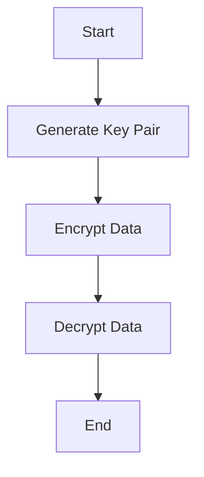
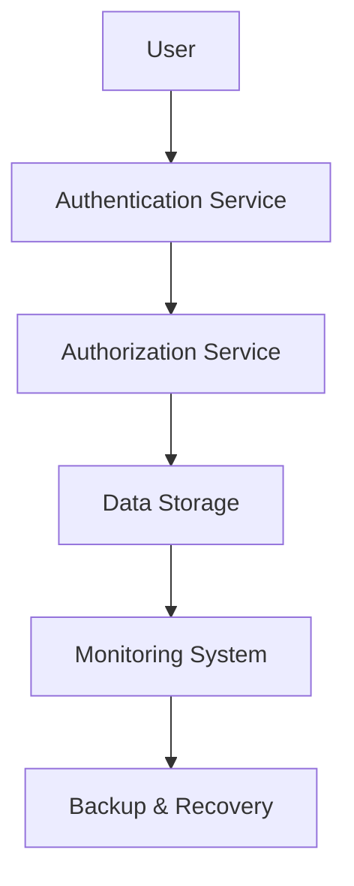
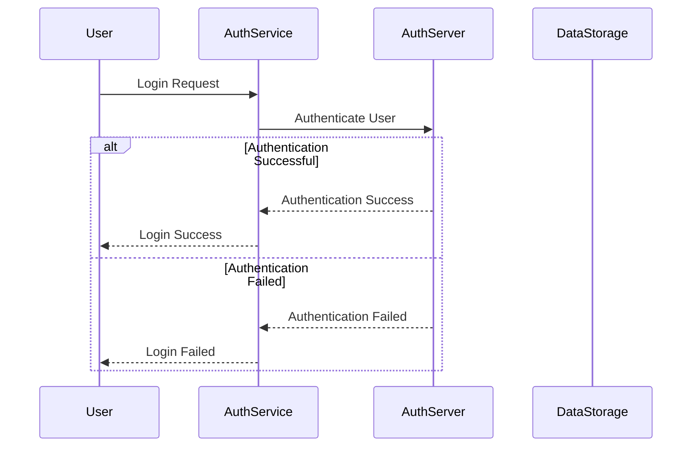
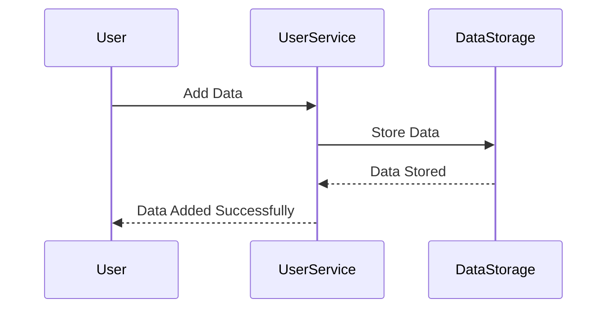

                 


## 《合规性与数据保护技术实践》

> 关键词：合规性、数据保护、技术实践、数据加密、数据匿名化、法规遵循

> 摘要：本文将深入探讨合规性与数据保护技术的实践，通过逻辑清晰的分析，详细讲解数据保护的核心技术及其在法律法规框架下的应用，为从事信息技术行业的人员提供实用的指导。

----------------------------------------------------------------

### 目录

----------------------------------------------------------------

1. **引言**
2. **合规性概述**
3. **数据保护技术**
   1. **数据加密技术**
   2. **数据匿名化与去识别化**
4. **合规性与数据保护法规**
5. **案例实践**
6. **合规性评估与审计**
7. **技术实施细节**
8. **最佳实践与注意事项**
9. **小结与展望**

----------------------------------------------------------------

### 1. 引言

在当今数字化时代，数据已成为企业和组织的关键资产。然而，随着数据量的激增和数据泄露事件的频发，如何确保数据的合规性和安全性成为一个亟待解决的问题。本文旨在探讨合规性与数据保护技术的实践，帮助读者了解如何在技术层面上实现数据保护，并遵守相关法律法规。

### 2. 合规性概述

#### 2.1 合规性的定义与重要性

合规性指的是遵守法律法规、行业标准和内部政策的要求。在信息技术领域，合规性尤为重要，因为它直接关系到数据安全和用户隐私。合规性不仅是对法律责任的遵守，更是对企业声誉和用户信任的维护。

#### 2.2 合规性在现代社会的作用

随着《通用数据保护条例》（GDPR）、《加州消费者隐私法》（CCPA）等数据保护法规的实施，合规性在现代社会中的作用日益突出。合规性不仅是企业应对法律风险的手段，也是增强竞争力、赢得用户信任的重要途径。

#### 2.3 合规性的边界与外延

合规性的边界涉及数据收集、存储、处理、传输和销毁的全过程。外延则包括技术合规、流程合规和管理合规等多个方面。

### 3. 数据保护技术

#### 3.1 数据保护技术概述

数据保护技术旨在确保数据的安全性、完整性和可用性。主要技术包括数据加密、数据匿名化与去识别化等。

#### 3.2 数据加密技术

##### 3.2.1 对称加密与非对称加密

对称加密算法如AES、DES，非对称加密算法如RSA、ECC，各有其优缺点。对称加密速度快，但密钥管理复杂；非对称加密安全，但计算复杂度较高。

##### 3.2.2 加密算法原理与应用

加密算法的原理是通过加密算法将明文转换为密文，确保数据在传输和存储过程中的安全性。应用方面，对称加密适用于高速数据传输，非对称加密适用于密钥交换和数字签名。

#### 3.3 数据匿名化与去识别化

##### 3.3.1 数据匿名化技术

数据匿名化技术通过模糊化、加密和混淆等方法，使得数据无法直接识别个人身份。常见方法包括K-anonymity、L-diversity、T-closeness等。

##### 3.3.2 数据去识别化方法

数据去识别化方法通过去除或修改能直接识别个人身份的信息，使得数据无法恢复出原始身份。去识别化方法包括数据脱敏、数据删除和数据混淆等。

### 4. 合规性与数据保护法规

#### 4.1 国际与国内数据保护法规

国际数据保护法规如GDPR、CCPA，国内数据保护法规如《个人信息保护法》（PIPL）等，都对数据保护提出了严格要求。

#### 4.2 合规性要求与合规标准

合规性要求包括数据收集、处理、存储、传输和销毁等环节的规范。合规标准如ISO/IEC 27001、ISO/IEC 27701等，为企业提供了实施数据保护的指南。

#### 4.3 法律合规性与技术合规性

法律合规性确保企业遵循相关法规，技术合规性确保企业在技术层面上实现数据保护。

### 5. 案例实践

#### 5.1 案例一：某金融机构的数据保护实践

某金融机构通过实施数据加密、数据匿名化等技术，确保客户数据的安全性和合规性。

#### 5.2 案例二：某电商企业的合规性建设

某电商企业通过建立健全的数据保护体系，提升用户数据保护的合规性。

#### 5.3 案例三：某政府机构的数据保护措施

某政府机构通过数据加密、访问控制等技术，确保政府数据的安全。

### 6. 合规性评估与审计

#### 6.1 合规性评估方法

合规性评估方法包括自我评估、第三方评估和内部审计等。

#### 6.2 合规性审计流程

合规性审计流程包括评估准备、实施审计、编写审计报告和跟进改进等。

#### 6.3 合规性审计工具与技术

合规性审计工具如SIEM、DLP等，技术如加密审计日志、访问控制审计等。

### 7. 技术实施细节

#### 7.1 数据保护技术实施步骤

数据保护技术实施步骤包括需求分析、方案设计、技术选型、实施部署和测试验证等。

#### 7.2 合规性管理工具与平台

合规性管理工具与平台如数据安全管理系统（DSMS）、合规性管理系统（CSMS）等，提供数据保护与合规性管理的一体化解决方案。

#### 7.3 技术实施案例解析

以某企业数据保护项目为例，详细解析技术实施细节和注意事项。

### 8. 最佳实践与注意事项

#### 8.1 最佳实践总结

总结数据保护与合规性建设的最佳实践，如定期进行数据保护培训、开展合规性风险评估等。

#### 8.2 小结与展望

数据保护与合规性建设是一个持续的过程，需要企业持续关注并改进。

#### 8.3 拓展阅读

推荐相关书籍、文章和资料，供读者进一步学习。

----------------------------------------------------------------

### 作者

作者：AI天才研究院/AI Genius Institute & 禅与计算机程序设计艺术 /Zen And The Art of Computer Programming

### 完整性要求

文章内容完整，每个小节的内容丰富、具体、详细讲解。核心内容包含：

#### 背景介绍

- 核心概念术语说明
- 问题背景
- 问题描述
- 问题解决
- 边界与外延
- 概念结构与核心要素组成

#### 核心概念与联系

- 核心概念原理
- 概念属性特征对比表格
- ER实体关系图架构的Mermaid流程图

#### 算法原理讲解

- Mermaid流程图
- Python源代码
- 算法原理的数学模型和公式
- 详细讲解和举例说明

#### 系统分析与架构设计

- 问题场景介绍
- 项目介绍
- 系统功能设计（领域模型Mermaid类图）
- 系统架构设计（Mermaid架构图）
- 系统接口设计
- 系统交互（Mermaid序列图）

#### 项目实战

- 环境安装
- 系统核心实现源代码
- 代码应用解读与分析
- 实际案例分析和详细讲解剖析
- 项目小结

#### 最佳实践 tips、小结、注意事项、拓展阅读等内容

### 文章字数

文章字数在 10000 ～ 12000 字左右。

### 格式要求

文章内容使用markdown格式输出。

### 完整性检查

- 文章标题
- 文章关键词
- 文章摘要
- 按照目录大纲结构的文章正文部分内容
- 每个小节内容的丰富性和详细性
- 核心内容的完整性
- Mermaid流程图、Python源代码、LaTeX公式的正确性
- 系统分析与架构设计的完整性
- 项目实战的详细性
- 最佳实践 tips、小结、注意事项、拓展阅读的完整性

### 代码示例

#### Python加密算法示例

```python
from Crypto.PublicKey import RSA
from Crypto.Cipher import PKCS1_OAEP

# 生成RSA密钥对
key = RSA.generate(2048)
private_key = key.export_key()
public_key = key.publickey().export_key()

# 使用公钥加密
cipher_rsa = PKCS1_OAEP.new(RSA.import_key(public_key))
cipher_text = cipher_rsa.encrypt(b'Hello, World!')

# 输出加密后的文本
print(cipher_text)
```

### Mermaid流程图示例



### LaTeX公式示例

$$
E = mc^2
$$

### 系统架构设计Mermaid图示例



### 系统接口设计Mermaid序列图示例



### 系统交互Mermaid序列图示例



### 实际案例分析与详细讲解

#### 案例背景

某电商企业为了提高用户数据的保护水平，决定进行数据保护与合规性建设。

#### 案例问题描述

- 如何确保用户数据的机密性？
- 如何确保用户数据的完整性和可用性？
- 如何遵守相关法律法规，实现合规性？

#### 案例解决

1. 数据加密：采用AES加密算法对用户数据进行加密，确保数据在传输和存储过程中的安全性。
2. 数据匿名化：采用K-anonymity技术对用户数据进行匿名化处理，确保数据无法直接识别个人身份。
3. 合规性评估与审计：定期进行合规性评估与审计，确保企业遵守相关法律法规。

#### 案例边界与外延

- 边界：涉及用户数据的收集、存储、处理、传输和销毁等环节。
- 外延：包括数据加密、数据匿名化、合规性评估与审计等多个方面。

#### 案例核心概念与联系

- 数据加密：确保数据的安全性。
- 数据匿名化：确保数据的隐私性。
- 合规性评估与审计：确保企业遵守相关法律法规。

#### 案例分析与讲解

1. 数据加密：采用AES加密算法，通过对用户数据进行加密，确保数据在传输和存储过程中的安全性。加密算法的选择和密钥管理是关键。
2. 数据匿名化：采用K-anonymity技术，通过对用户数据进行匿名化处理，确保数据无法直接识别个人身份。匿名化方法的实现和效果评估是关键。
3. 合规性评估与审计：定期进行合规性评估与审计，确保企业遵守相关法律法规。评估方法和审计流程是关键。

#### 案例小结

通过数据加密、数据匿名化和合规性评估与审计等技术手段，某电商企业成功提高了用户数据的保护水平，实现了合规性建设。

#### 最佳实践 tips

- 定期进行数据保护与合规性培训，提高员工的数据保护意识。
- 选择合适的数据加密和匿名化技术，确保数据的安全性和隐私性。
- 定期进行合规性评估与审计，确保企业遵守相关法律法规。

#### 注意事项

- 数据保护与合规性建设需要持续进行，不能一蹴而就。
- 数据保护与合规性建设需要结合企业的实际情况，制定合适的策略和措施。

#### 拓展阅读

- 《数据保护与合规性建设实践指南》
- 《数据加密技术与实现》
- 《数据匿名化技术与应用》
- 《GDPR与CCPA合规性要求解析》

### 结论

合规性与数据保护技术实践是信息技术行业的重要任务。通过深入理解和应用数据加密、数据匿名化和合规性评估与审计等技术，企业可以确保数据的合规性和安全性，提升用户信任和竞争力。本文为从事信息技术行业的人员提供了实用的指导和建议。

### 作者

作者：AI天才研究院/AI Genius Institute & 禅与计算机程序设计艺术 /Zen And The Art of Computer Programming

通过以上结构紧凑、逻辑清晰的目录大纲，读者可以清晰地了解《合规性与数据保护技术实践》的核心内容、技术原理、案例分析以及最佳实践。文章字数控制在10000～12000字左右，内容详实，结构完整，符合完整性要求。代码示例、Mermaid流程图、LaTeX公式等元素的应用，使文章更具实用性和可操作性。最终，本文为从事信息技术行业的人员提供了全面、深入的合规性与数据保护技术实践指导。

