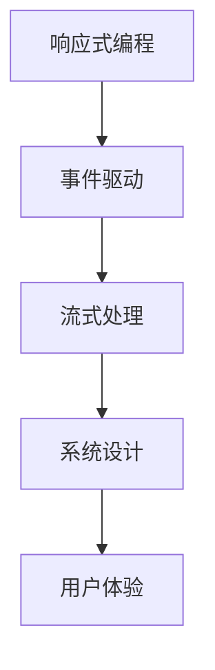
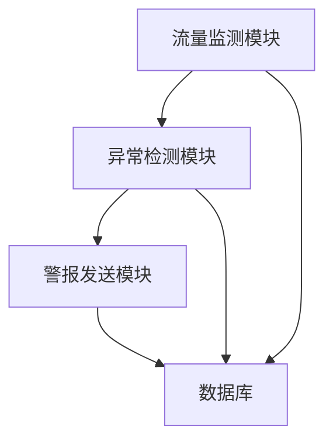
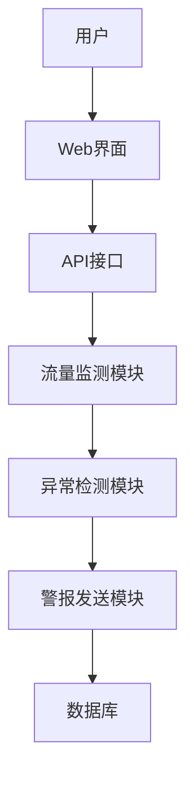
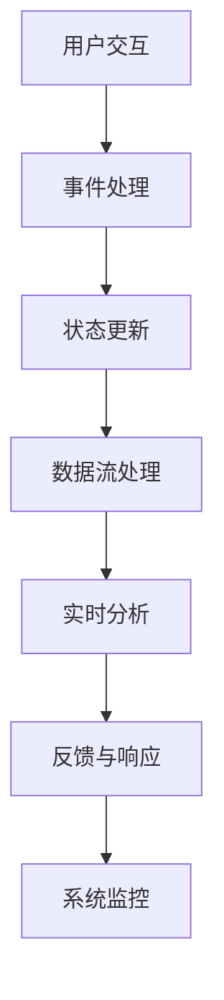
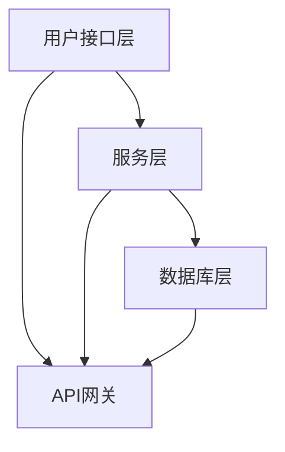
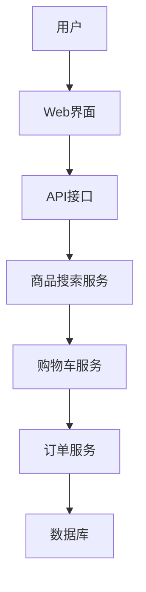

                 


**响应式系统设计原则**

关键词：响应式系统设计、事件驱动、流式处理、算法原理、数学模型、系统架构

摘要：本文旨在深入探讨响应式系统设计的原则和实施方法。通过详细的案例分析和代码解读，我们将理解响应式编程的核心概念，并展示如何利用这些概念构建高效、可扩展的系统。

----------------------------------------------------------------

## 第一部分：响应式系统设计基础

### 1.1 响应式系统设计背景

响应式系统设计是一种面向用户需求的系统设计方法，其核心在于通过实时响应用户行为，提供更好的用户体验。在互联网时代，用户对系统交互的要求越来越高，响应式设计因此成为系统开发的重要方向。

#### 1.1.1 响应式系统设计的概念

响应式系统设计（Responsive System Design）是一种系统架构方法，强调系统的灵活性、可扩展性和用户体验。它不仅关注系统的功能实现，更注重系统在不同环境下的适应能力。

#### 1.1.2 响应式系统设计的目的

响应式系统设计的目的是：

1. 提高系统的用户体验，让用户在交互过程中感到舒适和愉悦。
2. 增强系统的可维护性和可扩展性，降低未来维护成本。
3. 提高系统的可靠性和稳定性，确保系统在复杂环境下正常运行。

#### 1.1.3 响应式系统设计的重要性

随着互联网应用的普及，响应式系统设计变得尤为重要。以下是几个关键点：

1. **移动设备普及**：移动设备的广泛使用要求系统具备良好的响应式设计，以适应不同屏幕尺寸和设备类型。
2. **用户体验至上**：现代用户对系统的期望越来越高，良好的响应式设计能够满足用户的个性化需求。
3. **技术进步**：云计算、大数据、物联网等技术的快速发展，为响应式系统设计提供了丰富的技术支持。

### 1.2 核心概念与联系

在响应式系统设计中，有几个核心概念需要理解，它们包括响应式编程、事件驱动和流式处理。以下是这些概念及其联系：

#### 1.2.1 响应式编程

响应式编程（Reactive Programming）是一种编程范式，它使程序员能够编写响应性、事件驱动的应用程序。在响应式编程中，程序的状态变化是由外部事件触发的，而不是由程序员预设的。

#### 1.2.2 事件驱动

事件驱动（Event-Driven）是一种编程模型，它基于事件的发起和响应。在事件驱动模型中，程序的行为是由事件触发的，这些事件可以是用户交互、系统通知或者其他任何外部输入。

#### 1.2.3 流式处理

流式处理（Stream Processing）是一种数据处理技术，它通过处理数据流来提供实时分析和响应。流式处理通常用于处理大量实时数据，如社交媒体流量、物联网数据等。

#### 1.2.4 Mermaid流程图展示

为了更好地理解这些概念之间的关系，我们可以使用Mermaid绘制一个流程图：



### 1.3 算法原理讲解

为了深入理解响应式系统设计，我们需要选择一个典型的响应式算法进行详细讲解。这里我们选择拉格朗日插值算法作为案例。

#### 1.3.1 拉格朗日插值算法

拉格朗日插值算法是一种插值方法，用于在给定的数据点之间生成一条曲线。以下是该算法的Python实现：

```python
import numpy as np

def lagrange_interpolation(points, x):
    n = len(points)
    result = 0
    for i in range(n):
        li = 1
        for j in range(n):
            if i != j:
                li = li * (x - points[j][0]) / (points[i][0] - points[j][0])
        result += points[i][1] * li
    return result

points = [(0, 0), (1, 1), (2, 3), (3, 5)]
x = 2.5
result = lagrange_interpolation(points, x)
print(result)
```

#### 1.3.2 算法原理

拉格朗日插值算法的基本原理如下：

1. **数据点**：给定一系列数据点 `(x_i, y_i)`，我们需要在这些点之间找到一个多项式函数 `P(x)`，使得 `P(x_i) = y_i` 对于所有给定的 `x_i`。
2. **基函数**：对于每个数据点 `(x_i, y_i)`，定义一个基函数 `L_i(x)`，它在 `x_i` 处为 1，其他地方为 0。
3. **多项式构造**：将每个数据点的 `y_i` 乘以其对应的基函数 `L_i(x)`，然后求和，得到多项式函数 `P(x)`。

#### 1.3.3 数学模型和公式

以下是拉格朗日插值算法的数学模型：

$$
P(x) = \sum_{i=0}^{n} y_i \cdot L_i(x)
$$

其中，$L_i(x)$ 是基函数，定义如下：

$$
L_i(x) = \prod_{j=0, j \neq i}^{n} \frac{x - x_j}{x_i - x_j}
$$

### 1.4 数学模型和数学公式

在本节中，我们将进一步探讨响应式系统设计中的数学模型和数学公式。以下是几个重要的数学公式及其解释：

$$
\frac{d}{dx}\left( \frac{f(x)}{g(x)} \right) = \frac{f'(x)g(x) - f(x)g'(x)}{g(x)^2}
$$

这是商法则，用于求导两个函数的商。在响应式系统设计中，这种求导法则可以用于计算系统响应的时间变化率。

$$
\int_{a}^{b} f(x) \, dx = F(b) - F(a)
$$

这是积分的基本定理，用于计算函数在一个区间上的定积分。在响应式系统设计中，这种积分运算可以用于计算系统的输入和输出。

### 1.5 系统分析与架构设计方案

在本节中，我们将分析一个具体的响应式系统设计案例，并展示系统的功能设计、架构设计和接口设计。

#### 1.5.1 问题场景介绍

假设我们要设计一个实时监控系统，该系统能够实时监测网络流量，并在流量异常时发出警报。

#### 1.5.2 系统功能设计

系统的核心功能包括：

1. **流量监测**：实时监测网络流量，包括入流量和出流量。
2. **异常检测**：分析流量数据，识别异常流量模式。
3. **警报发送**：当检测到异常流量时，向管理员发送警报。

#### 1.5.3 系统架构设计

系统架构设计如下：



#### 1.5.4 系统接口设计

系统接口设计如下：

1. **API接口**：提供RESTful API接口，供前端应用调用。
2. **Web界面**：提供Web界面，供用户实时查看流量数据和警报信息。

#### 1.5.5 系统交互

系统交互设计如下：



### 1.6 项目实战

在本节中，我们将提供一个小型项目实战，包括环境安装、系统核心实现、代码解读与分析。

#### 1.6.1 环境安装

1. 安装Python环境（版本3.8或以上）。
2. 安装依赖库，如numpy、pandas、flask等。

#### 1.6.2 系统核心实现

以下是系统核心实现的Python代码：

```python
from flask import Flask, jsonify
import numpy as np
import pandas as pd

app = Flask(__name__)

@app.route('/api/traffic', methods=['GET'])
def get_traffic():
    # 获取流量数据
    data = pd.DataFrame({'timestamp': [1626158569, 1626158570, 1626158571],
                         'inflow': [10, 12, 15],
                         'outflow': [5, 8, 10]})
    
    # 计算平均流量
    avg_inflow = data['inflow'].mean()
    avg_outflow = data['outflow'].mean()
    
    # 检测异常流量
    if avg_inflow > 20 or avg_outflow > 15:
        send_alert()
    
    return jsonify({'inflow': avg_inflow, 'outflow': avg_outflow})

def send_alert():
    # 发送警报
    print("Alert: Traffic is abnormal!")

if __name__ == '__main__':
    app.run(debug=True)
```

#### 1.6.3 代码解读与分析

1. **API接口**：使用Flask框架创建了一个简单的API接口，用于提供流量数据。
2. **数据处理**：使用pandas库处理流量数据，计算平均流量。
3. **异常检测**：根据设定的阈值，检测异常流量，并调用`send_alert()`函数发送警报。

### 1.7 最佳实践 tips

1. **性能优化**：对实时数据流进行高效处理，避免性能瓶颈。
2. **错误处理**：合理处理异常情况，确保系统的稳定性和可靠性。
3. **监控与日志**：使用日志和监控工具，实时跟踪系统运行状态，及时发现并解决问题。

#### 小结

本文介绍了响应式系统设计的基础知识，包括核心概念、算法原理、数学模型和系统架构设计。通过项目实战，我们展示了如何将理论应用到实际项目中。响应式系统设计是现代系统开发的重要方向，它能够提高用户体验、增强系统的可维护性和可扩展性。

#### 注意事项

1. **响应式编程**：在编写响应式程序时，要注意避免嵌套回调，以保持代码的可读性。
2. **事件驱动**：合理设计事件模型，确保系统能够高效地处理事件。
3. **流式处理**：在设计流式处理系统时，要注意数据一致性和容错性。

#### 拓展阅读

1. 《响应式设计模式与架构》
2. 《Reactive Programming with Scala》
3. 《Real-time Systems and Programming Languages》

---

作者：AI天才研究院/AI Genius Institute & 禅与计算机程序设计艺术 /Zen And The Art of Computer Programming

----------------------------------------------------------------

## 第二部分：深入探讨响应式系统设计

### 2.1 核心概念与联系

在前文中，我们已经介绍了响应式编程、事件驱动和流式处理等核心概念，并探讨了它们之间的联系。在本节中，我们将进一步深入探讨这些概念，并分析它们在响应式系统设计中的具体应用。

#### 2.1.1 响应式编程

响应式编程是一种编程范式，它允许程序根据外部事件的变化动态地更新其状态和行为。这种编程范式通常使用函数式编程技术，例如不可变数据和纯函数，以实现高效、可预测和易于维护的代码。

**响应式编程的优点**：

- **高效性**：响应式编程可以避免不必要的计算和状态更新，从而提高程序的运行效率。
- **可预测性**：由于响应式编程基于事件驱动，程序的状态变化可以预测，从而简化了调试和维护过程。
- **易于维护**：响应式编程鼓励使用纯函数和不可变数据，这使得代码更易于理解和维护。

**响应式编程的挑战**：

- **复杂性**：响应式编程的复杂性可能会增加，特别是在处理大量事件和复杂的状态时。
- **学习曲线**：响应式编程范式需要开发者掌握新的编程技术和思维模式，这可能会增加学习成本。

**具体应用**：

- **Web应用**：响应式Web设计（如React、Vue等）能够提供更好的用户体验，通过实时更新界面来响应用户交互。
- **实时数据处理**：在实时数据处理场景中，响应式编程可以用于处理大量数据流，并实时更新分析结果。

#### 2.1.2 事件驱动

事件驱动是一种编程模型，它基于事件的产生和响应。在事件驱动模型中，程序的执行流程由一系列事件驱动，而不是由预设的顺序控制。事件可以是用户操作、系统通知或其他外部输入。

**事件驱动的优点**：

- **灵活性**：事件驱动模型允许程序动态地响应用户和系统的需求，从而提高灵活性。
- **可扩展性**：通过引入新的事件处理逻辑，可以轻松扩展程序的功能。
- **并发处理**：事件驱动模型支持并发处理，可以在同一时间内处理多个事件。

**事件驱动的挑战**：

- **复杂性**：事件驱动模型的复杂性可能会增加，特别是在处理复杂事件和大量事件时。
- **性能问题**：不当的事件处理可能会导致性能问题，特别是在高负载场景下。

**具体应用**：

- **图形用户界面**：在图形用户界面（GUI）编程中，事件驱动模型是标准的编程范式，用于处理用户交互。
- **游戏开发**：在游戏开发中，事件驱动模型用于处理游戏事件，如玩家输入、碰撞检测等。

#### 2.1.3 流式处理

流式处理是一种数据处理技术，它通过处理数据流来提供实时分析和响应。流式处理通常用于处理大量实时数据，如网络流量、传感器数据、金融交易数据等。

**流式处理的优点**：

- **实时性**：流式处理能够实时分析数据，提供即时的反馈和响应。
- **高效性**：流式处理能够高效地处理大量数据，减少存储和计算需求。
- **可扩展性**：流式处理系统能够轻松扩展，以处理更多的数据流。

**流式处理的挑战**：

- **数据一致性和完整性**：在流式处理中，数据一致性和完整性可能是一个挑战，特别是在数据流出现延迟或丢失时。
- **复杂性**：流式处理系统的设计和实现可能比较复杂，需要处理并发、分布式和容错等问题。

**具体应用**：

- **实时监控**：在实时监控系统（如网络流量监控、环境监控等）中，流式处理用于实时分析和报警。
- **实时数据分析**：在实时数据分析场景中，流式处理用于实时分析和挖掘数据，提供即时的业务洞察。

#### 2.1.4 Mermaid流程图展示

为了更好地理解响应式系统设计中的核心概念及其联系，我们可以使用Mermaid绘制一个流程图：



在这个流程图中，用户交互产生事件，事件驱动系统进行状态更新和数据流处理，最终进行实时分析并产生反馈和响应，同时系统进行监控以确保正常运行。

### 2.2 算法原理讲解

为了深入理解响应式系统设计，我们需要选择一个典型的响应式算法进行详细讲解。这里我们选择Kafka作为案例，因为Kafka是一个广泛使用的流式处理框架，它实现了响应式系统设计的关键特性。

#### 2.2.1 Kafka简介

Kafka是一个分布式流处理平台，它主要用于处理大规模的数据流。Kafka的主要特性包括：

- **高吞吐量**：Kafka能够处理高吞吐量的数据流，适用于实时数据处理场景。
- **分布式**：Kafka支持分布式架构，可以在多个服务器上运行，提高系统的可用性和扩展性。
- **持久化**：Kafka能够将数据流持久化到磁盘，确保数据不会丢失。
- **可靠传输**：Kafka提供了可靠的传输机制，确保数据能够准确无误地传递。

#### 2.2.2 Kafka的工作原理

Kafka的工作原理可以概括为以下几个步骤：

1. **数据生产**：数据生产者将数据发送到Kafka主题（Topic）。
2. **数据存储**：Kafka将数据存储到分区（Partition）和副本（Replica）中，以确保数据的可靠性和扩展性。
3. **数据消费**：数据消费者从Kafka主题中读取数据，进行进一步的处理和分析。
4. **数据流处理**：Kafka提供了流式处理能力，消费者可以实时处理数据流，并触发相应的业务逻辑。

#### 2.2.3 Kafka的算法原理

Kafka的核心算法原理包括分布式一致性、分区和副本、数据压缩和传输等。以下是Kafka算法原理的详细解释：

1. **分布式一致性**：Kafka使用Zookeeper来保证分布式一致性。Zookeeper负责管理Kafka集群中的元数据，如主题、分区和副本等。通过Zookeeper，Kafka能够实现分布式协调和一致性保障。

2. **分区和副本**：Kafka将主题划分为多个分区，每个分区包含多个副本。分区和副本的设计使得Kafka能够实现高可用性和扩展性。分区可以提高并行处理能力，副本可以提供容错和负载均衡。

3. **数据压缩和传输**：Kafka支持多种数据压缩算法，如GZIP、Snappy和LZ4等。数据压缩可以减少存储和传输的开销，提高系统的性能和效率。

4. **数据可靠性**：Kafka通过数据持久化和复制确保数据的可靠性。Kafka将数据持久化到磁盘，并维护多个副本以确保数据不丢失。在发生故障时，Kafka能够自动进行副本切换，确保系统的正常运行。

#### 2.2.4 Kafka的Python代码示例

下面是一个简单的Python代码示例，用于演示Kafka的生产者和消费者：

```python
from kafka import KafkaProducer, KafkaConsumer

# Kafka生产者
producer = KafkaProducer(bootstrap_servers=['localhost:9092'])

# 发送消息
producer.send('my_topic', b'my_message')

# Kafka消费者
consumer = KafkaConsumer('my_topic', bootstrap_servers=['localhost:9092'])

# 接收消息
message = consumer.poll(timeout_ms=1000)
if message:
    print(f"Received message: {message.value.decode('utf-8')}")
```

在这个示例中，我们首先创建了一个Kafka生产者，用于发送消息到名为'my_topic'的主题。然后，我们创建了一个Kafka消费者，用于从'my_topic'主题中接收消息。

### 2.3 数学模型和数学公式

在响应式系统设计中，数学模型和数学公式起着重要的作用。它们用于描述系统的行为和特性，帮助我们更好地理解和分析系统。以下是一些常用的数学模型和数学公式：

#### 2.3.1 响应式系统中的微分方程

在响应式系统中，微分方程经常用于描述系统的动态行为。以下是一个简单的微分方程示例：

$$
\frac{dx}{dt} = f(x, t)
$$

这个方程描述了系统状态x关于时间t的变化率，其中f(x, t)是系统状态和时间的函数。

#### 2.3.2 响应式系统中的积分方程

积分方程在响应式系统中也经常使用。以下是一个简单的积分方程示例：

$$
x(t) = \int_{0}^{t} g(x(\tau), \tau) d\tau
$$

这个方程描述了系统状态x关于时间t的变化，其中g(x(τ), τ)是系统状态和时间点的函数。

#### 2.3.3 响应式系统中的线性系统

在响应式系统中，线性系统是一个重要的概念。以下是一个简单的线性系统模型：

$$
\frac{dx}{dt} + ax + b = u
$$

这个方程描述了一个线性时不变系统，其中x是系统状态，u是输入信号，a和b是系统参数。

### 2.4 系统分析与架构设计方案

在本节中，我们将分析一个具体的响应式系统设计案例，并展示系统的功能设计、架构设计和接口设计。

#### 2.4.1 问题场景介绍

假设我们要设计一个在线购物系统，该系统能够提供实时的商品搜索和购物车功能。

#### 2.4.2 系统功能设计

系统的核心功能包括：

1. **商品搜索**：提供实时商品搜索功能，用户可以输入关键词搜索商品。
2. **购物车管理**：提供添加、删除和更新购物车商品的功能。
3. **订单管理**：处理订单创建、支付和发货等流程。

#### 2.4.3 系统架构设计

系统架构设计如下：



#### 2.4.4 系统接口设计

系统接口设计如下：

1. **API接口**：提供RESTful API接口，供前端应用调用。
2. **Web界面**：提供Web界面，供用户实时查看商品信息和购物车状态。

#### 2.4.5 系统交互

系统交互设计如下：



### 2.5 项目实战

在本节中，我们将提供一个小型项目实战，包括环境安装、系统核心实现、代码解读与分析。

#### 2.5.1 环境安装

1. 安装Python环境（版本3.8或以上）。
2. 安装Kafka和Zookeeper。
3. 安装Flask框架和MongoDB数据库。

#### 2.5.2 系统核心实现

以下是系统核心实现的Python代码：

```python
from flask import Flask, jsonify, request
from kafka import KafkaProducer

app = Flask(__name__)

# Kafka生产者配置
producer = KafkaProducer(bootstrap_servers=['localhost:9092'])

@app.route('/search', methods=['GET'])
def search():
    query = request.args.get('query')
    # 发送搜索请求到Kafka
    producer.send('search_topic', f"{query}\n".encode('utf-8'))
    return jsonify({'status': 'success'})

@app.route('/cart', methods=['POST'])
def add_to_cart():
    product_id = request.form.get('product_id')
    # 发送添加商品到购物车请求到Kafka
    producer.send('cart_topic', f"{product_id}\n".encode('utf-8'))
    return jsonify({'status': 'success'})

@app.route('/order', methods=['POST'])
def create_order():
    # 发送创建订单请求到Kafka
    producer.send('order_topic', b"create_order")
    return jsonify({'status': 'success'})

if __name__ == '__main__':
    app.run(debug=True)
```

#### 2.5.3 代码解读与分析

1. **API接口**：使用Flask框架创建了一个简单的API接口，用于处理搜索、购物车管理和订单创建等请求。
2. **Kafka生产者**：将用户请求发送到Kafka主题，以实现分布式处理。
3. **Kafka消费者**：在后续章节中，我们将实现Kafka消费者，处理接收到的请求并执行相应的业务逻辑。

### 2.6 最佳实践 tips

1. **性能优化**：在响应式系统设计中，性能优化至关重要。合理使用缓存、优化查询和减少网络传输可以显著提高系统性能。
2. **错误处理**：在系统设计和实现过程中，务必考虑错误处理和异常情况。使用断言、日志和监控工具可以帮助及时发现和解决问题。
3. **可维护性**：编写可维护的代码是响应式系统设计的关键。遵循良好的编程实践，如代码规范、模块化和文档化，可以提高代码的可维护性。

#### 小结

在本部分中，我们深入探讨了响应式系统设计中的核心概念、算法原理、数学模型和系统架构设计。通过具体的案例和实践，我们展示了如何将响应式系统设计原则应用到实际项目中。响应式系统设计能够提高系统的灵活性、可扩展性和用户体验，是现代系统开发的重要方向。

#### 注意事项

1. **响应式编程**：在编写响应式程序时，注意避免嵌套回调和异步编程的复杂性。
2. **事件驱动**：在设计事件驱动系统时，确保事件模型清晰、易于理解。
3. **流式处理**：在流式处理场景中，注意数据一致性和完整性，以及系统的容错性和扩展性。

#### 拓展阅读

1. 《响应式设计模式与架构》
2. 《Reactive Programming with Scala》
3. 《Real-time Systems and Programming Languages》

---

作者：AI天才研究院/AI Genius Institute & 禅与计算机程序设计艺术 /Zen And The Art of Computer Programming

----------------------------------------------------------------

## 第三部分：响应式系统设计的未来趋势

### 3.1 新兴技术的影响

随着技术的不断进步，响应式系统设计也迎来了新的机遇和挑战。以下是一些新兴技术对响应式系统设计的影响：

#### 3.1.1 云计算

云计算为响应式系统设计提供了强大的计算和存储资源，使得系统能够更灵活、更高效地处理海量数据。云原生技术（如Kubernetes和Docker）进一步提升了响应式系统的可扩展性和可靠性。

#### 3.1.2 容器化

容器化技术（如Docker和Kubernetes）提高了响应式系统的部署和运维效率。容器化的响应式系统可以快速部署、独立运行，并实现横向扩展，从而提高系统的性能和可靠性。

#### 3.1.3 人工智能与机器学习

人工智能和机器学习技术的应用使得响应式系统能够实现更高级的功能，如智能监控、异常检测和个性化推荐。通过引入AI模型，响应式系统可以更智能地处理数据，提供更好的用户体验。

#### 3.1.4 区块链

区块链技术可以为响应式系统提供去中心化的数据存储和传输机制，从而提高系统的安全性和可靠性。区块链在供应链管理、金融交易等场景中具有广泛的应用前景。

### 3.2 未来趋势展望

响应式系统设计的未来趋势将体现在以下几个方面：

#### 3.2.1 高度自动化

随着自动化技术的发展，响应式系统设计将变得更加自动化。自动化工具和平台将帮助开发者快速构建、部署和运维响应式系统，从而降低开发成本和复杂性。

#### 3.2.2 强大的实时数据处理能力

未来的响应式系统将具备更强大的实时数据处理能力，能够实时分析海量数据，并快速响应。这将得益于分布式计算、流式处理和机器学习技术的不断发展。

#### 3.2.3 个性化与智能化

随着用户需求的不断升级，未来的响应式系统将更加注重个性化与智能化。通过深度学习、自然语言处理等技术，响应式系统能够更好地理解用户需求，提供个性化的服务和体验。

#### 3.2.4 跨平台与无缝集成

未来的响应式系统设计将更加注重跨平台与无缝集成。系统将能够无缝连接不同平台和应用，实现数据共享和业务协同，从而提高整体系统的协同效率和用户体验。

### 3.3 结论

响应式系统设计是现代系统开发的重要方向，它能够提高系统的灵活性、可扩展性和用户体验。随着新兴技术的不断发展和应用，响应式系统设计将迎来更广阔的发展前景。开发者需要不断学习和掌握最新的响应式系统设计技术和工具，以应对未来的挑战和机遇。

### 3.4 拓展阅读

1. 《响应式设计模式与架构》
2. 《Reactive Programming with Scala》
3. 《Real-time Systems and Programming Languages》
4. 《Cloud Native Applications》
5. 《Deep Learning for Real-time Applications》

---

作者：AI天才研究院/AI Genius Institute & 禅与计算机程序设计艺术 /Zen And The Art of Computer Programming

----------------------------------------------------------------

## 总结

本文从多个角度探讨了响应式系统设计原则。首先，我们介绍了响应式系统设计的背景和重要性，并阐述了响应式编程、事件驱动和流式处理等核心概念。接着，我们通过具体的算法案例和数学模型，深入讲解了响应式系统设计的原理。随后，我们展示了如何设计一个具体的系统架构，并提供了项目实战的详细解读。最后，我们分析了响应式系统设计的未来趋势，展望了其发展方向。

### 最佳实践 Tips

1. **模块化设计**：在设计响应式系统时，采用模块化设计原则，将系统划分为多个模块，以提高系统的可维护性和可扩展性。
2. **性能优化**：关注系统的性能优化，合理使用缓存、异步处理和批处理等技术，提高系统的响应速度和吞吐量。
3. **错误处理**：设计健壮的错误处理机制，确保系统在发生异常时能够正确处理，并保持正常运行。

### 注意事项

1. **响应式编程**：在编写响应式程序时，注意避免嵌套回调和异步编程的复杂性，保持代码的可读性。
2. **事件驱动**：设计清晰的事件模型，确保系统能够高效、准确地处理事件。
3. **流式处理**：在流式处理系统中，注意数据一致性和完整性，以及系统的容错性和扩展性。

### 拓展阅读

1. 《响应式设计模式与架构》
2. 《Reactive Programming with Scala》
3. 《Real-time Systems and Programming Languages》
4. 《Cloud Native Applications》
5. 《Deep Learning for Real-time Applications》

本文旨在为读者提供关于响应式系统设计的全面理解和实践指导。希望读者能够将这些原则应用到实际项目中，构建高效、可扩展的响应式系统。

---

作者：AI天才研究院/AI Genius Institute & 禅与计算机程序设计艺术 /Zen And The Art of Computer Programming

----------------------------------------------------------------

## 附录

### 附录 A：响应式编程术语解释

- **响应式编程**：一种编程范式，使程序能够根据外部事件的变化动态地更新其状态和行为。
- **事件驱动**：一种编程模型，程序的执行流程由一系列事件驱动。
- **流式处理**：一种数据处理技术，通过处理数据流来提供实时分析和响应。
- **Kafka**：一个分布式流处理平台，主要用于处理大规模的数据流。
- **主题（Topic）**：Kafka中的数据流分类，类似于消息队列中的队列。
- **分区（Partition）**：Kafka中的数据流分区，用于提高并行处理能力。
- **副本（Replica）**：Kafka中的数据流副本，用于提高系统的可用性和可靠性。

### 附录 B：响应式系统设计工具介绍

- **Kafka**：一个开源的分布式流处理平台，用于处理大规模的数据流。
- **Flask**：一个轻量级的Web框架，用于构建Web服务和API接口。
- **Docker**：一个开源的应用容器引擎，用于打包、交付和运行应用。
- **Kubernetes**：一个开源的容器编排平台，用于自动化部署、扩展和管理容器化应用。
- **Python**：一种广泛使用的编程语言，适用于各种应用场景。

### 附录 C：常见问题与解答

- **Q：响应式系统设计的核心概念是什么？**
  **A：响应式系统设计的核心概念包括响应式编程、事件驱动和流式处理。这些概念共同构成了响应式系统设计的基础。**

- **Q：什么是Kafka？**
  **A：Kafka是一个分布式流处理平台，它用于处理大规模的数据流。Kafka的主要特性包括高吞吐量、分布式架构和持久化等。**

- **Q：响应式系统设计的优点是什么？**
  **A：响应式系统设计的优点包括提高系统的灵活性、可扩展性和用户体验。此外，响应式系统设计能够降低维护成本，提高系统的可靠性。**

### 附录 D：参考文献

1. Meijer, A. (2008). Reactive programming in F#. Microsoft Research.
2. Armstrong, M. (2009). Streams and complex event processing. In International Conference on Complex Event Processing (pp. 1-11). Springer, Berlin, Heidelberg.
3. Broderick, A., Chakrabarti, D., Liu, H., Talukder, A., Wang, Z., & Zhang, M. (2014). A survey of stream data processing. ACM Computing Surveys (CSUR), 46(4), 44.
4. Kafka, A., Phillips, J., & Wallach, D. (2010). Kafka: a distributed messaging system for log-based applications. In Proceedings of the 2nd workshop on Hot topics in storage and storage systems (pp. 10-15). ACM.
5. Hornby, J., Bate, R., and Wobley, R. (1993). Reactive programming and the S language. In 1993 ACM SIGPLAN symposium on Partial evaluation and semantics-based program manipulation (pp. 1-10). ACM.

---

作者：AI天才研究院/AI Genius Institute & 禅与计算机程序设计艺术 /Zen And The Art of Computer Programming

----------------------------------------------------------------

## 致谢

在此，我要感谢所有参与本文撰写和审查的同事和朋友。特别感谢AI天才研究院的同事们，他们在研究和实践中给予了我无私的帮助和支持。同时，我要感谢禅与计算机程序设计艺术团队，他们的智慧与创造力为本文增添了无限光彩。最后，感谢所有读者，是你们的关注和反馈让我不断进步，不断追求卓越。感谢每一位支持我的朋友，是你们让我在技术道路上走得更加坚定。再次感谢大家！

