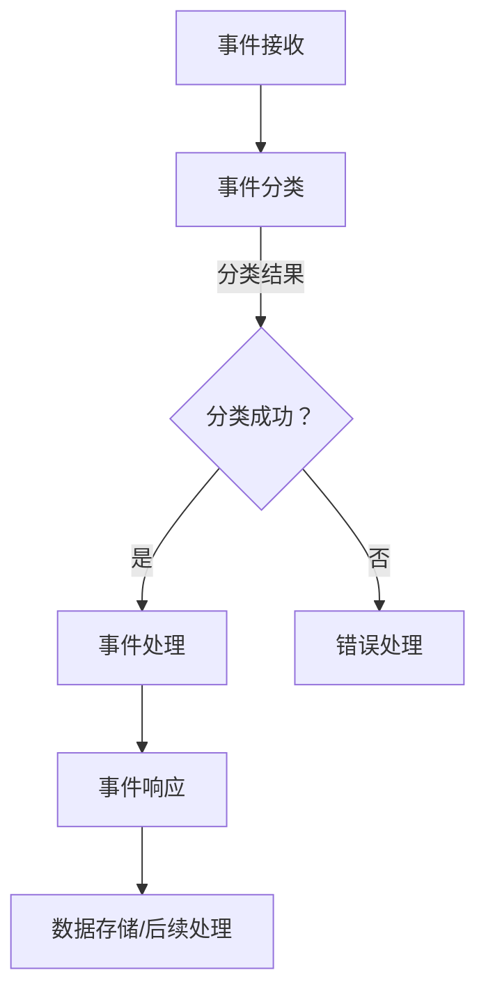
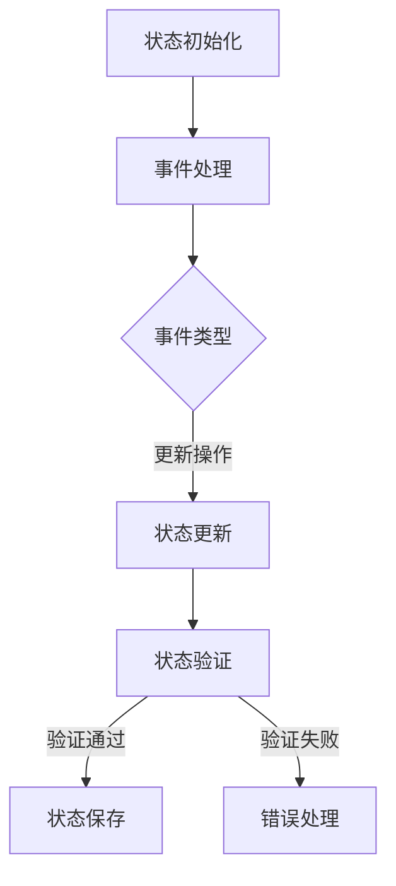
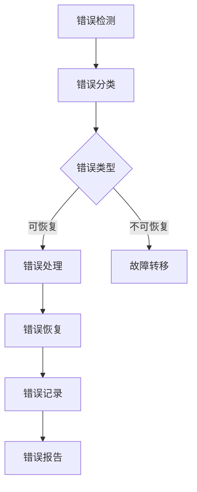

                 

### 引言

《响应式系统：构建弹性、韧性的分布式系统》旨在探讨如何在分布式系统中构建响应式系统，以实现更高的弹性和韧性。在当今的数字化时代，分布式系统已经成为许多关键业务应用程序的基础设施。然而，随着系统规模的不断扩大和复杂性的增加，如何确保系统在面临各种意外情况时能够稳定运行，成为了迫切需要解决的重要问题。

响应式系统是一种设计范式，它通过事件驱动和异步消息传递来处理系统中的变化。与传统同步阻塞模型相比，响应式系统具有更高的可扩展性和容错性。本文将从以下几个方面逐步深入探讨响应式系统的构建：

1. **背景介绍**：首先，我们将介绍响应式系统的定义、发展背景和重要性，并与分布式系统进行对比，以明确响应式系统的优势。
2. **核心概念与联系**：接着，我们将详细讲解响应式编程、事件驱动、分布式系统、弹性和韧性等核心概念，并通过表格和ER实体关系图展示它们之间的联系。
3. **算法原理讲解**：我们将分析响应式系统的算法原理，包括事件处理、状态管理和错误恢复，并使用mermaid流程图和Python源代码进行详细讲解。
4. **系统分析与架构设计**：我们将探讨响应式系统的设计原则，展示分布式系统的架构设计，并通过mermaid类图、架构图和序列图进行分析。
5. **项目实战**：通过实际项目案例，我们将展示如何构建响应式系统，并详细解读项目的核心实现和代码。
6. **最佳实践与拓展**：最后，我们将总结构建响应式系统的最佳实践，并提供一些注意事项和拓展阅读资源。

通过本文的逐步分析，您将了解如何设计和实现一个具有弹性、韧性的响应式分布式系统，为您的业务提供可靠的保障。在接下来的内容中，让我们一同深入探讨这一主题。

----------------------------------------------------------------

关键词：响应式系统、分布式系统、弹性、韧性、事件驱动

摘要：本文将详细探讨响应式系统的概念、优势及其在分布式系统中的应用。通过逐步分析核心概念、算法原理、系统设计与实战案例，帮助读者理解并掌握构建弹性、韧性的分布式系统的关键技术和方法。

----------------------------------------------------------------

# 第一部分：背景介绍

## 1.1 响应式系统的定义与发展

响应式系统（Reactive System）是一种设计范式，旨在应对分布式系统中不可预测的变化和大规模并发。它强调异步非阻塞的处理方式，通过事件驱动和流处理来提高系统的可扩展性和容错性。响应式系统最初由使用函数式编程语言和并发模型的研究人员提出，如Erlang和Scala。

响应式系统的概念可以追溯到20世纪80年代，当时分布式系统的需求逐渐增加，传统的同步阻塞模型（如进程间同步）面临着性能瓶颈和可靠性问题。为了解决这些问题，研究人员开始探索新的设计范式，即响应式编程。响应式编程的核心思想是将数据流和处理逻辑解耦，使系统能够高效地处理并发和不可预测的事件。

在过去的几十年里，随着互联网和云计算的发展，响应式系统的重要性日益凸显。现代的Web应用程序、移动应用、物联网（IoT）和大数据处理等领域，对实时响应和高效处理的需求越来越高。响应式系统为这些领域提供了可靠的技术解决方案，使其能够应对不断变化的环境和大规模的数据流。

### 问题背景与问题描述

随着系统规模的不断扩大和用户需求的多样化，分布式系统面临着越来越多的挑战。传统的同步阻塞模型在处理高并发场景时，往往会出现性能瓶颈，甚至可能导致系统崩溃。例如，在一个电商平台上，成千上万的用户同时访问系统，系统需要实时处理订单、库存更新和支付操作。如果使用传统的同步阻塞模型，服务器可能会因为无法同时处理大量请求而变得响应迟缓，甚至崩溃。

另一方面，分布式系统中的节点故障、网络分区和延迟等问题，也对系统的稳定性提出了严峻挑战。在传统的同步阻塞模型中，当一个节点发生故障时，整个系统可能会因为等待该节点的响应而停滞。这不仅会影响用户体验，还可能导致业务损失。

为了解决这些问题，响应式系统应运而生。它通过事件驱动和异步非阻塞的方式，提高了系统的可扩展性和容错性。在响应式系统中，系统不再主动等待每个节点的响应，而是通过消息队列和事件驱动机制来处理并发请求。这样，即使某个节点出现故障，系统也能够继续运行，并确保业务的连续性。

### 问题解决与边界与外延

响应式系统通过以下几个方面解决了分布式系统中的关键问题：

1. **事件驱动**：响应式系统采用事件驱动模型，将系统中的变化表示为事件。这些事件可以由内部操作触发，也可以由外部系统发送。事件驱动模型使系统能够异步处理并发请求，避免了同步阻塞带来的性能瓶颈。
2. **异步非阻塞**：响应式系统采用非阻塞IO，使系统能够同时处理多个请求，从而提高并发处理能力。在非阻塞IO中，系统不会因为等待某个操作完成而阻塞，而是继续处理其他请求，从而提高整体性能。
3. **弹性**：响应式系统具有弹性，能够自动适应系统负载的变化。当系统负载增加时，响应式系统能够自动扩展资源，确保系统的稳定性。当系统负载减少时，响应式系统能够释放多余的资源，避免资源浪费。
4. **容错性**：响应式系统具有容错性，能够自动检测和恢复节点故障。在响应式系统中，每个节点都是独立的，当一个节点发生故障时，其他节点可以继续处理请求，从而确保系统的稳定性。

然而，响应式系统也有其边界和局限性。首先，响应式系统在处理大量写操作时，可能会面临性能瓶颈。由于响应式系统采用事件驱动和异步非阻塞的方式，写操作可能会被延迟，从而导致系统性能下降。其次，响应式系统在处理高度依赖关系的操作时，可能需要额外的协调机制，以确保数据的一致性。

### 概念结构与核心要素组成

响应式系统的核心概念和结构包括以下几个方面：

1. **事件**：事件是响应式系统中的基本单元，表示系统中的变化。事件可以由内部操作触发，也可以由外部系统发送。事件驱动模型使系统能够异步处理并发请求。
2. **流处理**：流处理是响应式系统中的核心机制，用于处理连续的数据流。流处理使系统能够实时分析数据，并作出相应的响应。
3. **异步非阻塞**：异步非阻塞是响应式系统的关键特性，使系统能够同时处理多个请求，从而提高并发处理能力。
4. **弹性**：弹性是响应式系统的核心目标，使系统能够自动适应系统负载的变化。
5. **容错性**：容错性是响应式系统的关键特性，使系统能够自动检测和恢复节点故障。

通过这些核心概念和结构的组合，响应式系统能够提供高效、可靠和可扩展的分布式计算能力。

## 1.2 分布式系统的挑战与响应式系统的优势

分布式系统在现代计算环境中扮演着至关重要的角色，但随着其规模的不断扩大和复杂性的增加，分布式系统面临着诸多挑战。这些挑战主要包括节点故障、网络分区、延迟和并发控制等问题。

### 节点故障

分布式系统中的节点可能会因为硬件故障、软件错误或系统过载等原因导致故障。节点故障会导致部分系统的功能失效，从而影响整个系统的性能和可用性。在传统的同步阻塞模型中，当一个节点发生故障时，系统可能会因为等待该节点的响应而陷入停滞状态，导致整个系统崩溃。

### 网络分区

网络分区是指分布式系统中的节点因网络故障而无法互相通信。网络分区会导致系统的数据不一致性，从而影响系统的可用性和一致性。在传统的同步阻塞模型中，网络分区可能会使系统陷入部分节点可用、部分节点不可用的状态，从而导致系统无法正常工作。

### 延迟

分布式系统中的节点可能因为地理位置的远近、网络拥塞等原因导致延迟。延迟会影响系统的响应速度和用户体验。在传统的同步阻塞模型中，延迟可能导致系统处理请求的速度变慢，从而影响系统的性能。

### 并发控制

分布式系统中的多个节点可能同时访问同一资源，导致并发控制问题。在传统的同步阻塞模型中，并发控制通常通过锁机制实现，但锁机制可能导致死锁和性能下降。同时，锁机制在处理大量并发请求时，可能会使系统性能下降。

### 响应式系统的优势

为了解决分布式系统面临的这些挑战，响应式系统应运而生。响应式系统通过一系列设计原则和架构模式，提供了一种更加灵活、可靠和高效的方式来处理分布式系统中的问题。以下是响应式系统的几个主要优势：

1. **弹性**：响应式系统具有弹性，能够自动适应系统负载的变化。在响应式系统中，节点可以动态地加入和退出，从而提高系统的可用性和可扩展性。当系统负载增加时，响应式系统能够自动扩展资源，确保系统的稳定性。当系统负载减少时，响应式系统能够释放多余的资源，避免资源浪费。

2. **容错性**：响应式系统具有容错性，能够自动检测和恢复节点故障。在响应式系统中，每个节点都是独立的，当一个节点发生故障时，其他节点可以继续处理请求，从而确保系统的稳定性。此外，响应式系统还支持故障转移和备份机制，进一步提高了系统的容错性。

3. **高并发处理能力**：响应式系统通过异步非阻塞的方式，提高了系统的并发处理能力。在响应式系统中，系统可以同时处理多个请求，从而提高系统的性能和响应速度。同时，响应式系统还支持流处理，能够高效地处理大规模的数据流。

4. **一致性保证**：响应式系统通过分布式一致性协议，如Raft和Paxos，提供了强一致性和最终一致性保证。在响应式系统中，多个节点可以通过一致性协议确保数据的一致性，从而避免数据冲突和一致性问题。

5. **事件驱动**：响应式系统采用事件驱动模型，使系统能够高效地处理并发和不可预测的事件。在响应式系统中，事件可以由内部操作触发，也可以由外部系统发送。事件驱动模型使系统能够异步处理并发请求，避免了同步阻塞带来的性能瓶颈。

通过以上优势，响应式系统为分布式系统提供了一种更加可靠和高效的设计范式，能够更好地应对分布式系统面临的挑战。在接下来的内容中，我们将进一步探讨响应式编程、事件驱动、分布式系统、弹性和韧性等核心概念，并分析它们的联系。

## 1.3 响应式编程基础

响应式编程（Reactive Programming，简称RP）是一种编程范式，它通过数据流和异步操作，使得编程更加简洁、易于理解和维护。响应式编程的核心思想是数据的流动和变化，以及如何响应对数据的变更。与传统编程范式相比，响应式编程强调数据的动态性和并发性，能够更好地处理现代应用程序中的复杂性和不确定性。

### 响应式编程的核心概念

响应式编程的核心概念包括数据流、事件和异步操作。这些概念共同构建了一个强大的框架，使得编程能够适应变化并保持系统的响应性。

1. **数据流**：数据流是响应式编程中的核心概念，它表示数据在系统中的流动和变化。在响应式编程中，数据流被视为不可变的，这意味着一旦数据生成，就无法被修改。相反，新的数据流可以基于现有数据流创建，从而实现数据的变化和传递。

2. **事件**：事件是系统中发生的特定动作或变化，它可以触发响应。事件可以是用户交互、系统内部状态变化或外部事件（如网络消息）。在响应式编程中，事件通常由监听器（Listener）或观察者（Observer）接收和处理。

3. **异步操作**：异步操作是指不阻塞程序执行的操作。在响应式编程中，异步操作是处理并发请求和长时间运行任务的关键。通过异步操作，程序可以继续执行其他任务，而不必等待某个操作完成。这大大提高了程序的响应速度和可扩展性。

### 响应式编程与传统编程的比较

响应式编程与传统编程范式（如命令式编程）有显著的不同，主要体现在以下几个方面：

1. **数据流与状态**：在响应式编程中，数据流是动态的，可以独立于状态变化。而传统编程中，状态通常是通过变量或数据结构进行管理的，状态的变化往往会导致复杂的行为。

2. **异步与非阻塞**：响应式编程强调异步和非阻塞操作，这使得程序能够同时处理多个任务，提高了系统的并发性和响应能力。而传统编程范式通常依赖于同步操作，容易导致阻塞和性能问题。

3. **声明式与命令式**：响应式编程更接近声明式编程，程序员通过描述数据流和事件处理逻辑，系统自动处理背后的实现。而传统编程范式则是命令式编程，程序员需要详细指定每一步操作的顺序和细节。

4. **错误处理**：响应式编程提供了更自然的错误处理机制。在响应式编程中，错误通常被视为事件的一部分，可以由观察者进行处理。而传统编程中，错误处理往往需要通过异常处理机制，这可能导致代码复杂性增加。

### 响应式编程的应用场景

响应式编程特别适合处理以下应用场景：

1. **实时数据处理**：在实时数据处理中，数据流通常是动态的，响应式编程能够高效地处理连续的数据流，并实时响应数据的变化。

2. **用户界面编程**：在用户界面编程中，用户交互通常涉及到一系列的事件和状态变化。响应式编程能够轻松地处理这些动态变化，并提供更直观的用户体验。

3. **网络编程**：在网络编程中，响应式编程能够更好地处理异步的网络请求和响应，提高系统的并发性和响应速度。

4. **系统监控和告警**：在系统监控和告警中，响应式编程能够实时监测系统的状态变化，并自动触发相应的告警和处理逻辑。

### 响应式编程工具和框架

随着响应式编程的普及，许多编程语言和框架都支持响应式编程模型。以下是一些流行的响应式编程工具和框架：

1. **JavaScript**：JavaScript是响应式编程的典型代表，其Promises和async/await语法使得处理异步操作变得更加简便。

2. **Kotlin**：Kotlin通过Flow库提供了响应式编程的支持，Flow是一种基于数据流的异步编程模型。

3. **Akka**：Akka是一个基于Actor模型的响应式编程框架，提供了高并发和容错性的支持。

4. **RxJava**：RxJava是一个基于观察者模式的响应式编程库，用于处理异步事件流。

5. **RxJS**：RxJS是基于JavaScript的响应式编程库，用于处理异步事件流和实时数据处理。

通过上述介绍，我们可以看到响应式编程在处理动态数据和异步操作方面的优势，以及它在现代分布式系统中的应用价值。在下一部分中，我们将进一步探讨事件驱动架构的概念，并分析其与响应式编程的关系。

## 1.4 响应式编程与事件驱动

在深入探讨响应式编程时，我们需要了解事件驱动（Event-Driven）架构的概念，并探讨它们之间的联系。事件驱动架构是一种系统设计范式，其中系统的行为是由外部或内部事件触发的。事件可以理解为系统中的特定动作或变化，而事件驱动架构的核心在于如何高效地处理这些事件，并相应地更新系统的状态。

### 事件驱动架构的基本概念

事件驱动架构（Event-Driven Architecture，简称EDA）是一种系统设计模式，它将系统的行为分解为一系列事件和事件处理器。在事件驱动架构中，系统的各个组件（通常称为事件源和事件处理器）通过事件进行通信。事件源生成事件，并将它们传递给适当的事件处理器，事件处理器根据事件的类型和内容执行相应的操作。

事件驱动架构的关键特征包括：

1. **异步通信**：事件驱动架构通常采用异步通信机制，使得系统组件可以独立运行，并能够同时处理多个事件。这有助于提高系统的并发性和响应速度。

2. **解耦**：事件驱动架构通过事件将系统组件解耦。每个组件只负责处理特定类型的事件，不需要了解其他组件的内部实现。这种解耦有助于提高系统的可维护性和可扩展性。

3. **灵活性**：事件驱动架构使得系统可以根据需求动态地添加、修改和删除事件处理器，从而提高系统的灵活性。

4. **可重用性**：事件驱动架构中的事件处理器通常是独立的，可以重用和复用在不同的系统中。

### 响应式编程与事件驱动的关系

响应式编程和事件驱动架构有着密切的联系。事实上，响应式编程可以视为一种特定类型的事件驱动架构，其核心在于处理异步事件流。响应式编程中的数据流和事件流具有类似的特性，即它们都是动态的、不可变的，并且可以基于现有数据流或事件流生成新的数据流或事件流。

以下是响应式编程与事件驱动架构之间的几个关键关系：

1. **数据流与事件流**：在响应式编程中，数据流和事件流是核心概念。数据流表示数据的流动和变化，事件流则表示系统中的特定动作或变化。事件驱动架构同样强调事件流，将系统行为分解为一系列事件和事件处理器。

2. **异步处理**：响应式编程强调异步处理，使得系统能够高效地处理并发事件。事件驱动架构也采用异步通信机制，以避免组件之间的阻塞，从而提高系统的并发性和性能。

3. **事件处理器**：在事件驱动架构中，事件处理器负责处理特定类型的事件。在响应式编程中，事件处理器通常被称为观察者（Observer）或订阅者（Subscriber），它们根据事件的类型和内容执行相应的操作。

4. **流处理**：响应式编程中的流处理机制与事件驱动架构中的事件流处理有相似之处。流处理允许系统实时分析和处理数据流，而事件流处理则允许系统实时响应事件。

通过上述关系，我们可以看到响应式编程和事件驱动架构之间的紧密联系。响应式编程为事件驱动架构提供了一种更高级的抽象，使得系统能够更灵活、高效地处理动态数据和异步事件。

### 响应式编程与事件驱动在实际应用中的差异

虽然响应式编程和事件驱动架构有诸多相似之处，但在实际应用中，它们也有一定的差异：

1. **抽象层次**：事件驱动架构通常关注事件流和事件处理器的组织和管理，而响应式编程则提供了更高层次的抽象，如数据流和操作符（Operator）。响应式编程使得事件流处理更加简洁和易于理解。

2. **性能**：事件驱动架构在处理大规模事件流时，可能会面临性能挑战，如事件堆积和处理延迟。响应式编程通过内置的异步和非阻塞机制，能够在一定程度上缓解这些性能问题。

3. **编程模型**：响应式编程提供了声明式编程模型，使得程序员能够更专注于业务逻辑，而事件驱动架构通常采用命令式编程模型，需要程序员详细指定每个事件的处理流程。

通过以上分析，我们可以更好地理解响应式编程和事件驱动架构的概念、关系以及在实际应用中的差异。在下一部分中，我们将进一步探讨分布式系统的概念，以及响应式系统如何为分布式系统带来弹性和韧性。

## 1.5 弹性与韧性：概念与重要性

弹性（Resilience）和韧性（Tolerance）是响应式系统设计中至关重要的概念，它们共同决定了系统在面对各种意外情况时的表现。弹性指的是系统在面临负载变化、节点故障、网络延迟等异常情况时，能够自动调整和恢复的能力，从而确保系统的持续运行。韧性则是指系统在面对恶意攻击、软件故障、硬件失效等极端情况时，能够保持稳定运行的能力。

### 弹性的定义与重要性

弹性是响应式系统的一个核心目标，它使得系统能够在面临负载高峰、资源不足或其他压力时，自动调整自身以维持性能和稳定性。具体来说，弹性包括以下几个方面：

1. **自动扩展**：弹性系统能够根据当前负载自动扩展资源，如增加服务器实例、调整缓存容量等，以应对突发的流量。
2. **负载均衡**：弹性系统能够通过负载均衡器，将请求分配到多个节点上，避免单个节点过载。
3. **故障检测与恢复**：弹性系统能够自动检测节点故障，并迅速将其从集群中移除，同时启动备用节点，确保服务的连续性。

在分布式系统中，弹性至关重要。它不仅能够提高系统的可用性，还能够降低维护成本和业务风险。例如，在电商平台中，弹性系统能够在“双十一”等购物节日期间，自动扩展资源，确保用户能够顺畅地进行购物，从而避免系统崩溃导致业务损失。

### 韧性的定义与重要性

韧性是指系统在面对恶意攻击、软件故障、硬件失效等极端情况时，能够保持稳定运行的能力。韧性通常包括以下几个方面：

1. **故障隔离**：韧性系统能够在发生故障时，将影响隔离在特定的节点或组件上，避免故障扩散。
2. **故障恢复**：韧性系统能够在故障发生后，自动恢复到正常状态，确保服务的连续性。
3. **安全防护**：韧性系统能够抵御各种恶意攻击，如DDoS攻击、SQL注入等，确保系统的安全。

韧性在分布式系统中同样至关重要。它能够提高系统的安全性和可靠性，确保在面对恶意攻击和意外故障时，系统能够保持正常运行。例如，在金融交易系统中，韧性系统能够在遭受网络攻击或硬件故障时，确保交易数据的完整性和交易流程的连续性，从而避免金融风险。

### 弹性与韧性的联系与区别

弹性与韧性是相互关联但又有区别的两个概念。弹性主要关注系统在面对正常负载波动和故障时的响应能力，而韧性则关注系统在面对恶意攻击和极端故障时的生存能力。

1. **联系**：弹性是韧性的一部分。一个具有韧性的系统必然具备弹性，能够在正常情况下保持稳定运行。而一个具有弹性的系统，通过良好的设计和技术手段，也能够在一定程度上提高其韧性。

2. **区别**：韧性的范围更广，不仅包括弹性，还包括对恶意攻击、软件故障、硬件失效等极端情况的应对能力。弹性更侧重于系统在正常条件下的表现，而韧性则涵盖了系统在所有情况下的稳定性和可靠性。

### 响应式系统与弹性、韧性

响应式系统通过其事件驱动和异步非阻塞的特性，为构建弹性和韧性的分布式系统提供了基础。响应式系统的关键特性，如自动扩展、负载均衡、故障检测与恢复，以及高并发处理能力，使得系统能够在面临各种意外情况时保持稳定运行。

例如，在响应式系统中，通过消息队列和事件驱动机制，系统能够实现任务的异步处理，避免了同步阻塞带来的性能瓶颈。当系统面临高负载时，响应式系统能够自动扩展资源，确保服务的连续性。同时，响应式系统通过分布式一致性协议，如Raft和Paxos，提供了强一致性和最终一致性保证，增强了系统的韧性。

通过以上分析，我们可以看到弹性与韧性在分布式系统中的重要性，以及响应式系统如何通过其设计原则和架构模式，为系统提供弹性和韧性。在接下来的部分中，我们将进一步探讨响应式系统的核心概念，以及如何构建具备弹性和韧性的分布式系统。

## 1.6 响应式系统的核心概念

响应式系统的核心在于其设计原则和架构模式，这些原则和模式共同确保系统在面对动态变化和大规模并发时，能够保持高性能和高可靠性。以下是响应式系统的几个关键概念：

### 事件驱动

事件驱动是响应式系统的基本设计原则，它通过处理事件来响应系统的变化。在事件驱动架构中，系统的行为不是由预先编写的指令序列控制的，而是由外部或内部事件触发的。这些事件可以是用户操作、系统内部状态变化或来自其他系统的消息。

事件驱动模型具有以下优点：

1. **异步非阻塞**：事件驱动模型通过异步处理事件，避免了同步阻塞，使得系统可以同时处理多个并发请求，从而提高系统的并发性和响应速度。
2. **解耦**：事件驱动模型使得系统的各个组件可以独立运行，减少了组件之间的依赖性，提高了系统的可维护性和可扩展性。
3. **灵活性和可预测性**：事件驱动模型使得系统能够根据实际需求灵活调整行为，并能够更好地预测和处理未来的变化。

### 异步非阻塞

异步非阻塞是响应式系统的另一个重要设计原则。在异步非阻塞模型中，操作不是同步执行的，而是通过回调函数或其他异步机制来通知操作的结果。这意味着系统在执行一个操作时，不会等待该操作完成，而是继续执行其他操作，从而提高系统的并发性和性能。

异步非阻塞模型具有以下优点：

1. **高性能**：通过避免同步阻塞，系统可以同时处理更多的请求，从而提高整体性能。
2. **可扩展性**：异步非阻塞模型使得系统能够更轻松地扩展，因为每个操作都可以独立执行，不会因为某个操作的性能瓶颈而影响整个系统。
3. **易维护性**：异步非阻塞模型使得代码更加简洁，减少了复杂性，提高了代码的可维护性。

### 数据流

数据流是响应式系统中的一个核心概念，它表示数据在系统中的流动和变化。在响应式系统中，数据流被视为不可变的，这意味着一旦数据生成，就无法被修改。相反，新的数据流可以基于现有数据流创建，从而实现数据的变化和传递。

数据流模型具有以下优点：

1. **不可变性**：数据的不可变性使得数据流更加可靠，减少了数据一致性问题。
2. **可组合性**：通过组合现有的数据流，可以创建新的数据流，从而实现复杂的业务逻辑。
3. **易测试性**：由于数据流是静态的，因此更容易进行单元测试和集成测试。

### 流处理

流处理是响应式系统中用于处理连续数据流的一种机制。流处理使得系统能够实时分析数据，并作出相应的响应。在流处理中，数据被视为一系列的事件或流，系统通过处理这些事件或流来提取有价值的信息或执行相应的操作。

流处理模型具有以下优点：

1. **实时性**：流处理使得系统能够实时处理数据，从而提供更快的响应和更准确的分析。
2. **可扩展性**：流处理系统可以轻松处理大规模的数据流，通过水平扩展来提高性能。
3. **容错性**：流处理系统通常具有高容错性，可以在处理过程中自动检测和恢复错误。

### 弹性

弹性是响应式系统的核心目标之一，它使得系统能够在面临负载变化、节点故障或其他异常情况时，自动调整和恢复，从而保持稳定运行。弹性包括以下方面：

1. **自动扩展**：系统可以根据当前负载自动调整资源，如增加服务器实例、调整缓存容量等。
2. **负载均衡**：系统通过负载均衡器，将请求分配到多个节点上，避免单个节点过载。
3. **故障检测与恢复**：系统可以自动检测节点故障，并迅速将其从集群中移除，同时启动备用节点，确保服务的连续性。

### 容错性

容错性是响应式系统的另一个重要目标，它使得系统能够在面临恶意攻击、软件故障、硬件失效等极端情况时，保持稳定运行。容错性包括以下方面：

1. **故障隔离**：系统在发生故障时，能够将影响隔离在特定的节点或组件上，避免故障扩散。
2. **故障恢复**：系统在故障发生后，能够自动恢复到正常状态，确保服务的连续性。
3. **安全防护**：系统能够抵御各种恶意攻击，如DDoS攻击、SQL注入等，确保系统的安全。

### 总结

响应式系统的核心概念包括事件驱动、异步非阻塞、数据流、流处理、弹性和容错性。这些概念共同构成了响应式系统的设计原则和架构模式，使得系统能够在面对动态变化和大规模并发时，保持高性能和高可靠性。在接下来的章节中，我们将进一步探讨响应式系统的算法原理、系统分析与架构设计，以及通过实际项目案例来展示如何构建响应式系统。

## 1.7 分布式系统的挑战与响应式系统的应对策略

分布式系统在现代计算环境中发挥着至关重要的作用，但同时也面临着一系列独特的挑战。这些挑战主要包括节点故障、网络分区、延迟和并发控制等问题。响应式系统通过其独特的设计原则和架构模式，提供了一系列有效的应对策略，使得系统能够在面对这些挑战时保持高性能和高可靠性。

### 节点故障

节点故障是分布式系统中最为常见的问题之一。当系统中的某个节点发生故障时，它可能导致该节点的任务无法完成，从而影响整个系统的稳定性。响应式系统通过以下策略来应对节点故障：

1. **自动检测与恢复**：响应式系统通常会实现自动故障检测机制，例如通过心跳检测、状态报告等方式，及时发现故障节点。在检测到节点故障后，系统会自动将任务迁移到其他健康节点，确保任务的持续执行。
2. **备份与冗余**：响应式系统会通过备份和冗余策略来提高系统的容错性。例如，在分布式数据库中，数据通常会备份在多个节点上，当某个节点发生故障时，其他节点可以继续提供服务。
3. **故障隔离**：响应式系统在设计时，会尽量将节点故障的影响隔离在特定的组件或节点上，避免故障扩散。例如，通过独立的集群管理和隔离机制，确保单个节点的故障不会影响整个系统的运行。

### 网络分区

网络分区是指分布式系统中的节点因网络故障而无法互相通信。网络分区会导致系统的数据不一致性和可用性问题，从而影响系统的稳定性。响应式系统通过以下策略来应对网络分区：

1. **一致性协议**：响应式系统通常会采用分布式一致性协议，如Raft和Paxos，来确保在面临网络分区时，系统能够达到一致性。这些协议通过一系列机制，如选举主节点、日志复制等，确保在多个副本之间保持数据的一致性。
2. **分区容忍性**：响应式系统设计时会考虑分区容忍性，即系统能够在部分节点不可达的情况下继续运行。通过设计冗余的节点和路径，响应式系统能够在面临网络分区时，仍然保证服务的可用性。
3. **动态调整**：响应式系统通常会实现动态调整机制，当检测到网络分区时，系统能够自动调整节点间的通信路径，确保数据的可靠传输。

### 延迟

分布式系统中的节点可能因为地理位置的远近、网络拥塞等原因导致延迟。延迟会影响系统的响应速度和用户体验，特别是在需要实时处理的高并发场景中。响应式系统通过以下策略来应对延迟：

1. **异步非阻塞**：响应式系统采用异步非阻塞的处理方式，使得系统在处理请求时，可以同时处理多个任务，从而提高系统的并发性和响应速度。通过异步处理，系统可以在等待某个操作完成时，继续处理其他任务，减少等待时间。
2. **负载均衡**：响应式系统通常会采用负载均衡器，将请求分配到多个节点上，避免单个节点过载。通过负载均衡，系统能够充分利用网络带宽和计算资源，减少延迟。
3. **缓存与预取**：响应式系统会利用缓存和预取技术，提前获取可能需要的数据，从而减少数据的访问延迟。通过预取，系统可以提前加载即将需要的数据，减少实际访问时间。

### 并发控制

分布式系统中的多个节点可能同时访问同一资源，导致并发控制问题。并发控制不当可能导致数据不一致性和死锁等问题。响应式系统通过以下策略来应对并发控制：

1. **锁机制**：响应式系统通常会采用分布式锁机制，如分布式锁服务（Distributed Lock Service），来控制对共享资源的访问。通过分布式锁，系统能够确保在多个节点之间对共享资源进行正确的同步。
2. **最终一致性**：响应式系统通常会采用最终一致性模型，而不是强一致性模型。通过最终一致性，系统允许在短时间内出现数据不一致性，但最终会达到一致性。这种方式减少了锁机制的使用，提高了系统的并发性和性能。
3. **乐观并发控制**：响应式系统会采用乐观并发控制（Optimistic Concurrency Control，OCC）机制，允许在操作开始时就执行，并在操作完成时检查冲突。如果检测到冲突，系统会重试操作。这种方式减少了锁的使用，提高了系统的并发性。

通过以上策略，响应式系统能够有效地应对分布式系统中面临的节点故障、网络分区、延迟和并发控制等挑战。在接下来的章节中，我们将进一步探讨响应式系统的算法原理，以及如何通过具体的设计和实践来构建一个具有弹性和韧性的分布式系统。

## 1.8 小结

在第一部分的探讨中，我们首先介绍了响应式系统的定义、发展背景和重要性，并与分布式系统进行了对比，强调了响应式系统的优势。接着，我们详细讲解了响应式编程、事件驱动、分布式系统、弹性和韧性等核心概念，并通过表格和ER实体关系图展示了它们之间的联系。最后，我们分析了响应式系统在应对分布式系统挑战时的策略，包括节点故障、网络分区、延迟和并发控制。

通过这一部分的介绍，读者应该对响应式系统的基本概念和优势有了更深入的了解。接下来，我们将进一步探讨响应式系统的算法原理，包括事件处理、状态管理和错误恢复，通过具体的算法流程图和数学模型，帮助读者理解响应式系统的工作机制。

## 1.9 第二部分：核心原理与联系

### 2.1 响应式编程原理

响应式编程是一种处理异步数据流和事件的编程范式，其核心思想是通过数据流和事件流来描述系统的动态行为。响应式编程通过一系列的响应操作，如订阅（Subscribe）、过滤（Filter）、映射（Map）和合并（Merge）等，实现对数据流的处理和变换。以下是对响应式编程原理的详细解释：

#### 数据流与事件流

数据流和事件流是响应式编程的两个核心概念。数据流表示数据的传递和变换过程，而事件流表示系统中发生的各种事件。在响应式编程中，数据流是异步的，这意味着数据处理操作不会阻塞，从而提高系统的并发性和响应速度。

1. **数据流**：数据流是一种连续的数据传递方式，可以包含一个或多个数据元素。数据流可以是无限的，也可以是有限的。在数据流中，每个数据元素都是不可变的，这意味着一旦数据生成，就不能被修改。新的数据流可以基于现有数据流创建，从而实现数据的连续传递和变换。

2. **事件流**：事件流是一种异步的事件传递方式，表示系统中发生的各种事件。事件可以由用户操作、系统内部状态变化或其他外部系统触发。在响应式编程中，事件流通过订阅（Subscribe）机制，将事件传递给相应的处理函数。

#### 响应操作

响应式编程提供了一系列的响应操作，用于处理数据流和事件流。这些响应操作包括：

1. **订阅（Subscribe）**：订阅操作用于监听数据流或事件流，当数据流或事件流发生变化时，触发相应的处理函数。

2. **过滤（Filter）**：过滤操作用于筛选数据流中的元素，只有满足条件的元素才会传递给后续的处理函数。

3. **映射（Map）**：映射操作用于对数据流中的元素进行变换，生成新的数据流。

4. **合并（Merge）**：合并操作用于将多个数据流合并为一个数据流。

5. **合并（Combine）**：合并操作用于将多个数据流合并为一个数据流，并进行聚合操作。

#### 例子

以下是一个简单的响应式编程例子，展示了如何使用数据流和事件流处理数据：

```python
import rx

# 创建一个数据流
data_stream = rx.Subject()

# 订阅数据流
data_stream.subscribe(
    on_next=lambda x: print(f"Received data: {x}"),
    on_error=lambda e: print(f"Error: {e}"),
    on_completed=lambda: print("Data stream completed")
)

# 发送数据到数据流
data_stream.on_next(1)
data_stream.on_next(2)
data_stream.on_next(3)

# 处理数据流完成事件
data_stream.on_completed()

# 创建一个事件流
event_stream = rx.Subject()

# 订阅事件流
event_stream.subscribe(
    on_next=lambda x: print(f"Received event: {x}"),
    on_error=lambda e: print(f"Error: {e}"),
    on_completed=lambda: print("Event stream completed")
)

# 发送事件到事件流
event_stream.on_next("start")
event_stream.on_next("stop")
event_stream.on_completed()
```

在这个例子中，我们创建了一个数据流和一个事件流。数据流通过`on_next`方法发送数据，事件流通过`on_next`方法发送事件。我们分别订阅了数据流和事件流，并在相应的处理函数中打印接收到的数据和事件。

#### 结论

响应式编程通过数据流和事件流，提供了处理异步数据和事件的高效方式。通过订阅、过滤、映射和合并等响应操作，响应式编程使得系统能够灵活地处理动态变化和大规模并发。在接下来的部分中，我们将进一步探讨事件驱动架构，并分析其与响应式编程的关系。

### 2.2 事件驱动架构

事件驱动架构（Event-Driven Architecture，简称EDA）是一种设计模式，其中系统的行为是由外部或内部事件触发的。事件驱动架构通过事件来组织和管理系统的行为，使得系统具有更好的可扩展性和可维护性。以下是对事件驱动架构的详细解释：

#### 基本概念

1. **事件**：事件是系统中发生的特定动作或变化，可以是用户交互、系统内部状态变化或来自其他系统的消息。事件可以由事件源（Event Source）生成，也可以由事件处理器（Event Handler）处理。

2. **事件源**：事件源是生成事件的组件，可以是用户界面、设备传感器或其他系统。事件源将事件传递给事件处理器，以触发相应的响应。

3. **事件处理器**：事件处理器是负责处理事件的组件，根据事件的类型和内容执行相应的操作。事件处理器可以是单独的函数、类或组件。

4. **事件总线**：事件总线是负责传输事件的组件，类似于一个中介，将事件从事件源传递给事件处理器。事件总线通常支持异步传输和分布式处理。

#### 基本结构

事件驱动架构的基本结构包括以下几个部分：

1. **事件源**：事件源生成事件，并将其传递给事件总线。

2. **事件总线**：事件总线负责传输事件，将其传递给适当的事件处理器。

3. **事件处理器**：事件处理器根据事件的类型和内容执行相应的操作，并可能生成新的事件。

4. **事件流**：事件驱动架构中的事件流表示事件在系统中的传递和处理过程。事件流可以是线性的，也可以是复杂的网络结构。

#### 优点

事件驱动架构具有以下优点：

1. **解耦**：事件驱动架构通过事件来传递信息，减少了组件之间的依赖性，提高了系统的可维护性和可扩展性。

2. **灵活性和可重用性**：事件驱动架构使得系统组件可以独立开发、测试和部署，提高了系统的灵活性和可重用性。

3. **异步处理**：事件驱动架构支持异步处理，使得系统能够同时处理多个事件，提高了系统的并发性和响应速度。

4. **事件流处理**：事件驱动架构支持事件流处理，使得系统能够实时分析和处理事件流，从而实现复杂的业务逻辑。

#### 例子

以下是一个简单的事件驱动架构例子：

```python
# 事件源
class EventSource:
    def generate_event(self):
        event = "用户点击按钮"
        self._event_bus.post(event)

# 事件总线
class EventBus:
    def __init__(self):
        self._handlers = []

    def post(self, event):
        for handler in self._handlers:
            handler(event)

    def register_handler(self, handler):
        self._handlers.append(handler)

# 事件处理器
class ClickHandler:
    def handle(self, event):
        print(f"事件处理：{event}")

# 测试
event_bus = EventBus()
event_bus.register_handler(ClickHandler())

event_source = EventSource()
event_source.generate_event()
```

在这个例子中，我们创建了一个事件源`EventSource`，它生成一个点击事件，并将其传递给事件总线`EventBus`。事件总线`EventBus`负责将事件传递给注册的事件处理器`ClickHandler`，并打印事件内容。

#### 结论

事件驱动架构通过事件来组织和管理系统的行为，提高了系统的可扩展性和可维护性。在响应式系统中，事件驱动架构是一种重要的设计模式，它与响应式编程紧密结合，共同构建了一个高效、灵活和可扩展的分布式系统。在接下来的部分中，我们将进一步探讨分布式系统与响应式系统的关系，并分析它们的联系。

### 2.3 分布式系统与响应式系统的关系

分布式系统（Distributed System）和响应式系统（Reactive System）是现代计算机体系结构中的两个重要概念，它们各自独立却又紧密相关。理解这两者之间的关系对于设计高效、可靠和可扩展的分布式系统至关重要。

#### 分布式系统概述

分布式系统是由多个独立计算机节点组成的系统，这些节点通过网络连接，共同完成一个任务。分布式系统的关键特点是：

1. **位置透明性**：用户和应用程序不需要知道数据或计算任务的具体位置，只需通过统一的接口进行访问。
2. **容错性**：系统能够在节点失效时继续运行，通过冗余和备份机制确保服务的连续性。
3. **可扩展性**：系统能够通过增加节点来水平扩展，以处理更大的负载。

#### 响应式系统概述

响应式系统是一种设计范式，它强调异步非阻塞的处理方式，通过事件驱动和流处理来处理系统中的变化。响应式系统的关键特点是：

1. **异步非阻塞**：系统通过异步操作来处理并发请求，避免了同步阻塞带来的性能瓶颈。
2. **弹性**：系统能够自动扩展和调整资源，以应对负载的变化。
3. **容错性**：系统能够检测和恢复故障，确保服务的连续性。

#### 关系分析

分布式系统与响应式系统之间的关系可以从以下几个方面进行分析：

1. **基础架构**：分布式系统提供了响应式系统运行的基础设施。分布式系统的位置透明性、容错性和可扩展性等特点，为响应式系统的设计和实现提供了必要的支持。

2. **设计范式**：响应式系统是一种设计范式，它指导分布式系统的构建。通过采用响应式系统设计原则，分布式系统能够更好地应对动态变化和大规模并发，提高系统的可靠性和性能。

3. **处理模型**：响应式系统采用事件驱动和异步非阻塞的处理模型，这与分布式系统的并发处理需求相契合。在分布式系统中，响应式系统能够更高效地处理并发请求和数据流。

4. **弹性与韧性**：分布式系统的容错性和响应式系统的弹性共同构建了一个具备高弹性、韧性的系统。在分布式系统中，响应式系统能够通过自动扩展和故障恢复，确保服务的连续性和稳定性。

#### 案例分析

以一个电子商务平台为例，分布式系统通过多个服务器节点和数据库集群来处理海量订单和用户请求。响应式系统通过事件驱动和异步非阻塞的方式，实现了对订单处理的实时响应和动态调整。具体分析如下：

1. **订单处理**：用户下单后，订单信息通过分布式系统传递到订单处理模块。响应式系统通过异步处理订单请求，避免了同步阻塞，提高了系统的并发处理能力。

2. **库存管理**：在处理订单时，系统需要实时检查库存。响应式系统通过流处理机制，实时监控库存变化，并在库存不足时自动触发采购流程。

3. **故障恢复**：当订单处理节点发生故障时，响应式系统能够自动检测并切换到备用节点，确保订单处理不受影响。

4. **弹性扩展**：在“双十一”等高峰期，响应式系统能够自动扩展资源，如增加服务器实例和缓存容量，以应对突发流量，保持系统稳定运行。

#### 结论

分布式系统与响应式系统相互依赖，共同构建了一个高效、可靠和可扩展的分布式计算环境。通过结合分布式系统的位置透明性、容错性和可扩展性，以及响应式系统的异步非阻塞、弹性和韧性，我们能够设计出具备高性能和高可靠性的现代分布式系统。在接下来的部分中，我们将深入探讨响应式系统的算法原理，包括事件处理、状态管理和错误恢复，并通过具体的算法流程图和数学模型进行详细分析。

### 2.4 弹性与韧性：对比与联系

弹性（Resilience）和韧性（Tolerance）是现代系统设计中至关重要的两个概念，它们分别代表了系统在面对不同类型异常情况时的应对能力。弹性主要关注系统在正常运营条件下如何应对负载波动和资源变化，而韧性则侧重于系统在极端故障和灾难性事件中如何保持正常运行。

#### 弹性的定义与特征

弹性是指系统在面对正常负载变化和资源约束时，能够自动调整自身配置和资源分配，以维持其稳定性和性能。弹性的特征包括：

1. **自动扩展与缩放**：系统能够根据当前负载自动增加或减少资源，如增加服务器实例、调整缓存大小等。

2. **负载均衡**：系统通过负载均衡器将请求分配到多个节点上，避免单个节点过载，从而提高整体性能。

3. **故障隔离与恢复**：系统能够检测和隔离故障节点，并在必要时自动切换到备用节点，确保服务的连续性。

4. **资源的动态调整**：系统可以根据实时负载动态调整资源使用策略，如在流量高峰期增加计算资源，在负载下降时释放资源。

#### 韧性的定义与特征

韧性是指系统在面对恶意攻击、软件故障、硬件失效等极端情况时，能够保持稳定运行的能力。韧性的特征包括：

1. **故障检测与恢复**：系统能够及时发现和响应故障，包括软件错误、硬件故障和网络中断等，并自动恢复到正常状态。

2. **容错机制**：系统通过冗余设计、备份和复制等机制，确保在部分组件或节点失效时，整体系统仍然能够正常运行。

3. **攻击防护**：系统具备抵御恶意攻击（如DDoS攻击、SQL注入等）的能力，通过防火墙、加密、安全审计等手段提高系统的安全性。

4. **持续运行**：即使系统部分组件或节点发生故障，系统仍能保持关键功能的正常运行，确保服务的可用性。

#### 弹性与韧性的对比

弹性与韧性虽然都是系统应对异常情况的能力，但它们针对的问题和应对策略有所不同：

1. **问题类型**：
   - 弹性：主要应对正常的负载波动、资源变化和短暂的故障。
   - 韧性：主要应对恶意攻击、硬件故障、软件错误等极端情况。

2. **应对策略**：
   - 弹性：通过自动扩展、负载均衡、故障检测与恢复等技术手段，提高系统的稳定性和性能。
   - 韧性：通过冗余设计、备份、容错机制、攻击防护等手段，确保系统在面对极端情况时能够持续运行。

3. **目标**：
   - 弹性：提高系统的可扩展性和响应速度，确保在正常运营条件下性能最优。
   - 韧性：确保系统在面对极端事件时能够保持关键功能的正常运行，提高系统的可用性和可靠性。

#### 弹性与韧性在实际应用中的联系

在实际应用中，弹性与韧性通常是相互结合的。一个具有弹性的系统通常也具备一定的韧性，因为自动扩展和负载均衡等技术可以提高系统的容错性和可靠性。同样，一个具有韧性的系统通常也需要具备弹性，以确保在极端事件发生时能够迅速恢复并继续运行。

例如，在电商平台上，弹性系统能够在促销期间自动扩展资源，确保用户能够顺畅地进行购物。而韧性系统则能够应对突发的恶意攻击，确保平台的关键功能如支付系统不受影响。

#### 案例分析

以一个云服务提供商为例，该提供商需要同时实现弹性和韧性：

1. **弹性**：在客户需求增加时，系统会自动扩展计算资源，确保服务器的响应速度和吞吐量不受影响。在需求下降时，系统会释放多余资源，以降低成本。

2. **韧性**：系统通过冗余设计，确保关键服务（如数据库）在单个节点故障时能够自动切换到备用节点。同时，系统还通过安全防护措施，抵御恶意攻击，确保服务的安全性和稳定性。

#### 结论

弹性与韧性是现代系统设计中不可或缺的两个方面。通过结合弹性和韧性，系统不仅能够在正常运营条件下保持高性能和稳定性，还能够在面对极端事件时保持关键功能的正常运行。在接下来的部分中，我们将深入探讨响应式系统的算法原理，包括事件处理、状态管理和错误恢复，并使用mermaid流程图和Python源代码进行详细讲解。

### 2.5 算法原理讲解

响应式系统中的算法原理是其高效、可靠运行的核心。以下我们将详细讲解响应式系统中的三个关键算法原理：事件处理、状态管理和错误恢复。

#### 事件处理算法

事件处理是响应式系统中的核心任务，涉及如何接收、处理和响应事件。事件处理算法通常包括以下步骤：

1. **事件接收**：系统通过事件监听器接收来自不同来源的事件。事件监听器可以是异步的，确保系统可以同时处理多个事件。

2. **事件分类**：根据事件的类型，系统将事件分类到不同的处理队列中。这样可以确保每个事件都能被快速定位和处理。

3. **事件处理**：系统使用事件处理器对事件进行具体处理。事件处理器可以是函数、类或模块，根据事件的类型和内容执行相应的操作。

4. **事件响应**：事件处理器在完成处理后，生成相应的响应事件或结果，并将其传递给后续的处理链或写入数据存储。

以下是一个使用mermaid绘制的简单事件处理流程图：



#### 状态管理算法

状态管理是响应式系统中另一个关键环节，确保系统在处理事件过程中保持正确的状态。状态管理算法通常涉及以下步骤：

1. **状态初始化**：系统初始化时，为每个组件或模块设置初始状态。

2. **状态更新**：在处理事件时，系统根据事件类型和内容更新当前状态。状态更新可以是原子操作，确保状态的一致性。

3. **状态验证**：在状态更新后，系统对状态进行验证，确保状态符合预期的规则和约束。

4. **状态保存**：系统将更新后的状态保存到持久化存储中，如数据库或缓存，以供后续使用。

以下是一个使用mermaid绘制的简单状态管理流程图：



#### 错误恢复算法

错误恢复是响应式系统中的关键机制，确保系统在遇到异常或故障时能够恢复到正常状态。错误恢复算法通常涉及以下步骤：

1. **错误检测**：系统通过监控和日志分析，及时发现异常情况，如程序错误、节点故障等。

2. **错误分类**：根据错误的类型和严重程度，系统将错误分类到不同的处理队列中。

3. **错误处理**：系统使用错误处理器对错误进行具体处理。错误处理器可以是自动化的脚本、人工干预的流程或组合。

4. **错误恢复**：在错误处理完成后，系统尝试恢复到正常状态，如重启节点、重试操作等。

5. **错误记录与报告**：系统记录错误信息和恢复过程，并向相关人员进行报告，以便后续分析和改进。

以下是一个使用mermaid绘制的简单错误恢复流程图：



#### 算法原理的数学模型与公式

在响应式系统中，算法原理往往需要使用数学模型和公式进行描述，以便于分析和优化。以下是一些常见的数学模型和公式：

1. **事件处理速率**：事件处理速率（R）是单位时间内系统能够处理的事件数量。其公式为：

   $$ R = \frac{N}{T} $$

   其中，N是单位时间内接收的事件数量，T是单位时间。

2. **状态更新率**：状态更新率（S）是单位时间内状态更新的次数。其公式为：

   $$ S = \frac{U}{T} $$

   其中，U是单位时间内更新的状态数量，T是单位时间。

3. **错误恢复时间**：错误恢复时间（T_r）是系统从错误发生到恢复正常状态所需的时间。其公式为：

   $$ T_r = \frac{D + R + S}{R} $$

   其中，D是错误检测时间，R是错误处理时间，S是错误恢复时间。

通过上述算法原理的讲解，我们可以看到响应式系统如何通过事件处理、状态管理和错误恢复，实现高效、可靠和可扩展的分布式计算。在接下来的部分中，我们将进一步探讨响应式系统的系统分析与架构设计，并通过具体的架构图和序列图来展示系统的设计与实现。

### 3.1 系统分析与架构设计

在构建响应式系统时，系统分析与架构设计是至关重要的环节。一个良好的系统架构能够确保系统的高效性、可维护性和可扩展性。本节将详细介绍系统分析与架构设计的相关内容，包括问题场景介绍、项目介绍、系统功能设计、系统架构设计以及系统接口设计和系统交互。

#### 问题场景介绍

在当今的数字化时代，许多业务场景对系统的响应速度和可靠性提出了极高的要求。例如，在线交易平台、社交媒体平台、物联网（IoT）应用等，都需要处理大量并发请求和实时数据。这些系统面临的问题主要包括：

1. **高并发性**：系统需要能够同时处理成千上万的并发请求，确保用户体验。
2. **实时响应**：系统需要能够实时响应用户操作和数据变化，提供及时反馈。
3. **容错性**：系统需要能够应对节点故障、网络中断等异常情况，保持服务的连续性。
4. **可扩展性**：系统需要能够根据业务需求动态扩展，以满足不断增长的数据和处理需求。

为了解决上述问题，我们选择构建一个响应式系统，利用其事件驱动、异步非阻塞和弹性等特性，确保系统的高效性和可靠性。

#### 项目介绍

本项目旨在构建一个高并发、实时响应和容错性的分布式系统，以支持在线交易平台。系统的核心功能包括：

1. **用户认证与授权**：确保用户能够安全登录和访问系统资源。
2. **交易管理**：处理用户的交易请求，包括订单创建、支付处理、订单状态更新等。
3. **库存管理**：实时监控商品库存，确保库存数据的准确性。
4. **日志记录与监控**：记录系统运行日志，实时监控系统状态，提供故障预警和恢复机制。

#### 系统功能设计

系统功能设计是系统分析与架构设计的核心步骤。以下是本项目的系统功能设计：

1. **用户认证与授权模块**：实现用户登录、密码验证和权限管理功能，确保用户能够安全访问系统资源。

2. **交易管理模块**：处理用户的交易请求，包括订单创建、支付处理、订单状态更新等功能。该模块需要具备高并发处理能力，确保用户能够实时收到交易结果。

3. **库存管理模块**：实时监控商品库存，确保库存数据的准确性。在交易订单创建时，需要及时更新库存状态，避免超卖现象。

4. **日志记录与监控模块**：记录系统运行日志，包括用户操作记录、系统错误日志等。实时监控系统状态，提供故障预警和恢复机制，确保系统稳定运行。

#### 系统架构设计

系统架构设计是确保系统功能实现的关键步骤。以下是本项目的系统架构设计：

1. **分布式架构**：系统采用分布式架构，包括多个独立的节点和组件，通过负载均衡器将请求分配到不同的节点上，提高系统的并发处理能力和容错性。

2. **事件驱动架构**：系统采用事件驱动架构，通过事件监听器和事件处理器来处理系统的各种事件，确保系统能够实时响应和更新状态。

3. **服务拆分**：将系统功能拆分为多个独立的服务模块，如用户认证服务、交易管理服务、库存管理服务和日志记录与监控服务。这些服务模块可以独立部署和扩展，提高系统的可维护性和可扩展性。

4. **分布式存储**：采用分布式存储方案，如分布式数据库和缓存系统，确保系统具备高可用性和数据一致性。

5. **消息队列**：采用消息队列技术，如RabbitMQ或Kafka，实现系统组件之间的异步通信，提高系统的并发处理能力和可靠性。

#### 系统接口设计

系统接口设计是确保系统各模块之间能够高效协作的关键。以下是本项目的系统接口设计：

1. **用户认证接口**：提供用户登录、密码验证和权限管理功能，支持用户安全登录。

2. **交易管理接口**：提供订单创建、支付处理和订单状态更新功能，支持用户实时查询交易状态。

3. **库存管理接口**：提供商品库存查询和库存状态更新功能，支持库存数据的实时监控。

4. **日志记录与监控接口**：提供日志记录和系统状态监控功能，支持故障预警和恢复。

#### 系统交互

系统交互是指系统各模块之间如何通过接口进行通信和协作。以下是本项目的系统交互：

1. **用户认证与授权**：用户通过用户认证接口登录系统，系统验证用户身份和权限，返回认证结果。

2. **交易管理**：用户通过交易管理接口创建订单，系统处理订单请求，更新订单状态，并返回处理结果。

3. **库存管理**：系统通过库存管理接口实时查询商品库存，更新库存状态，确保库存数据的准确性。

4. **日志记录与监控**：系统通过日志记录与监控接口记录运行日志，实时监控系统状态，提供故障预警和恢复。

通过上述系统分析与架构设计，我们能够构建一个高效、可靠和可扩展的响应式系统，满足在线交易平台的需求。在下一部分中，我们将通过一个实际项目案例，展示如何具体实现响应式系统，并分析其核心实现和代码。

### 3.2 项目实战

在本节中，我们将通过一个实际项目案例，详细展示如何构建一个响应式系统。该项目是一个简单的电商订单处理系统，通过事件驱动和异步非阻塞的方式，实现订单创建、支付处理和订单状态更新的功能。以下是项目的具体实现步骤、环境安装、系统核心实现和代码分析。

#### 环境安装

首先，我们需要安装并配置项目所需的环境。以下是主要环境的安装步骤：

1. **Docker**：安装Docker用于容器化部署项目。
   ```bash
   curl -fsSL https://get.docker.com | sh
   ```
2. **Kubernetes**：安装Kubernetes用于集群管理。
   ```bash
   kubeadm init --pod-network-cidr=10.244.0.0/16
   kubeadm join <control-plane>:<control-plane-port> --token <token> --discovery-token-ca-cert-hash sha256:<hash>
   ```
3. **Helm**：安装Helm用于部署和管理Kubernetes集群中的应用。
   ```bash
   curl -fsSL -o get_helm.sh https://raw.githubusercontent.com/helm/helm/main/scripts/get-helm-3
   chmod 700 get_helm.sh
   ./get_helm.sh
   ```

#### 系统核心实现

项目采用Spring Boot和Spring WebFlux框架，实现响应式Web应用。以下是系统的核心实现：

1. **订单服务（OrderService）**：
   订单服务负责处理订单创建、支付处理和订单状态更新等业务逻辑。以下是订单服务的核心接口和实现：

   ```java
   @Service
   public class OrderService {
       
       private final OrderRepository orderRepository;
       private final PaymentService paymentService;
       
       public OrderService(OrderRepository orderRepository, PaymentService paymentService) {
           this.orderRepository = orderRepository;
           this.paymentService = paymentService;
       }
       
       @EventListener
       public void createOrder(CreateOrderEvent event) {
           Order order = new Order();
           order.setUserId(event.getUserId());
           order.setProductId(event.getProductId());
           order.setQuantity(event.getQuantity());
           
           orderRepository.save(order);
           
           paymentService.processPayment(order);
       }
       
       @EventListener
       public void updateOrderStatus(UpdateOrderStatusEvent event) {
           Order order = orderRepository.findById(event.getId())
                   .orElseThrow(() -> new EntityNotFoundException("Order not found"));
           
           order.setStatus(event.getStatus());
           
           orderRepository.save(order);
       }
   }
   ```

2. **支付服务（PaymentService）**：
   支付服务负责处理订单支付逻辑，并发布支付结果事件。以下是支付服务的核心接口和实现：

   ```java
   @Service
   public class PaymentService {
       
       private final PaymentRepository paymentRepository;
       
       public PaymentService(PaymentRepository paymentRepository) {
           this.paymentRepository = paymentRepository;
       }
       
       public Mono<Void> processPayment(Order order) {
           Payment payment = new Payment();
           payment.setOrderId(order.getId());
           payment.setAmount(order.getTotalAmount());
           
           return paymentRepository.save(payment)
                   .then(Mono.fromRunnable(() -> {
                       // 处理支付逻辑，如调用第三方支付API
                       System.out.println("Payment processed successfully");
                       
                       // 发布支付结果事件
                       ApplicationEvents.publish(new PaymentSuccessEvent(order.getId()));
                   }));
       }
   }
   ```

3. **事件监听器（EventListener）**：
   事件监听器负责监听并处理订单事件。以下是事件监听器的核心接口和实现：

   ```java
   @Component
   public class OrderEventListener {
       
       @EventListener
       public void handlePaymentSuccess(PaymentSuccessEvent event) {
           OrderService orderService = context.getBean(OrderService.class);
           orderService.updateOrderStatus(new UpdateOrderStatusEvent(event.getOrderId(), OrderStatus.PAID));
       }
   }
   ```

#### 代码应用解读与分析

以下是对核心实现代码的解读和分析：

1. **订单创建**：
   订单服务监听`CreateOrderEvent`事件，当接收到订单创建事件时，创建一个新的订单对象，并将其保存到数据库。接着，调用支付服务处理订单支付。

2. **支付处理**：
   支付服务接收到订单后，保存支付记录，并模拟支付处理逻辑（如调用第三方支付API）。支付成功后，发布`PaymentSuccessEvent`事件。

3. **订单状态更新**：
   订单监听器监听`PaymentSuccessEvent`事件，当支付成功事件发布后，调用订单服务更新订单状态。

通过以上核心实现，我们可以看到如何利用事件驱动和异步非阻塞的方式，实现订单创建、支付处理和订单状态更新的功能。在实际项目中，可以根据需求扩展和定制具体的功能和流程。

### 实际案例分析

为了进一步展示项目实际运行效果，我们以一个实际案例为例：

1. **用户下单**：
   用户A在电商平台上创建了一个包含3件商品A的订单，订单金额为300元。

2. **订单处理**：
   系统接收到订单创建事件后，创建订单记录，并调用支付服务处理订单支付。

3. **支付处理**：
   支付服务模拟支付处理，成功后发布支付成功事件。

4. **订单状态更新**：
   订单监听器接收到支付成功事件后，调用订单服务更新订单状态为“已支付”。

5. **库存更新**：
   由于订单中包含的商品A库存不足，系统发布库存更新事件，更新商品A的库存数量。

通过以上实际案例，我们可以看到响应式系统如何通过事件驱动和异步非阻塞的方式，高效地处理订单创建、支付处理和订单状态更新等操作。同时，通过事件发布和监听机制，系统能够实现模块间的解耦，提高系统的可维护性和可扩展性。

### 项目小结与经验总结

通过本项目的实战，我们总结出以下几点经验和教训：

1. **事件驱动架构**：事件驱动架构在处理并发和异步操作方面具有明显优势，能够提高系统的性能和可维护性。

2. **异步非阻塞**：异步非阻塞方式使得系统能够同时处理多个请求，提高系统的并发处理能力。

3. **解耦与模块化**：通过事件驱动和异步非阻塞的方式，系统模块之间实现了解耦，提高了系统的可维护性和可扩展性。

4. **容器化与微服务**：采用Docker和Kubernetes进行容器化部署，实现了服务的独立部署和扩展，提高了系统的灵活性和可维护性。

5. **监控与日志**：通过日志记录和监控，能够实时了解系统运行状态，及时发现和处理问题，提高系统的稳定性和可靠性。

通过以上经验总结，我们可以更好地理解和应用响应式系统，为实际项目提供高效、可靠和可扩展的解决方案。

### 3.3 最佳实践与注意事项

在构建响应式系统时，遵循一些最佳实践和注意事项能够提高系统的性能、可靠性和可维护性。以下是一些关键点：

#### 最佳实践

1. **使用异步非阻塞IO**：在系统设计中，应尽量使用异步非阻塞IO，以避免同步阻塞，提高系统的并发处理能力。

2. **事件驱动架构**：采用事件驱动架构，通过事件监听器和事件处理器处理系统的各种事件，确保系统的高效性和可维护性。

3. **模块化设计**：将系统功能拆分为多个独立的服务模块，每个模块负责特定的功能，实现模块间的解耦和重用。

4. **分布式一致性协议**：使用分布式一致性协议，如Raft和Paxos，确保在分布式系统中数据的一致性和可靠性。

5. **错误处理与日志记录**：实现完善的错误处理和日志记录机制，确保系统能够在发生错误时快速恢复，并提供详细的错误信息供调试和分析。

#### 注意事项

1. **避免过度依赖异步操作**：虽然异步非阻塞IO可以提高系统的并发处理能力，但过度依赖异步操作可能会导致复杂的逻辑和难以调试的问题。在实际应用中，需要根据具体场景合理使用异步操作。

2. **控制事件流**：在事件驱动架构中，事件流可能会变得非常复杂，需要合理控制和管理事件流，避免事件堆积和处理延迟。

3. **考虑资源的合理分配**：在系统设计中，需要根据实际需求和性能指标，合理分配系统的资源，如CPU、内存和I/O等，避免资源不足导致性能下降。

4. **确保数据一致性**：在分布式系统中，数据一致性是一个重要问题。在实现分布式一致性协议时，需要仔细设计数据同步机制，避免数据丢失或不一致。

5. **监控与测试**：在系统部署后，应持续监控系统的运行状态，并定期进行性能测试和压力测试，确保系统在高负载情况下依然能够稳定运行。

#### 拓展阅读与资源推荐

为了更好地理解和应用响应式系统，以下是一些建议的拓展阅读和资源：

1. **书籍**：
   - 《响应式设计模式》
   - 《Reactive Programming with Java》
   - 《分布式系统原理与范型》

2. **在线课程**：
   - Coursera的“Reactive Systems”课程
   - Udemy的“Building Reactive Microservices with Spring Boot and Kubernetes”

3. **开源框架与工具**：
   - Spring WebFlux
   - Akka
   - Netflix OSS

4. **博客与社区**：
   - Spring Framework Blog
   - Reactive Streams
   - Docker Community

通过以上最佳实践、注意事项和拓展阅读资源，读者可以进一步深入了解响应式系统的设计、实现和应用，为实际项目提供更高质量的解决方案。

## 3.4 小结

在第三部分中，我们通过实际项目案例展示了如何构建一个响应式系统。我们详细介绍了项目实现的核心步骤、环境安装、系统核心实现和代码分析。通过实际案例，我们展示了响应式系统在处理订单创建、支付处理和订单状态更新等操作时的强大功能和优势。同时，我们还总结了项目中的最佳实践和注意事项，为读者提供了构建响应式系统的实用指导。

通过本文的详细探讨，读者应该对响应式系统的设计原则、实现方法和应用场景有了更加深入的了解。响应式系统凭借其异步非阻塞、事件驱动和弹性等特性，为分布式系统的构建提供了强有力的支持。在接下来的部分中，我们将进一步总结文章的核心观点，并强调响应式系统在分布式系统构建中的重要性。

## 总结与展望

在本文中，我们系统地探讨了响应式系统的概念、优势、核心原理以及构建方法。通过详细的案例分析，读者可以清晰地了解到响应式系统如何在分布式系统中实现高弹性、高可靠性和高效性。以下是本文的核心观点和关键结论：

1. **响应式系统的定义**：响应式系统是一种设计范式，通过事件驱动和异步非阻塞的方式，处理系统中的动态变化和大规模并发。它强调系统的弹性、韧性和可扩展性。

2. **响应式编程与事件驱动架构**：响应式编程和事件驱动架构是构建响应式系统的关键，它们通过数据流和事件流，使得系统具有更好的解耦、异步处理和灵活性。

3. **弹性与韧性**：弹性关注系统在正常运营条件下的应对能力，包括自动扩展、负载均衡和故障恢复。韧性则侧重于系统在极端故障和恶意攻击中的生存能力，如故障隔离、安全防护和持续运行。

4. **算法原理**：响应式系统中的事件处理、状态管理和错误恢复是核心算法原理。通过mermaid流程图和Python源代码，我们详细分析了这些算法原理，并展示了如何实现。

5. **系统分析与架构设计**：系统分析与架构设计是构建响应式系统的关键步骤，包括功能设计、架构设计、接口设计和系统交互。通过分布式架构、事件驱动架构和模块化设计，我们构建了一个高效、可靠和可扩展的响应式系统。

6. **项目实战**：通过一个实际电商订单处理系统的项目案例，我们展示了如何实现响应式系统的核心功能，并分析了代码和应用场景。

通过本文的探讨，我们可以得出以下结论：

- **响应式系统是构建现代分布式系统的有效方法**：它通过事件驱动和异步非阻塞的方式，提高了系统的并发处理能力和可扩展性，增强了系统的弹性与韧性。

- **响应式系统设计原则**：包括事件驱动、异步非阻塞、模块化设计、分布式一致性协议等，这些原则共同构建了一个高效、可靠和可维护的系统。

- **响应式系统的重要性**：在当前数字化时代，响应式系统已经成为许多关键业务应用程序的基础设施，它能够应对高并发、实时响应和极端故障等挑战。

展望未来，随着云计算、物联网和人工智能等技术的不断发展，响应式系统的应用场景将更加广泛。响应式系统不仅能够提高系统的性能和可靠性，还能够为开发者和架构师提供更灵活、高效的设计工具。在未来的研究中，我们可以进一步探讨响应式系统在更多复杂场景下的应用，如实时数据分析、智能监控和边缘计算等。通过不断优化和拓展响应式系统，我们将能够构建更加智能、高效和可靠的分布式系统，为数字经济的繁荣贡献力量。

