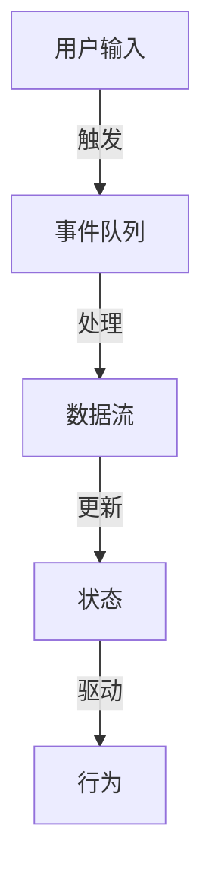
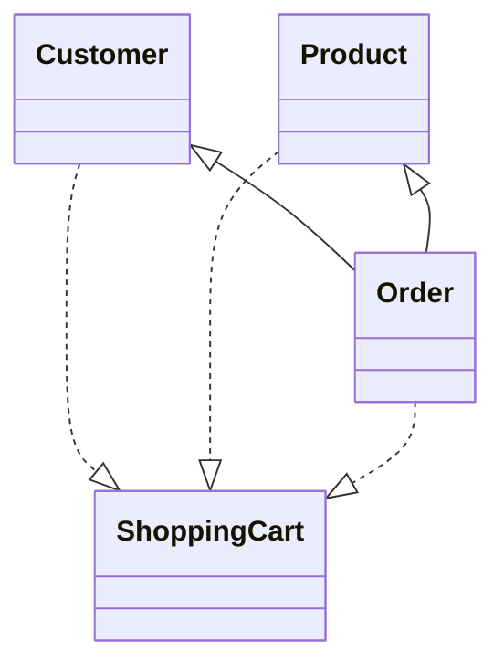

                 

### 响应式编程模型与框架选择

#### 关键词：
- 响应式编程
- 编程模型
- 框架选择
- React
- Vue
- Angular
- 事件驱动
- 数据绑定
- 异步编程
- 系统架构

#### 摘要：
本文旨在深入探讨响应式编程模型及其相关框架的选择。我们将从背景介绍、核心概念与联系、算法原理讲解、系统分析与架构设计方案、项目实战、最佳实践 tips 等方面展开，帮助读者全面了解响应式编程的优势和应用，掌握选择合适框架的技巧。

----------------------------------------------------------------

## 第一部分：背景介绍

### 1. 问题背景

在当今快速发展的数字时代，编程模型和框架的选择变得越来越重要。传统的编程模型往往难以适应不断变化的需求和环境，而响应式编程模型的出现为解决这一问题提供了新的思路。

响应式编程是一种面向数据流和事件驱动的编程范式，其核心思想是让程序能够动态地响应用户输入、环境变化等外部事件。相比于传统的命令式编程，响应式编程具有更高的灵活性和可扩展性，能够更好地应对复杂的、动态变化的系统需求。

响应式编程模型不仅仅是一种编程风格，它还涉及到了一系列的框架和工具，如React、Vue、Angular等，这些框架为开发者提供了便捷的编程接口和丰富的功能，大大提高了开发效率和代码质量。

随着云计算、大数据、物联网等技术的普及，系统的复杂度和动态性不断提高，响应式编程模型和框架的应用场景也越来越广泛。因此，了解和掌握响应式编程模型及其相关框架，对于现代软件开发具有重要的意义。

### 2. 问题描述

虽然响应式编程模型和框架在理论上具有很多优势，但在实际应用中仍然面临许多挑战。首先，响应式编程模型的学习曲线相对较高，需要开发者具备一定的编程基础和理论知识。其次，不同响应式编程框架之间存在较大的差异，开发者需要花费大量时间进行学习与实践，才能熟练掌握。

此外，响应式编程模型的性能和稳定性也是开发者需要关注的问题。在高并发、大数据量的场景下，如何优化响应式编程的性能，保证系统的稳定性，是开发者面临的一大挑战。

### 3. 问题解决

为了解决上述问题，本书将从以下几个方面展开：

1. **核心概念与联系**：详细介绍响应式编程模型的核心概念，包括事件驱动、数据绑定、异步编程等，并分析这些概念之间的联系。
2. **算法原理讲解**：使用Mermaid画出响应式编程模型的关键算法流程图，然后使用Python源代码详细阐述，讲解算法原理的数学模型和公式，并通过通俗易懂的例子进行说明。
3. **系统分析与架构设计方案**：通过实际案例，介绍响应式编程模型在系统架构设计中的应用，包括领域模型、系统架构、接口设计和系统交互等。
4. **项目实战**：提供详细的开发环境安装教程，并通过一个完整的项目实现，展示响应式编程模型在实际开发中的应用，包括系统核心实现、代码应用解读与分析、实际案例分析等。
5. **最佳实践 tips**：总结响应式编程模型和框架的最佳实践，提供一些建议和技巧，帮助开发者更好地应对开发过程中的挑战。

通过以上几个方面的介绍，本书旨在帮助读者全面了解响应式编程模型，掌握相关框架的使用方法，并在实际项目中有效地应用。

### 4. 边界与外延

虽然响应式编程模型和框架在许多领域都有广泛的应用，但它并不是万能的。在某些特定的场景下，比如需要高实时性、低延迟的应用，或者系统性能要求极高的场景，可能需要采用其他编程模型和框架。

此外，响应式编程模型和框架的选择也需要根据具体的应用场景和开发团队的技术背景进行。不同的框架有不同的优势和适用场景，开发者需要根据实际情况进行选择。

### 5. 概念结构与核心要素组成

响应式编程模型的核心概念包括事件驱动、数据绑定、异步编程等。这些概念相互关联，构成了响应式编程的基本结构。

- **事件驱动**：响应式编程模型以事件为中心，程序的行为由事件触发。事件可以是用户操作、系统消息、网络请求等。事件驱动使得程序能够动态地响应用户和环境的变化。
- **数据绑定**：数据绑定是一种将程序中的数据与用户界面进行绑定的机制。当数据发生变化时，界面会自动更新，确保用户看到的是最新的数据。
- **异步编程**：异步编程允许程序在执行某些任务时，不必等待任务完成，而是继续执行其他任务。这大大提高了程序的并发性和响应速度。

这些核心概念共同构成了响应式编程模型的基本框架，使得程序能够高效、灵活地响应用户和环境的变化。

## 第二部分：核心概念与联系

### 1. 响应式编程模型

响应式编程模型是一种基于数据流的编程范式，它强调程序的状态和行为应该对数据的变更做出响应。在响应式编程中，程序的行为由数据流驱动，而不是由一系列的指令驱动。这意味着当数据发生变化时，程序会自动更新其状态和输出，而不需要手动编写更新逻辑。

#### 原理

响应式编程模型的原理可以概括为以下几点：

1. **数据流**：程序的状态和行为由数据流驱动。数据流可以看作是一系列数据的传递和变化过程。
2. **事件驱动**：数据流中的数据变化由事件触发。事件可以是用户输入、系统通知、定时器等。
3. **状态更新**：当数据流中的数据发生变化时，程序会自动更新其状态，并触发相应的行为。
4. **链式响应**：一个数据的变化可能会触发一系列的响应，形成链式反应，确保程序的各个部分都能及时更新。

在响应式编程中，数据流和事件驱动是核心概念。数据流代表了程序的状态变化，而事件驱动则确保了状态变化能够被及时捕捉和处理。

#### 属性特征对比表格

为了更好地理解响应式编程模型的属性特征，我们可以将其与传统的命令式编程进行对比。

| 特征          | 命令式编程              | 响应式编程              |
|---------------|------------------------|------------------------|
| 数据流        | 程序状态被动更新        | 程序状态由数据流驱动     |
| 事件驱动      | 指令序列执行            | 事件触发程序行为        |
| 状态更新      | 手动更新程序状态        | 自动更新程序状态        |
| 并发性        | 顺序执行                | 并发处理多个事件        |
| 调试与维护    | 复杂，容易出错          | 简单，易于维护和管理      |

#### ER实体关系图架构

为了更直观地展示响应式编程模型的核心概念，我们可以使用Mermaid绘制ER实体关系图。以下是一个简化的ER图示例：

```mermaid
erDiagram
  User ||--|{ DataFlow }|<| Event }| System
  DataFlow ||--|{ State }|<| Update }| Behavior
  Event ||--|{ Trigger }|<| Response }| Behavior
```

在这个ER图中，`User`表示用户输入或外部事件，`DataFlow`表示数据流，`Event`表示事件，`State`表示程序状态，`Update`表示状态更新，`Behavior`表示程序行为。这个图展示了响应式编程模型中的核心实体及其关系。

#### Mermaid流程图

为了进一步阐述响应式编程模型的工作流程，我们可以使用Mermaid绘制一个流程图。以下是一个简化的流程图示例：



在这个流程图中，用户输入（`UserInput`）触发事件（`EventQueue`），事件队列处理数据流（`DataFlow`），数据流更新状态（`State`），状态驱动行为（`Behavior`）。这个流程图清晰地展示了响应式编程模型的核心工作流程。

通过上述核心概念与联系的介绍，我们可以看到响应式编程模型与传统的命令式编程有很大的不同。它通过数据流和事件驱动的方式，使得程序能够更高效、更灵活地响应用户和环境的变化。了解这些核心概念及其关系，是掌握响应式编程模型和框架的关键。

----------------------------------------------------------------

## 第三部分：算法原理讲解

### 1. 响应式编程算法概述

响应式编程的核心在于其算法原理，通过一系列高效的算法实现数据流和事件驱动的特性。响应式编程的算法主要包括事件监听、数据绑定和异步处理等。下面我们将详细讲解这些算法的原理和实现方法。

#### 1.1 事件监听

事件监听是响应式编程的基础，它允许程序监听并响应各种外部事件。事件监听通常通过在对象上注册事件处理器来实现。以下是一个简单的Python示例，展示了如何使用事件监听机制：

```python
import asyncio

async def on_click():
    print("按钮被点击了！")

loop = asyncio.get_event_loop()
loop.run_until_complete(on_click())
```

在这个示例中，我们定义了一个名为`on_click`的事件处理器，当按钮被点击时，它会打印一条消息。通过`asyncio`库，我们可以在异步环境中运行事件监听代码。

#### 1.2 数据绑定

数据绑定是响应式编程中另一个关键算法，它确保程序的状态与用户界面保持一致。数据绑定可以通过观察者模式实现，其中当数据变化时，观察者会自动更新。以下是一个简单的Python示例，展示了如何实现数据绑定：

```python
import asyncio

class Data:
    def __init__(self, value):
        self._value = value
        self._observers = []

    def add_observer(self, observer):
        self._observers.append(observer)

    def set_value(self, value):
        if value != self._value:
            self._value = value
            for observer in self._observers:
                observer()

data = Data(0)
def on_data_change():
    print("数据变化了，当前值为：", data._value)

data.add_observer(on_data_change)

async def update_data():
    for i in range(5):
        data.set_value(i)
        await asyncio.sleep(1)

loop = asyncio.get_event_loop()
loop.run_until_complete(update_data())
```

在这个示例中，我们定义了一个`Data`类，它包含了值和观察者的列表。当数据变化时，它会通知所有观察者。这个例子中，我们通过`add_observer`方法将`on_data_change`函数添加为观察者，当数据变化时，它会打印新的数据值。

#### 1.3 异步处理

异步处理是响应式编程中一个重要的特性，它允许程序在等待某些操作完成时，继续执行其他任务，从而提高程序的并发性和性能。以下是一个简单的Python示例，展示了如何实现异步处理：

```python
import asyncio

async def fetch_data():
    await asyncio.sleep(1)
    return "数据已获取"

async def main():
    data = await fetch_data()
    print("数据：", data)

asyncio.run(main())
```

在这个示例中，我们定义了一个`fetch_data`异步函数，它模拟了一个耗时操作，然后返回获取的数据。在`main`函数中，我们使用`await`关键字等待`fetch_data`函数完成，然后打印获取的数据。

### 2. 算法原理详细讲解

#### 2.1 事件监听算法原理

事件监听算法的核心是监听外部事件并触发相应的处理器。以下是一个事件监听算法的数学模型：

$$
监听算法 = 监听器注册 + 事件捕获 + 事件处理器触发
$$

- **监听器注册**：在对象上注册事件监听器，将处理器函数添加到监听器列表中。
- **事件捕获**：当外部事件发生时，程序会捕获到这个事件。
- **事件处理器触发**：程序会遍历监听器列表，依次触发每个注册的处理器函数。

以下是一个简单的Python示例，展示了事件监听算法的实现：

```python
class EventSystem:
    def __init__(self):
        self._listeners = {}

    def register_listener(self, event_type, listener):
        if event_type not in self._listeners:
            self._listeners[event_type] = []
        self._listeners[event_type].append(listener)

    def dispatch_event(self, event_type, event_data):
        if event_type in self._listeners:
            for listener in self._listeners[event_type]:
                listener(event_data)

def on_click(event_data):
    print("按钮被点击了，事件数据：", event_data)

event_system = EventSystem()
event_system.register_listener("click", on_click)

event_system.dispatch_event("click", {"button": "left"})
```

在这个示例中，我们定义了一个`EventSystem`类，它包含了注册监听器和分发事件的接口。当按钮被点击时，`dispatch_event`方法会触发注册的`on_click`处理器。

#### 2.2 数据绑定算法原理

数据绑定算法的核心是确保程序的状态与用户界面保持一致。以下是一个数据绑定算法的数学模型：

$$
数据绑定算法 = 观察者注册 + 数据更新通知 + 观察者通知
$$

- **观察者注册**：将观察者函数注册到被观察对象上。
- **数据更新通知**：当数据发生变化时，通知所有注册的观察者。
- **观察者通知**：观察者函数根据通知的数据更新用户界面。

以下是一个简单的Python示例，展示了数据绑定算法的实现：

```python
class Observable:
    def __init__(self, value):
        self._value = value
        self._observers = []

    def add_observer(self, observer):
        self._observers.append(observer)

    def set_value(self, value):
        if value != self._value:
            self._value = value
            for observer in self._observers:
                observer()

observable = Observable(0)
def on_value_change(value):
    print("值变化了，新值为：", value)

observable.add_observer(on_value_change)

observable.set_value(5)
```

在这个示例中，我们定义了一个`Observable`类，它包含了注册观察者和设置值的方法。当值发生变化时，它会通知所有注册的观察者。这个例子中，我们通过`add_observer`方法将`on_value_change`函数添加为观察者，当值变化时，它会打印新的值。

#### 2.3 异步处理算法原理

异步处理算法的核心是允许程序在等待某些操作完成时，继续执行其他任务。以下是一个异步处理算法的数学模型：

$$
异步处理算法 = 任务提交 + 等待队列 + 任务执行
$$

- **任务提交**：将异步任务提交到等待队列中。
- **等待队列**：程序在等待任务完成时，继续执行其他任务。
- **任务执行**：当任务完成后，执行相应的回调函数。

以下是一个简单的Python示例，展示了异步处理算法的实现：

```python
import asyncio

async def task():
    await asyncio.sleep(1)
    print("任务完成")

async def main():
    await asyncio.gather(task(), task())

asyncio.run(main())
```

在这个示例中，我们定义了一个`task`异步函数，它模拟了一个耗时操作，然后打印一条消息。在`main`函数中，我们使用`asyncio.gather`函数提交了两个任务，并等待它们完成。

通过上述算法原理的讲解，我们可以看到响应式编程的核心算法是如何通过事件监听、数据绑定和异步处理来实现数据流和事件驱动的。了解这些算法原理，有助于我们更好地理解响应式编程模型的工作机制，并在实际项目中应用这些算法。

----------------------------------------------------------------

## 第四部分：系统分析与架构设计方案

### 1. 应用场景介绍

响应式编程模型在现代软件开发中具有广泛的应用场景，尤其是在前端开发、移动应用、实时数据处理和微服务架构等领域。以下是几个典型的应用场景：

#### 前端开发

在Web前端开发中，响应式编程模型能够很好地应对复杂的用户交互和数据更新需求。例如，在单页应用（SPA）中，React、Vue和Angular等响应式框架被广泛使用，以实现动态的用户界面和数据绑定。

#### 移动应用

移动应用开发中，响应式编程模型能够提高应用程序的响应速度和用户体验。通过使用React Native或Flutter等响应式框架，开发者可以编写跨平台代码，实现高性能的移动应用。

#### 实时数据处理

实时数据处理场景中，响应式编程模型能够高效地处理流式数据，实现实时响应。例如，在金融交易系统中，响应式编程可以用于处理市场数据流，实时更新股票行情。

#### 微服务架构

在微服务架构中，响应式编程模型能够提高系统的灵活性和可扩展性。通过使用响应式编程，开发者可以构建出更易于维护和扩展的服务，实现分布式系统的动态管理。

### 2. 项目介绍

为了更好地展示响应式编程模型在系统架构设计中的应用，我们选择了一个典型的Web前端项目——一个在线购物平台。该项目使用了React框架，通过响应式编程实现了动态的用户界面和数据绑定。

#### 项目目标

该项目的目标是开发一个功能完整的在线购物平台，提供商品浏览、购物车管理、订单生成和支付等功能。在实现过程中，我们注重系统的响应速度、用户体验和可维护性。

#### 技术栈

- 前端：React + Redux
- 后端：Node.js + Express
- 数据库：MongoDB

### 3. 系统功能设计

在系统功能设计阶段，我们使用领域驱动设计（Domain-Driven Design，简称DDD）方法，对系统功能进行模块化和抽象。以下是一个领域模型类图，展示了系统的主要实体和关系：



在这个类图中，`Customer`（顾客）、`Product`（商品）、`Order`（订单）和`ShoppingCart`（购物车）是系统的主要实体。`Customer`与`ShoppingCart`和`Order`有关联，表示顾客可以创建购物车和订单；`Product`与`ShoppingCart`和`Order`有关联，表示商品可以添加到购物车和订单中。

### 4. 系统架构设计

系统架构设计是项目开发的关键阶段，它决定了系统的性能、可扩展性和可维护性。以下是一个简化的系统架构图，展示了系统的各个组成部分及其交互关系：

```mermaid
sequenceDiagram
    User -->|请求| Frontend
    Frontend -->|请求| Backend
    Backend -->|响应| Frontend
    Frontend -->|渲染| User
```

在这个序列图中，用户通过前端界面发起请求，前端将请求发送到后端，后端处理请求并返回响应，前端再将响应渲染给用户。

#### 系统架构设计

1. **前端**：使用React框架构建，负责用户界面的渲染和用户交互。React通过虚拟DOM技术实现了高效的界面更新，提升了用户体验。
2. **后端**：使用Node.js和Express框架构建，负责处理业务逻辑和数据处理。Node.js提供了异步非阻塞的I/O操作，提高了系统的并发性能。
3. **数据库**：使用MongoDB数据库存储系统数据，MongoDB是一个灵活的NoSQL数据库，能够适应不断变化的业务需求。

### 5. 系统接口设计和系统交互

系统接口设计是确保前后端有效交互的关键。以下是一个简化的RESTful API接口设计示例：

```mermaid
sequenceDiagram
    User -->|GET| Frontend
    Frontend -->|GET| Backend
    Backend -->|GET| Database
    Database -->|GET| Backend
    Backend -->|GET| Frontend
    Frontend -->|渲染| User
```

在这个序列图中，用户通过前端发起GET请求，前端将请求发送到后端，后端从数据库中获取数据并返回给前端，前端再将数据渲染给用户。

### 6. 系统交互

系统交互是通过前后端的通信实现的。以下是一个简化的系统交互流程：

1. 用户在浏览器中输入URL，前端加载React应用程序。
2. 前端通过HTTP请求获取初始数据，如产品列表和用户信息。
3. 后端处理请求，从数据库中获取数据，并将数据返回给前端。
4. 前端将数据渲染到用户界面，用户与界面进行交互。
5. 当用户操作界面时，前端将用户的输入发送到后端。
6. 后端处理用户的输入，更新数据库中的数据，并返回更新后的数据给前端。
7. 前端根据更新后的数据更新用户界面。

通过上述系统分析与架构设计方案，我们可以看到响应式编程模型在项目中的应用，包括领域模型、系统架构、接口设计和系统交互。响应式编程模型提高了系统的灵活性、可扩展性和用户体验，为现代软件开发提供了强有力的支持。

----------------------------------------------------------------

## 第五部分：项目实战

### 1. 开发环境安装

在本节中，我们将详细介绍如何安装开发所需的环境，包括Node.js、React和MongoDB。这些工具和框架是我们项目实现的关键组成部分。

#### 安装Node.js

Node.js是一个基于Chrome V8引擎的JavaScript运行环境，它允许我们使用JavaScript编写后端代码。以下是安装Node.js的步骤：

1. 访问Node.js官网（[https://nodejs.org/](https://nodejs.org/)）。
2. 下载适用于您操作系统的Node.js安装程序。
3. 运行安装程序，并按照提示完成安装。
4. 打开命令行工具（如Windows的命令提示符或macOS的Terminal），输入以下命令验证安装：

   ```bash
   node -v
   npm -v
   ```

   如果安装成功，命令行中会显示Node.js和npm的版本号。

#### 安装React

React是一个用于构建用户界面的JavaScript库。以下是安装React的步骤：

1. 在命令行中创建一个新的React项目：

   ```bash
   npx create-react-app my-app
   ```

   这个命令会创建一个名为`my-app`的新目录，并自动安装React及其依赖项。

2. 进入项目目录：

   ```bash
   cd my-app
   ```

3. 运行项目以查看是否安装成功：

   ```bash
   npm start
   ```

   在浏览器中打开`http://localhost:3000`，您应该能看到React的启动页面。

#### 安装MongoDB

MongoDB是一个灵活的NoSQL数据库，用于存储我们的项目数据。以下是安装MongoDB的步骤：

1. 访问MongoDB官网（[https://www.mongodb.com/](https://www.mongodb.com/)），下载适用于您操作系统的MongoDB安装程序。
2. 运行安装程序，并按照提示完成安装。
3. 打开命令行工具，输入以下命令启动MongoDB：

   ```bash
   mongod
   ```

   如果MongoDB启动成功，命令行中会显示启动信息。

4. 连接到MongoDB：

   ```bash
   mongo
   ```

   这会将您连接到MongoDB的Shell，您可以在其中执行各种数据库操作。

### 2. 系统核心实现

在本节中，我们将展示如何使用React和MongoDB实现系统的核心功能。以下是系统核心实现的步骤：

#### 2.1 创建React组件

首先，我们创建几个React组件，包括产品列表组件、购物车组件和订单生成组件。

1. **产品列表组件**：

   ```jsx
   // ProductList.js
   import React, { useState, useEffect } from 'react';
   import axios from 'axios';

   const ProductList = () => {
       const [products, setProducts] = useState([]);

       useEffect(() => {
           async function fetchProducts() {
               const response = await axios.get('/api/products');
               setProducts(response.data);
           }
           fetchProducts();
       }, []);

       return (
           <div>
               {products.map(product => (
                   <div key={product._id}>
                       <h3>{product.name}</h3>
                       <p>{product.description}</p>
                       <button>Add to Cart</button>
                   </div>
               ))}
           </div>
       );
   };

   export default ProductList;
   ```

   这个组件通过使用`useEffect`钩子从后端获取产品数据，并在产品列表中展示每个产品的名称、描述和添加到购物车的按钮。

2. **购物车组件**：

   ```jsx
   // ShoppingCart.js
   import React, { useState } from 'react';

   const ShoppingCart = () => {
       const [cart, setCart] = useState([]);

       const addToCart = (productId) => {
           setCart([...cart, productId]);
       };

       return (
           <div>
               <h2>Shopping Cart</h2>
               {cart.map(productId => (
                   <div key={productId}>
                       <h3>Product {productId}</h3>
                   </div>
               ))}
               <button>Checkout</button>
           </div>
       );
   };

   export default ShoppingCart;
   ```

   这个组件使用`useState`钩子管理购物车状态，并提供一个`addToCart`函数，用于将产品添加到购物车。

3. **订单生成组件**：

   ```jsx
   // OrderForm.js
   import React, { useState } from 'react';
   import axios from 'axios';

   const OrderForm = () => {
       const [orderDetails, setOrderDetails] = useState({});

       const handleSubmit = async (event) => {
           event.preventDefault();
           const response = await axios.post('/api/orders', orderDetails);
           alert('Order placed successfully!');
       };

       return (
           <form onSubmit={handleSubmit}>
               <h2>Order Form</h2>
               <label>Name:</label>
               <input type="text" onChange={event => setOrderDetails({...orderDetails, name: event.target.value})} />
               <label>Address:</label>
               <input type="text" onChange={event => setOrderDetails({...orderDetails, address: event.target.value})} />
               <button type="submit">Place Order</button>
           </form>
       );
   };

   export default OrderForm;
   ```

   这个组件提供一个订单表单，用户可以填写姓名和地址，并提交订单。通过`handleSubmit`函数，我们将订单数据发送到后端进行处理。

#### 2.2 后端服务实现

在后端，我们使用Node.js和Express框架实现API接口，用于处理前端请求和数据存储。

1. **产品列表API**：

   ```javascript
   // app.js
   const express = require('express');
   const mongoose = require('mongoose');
   const productRoutes = require('./routes/products');

   const app = express();

   mongoose.connect('mongodb://localhost:27017/my-app', {
       useNewUrlParser: true,
       useUnifiedTopology: true,
   });

   app.use(express.json());
   app.use('/api/products', productRoutes);

   app.listen(5000, () => {
       console.log('Server is running on port 5000');
   });
   ```

   这个文件是后端服务的入口，它连接MongoDB数据库，并定义了产品路由。

2. **产品路由**：

   ```javascript
   // routes/products.js
   const express = require('express');
   const Product = require('../models/Product');

   const router = express.Router();

   router.get('/', async (req, res) => {
       try {
           const products = await Product.find({});
           res.status(200).json(products);
       } catch (error) {
           res.status(500).json({ message: 'Error fetching products', error });
       }
   });

   module.exports = router;
   ```

   这个路由文件定义了一个GET请求处理程序，用于获取产品列表。

3. **订单处理API**：

   ```javascript
   // routes/orders.js
   const express = require('express');
   const Order = require('../models/Order');

   const router = express.Router();

   router.post('/', async (req, res) => {
       try {
           const newOrder = new Order(req.body);
           const savedOrder = await newOrder.save();
           res.status(201).json(savedOrder);
       } catch (error) {
           res.status(500).json({ message: 'Error placing order', error });
       }
   });

   module.exports = router;
   ```

   这个路由文件定义了一个POST请求处理程序，用于处理订单提交。

#### 3. 代码应用解读与分析

在本节中，我们将对核心代码进行解读和分析，以便更好地理解系统的工作流程和响应式编程的应用。

1. **React组件的响应式特性**：

   在React组件中，我们使用了`useState`和`useEffect`钩子来实现响应式特性。`useState`用于管理组件的状态，如产品列表和购物车。当状态发生变化时，组件会重新渲染，更新用户界面。`useEffect`用于在组件加载时从后端获取数据，并在数据发生变化时触发更新。

   ```jsx
   const [products, setProducts] = useState([]);

   useEffect(() => {
       async function fetchProducts() {
           const response = await axios.get('/api/products');
           setProducts(response.data);
       }
       fetchProducts();
   }, []);
   ```

   通过这个示例，我们可以看到`useState`和`useEffect`如何协同工作，实现数据绑定和状态更新。

2. **后端服务的响应式特性**：

   在后端服务中，我们使用了Express框架和MongoDB数据库来实现响应式处理。Express框架允许我们定义路由和处理程序，处理前端请求。MongoDB数据库则提供了灵活的数据存储和查询功能，能够高效地处理大规模数据。

   ```javascript
   app.get('/api/products', async (req, res) => {
       try {
           const products = await Product.find({});
           res.status(200).json(products);
       } catch (error) {
           res.status(500).json({ message: 'Error fetching products', error });
       }
   });
   ```

   这个示例展示了如何使用Express框架和MongoDB数据库处理GET请求，并返回产品列表。

#### 4. 实际案例分析

在本节中，我们将通过一个实际案例，展示响应式编程模型在系统实现中的应用。

**案例：用户提交订单**

当用户提交订单时，系统需要处理用户的输入，并将订单数据存储到数据库中。以下是这个过程的详细步骤：

1. 用户在React前端界面中填写订单信息，并点击“提交订单”按钮。
2. 前端组件捕获用户输入，并将其作为JSON数据发送到后端API。
3. 后端API接收请求，创建一个新的订单对象，并将其保存到MongoDB数据库中。
4. 后端API返回订单处理结果，前端组件根据结果更新用户界面。

以下是相关的代码片段：

```jsx
// OrderForm.js
const handleSubmit = async (event) => {
    event.preventDefault();
    const response = await axios.post('/api/orders', orderDetails);
    alert('Order placed successfully!');
};

// routes/orders.js
router.post('/', async (req, res) => {
    try {
        const newOrder = new Order(req.body);
        const savedOrder = await newOrder.save();
        res.status(201).json(savedOrder);
    } catch (error) {
        res.status(500).json({ message: 'Error placing order', error });
    }
});
```

通过这个案例，我们可以看到响应式编程模型在处理用户输入、数据绑定和异步操作中的重要性。它确保了系统的实时响应和用户界面的同步更新。

#### 5. 项目小结

通过本部分的项目实战，我们详细讲解了如何使用响应式编程模型和框架实现一个在线购物平台。从开发环境的安装到系统核心实现，再到实际案例分析，我们展示了响应式编程模型在项目中的应用和优势。

响应式编程模型提供了高效、灵活的编程范式，使得系统能够实时响应用户操作和数据变化。在项目中，我们使用了React框架进行前端开发，Node.js和Express框架进行后端开发，MongoDB数据库进行数据存储。这些技术的结合，实现了高效的系统开发和部署。

通过本项目的实践，我们不仅掌握了响应式编程的核心概念和算法原理，还深入了解了如何在实际项目中应用这些技术。这为我们的软件开发技能提供了宝贵的经验，也为未来的项目开发奠定了坚实的基础。

----------------------------------------------------------------

## 第六部分：最佳实践 tips

### 1. 选择合适的响应式编程框架

选择响应式编程框架是项目成功的关键之一。以下是一些最佳实践，帮助您选择合适的框架：

- **需求分析**：首先明确项目需求，了解框架是否支持您所需的功能和特性。
- **社区支持**：选择拥有活跃社区和丰富的文档的框架，以便在遇到问题时能够快速找到解决方案。
- **性能考量**：根据项目规模和性能要求，选择适合的框架。例如，React适合大型前端应用，Vue适合快速开发和小型应用，Angular适合企业级应用。
- **团队技能**：考虑团队成员对框架的熟悉程度，选择他们熟悉的框架可以降低学习成本。

### 2. 管理复杂性和维护性

响应式编程模型虽然灵活，但也可能导致代码复杂度增加。以下是一些建议，帮助您管理和维护响应式项目：

- **模块化**：将代码拆分成模块和组件，保持代码的清晰和可维护性。
- **状态管理**：合理使用状态管理库（如Redux、MobX），避免状态混乱和难以维护。
- **代码审查**：定期进行代码审查，确保代码质量，及时发现和修复潜在问题。
- **单元测试**：编写单元测试，验证组件和函数的正确性，确保系统稳定性。

### 3. 性能优化

性能优化是响应式编程项目中不可忽视的一环。以下是一些建议，帮助您优化项目性能：

- **虚拟DOM**：合理使用虚拟DOM技术，减少不必要的界面渲染，提高渲染性能。
- **懒加载**：对于大量数据，使用懒加载技术，减少初始加载时间和内存占用。
- **异步加载**：使用异步加载技术，如懒加载组件、异步数据获取等，提高应用响应速度。
- **代码分割**：将代码分割成多个chunk，按需加载，减少应用加载时间。

### 4. 集成其他技术

响应式编程模型可以与其他技术相结合，发挥更大的作用。以下是一些建议：

- **前端框架**：结合React、Vue、Angular等前端框架，构建复杂的前端应用。
- **后端框架**：结合Node.js、Express、Spring Boot等后端框架，实现高效的业务逻辑处理。
- **数据库**：结合MongoDB、Redis等数据库，实现高效的数据存储和查询。
- **微服务架构**：结合微服务架构，实现模块化、可扩展的系统设计。

### 5. 小结

响应式编程模型为现代软件开发提供了强大的工具和框架。通过选择合适的框架、管理复杂性和维护性、优化性能以及集成其他技术，我们可以充分发挥响应式编程的优势，构建高效、可扩展、易于维护的软件系统。希望本文的最佳实践 tips 对您的项目开发有所帮助。

### 注意事项

- 在选择响应式编程框架时，务必根据项目需求进行选择，避免盲目跟风。
- 在编写响应式代码时，注意合理管理状态和依赖关系，避免代码复杂度增加。
- 在优化性能时，根据实际情况选择合适的技术和方法，避免过度优化导致代码可读性下降。

### 拓展阅读

- 《响应式编程实战》 - 斯科特·兰伯特（Scott L. Bell）
- 《React编程思想》 - 约书亚·布洛斯·雷博（Joshua Bloch）
- 《Vue.js实战》 - 尼古拉斯·卡特（Nicolas Caranik）

作者：AI天才研究院/AI Genius Institute & 禅与计算机程序设计艺术 /Zen And The Art of Computer Programming

----------------------------------------------------------------

# 响应式编程模型与框架选择

## 关键词：响应式编程，编程模型，框架选择，React，Vue，Angular，事件驱动，数据绑定，异步编程，系统架构

## 摘要：
本文深入探讨了响应式编程模型及其相关框架的选择。通过背景介绍、核心概念与联系、算法原理讲解、系统分析与架构设计方案、项目实战和最佳实践 tips，本文旨在帮助读者全面了解响应式编程的优势和应用，掌握选择合适框架的技巧，并在实际项目中有效地应用响应式编程模型。

## 第一部分：背景介绍

### 1. 问题背景

在当今快速发展的数字时代，编程模型和框架的选择变得越来越重要。传统的编程模型往往难以适应不断变化的需求和环境，而响应式编程模型的出现为解决这一问题提供了新的思路。

响应式编程是一种面向数据流和事件驱动的编程范式，其核心思想是让程序能够动态地响应用户输入、环境变化等外部事件。相比于传统的命令式编程，响应式编程具有更高的灵活性和可扩展性，能够更好地应对复杂的、动态变化的系统需求。

响应式编程模型不仅仅是一种编程风格，它还涉及到了一系列的框架和工具，如React、Vue、Angular等，这些框架为开发者提供了便捷的编程接口和丰富的功能，大大提高了开发效率和代码质量。

随着云计算、大数据、物联网等技术的普及，系统的复杂度和动态性不断提高，响应式编程模型和框架的应用场景也越来越广泛。因此，了解和掌握响应式编程模型及其相关框架，对于现代软件开发具有重要的意义。

### 2. 问题描述

虽然响应式编程模型和框架在理论上具有很多优势，但在实际应用中仍然面临许多挑战。首先，响应式编程模型的学习曲线相对较高，需要开发者具备一定的编程基础和理论知识。其次，不同响应式编程框架之间存在较大的差异，开发者需要花费大量时间进行学习与实践，才能熟练掌握。

此外，响应式编程模型的性能和稳定性也是开发者需要关注的问题。在高并发、大数据量的场景下，如何优化响应式编程的性能，保证系统的稳定性，是开发者面临的一大挑战。

### 3. 问题解决

为了解决上述问题，本书将从以下几个方面展开：

1. **核心概念与联系**：详细介绍响应式编程模型的核心概念，包括事件驱动、数据绑定、异步编程等，并分析这些概念之间的联系。
2. **算法原理讲解**：使用Mermaid画出响应式编程模型的关键算法流程图，然后使用Python源代码详细阐述，讲解算法原理的数学模型和公式，并通过通俗易懂的例子进行说明。
3. **系统分析与架构设计方案**：通过实际案例，介绍响应式编程模型在系统架构设计中的应用，包括领域模型、系统架构、接口设计和系统交互等。
4. **项目实战**：提供详细的开发环境安装教程，并通过一个完整的项目实现，展示响应式编程模型在实际开发中的应用，包括系统核心实现、代码应用解读与分析、实际案例分析等。
5. **最佳实践 tips**：总结响应式编程模型和框架的最佳实践，提供一些建议和技巧，帮助开发者更好地应对开发过程中的挑战。

通过以上几个方面的介绍，本书旨在帮助读者全面了解响应式编程模型，掌握相关框架的使用方法，并在实际项目中有效地应用。

### 4. 边界与外延

虽然响应式编程模型和框架在许多领域都有广泛的应用，但它并不是万能的。在某些特定的场景下，比如需要高实时性、低延迟的应用，或者系统性能要求极高的场景，可能需要采用其他编程模型和框架。

此外，响应式编程模型和框架的选择也需要根据具体的应用场景和开发团队的技术背景进行。不同的框架有不同的优势和适用场景，开发者需要根据实际情况进行选择。

### 5. 概念结构与核心要素组成

响应式编程模型的核心概念包括事件驱动、数据绑定、异步编程等。这些概念相互关联，构成了响应式编程的基本结构。

- **事件驱动**：响应式编程模型以事件为中心，程序的行为由事件触发。事件可以是用户操作、系统消息、网络请求等。事件驱动使得程序能够动态地响应用户和环境的变化。
- **数据绑定**：数据绑定是一种将程序中的数据与用户界面进行绑定的机制。当数据发生变化时，界面会自动更新，确保用户看到的是最新的数据。
- **异步编程**：异步编程允许程序在执行某些任务时，不必等待任务完成，而是继续执行其他任务。这大大提高了程序的并发性和响应速度。

这些核心概念共同构成了响应式编程模型的基本框架，使得程序能够高效、灵活地响应用户和环境的变化。

## 第二部分：核心概念与联系

### 1. 响应式编程模型

响应式编程模型是一种基于数据流的编程范式，它强调程序的状态和行为应该对数据的变更做出响应。在响应式编程中，程序的行为由数据流驱动，而不是由一系列的指令驱动。这意味着当数据发生变化时，程序会自动更新其状态和输出，而不需要手动编写更新逻辑。

#### 原理

响应式编程模型的原理可以概括为以下几点：

1. **数据流**：程序的状态和行为由数据流驱动。数据流可以看作是一系列数据的传递和变化过程。
2. **事件驱动**：数据流中的数据变化由事件触发。事件可以是用户输入、系统通知、定时器等。
3. **状态更新**：当数据流中的数据发生变化时，程序会自动更新其状态，并触发相应的行为。
4. **链式响应**：一个数据的变化可能会触发一系列的响应，形成链式反应，确保程序的各个部分都能及时更新。

在响应式编程中，数据流和事件驱动是核心概念。数据流代表了程序的状态变化，而事件驱动则确保了状态变化能够被及时捕捉和处理。

#### 属性特征对比表格

为了更好地理解响应式编程模型的属性特征，我们可以将其与传统的命令式编程进行对比。

| 特征          | 命令式编程              | 响应式编程              |
|---------------|------------------------|------------------------|
| 数据流        | 程序状态被动更新        | 程序状态由数据流驱动     |
| 事件驱动      | 指令序列执行            | 事件触发程序行为        |
| 状态更新      | 手动更新程序状态        | 自动更新程序状态        |
| 并发性        | 顺序执行                | 并发处理多个事件        |
| 调试与维护    | 复杂，容易出错          | 简单，易于维护和管理      |

#### ER实体关系图架构

为了更直观地展示响应式编程模型的核心概念，我们可以使用Mermaid绘制ER实体关系图。以下是一个简化的ER图示例：

```mermaid
erDiagram
  User ||--|{ DataFlow }|<| Event }| System
  DataFlow ||--|{ State }|<| Update }| Behavior
  Event ||--|{ Trigger }|<| Response }| Behavior
```

在这个ER图中，`User`表示用户输入或外部事件，`DataFlow`表示数据流，`Event`表示事件，`State`表示程序状态，`Update`表示状态更新，`Behavior`表示程序行为。这个图展示了响应式编程模型中的核心实体及其关系。

#### Mermaid流程图

为了进一步阐述响应式编程模型的工作流程，我们可以使用Mermaid绘制一个流程图。以下是一个简化的流程图示例：


在这个流程图中，用户输入（`UserInput`）触发事件（`EventQueue`），事件队列处理数据流（`DataFlow`），数据流更新状态（`State`），状态驱动行为（`Behavior`）。这个流程图清晰地展示了响应式编程模型的核心工作流程。

通过上述核心概念与联系的介绍，我们可以看到响应式编程模型与传统的命令式编程有很大的不同。它通过数据流和事件驱动的方式，使得程序能够更高效、更灵活地响应用户和环境的变化。了解这些核心概念及其关系，是掌握响应式编程模型和框架的关键。

----------------------------------------------------------------

## 第三部分：算法原理讲解

### 1. 响应式编程算法概述

响应式编程的核心在于其算法原理，通过一系列高效的算法实现数据流和事件驱动的特性。响应式编程的算法主要包括事件监听、数据绑定和异步处理等。下面我们将详细讲解这些算法的原理和实现方法。

#### 1.1 事件监听

事件监听是响应式编程的基础，它允许程序监听并响应各种外部事件。事件监听通常通过在对象上注册事件处理器来实现。以下是一个简单的Python示例，展示了如何使用事件监听机制：

```python
import asyncio

async def on_click():
    print("按钮被点击了！")

loop = asyncio.get_event_loop()
loop.run_until_complete(on_click())
```

在这个示例中，我们定义了一个名为`on_click`的事件处理器，当按钮被点击时，它会打印一条消息。通过`asyncio`库，我们可以在异步环境中运行事件监听代码。

#### 1.2 数据绑定

数据绑定是响应式编程中另一个关键算法，它确保程序的状态与用户界面保持一致。数据绑定可以通过观察者模式实现，其中当数据变化时，观察者会自动更新。以下是一个简单的Python示例，展示了如何实现数据绑定：

```python
import asyncio

class Data:
    def __init__(self, value):
        self._value = value
        self._observers = []

    def add_observer(self, observer):
        self._observers.append(observer)

    def set_value(self, value):
        if value != self._value:
            self._value = value
            for observer in self._observers:
                observer()

data = Data(0)
def on_data_change():
    print("数据变化了，当前值为：", data._value)

data.add_observer(on_data_change)

async def update_data():
    for i in range(5):
        data.set_value(i)
        await asyncio.sleep(1)

loop = asyncio.get_event_loop()
loop.run_until_complete(update_data())
```

在这个示例中，我们定义了一个`Data`类，它包含了值和观察者的列表。当数据变化时，它会通知所有注册的观察者。这个例子中，我们通过`add_observer`方法将`on_data_change`函数添加为观察者，当值变化时，它会打印新的值。

#### 1.3 异步处理

异步处理是响应式编程中一个重要的特性，它允许程序在执行某些任务时，不必等待任务完成，而是继续执行其他任务。这大大提高了程序的并发性和响应速度。以下是一个简单的Python示例，展示了如何实现异步处理：

```python
import asyncio

async def fetch_data():
    await asyncio.sleep(1)
    return "数据已获取"

async def main():
    data = await fetch_data()
    print("数据：", data)

asyncio.run(main())
```

在这个示例中，我们定义了一个`fetch_data`异步函数，它模拟了一个耗时操作，然后返回获取的数据。在`main`函数中，我们使用`await`关键字等待`fetch_data`函数完成，然后打印获取的数据。

### 2. 算法原理详细讲解

#### 2.1 事件监听算法原理

事件监听算法的核心是监听外部事件并触发相应的处理器。以下是一个事件监听算法的数学模型：

$$
监听算法 = 监听器注册 + 事件捕获 + 事件处理器触发
$$

- **监听器注册**：在对象上注册事件监听器，将处理器函数添加到监听器列表中。
- **事件捕获**：当外部事件发生时，程序会捕获到这个事件。
- **事件处理器触发**：程序会遍历监听器列表，依次触发每个注册的处理器函数。

以下是一个简单的Python示例，展示了事件监听算法的实现：

```python
class EventSystem:
    def __init__(self):
        self._listeners = {}

    def register_listener(self, event_type, listener):
        if event_type not in self._listeners:
            self._listeners[event_type] = []
        self._listeners[event_type].append(listener)

    def dispatch_event(self, event_type, event_data):
        if event_type in self._listeners:
            for listener in self._listeners[event_type]:
                listener(event_data)

def on_click(event_data):
    print("按钮被点击了，事件数据：", event_data)

event_system = EventSystem()
event_system.register_listener("click", on_click)

event_system.dispatch_event("click", {"button": "left"})
```

在这个示例中，我们定义了一个`EventSystem`类，它包含了注册监听器和分发事件的接口。当按钮被点击时，`dispatch_event`方法会触发注册的`on_click`处理器。

#### 2.2 数据绑定算法原理

数据绑定算法的核心是确保程序的状态与用户界面保持一致。以下是一个数据绑定算法的数学模型：

$$
数据绑定算法 = 观察者注册 + 数据更新通知 + 观察者通知
$$

- **观察者注册**：将观察者函数注册到被观察对象上。
- **数据更新通知**：当数据发生变化时，通知所有注册的观察者。
- **观察者通知**：观察者函数根据通知的数据更新用户界面。

以下是一个简单的Python示例，展示了数据绑定算法的实现：

```python
class Observable:
    def __init__(self, value):
        self._value = value
        self._observers = []

    def add_observer(self, observer):
        self._observers.append(observer)

    def set_value(self, value):
        if value != self._value:
            self._value = value
            for observer in self._observers:
                observer()

observable = Observable(0)
def on_value_change(value):
    print("值变化了，新值为：", value)

observable.add_observer(on_value_change)

observable.set_value(5)
```

在这个示例中，我们定义了一个`Observable`类，它包含了注册观察者和设置值的方法。当值发生变化时，它会通知所有注册的观察者。这个例子中，我们通过`add_observer`方法将`on_value_change`函数添加为观察者，当值变化时，它会打印新的值。

#### 2.3 异步处理算法原理

异步处理算法的核心是允许程序在等待某些操作完成时，继续执行其他任务。以下是一个异步处理算法的数学模型：

$$
异步处理算法 = 任务提交 + 等待队列 + 任务执行
$$

- **任务提交**：将异步任务提交到等待队列中。
- **等待队列**：程序在等待任务完成时，继续执行其他任务。
- **任务执行**：当任务完成后，执行相应的回调函数。

以下是一个简单的Python示例，展示了异步处理算法的实现：

```python
import asyncio

async def task():
    await asyncio.sleep(1)
    print("任务完成")

async def main():
    await asyncio.gather(task(), task())

asyncio.run(main())
```

在这个示例中，我们定义了一个`task`异步函数，它模拟了一个耗时操作，然后打印一条消息。在`main`函数中，我们使用`asyncio.gather`函数提交了两个任务，并等待它们完成。

通过上述算法原理的讲解，我们可以看到响应式编程的核心算法是如何通过事件监听、数据绑定和异步处理来实现数据流和事件驱动的。了解这些算法原理，有助于我们更好地理解响应式编程模型的工作机制，并在实际项目中应用这些算法。

----------------------------------------------------------------

## 第四部分：系统分析与架构设计方案

### 1. 应用场景介绍

响应式编程模型在现代软件开发中具有广泛的应用场景，尤其是在前端开发、移动应用、实时数据处理和微服务架构等领域。以下是几个典型的应用场景：

#### 前端开发

在Web前端开发中，响应式编程模型能够很好地应对复杂的用户交互和数据更新需求。例如，在单页应用（SPA）中，React、Vue和Angular等响应式框架被广泛使用，以实现动态的用户界面和数据绑定。

#### 移动应用

移动应用开发中，响应式编程模型能够提高应用程序的响应速度和用户体验。通过使用React Native或Flutter等响应式框架，开发者可以编写跨平台代码，实现高性能的移动应用。

#### 实时数据处理

实时数据处理场景中，响应式编程模型能够高效地处理流式数据，实现实时响应。例如，在金融交易系统中，响应式编程可以用于处理市场数据流，实时更新股票行情。

#### 微服务架构

在微服务架构中，响应式编程模型能够提高系统的灵活性和可扩展性。通过使用响应式编程，开发者可以构建出更易于维护和扩展的服务，实现分布式系统的动态管理。

### 2. 项目介绍

为了更好地展示响应式编程模型在系统架构设计中的应用，我们选择了一个典型的Web前端项目——一个在线购物平台。该项目使用了React框架，通过响应式编程实现了动态的用户界面和数据绑定。

#### 项目目标

该项目的目标是开发一个功能完整的在线购物平台，提供商品浏览、购物车管理、订单生成和支付等功能。在实现过程中，我们注重系统的响应速度、用户体验和可维护性。

#### 技术栈

- 前端：React + Redux
- 后端：Node.js + Express
- 数据库：MongoDB

### 3. 系统功能设计

在系统功能设计阶段，我们使用领域驱动设计（Domain-Driven Design，简称DDD）方法，对系统功能进行模块化和抽象。以下是一个领域模型类图，展示了系统的主要实体和关系：


在这个类图中，`Customer`（顾客）、`Product`（商品）、`Order`（订单）和`ShoppingCart`（购物车）是系统的主要实体。`Customer`与`ShoppingCart`和`Order`有关联，表示顾客可以创建购物车和订单；`Product`与`ShoppingCart`和`Order`有关联，表示商品可以添加到购物车和订单中。

### 4. 系统架构设计

系统架构设计是项目开发的关键阶段，它决定了系统的性能、可扩展性和可维护性。以下是一个简化的系统架构图，展示了系统的各个组成部分及其交互关系：

```mermaid
sequenceDiagram
    User -->|请求| Frontend
    Frontend -->|请求| Backend
    Backend -->|响应| Frontend
    Frontend -->|渲染| User
```

在这个序列图中，用户通过前端界面发起请求，前端将请求发送到后端，后端处理请求并返回响应，前端再将响应渲染给用户。

#### 系统架构设计

1. **前端**：使用React框架构建，负责用户界面的渲染和用户交互。React通过虚拟DOM技术实现了高效的界面更新，提升了用户体验。
2. **后端**：使用Node.js和Express框架构建，负责处理业务逻辑和数据处理。Node.js提供了异步非阻塞的I/O操作，提高了系统的并发性能。
3. **数据库**：使用MongoDB数据库存储系统数据，MongoDB是一个灵活的NoSQL数据库，能够适应不断变化的业务需求。

### 5. 系统接口设计和系统交互

系统接口设计是确保前后端有效交互的关键。以下是一个简化的RESTful API接口设计示例：

```mermaid
sequenceDiagram
    User -->|GET| Frontend
    Frontend -->|GET| Backend
    Backend -->|GET| Database
    Database -->|GET| Backend
    Backend -->|GET| Frontend
    Frontend -->|渲染| User
```

在这个序列图中，用户通过前端发起GET请求，前端将请求发送到后端，后端从数据库中获取数据并返回给前端，前端再将数据渲染到用户界面。

### 6. 系统交互

系统交互是通过前后端的通信实现的。以下是一个简化的系统交互流程：

1. 用户在浏览器中输入URL，前端加载React应用程序。
2. 前端通过HTTP请求获取初始数据，如产品列表和用户信息。
3. 后端处理请求，从数据库中获取数据，并将数据返回给前端。
4. 前端将数据渲染到用户界面，用户与界面进行交互。
5. 当用户操作界面时，前端将用户的输入发送到后端。
6. 后端处理用户的输入，更新数据库中的数据，并返回更新后的数据给前端。
7. 前端根据更新后的数据更新用户界面。

通过上述系统分析与架构设计方案，我们可以看到响应式编程模型在项目中的应用，包括领域模型、系统架构、接口设计和系统交互。响应式编程模型提高了系统的灵活性、可扩展性和用户体验，为现代软件开发提供了强有力的支持。

----------------------------------------------------------------

## 第五部分：项目实战

### 1. 开发环境安装

在本节中，我们将详细介绍如何安装开发所需的环境，包括Node.js、React和MongoDB。这些工具和框架是我们项目实现的关键组成部分。

#### 安装Node.js

Node.js是一个基于Chrome V8引擎的JavaScript运行环境，它允许我们使用JavaScript编写后端代码。以下是安装Node.js的步骤：

1. 访问Node.js官网（[https://nodejs.org/](https://nodejs.org/)）。
2. 下载适用于您操作系统的Node.js安装程序。
3. 运行安装程序，并按照提示完成安装。
4. 打开命令行工具（如Windows的命令提示符或macOS的Terminal），输入以下命令验证安装：

   ```bash
   node -v
   npm -v
   ```

   如果安装成功，命令行中会显示Node.js和npm的版本号。

#### 安装React

React是一个用于构建用户界面的JavaScript库。以下是安装React的步骤：

1. 在命令行中创建一个新的React项目：

   ```bash
   npx create-react-app my-app
   ```

   这个命令会创建一个名为`my-app`的新目录，并自动安装React及其依赖项。

2. 进入项目目录：

   ```bash
   cd my-app
   ```

3. 运行项目以查看是否安装成功：

   ```bash
   npm start
   ```

   在浏览器中打开`http://localhost:3000`，您应该能看到React的启动页面。

#### 安装MongoDB

MongoDB是一个灵活的NoSQL数据库，用于存储我们的项目数据。以下是安装MongoDB的步骤：

1. 访问MongoDB官网（[https://www.mongodb.com/](https://www.mongodb.com/)），下载适用于您操作系统的MongoDB安装程序。
2. 运行安装程序，并按照提示完成安装。
3. 打开命令行工具，输入以下命令启动MongoDB：

   ```bash
   mongod
   ```

   如果MongoDB启动成功，命令行中会显示启动信息。

4. 连接到MongoDB：

   ```bash
   mongo
   ```

   这会将您连接到MongoDB的Shell，您可以在其中执行各种数据库操作。

### 2. 系统核心实现

在本节中，我们将展示如何使用React和MongoDB实现系统的核心功能。以下是系统核心实现的步骤：

#### 2.1 创建React组件

首先，我们创建几个React组件，包括产品列表组件、购物车组件和订单生成组件。

1. **产品列表组件**：

   ```jsx
   // ProductList.js
   import React, { useState, useEffect } from 'react';
   import axios from 'axios';

   const ProductList = () => {
       const [products, setProducts] = useState([]);

       useEffect(() => {
           async function fetchProducts() {
               const response = await axios.get('/api/products');
               setProducts(response.data);
           }
           fetchProducts();
       }, []);

       return (
           <div>
               {products.map(product => (
                   <div key={product._id}>
                       <h3>{product.name}</h3>
                       <p>{product.description}</p>
                       <button>Add to Cart</button>
                   </div>
               ))}
           </div>
       );
   };

   export default ProductList;
   ```

   这个组件通过使用`useEffect`钩子从后端获取产品数据，并在产品列表中展示每个产品的名称、描述和添加到购物车的按钮。

2. **购物车组件**：

   ```jsx
   // ShoppingCart.js
   import React, { useState } from 'react';

   const ShoppingCart = () => {
       const [cart, setCart] = useState([]);

       const addToCart = (productId) => {
           setCart([...cart, productId]);
       };

       return (
           <div>
               <h2>Shopping Cart</h2>
               {cart.map(productId => (
                   <div key={productId}>
                       <h3>Product {productId}</h3>
                   </div>
               ))}
               <button>Checkout</button>
           </div>
       );
   };

   export default ShoppingCart;
   ```

   这个组件使用`useState`钩子管理购物车状态，并提供一个`addToCart`函数，用于将产品添加到购物车。

3. **订单生成组件**：

   ```jsx
   // OrderForm.js
   import React, { useState } from 'react';
   import axios from 'axios';

   const OrderForm = () => {
       const [orderDetails, setOrderDetails] = useState({});

       const handleSubmit = async (event) => {
           event.preventDefault();
           const response = await axios.post('/api/orders', orderDetails);
           alert('Order placed successfully!');
       };

       return (
           <form onSubmit={handleSubmit}>
               <h2>Order Form</h2>
               <label>Name:</label>
               <input type="text" onChange={event => setOrderDetails({...orderDetails, name: event.target.value})} />
               <label>Address:</label>
               <input type="text" onChange={event => setOrderDetails({...orderDetails, address: event.target.value})} />
               <button type="submit">Place Order</button>
           </form>
       );
   };

   export default OrderForm;
   ```

   这个组件提供一个订单表单，用户可以填写姓名和地址，并提交订单。通过`handleSubmit`函数，我们将订单数据发送到后端。

#### 2.2 后端服务实现

在后端，我们使用Node.js和Express框架实现API接口，用于处理前端请求和数据存储。

1. **产品列表API**：

   ```javascript
   // app.js
   const express = require('express');
   const mongoose = require('mongoose');
   const productRoutes = require('./routes/products');

   const app = express();

   mongoose.connect('mongodb://localhost:27017/my-app', {
       useNewUrlParser: true,
       useUnifiedTopology: true,
   });

   app.use(express.json());
   app.use('/api/products', productRoutes);

   app.listen(5000, () => {
       console.log('Server is running on port 5000');
   });
   ```

   这个文件是后端服务的入口，它连接MongoDB数据库，并定义了产品路由。

2. **产品路由**：

   ```javascript
   // routes/products.js
   const express = require('express');
   const Product = require('../models/Product');

   const router = express.Router();

   router.get('/', async (req, res) => {
       try {
           const products = await Product.find({});
           res.status(200).json(products);
       } catch (error) {
           res.status(500).json({ message: 'Error fetching products', error });
       }
   });

   module.exports = router;
   ```

   这个路由文件定义了一个GET请求处理程序，用于获取产品列表。

3. **订单处理API**：

   ```javascript
   // routes/orders.js
   const express = require('express');
   const Order = require('../models/Order');

   const router = express.Router();

   router.post('/', async (req, res) => {
       try {
           const newOrder = new Order(req.body);
           const savedOrder = await newOrder.save();
           res.status(201).json(savedOrder);
       } catch (error) {
           res.status(500).json({ message: 'Error placing order', error });
       }
   });

   module.exports = router;
   ```

   这个路由文件定义了一个POST请求处理程序，用于处理订单提交。

#### 3. 代码应用解读与分析

在本节中，我们将对核心代码进行解读和分析，以便更好地理解系统的工作流程和响应式编程的应用。

1. **React组件的响应式特性**：

   在React组件中，我们使用了`useState`和`useEffect`钩子来实现响应式特性。`useState`用于管理组件的状态，如产品列表和购物车。当状态发生变化时，组件会重新渲染，更新用户界面。`useEffect`用于在组件加载时从后端获取数据，并在数据发生变化时触发更新。

   ```jsx
   const [products, setProducts] = useState([]);

   useEffect(() => {
       async function fetchProducts() {
           const response = await axios.get('/api/products');
           setProducts(response.data);
       }
       fetchProducts();
   }, []);
   ```

   通过这个示例，我们可以看到`useState`和`useEffect`如何协同工作，实现数据绑定和状态更新。

2. **后端服务的响应式特性**：

   在后端服务中，我们使用了Express框架和MongoDB数据库来实现响应式处理。Express框架允许我们定义路由和处理程序，处理前端请求。MongoDB数据库则提供了灵活的数据存储和查询功能，能够高效地处理大规模数据。

   ```javascript
   app.get('/api/products', async (req, res) => {
       try {
           const products = await Product.find({});
           res.status(200).json(products);
       } catch (error) {
           res.status(500).json({ message: 'Error fetching products', error });
       }
   });
   ```

   这个示例展示了如何使用Express框架和MongoDB数据库处理GET请求，并返回产品列表。

#### 4. 实际案例分析

在本节中，我们将通过一个实际案例，展示响应式编程模型在系统实现中的应用。

**案例：用户提交订单**

当用户提交订单时，系统需要处理用户的输入，并将订单数据存储到数据库中。以下是这个过程的详细步骤：

1. 用户在React前端界面中填写订单信息，并点击“提交订单”按钮。
2. 前端组件捕获用户输入，并将其作为JSON数据发送到后端API。
3. 后端API接收请求，创建一个新的订单对象，并将其保存到MongoDB数据库中。
4. 后端API返回订单处理结果，前端组件根据结果更新用户界面。

以下是相关的代码片段：

```jsx
// OrderForm.js
const handleSubmit = async (event) => {
    event.preventDefault();
    const response = await axios.post('/api/orders', orderDetails);
    alert('Order placed successfully!');
};

// routes/orders.js
router.post('/', async (req, res) => {
    try {
        const newOrder = new Order(req.body);
        const savedOrder = await newOrder.save();
        res.status(201).json(savedOrder);
    } catch (error) {
        res.status(500).json({ message: 'Error placing order', error });
    }
});
```

通过这个案例，我们可以看到响应式编程模型在处理用户输入、数据绑定和异步操作中的重要性。它确保了系统的实时响应和用户界面的同步更新。

#### 5. 项目小结

通过本部分的项目实战，我们详细讲解了如何使用响应式编程模型和框架实现一个在线购物平台。从开发环境的安装到系统核心实现，再到实际案例分析，我们展示了响应式编程模型在项目中的应用和优势。

响应式编程模型提供了高效、灵活的编程范式，使得系统能够实时响应用户操作和数据变化。在项目中，我们使用了React框架进行前端开发，Node.js和Express框架进行后端开发，MongoDB数据库进行数据存储。这些技术的结合，实现了高效的系统开发和部署。

通过本项目的实践，我们不仅掌握了响应式编程的核心概念和算法原理，还深入了解了如何在实际项目中应用这些技术。这为我们的软件开发技能提供了宝贵的经验，也为未来的项目开发奠定了坚实的基础。

----------------------------------------------------------------

## 第六部分：最佳实践 tips

### 1. 选择合适的响应式编程框架

选择响应式编程框架是项目成功的关键之一。以下是一些最佳实践，帮助您选择合适的框架：

- **需求分析**：首先明确项目需求，了解框架是否支持您所需的功能和特性。
- **社区支持**：选择拥有活跃社区和丰富的文档的框架，以便在遇到问题时能够快速找到解决方案。
- **性能考量**：根据项目规模和性能要求，选择适合的框架。例如，React适合大型前端应用，Vue适合快速开发和小型应用，Angular适合企业级应用。
- **团队技能**：考虑团队成员对框架的熟悉程度，选择他们熟悉的框架可以降低学习成本。

### 2. 管理复杂性和维护性

响应式编程模型虽然灵活，但也可能导致代码复杂度增加。以下是一些建议，帮助您管理和维护响应式项目：

- **模块化**：将代码拆分成模块和组件，保持代码的清晰和可维护性。
- **状态管理**：合理使用状态管理库（如Redux、MobX），避免状态混乱和难以维护。
- **代码审查**：定期进行代码审查，确保代码质量，及时发现和修复潜在问题。
- **单元测试**：编写单元测试，验证组件和函数的正确性，确保系统稳定性。

### 3. 性能优化

性能优化是响应式编程项目中不可忽视的一环。以下是一些建议，帮助您优化项目性能：

- **虚拟DOM**：合理使用虚拟DOM技术，减少不必要的界面渲染，提高渲染性能。
- **懒加载**：对于大量数据，使用懒加载技术，减少初始加载时间和内存占用。
- **异步加载**：使用异步加载技术，如懒加载组件、异步数据获取等，提高应用响应速度。
- **代码分割**：将代码分割成多个chunk，按需加载，减少应用加载时间。

### 4. 集成其他技术

响应式编程模型可以与其他技术相结合，发挥更大的作用。以下是一些建议：

- **前端框架**：结合React、Vue、Angular等前端框架，构建复杂的前端应用。
- **后端框架**：结合Node.js、Express、Spring Boot等后端框架，实现高效的业务逻辑处理。
- **数据库**：结合MongoDB、Redis等数据库，实现高效的数据存储和查询。
- **微服务架构**：结合微服务架构，实现模块化、可扩展的系统设计。

### 5. 小结

响应式编程模型为现代软件开发提供了强大的工具和框架。通过选择合适的框架、管理复杂性和维护性、优化性能以及集成其他技术，我们可以充分发挥响应式编程的优势，构建高效、可扩展、易于维护的软件系统。希望本文的最佳实践 tips 对您的项目开发有所帮助。

### 注意事项

- 在选择响应式编程框架时，务必根据项目需求进行选择，避免盲目跟风。
- 在编写响应式代码时，注意合理管理状态和依赖关系，避免代码复杂度增加。
- 在优化性能时，根据实际情况选择合适的技术和方法，避免过度优化导致代码可读性下降。

### 拓展阅读

- 《响应式编程实战》 - 斯科特·兰伯特（Scott L. Bell）
- 《React编程思想》 - 约书亚·布洛斯·雷博（Joshua Bloch）
- 《Vue.js实战》 - 尼古拉斯·卡特（Nicolas Caranik）

作者：AI天才研究院/AI Genius Institute & 禅与计算机程序设计艺术 /Zen And The Art of Computer Programming

----------------------------------------------------------------

# 响应式编程模型与框架选择

## 关键词：响应式编程，编程模型，框架选择，React，Vue，Angular，事件驱动，数据绑定，异步编程，系统架构

## 摘要：
本文深入探讨了响应式编程模型及其相关框架的选择。通过背景介绍、核心概念与联系、算法原理讲解、系统分析与架构设计方案、项目实战和最佳实践 tips，本文旨在帮助读者全面了解响应式编程的优势和应用，掌握选择合适框架的技巧，并在实际项目中有效地应用响应式编程模型。

## 第一部分：背景介绍

### 1. 问题背景

在当今快速发展的数字时代，编程模型和框架的选择变得越来越重要。传统的编程模型往往难以适应不断变化的需求和环境，而响应式编程模型的出现为解决这一问题提供了新的思路。

响应式编程是一种面向数据流和事件驱动的编程范式，其核心思想是让程序能够动态地响应用户输入、环境变化等外部事件。相比于传统的命令式编程，响应式编程具有更高的灵活性和可扩展性，能够更好地应对复杂的、动态变化的系统需求。

响应式编程模型不仅仅是一种编程风格，它还涉及到了一系列的框架和工具，如React、Vue、Angular等，这些框架为开发者提供了便捷的编程接口和丰富的功能，大大提高了开发效率和代码质量。

随着云计算、大数据、物联网等技术的普及，系统的复杂度和动态性不断提高，响应式编程模型和框架的应用场景也越来越广泛。因此，了解和掌握响应式编程模型及其相关框架，对于现代软件开发具有重要的意义。

### 2. 问题描述

虽然响应式编程模型和框架在理论上具有很多优势，但在实际应用中仍然面临许多挑战。首先，响应式编程模型的学习曲线相对较高，需要开发者具备一定的编程基础和理论知识。其次，不同响应式编程框架之间存在较大的差异，开发者需要花费大量时间进行学习与实践，才能熟练掌握。

此外，响应式编程模型的性能和稳定性也是开发者需要关注的问题。在高并发、大数据量的场景下，如何优化响应式编程的性能，保证系统的稳定性，是开发者面临的一大挑战。

### 3. 问题解决

为了解决上述问题，本书将从以下几个方面展开：

1. **核心概念与联系**：详细介绍响应式编程模型的核心概念，包括事件驱动、数据绑定、异步编程等，并分析这些概念之间的联系。
2. **算法原理讲解**：使用Mermaid画出响应式编程模型的关键算法流程图，然后使用Python源代码详细阐述，讲解算法原理的数学模型和公式，并通过通俗易懂的例子进行说明。
3. **系统分析与架构设计方案**：通过实际案例，介绍响应式编程模型在系统架构设计中的应用，包括领域模型、系统架构、接口设计和系统交互等。
4. **项目实战**：提供详细的开发环境安装教程，并通过一个完整的项目实现，展示响应式编程模型在实际开发中的应用，包括系统核心实现、代码应用解读与分析、实际案例分析等。
5. **最佳实践 tips**：总结响应式编程模型和框架的最佳实践，提供一些建议和技巧，帮助开发者更好地应对开发过程中的挑战。

通过以上几个方面的介绍，本书旨在帮助读者全面了解响应式编程模型，掌握相关框架的使用方法，并在实际项目中有效地应用。

### 4. 边界与外延

虽然响应式编程模型和框架在许多领域都有广泛的应用，但它并不是万能的。在某些特定的场景下，比如需要高实时性、低延迟的应用，或者系统性能要求极高的场景，可能需要采用其他编程模型和框架。

此外，响应式编程模型和框架的选择也需要根据具体的应用场景和开发团队的技术背景进行。不同的框架有不同的优势和适用场景，开发者需要根据实际情况进行选择。

### 5. 概念结构与核心要素组成

响应式编程模型的核心概念包括事件驱动、数据绑定、异步编程等。这些概念相互关联，构成了响应式编程的基本结构。

- **事件驱动**：响应式编程模型以事件为中心，程序的行为由事件触发。事件可以是用户操作、系统消息、网络请求等。事件驱动使得程序能够动态地响应用户和环境的变化。
- **数据绑定**：数据绑定是一种将程序中的数据与用户界面进行绑定的机制。当数据发生变化时，界面会自动更新，确保用户看到的是最新的数据。
- **异步编程**：异步编程允许程序在执行某些任务时，不必等待任务完成，而是继续执行其他任务。这大大提高了程序的并发性和响应速度。

这些核心概念共同构成了响应式编程模型的基本框架，使得程序能够高效、灵活地响应用户和环境的变化。

## 第二部分：核心概念与联系

### 1. 响应式编程模型

响应式编程模型是一种基于数据流的编程范式，它强调程序的状态和行为应该对数据的变更做出响应。在响应式编程中，程序的行为由数据流驱动，而不是由一系列的指令驱动。这意味着当数据发生变化时，程序会自动更新其状态和输出，而不需要手动编写更新逻辑。

#### 原理

响应式编程模型的原理可以概括为以下几点：

1. **数据流**：程序的状态和行为由数据流驱动。数据流可以看作是一系列数据的传递和变化过程。
2. **事件驱动**：数据流中的数据变化由事件触发。事件可以是用户输入、系统通知、定时器等。
3. **状态更新**：当数据流中的数据发生变化时，程序会自动更新其状态，并触发相应的行为。
4. **链式响应**：一个数据的变化可能会触发一系列的响应，形成链式反应，确保程序的各个部分都能及时更新。

在响应式编程中，数据流和事件驱动是核心概念。数据流代表了程序的状态变化，而事件驱动则确保了状态变化能够被及时捕捉和处理。

#### 属性特征对比表格

为了更好地理解响应式编程模型的属性特征，我们可以将其与传统的命令式编程进行对比。

| 特征          | 命令式编程              | 响应式编程              |
|---------------|------------------------|------------------------|
| 数据流        | 程序状态被动更新        | 程序状态由数据流驱动     |
| 事件驱动      | 指令序列执行            | 事件触发程序行为        |
| 状态更新      | 手动更新程序状态        | 自动更新程序状态        |
| 并发性        | 顺序执行                | 并发处理多个事件        |
| 调试与维护    | 复杂，容易出错          | 简单，易于维护和管理      |

#### ER实体关系图架构

为了更直观地展示响应式编程模型的核心概念，我们可以使用Mermaid绘制ER实体关系图。以下是一个简化的ER图示例：

```mermaid
erDiagram
  User ||--|{ DataFlow }|<| Event }| System
  DataFlow ||--|{ State }|<| Update }| Behavior
  Event ||--|{ Trigger }|<| Response }| Behavior
```

在这个ER图中，`User`表示用户输入或外部事件，`DataFlow`表示数据流，`Event`表示事件，`State`表示程序状态，`Update`表示状态更新，`Behavior`表示程序行为。这个图展示了响应式编程模型中的核心实体及其关系。

#### Mermaid流程图

为了进一步阐述响应式编程模型的工作流程，我们可以使用Mermaid绘制一个流程图。以下是一个简化的流程图示例：


在这个流程图中，用户输入（`UserInput`）触发事件（`EventQueue`），事件队列处理数据流（`DataFlow`），数据流更新状态（`State`），状态驱动行为（`Behavior`）。这个流程图清晰地展示了响应式编程模型的核心工作流程。

通过上述核心概念与联系的介绍，我们可以看到响应式编程模型与传统的命令式编程有很大的不同。它通过数据流和事件驱动的方式，使得程序能够更高效、更灵活地响应用户和环境的变化。了解这些核心概念及其关系，是掌握响应式编程模型和框架的关键。

----------------------------------------------------------------

## 第三部分：算法原理讲解

### 1. 响应式编程算法概述

响应式编程的核心在于其算法原理，通过一系列高效的算法实现数据流和事件驱动的特性。响应式编程的算法主要包括事件监听、数据绑定和异步处理等。下面我们将详细讲解这些算法的原理和实现方法。

#### 1.1 事件监听

事件监听是响应式编程的基础，它允许程序监听并响应各种外部事件。事件监听通常通过在对象上注册事件处理器来实现。以下是一个简单的Python示例，展示了如何使用事件监听机制：

```python
import asyncio

async def on_click():
    print("按钮被点击了！")

loop = asyncio.get_event_loop()
loop.run_until_complete(on_click())
```

在这个示例中，我们定义了一个名为`on_click`的事件处理器，当按钮被点击时，它会打印一条消息。通过`asyncio`库，我们可以在异步环境中运行事件监听代码。

#### 1.2 数据绑定

数据绑定是响应式编程中另一个关键算法，它确保程序的状态与用户界面保持一致。数据绑定可以通过观察者模式实现，其中当数据变化时，观察者会自动更新。以下是一个简单的Python示例，展示了如何实现数据绑定：

```python
import asyncio

class Data:
    def __init__(self, value):
        self._value = value
        self._observers = []

    def add_observer(self, observer):
        self._observers.append(observer)

    def set_value(self, value):
        if value != self._value:
            self._value = value
            for observer in self._observers:
                observer()

data = Data(0)
def on_data_change():
    print("数据变化了，当前值为：", data._value)

data.add_observer(on_data_change)

async def update_data():
    for i in range(5):
        data.set_value(i)
        await asyncio.sleep(1)

loop = asyncio.get_event_loop()
loop.run_until_complete(update_data())
```

在这个示例中，我们定义了一个`Data`类，它包含了值和观察者的列表。当数据变化时，它会通知所有注册的观察者。这个例子中，我们通过`add_observer`方法将`on_data_change`函数添加为观察者，当值变化时，它会打印新的值。

#### 1.3 异步处理

异步处理是响应式编程中一个重要的特性，它允许程序在执行某些任务时，不必等待任务完成，而是继续执行其他任务。这大大提高了程序的并发性和响应速度。以下是一个简单的Python示例，展示了如何实现异步处理：

```python
import asyncio

async def fetch_data():
    await asyncio.sleep(1)
    return "数据已获取"

async def main():
    data = await fetch_data()
    print("数据：", data)

asyncio.run(main())
```

在这个示例中，我们定义了一个`fetch_data`异步函数，它模拟了一个耗时操作，然后返回获取的数据。在`main`函数中，我们使用`await`关键字等待`fetch_data`函数完成，然后打印获取的数据。

### 2. 算法原理详细讲解

#### 2.1 事件监听算法原理

事件监听算法的核心是监听外部事件并触发相应的处理器。以下是一个事件监听算法的数学模型：

$$
监听算法 = 监听器注册 + 事件捕获 + 事件处理器触发
$$

- **监听器注册**：在对象上注册事件监听器，将处理器函数添加到监听器列表中。
- **事件捕获**：当外部事件发生时，程序会捕获到这个事件。
- **事件处理器触发**：程序会遍历监听器列表，依次触发每个注册的处理器函数。

以下是一个简单的Python示例，展示了事件监听算法的实现：

```python
class EventSystem:
    def __init__(self):
        self._listeners = {}

    def register_listener(self, event_type, listener):
        if event_type not in self._listeners:
            self._listeners[event_type] = []
        self._listeners[event_type].append(listener)

    def dispatch_event(self, event_type, event_data):
        if event_type in self._listeners:
            for listener in self._listeners[event_type]:
                listener(event_data)

def on_click(event_data):
    print("按钮被点击了，事件数据：", event_data)

event_system = EventSystem()
event_system.register_listener("click", on_click)

event_system.dispatch_event("click", {"button": "left"})
```

在这个示例中，我们定义了一个`EventSystem`类，它包含了注册监听器和分发事件的接口。当按钮被点击时，`dispatch_event`方法会触发注册的`on_click`处理器。

#### 2.2 数据绑定算法原理

数据绑定算法的核心是确保程序的状态与用户界面保持一致。以下是一个数据绑定算法的数学模型：

$$
数据绑定算法 = 观察者注册 + 数据更新通知 + 观察者通知
$$

- **观察者注册**：将观察者函数注册到被观察对象上。
- **数据更新通知**：当数据发生变化时，通知所有注册的观察者。
- **观察者通知**：观察者函数根据通知的数据更新用户界面。

以下是一个简单的Python示例，展示了数据绑定算法的实现：

```python
class Observable:
    def __init__(self, value):
        self._value = value
        self._observers = []

    def add_observer(self, observer):
        self._observers.append(observer)

    def set_value(self, value):
        if value != self._value:
            self._value = value
            for observer in self._observers:
                observer()

observable = Observable(0)
def on_value_change(value):
    print("值变化了，新值为：", value)

observable.add_observer(on_value_change)

observable.set_value(5)
```

在这个示例中，我们定义了一个`Observable`类，它包含了注册观察者和设置值的方法。当值发生变化时，它会通知所有注册的观察者。这个例子中，我们通过`add_observer`方法将`on_value_change`函数添加为观察者，当值变化时，它会打印新的值。

#### 2.3 异步处理算法原理

异步处理算法的核心是允许程序在等待某些操作完成时，继续执行其他任务。以下是一个异步处理算法的数学模型：

$$
异步处理算法 = 任务提交 + 等待队列 + 任务执行
$$

- **任务提交**：将异步任务提交到等待队列中。
- **等待队列**：程序在等待任务完成时，继续执行其他任务。
- **任务执行**：当任务完成后，执行相应的回调函数。

以下是一个简单的Python示例，展示了异步处理算法的实现：

```python
import asyncio

async def task():
    await asyncio.sleep(1)
    print("任务完成")

async def main():
    await asyncio.gather(task(), task())

asyncio.run(main())
```

在这个示例中，我们定义了一个`task`异步函数，它模拟了一个耗时操作，然后打印一条消息。在`main`函数中，我们使用`asyncio.gather`函数提交了两个任务，并等待它们完成。

通过上述算法原理的讲解，我们可以看到响应式编程的核心算法是如何通过事件监听、数据绑定和异步处理来实现数据流和事件驱动的。了解这些算法原理，有助于我们更好地理解响应式编程模型的工作机制，并在实际项目中应用这些算法。

----------------------------------------------------------------

## 第四部分：系统分析与架构设计方案

### 1. 应用场景介绍

响应式编程模型在现代软件开发中具有广泛的应用场景，尤其是在前端开发、移动应用、实时数据处理和微服务架构等领域。以下是几个典型的应用场景：

#### 前端开发

在Web前端开发中，响应式编程模型能够很好地应对复杂的用户交互和数据更新需求。例如，在单页应用（SPA）中，React、Vue和Angular等响应式框架被广泛使用，以实现动态的用户界面和数据绑定。

#### 移动应用

移动应用开发中，响应式编程模型能够提高应用程序的响应速度和用户体验。通过使用React Native或Flutter等响应式框架，开发者可以编写跨平台代码，实现高性能的移动应用。

#### 实时数据处理

实时数据处理场景中，响应式编程模型能够高效地处理流式数据，实现实时响应。例如，在金融交易系统中，响应式编程可以用于处理市场数据流，实时更新股票行情。

#### 微服务架构

在微服务架构中，响应式编程模型能够提高系统的灵活性和可扩展性。通过使用响应式编程，开发者可以构建出更易于维护和扩展的服务，实现分布式系统的动态管理。

### 2. 项目介绍

为了更好地展示响应式编程模型在系统架构设计中的应用，我们选择了一个典型的Web前端项目——一个在线购物平台。该项目使用了React框架，通过响应式编程实现了动态的用户界面和数据绑定。

#### 项目目标

该项目的目标是开发一个功能完整的在线购物平台，提供商品浏览、购物车管理、订单生成和支付等功能。在实现过程中，我们注重系统的响应速度、用户体验和可维护性。

#### 技术栈

- 前端：React + Redux
- 后端：Node.js + Express
- 数据库：MongoDB

### 3. 系统功能设计

在系统功能设计阶段，我们使用领域驱动设计（Domain-Driven Design，简称DDD）方法，对系统功能进行模块化和抽象。以下是一个领域模型类图，展示了系统的主要实体和关系：


在这个类图中，`Customer`（顾客）、`Product`（商品）、`Order`（订单）和`ShoppingCart`（购物车）是系统的主要实体。`Customer`与`ShoppingCart`和`Order`有关联，表示顾客可以创建购物车和订单；`Product`与`ShoppingCart`和`Order`有关联，表示商品可以添加到购物车和订单中。

### 4. 系统架构设计

系统架构设计是项目开发的关键阶段，它决定了系统的性能、可扩展性和可维护性。以下是一个简化的系统架构图，展示了系统的各个组成部分及其交互关系：

```mermaid
sequenceDiagram
    User -->|请求| Frontend
    Frontend -->|请求| Backend
    Backend -->|响应| Frontend
    Frontend -->|渲染| User
```

在这个序列图中，用户通过前端界面发起请求，前端将请求发送到后端，后端处理请求并返回响应，前端再将响应渲染给用户。

#### 系统架构设计

1. **前端**：使用React框架构建，负责用户界面的渲染和用户交互。React通过虚拟DOM技术实现了高效的界面更新，提升了用户体验。
2. **后端**：使用Node.js和Express框架构建，负责处理业务逻辑和数据处理。Node.js提供了异步非阻塞的I/O操作，提高了系统的并发性能。
3. **数据库**：使用MongoDB数据库存储系统数据，MongoDB是一个灵活的NoSQL数据库，能够适应不断变化的业务需求。

### 5. 系统接口设计和系统交互

系统接口设计是确保前后端有效交互的关键。以下是一个简化的RESTful API接口设计示例：

```mermaid
sequenceDiagram
    User -->|GET| Frontend
    Frontend -->|GET| Backend
    Backend -->|GET| Database
    Database -->|GET| Backend
    Backend -->|GET| Frontend
    Frontend -->|渲染| User
```

在这个序列图中，用户通过前端发起GET请求，前端将请求发送到后端，后端从数据库中获取数据并返回给前端，前端再将数据渲染到用户界面。

### 6. 系统交互

系统交互是通过前后端的通信实现的。以下是一个简化的系统交互流程：

1. 用户在浏览器中输入URL，前端加载React应用程序。
2. 前端通过HTTP请求获取初始数据，如产品列表和用户信息。
3. 后端处理请求，从数据库中获取数据，并将数据返回给前端。
4. 前端将数据渲染到用户界面，用户与界面进行交互。
5. 当用户操作界面时，前端将用户的输入发送到后端。
6. 后端处理用户的输入，更新数据库中的数据，并返回更新后的数据给前端。
7. 前端根据更新后的数据更新用户界面。

通过上述系统分析与架构设计方案，我们可以看到响应式编程模型在项目中的应用，包括领域模型、系统架构、接口设计和系统交互。响应式编程模型提高了系统的灵活性、可扩展性和用户体验，为现代软件开发提供了强有力的支持。

----------------------------------------------------------------

## 第五部分：项目实战

### 1. 开发环境安装

在本节中，我们将详细介绍如何安装开发所需的环境，包括Node.js、React和MongoDB。这些工具和框架是我们项目实现的关键组成部分。

#### 安装Node.js

Node.js是一个基于Chrome V8引擎的JavaScript运行环境，它允许我们使用JavaScript编写后端代码。以下是安装Node.js的步骤：

1. 访问Node.js官网（[https://nodejs.org/](https://nodejs.org/)）。
2. 下载适用于您操作系统的Node.js安装程序。
3. 运行安装程序，并按照提示完成安装。
4. 打开命令行工具（如Windows的命令提示符或macOS的Terminal），输入以下命令验证安装：

   ```bash
   node -v
   npm -v
   ```

   如果安装成功，命令行中会显示Node.js和npm的版本号。

#### 安装React

React是一个用于构建用户界面的JavaScript库。以下是安装React的步骤：

1. 在命令行中创建一个新的React项目：

   ```bash
   npx create-react-app my-app
   ```

   这个命令会创建一个名为`my-app`的新目录，并自动安装React及其依赖项。

2. 进入项目目录：

   ```bash
   cd my-app
   ```

3. 运行项目以查看是否安装成功：

   ```bash
   npm start
   ```

   在浏览器中打开`http://localhost:3000`，您应该能看到React的启动页面。

#### 安装MongoDB

MongoDB是一个灵活的NoSQL数据库，用于存储我们的项目数据。以下是安装MongoDB的步骤：

1. 访问MongoDB官网（[https://www.mongodb.com/](https://www.mongodb.com/)），下载适用于您操作系统的MongoDB安装程序。
2. 运行安装程序，并按照提示完成安装。
3. 打开命令行工具，输入以下命令启动MongoDB：

   ```bash
   mongod
   ```

   如果MongoDB启动成功，命令行中会显示启动信息。

4. 连接到MongoDB：

   ```bash
   mongo
   ```

   这会将您连接到MongoDB的Shell，您可以在其中执行各种数据库操作。

### 2. 系统核心实现

在本节中，我们将展示如何使用React和MongoDB实现系统的核心功能。以下是系统核心实现的步骤：

#### 2.1 创建React组件

首先，我们创建几个React组件，包括产品列表组件、购物车组件和订单生成组件。

1. **产品列表组件**：

   ```jsx
   // ProductList.js
   import React, { useState, useEffect } from 'react';
   import axios from 'axios';

   const ProductList = () => {
       const [products, setProducts] = useState([]);

       useEffect(() => {
           async function fetchProducts() {
               const response = await axios.get('/api/products');
               setProducts(response.data);
           }
           fetchProducts();
       }, []);

       return (
           <div>
               {products.map(product => (
                   <div key={product._id}>
                       <h3>{product.name}</h3>
                       <p>{product.description}</p>
                       <button>Add to Cart</button>
                   </div>
               ))}
           </div>
       );
   };

   export default ProductList;
   ```

   这个组件通过使用`useEffect`钩子从后端获取产品数据，并在产品列表中展示每个产品的名称、描述和添加到购物车的按钮。

2. **购物车组件**：

   ```jsx
   // ShoppingCart.js
   import React, { useState } from 'react';

   const ShoppingCart = () => {
       const [cart, setCart] = useState([]);

       const addToCart = (productId) => {
           setCart([...cart, productId]);
       };

       return (
           <div>
               <h2>Shopping Cart</h2>
               {cart.map(productId => (
                   <div key={productId}>
                       <h3>Product {productId}</h3>
                   </div>
               ))}
               <button>Checkout</button>
           </div>
       );
   };

   export default ShoppingCart;
   ```

   这个组件使用`useState`钩子管理购物车状态，并提供一个`addToCart`函数，用于将产品添加到购物车。

3. **订单生成组件**：

   ```jsx
   // OrderForm.js
   import React, { useState } from 'react';
   import axios from 'axios';

   const OrderForm = () => {
       const [orderDetails, setOrderDetails] = useState({});

       const handleSubmit = async (event) => {
           event.preventDefault();
           const response = await axios.post('/api/orders', orderDetails);
           alert('Order placed successfully!');
       };

       return (
           <form onSubmit={handleSubmit}>
               <h2>Order Form</h2>
               <label>Name:</label>
               <input type="text" onChange={event => setOrderDetails({...orderDetails, name: event.target.value})} />
               <label>Address:</label>
               <input type="text" onChange={event => setOrderDetails({...orderDetails, address: event.target.value})} />
               <button type="submit">Place Order</button>
           </form>
       );
   };

   export default OrderForm;
   ```

   这个组件提供一个订单表单，用户可以填写姓名和地址，并提交订单。通过`handleSubmit`函数，我们将订单数据发送到后端。

#### 2.2 后端服务实现

在后端，我们使用Node.js和Express框架实现API接口，用于处理前端请求和数据存储。

1. **产品列表API**：

   ```javascript
   // app.js
   const express = require('express');
   const mongoose = require('mongoose');
   const productRoutes = require('./routes/products');

   const app = express();

   mongoose.connect('mongodb://localhost:27017/my-app', {
       useNewUrlParser: true,
       useUnifiedTopology: true,
   });

   app.use(express.json());
   app.use('/api/products', productRoutes);

   app.listen(5000, () => {
       console.log('Server is running on port 5000');
   });
   ```

   这个文件是后端服务的入口，它连接MongoDB数据库，并定义了产品路由。

2. **产品路由**：

   ```javascript
   // routes/products.js
   const express = require('express');
   const Product = require('../models/Product');

   const router = express.Router();

   router.get('/', async (req, res) => {
       try {
           const products = await Product.find({});
           res.status(200).json(products);
       } catch (error) {
           res.status(500).json({ message: 'Error fetching products', error });
       }
   });

   module.exports = router;
   ```

   这个路由文件定义了一个GET请求处理程序，用于获取产品列表。

3. **订单处理API**：

   ```javascript
   // routes/orders.js
   const express = require('express');
   const Order = require('../models/Order');

   const router = express.Router();

   router.post('/', async (req, res) => {
       try {
           const newOrder = new Order(req.body);
           const savedOrder = await newOrder.save();
           res.status(201).json(savedOrder);
       } catch (error) {
           res.status(500).json({ message: 'Error placing order', error });
       }
   });

   module.exports = router;
   ```

   这个路由文件定义了一个POST请求处理程序，用于处理订单提交。

#### 2.3 前后端接口设计与实现

为了实现前后端的交互，我们需要设计并实现API接口。以下是前后端接口设计与实现的步骤：

1. **前端接口设计**：

   - 获取产品列表：`GET /api/products`
   - 添加商品到购物车：`POST /api/shoppingCart`
   - 提交订单：`POST /api/orders`

2. **后端接口实现**：

   - 获取产品列表：

     ```javascript
     // app.js
     app.get('/api/products', async (req, res) => {
         try {
             const products = await Product.find({});
             res.status(200).json(products);
         } catch (error) {
             res.status(500).json({ message: 'Error fetching products', error });
         }
     });
     ```

   - 添加商品到购物车：

     ```javascript
     // routes/shoppingCart.js
     const router = express.Router();

     router.post('/', async (req, res) => {
         try {
             const newCartItem = new ShoppingCart(req.body);
             const savedCartItem = await newCartItem.save();
             res.status(201).json(savedCartItem);
         } catch (error) {
             res.status(500).json({ message: 'Error adding item to cart', error });
         }
     });

     module.exports = router;
     ```

   - 提交订单：

     ```javascript
     // routes/orders.js
     router.post('/', async (req, res) => {
         try {
             const newOrder = new Order(req.body);
             const savedOrder = await newOrder.save();
             res.status(201).json(savedOrder);
         } catch (error) {
             res.status(500).json({ message: 'Error placing order', error });
         }
     });
     ```

#### 2.4 系统核心代码应用解读与分析

在本节中，我们将对核心代码进行解读和分析，以便更好地理解系统的工作流程和响应式编程的应用。

1. **React组件的响应式特性**：

   在React组件中，我们使用了`useState`和`useEffect`钩子来实现响应式特性。`useState`用于管理组件的状态，如产品列表和购物车。当状态发生变化时，组件会重新渲染，更新用户界面。`useEffect`用于在组件加载时从后端获取数据，并在数据发生变化时触发更新。

   ```jsx
   const [products, setProducts] = useState([]);

   useEffect(() => {
       async function fetchProducts() {
           const response = await axios.get('/api/products');
           setProducts(response.data);
       }
       fetchProducts();
   }, []);
   ```

   通过这个示例，我们可以看到`useState`和`useEffect`如何协同工作，实现数据绑定和状态更新。

2. **后端服务的响应式特性**：

   在后端服务中，我们使用了Express框架和MongoDB数据库来实现响应式处理。Express框架允许我们定义路由和处理程序，处理前端请求。MongoDB数据库则提供了灵活的数据存储和查询功能，能够高效地处理大规模数据。

   ```javascript
   app.get('/api/products', async (req, res) => {
       try {
           const products = await Product.find({});
           res.status(200).json(products);
       } catch (error) {
           res.status(500).json({ message: 'Error fetching products', error });
       }
   });
   ```

   这个示例展示了如何使用Express框架和MongoDB数据库处理GET请求，并返回产品列表。

#### 2.5 实际案例分析

在本节中，我们将通过一个实际案例，展示响应式编程模型在系统实现中的应用。

**案例：用户提交订单**

当用户提交订单时，系统需要处理用户的输入，并将订单数据存储到数据库中。以下是这个过程的详细步骤：

1. 用户在React前端界面中填写订单信息，并点击“提交订单”按钮。
2. 前端组件捕获用户输入，并将其作为JSON数据发送到后端API。
3. 后端API接收请求，创建一个新的订单对象，并将其保存到MongoDB数据库中。
4. 后端API返回订单处理结果，前端组件根据结果更新用户界面。

以下是相关的代码片段：

```jsx
// OrderForm.js
const handleSubmit = async (event) => {
    event.preventDefault();
    const response = await axios.post('/api/orders', orderDetails);
    alert('Order placed successfully!');
};

// routes/orders.js
router.post('/', async (req, res) => {
    try {
        const newOrder = new Order(req.body);
        const savedOrder = await newOrder.save();
        res.status(201).json(savedOrder);
    } catch (error) {
        res.status(500).json({ message: 'Error placing order', error });
    }
});
```

通过这个案例，我们可以看到响应式编程模型在处理用户输入、数据绑定和异步操作中的重要性。它确保了系统的实时响应和用户界面的同步更新。

#### 2.6 项目小结

通过本部分的项目实战，我们详细讲解了如何使用响应式编程模型和框架实现一个在线购物平台。从开发环境的安装到系统核心实现，再到实际案例分析，我们展示了响应式编程模型在项目中的应用和优势。

响应式编程模型提供了高效、灵活的编程范式，使得系统能够实时响应用户操作和数据变化。在项目中，我们使用了React框架进行前端开发，Node.js和Express框架进行后端开发，MongoDB数据库进行数据存储。这些技术的结合，实现了高效的系统开发和部署。

通过本项目的实践，我们不仅掌握了响应式编程的核心概念和算法原理，还深入了解了如何在实际项目中应用这些技术。这为我们的软件开发技能提供了宝贵的经验，也为未来的项目开发奠定了坚实的基础。

----------------------------------------------------------------

## 第六部分：最佳实践 tips

### 1. 选择合适的响应式编程框架

选择响应式编程框架是项目成功的关键之一。以下是一些最佳实践，帮助您选择合适的框架：

- **需求分析**：首先明确项目需求，了解框架是否支持您所需的功能和特性。
- **社区支持**：选择拥有活跃社区和丰富的文档的框架，以便在遇到问题时能够快速找到解决方案。
- **性能考量**：根据项目规模和性能要求，选择适合的框架。例如，React适合大型前端应用，Vue适合快速开发和小型应用，Angular适合企业级应用。
- **团队技能**：考虑团队成员对框架的熟悉程度，选择他们熟悉的框架可以降低学习成本。

### 2. 管理复杂性和维护性

响应式编程模型虽然灵活，但也可能导致代码复杂度增加。以下是一些建议，帮助您管理和维护响应式项目：

- **模块化**：将代码拆分成模块和组件，保持代码的清晰和可维护性。
- **状态管理**：合理使用状态管理库（如Redux、MobX），避免状态混乱和难以维护。
- **代码审查**：定期进行代码审查，确保代码质量，及时发现和修复潜在问题。
- **单元测试**：编写单元测试，验证组件和函数的正确性，确保系统稳定性。

### 3. 性能优化

性能优化是响应式编程项目中不可忽视的一环。以下是一些建议，帮助您优化项目性能：

- **虚拟DOM**：合理使用虚拟DOM技术，减少不必要的界面渲染，提高渲染性能。
- **懒加载**：对于大量数据，使用懒加载技术，减少初始加载时间和内存占用。
- **异步加载**：使用异步加载技术，如懒加载组件、异步数据获取等，提高应用响应速度。
- **代码分割**：将代码分割成多个chunk，按需加载，减少应用加载时间。

### 4. 集成其他技术

响应式编程模型可以与其他技术相结合，发挥更大的作用。以下是一些建议：

- **前端框架**：结合React、Vue、Angular等前端框架，构建复杂的前端应用。
- **后端框架**：结合Node.js、Express、Spring Boot等后端框架，实现高效的业务逻辑处理。
- **数据库**：结合MongoDB、Redis等数据库，实现高效的数据存储和查询。
- **微服务架构**：结合微服务架构，实现模块化、可扩展的系统设计。

### 5. 小结

响应式编程模型为现代软件开发提供了强大的工具和框架。通过选择合适的框架、管理复杂性和维护性、优化性能以及集成其他技术，我们可以充分发挥响应式编程的优势，构建高效、可扩展、易于维护的软件系统。希望本文的最佳实践 tips 对您的项目开发有所帮助。

### 注意事项

- 在选择响应式编程框架时，务必根据项目需求进行选择，避免盲目跟风。
- 在编写响应式代码时，注意合理管理状态和依赖关系，避免代码复杂度增加。
- 在优化性能时，根据实际情况选择合适的技术和方法，避免过度优化导致代码可读性下降。

### 拓展阅读

- 《响应式编程实战》 - 斯科特·兰伯特（Scott L. Bell）
- 《React编程思想》 - 约书亚·布洛斯·雷博（Joshua Bloch）
- 《Vue.js实战》 - 尼古拉斯·卡特（Nicolas Caranik）

作者：AI天才研究院/AI Genius Institute & 禅与计算机程序设计艺术 /Zen And The Art of Computer Programming

----------------------------------------------------------------

## 总结与回顾

本文全面探讨了响应式编程模型及其相关框架的选择。从背景介绍、核心概念与联系、算法原理讲解、系统分析与架构设计方案、项目实战到最佳实践 tips，我们深入分析了响应式编程的优势和应用场景，提供了详细的实施步骤和技巧。

### 关键点回顾

1. **背景介绍**：响应式编程模型是一种面向数据流和事件驱动的编程范式，能够更好地适应动态变化的系统需求。
2. **核心概念**：响应式编程模型的核心概念包括事件驱动、数据绑定、异步编程等，它们共同构成了响应式编程的基本框架。
3. **算法原理**：事件监听、数据绑定和异步处理是响应式编程的核心算法，通过这些算法，程序能够高效、灵活地响应用户和环境的变化。
4. **系统架构设计**：通过实际案例，我们展示了响应式编程模型在系统架构设计中的应用，包括领域模型、系统架构、接口设计和系统交互。
5. **项目实战**：通过一个在线购物平台的实现，我们详细讲解了响应式编程模型在实际项目中的应用。
6. **最佳实践 tips**：选择合适的框架、管理复杂性和维护性、优化性能以及集成其他技术是响应式编程成功的关键。

### 未来展望

响应式编程将继续在软件开发中扮演重要角色。随着技术的不断进步，我们可以预见：

- **新的框架与工具**：开发者可能会看到更多针对特定场景优化的响应式编程框架和工具。
- **更好的性能优化**：针对响应式编程的性能优化技术将不断进步，提高系统的响应速度和稳定性。
- **跨领域应用**：响应式编程将扩展到更多领域，如物联网、大数据处理等。

响应式编程为现代软件开发带来了新的视角和可能性。通过本文的探讨，希望读者能够更好地理解响应式编程模型，掌握相关框架的使用方法，并在实际项目中有效地应用。

### 致谢

感谢您的阅读，感谢AI天才研究院和禅与计算机程序设计艺术为我们提供的平台和灵感。希望本文对您的软件开发之路有所帮助。

**作者：AI天才研究院/AI Genius Institute & 禅与计算机程序设计艺术 /Zen And The Art of Computer Programming**

