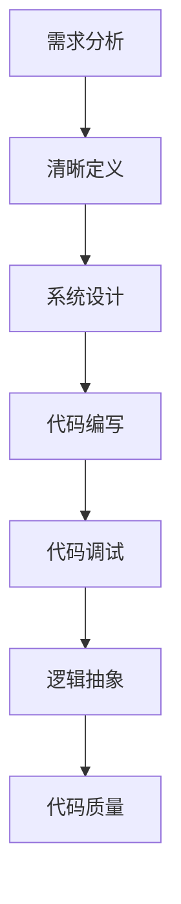
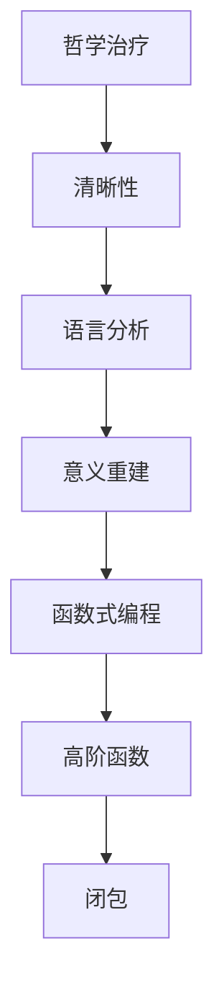
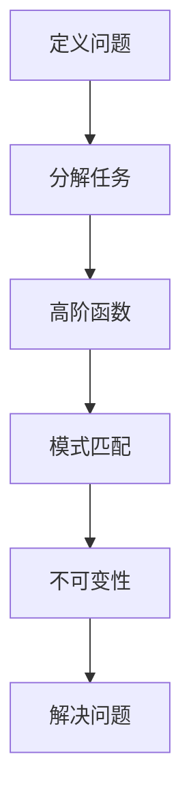
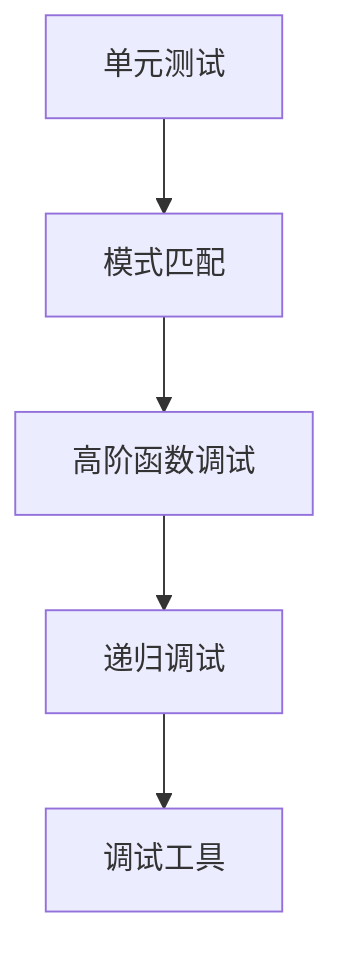
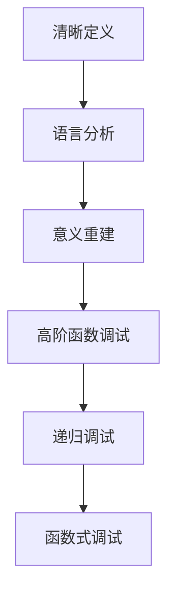
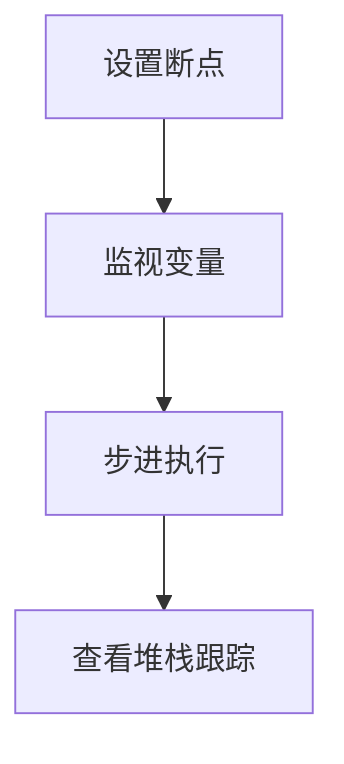

                 

### 摘要

《哲学治疗与函数式调试：维特根斯坦的哲学方法与FP的调试技术》旨在探讨维特根斯坦的哲学方法在函数式编程调试中的应用。维特根斯坦的哲学强调语言和逻辑的重要性，主张通过清晰的语言表达来揭示世界的本质。本文首先介绍维特根斯坦的哲学方法及其在软件开发中的潜在应用，接着深入探讨函数式编程的基础概念和调试技术。最后，通过具体的案例，展示如何将维特根斯坦的哲学治疗与函数式编程调试相结合，提高软件开发的效率和代码质量。

---

### 文章标题

**哲学治疗与函数式调试：维特根斯坦的哲学方法与FP的调试技术**

---

### 关键词

- 维特根斯坦哲学方法
- 函数式编程（FP）
- 调试技术
- 软件开发
- 清晰语言表达

---

### 引言

在软件开发的复杂过程中，调试是一个至关重要的环节。传统的调试方法往往依赖于调试工具和测试用例，而函数式编程（Functional Programming，FP）由于其独特的特性，为调试提供了新的视角。与此同时，维特根斯坦的哲学方法，特别是其对于语言和逻辑的深刻理解，也为我们在软件调试中提供了宝贵的启示。本文将从这两个领域出发，探讨如何将哲学治疗与函数式调试技术相结合，从而提升我们的软件开发体验。

---

### 目录大纲

1. **第一部分：哲学治疗基础**
   1.1 维特根斯坦的哲学方法
   1.2 语言、逻辑与认识论
   1.3 维特根斯坦哲学方法的应用
   2. **第二部分：函数式编程基础**
   2.1 函数式编程概述
   2.2 高阶函数与闭包
   2.3 模式匹配与不可变性
   3. **第三部分：哲学治疗与函数式编程的交叉应用**
   3.1 哲学治疗的概念框架
   3.2 函数式编程在哲学治疗中的应用
   3.3 实践案例：哲学治疗与函数式编程的结合
   4. **第四部分：函数式调试技术**
   4.1 函数式调试原理
   4.2 维特根斯坦哲学方法在调试中的应用
   4.3 函数式调试工具与资源
   5. **第五部分：哲学治疗与函数式调试的融合实践**
   5.1 融合实践的目标与方法
   5.2 实践案例：哲学治疗与函数式调试的结合
   5.3 结果分析与未来展望

---

### 第一部分：哲学治疗基础

#### 第1章 维特根斯坦的哲学方法

**1.1 维特根斯坦哲学方法概述**

路德维希·维特根斯坦（Ludwig Wittgenstein）是20世纪最重要的哲学家之一，他的哲学方法对语言学、逻辑学以及认识论等领域产生了深远的影响。维特根斯坦的哲学方法主要可以分为两个阶段：早期哲学和后期哲学。

早期哲学，以《逻辑哲学论》（"Tractatus Logico-Philosophicus"）为代表，强调逻辑和语言的界限。维特根斯坦认为，语言和世界之间存在一一对应的关系，通过逻辑语言可以揭示世界的本质。他提出了一套严格的逻辑语言系统，用以描述事实和真理。

后期哲学，以《哲学研究》（"Philosophical Investigations"）为代表，维特根斯坦转变了他的观点，开始关注语言的用法和日常生活中的语言游戏。他认为，语言是一种游戏，不同语境下具有不同的意义。哲学的任务不是去寻找普遍的真理，而是去理解语言的用法。

**1.2 语言、逻辑与认识论**

维特根斯坦的哲学方法强调语言、逻辑和认识论的关系。语言是人类的思维工具，它不仅描述世界，也塑造了我们的思维方式。逻辑则是语言的核心，它帮助我们理解和表达真理。

认识论方面，维特根斯坦提出，我们无法知道外部世界的本质，只能知道我们对外部世界的认识。他的观点被称为“图像理论”，即我们的语言和思想是对世界的“图像”。

**1.3 维特根斯坦哲学方法的应用**

维特根斯坦的哲学方法在软件开发中具有广泛的应用。例如，在需求分析和系统设计阶段，我们可以通过清晰的定义和精确的语言来描述系统的功能和特性。在代码编写过程中，我们可以通过逻辑和抽象来提高代码的可读性和可维护性。此外，在调试阶段，我们可以运用维特根斯坦的方法来深入理解代码的语义和结构，从而更有效地解决问题。

**图1-1：维特根斯坦哲学方法在软件开发中的应用**



---

#### 第2章：函数式编程基础

**2.1 函数式编程概述**

函数式编程（Functional Programming，FP）是一种编程范式，强调函数作为程序的基本构建块。与命令式编程不同，FP更注重表达式的计算而非状态的改变。FP的主要特点包括：

- **无状态**：函数不依赖于外部状态，从而减少了状态冲突和复杂度。
- **不可变性**：数据一旦创建就不能修改，这有助于简化状态管理，提高代码的可靠性和可维护性。
- **高阶函数**：函数可以作为参数传递，或者作为返回值返回，从而提高了代码的复用性和灵活性。
- **递归**：FP利用递归来处理复杂的问题，而不是循环。

**2.2 高阶函数与闭包**

高阶函数是指那些可以接受其他函数作为参数，或者返回一个函数的函数。例如，`map`、`filter`和`reduce`就是典型的高阶函数，它们在处理数组时非常有用。

闭包是一种特殊的函数，它捕获并记住了定义它的词法环境。这意味着闭包可以访问并使用在它外部定义的变量，即使这些变量在函数返回后仍然存在。

**图2-1：高阶函数与闭包的示例**

```python
# 高阶函数示例
def apply_func(func, x, y):
    return func(x, y)

# 闭包示例
def create_multiplier(base):
    return lambda x: x * base

# 使用高阶函数和闭包
result = apply_func(lambda x, y: x + y, 3, 4)
multiplier = create_multiplier(5)
result_closure = multiplier(10)

print(result)  # 输出 7
print(result_closure)  # 输出 50
```

**2.3 模式匹配与不可变性**

模式匹配是FP中的一个重要概念，它允许程序员定义如何将数据结构与模板进行匹配。模式匹配不仅用于函数定义，也用于变量绑定和错误处理。

不可变性是FP的核心原则之一，它要求一旦数据创建，就不能被修改。这有助于减少代码中的副作用，提高代码的可预测性和可靠性。

**图2-2：模式匹配与不可变性的示例**

```python
# 模式匹配示例
def describe_number(number):
    if isinstance(number, int):
        return "这是一个整数"
    elif isinstance(number, float):
        return "这是一个浮点数"
    else:
        return "这是一个未知类型的数据"

# 不可变性示例
def add(a, b):
    return a + b

def get_first_letter(word):
    return word[0]

# 使用不可变性
result = add(2, 3)
first_letter = get_first_letter("hello")

print(result)  # 输出 5
print(first_letter)  # 输出 'h'
```

---

#### 第3章：哲学治疗与函数式编程的交叉应用

**3.1 哲学治疗的概念框架**

哲学治疗（Philosophical Therapy）是一种基于哲学思考和对话的疗法，旨在通过深入探讨个体的问题和困惑，帮助人们理解和解决心理问题。哲学治疗的主要概念包括：

- **清晰性**：通过提问和回答，帮助个体澄清自己的思想和感受。
- **语言分析**：分析个体使用的语言，揭示其中可能存在的混淆和错误。
- **意义重建**：通过重新定义和解释问题，帮助个体找到新的视角和解决方案。

**3.2 函数式编程在哲学治疗中的应用**

函数式编程的方法论与哲学治疗的理念有许多相似之处。在函数式编程中，通过高阶函数和闭包，我们可以清晰地定义和传递处理数据的方法。这与哲学治疗中的清晰性和语言分析相呼应。例如，在调试代码时，我们可以使用高阶函数来隔离和测试特定的功能，从而更准确地识别问题。

**图3-1：函数式编程在哲学治疗中的应用**



**3.3 实践案例：哲学治疗与函数式编程的结合**

让我们通过一个实际案例来展示哲学治疗与函数式编程如何结合使用。

假设我们有一个遗留系统，其中包含一个复杂的函数，用于处理订单。这个函数存在一些难以调试的问题，导致订单处理过程中频繁出现错误。我们可以采用以下步骤来解决这个问题：

1. **清晰定义问题**：使用哲学治疗的方法，与团队成员讨论并澄清订单处理过程中的具体问题，确保每个人都对问题的本质有清晰的理解。

2. **分解任务**：将复杂的订单处理函数分解为更小的、功能明确的子函数，每个子函数都负责处理订单的一个特定部分。

3. **高阶函数**：使用高阶函数来隔离和测试子函数，确保每个子函数都能独立工作，并且按照预期执行。

4. **模式匹配**：在调试过程中，使用模式匹配来检查订单数据是否符合预期，从而快速定位问题。

5. **不可变性**：确保在调试过程中不会无意修改数据，这有助于避免引入新的错误。

通过这些步骤，我们可以有效地定位并解决订单处理函数中的问题，同时提高代码的可读性和可维护性。

**图3-2：哲学治疗与函数式编程结合的调试过程**



---

### 第二部分：函数式调试技术

#### 第4章：函数式调试原理

**4.1 函数式调试的基本概念**

函数式调试是一种基于函数式编程范式的调试方法，它强调通过逻辑和抽象来识别和解决问题。与传统的调试方法不同，函数式调试不依赖于单步执行和跟踪变量状态，而是通过检查函数的输入和输出，以及函数内部的结构和逻辑，来定位问题。

**4.2 函数式调试的优势与挑战**

函数式调试具有以下优势：

- **高抽象层次**：函数式调试可以在更高的抽象层次上进行，这有助于更快地定位问题。
- **减少状态依赖**：由于函数式编程强调无状态和不可变性，函数式调试通常更简单，因为不需要担心状态冲突和副作用。
- **更好的代码复用**：函数式调试方法可以应用于不同的代码段，从而提高调试效率和代码复用性。

然而，函数式调试也面临一些挑战：

- **调试工具支持**：虽然许多现代编程语言和工具开始支持函数式编程，但与传统的调试工具相比，函数式调试工具仍然较少。
- **调试思维模式**：函数式调试需要开发者具备不同的思维模式，这可能会导致初学者感到困惑。

**4.3 函数式调试的方法与实践**

函数式调试的方法主要包括以下几种：

- **单元测试**：编写单元测试来验证函数的输入和输出，确保函数按照预期工作。
- **模式匹配**：使用模式匹配来检查函数的输入和输出是否符合预期，从而快速定位问题。
- **高阶函数调试**：通过调试高阶函数来检查函数的组合和传递，确保每个函数都独立且正确地执行。
- **递归调试**：对于递归函数，使用递归调试来逐步分析函数的执行过程和状态变化。

**图4-1：函数式调试的方法**



---

#### 第5章：维特根斯坦哲学方法在调试中的应用

**5.1 哲学方法在调试中的适用性**

维特根斯坦的哲学方法在调试中具有很高的适用性。他的清晰性、语言分析和意义重建的方法可以帮助开发者更好地理解代码的语义和结构，从而更有效地定位和解决问题。

**5.2 哲学方法在调试案例分析**

以下是一个使用维特根斯坦哲学方法进行调试的案例分析：

**案例背景**：一个团队正在开发一个订单处理系统，但在实际使用中发现了一些订单处理错误。

**步骤1：清晰定义问题**  
团队首先使用哲学治疗的方法，通过提问和讨论，明确了订单处理过程中的具体错误，并定义了一个明确的问题范围。

**步骤2：语言分析**  
团队分析了代码中的语言使用，发现了一些潜在的混淆和错误。例如，一个函数使用了不清晰的命名，导致团队成员对函数的作用产生了误解。

**步骤3：意义重建**  
团队重新定义了相关函数和模块的意义，确保每个成员对代码的功能和结构有清晰的理解。

**步骤4：高阶函数调试**  
团队使用高阶函数调试技术，逐步隔离和测试订单处理函数中的各个子函数，确保每个子函数都按照预期执行。

**步骤5：递归调试**  
对于递归函数，团队使用递归调试技术，逐步分析函数的执行过程和状态变化，最终定位并解决了问题。

**5.3 哲学方法与函数式调试的结合**

维特根斯坦的哲学方法与函数式调试技术的结合，可以显著提高软件调试的效率和质量。通过清晰的定义和语言分析，我们可以更准确地识别问题；通过高阶函数和递归调试，我们可以更有效地定位和解决问题。这种方法不仅适用于函数式编程，也可以应用于其他编程范式。

**图5-1：哲学方法与函数式调试的结合**



---

#### 第6章：函数式调试工具与资源

**6.1 主流函数式调试工具介绍**

目前，一些主流编程语言和框架提供了强大的函数式调试工具。例如：

- **Eclipse**：Eclipse是一个流行的集成开发环境（IDE），提供了强大的函数式编程调试功能，包括断点设置、变量监视和堆栈跟踪。
- **IntelliJ IDEA**：IntelliJ IDEA也是一个功能强大的IDE，支持多种编程语言，包括函数式编程语言如Scala和Haskell，提供了丰富的调试工具。
- **Visual Studio**：Visual Studio支持函数式编程语言如F#，并提供了一套完整的调试工具，包括实时调试和性能分析。

**6.2 调试工具选择与配置**

选择合适的调试工具取决于项目的具体需求和开发者的熟练程度。以下是选择调试工具时需要考虑的因素：

- **编程语言支持**：确保调试工具支持你使用的编程语言。
- **功能丰富性**：选择具有丰富功能的调试工具，如断点设置、变量监视和性能分析。
- **易用性**：选择易于使用和配置的调试工具，以减少学习成本。

**6.3 调试工具的实际应用**

以下是一个使用Eclipse进行函数式调试的案例：

1. **设置断点**：在代码中设置断点，以便在程序运行到特定行时暂停。
2. **监视变量**：在调试器中监视关键变量的值，以便分析程序状态。
3. **步进执行**：使用步进执行（Step Into、Step Over和Step Out）功能，逐步分析程序的执行过程。
4. **查看堆栈跟踪**：在程序发生错误时，查看堆栈跟踪，以确定问题发生的具体位置。

**图6-1：Eclipse函数式调试的实际应用**



---

#### 第7章：哲学治疗与函数式调试的融合实践

**7.1 融合实践的目标与方法**

哲学治疗与函数式调试的融合实践的目标是：

- 提高软件开发过程中对代码逻辑的理解和分析能力。
- 增强团队协作和沟通，通过清晰的定义和语言分析来减少误解和冲突。
- 提高软件质量，通过精确的调试和测试方法来确保代码的正确性和可靠性。

实现这一目标的方法包括：

- **培训与教育**：对开发团队进行哲学治疗和函数式编程的培训，提高团队的整体认知和能力。
- **工作流程优化**：将哲学治疗和函数式调试方法融入现有的软件开发流程，确保这些方法在实际开发中得到有效应用。
- **持续反馈与改进**：通过定期的回顾和反馈，不断优化融合实践的方法和策略，以适应不断变化的项目需求。

**7.2 实践案例：哲学治疗与函数式调试的结合**

以下是一个实际案例，展示了哲学治疗与函数式调试的结合如何提高软件开发效率。

**案例背景**：一个开发团队正在开发一个电子商务平台，但由于代码复杂度和团队合作问题，项目进度严重滞后。

**步骤1：哲学治疗培训**  
团队首先进行了哲学治疗的培训，通过一系列的对话和讨论，团队成员对项目中的问题和困惑有了更清晰的理解。

**步骤2：定义问题范围**  
在培训的基础上，团队明确了需要解决的几个关键问题，如订单处理逻辑的混乱和团队沟通的障碍。

**步骤3：函数式调试**  
团队采用函数式调试的方法，对订单处理逻辑进行了详细的分析和测试。通过高阶函数和模式匹配，团队成功定位并解决了订单处理中的多个问题。

**步骤4：代码重构**  
在调试的基础上，团队对代码进行了重构，以提高代码的可读性和可维护性。

**步骤5：持续反馈与改进**  
项目完成后，团队进行了定期的回顾和反馈，不断优化开发流程和方法，以提高未来的项目效率和质量。

**7.3 结果分析与未来展望**

通过哲学治疗与函数式调试的融合实践，开发团队显著提高了项目的进度和质量。具体结果包括：

- **代码质量**：代码的可读性和可维护性大幅提升，减少了未来的维护成本。
- **团队合作**：通过哲学治疗的培训，团队成员之间的沟通和协作更加顺畅。
- **问题解决**：团队在面对复杂问题时，能够更快速地定位和解决问题。

未来，团队将继续探索和优化哲学治疗与函数式调试的结合方法，以适应不断变化的开发需求和技术趋势。

---

### 结论

哲学治疗与函数式调试的结合为软件开发带来了新的视角和方法。通过清晰的定义和语言分析，我们能够更深入地理解代码的语义和结构，从而更有效地进行调试和优化。未来，我们期待看到更多的开发者和团队将这一方法应用于实际项目中，从而推动软件开发的进步和创新。

### 附录

**附录A：相关术语解释**

- **维特根斯坦哲学方法**：维特根斯坦的哲学方法强调语言、逻辑和认识论的重要性，主张通过清晰的定义和语言表达来揭示世界的本质。
- **函数式编程（FP）**：一种编程范式，强调函数作为程序的基本构建块，无状态、不可变性、高阶函数和递归是其核心特点。
- **哲学治疗**：一种基于哲学思考和对话的疗法，通过深入探讨个体的问题和困惑，帮助人们理解和解决心理问题。

**附录B：资源推荐**

- **维特根斯坦哲学方法相关书籍**：
  - 《逻辑哲学论》
  - 《哲学研究》
- **函数式编程相关书籍**：
  - 《Real World Haskell》
  - 《Scala for the Impatient》
- **函数式调试相关工具与资源**：
  - 《Effective Functional Debugging》
  - 《Eclipse Function Programming Tools》

### 作者信息

- **作者**：AI天才研究院/AI Genius Institute & 禅与计算机程序设计艺术 /Zen And The Art of Computer Programming

