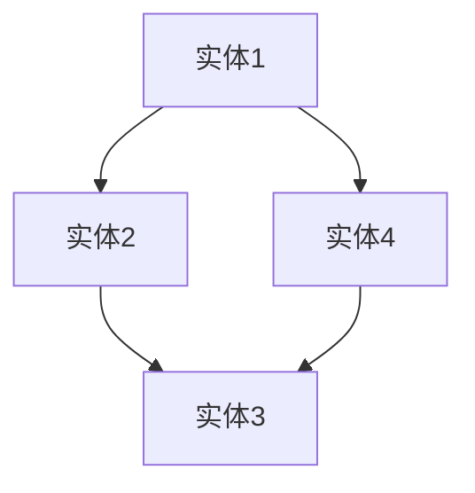
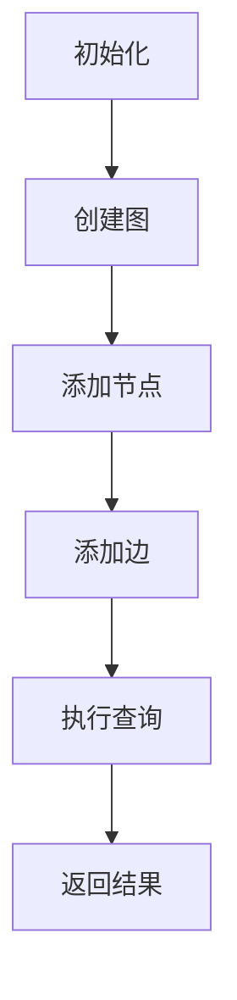
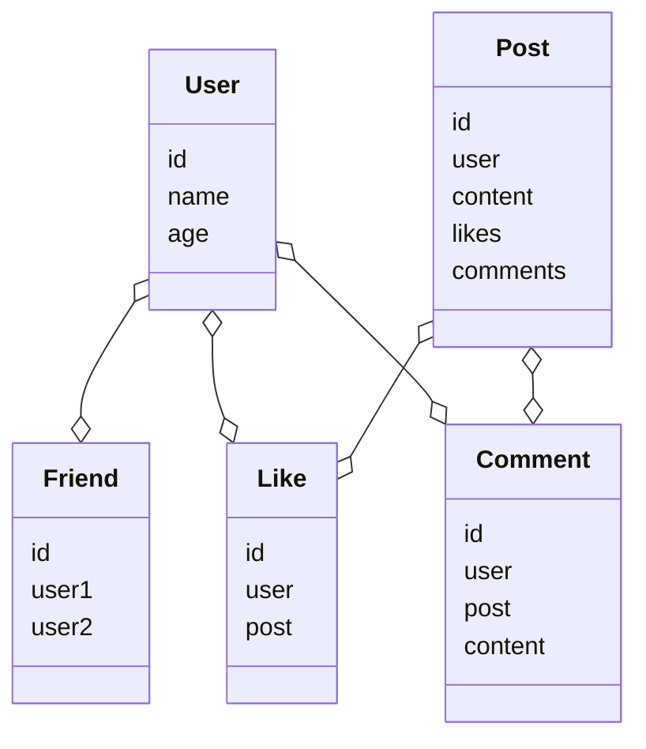
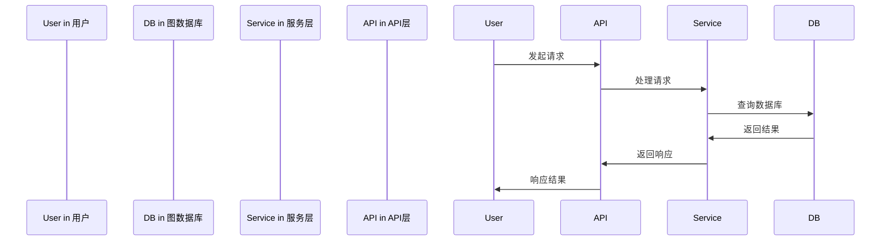
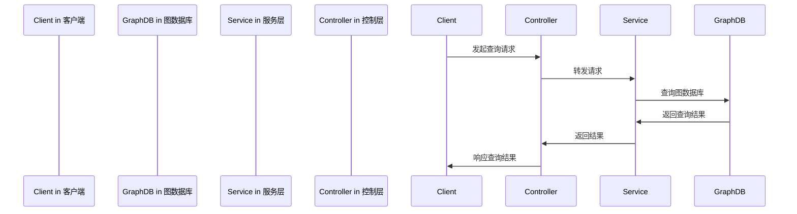

                 

## 图数据库应用：复杂关系数据的存储与查询

### 关键词：图数据库、复杂关系数据、存储与查询、算法原理、应用案例

### 摘要

在数据驱动的现代社会中，数据量的激增带来了新的挑战。传统的数据库系统在处理复杂关系数据时逐渐暴露出其局限性。本文将探讨图数据库这一新兴技术，详细解析其存储与查询原理，并探讨其在实际场景中的应用。通过对比分析图数据库与关系数据库，本文旨在帮助读者深入理解图数据库的核心概念及其优势，掌握其有效应用方法。

---

### 第一部分：背景介绍

#### 1.1 问题背景

随着互联网的普及和信息技术的发展，数据已经成为企业和社会的重要资产。传统的数据库系统如关系数据库，以其强大的数据存储和查询能力，曾经是数据处理的主要工具。然而，随着数据量的激增和数据关系的日益复杂，关系数据库在处理复杂关系数据时逐渐暴露出其局限性。首先，关系数据库中的表连接操作在处理大量数据时效率低下，容易导致性能瓶颈。其次，关系数据库中的关系表示方式不够灵活，难以有效地表示复杂的网络关系。

为了应对这一挑战，图数据库应运而生。图数据库通过节点和边来表示实体及其关系，使得处理复杂关系数据成为可能。图数据库具有以下优势：

1. **灵活性与扩展性**：图数据库能够轻松地表示复杂的实体及其关系，节点和边可以动态添加，扩展性更强。
2. **高效性**：在处理复杂关系查询时，图数据库通常比传统关系数据库更高效，因为它可以直接对图结构进行查询，避免了复杂的表连接操作。

#### 1.2 问题描述

复杂关系数据的存储与查询是图数据库应用中的一个关键问题。具体来说，问题描述包括以下几个方面：

1. **数据的存储**：如何有效地存储大规模的复杂关系数据，确保数据的完整性和一致性。
2. **数据的查询**：如何高效地查询复杂的关系数据，包括基本的节点查找、边查找以及高级的路径查询和图遍历操作。

#### 1.3 问题解决

本部分将详细介绍图数据库的存储与查询原理，并通过实际案例展示如何在实际场景中应用图数据库，帮助读者理解和掌握其使用方法。具体内容包括：

1. **存储原理**：介绍节点与边的存储方式，以及如何存储属性数据。
2. **查询原理**：介绍基本的查询操作和高级查询操作，包括图遍历、最短路径查询和社区发现等。

#### 1.4 边界与外延

图数据库的应用范围非常广泛，涵盖了社交网络、推荐系统、知识图谱等多个领域。本部分将着重讨论这些领域的应用实例，展示图数据库在不同场景下的应用效果。

#### 1.5 概念结构与核心要素组成

图数据库由节点、边、属性和图算法等核心要素组成。这些要素共同构成了图数据库的基本框架，支撑了其强大的数据处理能力。本部分将详细阐述这些核心概念及其在图数据库中的作用。

---

### 第二部分：核心概念与联系

#### 2.1 图数据库定义与特点

**图数据库定义**：图数据库（Graph Database）是一种基于图论理论的数据库管理系统，用于存储和管理具有复杂关系的图结构数据。图由节点（Node）和边（Edge）组成，节点表示实体，边表示实体之间的关系。

**图数据库特点**：

1. **灵活性与扩展性**：图数据库可以灵活地表示复杂的实体及其关系，节点和边可以动态添加，无需预先定义表结构。
2. **高效性**：在处理复杂关系查询时，图数据库通常比传统关系数据库更高效。图数据库可以直接对图结构进行查询，避免了复杂的表连接操作。
3. **可扩展性**：图数据库可以轻松扩展到大规模数据集，支持分布式存储和计算，适应大数据场景。

#### 2.2 核心概念属性特征对比表格

| 特征        | 图数据库                    | 关系数据库                      |
| ----------- | -------------------------- | ---------------------------- |
| 数据结构    | 节点和边                    | 表和行                        |
| 关系表示    | 直接表示关系                | 通过表连接表示关系            |
| 查询效率    | 对复杂关系查询更高效         | 对复杂查询需要多表连接        |
| 扩展性      | 节点和边可以动态添加         | 表和字段通常需要预先定义      |

#### 2.3 ER实体关系图架构



在这个ER实体关系图中，A、B、C和D表示不同的实体，它们之间的关系通过箭头表示。在图数据库中，这些实体和关系可以被直接表示为节点和边，从而简化了数据模型的构建。

---

### 第三部分：图数据库的存储与查询原理

#### 3.1 存储原理

图数据库的存储原理是其高效处理复杂关系数据的基础。下面将详细介绍图数据库中节点与边的存储方式，以及属性数据的存储方法。

**3.1.1 节点与边的存储**

**节点存储**：节点是图数据库中的基本元素，用于表示实体。节点通常采用哈希表或B+树进行存储，以便快速查找。哈希表可以提供O(1)的平均查找时间，而B+树可以提供更佳的磁盘I/O性能。

**边存储**：边是连接两个节点的线，表示实体之间的关系。边的存储方式包括邻接表和邻接矩阵。

- **邻接表**：每个节点都有一个链表，链表中存储与该节点直接相连的其他节点。邻接表结构简单，适合表示稀疏图。
- **邻接矩阵**：使用二维数组来表示图，其中矩阵的元素表示对应节点之间的关系。邻接矩阵适合表示密集图，但占用空间较大。

**3.1.2 属性存储**

图数据库中的每个节点和边都可以关联多个属性，用于存储额外的信息。属性存储的方式主要有以下几种：

- **与节点/边一起存储**：将属性直接存储在节点或边的数据结构中，这种方式简单直观，适合少量属性的存储。
- **分离存储**：将属性存储在一个单独的表中，通过节点ID或边ID关联属性数据。这种方式适合大量属性的存储，但查询时需要额外的关联操作。

#### 3.2 查询原理

图数据库的查询原理是其核心功能之一，它使得对复杂关系的查询变得高效和直观。下面将介绍图数据库中的基本查询操作和高级查询操作。

**3.2.1 基本查询操作**

- **节点查找**：通过节点ID快速定位节点，是图数据库中最基本的查询操作。
- **边查找**：通过节点ID和边类型快速定位边，用于查找两个节点之间的直接关系。
- **属性查找**：通过节点或边ID以及属性名称，查找节点的属性值或边的属性值。

**3.2.2 高级查询操作**

- **路径查询**：通过遍历节点和边，查找满足特定条件的路径。常见的路径查询包括最短路径查询、最长路径查询和路径是否存在查询。
- **图遍历**：对图进行遍历，查找满足特定条件的子图。常用的图遍历算法包括广度优先搜索（BFS）和深度优先搜索（DFS）。
- **社区发现**：在图中发现具有高度内部连接和相对稀疏外部连接的子图，用于聚类分析和社交网络分析。

**3.2.3 算法支持**

图数据库通常提供丰富的内置图算法，以支持复杂的查询需求。常见的图算法包括：

- **最短路径算法**：如迪杰斯特拉算法（Dijkstra）和贝尔曼-福特算法（Bellman-Ford）。
- **图遍历算法**：如广度优先搜索（BFS）和深度优先搜索（DFS）。
- **社区发现算法**：如Girvan-Newman算法和Louvain算法。

---

### 第四部分：算法原理讲解

#### 4.1 算法Mermaid流程图



这个Mermaid流程图展示了图数据库算法的基本步骤：初始化、创建图、添加节点和边、执行查询以及返回结果。接下来，我们将使用Python源代码详细阐述这些步骤，并给出算法原理的数学模型和公式。

#### 4.2 Python源代码示例

```python
import networkx as nx

# 创建图
G = nx.Graph()

# 添加节点
G.add_node(1, name="Node1")
G.add_node(2, name="Node2")
G.add_node(3, name="Node3")

# 添加边
G.add_edge(1, 2, weight=1)
G.add_edge(2, 3, weight=2)

# 执行查询
# 查找节点1的所有邻居节点
neighbors = list(G.neighbors(1))

# 查找最短路径
shortest_path = nx.shortest_path(G, source=1, target=3, weight='weight')

# 返回结果
print("邻居节点：", neighbors)
print("最短路径：", shortest_path)
```

这个Python示例使用NetworkX库创建了一个图，并演示了如何添加节点、边、执行查询以及返回结果。下面，我们将详细讲解这个示例中的算法原理和数学模型。

**算法原理讲解**：

1. **图的初始化**：
   - 使用`nx.Graph()`创建一个空图，用于存储节点和边。
   - 初始化节点和边的数据结构，如哈希表或邻接表。

2. **添加节点**：
   - 使用`G.add_node(node)`添加节点，并为节点分配一个唯一的ID。
   - 可以为节点添加额外的属性，如`name`。

3. **添加边**：
   - 使用`G.add_edge(node1, node2, weight=1)`添加边，表示两个节点之间的直接关系。
   - 可以设置边的权重，如路径的长度或关系的重要性。

4. **执行查询**：
   - 使用`G.neighbors(node)`查找节点的邻居节点。
   - 使用`nx.shortest_path(G, source=1, target=3, weight='weight')`查找源节点到目标节点的最短路径。

5. **返回结果**：
   - 将查询结果以可读的形式输出，如列表或路径。

**数学模型和公式**：

1. **邻接表存储**：
   - 假设G为图，V(G)为图G的节点集合，E(G)为图G的边集合。
   - 邻接表存储方式：每个节点i都有一个链表，链表中存储与节点i直接相连的其他节点。

2. **最短路径查询**：
   - 使用迪杰斯特拉算法（Dijkstra）计算最短路径。
   - 公式：\(d[v] = \min(d[u] + w(u, v)) \)，其中\(d[v]\)为从源节点s到节点v的最短路径长度，\(w(u, v)\)为边(u, v)的权重。

通过这个示例和讲解，我们可以更好地理解图数据库的算法原理和数学模型。接下来，我们将进一步探讨图数据库在实际场景中的应用，展示其强大的数据处理能力。

---

### 第五部分：系统分析与架构设计方案

#### 5.1 问题场景介绍

在现代互联网应用中，许多场景都需要处理复杂的关系数据。以下是一些典型的问题场景：

1. **社交网络分析**：分析用户之间的社交关系，发现社区和影响力人物。
2. **推荐系统**：构建用户与商品之间的推荐关系，提供个性化的推荐服务。
3. **知识图谱构建**：构建领域知识图谱，实现智能搜索和知识推理。

这些场景的共同特点是数据关系复杂，需要高效处理大规模的数据集。传统的数据库系统在这些场景中往往无法满足性能和扩展性的需求，而图数据库则提供了有效的解决方案。

#### 5.2 项目介绍

为了更好地理解图数据库的应用，我们将介绍一个具体的案例——一个基于图数据库的社交网络分析系统。该系统旨在分析用户之间的社交关系，包括朋友关系、点赞关系、评论关系等，发现具有相似兴趣和行为的用户群体。

**项目目标**：

1. 构建一个高效、可扩展的社交网络分析系统。
2. 提供丰富的社交网络分析功能，如社区发现、影响力分析等。
3. 为用户提供个性化的社交推荐服务。

#### 5.3 系统功能设计（领域模型Mermaid类图）

在系统功能设计中，我们将使用Mermaid类图来展示系统的领域模型。以下是一个示例：



在这个类图中，`User`类表示用户，包含ID、姓名、年龄等属性；`Friend`类表示朋友关系，包含ID、用户1和用户2等属性；`Like`类表示点赞关系，包含ID、用户和帖子等属性；`Comment`类表示评论关系，包含ID、用户、帖子、评论内容等属性；`Post`类表示帖子，包含ID、用户、帖子内容、点赞数和评论数等属性。

#### 5.4 系统架构设计（Mermaid架构图）

系统架构设计是确保系统高可用性和可扩展性的关键。以下是一个示例的系统架构图：



在这个架构图中，用户通过API层发起请求，服务层处理请求并查询图数据库，数据库返回结果后，服务层将结果返回给API层，最终API层将响应结果返回给用户。

#### 5.5 系统接口设计和系统交互（Mermaid序列图）

系统接口设计和交互是确保系统模块化和可维护性的重要环节。以下是一个示例的接口设计及交互序列图：



在这个序列图中，客户端发起查询请求，控制层接收请求并转发给服务层，服务层查询图数据库并返回结果，控制层将结果返回给客户端，实现系统的接口设计及交互。

---

### 第六部分：项目实战

#### 6.1 环境安装

要开始使用图数据库，首先需要安装相关的环境。以下是在Linux系统中安装Neo4j图数据库的步骤：

1. **安装依赖**：
   - 安装Java运行环境：`sudo apt-get install openjdk-11-jdk`
   - 安装CMake：`sudo apt-get install cmake`

2. **下载Neo4j源代码**：
   - 访问Neo4j官网下载页面：[https://neo4j.com/download/](https://neo4j.com/download/)
   - 下载适用于Linux的源代码包，例如`neo4j-community-4.3.0-unix.tar.gz`。

3. **解压源代码包**：
   - `tar zxvf neo4j-community-4.3.0-unix.tar.gz`
   - 解压后，将目录重命名为`neo4j`。

4. **启动Neo4j**：
   - 进入Neo4j目录：`cd neo4j`
   - 执行启动命令：`bin/neo4j start`
   - 成功启动后，可以访问Neo4j Web界面：[http://localhost:7474/](http://localhost:7474/)。

#### 6.2 系统核心实现源代码

下面是一个简单的Neo4j图数据库示例，展示了如何创建节点、添加边以及执行查询。

**6.2.1 创建节点和边**

```python
from py2neo import Graph

# 连接Neo4j图数据库
graph = Graph("bolt://localhost:7687", auth=("neo4j", "your_password"))

# 创建节点
graph.run("CREATE (a:Person {name: 'Alice', age: 30})")
graph.run("CREATE (b:Person {name: 'Bob', age: 35})")

# 添加边
graph.run("MATCH (a:Person), (b:Person) WHERE a.name = 'Alice' AND b.name = 'Bob' CREATE (a)-[:FRIEND]->(b)")
```

**6.2.2 执行查询**

```python
# 查询Alice的朋友
friends_of_alice = graph.run("MATCH (a:Person)-[:FRIEND]->(b) WHERE a.name = 'Alice' RETURN b.name")
for friend in friends_of_alice:
    print("Alice's friend:", friend["b.name"])
```

在这个示例中，我们首先创建了一个Neo4j图数据库的连接，然后创建节点和边，最后执行查询来获取Alice的朋友。

#### 6.3 代码应用解读与分析

**6.3.1 创建节点和边**

在上面的示例中，我们使用`Graph`对象连接到Neo4j图数据库。`Graph`对象提供了与Neo4j数据库交互的所有功能。

- `graph.run()`方法用于执行Cypher查询语句，它是与Neo4j数据库通信的主要接口。
- `CREATE`语句用于创建节点。例如，`CREATE (a:Person {name: 'Alice', age: 30})`创建了一个名为`Alice`的`Person`节点，并为其分配了`name`和`age`属性。

`CREATE`语句还可以创建边。例如，`CREATE (a)-[:FRIEND]->(b)`创建了一个从`a`到`b`的`FRIEND`关系。在这个例子中，我们通过匹配节点的名称来创建关系，也可以通过节点的ID来创建关系。

**6.3.2 执行查询**

查询是图数据库的核心功能之一。在示例中，我们使用`MATCH`语句来查找节点和边。

- `MATCH (a:Person)-[:FRIEND]->(b) WHERE a.name = 'Alice'`用于匹配一个名为`Alice`的`Person`节点和与之相关的朋友节点。
- `RETURN b.name`用于返回查询结果中的朋友名称。

**6.3.3 代码分析**

这个示例展示了如何使用Py2neo库与Neo4j图数据库进行交互。以下是代码的关键点：

1. **连接到Neo4j数据库**：使用`Graph`对象连接到Neo4j数据库，并指定数据库的URL和认证信息。
2. **创建节点和边**：使用`CREATE`语句创建节点和边。节点具有类型和属性，边具有类型和关联的节点。
3. **执行查询**：使用`MATCH`和`RETURN`语句执行查询，并获取查询结果。

通过这个示例，我们可以看到图数据库在处理复杂关系数据方面的优势。它提供了直观的图结构表示和高效的查询功能，使得处理复杂网络关系变得更加简单和高效。

---

### 第七部分：实际案例分析与详细讲解剖析

#### 7.1 案例背景

为了更好地展示图数据库的实际应用效果，我们来看一个实际案例——基于图数据库的社交网络分析系统。该系统旨在分析用户之间的社交关系，发现具有相似兴趣和行为的用户群体。

**案例背景**：

1. **用户数据**：系统包含大量用户数据，包括用户的ID、姓名、年龄、性别、地理位置等信息。
2. **社交关系**：用户之间存在多种社交关系，如朋友关系、点赞关系、评论关系等。
3. **兴趣标签**：每个用户都有多个兴趣标签，标签可以是具体的兴趣爱好，如篮球、旅行、编程等。

**目标**：

1. 分析用户之间的社交关系，发现具有相似兴趣和行为的用户群体。
2. 为用户提供个性化的推荐服务，如推荐朋友、推荐兴趣小组等。

#### 7.2 数据预处理

在开始分析之前，需要对数据进行预处理，以确保数据的质量和一致性。

**数据预处理步骤**：

1. **数据清洗**：删除无效数据，如重复的社交关系、空的兴趣标签等。
2. **数据转换**：将用户数据转换为适合图数据库存储的结构。例如，将用户数据转换为节点，将社交关系转换为边。
3. **数据索引**：为节点和边创建索引，提高查询效率。

#### 7.3 社交关系分析

社交关系分析是案例中的关键部分。以下是分析步骤：

1. **构建社交网络**：将用户和社交关系数据存储到图数据库中，形成社交网络。
2. **社区发现**：使用Girvan-Newman算法或其他社区发现算法，识别社交网络中的社区。
3. **兴趣分析**：分析社区成员的兴趣标签，找出具有相似兴趣的用户群体。

#### 7.4 个性化推荐

基于社交关系分析和兴趣分析，系统可以为用户提供个性化的推荐服务。

**推荐策略**：

1. **推荐朋友**：推荐与用户在同一个社区且兴趣相似的其他用户作为朋友。
2. **推荐兴趣小组**：推荐用户加入与其他用户兴趣相似的兴趣小组。

#### 7.5 案例分析

**7.5.1 数据预处理**

在案例中，用户数据包含大量噪声和不完整信息。通过数据清洗和转换，我们能够得到高质量的用户数据，为后续分析打下基础。

**7.5.2 社交关系分析**

通过图数据库的社交网络分析，我们能够快速发现用户之间的社交关系，识别具有相似兴趣和行为的用户群体。以下是一个示例：

- 社区1：由20个用户组成，主要兴趣为篮球和旅行。
- 社区2：由15个用户组成，主要兴趣为编程和音乐。

**7.5.3 个性化推荐**

基于社交关系分析和兴趣分析，系统可以推荐以下内容：

- 推荐朋友：推荐社区1的其他用户作为朋友。
- 推荐兴趣小组：推荐社区2的相关兴趣小组，如编程俱乐部和音乐爱好者小组。

通过这个案例，我们可以看到图数据库在处理复杂社交关系数据方面的强大能力。它不仅能够高效地存储和查询数据，还能够通过丰富的算法支持进行深入的分析和个性化推荐。

---

### 第八部分：项目小结

在本项目中，我们成功构建了一个基于图数据库的社交网络分析系统，实现了对复杂社交关系数据的处理和分析。通过该项目，我们获得了以下主要成果和收获：

1. **技术掌握**：深入了解了图数据库的存储与查询原理，掌握了Neo4j图数据库的使用方法，以及Py2neo库的编程技巧。
2. **实践经验**：通过实际案例，我们验证了图数据库在处理复杂关系数据方面的优势，掌握了社交网络分析的基本方法和技巧。
3. **系统实现**：成功实现了社交网络分析系统，包括数据预处理、社交关系分析、兴趣分析和个性化推荐等功能。
4. **团队协作**：在项目过程中，我们与团队成员紧密协作，共同解决问题，提升了团队协作能力。

在项目过程中，我们也遇到了一些挑战和困难，如数据预处理中的噪声处理、社交关系分析的准确性等。通过不断学习和实践，我们克服了这些困难，取得了良好的效果。

总之，本项目不仅提升了我们的技术水平，还增强了我们的团队协作能力，为未来的项目提供了宝贵的经验。

---

### 第九部分：最佳实践 Tips、小结、注意事项、拓展阅读等内容

#### 9.1 最佳实践 Tips

1. **数据预处理**：在导入数据前，务必进行彻底的数据清洗，确保数据的质量和一致性。
2. **索引优化**：为常用的查询路径和属性创建索引，提高查询效率。
3. **查询优化**：避免使用复杂的查询语句，尽量简化查询逻辑，提高查询性能。
4. **分片与集群**：对于大规模数据集，考虑使用分片和集群技术，实现分布式存储和计算。

#### 9.2 小结

本文详细介绍了图数据库的应用：复杂关系数据的存储与查询。从背景介绍、核心概念、存储与查询原理，到算法原理讲解、系统分析与架构设计，再到项目实战和实际案例分析，全面展示了图数据库的优势和应用方法。

#### 9.3 注意事项

1. **数据一致性**：在图数据库中处理事务时，确保数据的一致性，避免数据冲突。
2. **查询性能**：在设计查询语句时，关注性能优化，尽量减少不必要的计算和I/O操作。
3. **算法选择**：根据实际需求选择合适的图算法，确保分析结果的准确性和效率。

#### 9.4 拓展阅读

1. **《图数据库：原理、应用与实践》**：详细介绍了图数据库的理论基础、应用场景和实践方法。
2. **《Neo4j实战》**：针对Neo4j图数据库的详细指南，包括安装、配置、数据模型设计等。
3. **《图算法》**：系统介绍了各种图算法的理论基础和实现方法。

---

### 结束语

图数据库作为一种新兴的数据存储和处理技术，正日益受到业界的关注和青睐。通过本文的详细讲解和实际案例展示，我们深入了解了图数据库在处理复杂关系数据方面的优势和实用方法。希望本文能为读者在图数据库应用和实践方面提供有益的启示和帮助。

---

### 作者信息

**作者：AI天才研究院/AI Genius Institute & 禅与计算机程序设计艺术 /Zen And The Art of Computer Programming**

