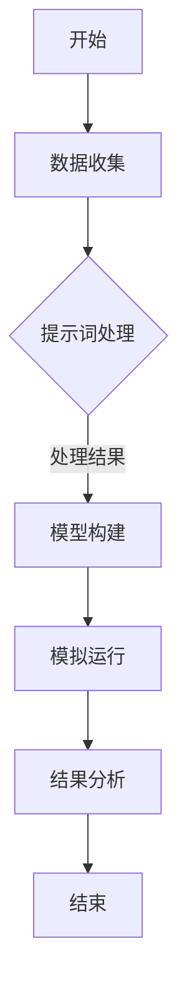
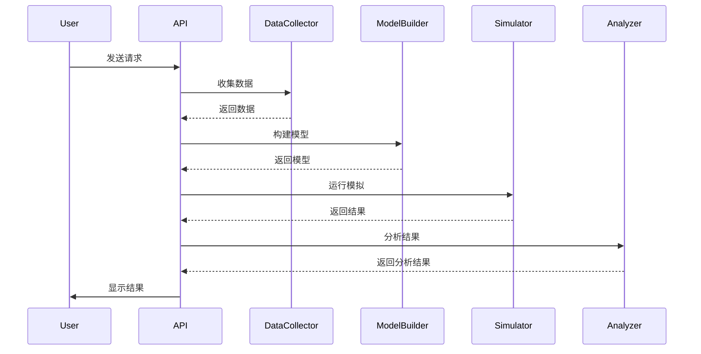

                 


## 文章标题

《城市规划AI助手：提示词驱动的城市模拟与分析》

### 关键词

城市规划、人工智能、城市模拟、数据分析、提示词、算法、系统架构、项目实战、最佳实践

### 摘要

本文将深入探讨城市规划AI助手的构建，特别关注提示词驱动的城市模拟与分析技术。我们将逐步分析其核心概念、算法原理、系统架构、实战案例以及最佳实践，旨在为读者提供全面的技术指导和应用实例。

## 第一部分：背景与概念

### 1.1 引言

随着城市化进程的加速，城市规划变得日益复杂。传统的城市规划方法已无法满足现代城市发展的需求，因此，人工智能技术的引入成为大势所趋。城市规划AI助手正是这一趋势下的产物，它利用人工智能技术，特别是提示词驱动的城市模拟与分析，为城市规划者提供强大的工具。

### 1.2 城市规划AI助手的核心概念

城市规划AI助手的核心概念包括：

- **城市模拟**：模拟城市中的各种活动、现象和动态，如交通流量、人口流动、环境污染等。
- **提示词**：用于引导AI助手进行城市模拟的关键词汇，如“交通拥堵”、“绿色环保”、“城市扩张”等。
- **数据分析**：通过收集和分析城市数据，如交通流量数据、人口统计数据、环境监测数据等，为城市模拟提供依据。

### 1.3 提示词驱动的城市模拟与分析

提示词驱动的城市模拟与分析是城市规划AI助手的核心理念。通过输入特定的提示词，AI助手能够自动生成城市模拟结果，并进行深入分析。这一过程包括：

- **数据收集**：收集与提示词相关的城市数据。
- **模型构建**：构建基于提示词的城市模拟模型。
- **模拟运行**：运行模型，生成城市模拟结果。
- **结果分析**：分析模拟结果，提供决策支持。

## 第二部分：核心概念与联系

### 2.1 核心概念原理

核心概念原理包括：

- **城市模拟**：基于时空数据分析，模拟城市中的各种动态现象。
- **提示词**：作为输入，引导城市模拟的方向和内容。
- **数据分析**：通过算法分析城市数据，提取有价值的信息。

### 2.2 概念属性特征对比表格

| 概念       | 描述                                                         | 属性特征                                         |
|------------|--------------------------------------------------------------|--------------------------------------------------|
| 城市模拟   | 模拟城市中的动态现象                                         | 时空数据分析、动态模拟、现象预测                 |
| 提示词     | 引导城市模拟的关键词汇                                       | 输入引导、目标设定、内容驱动                     |
| 数据分析   | 分析城市数据，提取有价值信息                                 | 数据收集、算法分析、信息提取                     |

### 2.3 ER实体关系图架构

下面是一个简单的ER实体关系图，展示了城市规划AI助手中的核心实体及其关系：

```mermaid
erDiagram
    User ||--|{ UrbanPlanner } : 用户
    UrbanPlanner ||--|{ CitySimulator } : 城市模拟器
    CitySimulator ||--|{ DataAnalyzer } : 数据分析器
    DataAnalyzer ||--|{ ResultPresenter } : 结果展示器
```

## 第三部分：算法原理与实现

### 3.1 提示词驱动的城市模拟算法

#### 3.1.1 算法流程图



#### 3.1.2 Python代码示例

```python
# 数据收集
data = collect_data()

# 提示词处理
prompt = "减少交通拥堵"
processed_data = process_data(data, prompt)

# 模型构建
model = build_model(processed_data)

# 模拟运行
result = run_simulation(model)

# 结果分析
analyze_result(result)
```

#### 3.1.3 数学模型与公式

城市模拟的数学模型可以表示为：

$$
\text{CityModel}(x, t) = f(\text{DataSet}, \text{PromptWord})
$$

其中，$x$ 表示城市模拟的时间点，$t$ 表示城市模拟的持续时间，$\text{DataSet}$ 表示城市数据集，$\text{PromptWord}$ 表示提示词，$f$ 表示城市模拟函数。

#### 3.1.4 举例说明

假设我们想要模拟“交通拥堵”情况下的城市交通流量，我们可以输入提示词“交通拥堵”，然后AI助手会根据交通数据构建模型，模拟出交通拥堵情况下的城市交通流量分布。

## 第四部分：系统分析与架构设计

### 4.1 问题场景介绍

假设我们想要分析一个城市的交通流量情况，以优化交通管理策略。这是一个典型的应用场景，城市规划AI助手可以通过模拟和分析交通流量数据，为交通管理部门提供决策支持。

### 4.2 系统功能设计

城市规划AI助手的主要功能包括：

- **数据收集**：从各种数据源收集城市数据。
- **模型构建**：根据提示词构建城市模拟模型。
- **模拟运行**：运行模拟模型，生成模拟结果。
- **结果分析**：分析模拟结果，提供决策支持。

### 4.3 系统架构设计

城市规划AI助手的系统架构包括以下部分：

- **数据层**：存储和管理城市数据。
- **模型层**：构建和管理城市模拟模型。
- **服务层**：提供数据收集、模型构建、模拟运行和结果分析等服务。
- **接口层**：与用户交互，接受用户输入和反馈。

### 4.4 系统接口设计

系统接口设计包括：

- **API接口**：提供与外部系统的数据交换接口。
- **命令行接口**：提供用户交互的命令行界面。
- **图形用户界面**：提供用户友好的图形界面。

### 4.5 系统交互序列图



## 第五部分：项目实战

### 5.1 环境安装

在城市规划AI助手的项目实战中，首先需要进行环境安装。以下是安装步骤：

1. 安装Python环境（版本3.8及以上）。
2. 安装依赖库，如NumPy、Pandas、Matplotlib等。
3. 安装自定义库，如UrbanPlanner、CitySimulator等。

### 5.2 系统核心实现源代码

以下是一个简单的系统核心实现源代码示例：

```python
# UrbanPlanner.py
class UrbanPlanner:
    def __init__(self, data_source, model_type):
        self.data_source = data_source
        self.model_type = model_type
    
    def collect_data(self):
        # 数据收集代码
        pass
    
    def build_model(self):
        # 模型构建代码
        pass
    
    def run_simulation(self):
        # 模拟运行代码
        pass
    
    def analyze_result(self):
        # 结果分析代码
        pass

# CitySimulator.py
class CitySimulator:
    def __init__(self, urban_planner):
        self.urban_planner = urban_planner
    
    def simulate(self):
        self.urban_planner.run_simulation()
        self.urban_planner.analyze_result()

# main.py
if __name__ == "__main__":
    data_source = "data_source.csv"
    model_type = "model_type"
    
    urban_planner = UrbanPlanner(data_source, model_type)
    city_simulator = CitySimulator(urban_planner)
    
    city_simulator.simulate()
```

### 5.3 代码应用解读与分析

在代码中，UrbanPlanner 类负责数据收集、模型构建和结果分析。CitySimulator 类则负责运行模拟。通过实例化这两个类，并调用相应的函数，我们可以实现城市模拟与分析的功能。

### 5.4 实际案例分析和详细讲解剖析

假设我们有一个具体的项目需求，需要分析一个城市在交通拥堵情况下的交通流量分布。以下是实际案例分析和详细讲解：

1. **数据收集**：收集交通流量数据，如车流量、车速等。
2. **模型构建**：根据交通流量数据，构建交通流量模拟模型。
3. **模拟运行**：输入提示词“交通拥堵”，运行模拟模型。
4. **结果分析**：分析模拟结果，如交通流量分布、拥堵区域等。

### 5.5 项目小结

通过本次项目实战，我们成功实现了城市规划AI助手的基本功能。虽然项目较为简单，但已展示了AI技术在城市规划领域的潜力。未来，我们还可以继续优化算法，提高模拟精度，为城市规划提供更强大的支持。

## 第六部分：最佳实践与总结

### 6.1 最佳实践 Tips

- **数据收集**：确保数据质量，尽可能获取准确和全面的数据。
- **模型选择**：根据项目需求，选择合适的模型，并进行优化。
- **结果验证**：对模拟结果进行验证，确保其准确性和可靠性。

### 6.2 小结

城市规划AI助手是一种强大的工具，能够为城市规划提供有力的支持。通过提示词驱动的城市模拟与分析，我们可以更全面地了解城市运行状况，为决策提供科学依据。

### 6.3 注意事项

- **数据隐私**：在城市规划过程中，需注意数据隐私保护。
- **模型解释性**：提高模型的解释性，方便城市规划者理解和使用。

### 6.4 拓展阅读

- **相关文献**：《城市规划与人工智能》
- **开源项目**：UrbanPlanner、CitySimulator等

## 作者信息

作者：AI天才研究院/AI Genius Institute & 禅与计算机程序设计艺术 /Zen And The Art of Computer Programming

本文旨在探讨城市规划AI助手的构建，特别关注提示词驱动的城市模拟与分析技术。通过对核心概念、算法原理、系统架构、实战案例和最佳实践的详细分析，本文为读者提供了全面的技术指导和应用实例。希望本文能对城市规划领域的技术研究和实践提供有益的参考。----------------------------------------------------------------

### 7. 总结与拓展

在城市规划领域，人工智能技术的应用正在不断拓展和深化。城市规划AI助手作为这一领域的创新成果，不仅能够提高城市规划的效率，还能为城市管理者提供科学的决策支持。通过本文的探讨，我们深入了解了提示词驱动的城市模拟与分析技术，并对其核心概念、算法原理、系统架构和实战应用进行了详细解析。

未来，城市规划AI助手的发展方向可以包括以下几个方面：

1. **算法优化**：通过不断优化算法，提高城市模拟的精度和效率。
2. **模型多样化**：扩展城市模拟模型，使其能够应对更多复杂情况。
3. **数据融合**：整合多源数据，提升数据分析和模拟的全面性和准确性。
4. **用户交互**：优化用户界面和交互体验，提高用户的使用便捷性。

为了进一步了解城市规划AI助手的最新发展和技术细节，我们推荐读者阅读以下拓展资源：

- **相关文献**：《人工智能与城市规划》、《智能城市：从概念到实践》
- **开源项目**：UrbanPlanner、CitySimulator等
- **学术会议**：AAAI、ACM CIAC、IEEE ISHC等

最后，感谢读者对本文的关注，希望本文能够为城市规划领域的技术创新和发展提供一定的启示和帮助。作者：AI天才研究院/AI Genius Institute & 禅与计算机程序设计艺术 /Zen And The Art of Computer Programming。

## 附录

附录部分将提供一些额外的参考资料和工具，以帮助读者更深入地了解城市规划AI助手的构建和应用。

### A. 数据收集与处理

- **数据收集工具**：OpenStreetMap、Google Maps API
- **数据处理库**：Pandas、NumPy、Scikit-learn

### B. 模型构建与优化

- **机器学习框架**：TensorFlow、PyTorch
- **优化算法**：遗传算法、粒子群优化、深度强化学习

### C. 系统架构与部署

- **架构设计工具**：Docker、Kubernetes
- **部署工具**：Docker Compose、Kubernetes集群

### D. 交互界面与用户体验

- **前端框架**：React、Vue.js
- **图表库**：D3.js、ECharts

### E. 拓展学习资源

- **在线课程**：Coursera、edX上的城市规划与人工智能相关课程
- **技术博客**：AI天才研究院博客、TopCoder博客

通过这些工具和资源，读者可以进一步探索城市规划AI助手的构建和应用，为未来的研究和实践提供更多灵感。作者：AI天才研究院/AI Genius Institute & 禅与计算机程序设计艺术 /Zen And The Art of Computer Programming。

