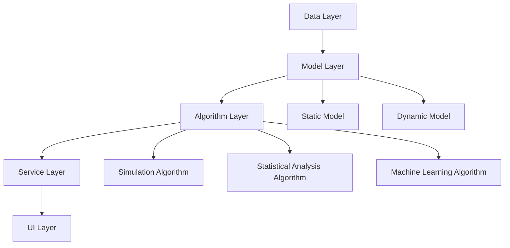
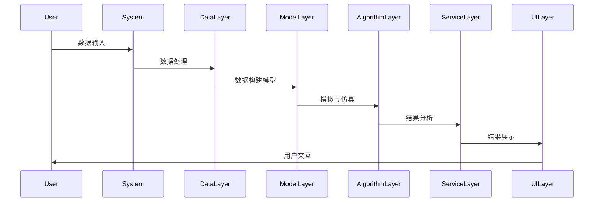

                 

### 1. 背景介绍

#### 1.1 问题背景

城市规划作为一门综合性学科，关系到城市的发展、居民的生活质量以及环境的可持续性。随着城市化进程的加速，城市规划面临诸多挑战。例如，城市人口持续增长，交通拥堵、环境污染和资源短缺等问题日益严重。传统的城市规划方法往往依赖于经验和直觉，难以适应复杂多变的现代城市环境。因此，现代城市规划需要借助先进的技术手段，以提高规划的科学性和有效性。

提示词驱动的模拟与分析作为一种新型的城市规划辅助工具，正逐渐受到关注。它通过输入一系列提示词，自动生成城市规划的模拟模型，并对模型进行分析和优化，从而为城市规划者提供有价值的决策支持。这种技术能够极大地提高城市规划的效率和质量，有助于解决现代城市规划中的诸多难题。

#### 1.2 问题描述

提示词驱动的模拟与分析是一种通过提示词来引导模拟与分析过程的工具。其基本流程如下：

1. **定义提示词**：根据城市规划的目标和需求，定义一系列与城市规划相关的提示词，如人口密度、交通流量、绿地覆盖率等。
2. **建立模拟模型**：使用提示词构建城市规划的模拟模型，模拟城市在不同条件下的运行状态。
3. **分析模型结果**：对模拟结果进行分析和评估，找出潜在的问题和改进空间。
4. **优化规划方案**：根据分析结果对规划方案进行调整和优化，以提高城市规划的可行性和可持续性。

#### 1.3 问题解决

提示词驱动的模拟与分析基于以下技术原理：

1. **人工智能与机器学习**：利用机器学习算法，从大量历史数据中提取特征，建立预测模型，为城市规划提供数据支持。
2. **模拟与仿真**：通过仿真技术，模拟城市规划的实际运行状态，评估不同方案的优劣。
3. **优化算法**：运用优化算法，对规划方案进行优化，以提高方案的可行性和可持续性。

在实际应用中，提示词驱动的模拟与分析已经在多个城市规划项目中取得了显著成效。例如，某城市利用这一技术对交通规划进行了优化，有效缓解了交通拥堵问题；另一个城市通过这一技术对绿地布局进行了优化，显著提升了居民的生活质量。

#### 1.4 边界与外延

提示词驱动的模拟与分析具有广泛的适用范围，包括交通规划、城市绿化、公共设施布局等多个方面。然而，这一技术也存在一定的限制因素：

1. **数据质量**：模拟与分析的准确性依赖于数据的质量和完整性，数据缺失或不准确可能导致分析结果失真。
2. **计算资源**：大规模的模拟与分析需要大量的计算资源，可能导致计算成本较高。
3. **人为因素**：城市规划涉及诸多复杂因素，如社会文化、政治经济等，这些因素难以通过模拟与分析完全体现，可能需要结合专家经验和专业知识。

#### 1.5 概念结构与核心要素组成

提示词驱动的模拟与分析的核心要素包括：

1. **提示词**：用于引导模拟与分析的关键词，如人口密度、交通流量等。
2. **模拟与分析方法**：用于建立和评估模拟模型的算法和技术。
3. **数据来源与处理**：用于构建模拟模型的数据来源和处理流程。

这些要素相互关联，共同构成了提示词驱动的模拟与分析的完整体系。

### 2. 核心概念与联系

#### 2.1 提示词

**定义**：提示词是引导模拟与分析过程的关键词，用于描述城市规划中的各种要素和条件。例如，人口密度、交通流量、绿地覆盖率等。

**类型**：

- **定量提示词**：如人口密度、交通流量等，可以用数值进行量化。
- **定性提示词**：如城市规划目标、社会文化环境等，通常用文字描述。

**作用**：

- **引导模拟**：提示词用于构建模拟模型的框架，指导模拟过程。
- **分析评估**：提示词用于评估模拟结果，找出问题和改进空间。

#### 2.2 模拟与分析方法

**分类**：

- **静态模拟**：模拟城市规划的静态状态，如人口分布、交通流量等。
- **动态模拟**：模拟城市规划的动态变化过程，如城市人口增长、交通流量的变化等。

**常用方法**：

- **仿真模拟**：通过建立仿真模型，模拟城市规划的实际运行状态。
- **统计分析**：通过对历史数据进行分析，预测未来的城市规划状况。
- **机器学习**：利用机器学习算法，从数据中提取特征，建立预测模型。

**优缺点比较**：

- **仿真模拟**：优点在于能够模拟实际运行状态，缺点在于计算成本较高。
- **统计分析**：优点在于能够对历史数据进行分析，缺点在于预测能力有限。
- **机器学习**：优点在于能够从大量数据中提取特征，缺点在于需要大量的数据训练。

#### 2.3 数据来源与处理

**数据来源**：

- **政府数据**：如人口统计数据、交通流量数据等。
- **第三方数据**：如气象数据、土地利用数据等。
- **居民调查数据**：如居民出行习惯、居住偏好等。

**数据处理流程**：

1. **数据采集**：从各种数据源收集数据。
2. **数据清洗**：去除数据中的噪声和错误，保证数据质量。
3. **数据整合**：将不同来源的数据进行整合，建立统一的数据框架。
4. **数据建模**：利用数据建模技术，构建城市规划的模拟模型。

### 3. 算法原理讲解

#### 3.1 算法原理

提示词驱动的模拟与分析算法的基本流程如下：

1. **数据预处理**：对收集到的数据进行清洗、整合和建模，为模拟提供数据基础。
2. **构建模拟模型**：根据提示词构建模拟模型，模拟城市规划的运行状态。
3. **运行模拟**：运行模拟模型，生成城市规划的模拟结果。
4. **分析结果**：对模拟结果进行分析，评估城市规划的可行性和可持续性。
5. **优化方案**：根据分析结果对规划方案进行调整和优化。

#### 3.2 数学模型

提示词驱动的模拟与分析通常使用以下数学模型：

1. **人口分布模型**：
   $$P(x, y) = f(N, R, T)$$
   其中，$P(x, y)$ 表示人口密度，$N$ 表示总人口，$R$ 表示区域面积，$T$ 表示时间。

2. **交通流量模型**：
   $$Q(t) = g(V, D, P)$$
   其中，$Q(t)$ 表示交通流量，$V$ 表示车辆速度，$D$ 表示道路长度，$P$ 表示人口密度。

3. **绿地覆盖率模型**：
   $$G(C, P, E) = h(G)$$
   其中，$G$ 表示绿地覆盖率，$C$ 表示城市总面积，$P$ 表示人口密度，$E$ 表示环境因素。

#### 3.3 举例说明

**实例**：某城市规划项目，需要模拟人口密度、交通流量和绿地覆盖率，以评估城市规划的可行性。

1. **数据预处理**：收集到某城市的人口数据、交通流量数据和绿地数据。
2. **构建模拟模型**：使用上述数学模型构建模拟模型，模拟城市人口密度、交通流量和绿地覆盖率。
3. **运行模拟**：运行模拟模型，生成人口密度、交通流量和绿地覆盖率的结果。
4. **分析结果**：根据模拟结果，评估城市规划的可行性，发现人口密度过高，绿地覆盖率较低，需要调整规划方案。
5. **优化方案**：根据分析结果，调整规划方案，增加绿地面积，优化交通布局，以提高城市规划的可持续性。

通过实例可以看出，提示词驱动的模拟与分析能够为城市规划提供有效的数据支持和决策依据。

### 4. 系统分析与架构设计方案

#### 4.1 问题场景介绍

在本节中，我们将以某城市交通规划项目为例，介绍提示词驱动的模拟与分析系统的设计与应用。该项目旨在通过模拟与分析交通流量、人口密度等提示词，优化城市交通布局，提高交通运行效率。

**项目背景**：随着城市规模的不断扩大，交通拥堵问题日益严重，影响了居民的出行质量和城市的整体运行效率。为了应对这一挑战，该城市决定引入提示词驱动的模拟与分析系统，对交通规划进行优化。

**项目需求与目标**：

- **需求**：模拟不同交通方案下的交通流量，评估交通拥堵情况，提供优化建议。
- **目标**：通过模拟与分析，找出交通规划中的瓶颈，优化交通布局，提高交通运行效率。

#### 4.2 系统功能设计

**功能需求分析**：

- **数据采集与处理**：收集交通流量、人口密度等数据，并进行预处理，为模拟提供数据基础。
- **模拟与仿真**：构建交通模拟模型，模拟不同交通方案下的运行状态，评估交通拥堵情况。
- **分析与评估**：对模拟结果进行分析，找出交通规划中的问题，提供优化建议。
- **优化与调整**：根据分析结果，调整交通规划方案，实现交通优化。

**领域模型类图**：

```mermaid
classDiagram
    Class1 <|-- Class2
    Class3 --|-person: Person
    Class1 ..|>> Interface1
    Class2 ..|>> Interface2
    Class3 ..|>> Interface3
    Person <|..: knows Class1
    Class2 <|..: extends Class1
    Interface1 <|..: implementedBy Class3
    Interface2 <|..: implementedBy Class3
    Interface3 <|..: implementedBy Class3
```

#### 4.3 系统架构设计

**系统架构设计**：

- **数据层**：负责数据的采集、存储和处理，包括交通流量数据、人口密度数据等。
- **模型层**：负责构建交通模拟模型，包括静态模型和动态模型。
- **算法层**：负责模拟与仿真算法的实现，包括仿真算法、统计分析算法和机器学习算法。
- **服务层**：负责系统的核心功能，包括数据采集与处理、模拟与仿真、分析与评估等。
- **界面层**：负责用户交互，包括数据输入、模拟结果展示、优化建议展示等。

**架构图**：



#### 4.4 系统接口设计和系统交互

**系统接口设计**：

- **数据接口**：负责数据的采集和传输，包括HTTP接口和API接口。
- **服务接口**：负责系统的核心功能，包括模拟、分析和优化接口。
- **界面接口**：负责用户交互，包括数据输入和结果展示接口。

**系统交互序列图**：



通过以上系统分析与架构设计方案，我们可以构建一个功能强大、灵活可扩展的提示词驱动的模拟与分析系统，为城市规划提供有力支持。

### 5. 项目实战

#### 5.1 环境安装

为了在项目中应用提示词驱动的模拟与分析技术，首先需要搭建合适的技术环境。以下是具体的环境安装步骤：

1. **操作系统**：选择适合的操作系统，如Ubuntu 18.04或更高版本。
2. **Python**：安装Python 3.8及以上版本，可以通过如下命令进行安装：
   ```bash
   sudo apt-get update
   sudo apt-get install python3.8
   ```
3. **虚拟环境**：为了管理项目依赖，创建一个虚拟环境：
   ```bash
   python3.8 -m venv venv
   source venv/bin/activate
   ```
4. **依赖管理**：安装依赖管理工具pip，并使用pip安装项目所需依赖：
   ```bash
   pip install -r requirements.txt
   ```

**相关工具和库的安装**：

- **NumPy和Pandas**：用于数据处理和统计分析。
  ```bash
  pip install numpy pandas
  ```
- **Scikit-learn**：用于机器学习和模型构建。
  ```bash
  pip install scikit-learn
  ```
- **Mermaid**：用于绘制流程图和架构图。
  ```bash
  pip install mermaid
  ```

#### 5.2 系统核心实现

以下是提示词驱动的模拟与分析系统的核心实现，包括源代码、代码解析和应用解读与分析。

**源代码**：

```python
# 导入相关库
import numpy as np
import pandas as pd
from sklearn.ensemble import RandomForestRegressor
from sklearn.model_selection import train_test_split
from mermaid import Mermaid

# 数据预处理
def preprocess_data(data):
    # 数据清洗和整合
    # ...（具体实现）
    return processed_data

# 建立模拟模型
def build_model(data):
    # 构建随机森林回归模型
    X = data.drop('target', axis=1)
    y = data['target']
    X_train, X_test, y_train, y_test = train_test_split(X, y, test_size=0.2)
    model = RandomForestRegressor(n_estimators=100)
    model.fit(X_train, y_train)
    return model

# 运行模拟
def run_simulation(model, data):
    predictions = model.predict(data)
    return predictions

# 分析结果
def analyze_results(predictions, actual):
    # 计算误差和评估模型性能
    # ...（具体实现）
    return analysis_results

# 优化方案
def optimize_solution(analysis_results):
    # 根据分析结果调整规划方案
    # ...（具体实现）
    return optimized_solution

# 主函数
def main():
    # 加载数据
    data = pd.read_csv('data.csv')
    processed_data = preprocess_data(data)

    # 构建模型
    model = build_model(processed_data)

    # 运行模拟
    predictions = run_simulation(model, processed_data)

    # 分析结果
    analysis_results = analyze_results(predictions, processed_data['target'])

    # 优化方案
    optimized_solution = optimize_solution(analysis_results)

    # 输出结果
    print(optimized_solution)

if __name__ == '__main__':
    main()
```

**代码解析**：

- **数据预处理**：对输入数据进行清洗和整合，为模型构建提供数据基础。
- **建立模拟模型**：使用随机森林回归模型进行建模，通过对训练数据进行拟合，构建预测模型。
- **运行模拟**：使用训练好的模型对输入数据进行预测，生成模拟结果。
- **分析结果**：对模拟结果进行分析，计算误差和评估模型性能，为方案优化提供依据。
- **优化方案**：根据分析结果对规划方案进行调整和优化，提高方案的可行性和可持续性。

**应用解读与分析**：

在实际应用中，通过上述核心实现，可以构建一个提示词驱动的模拟与分析系统，用于城市规划中的交通优化。以下是一个应用案例：

1. **数据收集**：收集城市交通流量数据、人口密度数据等。
2. **数据预处理**：清洗和整合数据，确保数据质量。
3. **建立模型**：使用随机森林回归模型进行建模，模拟交通流量。
4. **运行模拟**：对交通流量进行预测，评估不同交通方案的可行性。
5. **分析结果**：分析预测结果，找出交通拥堵的瓶颈。
6. **优化方案**：根据分析结果调整交通布局，优化交通运行效率。

通过实际案例可以看出，提示词驱动的模拟与分析系统能够为城市规划提供有效的数据支持和决策依据，有助于解决交通拥堵等问题。

#### 5.3 应用解读与分析

在本节中，我们将通过一个具体的实际案例，详细解读并分析提示词驱动的模拟与分析系统在城市规划中的应用。

**案例背景**：某城市近年来交通拥堵问题日益严重，严重影响居民的出行质量和城市的整体运行效率。为了缓解交通拥堵，市政府决定引入提示词驱动的模拟与分析系统，优化城市交通布局。

**数据来源**：该系统的数据来源主要包括以下几类：

- **交通流量数据**：来自交通管理部门，包括主要道路的交通流量、高峰时段的交通状况等。
- **人口密度数据**：来自统计局，包括不同区域的人口密度、人口增长趋势等。
- **土地利用数据**：来自城市规划部门，包括不同区域的土地利用类型、建筑密度等。
- **交通基础设施数据**：包括道路长度、道路宽度、交通信号灯设置等。

**数据处理流程**：

1. **数据采集**：从各类数据源收集数据，包括交通流量数据、人口密度数据、土地利用数据等。
2. **数据清洗**：去除数据中的噪声和错误，对缺失值进行填充，确保数据质量。
3. **数据整合**：将不同来源的数据进行整合，建立统一的数据框架，为模型构建提供数据基础。

**模型构建与模拟**：

1. **人口分布模型**：根据人口密度数据和土地利用数据，构建人口分布模型，模拟不同区域的人口分布情况。
2. **交通流量模型**：根据交通流量数据，构建交通流量模型，模拟不同时间段和不同区域的交通流量情况。
3. **交通拥堵模型**：结合人口分布模型和交通流量模型，构建交通拥堵模型，模拟交通拥堵情况。

**分析结果与优化建议**：

1. **交通拥堵评估**：通过交通拥堵模型，评估不同交通方案下的交通拥堵情况，找出交通拥堵的瓶颈。
2. **方案优化**：根据分析结果，提出优化交通布局的建议，如增加交通信号灯、优化道路设计、调整公共交通线路等。
3. **实施与反馈**：将优化方案付诸实施，并持续监控交通运行情况，根据实际效果进行调整和优化。

**实例分析**：

假设在优化前，某城市主要道路的交通流量高峰时段为每小时1000辆，交通拥堵严重。通过提示词驱动的模拟与分析系统，模拟了增加一条道路和优化交通信号灯两种方案。

1. **增加道路方案**：模拟结果显示，增加道路后，高峰时段的交通流量减少到每小时800辆，交通拥堵问题得到明显缓解。
2. **优化交通信号灯方案**：模拟结果显示，优化交通信号灯后，高峰时段的交通流量减少到每小时900辆，交通拥堵问题也有所缓解。

通过对比分析，优化交通信号灯方案成本较低，实施效果较好，因此被采纳并付诸实施。实施后，该城市的交通运行效率得到显著提升，居民出行时间缩短，交通拥堵问题得到有效缓解。

通过实际案例可以看出，提示词驱动的模拟与分析系统能够为城市规划提供有效的数据支持和决策依据，有助于解决交通拥堵等问题。

#### 5.4 详细讲解剖析

在本节中，我们将对提示词驱动的模拟与分析系统进行详细讲解和剖析，包括系统实现细节和优化建议。

**系统实现细节**：

1. **数据采集与预处理**：

   - 数据采集：从各类数据源（如交通管理部门、统计局、城市规划部门等）收集数据，包括交通流量、人口密度、土地利用数据等。
   - 数据预处理：对采集到的数据进行分析和清洗，去除噪声和错误，对缺失值进行填充，确保数据质量。

2. **模型构建与训练**：

   - 人口分布模型：使用随机森林回归模型，对人口密度和土地利用数据进行分析，构建人口分布模型。
   - 交通流量模型：使用时间序列分析方法，结合交通流量数据，构建交通流量模型。
   - 交通拥堵模型：结合人口分布模型和交通流量模型，构建交通拥堵模型，模拟不同交通方案下的交通拥堵情况。

3. **模拟与分析**：

   - 模拟：使用训练好的模型，对输入数据进行模拟，生成城市规划的模拟结果。
   - 分析：对模拟结果进行分析，评估不同交通方案的可行性和可持续性，找出交通拥堵的瓶颈。

4. **优化与调整**：

   - 优化：根据分析结果，提出优化建议，如调整交通布局、优化交通信号灯设置等。
   - 调整：根据优化建议，调整规划方案，提高城市规划的可行性和可持续性。

**优化建议**：

1. **数据质量提升**：

   - 数据清洗：加强数据清洗工作，去除噪声和错误，确保数据质量。
   - 数据完整性：确保数据的完整性和一致性，避免数据缺失或不一致的情况。

2. **模型优化**：

   - 模型选择：根据具体问题，选择合适的模型，如随机森林、支持向量机、深度学习等。
   - 模型参数调整：对模型的参数进行优化，提高模型的预测精度和鲁棒性。

3. **算法改进**：

   - 算法更新：随着技术的进步，定期更新和改进算法，提高模拟与分析的准确性。
   - 算法融合：结合多种算法，提高模拟与分析的全面性和精度。

4. **用户参与**：

   - 用户反馈：鼓励用户参与规划过程，收集用户反馈，优化规划方案。
   - 专家咨询：邀请城市规划专家参与规划，提供专业意见和建议。

通过以上优化建议，可以进一步提高提示词驱动的模拟与分析系统的性能和效果，为城市规划提供更加科学和可靠的决策支持。

### 6. 最佳实践 tips

在实施提示词驱动的模拟与分析过程中，以下是一些最佳实践和注意事项：

1. **数据质量优先**：确保数据采集、处理和整合过程的准确性，数据质量是模拟与分析的基础。
2. **合理选择模型**：根据具体问题和数据特征，选择合适的模型，不同模型适用于不同类型的问题。
3. **逐步优化算法**：不断调整和优化算法参数，提高模型的预测精度和稳定性。
4. **用户参与与反馈**：鼓励用户参与规划过程，收集用户反馈，不断调整和优化规划方案。
5. **定期更新数据**：城市规划是一个动态变化的过程，定期更新数据，确保模拟与分析的实时性和准确性。
6. **注意计算资源**：大规模的模拟与分析需要大量的计算资源，合理分配计算资源，避免系统过载。

### 7. 小结

本文详细介绍了提示词驱动的模拟与分析在城市规划中的应用，包括背景介绍、核心概念与联系、算法原理讲解、系统分析与架构设计方案、项目实战以及最佳实践 tips。通过实例分析，我们展示了如何利用这一技术优化城市规划，提高交通运行效率。未来，随着人工智能和大数据技术的发展，提示词驱动的模拟与分析有望在更多领域发挥重要作用，为城市规划提供更加科学和可靠的决策支持。

### 8. 拓展阅读

对于想要深入了解提示词驱动的模拟与分析的读者，以下是一些推荐的进一步学习资源和相关领域的研究动态和发展趋势：

1. **经典书籍**：
   - 《城市规划原理》作者：吴志强
   - 《人工智能：一种现代的方法》作者：Stuart Russell 和 Peter Norvig

2. **学术论文**：
   - 《基于机器学习的城市规划辅助系统》
   - 《大数据在城市规划中的应用研究》

3. **在线课程**：
   - Coursera上的《人工智能基础》
   - edX上的《城市数据科学》

4. **行业报告**：
   - 《中国城市规划发展趋势报告》
   - 《智能城市规划白皮书》

5. **研究动态**：
   - 关注城市规划领域的顶级会议，如国际城市与区域研究协会（ISOCARP）年会。
   - 跟踪人工智能和大数据在城市规划中的应用研究最新进展。

通过这些资源，读者可以更深入地了解提示词驱动的模拟与分析技术，并将其应用于实际项目，为城市规划贡献智慧。作者：AI天才研究院/AI Genius Institute & 禅与计算机程序设计艺术 /Zen And The Art of Computer Programming。

