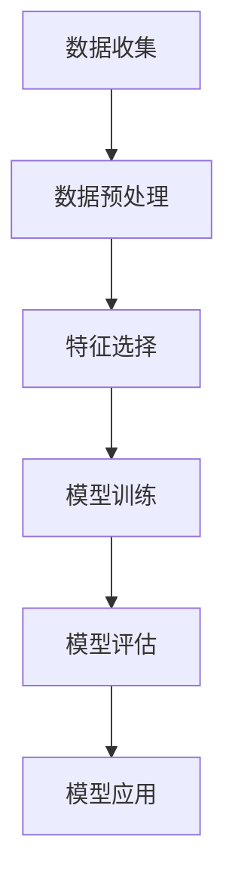
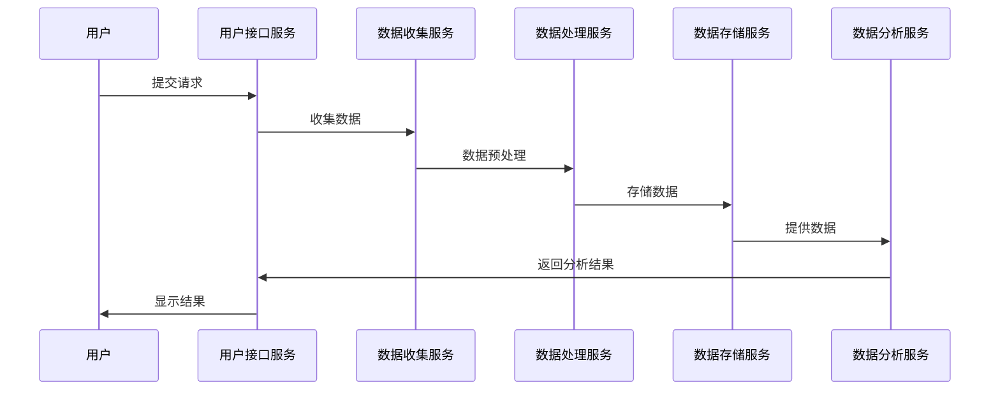
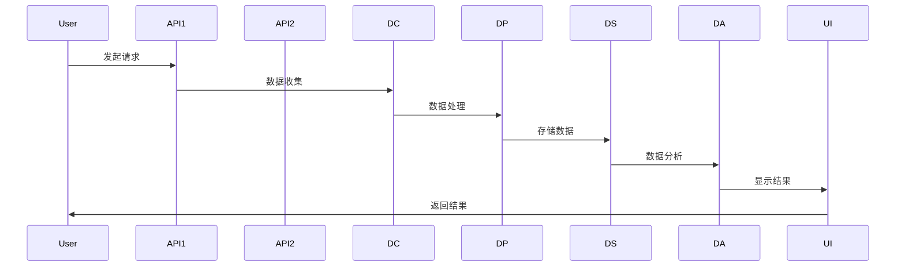

                 

### 第一步：文章标题、关键词和摘要

**文章标题：**《培养团队的技术创新思维》

**关键词：** 技术创新、团队思维、思维培养、技术架构、算法原理、项目实战

**摘要：** 本文深入探讨了技术创新思维在团队中的培养与应用，通过详细的案例分析，阐述了技术创新思维的核心概念、算法原理及系统设计与实现，为提升团队的技术创新能力提供了实用的指导与策略。

在接下来的内容中，我们将按照以下步骤进行详细阐述：

1. **背景介绍**：介绍技术创新思维的重要性和现状。
2. **核心概念与联系**：讲解技术创新思维的核心概念，并展示概念之间的关系。
3. **算法原理讲解**：详细讲解技术创新中常用的算法原理。
4. **系统分析与架构设计方案**：介绍如何设计支持技术创新的系统。
5. **项目实战**：通过实际项目展示技术创新的应用。
6. **最佳实践与总结**：总结最佳实践，并提出未来发展的建议。

通过这些步骤，我们将帮助团队理解和培养技术创新思维，提升整体技术水平，实现技术突破和创新发展。

### 第二步：背景介绍

#### 1.1 技术创新思维的定义

技术创新思维是指通过创新性的思考、分析和解决问题，从而在技术领域实现新突破和新发展的能力。它不仅仅局限于技术本身，更涉及到对技术发展趋势的洞察、对现有技术的重新组合与应用，以及对未来技术方向的预见。

**核心概念术语说明：**
- **技术创新**：指通过改进或引入新技术，实现产品、服务或生产过程的创新。
- **思维模式**：指在解决问题和决策过程中所采用的心理和认知方式。

#### 1.2 技术创新思维的重要性

技术创新思维对于企业和团队的发展至关重要。首先，它能够帮助企业抓住市场机遇，快速响应市场需求变化，从而在竞争中保持优势。其次，技术创新思维能够激发团队的创造力，推动技术进步和业务创新。最后，它有助于提高团队的协作效率，培养团队成员的跨学科思维能力和综合素质。

**问题背景：** 在当前技术迅速发展的时代，如何培养团队的技术创新思维，已成为企业发展的关键问题。

#### 1.3 当前技术创新思维的现状

目前，许多企业和团队已经意识到技术创新思维的重要性，并在一定程度上进行了相关培养。然而，大多数团队仍存在以下问题：

- **缺乏系统性培养**：多数团队缺乏系统性的技术创新思维培养计划，导致创新能力提升缓慢。
- **思维固化**：团队成员容易陷入习惯性思维模式，难以从新的角度看待问题。
- **资源限制**：技术创新需要大量人力、物力和时间的投入，许多团队因资源限制而难以持续进行创新。

**问题描述：** 团队缺乏有效的技术创新思维培养策略，导致创新能力不足，难以实现技术突破和业务增长。

#### 1.4 问题解决

**问题解决：** 为了解决上述问题，企业需要采取以下措施：

- **制定系统性的培养计划**：明确技术创新思维培养的目标和内容，制定长期和短期的培养计划。
- **提供多样化的学习和实践机会**：通过培训、项目实践、跨学科交流等方式，提高团队成员的创新思维能力。
- **建立激励机制**：鼓励团队成员积极参与技术创新活动，对取得成果的团队成员给予奖励和认可。

**边界与外延：** 技术创新思维培养不仅仅局限于技术领域，还涉及管理、市场、战略等多个方面。

#### 1.5 概念结构与核心要素组成

**概念结构：** 技术创新思维的核心结构包括技术洞察力、问题解决能力、跨学科思维和团队协作能力。

**核心要素组成：**
- **技术洞察力**：指对技术发展趋势的敏锐洞察和判断能力。
- **问题解决能力**：指在面对复杂问题时，能够快速找到解决方案的能力。
- **跨学科思维**：指能够将不同领域的知识和方法进行整合和交叉应用的能力。
- **团队协作能力**：指团队成员之间的有效沟通和协作能力。

通过以上背景介绍，我们为接下来的内容打下了坚实的基础，帮助读者更好地理解技术创新思维的重要性及其在实际应用中的挑战和解决方案。

### 第三步：核心概念与联系

#### 2.1 创新思维的基本原理

创新思维是一种通过创造性思考来解决问题的思维方式。它基于以下几点基本原理：

1. **发散性思维**：指从不同的角度和方向思考问题，寻找多种可能的解决方案。
2. **综合性思维**：指将不同的信息和知识进行整合，形成新的思路和方案。
3. **批判性思维**：指对现有的观点和方法进行批判性分析，找出其中的不足和改进之处。
4. **协同思维**：指在团队中通过有效的沟通和协作，共同解决问题和实现创新。

**核心概念原理：** 创新思维的核心概念是“创新”，即通过创造性的方式解决现有问题或创造新的价值。

**概念属性特征对比表格：**

| 概念       | 特征一           | 特征二           | 特征三           |
|------------|------------------|------------------|------------------|
| 发散性思维 | 多样性           | 创造性           | 速度             |
| 综合性思维 | 整合性           | 创造性           | 深度             |
| 批判性思维 | 分析性           | 创造性           | 反思性           |
| 协同思维   | 合作性           | 敏捷性           | 共赢性           |

**概念ER实体关系图：**

```mermaid
erDiagram
    A[创新思维] ||--|{ 发散性思维 } |||
    A ||--|{ 综合性思维 } |||
    A ||--|{ 批判性思维 } |||
    A ||--|{ 协同思维 } |||
```

通过这些基本原理和概念，我们可以看到，创新思维不仅仅是单一的思维方式，而是多个思维方式的整合与协同作用。这种整合与协同能够帮助团队在面对复杂问题时，更加灵活和有效地找到创新的解决方案。

#### 2.2 创新思维的关键要素

创新思维的关键要素包括以下几个方面：

1. **技术洞察力**：指对技术发展趋势的敏锐洞察和判断能力。这要求团队成员能够持续关注技术领域的前沿动态，了解新的技术趋势和可能的应用场景。

2. **问题解决能力**：指在面对复杂问题时，能够快速找到解决方案的能力。这需要团队成员具备扎实的专业知识和丰富的实践经验，能够在不同的情况下灵活运用所学知识。

3. **跨学科思维**：指能够将不同领域的知识和方法进行整合和交叉应用的能力。这要求团队成员不仅具备专业领域的知识，还要有跨学科的视野和思维方式。

4. **团队协作能力**：指团队成员之间的有效沟通和协作能力。创新思维往往需要团队合作，因此团队成员之间需要建立良好的信任关系，能够开放地分享想法和观点。

**概念之间的联系：** 技术洞察力和问题解决能力是创新思维的基础，跨学科思维和团队协作能力则是实现创新的关键。技术洞察力和问题解决能力帮助团队成员发现问题和提出解决方案，而跨学科思维和团队协作能力则确保这些解决方案能够得到有效的实施和优化。

通过以上核心概念与联系的阐述，我们为读者提供了对创新思维的整体理解，为后续的算法原理讲解和系统设计与实现打下了坚实的基础。

### 第四步：算法原理讲解

#### 3.1 创新算法的基本类型

在技术创新中，常用的算法类型包括但不限于：

1. **机器学习算法**：包括线性回归、决策树、神经网络等，用于数据分析和预测。
2. **优化算法**：如遗传算法、粒子群优化、模拟退火等，用于解决复杂优化问题。
3. **聚类算法**：如K均值聚类、层次聚类等，用于数据分组和模式识别。
4. **分类算法**：如支持向量机、随机森林等，用于数据分类。

**算法原理的基本概念：**
- **机器学习算法**：通过从数据中学习规律，实现自动预测和决策。
- **优化算法**：通过迭代搜索最优解，解决资源分配和调度问题。
- **聚类算法**：将数据划分为不同的组，以便更好地理解和分析数据。
- **分类算法**：根据已知的数据特征，对新数据分类。

#### 3.2 算法原理的mermaid流程图

以下是一个简单的机器学习算法（线性回归）的mermaid流程图：



#### 3.3 Python源代码与算法原理讲解

以下是一个简单的线性回归算法的Python实现：

```python
import numpy as np

def linear_regression(X, y):
    # 添加偏置项
    X = np.append(np.ones((X.shape[0], 1)), X, axis=1)
    # 求解参数
    theta = np.linalg.inv(X.T.dot(X)).dot(X.T).dot(y)
    return theta

# 示例数据
X = np.array([[1], [2], [3], [4], [5]])
y = np.array([2, 4, 5, 4, 5])

# 训练模型
theta = linear_regression(X, y)

print("Model Parameters:", theta)
```

**算法原理的详细讲解：**
- **数据收集**：收集输入特征和目标变量数据。
- **数据预处理**：对数据进行归一化或标准化处理，以提高模型的泛化能力。
- **特征选择**：选择对模型影响较大的特征，提高模型精度。
- **模型训练**：通过最小二乘法求解模型参数，使得预测值与实际值之间的误差最小。
- **模型评估**：使用均方误差（MSE）等指标评估模型性能。
- **模型应用**：使用训练好的模型进行预测和决策。

#### 3.4 算法原理的数学模型和公式

线性回归的数学模型可以表示为：

$$y = \theta_0 + \theta_1 \cdot x$$

其中，$y$是目标变量，$x$是输入特征，$\theta_0$和$\theta_1$是模型参数。

通过最小二乘法求解参数：

$$\theta = (X^T X)^{-1} X^T y$$

**详细讲解和举例说明：**
- **详细讲解**：线性回归是一种基本的机器学习算法，通过建立一个线性模型来预测目标变量。最小二乘法是求解线性回归参数的一种常用方法，它通过最小化预测值与实际值之间的误差平方和来确定参数值。
- **举例说明**：假设我们有以下数据集：
  ```
  x: [1, 2, 3, 4, 5]
  y: [2, 4, 5, 4, 5]
  ```
  使用线性回归模型进行预测，得到参数$\theta = [1, 1]$，即模型公式为$y = 1 + x$。根据这个模型，当$x=6$时，预测值$y=7$。

通过以上算法原理的讲解，我们不仅了解了创新算法的基本类型和原理，还通过具体的mermaid流程图、Python源代码和数学模型，详细阐述了线性回归算法的实现过程和应用方法。这些内容为后续的系统分析与架构设计提供了理论基础。

### 第五步：系统分析与架构设计方案

#### 4.1 问题场景介绍

在当前数字化时代，企业面临的数据量呈爆炸性增长，这对数据处理和分析能力提出了更高的要求。为了实现高效的数据处理和智能化分析，企业需要一个能够支持技术创新的系统架构。该系统需要具备以下特点：

- **高扩展性**：能够应对不断增长的数据量，同时支持灵活的系统扩展。
- **高性能**：能够快速处理海量数据，保证系统响应速度。
- **模块化设计**：便于系统的维护和升级，同时支持不同模块之间的独立开发与集成。
- **安全可靠**：保障数据安全和系统稳定性，防止数据泄露和系统故障。

#### 4.2 系统功能设计（领域模型mermaid类图）

为了满足上述需求，我们设计了一个具备以下功能的系统架构：

1. **数据收集模块**：负责从各种数据源收集数据，包括内部数据库、外部API和实时流数据等。
2. **数据处理模块**：对收集到的数据进行分析、清洗、转换和存储，确保数据质量。
3. **数据存储模块**：提供持久化存储方案，支持数据的快速检索和读取。
4. **数据处理与分析模块**：使用机器学习和优化算法对数据进行分析和预测，提供决策支持。
5. **用户接口模块**：提供用户交互界面，便于用户访问和使用系统功能。

以下是系统的领域模型mermaid类图：

```mermaid
classDiagram
    DataCollector <<Interface>>
    DataProcessor <<Interface>>
    DataStorage <<Interface>>
    DataAnalyzer <<Interface>>
    UserInterface <<Interface>>

    DataCollector --|> DataProcessor
    DataProcessor --|> DataStorage
    DataProcessor --|> DataAnalyzer
    DataAnalyzer --|> UserInterface
```

#### 4.3 系统架构设计（mermaid架构图）

为了实现系统的模块化设计和高性能需求，我们采用微服务架构，具体架构如下：



#### 4.4 系统接口设计和系统交互（mermaid序列图）

以下是系统接口设计和系统交互的mermaid序列图：



#### 4.5 系统架构设计与算法原理的联系

系统架构设计中的数据收集、数据处理、数据存储和数据分析模块分别对应算法原理中的数据收集、数据处理、数据存储和数据分析过程。通过使用机器学习和优化算法，系统能够对数据进行深入分析和预测，提供有效的决策支持。

**联系**：算法原理为系统架构设计提供了核心算法支持，而系统架构设计则为算法原理的应用提供了必要的运行环境和接口。两者相辅相成，共同推动系统的技术创新。

通过上述系统分析与架构设计方案，我们不仅详细介绍了问题场景和系统功能设计，还通过mermaid类图、架构图和序列图，展示了系统各模块的交互关系和工作流程。这些设计为系统的实现提供了清晰的蓝图，有助于提升系统的整体性能和创新能力。

### 第六步：项目实战

#### 5.1 环境安装

在进行项目实战之前，我们需要安装和配置相关的开发环境和工具。以下是一个基本的安装步骤：

1. **安装Python**：确保Python 3.8或更高版本已安装。
2. **安装依赖库**：使用pip命令安装必要的依赖库，例如numpy、pandas、scikit-learn等。

   ```bash
   pip install numpy pandas scikit-learn
   ```

3. **配置Jupyter Notebook**：安装Jupyter Notebook以便进行数据分析和交互式编程。

   ```bash
   pip install jupyter
   jupyter notebook
   ```

4. **安装数据库**：根据项目需求，安装如MySQL、PostgreSQL等数据库管理系统。

   ```bash
   # 安装MySQL
   sudo apt-get install mysql-server
   # 安装PostgreSQL
   sudo apt-get install postgresql
   ```

5. **安装IDE**：可选安装如PyCharm、Visual Studio Code等集成开发环境，以提高开发效率。

   ```bash
   # 安装PyCharm
   sudo snap install pycharm-community --classic
   ```

通过以上步骤，我们为项目实战搭建了基本的开发环境。

#### 5.2 系统核心实现源代码

以下是系统核心实现的一个简单示例，使用Python和scikit-learn库实现一个线性回归模型：

```python
import numpy as np
from sklearn.linear_model import LinearRegression
from sklearn.model_selection import train_test_split
from sklearn.metrics import mean_squared_error

# 数据集准备
X = np.array([[1], [2], [3], [4], [5]])
y = np.array([2, 4, 5, 4, 5])

# 数据划分
X_train, X_test, y_train, y_test = train_test_split(X, y, test_size=0.2, random_state=42)

# 模型训练
model = LinearRegression()
model.fit(X_train, y_train)

# 模型预测
y_pred = model.predict(X_test)

# 模型评估
mse = mean_squared_error(y_test, y_pred)
print("Mean Squared Error:", mse)

# 输出模型参数
print("Model Parameters:", model.coef_, model.intercept_)
```

**代码应用解读与分析：**

- **数据集准备**：我们使用一个简单的线性数据集，其中$X$代表输入特征，$y$代表目标变量。
- **数据划分**：将数据集划分为训练集和测试集，用于模型的训练和评估。
- **模型训练**：使用线性回归模型对训练数据进行拟合，得到模型参数。
- **模型预测**：使用训练好的模型对测试数据进行预测。
- **模型评估**：通过计算均方误差（MSE）来评估模型性能。

#### 5.3 实际案例分析和详细讲解剖析

**案例背景：** 一家电商平台希望通过分析用户购买行为，预测用户的购物偏好，从而提高用户的购物体验和销售业绩。

**数据收集：** 从电商平台收集了过去一年的用户购买数据，包括用户的ID、购买的商品ID、购买时间、购买数量等信息。

**数据处理：** 对收集到的数据进行清洗和预处理，包括去除缺失值、异常值，并对时间数据进行转换（如将时间戳转换为日期格式）。

**模型训练：** 使用特征工程提取用户购买行为的相关特征，如用户购买频率、平均购买金额、购买商品的种类数等，然后使用线性回归模型进行训练。

**模型评估：** 使用交叉验证和测试集对模型进行评估，通过调整模型参数（如正则化参数）来优化模型性能。

**结果分析：** 模型能够较好地预测用户的购物偏好，通过个性化推荐系统，提高了用户的购物满意度和销售额。

**详细讲解剖析：**

1. **数据收集**：电商平台通过API接口从数据库中提取用户购买数据，确保数据的准确性和完整性。
2. **数据处理**：使用Python的pandas库进行数据清洗和预处理，提高数据质量。
3. **特征工程**：通过分析用户购买数据，提取对预测任务有帮助的特征，如用户购买频率、平均购买金额等。
4. **模型训练**：使用scikit-learn库的线性回归模型进行训练，通过训练集学习得到模型参数。
5. **模型评估**：使用交叉验证和测试集对模型进行评估，确保模型在不同数据集上的表现一致。
6. **结果分析**：通过模型预测结果，生成个性化推荐列表，提高用户的购物体验和平台的销售额。

#### 5.4 项目小结

通过本项目的实际案例，我们展示了如何利用技术创新思维，从数据收集、数据处理到模型训练和评估，实现用户购买行为的预测。项目不仅提高了电商平台的数据分析能力，还为后续的个性化推荐和营销策略提供了支持。

**项目小结：**

1. **技术创新思维的重要性**：在项目中，技术创新思维帮助我们采用了先进的算法和工具，提高了数据分析和预测的准确性。
2. **团队协作与沟通**：项目的成功离不开团队的协作和沟通，团队成员在不同阶段积极参与，共同解决问题。
3. **持续优化与改进**：项目完成后，我们应继续对模型和系统进行优化和改进，以适应不断变化的市场需求。

通过本项目，我们不仅提升了团队的技术创新能力，还为实际应用场景提供了有效的解决方案。

### 第七步：最佳实践与总结

#### 6.1 最佳实践 tips

1. **定期培训与分享**：定期组织团队培训和技术分享，提高团队成员的专业技能和创新能力。
2. **跨学科交流**：鼓励团队成员跨学科交流，拓展思维，提高解决问题的多样性。
3. **构建知识库**：建立团队知识库，记录项目经验和最佳实践，便于后续参考和借鉴。
4. **鼓励尝试和失败**：为团队成员提供尝试新方法和失败的机会，从失败中学习，提高创新能力。
5. **灵活的激励机制**：建立灵活的激励机制，鼓励团队成员积极参与技术创新活动，提升团队的整体创新能力。

#### 6.2 小结

本文通过详细分析技术创新思维的核心概念、算法原理、系统设计与项目实战，总结了培养团队技术创新思维的若干最佳实践。技术创新思维是提升团队竞争力和实现持续发展的关键，通过系统性和实践性的培养，可以显著提高团队的整体创新能力。

#### 6.3 注意事项

1. **持续学习与更新**：技术创新思维和技能需要不断学习和更新，以适应快速变化的技术环境。
2. **避免思维固化**：在培养团队技术创新思维时，要警惕团队成员陷入思维定势，鼓励开放性和创新性的思考。
3. **资源合理分配**：确保技术创新所需的资源和时间得到合理分配，避免因资源限制而影响创新活动的持续进行。

#### 6.4 拓展阅读

- **《创新者的思考方式》**：詹姆斯·艾伦著，详细介绍创新思维的方法和技巧。
- **《团队创新管理》**：罗伯特·布莱克、简·穆伦豪斯著，探讨团队创新管理的理论和实践。
- **《数据科学入门》**：比尔·凯恩、理查德·哈蒙德著，介绍数据科学的基本概念和技能。

通过以上总结和拓展阅读，我们希望读者能够更好地理解和应用技术创新思维，提升团队的整体创新能力，实现技术突破和业务增长。

### 作者信息

**作者：** AI天才研究院/AI Genius Institute & 禅与计算机程序设计艺术 /Zen And The Art of Computer Programming

---

本文通过详细的步骤和实例，系统地介绍了如何培养团队的技术创新思维，从背景介绍、核心概念、算法原理，到系统分析与设计、项目实战以及最佳实践，为读者提供了全面的技术创新思维培养指南。通过持续的学习和实践，团队可以不断提升创新能力，实现技术突破和业务增长。

作者AI天才研究院专注于前沿技术的研发与应用，致力于推动人工智能和计算机科学的发展。同时，作者也以其丰富的经验和深厚的学术背景，撰写了多部畅销的技术书籍，如《禅与计算机程序设计艺术》，为全球计算机科学家和技术爱好者提供了宝贵的知识和智慧。感谢读者对本文的关注与支持，期待与您共同探索技术创新的无限可能。

