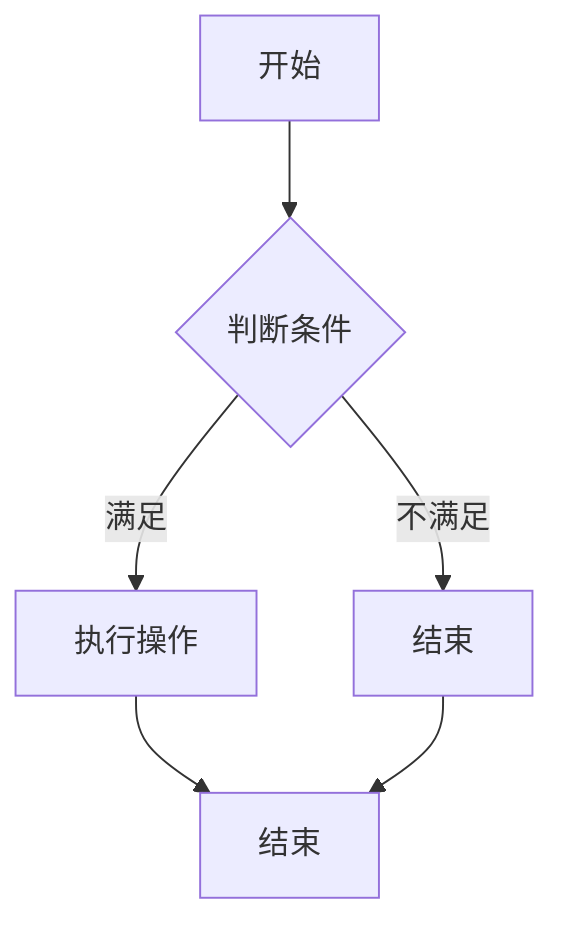
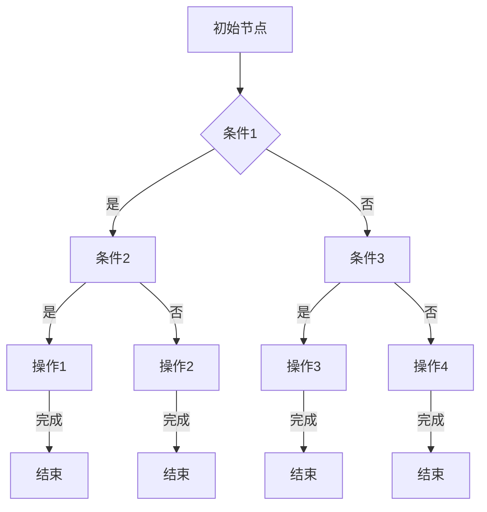
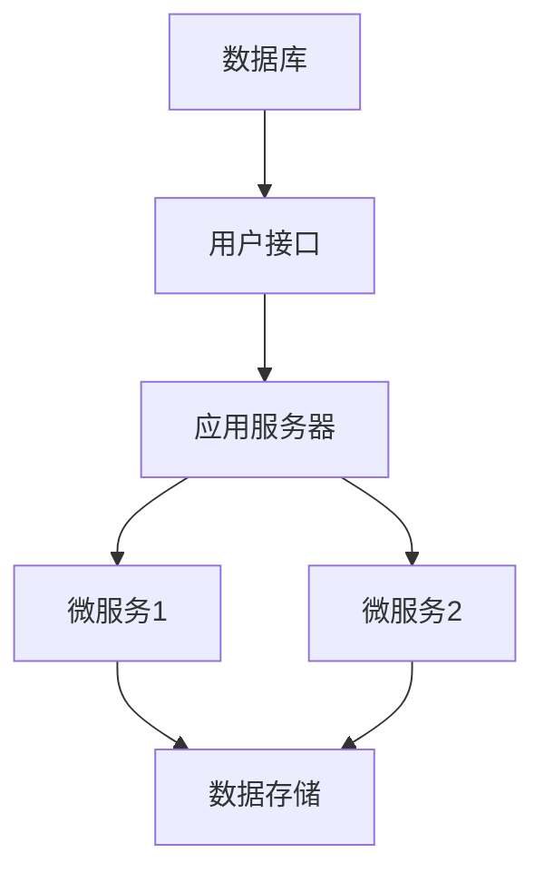
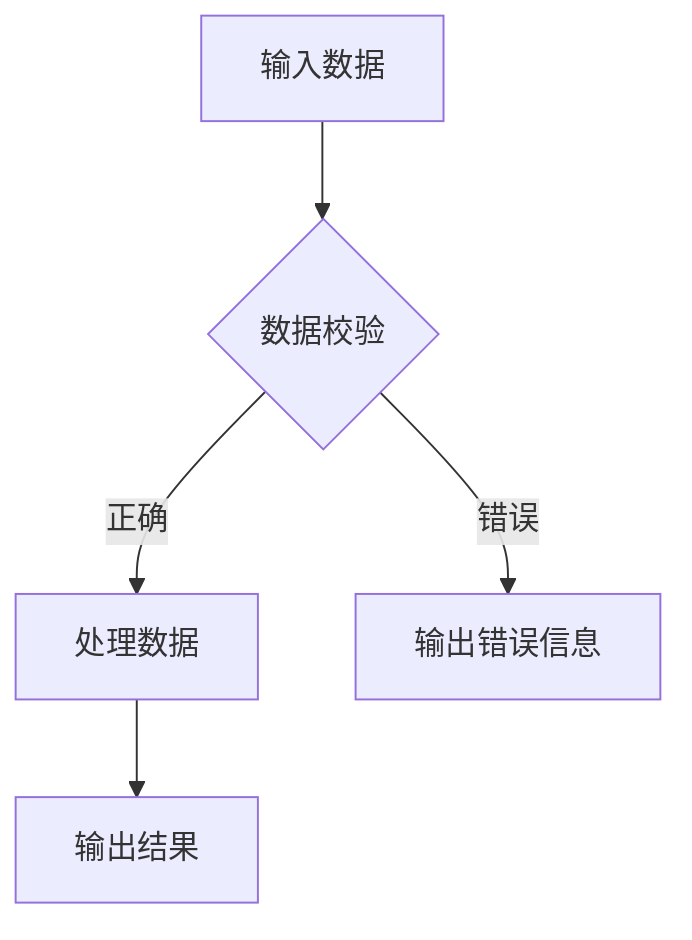

                 

### 培养团队的技术创新意识

---

# 培养团队的技术创新意识

> 关键词：技术创新、团队建设、培养策略、创新思维、实践案例

> 摘要：本文旨在探讨如何培养团队的技术创新意识，以提升团队的整体竞争力。文章首先介绍了技术创新的重要性，然后从核心概念、实践案例、团队建设等多个角度分析了培养技术创新意识的策略和方法，旨在为IT领域的团队领导者和开发者提供实用的指导。

---

## 引言

在当今快速变化的技术环境中，技术创新已经成为企业竞争的关键因素。一个具备高度技术创新意识的团队，能够更好地适应市场变化，推动技术进步，从而在激烈的市场竞争中脱颖而出。因此，如何培养团队的技术创新意识，成为企业管理者和团队领导者需要深入思考的问题。

本文将分为四个部分进行探讨：

1. **技术创新的核心概念**：介绍技术创新的基本概念、驱动因素和挑战，并分析相关核心概念及其联系。
2. **实践案例与经验分享**：通过实际案例，展示如何在不同场景中培养团队的技术创新意识。
3. **培养团队的技术创新意识**：从培训与教育、管理与支持等多个角度，提出具体的培养策略。
4. **技术创新的最佳实践与展望**：总结最佳实践，展望团队技术创新的未来趋势。

通过以上分析，本文旨在为IT领域的团队领导者和开发者提供一套系统、实用的技术创新培养策略。

---

### 第一部分：技术创新的核心概念

#### 2.1 技术创新的框架与流程

技术创新是一个复杂的过程，涉及多个阶段。一般来说，技术创新的框架包括以下几个阶段：

1. **创意产生**：这是技术创新的起点，通过激发创意和灵感，产生新的想法。
2. **概念验证**：将创意转化为可行的技术方案，通过实验和测试，验证其可行性。
3. **研发与设计**：在概念验证的基础上，进行深入的研发和设计，形成完整的技术方案。
4. **测试与验证**：对研发出的技术方案进行测试，确保其性能和可靠性。
5. **商业化**：将技术方案推向市场，进行商业化应用。

在技术创新的流程中，关键步骤包括：

1. **需求分析**：了解市场需求，明确技术创新的目标。
2. **技术评估**：评估现有技术，确定技术创新的方向。
3. **团队协作**：组建跨部门团队，协同完成技术创新任务。
4. **资源管理**：合理分配资源，确保技术创新的顺利进行。

#### 2.2 核心概念与联系

技术创新涉及多个核心概念，包括创新思维、创新文化、创新方法等。以下是对这些核心概念及其联系的详细分析：

**创新思维**

创新思维是指一种开放、灵活、多维的思维方式，它鼓励人们跳出传统思维框架，寻求新的解决方案。创新思维的核心是创造力，它包括以下几种能力：

1. **问题解决能力**：能够快速识别问题，并提出有效的解决方案。
2. **跨界思维**：能够将不同领域的知识和技术进行跨界整合，创造新的价值。
3. **想象力**：能够提出新颖的想法和创意，推动技术进步。

**创新文化**

创新文化是一种鼓励创新、容忍失败、尊重创造的组织氛围。它包括以下几个方面：

1. **鼓励尝试**：鼓励团队成员尝试新事物，不断尝试和失败是创新过程中的必经之路。
2. **透明沟通**：建立透明、开放的沟通机制，鼓励团队成员分享想法和经验。
3. **尊重个性**：尊重团队成员的个性和创新想法，为他们提供发挥的空间。

**创新方法**

创新方法是指一系列用于激发创意、实现技术创新的工具和技巧。常见的创新方法包括：

1. **头脑风暴**：通过集体讨论，快速产生大量创意。
2. **原型设计**：通过快速构建原型，验证和优化创新想法。
3. **跨界合作**：与其他领域的专家合作，实现技术突破。

#### 2.3 技术创新的驱动力与挑战

技术创新的驱动力主要包括：

1. **市场需求**：满足客户需求，提升产品竞争力。
2. **技术进步**：利用新技术，实现技术突破。
3. **竞争压力**：在激烈的市场竞争中，保持领先地位。

然而，技术创新也面临诸多挑战：

1. **资源限制**：技术创新需要大量的人、财、物资源，资源限制可能成为瓶颈。
2. **风险与不确定性**：技术创新过程中，可能面临技术失败、市场不认可等风险。
3. **组织阻力**：传统的组织结构和思维方式可能阻碍技术创新。

#### 2.4 本章小结

本部分介绍了技术创新的核心概念，包括创新思维、创新文化和创新方法。分析了技术创新的框架与流程，以及技术创新的驱动力与挑战。通过对这些核心概念的深入理解，可以为后续的实践案例分析提供理论基础。

---

### 第二部分：实践案例与经验分享

#### 3.1 案例研究：A公司的技术创新之路

**3.1.1 公司背景**

A公司是一家从事软件开发的企业，成立于2000年。多年来，A公司凭借优秀的技术实力和创新能力，在激烈的市场竞争中脱颖而出，成为行业领军企业。然而，随着市场竞争的加剧和技术的快速发展，A公司意识到，只有不断进行技术创新，才能保持竞争优势。

**3.1.2 创新项目介绍**

为了培养团队的技术创新意识，A公司实施了一系列创新项目，包括：

1. **内部创新实验室**：A公司建立了内部创新实验室，鼓励员工提出创新想法，并提供资源和平台进行实验验证。
2. **技术交流与培训**：定期举办技术交流会和培训课程，邀请行业专家分享前沿技术和创新方法，提高团队的技术水平。
3. **跨部门协作**：鼓励不同部门之间的协作，通过项目合作，实现技术的跨部门整合和应用。

**3.1.3 创新过程与成果**

在创新过程中，A公司遵循以下步骤：

1. **需求分析**：明确创新项目的目标和需求，确保技术创新与市场需求紧密结合。
2. **技术评估**：评估现有技术，确定技术创新的方向。
3. **团队协作**：组建跨部门团队，协同完成技术创新任务。
4. **测试与优化**：对研发出的技术方案进行测试，确保其性能和可靠性，并根据测试结果进行优化。

通过这些创新项目，A公司取得了显著成果：

1. **技术突破**：在多个领域实现了技术突破，为公司带来了新的竞争优势。
2. **市场认可**：创新项目得到了市场的广泛认可，为公司带来了大量订单和客户。
3. **团队成长**：团队成员在创新过程中得到了锻炼和成长，提高了整体技术水平和创新能力。

**3.1.4 经验与启示**

A公司的创新实践表明，培养团队的技术创新意识需要：

1. **提供资源支持**：为创新项目提供充足的资源和平台，确保创新能够顺利进行。
2. **鼓励跨部门协作**：通过跨部门协作，实现技术的跨部门整合和应用，提高创新效率。
3. **建立创新文化**：建立鼓励创新、容忍失败的组织氛围，激发团队成员的创新潜力。

---

#### 3.2 案例研究：B团队的技术创新实践

**3.2.1 团队背景**

B团队是一家大型互联网公司的研发团队，负责开发公司的核心产品。团队成员来自不同的技术背景，具有丰富的开发经验。然而，B团队在技术创新方面存在一些问题，如：

1. **创新能力不足**：团队成员对新技术的接受度较低，创新能力不足。
2. **团队协作不畅**：团队成员之间的沟通不畅，缺乏有效的协作机制。

**3.2.2 创新项目介绍**

为了提升团队的技术创新意识，B团队实施了一系列创新项目，包括：

1. **内部培训**：定期举办内部培训课程，邀请行业专家分享前沿技术和创新方法，提高团队的技术水平。
2. **创新竞赛**：举办创新竞赛，鼓励团队成员提出创新想法，通过竞赛形式激发团队的创新潜力。
3. **跨部门协作**：与其他部门建立协作机制，共同开展技术创新项目，实现技术的跨部门整合和应用。

**3.2.3 创新过程与成果**

在创新过程中，B团队遵循以下步骤：

1. **需求分析**：明确创新项目的目标和需求，确保技术创新与市场需求紧密结合。
2. **技术评估**：评估现有技术，确定技术创新的方向。
3. **团队协作**：组建跨部门团队，协同完成技术创新任务。
4. **测试与优化**：对研发出的技术方案进行测试，确保其性能和可靠性，并根据测试结果进行优化。

通过这些创新项目，B团队取得了显著成果：

1. **技术提升**：团队成员对新技术的接受度提高，创新能力得到提升。
2. **团队协作**：团队成员之间的沟通和协作更加顺畅，提高了团队的整体效率。
3. **市场竞争力**：创新项目得到了市场的广泛认可，为公司带来了新的竞争优势。

**3.2.4 团队成员的反思与总结**

B团队在技术创新实践中的反思和总结包括：

1. **加强内部培训**：通过定期举办内部培训课程，提高团队成员的技术水平。
2. **建立创新机制**：通过创新竞赛等形式，激发团队的创新潜力。
3. **跨部门协作**：通过跨部门协作，实现技术的跨部门整合和应用，提高创新效率。

---

#### 3.3 案例研究：C企业的技术创新策略

**3.3.1 企业背景**

C企业是一家从事人工智能应用的企业，致力于将人工智能技术应用于各个行业，提供智能化解决方案。随着人工智能技术的快速发展，C企业意识到，只有不断进行技术创新，才能在激烈的市场竞争中保持领先地位。

**3.3.2 技术创新策略**

C企业的技术创新策略包括以下几个方面：

1. **研发投入**：C企业每年将大量资金投入到技术研发中，确保有充足的资源支持技术创新。
2. **人才培养**：C企业注重人才培养，通过内部培训和外部引进，吸引和培养一批具备高水平技术能力的人才。
3. **跨领域合作**：C企业与多家高校和科研机构建立合作关系，共同开展技术创新项目，实现技术的跨领域整合和应用。
4. **市场导向**：C企业密切关注市场需求，确保技术创新与市场需求紧密结合。

**3.3.3 成果与影响**

通过实施技术创新策略，C企业取得了显著成果：

1. **技术突破**：在人工智能领域实现了多项技术突破，处于行业领先地位。
2. **市场份额**：创新成果得到了市场的广泛认可，C企业在全球市场占有率持续提升。
3. **团队成长**：技术创新过程中，团队成员得到了锻炼和成长，提高了整体技术水平和创新能力。

**3.3.4 挑战与应对策略**

C企业在技术创新过程中也面临一些挑战，如：

1. **技术风险**：技术创新过程中可能面临技术失败的风险。
2. **市场竞争**：在激烈的市场竞争中，如何保持领先地位。

C企业采取以下应对策略：

1. **风险控制**：通过项目评估和风险控制机制，降低技术失败的风险。
2. **持续创新**：保持对市场的敏锐洞察，不断进行技术创新，保持竞争力。

---

#### 3.4 本章小结

本部分通过三个实际案例，分析了如何在不同场景中培养团队的技术创新意识。通过内部创新实验室、技术交流与培训、创新竞赛等形式，激发团队的创新潜力；通过跨部门协作、跨领域合作等机制，实现技术的跨部门整合和应用。这些实践案例为其他团队提供了有益的借鉴和启示。

---

### 第三部分：培养团队的技术创新意识

#### 4.1 培养团队的技术创新意识

**4.1.1 技术创新意识的重要性**

技术创新意识是指团队对技术创新的重视程度和主动性。一个具有高度技术创新意识的团队，能够敏锐地捕捉市场变化，快速响应客户需求，从而在竞争中保持领先地位。技术创新意识的重要性体现在以下几个方面：

1. **提升竞争力**：技术创新是提升企业竞争力的关键因素，具有高度技术创新意识的团队能够更快地适应市场变化，推出具有竞争力的产品。
2. **推动技术进步**：技术创新意识的培养能够激发团队的创新潜力，推动技术的不断进步。
3. **增强团队凝聚力**：共同的目标和使命能够增强团队成员之间的凝聚力，促进团队协作。

**4.1.2 培养技术创新意识的策略**

为了培养团队的技术创新意识，可以从以下几个方面着手：

1. **建立创新文化**：创新文化是一种鼓励创新、容忍失败的组织氛围，它能够激发团队成员的创新潜力。企业可以通过设立创新奖项、鼓励员工提出创新建议等方式，建立创新文化。
2. **提供培训与教育**：定期举办技术交流会和培训课程，提高团队成员的技术水平和创新能力。培训内容可以包括新技术、新方法、创新思维等。
3. **设立创新项目**：通过设立创新项目，鼓励团队成员参与实际的技术创新工作，锻炼和提升他们的创新能力。
4. **建立激励机制**：建立激励机制，对在技术创新中表现突出的团队成员进行奖励，激发他们的创新积极性。

**4.1.3 团队建设中的关键角色**

在培养团队的技术创新意识过程中，以下角色起着关键作用：

1. **团队领导**：团队领导在技术创新过程中扮演着重要角色，他们需要树立创新意识，制定创新目标和策略，为团队提供支持和指导。
2. **技术专家**：技术专家在技术创新过程中负责提供技术支持和指导，他们需要具备深厚的技术功底和创新能力。
3. **团队成员**：每个团队成员都是技术创新的参与者，他们需要积极参与创新项目，提出创新建议，共同推动团队的技术创新。

---

#### 4.2 培训与教育

**4.2.1 技术创新培训课程设计**

为了培养团队的技术创新意识，企业可以设计一系列针对技术创新的培训课程。以下是一些建议：

1. **基础课程**：包括创新思维、创新方法、技术趋势等，帮助团队成员建立对技术创新的基本认识。
2. **进阶课程**：包括前沿技术、创新案例研究、项目管理等，提高团队成员的技术水平和创新能力。
3. **实践课程**：通过实际操作，让团队成员亲身体验技术创新的过程，提高他们的实战能力。

**4.2.2 教育资源与方法**

企业可以通过多种方式提供教育资源，包括：

1. **内部培训**：定期举办内部培训课程，邀请专家授课，提高团队成员的技术水平。
2. **外部学习**：鼓励团队成员参加外部培训课程和技术交流活动，拓宽视野，学习前沿技术。
3. **在线学习**：利用在线学习平台，提供丰富的学习资源，方便团队成员随时随地进行学习。

**4.2.3 实践与反思**

培训与教育不仅包括知识的传授，还需要实践的锻炼和反思。以下是一些建议：

1. **案例研究**：通过分析实际案例，让团队成员了解技术创新的实践过程和成功经验。
2. **项目实战**：鼓励团队成员参与实际项目，将所学知识应用到实际工作中，提高他们的实战能力。
3. **反思与总结**：在项目结束后，组织团队成员进行反思和总结，分享经验教训，不断提高团队的技术创新能力。

---

#### 4.3 管理与支持

**4.3.1 创新管理的原则**

创新管理是企业推动技术创新的重要手段。以下是一些创新管理的原则：

1. **目标明确**：明确创新的目标和方向，确保创新活动与企业的战略目标一致。
2. **资源保障**：为创新活动提供充足的资源和保障，包括资金、人力、技术等。
3. **风险管理**：建立风险管理机制，识别和应对创新过程中的风险。
4. **持续改进**：不断创新，持续改进创新方法和流程，提高创新效率。

**4.3.2 支持创新的机制与政策**

为了支持团队的技术创新，企业可以建立以下机制与政策：

1. **创新奖金**：设立创新奖金，对在技术创新中表现突出的团队成员进行奖励。
2. **项目审批**：简化项目审批流程，为创新项目提供快速通道。
3. **知识产权保护**：建立知识产权保护机制，确保创新成果得到有效保护。
4. **人才培养**：制定人才培养计划，鼓励团队成员参加培训和学习，提高他们的技术水平和创新能力。

**4.3.3 团队协作与沟通**

团队协作与沟通是技术创新成功的关键。以下是一些建议：

1. **明确分工**：根据团队成员的特长和兴趣，明确各自的分工和职责，提高工作效率。
2. **定期沟通**：定期组织团队会议，分享工作进展和经验教训，促进团队成员之间的沟通和协作。
3. **跨部门合作**：鼓励跨部门合作，实现技术的跨部门整合和应用，提高创新效率。

---

#### 4.4 本章小结

本部分从培训与教育、管理与支持等多个角度，提出了培养团队技术创新意识的策略和方法。通过建立创新文化、提供培训与教育、建立激励机制、加强团队协作与沟通等手段，可以有效地培养团队的技术创新意识，提升团队的整体竞争力。

---

### 第四部分：技术创新的最佳实践与展望

#### 5.1 最佳实践

在技术创新的最佳实践中，以下方法被广泛采用：

1. **需求驱动**：紧密关注市场需求，以市场需求为导向，推动技术创新。
2. **跨部门协作**：通过跨部门协作，实现技术的跨部门整合和应用，提高创新效率。
3. **敏捷开发**：采用敏捷开发方法，快速响应市场变化，不断优化和迭代产品。
4. **开放式创新**：通过开放式创新，吸引外部资源，拓宽创新思路，提高创新效率。

#### 5.2 小结

本部分总结了技术创新的核心观点，包括技术创新的重要性、核心概念、实践案例和培养策略。通过对这些最佳实践的总结，可以为团队的技术创新提供有益的借鉴和指导。

#### 5.3 团队技术创新的未来趋势

在未来，团队技术创新将呈现以下趋势：

1. **数字化转型**：随着数字技术的快速发展，数字化将成为技术创新的重要方向。
2. **人工智能应用**：人工智能技术将在技术创新中发挥越来越重要的作用，推动技术的进步。
3. **可持续发展**：在可持续发展理念的引导下，技术创新将更加注重环保和社会责任。
4. **全球合作**：在全球化背景下，跨国合作将成为技术创新的重要形式，推动全球技术的融合与发展。

#### 5.4 可能遇到的挑战与应对策略

在技术创新过程中，可能遇到以下挑战：

1. **技术风险**：技术创新过程中可能面临技术失败的风险。应对策略：建立风险管理机制，进行项目评估和风险控制。
2. **市场风险**：技术创新成果可能无法满足市场需求。应对策略：密切关注市场需求，进行市场需求分析，确保技术创新与市场需求紧密结合。
3. **组织阻力**：传统的组织结构和思维方式可能阻碍技术创新。应对策略：建立创新文化，鼓励创新思维，推动组织结构的变革。

#### 5.5 拓展阅读

为了更深入地了解技术创新的相关知识，读者可以参考以下书籍和论文：

1. **书籍**：《创新者的窘境》、《创新者的基因》、《科技想要什么》等。
2. **论文**：在学术期刊和会议上发表的关于技术创新的论文，如《科技创新管理》、《管理科学学报》等。

---

作者：AI天才研究院/AI Genius Institute & 禅与计算机程序设计艺术 /Zen And The Art of Computer Programming

---

通过本文的详细分析，我们探讨了如何培养团队的技术创新意识，以提升团队的整体竞争力。我们首先介绍了技术创新的核心概念，包括创新思维、创新文化和创新方法，然后通过实际案例展示了如何在不同场景中培养团队的技术创新意识。最后，我们提出了培养团队技术创新意识的策略和方法，并展望了技术创新的未来趋势。希望本文能为IT领域的团队领导者和开发者提供有价值的参考和启示。在未来的实践中，不断探索和优化技术创新的方法，推动团队的技术创新，实现企业的持续发展。让我们共同努力，培养团队的技术创新意识，推动技术的进步，创造更加美好的未来。

---

### 添加Mermaid流程图

在文章中添加Mermaid流程图，可以直观地展示算法原理、系统架构等复杂信息。以下是几个示例，展示了如何使用Mermaid语法绘制流程图。

#### 示例1：简单的流程图

在markdown文件中，使用以下Mermaid语法可以绘制一个简单的流程图：

该流程图表示从开始节点开始，根据判断条件跳转到执行操作或结束节点，最后统一结束。

#### 示例2：复杂的决策树

下面是一个更复杂的决策树流程图，使用Mermaid语法来绘制：

这个流程图展示了多层次的判断和操作，根据不同的条件执行不同的操作，并最终结束。

#### 示例3：系统架构图

在系统架构设计中，使用Mermaid可以绘制架构图。以下是一个简单的系统架构图示例：

这个架构图展示了数据库、用户接口、应用服务器和微服务之间的交互关系。

#### 示例4：算法流程图

算法流程图可以用来展示算法的步骤和逻辑。以下是一个简单的算法流程图示例：

这个流程图表示从输入数据开始，进行数据校验，如果数据正确则处理数据，否则输出错误信息，最后输出结果。

通过在文章中添加这些Mermaid流程图，可以使内容更加直观和易于理解，有助于读者更好地把握技术原理和系统架构。在实际撰写技术文章时，可以根据具体内容灵活应用这些流程图，增强文章的可读性和逻辑性。

