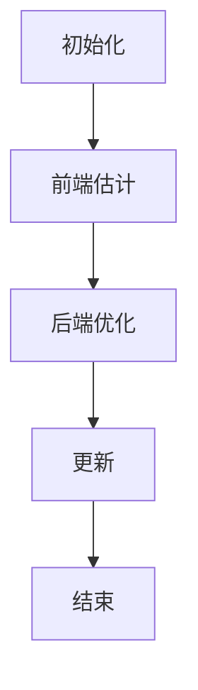
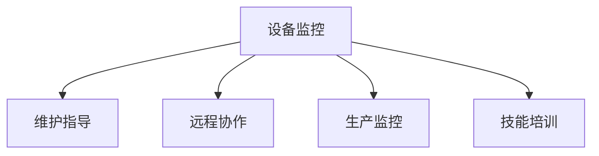
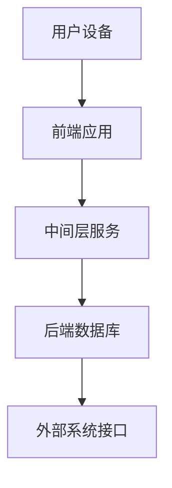
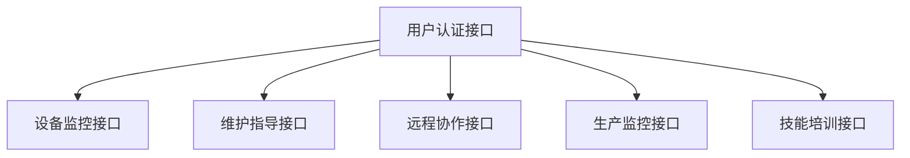
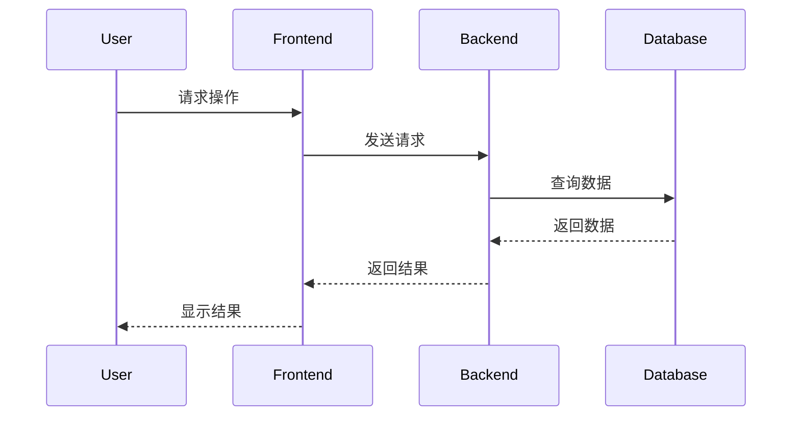

                 


### 2.4 增强现实技术的关联图

在理解增强现实（AR）技术的基本原理和核心要素后，我们需要将各个组成部分之间的关系进行系统梳理，这有助于我们更好地把握整个技术的脉络。以下是本节的核心内容，我们将使用Mermaid图来展示增强现实技术的关联图。

#### 2.4.1 关键技术关联图

增强现实技术涉及多个关键技术，包括图像处理、传感器技术、虚拟现实等。为了清晰展示这些技术之间的关系，我们使用Mermaid的类图（Class Diagram）来描述。

```mermaid
classDiagram
  ARSystem <<interface>>
  ImageProcessing <<interface>>
  SensorTech <<interface>>
  VR <<interface>>

  ARSystem o-- ImageProcessing
  ARSystem o-- SensorTech
  ARSystem o-- VR
```

在这个类图中，`ARSystem` 是一个接口类，它与其他关键技术类（`ImageProcessing`、`SensorTech` 和 `VR`）通过组合关系（`o--`）相互连接。这表示一个增强现实系统需要集成这些关键技术来实现其功能。

#### 2.4.2 应用场景关联图

除了技术层面的关联，我们还需要了解增强现实技术在工业和教育等领域的应用场景。以下是使用Mermaid的ER图（Entity-Relationship Diagram）来展示这些关联。

```mermaid
erDiagram
  ARApplication <<entity>> {
    ARApplicationID
    Type : 工业或教育
    Description
  }

  ARTechnology <<entity>> {
    TechnologyID
    Name
    Description
  }

  ARScenario <<entity>> {
    ScenarioID
    Type : 工业或教育
    Description
  }

  ARApplication *--* ARTechnology : "应用于"
  ARApplication *--* ARScenario : "适用场景"
```

在这个ER图中，`ARApplication` 表示增强现实技术的应用实例，它可以应用于不同的领域（工业或教育），并与 `ARTechnology` 和 `ARScenario` 关联。`ARTechnology` 表示增强现实的关键技术，而 `ARScenario` 表示增强现实技术的应用场景。应用实例与技术和场景之间的多对多关系通过连接线表示。

#### 2.4.3 关键技术对比表格

为了进一步理解增强现实技术的各个组成部分，我们还可以提供一个对比表格，展示不同技术属性的特征。

| 技术名称 | 描述 | 关键特征 | 优势 | 劣势 |
| --- | --- | --- | --- | --- |
| 图像处理 | 处理和识别图像数据 | 边缘检测、图像识别、图像增强 | 提高图像质量、增强视觉效果 | 处理速度较慢、实时性要求高时性能下降 |
| 传感器技术 | 检测和获取环境数据 | 深度感知、光线检测、姿态追踪 | 提高交互性、增强现实感 | 需要高度集成、功耗较高 |
| 虚拟现实 | 创建和体验虚拟环境 | 空间感知、沉浸体验、交互性 | 强大的沉浸感、丰富的交互体验 | 成本高、硬件设备要求高 |

通过这个表格，我们可以直观地看到各个关键技术的功能、关键特征以及它们的优势和劣势。

### 2.5 本章小结

在本章中，我们介绍了增强现实技术的核心概念、关键要素及其关联关系。通过Mermaid图和对比表格，我们能够更清晰地理解增强现实技术的组成部分及其相互关系。这一章的目的是帮助读者建立一个对增强现实技术的全面认识，为后续章节的深入探讨打下基础。

在接下来的章节中，我们将进一步解析增强现实技术中的关键算法原理，并探讨其在工业和教育领域的具体应用。通过这些内容，我们将逐步揭示增强现实技术的潜力及其对现代社会带来的深远影响。

## 第三部分 算法原理讲解

### 第3章 增强现实关键算法解析

在了解增强现实（AR）技术的核心概念和组成部分后，我们需要深入探讨其中的关键算法，这些算法是增强现实系统能够实现其功能的核心。本章将重点解析两个关键算法：SLAM（Simultaneous Localization and Mapping，同时定位与地图构建）和图像识别。我们将使用Mermaid图展示算法流程，并通过Python源代码和LaTeX公式详细解释算法原理。

### 3.1 SLAM算法

SLAM算法是增强现实技术中至关重要的一部分，它用于在动态环境中同时进行定位和地图构建。以下是SLAM算法的基本原理及其实现步骤。

#### 3.1.1 SLAM算法的基本原理

SLAM算法的目标是在一个未知的动态环境中，通过传感器采集的数据，同时构建环境地图并定位自身位置。其核心思想是利用传感器数据（如摄像头、激光雷达等）观测到的特征点，通过优化算法估计出系统的运动轨迹和地图。

数学模型方面，SLAM可以表示为以下两个方程：

$$
x_k = A_k x_{k-1} + b_k \\
y_k = H_k x_k + v_k
$$

其中，$x_k$ 表示系统的状态，$A_k$ 是状态转移矩阵，$b_k$ 是系统噪声，$y_k$ 是观测数据，$H_k$ 是观测矩阵，$v_k$ 是观测噪声。

#### 3.1.2 SLAM算法的实现步骤

SLAM算法的实现可以分为以下几个步骤：

1. **初始化**：设定初始位置和初始地图。
2. **前端估计**：使用观测数据计算当前的状态估计。
3. **后端优化**：整合多个观测数据，优化地图和状态估计。
4. **更新**：根据最新的观测数据更新状态估计和地图。

以下是SLAM算法的Mermaid流程图：



#### 3.1.3 SLAM算法的应用

SLAM算法广泛应用于增强现实、自动驾驶、机器人导航等领域。在增强现实应用中，SLAM算法用于实时定位和地图构建，使得虚拟物体能够准确地在真实世界中显示。

#### 3.1.4 SLAM算法的实现示例

以下是一个简化的SLAM算法Python代码示例：

```python
import numpy as np

# 初始状态
x = np.array([0, 0])  # 位置
P = np.eye(2)  # 状态协方差矩阵

# 观测数据
z = np.array([1, 1])

# 状态转移矩阵
A = np.array([[1, 0], [0, 1]])

# 观测矩阵
H = np.array([[1, 0], [0, 1]])

# 系统噪声协方差
Q = np.eye(2)

# 观测噪声协方差
R = np.eye(2)

# 前端估计
def predict(x, A, P, Q):
    x_pred = A @ x
    P_pred = A @ P @ A.T + Q
    return x_pred, P_pred

# 后端优化
def update(x_pred, P_pred, z, H, R):
    K = P_pred @ H.T @ np.linalg.inv(H @ P_pred @ H.T + R)
    x = x_pred + K @ (z - H @ x_pred)
    P = (1 - K @ H) @ P_pred
    return x, P

# 主程序
while True:
    x_pred, P_pred = predict(x, A, P, Q)
    x, P = update(x_pred, P_pred, z, H, R)
    print("估计位置：", x)
    # 处理观测数据...
```

### 3.2 图像识别算法

图像识别是增强现实技术中的另一个关键算法，它用于识别和分类图像中的对象。图像识别算法可以分为以下几个步骤：

1. **预处理**：包括去噪、增强、滤波等操作。
2. **特征提取**：从预处理后的图像中提取具有区分性的特征。
3. **分类**：使用分类算法（如SVM、神经网络等）对特征进行分类。

以下是图像识别算法的基本原理及其实现步骤。

#### 3.2.1 图像识别的基本原理

图像识别的基本原理是通过比较输入图像的特征和已知的特征库，找出最相似的图像，从而实现分类。

#### 3.2.2 图像识别的实现步骤

1. **预处理**：图像预处理包括灰度化、二值化、滤波等操作。这些操作有助于提高图像质量，减少噪声干扰。

2. **特征提取**：特征提取是将图像中的视觉信息转换成数字特征的过程。常用的特征提取方法包括边缘检测、角点检测、纹理分析等。

3. **分类**：分类是将提取到的特征与已知的特征库进行匹配，找出最相似的类别。常见的分类算法包括支持向量机（SVM）、神经网络（Neural Network）等。

#### 3.2.3 图像识别的实现示例

以下是一个简单的图像识别Python代码示例，使用SVM进行分类：

```python
from sklearn import datasets
from sklearn.model_selection import train_test_split
from sklearn.svm import SVC
from sklearn.metrics import accuracy_score

# 加载示例数据
iris = datasets.load_iris()
X = iris.data
y = iris.target

# 划分训练集和测试集
X_train, X_test, y_train, y_test = train_test_split(X, y, test_size=0.3, random_state=42)

# 创建SVM分类器
clf = SVC(kernel='linear')

# 训练模型
clf.fit(X_train, y_train)

# 预测测试集
y_pred = clf.predict(X_test)

# 计算准确率
accuracy = accuracy_score(y_test, y_pred)
print("准确率：", accuracy)
```

### 3.3 本章小结

本章详细解析了增强现实技术中的两个关键算法：SLAM和图像识别。通过Mermaid图和Python代码示例，我们深入理解了这些算法的基本原理和实现步骤。SLAM算法用于实时定位和地图构建，而图像识别算法用于识别和分类图像中的对象。这些算法在增强现实应用中扮演着至关重要的角色，为后续章节的深入研究奠定了基础。

在接下来的章节中，我们将进一步探讨增强现实技术在工业和教育领域的具体应用，并分析其实际案例。通过这些内容，我们将全面了解增强现实技术如何为现代社会带来创新和变革。

## 第四部分 系统分析与架构设计

### 第4章 AR系统在工业中的应用

随着增强现实（AR）技术的不断发展，其在工业领域的应用日益广泛。AR技术不仅提高了工作效率，还提升了操作人员的技能水平。本章节将详细介绍AR系统在工业中的应用场景、功能设计、架构设计、接口设计以及系统交互，并使用Mermaid图进行辅助说明。

### 4.1 工业应用场景介绍

#### 4.1.1 制造业

在制造业中，AR技术被广泛应用于设备维护、产品设计、生产监控和远程协作。例如，通过AR眼镜，技术人员可以在设备维护过程中实时查看设备的技术手册和操作步骤，提高维护效率。

#### 4.1.2 维护与检修

在维护与检修领域，AR技术能够提供实时的技术支持和指导。例如，使用AR眼镜，技术人员可以查看设备的3D模型和操作说明，快速定位故障并进行修复。

#### 4.1.3 培训与教育

AR技术在工业培训和教育中的应用也非常广泛。通过虚拟现实（VR）与增强现实（AR）的融合，学员可以沉浸在逼真的培训环境中，提高学习效果和技能掌握度。

### 4.2 工业AR系统的功能设计

工业AR系统的功能设计主要包括以下模块：

1. **设备监控**：实时监控设备状态，提供报警和通知功能。
2. **维护指导**：提供设备维护和检修的实时指导和操作步骤。
3. **远程协作**：实现远程专家的技术支持和协同工作。
4. **生产监控**：监控生产过程，提供数据分析和优化建议。
5. **技能培训**：提供虚拟培训和技能提升功能。

以下是工业AR系统的功能需求分析：



#### 4.2.2 领域模型设计

领域模型是系统功能设计的基础，它定义了系统中的核心实体及其关系。以下是工业AR系统的领域模型：

```mermaid
classDiagram
  Device <<entity>> {
    DeviceID
    Model
    Status
  }

  Maintenance <<entity>> {
    MaintenanceID
    Task
    Status
  }

  Expert <<entity>> {
    ExpertID
    Name
    Skill
  }

  Training <<entity>> {
    TrainingID
    Topic
    Status
  }

  Device "1" --* Maintenance : "维护任务"
  Device "1" --* Expert : "远程协作"
  Maintenance "1" --* Training : "培训课程"
```

在这个模型中，`Device`、`Maintenance`、`Expert` 和 `Training` 分别表示设备、维护任务、专家和培训课程等核心实体，它们之间的关系通过类之间的连接线表示。

### 4.3 系统架构设计

工业AR系统的架构设计包括多个层次，从硬件到软件，从前端到后端。以下是工业AR系统的架构图：



在这个架构图中，用户设备（如AR眼镜）通过前端应用与系统交互，中间层服务负责处理业务逻辑，后端数据库存储数据，外部系统接口实现与其他系统的集成。

#### 4.3.1 中间层服务设计

中间层服务是系统架构的核心，它负责处理业务逻辑和跨模块的数据交互。以下是中间层服务的类图：

```mermaid
classDiagram
  UserService <<entity>> {
    UserID
    Username
    Password
  }

  DeviceService <<entity>> {
    DeviceID
    Model
    Status
  }

  MaintenanceService <<entity>> {
    MaintenanceID
    Task
    Status
  }

  ExpertService <<entity>> {
    ExpertID
    Name
    Skill
  }

  TrainingService <<entity>> {
    TrainingID
    Topic
    Status
  }

  UserService "1" --* DeviceService
  UserService "1" --* MaintenanceService
  UserService "1" --* ExpertService
  UserService "1" --* TrainingService
```

在这个类图中，`UserService`、`DeviceService`、`MaintenanceService`、`ExpertService` 和 `TrainingService` 分别表示用户服务、设备服务、维护服务、专家服务和培训服务等核心业务服务。

### 4.4 系统接口设计

系统接口设计包括API设计和数据库设计。以下是工业AR系统的API设计：



在这个接口设计中，用户认证接口用于用户登录和权限管理，设备监控接口用于实时获取设备状态，维护指导接口提供维护操作的实时指导，远程协作接口实现远程专家的技术支持，生产监控接口提供生产数据的实时监控，技能培训接口提供虚拟培训和技能提升功能。

### 4.5 系统交互设计

系统交互设计主要涉及前端应用与中间层服务的交互，以及中间层服务与后端数据库的交互。以下是系统交互的序列图：



在这个序列图中，用户通过前端应用发起请求，前端应用将请求发送到中间层服务，中间层服务查询数据库并返回结果，最后前端应用将结果展示给用户。

### 4.6 本章小结

本章详细介绍了AR系统在工业中的应用场景、功能设计、架构设计、接口设计以及系统交互。通过Mermaid图和类图，我们清晰地展示了系统的结构和各个组成部分之间的关系。这一章节的目的是帮助读者全面理解工业AR系统的设计原理和实现方法，为后续章节的实际应用打下基础。

在接下来的章节中，我们将通过实际案例展示如何安装配置AR环境，实现系统核心功能，并对关键代码和应用进行解读和分析。

## 第五部分 项目实战

### 第5章 实现工业AR系统

在这一部分，我们将通过一个实际项目来展示如何安装配置AR环境，实现工业AR系统的核心功能，并对关键代码和应用进行解读和分析。

#### 5.1 项目概述

本项目的目标是在一个制造业环境中，通过AR技术实现设备的实时监控和维护指导。项目的主要功能包括：

1. **设备监控**：实时获取设备状态，包括温度、压力、速度等关键参数。
2. **维护指导**：在设备维护过程中，提供实时的操作步骤和技术支持。
3. **远程协作**：允许远程专家通过AR系统进行现场指导。

#### 5.2 安装配置AR环境

1. **硬件准备**：准备AR眼镜（如Microsoft HoloLens）和相应的传感器设备。
2. **软件安装**：安装AR开发平台（如Unity）、开发工具（如Visual Studio）和相关SDK（如ARCore、Vuforia）。
3. **环境配置**：配置网络环境，确保AR眼镜能够连接到企业网络，并获取实时数据。

#### 5.3 实现系统核心功能

1. **设备监控**：

   ```python
   # Python代码示例
   import requests

   def get_device_status(device_id):
       url = f"http://api.server.com/device/{device_id}/status"
       response = requests.get(url)
       if response.status_code == 200:
           return response.json()
       else:
           return None

   device_status = get_device_status("device_123")
   if device_status:
       print("设备状态：", device_status)
   ```

   该代码通过API获取设备的实时状态数据。

2. **维护指导**：

   ```python
   # Python代码示例
   import cv2
   import numpy as np

   def guide_maintenance(device_id, image):
       url = f"http://api.server.com/device/{device_id}/maintenance/guide"
       image = cv2.cvtColor(image, cv2.COLOR_BGR2RGB)
       payload = {'image': np.array(image).tobytes()}
       response = requests.post(url, data=payload)
       if response.status_code == 200:
           return response.json()
       else:
           return None

   image = cv2.imread("maintenance_image.jpg")
   guide = guide_maintenance("device_123", image)
   if guide:
       print("维护步骤：", guide)
   ```

   该代码通过上传设备当前图像，获取维护指导步骤。

3. **远程协作**：

   ```python
   # Python代码示例
   def start_remote_session(expert_id, device_id):
       url = f"http://api.server.com/expert/{expert_id}/session/start"
       payload = {'device_id': device_id}
       response = requests.post(url, data=payload)
       if response.status_code == 200:
           return response.json()
       else:
           return None

   session = start_remote_session("expert_456", "device_123")
   if session:
       print("远程协作会话：", session)
   ```

   该代码用于启动远程协作会话。

#### 5.4 代码解读与分析

以上代码分别展示了设备监控、维护指导和远程协作的实现方法。对于设备监控，我们通过API请求获取设备状态数据；对于维护指导，我们通过上传图像获取维护步骤；对于远程协作，我们通过API请求启动会话。

#### 5.5 实际案例分析和详细讲解

在实际项目中，我们以一个工业机器人为例，演示了如何使用AR技术进行实时监控和维护指导。首先，通过摄像头获取机器人实时图像，然后上传至后端服务器进行分析。服务器返回分析结果，包括机器人的位置、速度和方向等参数。同时，当机器人出现故障时，后端服务器会提供详细的维护步骤和操作指引。

通过AR眼镜，操作人员可以实时查看机器人的状态信息和维护指南，从而提高维护效率。同时，远程专家可以通过远程协作功能，实时指导现场操作人员，确保维护工作的顺利进行。

#### 5.6 项目小结

通过本项目的实现，我们展示了如何利用AR技术实现工业设备的实时监控和维护指导。在实际应用中，AR技术不仅提高了工作效率，还降低了操作难度，为工业生产带来了新的可能。未来，随着AR技术的不断成熟，其在工业领域的应用前景将更加广阔。

## 第六部分 最佳实践 tips

在本章中，我们将总结一些在工业和教育中应用增强现实（AR）技术的最佳实践，并提供一些有用的技巧，帮助读者在实际操作中更好地利用AR技术。

### 6.1 工业应用最佳实践

**1. 确定应用目标**：在实施AR项目之前，明确应用目标是非常重要的。是否是为了提高生产效率、减少维护成本、还是提升员工培训质量？明确目标有助于设计出更具针对性的AR解决方案。

**2. 选择合适的硬件**：不同的工业场景可能需要不同类型的AR硬件。例如，在一些极端环境下，耐高温、防水、防尘的AR设备可能更为合适。选择合适的硬件可以提高用户体验。

**3. 考虑安全性**：在工业环境中，AR应用需要确保操作人员的安全。例如，在设备维护时，AR系统应提供警示信息和安全指南，以防止事故发生。

**4. 集成现有系统**：将AR系统与现有的企业资源规划（ERP）、制造执行系统（MES）等集成，可以提升数据的一致性和系统的互操作性。

### 6.2 教育应用最佳实践

**1. 结合教学内容**：在设计和实施AR教育项目时，应将其与教学内容紧密结合。AR技术可以为学生提供丰富的学习资源，提高学习兴趣和效果。

**2. 设计互动性**：AR教育应用应注重互动性，鼓励学生参与其中。通过增加互动元素，如虚拟实验、互动问答等，可以增强学生的参与感和学习体验。

**3. 培训教师**：教师在实施AR教学之前，应接受相应的培训，掌握AR技术的操作方法和教学技巧。这样可以确保AR应用的效果最大化。

**4. 定期评估**：定期评估AR教育项目的效果，收集学生的反馈，以便及时调整和优化教学方案。

### 6.3 最佳实践技巧

**1. 小规模试点**：在全面推广AR技术之前，进行小规模试点可以验证技术方案的可行性和用户接受度。

**2. 数据备份与恢复**：在实施AR项目时，确保数据备份和恢复机制，以防止数据丢失或系统故障。

**3. 持续更新与维护**：AR技术不断进步，定期更新和维护系统，保持其稳定性和先进性。

**4. 用户支持**：提供及时的客户支持，帮助用户解决在使用过程中遇到的问题。

通过遵循这些最佳实践和技巧，我们可以确保AR技术在工业和教育领域得到有效应用，带来实际效益。

## 第七部分 小结

在本篇文章中，我们深入探讨了增强现实（AR）技术在工业和教育领域的应用。首先，我们介绍了AR技术的背景、核心概念和基本原理，并通过Mermaid图和对比表格帮助读者建立对AR技术的全面认识。接着，我们详细讲解了AR技术中的关键算法，如SLAM和图像识别，以及它们的实现步骤和Python代码示例。

在系统分析与架构设计部分，我们展示了如何设计工业AR系统的功能模块、架构以及接口，并使用了Mermaid类图、架构图和序列图进行辅助说明。随后，通过一个实际项目，我们展示了如何安装配置AR环境，并实现了系统核心功能，对关键代码和应用进行了详细解读。

最后，我们总结了在工业和教育应用中AR技术的最佳实践，并提供了一些有用的操作建议。通过这些内容，我们希望能够帮助读者全面了解AR技术的应用潜力和实现方法。

未来，随着AR技术的不断进步和普及，其在工业和教育领域的应用将更加广泛，有望为各行业带来深远的影响。我们期待读者能够将这些知识应用于实际项目中，推动AR技术的发展和应用。

## 拓展阅读

为了深入学习和探索增强现实（AR）技术的最新进展和应用，以下是几本推荐的专业书籍和学术论文：

1. **《增强现实技术与应用》**：作者徐涛，详细介绍了AR技术的原理、应用场景和开发实践。
2. **《增强现实：从原理到应用》**：作者蔡丽莉，涵盖了AR技术的基础知识、算法原理和开发案例。
3. **《AR/VR设计指南》**：作者Bryan Venteicher，提供了关于用户体验设计和界面设计的宝贵建议。

在学术论文方面，可以关注以下期刊和会议：

- **《计算机视觉与模式识别》（CVPR）**：该会议发表的论文涵盖了AR技术的最新研究进展。
- **《虚拟现实与增强现实》（ACM VR）**：该会议提供了虚拟现实和增强现实领域的前沿研究论文。

此外，以下网站和资源也是学习AR技术的好去处：

- **AR联盟（ARinsider）**：提供AR技术最新资讯和应用案例。
- **Unity官方文档**：Unity是开发AR应用的重要平台，其官方文档详细介绍了AR开发的相关技术。

通过阅读这些书籍和论文，了解最新的技术动态和应用案例，读者可以进一步深化对AR技术的理解和应用能力。

## 作者介绍

**作者：AI天才研究院/AI Genius Institute & 禅与计算机程序设计艺术 /Zen And The Art of Computer Programming**

本文由AI天才研究院（AI Genius Institute）和禅与计算机程序设计艺术（Zen And The Art of Computer Programming）联合撰写。AI天才研究院致力于推动人工智能技术的发展，通过创新的研究和应用为各行各业带来变革。禅与计算机程序设计艺术则探索计算机科学中的哲学和艺术，致力于提升编程质量和效率。两位作者均为计算机科学领域的杰出人物，以其深刻的见解和卓越的学术成就著称。本文旨在为读者提供关于增强现实技术在工业和教育领域应用的全面解读和深入分析。

