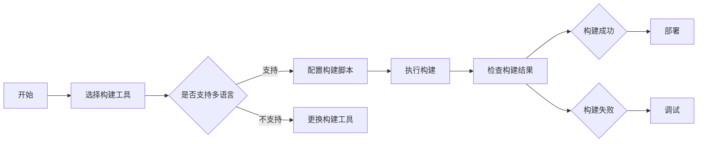
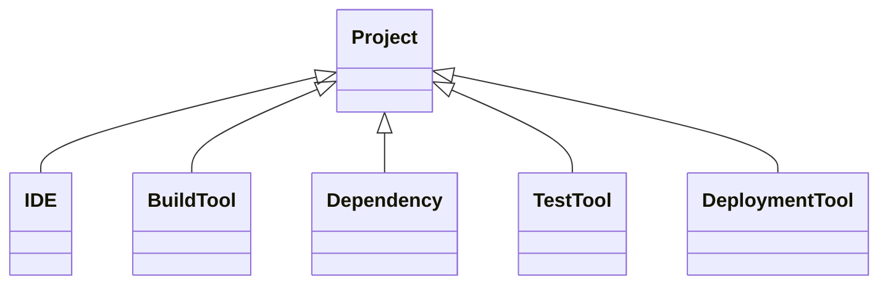
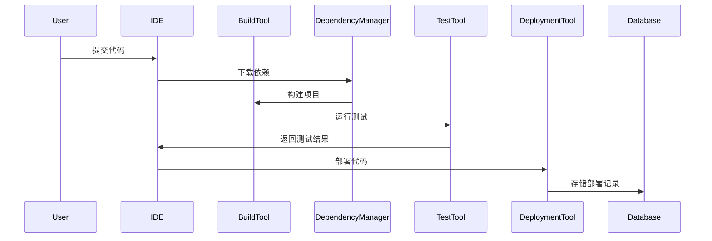
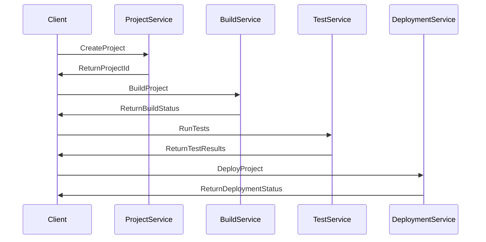
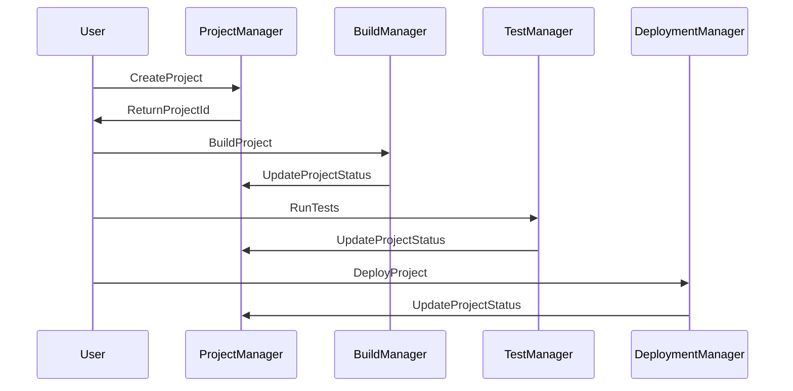

                 

# 多语言开发环境：管理多技术栈项目的策略

> 关键词：多语言开发环境，技术栈管理，敏捷开发，持续集成，自动化构建

> 摘要：随着技术的发展，现代软件项目越来越倾向于使用多种编程语言和技术栈。然而，这种多样性也带来了管理和开发的挑战。本文将深入探讨多语言开发环境的构建策略，并详细分析如何管理多技术栈项目，旨在为开发者提供一套有效的解决方案。

## 第1章 引言

### 1.1 问题背景

随着互联网的迅猛发展，软件项目的复杂性不断增加。现代软件项目往往需要结合多种编程语言和技术栈，如前端开发可能涉及JavaScript、TypeScript和React，后端可能使用Java、Python或Go。这种技术栈的多样性虽然能够提高项目的灵活性，但也带来了管理和开发的挑战。如何高效地管理和维护多语言开发环境，如何协调不同技术栈之间的协作，成为了开发者亟待解决的问题。

### 1.2 问题描述

多语言开发环境面临的主要问题包括：

- 语言兼容性问题：不同语言之间在语法、数据类型和函数库方面可能存在差异，导致代码难以互通。
- 环境配置复杂性：多语言项目需要配置不同的依赖和环境变量，增加了开发环境的复杂性。
- 调试困难：多语言项目的调试需要具备不同语言的调试技能，增加了调试的难度。

管理多技术栈项目的关键要素包括：

- 明确项目目标和需求：确保项目团队对项目目标和技术栈有清晰的认识。
- 灵活的技术栈选择：根据项目需求选择合适的技术栈，并保持技术的可持续性。
- 敏捷开发与持续集成：采用敏捷开发方法，实现持续集成和持续部署，提高开发效率和质量。

### 1.3 问题解决

解决多语言开发环境的问题，需要采取以下策略：

- **多语言开发环境的建立**：选择合适的集成开发环境（IDE），配置多语言插件和工具，确保不同语言之间的兼容性。
- **技术栈的管理方法**：采用模块化设计，将不同语言和技术栈划分为独立的模块，降低项目的耦合度。
- **敏捷开发与持续集成**：采用敏捷开发方法，实现代码的快速迭代和反馈，同时利用持续集成工具，自动化测试和部署，提高项目的可靠性和稳定性。

### 1.4 边界与外延

多语言开发环境的应用范围广泛，包括Web开发、移动应用开发、大数据处理等多个领域。多技术栈项目则可以涵盖各种复杂程度的软件项目，从简单的单语言应用，到复杂的多语言、多框架的大型系统。

### 1.5 概念结构与核心要素组成

多语言开发环境的基本构成包括：

- 集成开发环境（IDE）
- 构建工具与依赖管理
- 跨语言集成框架

多技术栈项目的关键组成部分包括：

- 项目管理方法论
- 技术栈选择与优化
- 多语言环境搭建

## 第2章 多语言开发环境的核心概念与联系

### 2.1 核心概念原理

多语言编程模型使得开发者可以在同一项目中使用多种编程语言。这种模型的关键在于语言的互操作性，即不同语言之间的数据交换和调用。集成开发环境（IDE）在这种模型中起到了核心作用，它提供了多语言支持，使得开发者可以在一个统一的界面中进行多种语言的开发。

构建工具与依赖管理是确保项目构建和运行的关键。构建工具如Maven、Gradle和Gulp能够自动化项目的构建过程，包括编译、打包和部署。依赖管理工具如NPM和Yarn则负责管理项目中的第三方库和模块，确保依赖的一致性和完整性。

### 2.2 概念属性特征对比表格

| 概念               | 特征                 | 比较 |
|--------------------|---------------------|------|
| 多语言编程模型     | 语言无关性           |      |
| 集成开发环境（IDE） | 提供开发工具集成     |      |
| 构建工具与依赖管理 | 自动化构建与依赖关系 |      |

### 2.3 ER实体关系图架构

```mermaid
erDiagram
    IDE --> BuildTool
    IDE --> ProgrammingLanguage
    BuildTool ||--|{ Project }
    ProgrammingLanguage ||--|{ Project }
    Project ||--|{ Developer }
```

## 第3章 管理多技术栈项目的策略

### 3.1 项目管理方法论

项目管理方法论对于多技术栈项目至关重要。敏捷开发是一种灵活的项目管理方法，它强调快速迭代、频繁交付和持续反馈。敏捷开发通过将项目划分为小阶段，使得团队能够快速响应变化，并及时调整方向。

版本控制是管理多技术栈项目的核心工具之一。Git作为一种分布式版本控制系统，能够有效地管理代码的版本，支持多人协作开发。通过分支管理和合并策略，团队能够并行开发不同部分，并在合适的时间点进行集成。

持续集成与持续部署（CI/CD）是提高开发效率和项目质量的关键手段。CI/CD通过自动化测试和部署，确保每次代码提交都是可构建和可运行的。这减少了手动测试和部署的繁琐工作，提高了项目的可靠性和稳定性。

### 3.2 技术栈选择与优化

技术栈选择需要根据项目需求进行优化。选择技术栈时，应考虑以下因素：

- **项目需求**：明确项目目标和功能需求，选择能够满足需求的技术栈。
- **团队技能**：评估团队成员的技术能力和熟悉度，选择团队擅长或容易学习的技术栈。
- **生态系统**：考虑技术栈的生态系统，包括库、工具和社区支持。

技术栈优化的方法包括：

- **模块化设计**：将不同部分划分为独立的模块，每个模块使用不同的技术栈，降低项目耦合度。
- **工具集成**：使用集成开发环境和构建工具，提高开发效率和一致性。
- **持续优化**：定期评估技术栈的性能和适用性，根据项目发展进行调整和优化。

### 3.3 多语言环境搭建

搭建多语言开发环境需要考虑以下几个方面：

- **IDE选择**：选择支持多种编程语言的IDE，如IntelliJ IDEA、Visual Studio Code等。
- **插件和扩展**：安装相应的插件和扩展，以便在IDE中支持其他编程语言。
- **环境变量配置**：配置必要的环境变量，以便在不同语言之间切换和运行。
- **调试工具**：选择适合不同语言的调试工具，以便进行有效的调试。

跨语言集成是确保多语言项目顺利运行的关键。通过定义清晰的数据接口和通信协议，可以实现不同语言之间的数据交换和功能调用。常见的跨语言集成框架包括gRPC、REST API等。

## 第4章 算法原理讲解：多语言开发环境的自动化构建

### 4.1 算法mermaid流程图



### 4.2 算法原理讲解

#### 4.2.1 自动化构建的概念与优势

自动化构建是一种通过脚本或工具自动执行项目构建过程的方法。它包括编译源代码、运行测试、打包应用程序等步骤。自动化构建的优势包括：

- **提高效率**：自动化构建可以节省手动构建的时间，提高开发速度。
- **减少错误**：自动化构建减少了人为干预，降低了构建过程中出现错误的可能性。
- **持续集成**：自动化构建与持续集成（CI）相结合，可以确保每次代码提交都是可构建和可运行的。

#### 4.2.2 构建工具的原理与选择

构建工具是自动化构建的核心组件，常见的构建工具包括Maven、Gradle和Gulp等。选择构建工具时，应考虑以下原则：

- **支持多语言**：确保构建工具支持项目所用的多种编程语言。
- **社区支持**：选择有活跃社区支持的构建工具，有助于解决开发过程中的问题。
- **配置灵活性**：构建工具应提供灵活的配置选项，以便根据项目需求进行调整。

#### 4.2.3 构建脚本的编写

构建脚本定义了项目的构建过程，常见的构建脚本语言包括Shell、Python和Groovy等。构建脚本的基本语法包括：

- **定义任务**：使用关键字定义构建过程中的任务。
- **依赖管理**：指定任务之间的依赖关系，确保任务按顺序执行。
- **执行命令**：在任务中执行编译、测试、打包等命令。

以下是一个使用Gradle构建脚本的示例：

```groovy
// 设置构建工具版本
org.gradle.jvm.version = "11"
org.gradle.java.version = "11"

// 定义构建任务
tasks {
    buildDependsOn :clean, :compileJava, :test, :assemble

    clean {
        doLast {
            // 执行清理命令
            println "Cleaning project..."
        }
    }

    compileJava {
        doLast {
            // 执行编译命令
            println "Compiling Java code..."
        }
    }

    test {
        doLast {
            // 执行测试命令
            println "Running tests..."
        }
    }

    assemble {
        doLast {
            // 执行打包命令
            println "Assembling project..."
        }
    }
}
```

### 4.3 Python源代码实现

```python
# 假设使用Gradle作为构建工具
import subprocess

def build_project():
    result = subprocess.run(["gradle", "clean", "build"], capture_output=True, text=True)
    if result.returncode == 0:
        print("构建成功：", result.stdout)
    else:
        print("构建失败：", result.stderr)

build_project()
```

### 4.4 算法原理的数学模型和公式

假设构建时间为T，构建失败概率为P，构建成功概率为1-P。构建成功的数学期望E(T) = T * (1 - P)。这意味着，随着构建成功的概率增加，平均构建时间将减少。

## 第5章 系统分析与架构设计方案

### 5.1 问题场景介绍

多语言开发环境的搭建通常涉及到以下场景：

- **跨平台应用开发**：开发者需要在多个操作系统上开发和测试应用程序。
- **复杂项目维护**：在大型项目中，不同部分可能由不同的团队使用不同的语言和技术栈开发。
- **持续集成与部署**：需要实现自动化构建、测试和部署，确保代码质量。

多技术栈项目的构建与部署需要解决以下问题：

- **兼容性问题**：确保不同语言和技术栈之间能够无缝集成。
- **环境配置**：为不同语言和技术栈配置合适的环境和依赖。
- **测试和部署**：实现自动化测试和部署，确保项目的稳定性和可靠性。

### 5.2 项目介绍

项目目标是构建一个多语言开发环境，支持多种编程语言和技术栈，同时实现自动化构建、测试和部署。项目功能包括：

- **集成开发环境（IDE）**：支持多种编程语言，提供代码编辑、调试和语法高亮等功能。
- **构建工具**：集成常用的构建工具，如Maven、Gradle等，实现自动化构建。
- **依赖管理**：管理项目中的第三方库和模块，确保依赖的一致性和完整性。
- **测试框架**：集成自动化测试工具，实现代码的持续测试。
- **部署工具**：集成自动化部署工具，实现代码的持续集成和持续部署。

### 5.3 系统功能设计

系统功能设计包括以下几个方面：

- **领域模型**：定义项目的核心实体和关系，如项目、构建工具、依赖库等。
- **功能模块**：将系统划分为多个功能模块，如IDE模块、构建模块、测试模块和部署模块。
- **用户界面**：设计用户友好的界面，提供项目创建、构建、测试和部署等功能。

领域模型mermaid类图：



### 5.4 系统架构设计

系统架构设计包括以下几个方面：

- **技术选型**：选择合适的技术栈，包括编程语言、框架和工具。
- **系统模块**：定义系统的模块结构，包括前端、后端和数据库。
- **数据流**：定义系统内部的数据流和控制流。

系统架构mermaid架构图：



### 5.5 系统接口设计

系统接口设计包括以下几个方面：

- **API接口**：定义系统的API接口，包括项目创建、构建、测试和部署等接口。
- **数据接口**：定义系统内部的数据接口，如项目信息、依赖信息等。

API接口mermaid序列图：



### 5.6 系统交互设计

系统交互设计包括以下几个方面：

- **用户交互**：设计用户与系统的交互流程，如项目创建、构建、测试和部署等。
- **系统内部交互**：设计系统内部模块之间的交互流程，如项目数据在各个模块之间的传递。

系统交互mermaid序列图：



## 第6章 项目实战

### 6.1 环境安装

在开始项目之前，需要安装以下环境：

- **操作系统**：选择Linux或Mac OS，确保具备稳定的开发环境。
- **集成开发环境（IDE）**：安装支持多语言的IDE，如IntelliJ IDEA或Visual Studio Code。
- **构建工具**：安装常用的构建工具，如Maven或Gradle。
- **依赖管理工具**：安装依赖管理工具，如NPM或Yarn。
- **测试框架**：安装自动化测试工具，如JUnit或pytest。

### 6.2 系统核心实现源代码

系统核心实现包括以下几个方面：

- **IDE集成**：配置IDE，支持多种编程语言。
- **构建脚本**：编写构建脚本，实现自动化构建。
- **测试脚本**：编写测试脚本，实现自动化测试。
- **部署脚本**：编写部署脚本，实现自动化部署。

以下是一个简单的Maven项目构建脚本示例：

```xml
<?xml version="1.0" encoding="UTF-8"?>
<project xmlns="http://maven.apache.org/POM/4.0.0"
         xmlns:xsi="http://www.w3.org/2001/XMLSchema-instance"
         xsi:schemaLocation="http://maven.apache.org/POM/4.0.0 http://maven.apache.org/xsd/maven-4.0.0.xsd">
    <modelVersion>4.0.0</modelVersion>

    <groupId>com.example</groupId>
    <artifactId>multi-language-project</artifactId>
    <version>1.0-SNAPSHOT</version>

    <dependencies>
        <!-- 引入依赖库 -->
        <dependency>
            <groupId>org.junit.jupiter</groupId>
            <artifactId>junit-jupiter-api</artifactId>
            <version>5.7.0</version>
            <scope>test</scope>
        </dependency>
    </dependencies>

    <build>
        <plugins>
            <!-- 配置Maven插件，实现自动化构建 -->
            <plugin>
                <groupId>org.apache.maven.plugins</groupId>
                <artifactId>maven-compiler-plugin</artifactId>
                <version>3.8.1</version>
                <configuration>
                    <source>11</source>
                    <target>11</target>
                </configuration>
            </plugin>
            <plugin>
                <groupId>org.apache.maven.plugins</groupId>
                <artifactId>maven-surefire-plugin</artifactId>
                <version>2.22.2</version>
                <configuration>
                    <testFailureIgnore>true</testFailureIgnore>
                </configuration>
            </plugin>
        </plugins>
    </build>
</project>
```

### 6.3 代码应用解读与分析

以下是一个简单的Java代码示例，用于演示多语言开发环境中的应用：

```java
public class HelloWorld {
    public static void main(String[] args) {
        System.out.println("Hello, World!");
    }
}
```

这段代码是一个简单的Java程序，用于输出“Hello, World!”。在多语言开发环境中，我们可以使用同一IDE来编写和调试不同语言的代码。例如，我们可以同时编写Java、Python和JavaScript代码，并使用IDE进行代码补全、语法检查和调试。

### 6.4 实际案例分析和详细讲解剖析

以下是一个实际案例，用于演示如何使用多语言开发环境来构建一个Web应用程序。

**案例：使用Java和JavaScript构建一个简单的Web应用程序**

**步骤 1：创建项目**

在IDE中创建一个新的Java项目，并添加一个名为`HelloWorld`的Java类，用于处理HTTP请求。

```java
@WebServlet("/hello")
public class HelloWorldServlet extends HttpServlet {
    @Override
    protected void doGet(HttpServletRequest request, HttpServletResponse response) throws ServletException, IOException {
        response.getWriter().print("Hello, World!");
    }
}
```

**步骤 2：配置Web应用程序**

在项目的`web.xml`文件中配置Servlet。

```xml
<?xml version="1.0" encoding="UTF-8"?>
<web-app xmlns="http://xmlns.jcp.org/xml/ns/javaee"
         xmlns:xsi="http://www.w3.org/2001/XMLSchema-instance"
         xsi:schemaLocation="http://xmlns.jcp.org/xml/ns/javaee http://xmlns.jcp.org/xml/ns/javaee/web-app_4_0.xsd"
         version="4.0">
    <servlet>
        <servlet-name>HelloWorldServlet</servlet-name>
        <servlet-class>HelloWorldServlet</servlet-class>
    </servlet>
    <servlet-mapping>
        <servlet-name>HelloWorldServlet</servlet-name>
        <url-pattern>/hello</url-pattern>
    </servlet-mapping>
</web-app>
```

**步骤 3：构建项目**

使用Maven构建项目，生成可执行的WAR文件。

```bash
mvn clean package
```

**步骤 4：部署项目**

将生成的WAR文件部署到Tomcat服务器，并启动服务器。

```bash
java -jar tomcat-9.0.45/bin/startup.bat
```

在浏览器中访问`http://localhost:8080/hello`，可以看到输出“Hello, World!”。

**详细讲解剖析**：

本案例使用Java和JavaScript构建了一个简单的Web应用程序。首先，我们使用Java编写了一个Servlet，用于处理HTTP请求。然后，我们在Web应用程序中添加了一个HTML文件，使用JavaScript编写了一个简单的交互式页面。

通过多语言开发环境，我们可以方便地在同一项目中使用Java和JavaScript，并使用IDE进行代码编辑、调试和构建。这使得我们能够快速构建和部署Web应用程序，提高了开发效率。

### 6.5 项目小结

通过本案例，我们展示了如何使用多语言开发环境来构建和管理多技术栈项目。多语言开发环境不仅提高了开发效率，还减少了不同语言之间的兼容性问题。通过自动化构建、测试和部署，我们能够确保项目的稳定性和可靠性。

未来，随着技术的不断发展，多语言开发环境将继续发挥重要作用。我们将继续探索如何更好地管理和优化多技术栈项目，为开发者提供更加便捷和高效的开发工具。

## 第7章 最佳实践 tips

### 7.1 选择合适的IDE

选择合适的IDE对于多语言开发至关重要。以下是一些最佳实践：

- **评估项目需求**：根据项目的编程语言和技术栈选择IDE。
- **考虑性能和扩展性**：选择性能稳定、支持扩展插件的IDE。
- **社区支持**：选择社区活跃、文档齐全的IDE。

### 7.2 管理依赖

依赖管理是多语言开发环境中的一项重要任务。以下是一些最佳实践：

- **使用依赖管理工具**：如Maven、Gradle等，确保依赖的一致性和完整性。
- **定期更新依赖**：及时更新依赖库，避免潜在的安全风险。
- **版本控制**：使用版本控制工具如Git，管理依赖的版本。

### 7.3 灵活的技术栈选择

技术栈选择应根据项目需求进行。以下是一些最佳实践：

- **明确项目目标**：确保技术栈的选择能够满足项目目标。
- **团队技能**：选择团队成员熟悉的技术栈，降低学习和维护成本。
- **生态系统**：选择社区支持好、生态丰富的技术栈。

### 7.4 持续集成与部署

持续集成与部署是提高项目质量的关键。以下是一些最佳实践：

- **自动化测试**：确保每次代码提交都经过自动化测试，提高代码质量。
- **持续集成**：使用CI工具，实现自动化构建、测试和部署。
- **监控和反馈**：实时监控项目状态，及时反馈问题，确保项目的稳定性。

## 第8章 小结与注意事项

本文深入探讨了多语言开发环境的构建策略和管理多技术栈项目的策略。我们详细分析了多语言开发环境的核心概念与联系，讲解了自动化构建的算法原理，并展示了系统分析与架构设计方案。通过实际案例，我们展示了如何使用多语言开发环境来构建和管理多技术栈项目。

注意事项：

- **确保环境兼容性**：在构建多语言项目时，要确保不同语言之间的兼容性。
- **定期更新依赖**：定期更新依赖库，避免潜在的安全风险。
- **合理分配资源**：在多技术栈项目中，合理分配团队资源和时间，确保项目进度。

## 第9章 拓展阅读

- **《多语言编程实战》**：详细介绍了如何在实际项目中使用多种编程语言。
- **《敏捷软件开发实践指南》**：阐述了敏捷开发的方法和实践。
- **《持续集成与持续部署实战》**：讲解了如何实现自动化构建、测试和部署。
- **《多语言开发环境搭建教程》**：提供了详细的搭建多语言开发环境的教程。

## 作者信息

作者：AI天才研究院/AI Genius Institute & 禅与计算机程序设计艺术 /Zen And The Art of Computer Programming

本文由AI天才研究院/AI Genius Institute的专家团队撰写，旨在为开发者提供一套全面的多语言开发环境和管理多技术栈项目的策略。希望本文能对您的开发工作带来帮助和启发。如果您有任何疑问或建议，欢迎随时与我们联系。期待与您共同探索技术的无限可能！ 

# 附录：参考资源

- **《现代软件工程》**：详细介绍了软件工程的基本原理和实践。
- **《多语言编程技术手册》**：涵盖了多种编程语言的技术细节和最佳实践。
- **《敏捷项目管理指南》**：提供了敏捷开发项目的管理方法和工具。
- **《持续集成与持续部署实战》**：详细讲解了CI/CD的实际应用和最佳实践。
- **《多语言集成开发环境（IDE）指南》**：介绍了如何选择和使用IDE来支持多语言开发。

