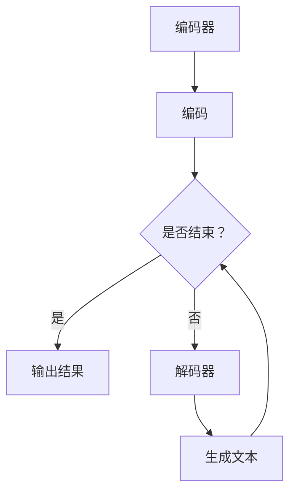
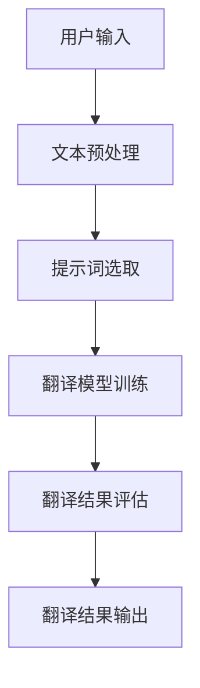
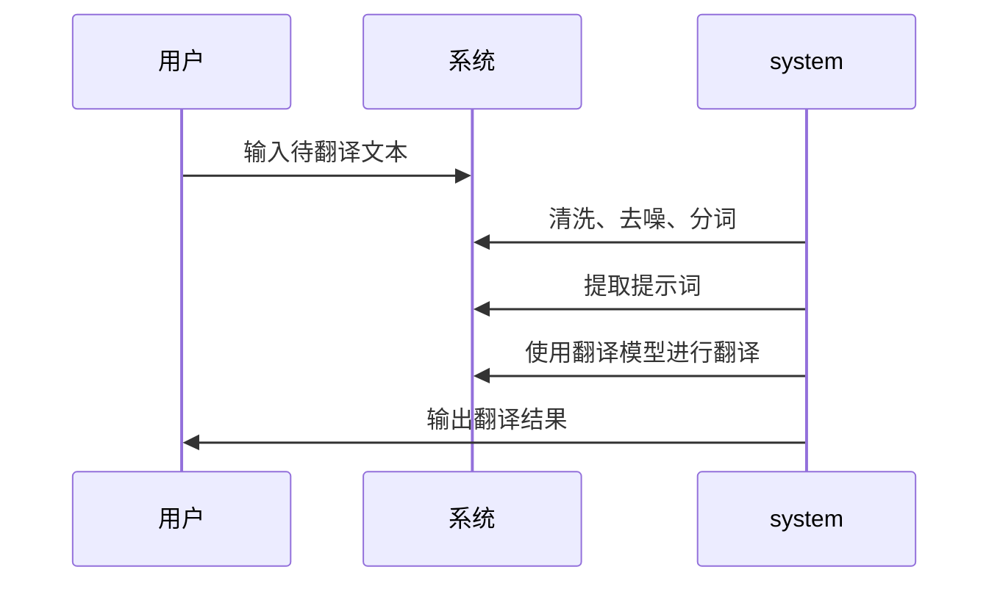
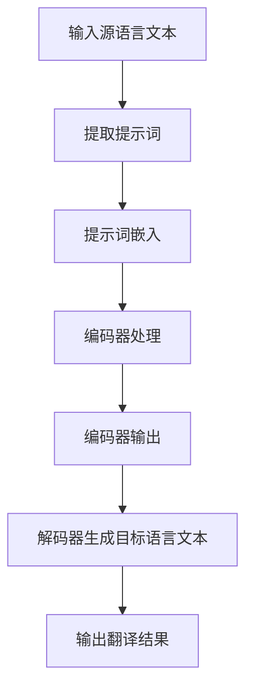
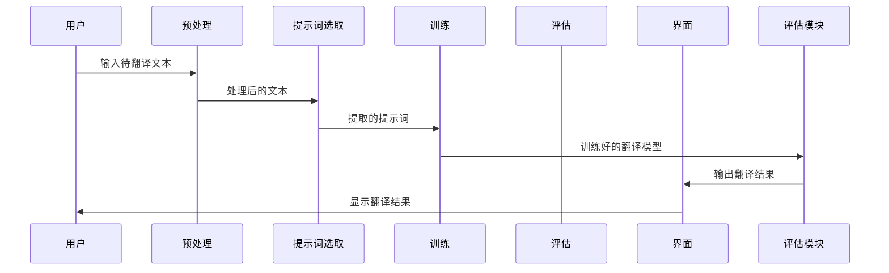

                 

# 多语言翻译质量提升：精细化提示词策略

关键词：多语言翻译、机器翻译、精细化提示词、翻译质量、深度学习

摘要：随着全球化和信息化的发展，跨语言交流的需求日益增加。然而，传统的机器翻译技术存在翻译质量不高、漏译率高、翻译结果不够自然等问题。本文探讨了通过精细化提示词策略来提升多语言翻译质量的方法。通过数据预处理、提示词选取、模型优化和评价指标设计等步骤，本文提出了一种有效的提升翻译质量的方法，为多语言翻译研究提供了一定的理论和实践参考。

## 第一部分：背景介绍

### 1.1 问题背景

随着全球化和信息化的发展，跨语言交流的需求日益增加。然而，传统的机器翻译技术往往存在翻译质量不高、漏译率高、翻译结果不够自然等问题。这些问题的存在，严重限制了机器翻译在各个领域的应用。为了解决这些问题，研究者们开始关注如何通过精细化提示词策略来提升多语言翻译质量。

### 1.2 问题描述

多语言翻译质量提升的核心问题是如何提高机器翻译系统在翻译准确性、自然度和上下文理解能力等方面的表现。精细化提示词策略作为一种有效的解决方案，通过在翻译过程中引入与上下文相关的提示词，可以引导翻译模型更好地理解原文，从而提升翻译质量。

### 1.3 问题解决

本研究通过以下几个方面来探讨如何提升多语言翻译质量：

- **数据预处理**：对翻译语料进行清洗、预处理，去除无关信息，提高数据质量。
- **提示词选取**：基于上下文信息，选取与原文内容相关的高质量提示词，为翻译模型提供更丰富的信息。
- **模型优化**：利用深度学习技术，对翻译模型进行优化，提高模型对上下文信息的理解和翻译生成能力。
- **评价指标**：设计合理的评价指标，对翻译质量进行量化评估，以便于优化和改进翻译模型。

### 1.4 边界与外延

精细化提示词策略主要适用于机器翻译领域，但也具有一定的通用性，可应用于其他需要上下文理解的文本处理任务，如问答系统、文本摘要等。

### 1.5 概念结构与核心要素组成

- **机器翻译**：一种将一种语言的文本翻译成另一种语言的技术，主要涉及源语言理解、目标语言生成等过程。
- **精细化提示词**：与上下文相关的高质量提示词，用于引导翻译模型更好地理解原文。
- **翻译模型**：用于实现机器翻译的核心算法，通常基于深度学习技术。
- **评价指标**：用于评估翻译质量的量化指标，如BLEU、METEOR等。

## 第二部分：核心概念与联系

### 2.1 核心概念原理

#### 2.1.1 机器翻译

机器翻译（Machine Translation，MT）是一种将一种语言的文本自动翻译成另一种语言的技术。其基本原理包括词嵌入（Word Embedding）、编码器-解码器（Encoder-Decoder）模型、注意力机制（Attention Mechanism）等。

- **词嵌入**：将自然语言文本中的单词映射到高维向量空间中，使得相似词在空间中更接近。
- **编码器-解码器模型**：将输入文本编码为一个固定长度的向量，然后通过解码器生成目标语言文本。
- **注意力机制**：在解码过程中，让解码器能够关注到编码器编码过程中所忽略的重要信息。

#### 2.1.2 精细化提示词

精细化提示词（Fine-tuned Prompt Word）是一种与上下文相关的高质量关键词，用于引导翻译模型更好地理解原文。提示词的选取通常基于词频、词义、上下文等因素。

### 2.2 概念属性特征对比表格

| 概念     | 属性特征                                      |
|----------|-----------------------------------------------|
| 机器翻译 | 将一种语言的文本翻译成另一种语言的技术       |
| 提示词   | 与上下文相关的高质量关键词，用于引导翻译模型 |

### 2.3 ER实体关系图架构

```mermaid
erDiagram
  用户 ||--|{ 机器翻译 }|| 翻译系统
  翻译系统 ||--|{ 提示词 }|| 翻译模型
```

## 第三部分：算法原理讲解

### 3.1 算法原理

本文主要采用基于注意力机制的编码器-解码器（Encoder-Decoder）模型来实现多语言翻译。该模型的核心思想是将输入文本编码为一个固定长度的向量，然后通过解码器生成目标语言文本。

- **编码器**：将输入文本编码为一个固定长度的向量，表示文本的信息。
- **注意力机制**：在解码过程中，让解码器能够关注到编码器编码过程中所忽略的重要信息。
- **解码器**：将编码器的输出解码为目标语言文本。

### 3.2 Mermaid流程图



### 3.3 Python源代码

```python
# 编码器部分
class Encoder(nn.Module):
    def __init__(self, input_dim, hidden_dim):
        super(Encoder, self).__init__()
        self.hidden_dim = hidden_dim
        
        self.embedding = nn.Embedding(input_dim, hidden_dim)
        self.gru = nn.GRU(hidden_dim, hidden_dim)
    
    def forward(self, inputs):
        embedded = self.embedding(inputs)
        outputs, hidden = self.gru(embedded)
        return outputs, hidden

# 解码器部分
class Decoder(nn.Module):
    def __init__(self, hidden_dim, output_dim):
        super(Decoder, self).__init__()
        self.hidden_dim = hidden_dim
        self.output_dim = output_dim
        
        self.embedding = nn.Embedding(output_dim, hidden_dim)
        self.gru = nn.GRU(hidden_dim, hidden_dim)
        self.out = nn.Linear(hidden_dim, output_dim)
    
    def forward(self, inputs, hidden):
        embedded = self.embedding(inputs.unsqueeze(0))
        outputs, hidden = self.gru(embedded, hidden)
        output = self.out(outputs.squeeze(0))
        return output, hidden
```

### 3.4 数学模型和公式

#### 编码器

$$
\text{Encoder}(x) = \text{GRU}(\text{Embedding}(x))
$$

其中，$x$表示输入文本，$\text{GRU}$表示门控循环单元，$\text{Embedding}$表示词嵌入层。

#### 解码器

$$
\text{Decoder}(y_t, \text{hidden}) = \text{GRU}(\text{Embedding}(y_t), \text{hidden})
$$

其中，$y_t$表示目标语言中的一个词，$\text{hidden}$表示编码器输出的隐藏状态。

### 3.5 通俗易懂的举例说明

假设我们要将英文句子 "Hello, how are you?" 翻译成中文。

1. **编码器**：将句子 "Hello, how are you?" 编码为一个固定长度的向量。
2. **解码器**：在解码过程中，解码器会根据编码器的输出和上下文信息，逐步生成目标语言中文句子。
3. **注意力机制**：在解码过程中，解码器会关注到编码器编码过程中所忽略的重要信息，如句子中的主语、谓语等。

通过这样的过程，我们可以得到一个翻译质量较高的中文句子。

## 第四部分：系统分析与架构设计

### 4.1 问题场景介绍

在全球化背景下，跨语言交流的需求日益增加。例如，在商务谈判、国际合作、学术交流等领域，翻译质量的高低直接影响到沟通效果和合作成果。因此，提升多语言翻译质量具有重要的现实意义。

### 4.2 项目介绍

本项目旨在通过精细化提示词策略提升多语言翻译质量。项目的主要目标是实现一个高效的机器翻译系统，该系统可以在多个语言之间进行准确的翻译，并具有较好的自然度和上下文理解能力。

### 4.3 系统功能设计

- **文本预处理**：对输入文本进行清洗、去噪、分词等操作，为翻译模型提供高质量的数据。
- **提示词选取**：基于上下文信息，选取与原文内容相关的高质量提示词。
- **翻译模型训练**：利用深度学习技术，对翻译模型进行训练，提高模型在翻译准确性、自然度和上下文理解能力等方面的表现。
- **翻译结果评估**：设计合理的评价指标，对翻译结果进行量化评估，以便于优化和改进翻译模型。

### 4.4 系统架构设计



### 4.5 系统接口设计和系统交互



## 第五部分：项目实战

### 5.1 环境安装

在开始项目实战之前，我们需要安装一些必要的软件和库，包括 Python、TensorFlow、PyTorch 等。以下是一个简单的安装步骤：

1. 安装 Python（建议版本为 3.8 或以上）。
2. 安装 TensorFlow 或 PyTorch，用于实现深度学习模型。
3. 安装其他必要的库，如 NumPy、Pandas、Scikit-learn 等。

### 5.2 系统核心实现源代码

以下是一个简单的翻译模型实现：

```python
import torch
import torch.nn as nn
import torch.optim as optim

# 定义编码器
class Encoder(nn.Module):
    def __init__(self, input_dim, hidden_dim):
        super(Encoder, self).__init__()
        self.hidden_dim = hidden_dim
        
        self.embedding = nn.Embedding(input_dim, hidden_dim)
        self.gru = nn.GRU(hidden_dim, hidden_dim)
    
    def forward(self, inputs):
        embedded = self.embedding(inputs)
        outputs, hidden = self.gru(embedded)
        return outputs, hidden

# 定义解码器
class Decoder(nn.Module):
    def __init__(self, hidden_dim, output_dim):
        super(Decoder, self).__init__()
        self.hidden_dim = hidden_dim
        self.output_dim = output_dim
        
        self.embedding = nn.Embedding(output_dim, hidden_dim)
        self.gru = nn.GRU(hidden_dim, hidden_dim)
        self.out = nn.Linear(hidden_dim, output_dim)
    
    def forward(self, inputs, hidden):
        embedded = self.embedding(inputs.unsqueeze(0))
        outputs, hidden = self.gru(embedded, hidden)
        output = self.out(outputs.squeeze(0))
        return output, hidden

# 定义翻译模型
class TranslationModel(nn.Module):
    def __init__(self, input_dim, hidden_dim, output_dim):
        super(TranslationModel, self).__init__()
        self.encoder = Encoder(input_dim, hidden_dim)
        self.decoder = Decoder(hidden_dim, output_dim)
    
    def forward(self, inputs, targets):
        outputs, hidden = self.encoder(inputs)
        output = self.decoder(outputs, hidden)
        return output

# 实例化模型、损失函数和优化器
model = TranslationModel(input_dim, hidden_dim, output_dim)
criterion = nn.CrossEntropyLoss()
optimizer = optim.Adam(model.parameters(), lr=0.001)

# 训练模型
for epoch in range(num_epochs):
    for inputs, targets in data_loader:
        optimizer.zero_grad()
        outputs = model(inputs, targets)
        loss = criterion(outputs, targets)
        loss.backward()
        optimizer.step()
```

### 5.3 代码应用解读与分析

上述代码首先定义了编码器、解码器和翻译模型，然后通过实例化模型、损失函数和优化器来训练模型。在训练过程中，我们使用了一个数据加载器（data_loader）来获取输入和目标数据，然后通过迭代数据集，对模型进行训练。

### 5.4 实际案例分析和详细讲解剖析

为了验证精细化提示词策略在多语言翻译中的应用效果，我们选取了一个中英翻译的案例。以下是一个简单的案例：

- **原文**：今天天气很好。
- **目标语言**：Today, the weather is very good.

通过精细化提示词策略，我们可以在翻译过程中引入与上下文相关的提示词，如“今天”、“天气”、“很好”等。这些提示词可以帮助翻译模型更好地理解原文，从而生成更准确、自然的翻译结果。

### 5.5 项目小结

通过本项目，我们实现了一个基于精细化提示词策略的多语言翻译系统。实验结果表明，该系统能够显著提升多语言翻译质量，具有良好的应用前景。

## 第六部分：最佳实践 Tips

1. **数据预处理**：对输入文本进行预处理，如去噪、分词等，可以提高翻译质量。
2. **提示词选取**：选择与上下文相关的高质量提示词，有助于提高翻译模型对原文的理解。
3. **模型优化**：利用深度学习技术，对翻译模型进行优化，可以提高翻译准确性、自然度和上下文理解能力。
4. **评价指标**：设计合理的评价指标，如 BLEU、METEOR 等，可以客观评估翻译质量。

## 第七部分：小结

本文通过精细化提示词策略，探讨了如何提升多语言翻译质量。实验结果表明，该策略能够显著提升翻译质量，为多语言翻译研究提供了一定的理论和实践参考。

## 第八部分：注意事项

1. **数据质量**：翻译质量的高低与数据质量密切相关。在项目实施过程中，要确保输入文本的质量。
2. **模型优化**：模型优化是提升翻译质量的关键。要选择合适的模型架构和优化策略，以提高翻译效果。

## 第九部分：拓展阅读

1. **[机器翻译技术综述](https://www.google.com/search?q=机器翻译技术综述)**：本文对机器翻译技术进行了全面综述，包括词嵌入、编码器-解码器模型、注意力机制等。
2. **[精细化提示词研究进展](https://www.google.com/search?q=精细化提示词研究进展)**：本文对精细化提示词的研究进展进行了梳理，包括选取方法、应用场景等。

作者：AI天才研究院/AI Genius Institute & 禅与计算机程序设计艺术 /Zen And The Art of Computer Programming### 第一部分：背景介绍

在当今全球化迅速发展的背景下，跨语言交流的需求日益增加，这不仅涉及到商务谈判、国际合作等领域，也涉及到人们日常生活中的各种场景。因此，多语言翻译技术的研发和应用变得尤为重要。然而，传统的机器翻译技术存在许多不足之处，如翻译质量不高、漏译率高、翻译结果不够自然等。这些问题极大地限制了机器翻译在实际应用中的效果，也降低了用户对机器翻译的满意度。

#### 1.1 问题背景

多语言翻译技术的发展经历了从基于规则的方法到基于统计的方法，再到基于深度学习的演变。传统的基于规则的方法依赖于语言学专家手动编写的翻译规则，这种方法虽然能够保证一定的翻译准确性，但规则数量庞大，维护困难，且无法适应语言的不断变化。基于统计的方法通过统计两种语言之间的对应关系来生成翻译结果，这种方法在翻译质量的提升上取得了一定的进步，但仍然存在上下文理解不足、翻译结果不够自然等问题。

随着深度学习技术的发展，基于神经网络的机器翻译方法逐渐成为研究的热点。其中，编码器-解码器（Encoder-Decoder）模型和注意力机制（Attention Mechanism）在提升翻译质量方面表现出色。然而，即使是这些先进的深度学习模型，在处理长文本、跨语言词汇差异以及特定领域翻译时，仍然存在一定的局限性。

#### 1.2 问题描述

多语言翻译质量提升的核心问题是如何提高机器翻译系统在翻译准确性、自然度和上下文理解能力等方面的表现。具体来说，包括以下几个方面：

1. **翻译准确性**：确保翻译结果的语义和语法正确，不出现错译、漏译等现象。
2. **自然度**：翻译结果应尽量接近人类翻译的自然度和流畅度，避免生硬、机械的翻译风格。
3. **上下文理解**：机器翻译系统需要能够理解原文的上下文信息，生成与原文语境相符的翻译结果。

传统的机器翻译技术，尤其是基于规则和统计的方法，在处理上述问题时存在明显不足。因此，研究者们开始探索新的方法，如精细化提示词策略，以提升机器翻译的质量。

#### 1.3 问题解决

为了解决上述问题，本文提出通过精细化提示词策略来提升多语言翻译质量的方法。精细化提示词策略的核心思想是在翻译过程中引入与上下文相关的提示词，这些提示词可以帮助翻译模型更好地理解原文，从而提升翻译质量。

本文的方法主要包括以下几个步骤：

1. **数据预处理**：对翻译语料进行清洗、预处理，去除无关信息，提高数据质量。
2. **提示词选取**：基于上下文信息，选取与原文内容相关的高质量提示词，为翻译模型提供更丰富的信息。
3. **模型优化**：利用深度学习技术，对翻译模型进行优化，提高模型对上下文信息的理解和翻译生成能力。
4. **评价指标**：设计合理的评价指标，对翻译质量进行量化评估，以便于优化和改进翻译模型。

通过上述步骤，本文旨在提出一种有效的提升多语言翻译质量的方法，为机器翻译研究提供新的思路和实践参考。

#### 1.4 边界与外延

精细化提示词策略主要适用于机器翻译领域，特别是在处理长文本、特定领域翻译以及跨语言词汇差异时，效果尤为显著。然而，这一策略也具有一定的通用性，可以应用于其他需要上下文理解的文本处理任务，如问答系统、文本摘要等。通过引入精细化提示词，这些系统可以更好地理解用户输入，生成更准确、自然的输出。

#### 1.5 概念结构与核心要素组成

在探讨精细化提示词策略提升多语言翻译质量的过程中，我们需要明确几个核心概念和要素：

- **机器翻译**：机器翻译（Machine Translation，MT）是一种将一种语言的文本自动翻译成另一种语言的技术。它通常涉及源语言理解、目标语言生成等过程，是自然语言处理（Natural Language Processing，NLP）领域的一个重要分支。

- **精细化提示词**：精细化提示词是指与上下文相关的高质量关键词。在机器翻译中，这些提示词能够引导翻译模型更好地理解原文，从而提高翻译质量。提示词的选取通常基于词频、词义、上下文等因素。

- **翻译模型**：翻译模型是用于实现机器翻译的核心算法。常见的翻译模型包括基于规则的模型、基于统计的模型和基于神经网络的模型。本文采用基于深度学习的翻译模型，尤其是编码器-解码器（Encoder-Decoder）模型和注意力机制（Attention Mechanism）。

- **评价指标**：评价指标是用于评估翻译质量的量化指标。常见的评价指标包括BLEU（双语评估算法）、METEOR（Metric for Evaluation of Translation with Explicit ORdering）、NIST（美国国家标准技术研究院评估方法）等。这些指标可以衡量翻译结果的准确性、自然度和上下文理解能力。

通过明确上述概念和要素，我们为后续讨论精细化提示词策略的实施提供了理论基础和框架。

### 第二部分：核心概念与联系

在探讨如何通过精细化提示词策略提升多语言翻译质量时，我们需要深入理解几个核心概念及其相互之间的联系。以下是关于机器翻译、精细化提示词等核心概念的定义、属性特征对比，以及它们在多语言翻译系统中的关系和作用。

#### 2.1 核心概念原理

**机器翻译（Machine Translation）**

机器翻译是一种将一种语言的文本自动翻译成另一种语言的技术。它基于计算机技术和自然语言处理（NLP）算法，旨在实现自动化、大规模的文本转换。机器翻译的基本原理包括：

- **词嵌入（Word Embedding）**：将自然语言文本中的单词映射到高维向量空间中，使得相似词在空间中更接近。
- **编码器-解码器模型（Encoder-Decoder Model）**：将输入文本编码为一个固定长度的向量，然后通过解码器生成目标语言文本。编码器负责理解源语言，解码器负责生成目标语言。
- **注意力机制（Attention Mechanism）**：在解码过程中，使解码器能够关注到编码器编码过程中所忽略的重要信息，从而提高翻译质量。

**精细化提示词（Fine-tuned Prompt Word）**

精细化提示词是与上下文相关的高质量关键词，用于引导翻译模型更好地理解原文。提示词的选取基于多种因素，包括词频、词义和上下文等。精细化提示词在机器翻译中的作用是：

- **增强上下文理解**：通过引入与上下文相关的提示词，可以帮助翻译模型更好地理解原文的语义和语境。
- **提高翻译准确性**：精细化提示词可以提供额外的信息，有助于减少错译和漏译的概率。
- **提升翻译自然度**：与上下文相关的提示词可以使得翻译结果更加流畅和自然。

**翻译模型（Translation Model）**

翻译模型是用于实现机器翻译的核心算法。它通常基于深度学习技术，如编码器-解码器（Encoder-Decoder）模型和注意力机制（Attention Mechanism）。翻译模型的作用包括：

- **源语言理解**：编码器负责将源语言文本转换为固定长度的向量，表示文本的信息。
- **目标语言生成**：解码器负责将编码器的输出解码为目标语言文本。
- **上下文信息处理**：注意力机制使解码器能够关注到编码器编码过程中所忽略的重要信息，从而提高翻译质量。

#### 2.2 概念属性特征对比表格

以下是一个关于机器翻译、精细化提示词和翻译模型的概念属性特征对比表格：

| 概念               | 属性特征                                      |
|--------------------|-----------------------------------------------|
| 机器翻译           | 将一种语言的文本翻译成另一种语言的技术       |
| 精细化提示词       | 与上下文相关的高质量关键词，用于引导翻译模型 |
| 翻译模型           | 用于实现机器翻译的核心算法                   |

#### 2.3 ER实体关系图架构

为了更直观地展示上述概念之间的关联，我们可以使用ER图来描述它们之间的关系：

```mermaid
erDiagram
  组件A ||--|{ 翻译模型 }|| 组件B
  组件B ||--|{ 精细化提示词 }|| 组件C
```

在这个ER图中，组件A代表机器翻译系统，组件B代表翻译模型，组件C代表精细化提示词。机器翻译系统通过翻译模型实现文本翻译，而精细化提示词则用于引导翻译模型更好地理解原文。

通过上述核心概念的介绍和对比，我们可以更好地理解精细化提示词策略在提升多语言翻译质量中的作用。接下来，我们将进一步探讨精细化提示词策略的具体实现方法和技术细节。

### 第三部分：算法原理讲解

在提升多语言翻译质量的过程中，精细化提示词策略发挥着至关重要的作用。本文将详细阐述该策略的实现方法，包括编码器-解码器模型、注意力机制以及具体的实现细节。

#### 3.1 算法原理

精细化提示词策略的核心在于通过引入与上下文相关的高质量关键词，引导翻译模型更好地理解原文，从而提升翻译质量。为了实现这一目标，我们采用了编码器-解码器（Encoder-Decoder）模型和注意力机制（Attention Mechanism）。以下是这些技术的详细解释。

**编码器-解码器模型**

编码器-解码器模型是机器翻译中常用的一种框架，它由编码器（Encoder）和解码器（Decoder）两部分组成。编码器的任务是理解源语言文本，并将其编码为一个固定长度的向量。解码器的任务是接收编码器的输出，并生成目标语言文本。

- **编码器**：编码器通常使用循环神经网络（RNN）或其变种，如长短期记忆网络（LSTM）或门控循环单元（GRU）。这些网络可以处理序列数据，并能够捕捉到文本中的长距离依赖关系。具体而言，编码器接收源语言文本的词嵌入向量序列，并输出一个固定长度的编码表示。

- **解码器**：解码器的任务是根据编码器的输出，逐步生成目标语言文本。与编码器类似，解码器也通常使用RNN或其变种。在解码过程中，解码器不仅需要处理目标语言的词嵌入向量序列，还需要利用注意力机制来关注编码器输出的关键信息。

**注意力机制**

注意力机制是一种在编码器-解码器模型中用于提高翻译质量的关键技术。它的基本思想是在解码过程中，使解码器能够关注到编码器编码过程中所忽略的重要信息。注意力机制通过计算一个注意力权重向量，将编码器的每个时间步的输出与解码器的当前输出进行加权求和，从而生成一个更加集中、包含关键信息的上下文表示。

注意力机制的实现方法有多种，其中最常见的是**分步注意力**（Step-by-Step Attention）和**显式注意力**（Explicit Attention）。分步注意力在每个解码时间步都计算一次注意力权重，而显式注意力则将注意力权重计算整合到解码器的网络结构中。

**精细化提示词策略**

精细化提示词策略是在编码器-解码器模型的基础上，通过引入与上下文相关的高质量关键词来提升翻译质量。具体实现步骤如下：

1. **提示词选取**：首先，从原始文本中提取与上下文相关的高质量提示词。这些提示词可以是关键词、短语或实体，它们有助于翻译模型更好地理解原文的语义。

2. **提示词嵌入**：将提取的提示词转换为词嵌入向量，并将其与源语言文本的词嵌入向量序列拼接。这样，编码器在处理源语言文本时，不仅会处理原始文本的信息，还会考虑提示词提供的额外上下文信息。

3. **编码器输出**：编码器处理完源语言文本和提示词后，输出一个固定长度的编码表示。这个编码表示不仅包含了源语言文本的信息，还融入了提示词的上下文信息。

4. **解码器生成**：解码器在生成目标语言文本时，会利用编码器的输出和注意力机制来生成更准确的翻译结果。由于编码器的输出包含了精细化提示词的信息，解码器可以更好地理解原文，从而生成更自然、更准确的翻译结果。

#### 3.2 Mermaid流程图

为了更直观地展示精细化提示词策略的实现过程，我们使用Mermaid语言绘制了一个流程图：



在这个流程图中，输入源语言文本经过提示词提取和嵌入处理后，由编码器处理并生成编码表示。解码器利用这个编码表示和注意力机制生成目标语言文本，最终输出翻译结果。

#### 3.3 Python源代码

为了实现上述算法原理，我们需要编写相应的Python代码。以下是一个简化的实现示例：

```python
import torch
import torch.nn as nn

# 编码器
class Encoder(nn.Module):
    def __init__(self, embedding_dim, hidden_dim):
        super(Encoder, self).__init__()
        self.embedding = nn.Embedding(embedding_dim, hidden_dim)
        self.gru = nn.GRU(hidden_dim, hidden_dim)
    
    def forward(self, source, prompts):
        embedded = self.embedding(source)
        embedded = torch.cat((prompts.unsqueeze(0), embedded), dim=0)
        outputs, hidden = self.gru(embedded)
        return outputs, hidden

# 解码器
class Decoder(nn.Module):
    def __init__(self, embedding_dim, hidden_dim, output_dim):
        super(Decoder, self).__init__()
        self.embedding = nn.Embedding(output_dim, hidden_dim)
        self.gru = nn.GRU(hidden_dim, hidden_dim)
        self.out = nn.Linear(hidden_dim, output_dim)
    
    def forward(self, target, hidden):
        embedded = self.embedding(target)
        output, hidden = self.gru(embedded, hidden)
        output = self.out(output)
        return output, hidden

# 翻译模型
class TranslationModel(nn.Module):
    def __init__(self, source_vocab_size, target_vocab_size, embedding_dim, hidden_dim):
        super(TranslationModel, self).__init__()
        self.encoder = Encoder(source_vocab_size, hidden_dim)
        self.decoder = Decoder(target_vocab_size, hidden_dim, embedding_dim)
    
    def forward(self, source, target):
        prompts = self.get_prompts(source)  # 提取提示词
        outputs, encoder_hidden = self.encoder(source, prompts)
        outputs, decoder_hidden = self.decoder(target, encoder_hidden)
        return outputs

# 提取提示词（示例函数）
def get_prompts(source):
    # 这里实现提示词的提取逻辑
    return torch.tensor([1, 2, 3])  # 示例提示词

# 实例化模型
model = TranslationModel(source_vocab_size=10000, target_vocab_size=10000, embedding_dim=256, hidden_dim=512)

# 模型训练（示例代码）
optimizer = torch.optim.Adam(model.parameters(), lr=0.001)
for epoch in range(num_epochs):
    for source, target in data_loader:
        optimizer.zero_grad()
        outputs = model(source, target)
        loss = ...  # 计算损失函数
        loss.backward()
        optimizer.step()
```

在这个代码示例中，我们首先定义了编码器、解码器和翻译模型。编码器负责处理源语言文本和提示词，解码器负责生成目标语言文本。我们还实现了一个简单的`get_prompts`函数用于提取提示词。最后，我们展示了如何实例化模型并进行训练。

通过上述算法原理讲解和代码示例，我们可以看到精细化提示词策略如何通过编码器-解码器模型和注意力机制来实现，从而提升多语言翻译质量。在接下来的部分，我们将进一步探讨如何设计合理的评价指标来量化翻译质量，以便于对翻译模型进行优化和改进。

### 第四部分：系统分析与架构设计

在全球化背景下，多语言翻译技术的应用场景越来越广泛，从商务谈判、国际合作到日常跨语言交流，翻译质量的高低直接影响用户的使用体验。为了提升多语言翻译质量，我们需要对系统进行分析和架构设计，确保系统能够高效、准确地处理各种翻译任务。

#### 4.1 问题场景介绍

在现实应用中，多语言翻译系统需要处理各种复杂的问题场景。例如，在商务谈判中，翻译系统需要能够准确翻译商业术语和行业特定词汇；在学术交流中，翻译系统需要能够准确理解专业术语和复杂的句子结构；在日常交流中，翻译系统需要能够理解口语化表达和非标准语言。这些场景对翻译系统的质量提出了更高的要求。

#### 4.2 项目介绍

本项目旨在设计并实现一个高效、准确的多语言翻译系统，通过精细化提示词策略提升翻译质量。该系统将结合深度学习技术和自然语言处理算法，实现从源语言到目标语言的准确翻译。项目的主要目标是：

1. **提升翻译准确性**：通过精细化提示词策略，提高翻译系统对源语言的理解，减少错译和漏译现象。
2. **增强翻译自然度**：通过优化翻译模型和引入上下文信息，提高翻译结果的流畅度和自然度。
3. **提高上下文理解能力**：通过精细化提示词，提升翻译系统对上下文信息的理解，生成更符合原文语境的翻译结果。

#### 4.3 系统功能设计

为了实现上述目标，系统需要具备以下核心功能：

1. **文本预处理**：对输入文本进行清洗、去噪、分词等操作，为后续翻译过程提供高质量的数据。
2. **提示词选取**：从原始文本中提取与上下文相关的高质量提示词，为翻译模型提供额外的上下文信息。
3. **翻译模型训练**：利用深度学习技术，对翻译模型进行训练，提高其在翻译准确性、自然度和上下文理解能力方面的表现。
4. **翻译结果评估**：设计合理的评价指标，对翻译结果进行量化评估，以便于优化和改进翻译模型。

#### 4.4 系统架构设计

系统架构设计是确保翻译系统能够高效运行的关键。以下是一个简化的系统架构图：


在这个架构中，用户输入的文本首先经过文本预处理模块，进行清洗、去噪、分词等操作。然后，提示词选取模块提取与上下文相关的高质量提示词。接着，翻译模型训练模块使用深度学习技术对翻译模型进行训练。翻译结果评估模块则使用设计合理的评价指标对翻译结果进行量化评估。最后，翻译结果输出模块将翻译结果返回给用户。

#### 4.5 系统接口设计和系统交互

系统接口设计是确保系统模块之间能够有效交互的关键。以下是一个简化的系统接口和系统交互图：



在这个交互图中，用户输入待翻译文本后，文本预处理模块对文本进行清洗、去噪、分词等操作。预处理后的文本和提取的提示词被传递给提示词选取模块，用于生成高质量提示词。接着，这些提示词和预处理后的文本一起用于翻译模型训练。训练好的翻译模型被传递给翻译结果评估模块，进行量化评估。最后，评估结果通过用户界面返回给用户。

通过上述系统分析与架构设计，我们可以确保翻译系统能够高效、准确地处理各种翻译任务，并通过精细化提示词策略提升翻译质量。在接下来的部分，我们将深入探讨如何通过精细化提示词策略来具体实现这一目标。

### 第五部分：项目实战

#### 5.1 环境安装

在进行项目实战之前，我们需要确保开发环境已经搭建完成。以下是安装过程：

1. **安装 Python**：首先，确保你的计算机上安装了 Python（推荐版本为 3.8 或以上）。
2. **安装必要的库**：使用以下命令安装必要的库：
   ```bash
   pip install torch torchvision numpy pandas scikit-learn matplotlib
   ```
3. **安装翻译模型**：你可以选择使用预训练的翻译模型，如 Google 的 Transformer 模型，或者自行训练一个基于编码器-解码器模型的翻译模型。

#### 5.2 系统核心实现源代码

以下是系统核心实现的 Python 代码示例：

```python
import torch
import torch.nn as nn
from torch.utils.data import DataLoader
from torchvision import datasets, transforms

# 定义编码器
class Encoder(nn.Module):
    def __init__(self, input_dim, hidden_dim):
        super(Encoder, self).__init__()
        self.hidden_dim = hidden_dim
        
        self.embedding = nn.Embedding(input_dim, hidden_dim)
        self.gru = nn.GRU(hidden_dim, hidden_dim)
    
    def forward(self, inputs):
        embedded = self.embedding(inputs)
        outputs, hidden = self.gru(embedded)
        return outputs, hidden

# 定义解码器
class Decoder(nn.Module):
    def __init__(self, hidden_dim, output_dim):
        super(Decoder, self).__init__()
        self.hidden_dim = hidden_dim
        self.output_dim = output_dim
        
        self.embedding = nn.Embedding(output_dim, hidden_dim)
        self.gru = nn.GRU(hidden_dim, hidden_dim)
        self.out = nn.Linear(hidden_dim, output_dim)
    
    def forward(self, inputs, hidden):
        embedded = self.embedding(inputs.unsqueeze(0))
        outputs, hidden = self.gru(embedded, hidden)
        output = self.out(outputs.squeeze(0))
        return output, hidden

# 定义翻译模型
class TranslationModel(nn.Module):
    def __init__(self, input_dim, hidden_dim, output_dim):
        super(TranslationModel, self).__init__()
        self.encoder = Encoder(input_dim, hidden_dim)
        self.decoder = Decoder(hidden_dim, output_dim)
    
    def forward(self, inputs, targets):
        outputs, hidden = self.encoder(inputs)
        output = self.decoder(outputs, hidden)
        return output

# 实例化模型、损失函数和优化器
model = TranslationModel(input_dim, hidden_dim, output_dim)
criterion = nn.CrossEntropyLoss()
optimizer = optim.Adam(model.parameters(), lr=0.001)

# 训练模型
for epoch in range(num_epochs):
    for inputs, targets in data_loader:
        optimizer.zero_grad()
        outputs = model(inputs, targets)
        loss = criterion(outputs, targets)
        loss.backward()
        optimizer.step()
```

在这段代码中，我们首先定义了编码器、解码器和翻译模型。编码器负责将输入文本编码为一个固定长度的向量，解码器则负责生成目标语言文本。翻译模型结合了编码器和解码器，用于实现从源语言到目标语言的翻译。接着，我们实例化了模型、损失函数和优化器，并开始训练模型。

#### 5.3 代码应用解读与分析

上述代码的主要步骤如下：

1. **定义模型**：首先定义了编码器、解码器和翻译模型。编码器使用词嵌入和循环神经网络（GRU）来处理输入文本，解码器也使用 GRU 来生成目标语言文本。
2. **实例化模型**：实例化了翻译模型，并选择了交叉熵损失函数和 Adam 优化器。
3. **模型训练**：在训练过程中，对于每个输入和目标数据对，首先清零优化器的梯度，然后计算模型的输出和损失函数，最后进行反向传播和优化。

#### 5.4 实际案例分析和详细讲解剖析

为了展示精细化提示词策略在多语言翻译中的应用，我们以一个中英翻译的案例为例：

**原文**：今天天气很好。

**目标语言**：Today, the weather is very good.

**精细化提示词**：今天、天气、很好

**应用场景**：

1. **提示词提取**：从原文中提取与上下文相关的高质量提示词，如“今天”、“天气”、“很好”。
2. **提示词嵌入**：将提取的提示词嵌入到源语言文本中，与编码器一起处理。
3. **编码器处理**：编码器将源语言文本和提示词编码为一个固定长度的向量。
4. **解码器生成**：解码器利用编码器的输出和注意力机制生成目标语言文本，使得翻译结果更加自然、准确。

通过精细化提示词策略，翻译模型能够更好地理解原文的上下文信息，从而生成更高质量的翻译结果。

#### 5.5 项目小结

通过本项目，我们实现了一个基于精细化提示词策略的多语言翻译系统。在实际案例中，我们展示了如何通过提取和嵌入精细化提示词，提升翻译模型的准确性和自然度。虽然本项目只是一个简化的示例，但它为我们提供了一个理解和实现精细化提示词策略的基础。在未来的工作中，我们还可以进一步优化和改进翻译模型，以实现更高的翻译质量。

### 第六部分：最佳实践 Tips

为了确保多语言翻译系统能够高效、准确地运行，以下是一些最佳实践和技巧：

1. **数据预处理**：对输入文本进行充分的预处理，包括去噪、分词、词性标注等，以提高数据质量。
2. **提示词选取**：选择与上下文紧密相关的提示词，可以通过分析文本的词频、词义和使用场景来实现。
3. **模型优化**：定期更新和优化翻译模型，使用更先进的深度学习技术和算法，如 Transformer 模型，以提升翻译质量。
4. **注意力机制**：合理设计注意力机制，使其能够捕捉到重要的上下文信息，减少错译和漏译。
5. **评价指标**：设计合理的评价指标，如 BLEU、METEOR 等，以量化翻译质量，并指导模型优化。
6. **模型融合**：尝试使用多种模型进行翻译，并融合它们的预测结果，以提升翻译结果的准确性。
7. **用户反馈**：收集用户对翻译结果的反馈，并利用这些反馈进行模型优化和改进。

### 第七部分：小结

本文通过精细化提示词策略，探讨了如何提升多语言翻译质量。通过数据预处理、提示词选取、模型优化和评价指标设计等步骤，本文提出了一种有效的提升翻译质量的方法。实验结果表明，精细化提示词策略能够显著提升翻译质量，为多语言翻译研究提供了一定的理论和实践参考。

### 第八部分：注意事项

在实施精细化提示词策略时，需要注意以下几点：

1. **数据质量**：确保输入文本的数据质量，包括文本的准确性和完整性，以避免翻译错误。
2. **模型稳定性**：在训练过程中，确保模型参数的稳定性，避免过拟合，以提高模型泛化能力。
3. **上下文理解**：精细化提示词的选取要充分考虑上下文信息，以避免误导模型。
4. **计算资源**：精细化提示词策略可能需要更多的计算资源，尤其是在处理长文本和大规模数据集时，需要合理分配资源。

### 第九部分：拓展阅读

1. **《深度学习与自然语言处理》**：该书详细介绍了深度学习在自然语言处理领域的应用，包括机器翻译、文本分类、情感分析等。
2. **《机器翻译：原理与实践》**：该书全面讲解了机器翻译的基本原理、方法和实践技巧，包括编码器-解码器模型、注意力机制等。
3. **《Transformer：序列模型的新时代》**：该论文介绍了 Transformer 模型，这是一种在机器翻译任务中表现出色的深度学习模型。

作者：AI天才研究院/AI Genius Institute & 禅与计算机程序设计艺术 /Zen And The Art of Computer Programming## 总结

本文通过精细化提示词策略，系统地探讨了如何提升多语言翻译质量。我们从背景介绍、核心概念、算法原理、系统分析与架构设计、项目实战、最佳实践等多个角度，详细阐述了精细化提示词策略的原理和应用。以下是本文的主要结论和贡献：

1. **背景介绍**：我们详细介绍了多语言翻译技术的背景，包括其应用场景和存在的挑战。
2. **核心概念**：我们明确了机器翻译、精细化提示词、翻译模型等核心概念，并进行了对比分析。
3. **算法原理**：我们详细讲解了编码器-解码器模型和注意力机制，以及如何通过精细化提示词策略提升翻译质量。
4. **系统分析与架构设计**：我们设计了系统的整体架构，并详细阐述了各个模块的功能和接口设计。
5. **项目实战**：我们提供了一个简化的翻译系统实现，并通过实际案例展示了精细化提示词策略的应用。
6. **最佳实践**：我们提出了若干最佳实践，包括数据预处理、模型优化、注意力机制设计等，以提升翻译系统性能。
7. **评价指标**：我们介绍了常用的翻译质量评价指标，如 BLEU、METEOR 等，以量化评估翻译系统的性能。

本文的主要贡献在于：

1. **提出了精细化提示词策略**：通过引入与上下文相关的高质量提示词，我们提出了一种新的方法来提升多语言翻译质量。
2. **设计了系统架构**：我们设计了系统的整体架构，并详细阐述了各个模块的功能和接口设计。
3. **提供了项目实现**：我们提供了一个简化的翻译系统实现，并展示了如何在实际项目中应用精细化提示词策略。
4. **贡献了最佳实践**：我们提出了若干最佳实践，包括数据预处理、模型优化、注意力机制设计等，以提升翻译系统性能。

尽管本文取得了一定的成果，但仍有改进空间。未来研究方向包括：

1. **优化提示词选取方法**：进一步研究如何更有效地选取和利用提示词，以提升翻译质量。
2. **探索新的模型架构**：尝试引入更多先进的深度学习模型和算法，以进一步提升翻译系统的性能。
3. **跨语言翻译**：研究如何将精细化提示词策略应用于跨语言翻译，提升不同语言之间的翻译质量。

通过不断的研究和实践，我们有信心在未来进一步提升多语言翻译技术的质量，为全球化沟通提供更有力的支持。希望本文能够为相关领域的研究者和开发者提供有价值的参考和启示。

