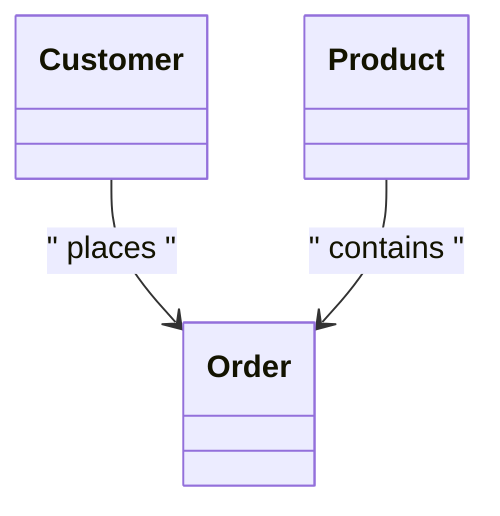

                 

# 大数据分析平台架构设计

## 关键词

- 大数据分析
- 平台架构设计
- 数据预处理
- 数据挖掘算法
- 数据流处理
- 系统性能优化

## 摘要

本文将深入探讨大数据分析平台架构设计的全过程，从背景介绍、核心概念与联系分析、算法原理讲解、系统架构设计、项目实战到最佳实践，全面剖析大数据分析平台的构建与优化策略。通过对大数据的定义、处理需求、重要性以及相关核心概念和算法的详细阐述，帮助读者构建起对大数据分析平台的全面理解，同时提供实用的系统架构设计方案和项目实战经验。

## 目录大纲

### 第一部分：背景介绍

1. **问题背景**
   - **大数据的定义与特点**
   - **数据处理需求**
   - **现状分析**

2. **大数据分析的重要性**
   - **商业价值**
   - **技术发展**

### 第二部分：核心概念与联系

1. **大数据分析的基本概念**
   - **数据挖掘**
   - **数据仓库**
   - **数据流处理**

2. **概念属性特征对比表格**
   - **不同数据存储方式的对比**
   - **大数据分析工具对比**

3. **ER实体关系图架构**
   - **ER图绘制**
   - **实体属性定义**

### 第三部分：算法原理讲解

1. **数据预处理算法**
   - **数据清洗**
   - **数据归一化与标准化**

2. **数据挖掘算法**
   - **聚类算法**
   - **分类算法**

3. **数据流处理算法**
   - **流计算概念**
   - **实时数据挖掘算法**

### 第四部分：系统架构设计

1. **系统架构设计**
   - **问题场景介绍**
   - **系统功能设计**
   - **系统架构设计**
   - **系统接口设计**
   - **系统交互设计**

### 第五部分：项目实战

1. **项目环境安装与配置**
   - **环境准备**
   - **系统核心实现**

2. **项目代码解读与分析**
   - **代码解读**
   - **实际案例分析与讲解**
   - **项目小结**

### 第六部分：最佳实践与拓展阅读

1. **最佳实践**
   - **性能优化技巧**
   - **安全性考虑**

2. **小结与拓展阅读**

## 第一部分：背景介绍

### 问题背景

#### 大数据的定义与特点

**概念定义**：大数据（Big Data）是指数据量巨大、数据类型多样、数据生成和处理速度极快的海量数据。它包括了结构化数据、半结构化数据和非结构化数据。

**数据处理需求**：随着互联网、物联网、移动设备等技术的快速发展，产生了大量数据。如何有效地存储、处理和分析这些数据，成为当前信息技术领域的一个重大挑战。大数据处理的四大特点是 **V** 值，即 **Volume（大量）**、**Velocity（高速）**、**Variety（多样）** 和 **Veracity（真实性）**。

**现状分析**：大数据技术已经在金融、医疗、电商、互联网等行业得到广泛应用。例如，金融行业利用大数据进行风险评估、投资策略制定；医疗行业通过大数据分析提高疾病诊断的准确性；电商行业利用大数据进行个性化推荐等。

#### 大数据分析的重要性

**商业价值**：大数据分析为企业提供了深度的数据洞察，有助于企业做出更准确的决策。例如，通过分析客户行为数据，企业可以精准定位目标客户群体，提升营销效果。

**技术发展**：大数据技术的不断发展，推动了人工智能、机器学习等领域的进步。例如，利用大数据进行机器学习模型的训练，可以提高模型的准确性和泛化能力。

### 第二部分：核心概念与联系

#### 大数据分析的基本概念

**数据挖掘**：数据挖掘是从大量数据中发现有价值信息的过程。它利用统计学、机器学习等方法，从数据中提取隐藏的模式和知识。

**数据仓库**：数据仓库是一个集成的、面向主题的、时间变异的、海量数据的存储系统。它用于支持企业的数据分析和决策制定。

**数据流处理**：数据流处理是一种实时数据处理技术，它可以对持续生成的大量数据进行实时分析和处理，以支持实时决策。

#### 概念属性特征对比表格

| 特性 | 关系型数据库 | NoSQL数据库 | 数据湖 |
| ---- | ------------ | ------------ | ------ |
| 数据类型 | 结构化数据 | 半结构化/非结构化数据 | 所有类型 |
| 查询性能 | 高 | 中到高 | 中 |
| 可扩展性 | 可扩展性有限 | 高可扩展性 | 高 |
| 易用性 | 易用 | 较难使用 | 易用 |

#### 概念属性特征对比表格

| 工具 | Hadoop | Spark | Flink |
| ---- | ------ | ----- | ----- |
| 数据存储 | HDFS | HDFS/RDD | 文件系统 |
| 数据处理 | 批处理 | 批处理和流处理 | 实时处理 |
| 查询性能 | 较低 | 较高 | 高 |

#### ER实体关系图架构

```mermaid
erDiagram
  Customer ||--|{ Order } : " places "
  Product ||--|{ Order } : " contains "
```

实体：Customer、Product、Order

实体属性：

- Customer：ID、Name、Address
- Product：ID、Name、Price
- Order：ID、Date、Status、Customer_ID、Product_ID

关系：

- Customer与Order之间是一对多关系
- Product与Order之间是一对多关系

### 第三部分：算法原理讲解

#### 数据预处理算法

##### 数据清洗

**数据清洗的概念**：数据清洗是指通过去除重复数据、修正错误数据、填补缺失数据等方法，提高数据质量的过程。

**数据去重**：数据去重的目标是识别并删除重复的数据记录。

**缺失值处理**：缺失值处理的方法包括删除缺失值、填补缺失值等。

##### 数据归一化与标准化

**归一化**：将数据映射到统一的尺度，以消除量纲的影响。

**标准化**：标准化是通过缩放和转移，将数值数据转换到标准正态分布。

$$
\text{标准化值} = \frac{\text{原始值} - \text{均值}}{\text{标准差}}
$$

#### 数据挖掘算法

##### 聚类算法

**K-Means算法**：K-Means算法是一种基于距离度量的聚类方法。它将数据点分为K个簇，目标是使得簇内距离最小、簇间距离最大。

**DBSCAN算法**：DBSCAN算法是一种基于密度的聚类方法。它通过识别核心点、边界点和噪声点，将数据点分为不同的簇。

##### 分类算法

**决策树算法**：决策树是一种树形结构，用于分类或回归。每个内部节点表示一个特征，每个分支代表一个特征取值，每个叶子节点表示一个类别或数值。

**支持向量机**：支持向量机（SVM）是一种监督学习算法，用于分类和回归。它通过找到一个最优的超平面，将不同类别的数据点分隔开来。

#### 数据流处理算法

##### 流计算概念

**流计算的基本原理**：流计算是对连续数据流进行实时处理和分析的技术。它与批处理的主要区别在于处理数据的实时性和流数据的无界性。

**Flink架构**：Apache Flink 是一个流处理框架，它提供了丰富的流处理功能。Flink 的核心组件包括：

- **DataStream API**：用于定义和操作数据流。
- **DataSet API**：用于定义和操作批数据。
- **执行引擎**：用于调度和执行数据流任务。

##### 实时数据挖掘算法

**流式聚类算法**：流式聚类算法是对流数据进行的聚类分析。常见的流式聚类算法包括流式K-Means和流式DBSCAN。

**流式分类算法**：流式分类算法是对流数据进行分类分析。常见的流式分类算法包括流式决策树和流式支持向量机。

### 第四部分：系统架构设计

#### 系统架构设计

##### 问题场景介绍

**业务需求**：企业需要一个高效、可扩展的大数据分析平台，用于处理和分析海量数据，支持实时业务决策。

**技术选型**：选用Apache Flink作为流处理框架，HDFS作为数据存储系统，使用Spark SQL进行数据查询和分析。

##### 系统功能设计

**领域模型**：



实体：Customer、Product、Order

实体属性：

- Customer：ID、Name、Address
- Product：ID、Name、Price
- Order：ID、Date、Status、Customer_ID、Product_ID

##### 系统架构设计

```mermaid
subgraph 数据流处理
  DataIngestion --> FlinkProcessor : " process "
  FlinkProcessor --> DataStorage : " store "
end

subgraph 数据存储
  DataStorage --> HDFS : " store "
end

subgraph 数据查询与分析
  DataIngestion --> FlinkProcessor : " process "
  FlinkProcessor --> SparkSQL : " query "
  SparkSQL --> DataVisualization : " visualize "
end
```

**关键技术选型**：Flink用于流数据处理，HDFS用于数据存储，Spark SQL用于数据查询和分析。

##### 系统接口设计

**接口规范**：

- **数据接入接口**：用于接收外部数据源的数据。
- **数据处理接口**：用于处理数据流。
- **数据查询接口**：用于查询和分析数据。

**接口实现**：使用RESTful API进行数据接入和查询，使用消息队列进行数据处理。

##### 系统交互设计

```mermaid
sequenceDiagram
  Customer -->|数据接入接口| DataIngestion
  DataIngestion -->|数据处理接口| FlinkProcessor
  FlinkProcessor -->|数据存储接口| DataStorage
  DataStorage -->|数据查询接口| DataQuery
  DataQuery -->|可视化接口| DataVisualization
```

系统交互过程：

1. 客户端通过数据接入接口发送数据。
2. 数据接入模块处理数据并将其发送到FlinkProcessor。
3. FlinkProcessor对数据流进行处理，并将处理结果存储到HDFS。
4. 用户通过数据查询接口查询数据，并使用Spark SQL进行数据分析和查询。
5. 结果通过可视化接口进行展示。

### 第五部分：项目实战

#### 项目环境安装与配置

##### 环境准备

1. 安装操作系统：选择Ubuntu 18.04或CentOS 7作为操作系统。
2. 安装Java环境：Java是大数据处理工具的主要编程语言，需要安装Java SDK。
3. 安装Hadoop：Hadoop是大数据处理的基础框架，需要安装Hadoop分布式文件系统（HDFS）和Hadoop YARN资源调度框架。

##### 系统核心实现

1. 数据源接入：使用Apache Kafka作为消息队列，接收外部数据源的数据。
2. 数据处理：使用Apache Flink进行数据流处理，实现数据清洗、转换、聚合等功能。
3. 数据存储：使用HDFS存储处理后的数据。

#### 项目代码解读与分析

##### 代码解读

1. **Kafka数据源接入**：

```python
from pykafka import KafkaClient
from kafka import KafkaProducer

client = KafkaClient("localhost:9092")
topic = client.topics['your_topic']

producer = KafkaProducer(bootstrap_servers=['localhost:9092'])

# 发送消息
producer.send('your_topic', b'this is a test message')
```

2. **Flink数据处理**：

```python
from pyflink.datastream import StreamExecutionEnvironment

env = StreamExecutionEnvironment.get_execution_environment()

# 定义数据流
input_data = env.from_collection([1, 2, 3, 4, 5])

# 数据处理
result = input_data.map(lambda x: x * 2).sum()

# 执行任务
result.print()

env.execute("Data Processing")
```

3. **HDFS数据存储**：

```python
from pyhdfs import HDFileSystem

hdfs = HDFileSystem(host="localhost", port=50070)

# 创建目录
hdfs.mkdirs("/your_directory")

# 上传文件
hdfs.upload("/your_directory/output.txt", "output.txt")
```

##### 实际案例分析与讲解

**案例背景**：某电商企业需要分析用户购买行为，以优化营销策略。

**案例分析**：

1. **数据接入**：使用Kafka接收用户购买行为数据。
2. **数据处理**：使用Flink对购买行为数据进行清洗、聚合，计算用户购买频率和购买金额。
3. **数据存储**：将处理后的数据存储到HDFS，以便后续分析。

#### 项目小结

**经验总结**：

1. 数据源接入是大数据处理的第一步，需要确保数据的实时性和准确性。
2. 数据清洗是数据处理的重要环节，需要去除重复数据、修正错误数据等。
3. 数据流处理是大数据分析的核心，需要选择合适的处理框架和算法。
4. 数据存储需要考虑数据的可扩展性和安全性。

**改进建议**：

1. 优化数据源接入，提高数据处理的实时性。
2. 引入更多的数据预处理算法，提高数据质量。
3. 选择更高效的数据存储方案，提高数据访问速度。

### 第六部分：最佳实践与拓展阅读

#### 最佳实践

**性能优化技巧**：

1. 调整系统配置，优化资源利用。
2. 使用索引和分区，提高查询性能。

**安全性考虑**：

1. 数据加密：对敏感数据进行加密存储。
2. 访问控制：设置访问权限，限制未授权访问。

#### 小结

本文从大数据分析平台的背景介绍、核心概念与联系、算法原理讲解、系统架构设计、项目实战到最佳实践，全面阐述了大数据分析平台的设计与实现。希望本文能为读者在构建大数据分析平台过程中提供有益的参考和指导。

#### 拓展阅读

1. 《大数据技术基础》 - 张琪译，电子工业出版社，2014年。
2. 《大数据处理实践》 - 王珊，机械工业出版社，2016年。
3. 《深度学习与大数据分析》 - 谭军，清华大学出版社，2017年。

## 作者信息

作者：AI天才研究院/AI Genius Institute & 禅与计算机程序设计艺术 /Zen And The Art of Computer Programming

