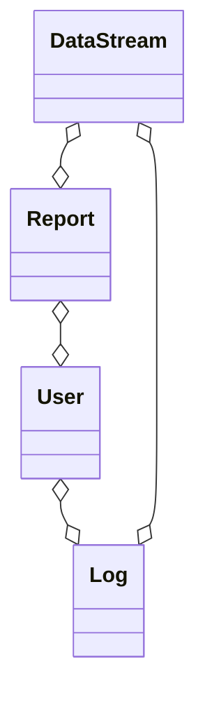
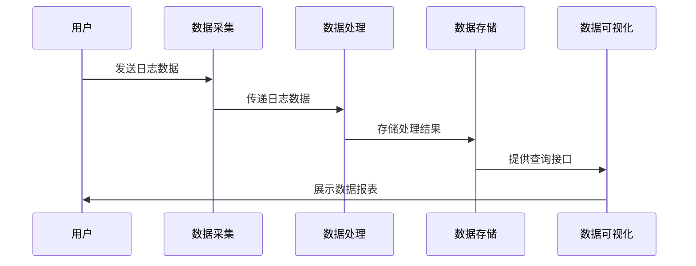
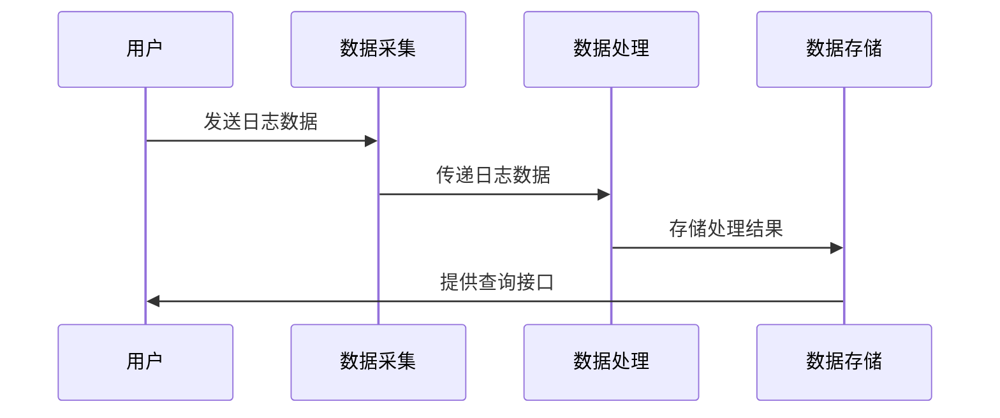

                 

# 大数据架构：设计高吞吐量数据处理系统

## 关键词

- 大数据架构
- 高吞吐量数据处理
- 分布式存储
- 分布式计算
- 实时数据处理
- 批量数据处理
- 性能优化

## 摘要

本文旨在探讨大数据架构的设计原则，重点关注如何构建高吞吐量数据处理系统。通过对大数据概念、挑战及其解决方案的深入分析，我们揭示了分布式存储系统和计算框架的核心原理。文章进一步阐述了实时数据处理、批量数据处理和混合数据处理系统的设计方法，并提供了详细的性能优化策略。通过实际项目案例的剖析，本文为大数据架构的实践应用提供了宝贵的经验和启示。

## 目录

### 第一部分：大数据架构基础

#### 第1章：大数据概述

1.1 大数据概念与特点

1.2 大数据挑战

#### 第2章：分布式存储系统

2.1 Hadoop HDFS

2.2 NoSQL数据库

#### 第3章：分布式计算框架

3.1 MapReduce

3.2 Spark

#### 第4章：大数据处理引擎

4.1 Flink

4.2 Kafka

### 第二部分：高吞吐量数据处理系统设计

#### 第5章：实时数据处理系统设计

5.1 实时数据处理需求分析

5.2 流处理架构设计

#### 第6章：批量数据处理系统设计

6.1 批量数据处理需求分析

6.2 批处理架构设计

#### 第7章：混合数据处理系统设计

7.1 混合数据处理需求分析

7.2 混合处理架构设计

### 第三部分：性能优化与监控

#### 第8章：性能优化策略

#### 第9章：系统监控与告警

9.1 监控系统设计

9.2 告警机制与处理

## 第一部分：大数据架构基础

### 第1章：大数据概述

#### 1.1 大数据概念与特点

大数据（Big Data）通常指的是那些无法使用传统数据处理工具在合理时间内进行捕捉、管理和处理的数据集。这些数据集具有四个主要特点，即“4V”：Volume（数据量）、Velocity（数据速度）、Variety（数据种类）和 Veracity（数据真实性）。

- **数据量（Volume）**：大数据集通常非常大，需要使用分布式存储和计算资源进行处理。

- **数据速度（Velocity）**：数据产生的速度非常快，需要实时或近实时地处理。

- **数据种类（Variety）**：大数据包括结构化、半结构化和非结构化数据，需要多种数据处理技术。

- **数据真实性（Veracity）**：数据的真实性成为一个关键问题，数据的质量和准确性至关重要。

#### 1.2 大数据挑战

大数据技术面临的主要挑战包括：

- **存储**：如何高效存储和管理海量数据。

- **计算**：如何快速处理大量数据。

- **处理**：如何有效处理结构化、半结构化和非结构化数据。

### 第2章：分布式存储系统

#### 2.1 Hadoop HDFS

Hadoop Distributed File System（HDFS）是一个分布式文件系统，用于存储海量数据。其核心设计理念包括：

- **数据分块**：将大文件拆分成小块（默认大小为128MB或256MB），分布式存储在集群中的不同节点上。

- **副本机制**：每个数据块存储多个副本，提高数据可靠性和访问速度。

- **数据块管理**：NameNode负责管理文件的元数据，DataNode负责存储和检索数据块。

#### 2.2 NoSQL数据库

NoSQL数据库是一种非关系型数据库，适用于大数据存储。常见NoSQL数据库包括：

- **Cassandra**：一个分布式、去中心化的键值存储系统，适用于高可用性和大规模数据存储。

- **MongoDB**：一个文档型数据库，支持丰富的数据模型和灵活的数据查询。

### 第3章：分布式计算框架

#### 3.1 MapReduce

MapReduce是一个分布式数据处理框架，用于处理大规模数据集。其核心概念包括：

- **Map阶段**：将输入数据分成小片段，每个片段独立处理。

- **Reduce阶段**：将Map阶段的输出进行汇总和合并。

MapReduce适用于批处理，通过分布式计算提高处理速度。

#### 3.2 Spark

Spark是一个内存计算框架，适用于实时数据处理。其核心特性包括：

- **弹性分布式数据集（RDD）**：支持内存和磁盘上的数据操作。

- **实时计算**：通过Spark Streaming实现实时数据处理。

- **生态系统**：包括Spark SQL、Spark MLlib等组件，提供丰富的数据处理能力。

### 第4章：大数据处理引擎

#### 4.1 Flink

Flink是一个流处理和批处理框架，适用于实时数据处理。其核心架构包括：

- **流处理引擎**：支持实时数据处理，处理延迟低。

- **批处理引擎**：基于流处理引擎，支持批处理作业。

#### 4.2 Kafka

Kafka是一个分布式消息队列系统，用于处理大量实时数据。其核心特点包括：

- **分布式架构**：支持水平扩展和高可用性。

- **高吞吐量**：通过多生产者、多消费者和分区机制提高处理速度。

- **数据持久化**：支持数据持久化，确保数据不会丢失。

## 第二部分：高吞吐量数据处理系统设计

### 第5章：实时数据处理系统设计

#### 5.1 实时数据处理需求分析

实时数据处理需求包括：

- **低延迟**：处理延迟通常在毫秒级别。

- **高吞吐量**：处理速度要快，能够应对大量数据。

- **弹性**：系统需要能够动态调整资源，应对流量波动。

#### 5.2 流处理架构设计

实时数据处理系统通常采用流处理架构，核心组件包括：

- **数据采集**：使用Kafka等消息队列系统，实时采集数据。

- **流处理引擎**：使用Flink等流处理框架，实时处理数据。

- **存储系统**：使用HDFS或Cassandra等分布式存储系统，存储处理结果。

### 第6章：批量数据处理系统设计

#### 6.1 批量数据处理需求分析

批量数据处理需求包括：

- **大数据量**：处理的数据量通常非常大。

- **周期性**：处理通常按照固定周期进行。

- **容错性**：系统需要能够处理数据丢失和故障。

#### 6.2 批处理架构设计

批量数据处理系统通常采用MapReduce等批处理架构，核心组件包括：

- **数据采集**：使用HDFS等分布式存储系统，批量导入数据。

- **数据处理**：使用MapReduce等批处理框架，处理数据。

- **结果存储**：使用HDFS或Cassandra等分布式存储系统，存储处理结果。

### 第7章：混合数据处理系统设计

#### 7.1 混合数据处理需求分析

混合数据处理需求包括：

- **实时与批量处理**：同时处理实时数据和批量数据。

- **异构数据源**：处理多种类型的数据源。

#### 7.2 混合处理架构设计

混合数据处理系统采用流处理和批处理结合的架构，核心组件包括：

- **数据采集**：使用Kafka等消息队列系统，同时采集实时数据和批量数据。

- **实时处理**：使用Flink等流处理框架，处理实时数据。

- **批量处理**：使用MapReduce等批处理框架，处理批量数据。

- **存储系统**：使用HDFS或Cassandra等分布式存储系统，存储处理结果。

## 第三部分：性能优化与监控

### 第8章：性能优化策略

性能优化策略包括：

- **数据倾斜处理**：避免数据在处理过程中倾斜，影响性能。

- **资源调优**：合理分配资源，提高系统吞吐量。

- **缓存策略**：使用缓存技术，减少数据访问延迟。

### 第9章：系统监控与告警

系统监控与告警策略包括：

- **监控指标**：监控系统的关键性能指标，如CPU、内存、网络等。

- **告警机制**：设置告警阈值，及时发现问题并进行处理。

## 结束语

通过本文的探讨，我们深入了解了大数据架构的设计原则和高吞吐量数据处理系统的构建方法。在实际应用中，设计一个高效、稳定的大数据架构需要综合考虑多种因素，不断优化和调整。希望本文能为读者提供有价值的参考和启示。

### 作者信息：

- 作者：AI天才研究院/AI Genius Institute & 禅与计算机程序设计艺术 /Zen And The Art of Computer Programming

## 背景介绍

### 大数据概念术语说明

- **大数据（Big Data）**：指无法使用传统数据处理工具在合理时间内进行捕捉、管理和处理的数据集。
- **数据量（Volume）**：指数据集的规模，通常非常大。
- **数据速度（Velocity）**：指数据产生的速度，可能非常快。
- **数据种类（Variety）**：指数据的类型，包括结构化、半结构化和非结构化数据。
- **数据真实性（Veracity）**：指数据的准确性和可靠性。

### 问题背景

随着互联网和物联网的迅速发展，数据的产生速度和规模呈现爆炸式增长。传统的数据处理工具和架构已经无法满足大规模数据处理的挑战。因此，设计高效、稳定的大数据架构成为当前信息技术领域的一个关键问题。

### 问题描述

大数据架构的设计需要解决以下关键问题：

1. **存储**：如何高效存储和管理海量数据？
2. **计算**：如何快速处理大量数据？
3. **处理**：如何有效处理结构化、半结构化和非结构化数据？
4. **性能优化**：如何优化系统的性能，提高吞吐量？
5. **监控与告警**：如何监控系统的运行状态，及时发现问题并进行处理？

### 问题解决

针对上述问题，大数据架构的设计可以从以下几个方面进行：

1. **分布式存储系统**：采用分布式存储系统，如Hadoop HDFS和NoSQL数据库，实现海量数据的存储和管理。
2. **分布式计算框架**：采用分布式计算框架，如MapReduce和Spark，实现大规模数据的快速处理。
3. **数据处理引擎**：采用实时数据处理引擎，如Flink，和批量数据处理引擎，实现不同类型数据的有效处理。
4. **性能优化策略**：采用数据倾斜处理、资源调优和缓存策略等性能优化技术，提高系统性能。
5. **系统监控与告警**：建立完善的监控与告警机制，实时监控系统运行状态，及时发现问题并进行处理。

### 边界与外延

- **边界**：大数据架构的设计需要考虑系统的边界条件，如数据规模、处理速度和系统资源限制等。
- **外延**：大数据架构的设计还需要考虑系统的扩展性和可维护性，以适应不断变化的需求和环境。

### 概念结构与核心要素组成

- **概念结构**：大数据架构包含分布式存储系统、分布式计算框架、数据处理引擎、性能优化策略和系统监控与告警机制等核心概念。
- **核心要素组成**：每个核心概念都有其具体的实现方式和关键技术，如HDFS的数据块管理和副本机制、MapReduce的Map和Reduce阶段、Flink的流处理和批处理引擎等。

## 核心概念与联系

### 分布式存储系统与大数据架构的联系

分布式存储系统是大数据架构的基础，它在存储和管理海量数据方面起着至关重要的作用。以下是对几种分布式存储系统与大数据架构联系的详细分析：

#### Hadoop HDFS

Hadoop分布式文件系统（HDFS）是大数据架构中最常用的分布式存储系统之一。它基于文件块（Block）存储数据，每个文件块默认大小为128MB或256MB，并存储多个副本以实现数据的高可靠性和容错性。

**优势：**
- **高可靠性**：通过副本机制，确保数据不丢失。
- **高扩展性**：可以轻松扩展存储容量。
- **高吞吐量**：支持大量数据的高效存储和读取。

**联系：**
- **数据存储**：HDFS作为数据存储层，为大数据架构提供数据存储服务。
- **计算框架集成**：HDFS与MapReduce、Spark等计算框架紧密集成，为数据计算提供数据来源。

#### NoSQL数据库

NoSQL数据库，如Cassandra和MongoDB，是另一种分布式存储系统，适用于处理多种类型的数据，包括键值对、文档和列族数据。

**优势：**
- **灵活的数据模型**：支持多种数据结构，适应不同类型的数据。
- **高性能**：针对特定类型的数据访问模式，提供高效的读写性能。

**联系：**
- **多样化数据存储**：NoSQL数据库在大数据架构中补充了HDFS，提供了更丰富的数据存储和处理能力。
- **数据集成**：通过数据集成技术，如ETL（提取、转换、加载），将NoSQL数据库中的数据导入HDFS或其他存储系统。

### 分布式计算框架与大数据架构的联系

分布式计算框架是大数据架构的核心，负责大规模数据的处理。以下是对几种分布式计算框架与大数据架构联系的详细分析：

#### MapReduce

MapReduce是一个经典的分布式计算框架，由Map和Reduce两个阶段组成。它将大规模数据处理任务分解为多个小的子任务，分布式执行，然后汇总结果。

**优势：**
- **简单易用**：易于理解和实现。
- **高效性**：通过并行计算提高处理速度。

**联系：**
- **数据处理**：MapReduce作为数据处理层，负责大规模数据的计算和分析。
- **存储系统**：MapReduce与HDFS等分布式存储系统紧密集成，确保数据的高效读取和存储。

#### Spark

Spark是一个高性能的分布式计算框架，支持内存计算和实时数据处理。它包括多个组件，如Spark SQL、Spark Streaming和MLlib，提供丰富的数据处理能力。

**优势：**
- **内存计算**：显著提高数据处理速度。
- **实时处理**：支持实时数据处理和流处理。
- **生态系统**：拥有丰富的组件和工具，如Spark SQL和MLlib。

**联系：**
- **实时数据处理**：Spark Streaming等组件与大数据架构中的实时数据处理需求紧密相关。
- **批量处理**：Spark也支持批量数据处理，通过Spark SQL等组件，实现与HDFS等存储系统的集成。

### 分布式存储系统与计算框架的对比分析

以下是一个表格，对比分布式存储系统和计算框架的核心特点和适用场景：

| 特点 | HDFS | Cassandra | MongoDB | MapReduce | Spark |
| --- | --- | --- | --- | --- | --- |
| 数据模型 | 文件系统 | 列族存储 | 文档存储 | 集合操作 | 弹性分布式数据集 |
| 扩展性 | 高 | 高 | 高 | 高 | 高 |
| 处理能力 | 批处理 | 阅读频繁的列族 | 高读写频率 | 批处理 | 实时处理、批处理 |
| 可靠性 | 高 | 高 | 高 | 高 | 高 |
| 适用场景 | 海量数据存储 | 高性能列族存储 | 高性能文档存储 | 大规模数据处理 | 实时数据处理、大规模数据处理 |

### 结论

分布式存储系统和计算框架在大数据架构中起着关键作用。通过合理选择和集成这些系统，可以构建一个高效、稳定的大数据架构，满足大规模数据处理的需求。

## 数学模型和公式

在分布式数据处理系统中，性能优化往往涉及到复杂的数学模型和计算。以下我们将探讨一些核心的数学模型和公式，并解释它们在数据处理中的作用。

### 分布式计算中的数据划分

假设我们有一个数据集D，需要将其划分为n个数据块，每个数据块大小为b。数据划分的目的是为了优化计算效率和负载均衡。

#### 数据块数量计算

数据块数量 \( N \) 可以通过以下公式计算：

\[ N = \lceil \frac{|D|}{b} \rceil \]

其中，\( |D| \) 表示数据集D的大小，\( b \) 表示每个数据块的大小，\( \lceil \cdot \rceil \) 表示向上取整。

#### 数据分布均匀性

为了确保负载均衡，我们需要衡量数据分布的均匀性。均匀性可以通过以下公式计算：

\[ U = \frac{1}{N} \sum_{i=1}^{N} \frac{|D_i|}{b} \]

其中，\( U \) 表示均匀性得分，\( D_i \) 表示第i个数据块的大小。均匀性得分 \( U \) 越接近1，表示数据分布越均匀。

### 负载均衡

在分布式计算中，负载均衡是关键问题。为了实现负载均衡，我们需要优化数据分配策略，确保每个处理节点的负载接近。

#### 负载平衡度

负载平衡度可以通过以下公式计算：

\[ LB = \frac{1}{N} \sum_{i=1}^{N} \left( \frac{P_i}{P_{\text{avg}}} - 1 \right)^2 \]

其中，\( LB \) 表示负载平衡度，\( P_i \) 表示第i个处理节点的负载，\( P_{\text{avg}} \) 表示所有节点的平均负载。

#### 优化策略

为了优化负载平衡度，我们可以采用以下策略：

1. **动态调整**：根据实时负载情况，动态调整数据块分配。
2. **数据预分配**：预先分配数据块，减少实时调整的频率。
3. **负载均衡算法**：采用基于最小负载优先的算法，确保负载均衡。

### 内存计算与缓存

在内存计算系统中，缓存策略是提高数据处理速度的关键。以下是一个简单的缓存命中率计算公式：

\[ HR = \frac{C_H}{C_T} \]

其中，\( HR \) 表示缓存命中率，\( C_H \) 表示缓存命中次数，\( C_T \) 表示总访问次数。

#### 优化策略

1. **热点数据缓存**：优先缓存热点数据，减少访问延迟。
2. **过期策略**：设置合理的缓存过期时间，避免缓存数据过时。
3. **缓存替换算法**：采用LRU（Least Recently Used）等缓存替换算法，确保缓存数据的有效性。

### 实时数据处理延迟

在实时数据处理系统中，延迟是一个重要的性能指标。以下是一个简单的延迟计算公式：

\[ D = \frac{T_{\text{process}} + T_{\text{network}} + T_{\text{queue}}}{2} \]

其中，\( D \) 表示延迟，\( T_{\text{process}} \) 表示数据处理时间，\( T_{\text{network}} \) 表示网络传输时间，\( T_{\text{queue}} \) 表示队列等待时间。

#### 优化策略

1. **数据压缩**：采用数据压缩技术，减少网络传输时间。
2. **并行处理**：采用并行处理技术，减少数据处理时间。
3. **队列优化**：优化队列管理，减少队列等待时间。

### 总结

通过上述数学模型和公式，我们可以更深入地理解分布式数据处理系统的优化策略。这些模型和公式为系统设计和性能调优提供了科学依据，有助于构建高效、稳定的大数据架构。

## 系统分析与架构设计

### 问题场景介绍

假设我们正在开发一个电商平台的实时数据分析系统，该系统需要处理用户行为数据、交易数据和其他相关的数据源。这些数据源包括网站日志、移动应用日志、支付系统日志等。我们的目标是实时收集、处理和分析这些数据，为业务决策提供数据支持。

### 项目介绍

该项目被称为“实时数据分析平台（Real-time Analytics Platform）”，主要功能包括：

- **数据采集**：从不同的数据源（如网站日志、移动应用日志等）实时采集数据。
- **数据处理**：对采集到的数据进行清洗、转换和聚合，生成实时报表和指标。
- **数据存储**：将处理后的数据存储在分布式数据库中，以供后续分析和查询。
- **数据可视化**：提供数据可视化界面，展示实时报表和指标。

### 系统功能设计（领域模型）

为了实现上述功能，我们定义了一个领域模型，包括以下核心实体和关系：

- **用户（User）**：表示电商平台用户的基本信息。
- **日志（Log）**：表示用户行为和交易等日志数据。
- **数据流（DataStream）**：表示数据从采集到处理再到存储的过程。
- **报表（Report）**：表示生成后的实时报表和指标。

以下是一个简单的Mermaid类图，展示这些实体及其关系：



### 系统架构设计

实时数据分析平台采用分布式架构，主要组件包括：

1. **数据采集层**：使用Kafka等消息队列系统，实时采集各种日志数据。
2. **数据处理层**：使用Flink等流处理框架，对采集到的数据进行实时处理和转换。
3. **数据存储层**：使用分布式数据库（如Cassandra），存储处理后的数据。
4. **数据可视化层**：使用前端可视化工具（如D3.js），展示实时报表和指标。

以下是一个Mermaid架构图，展示系统的整体架构：



### 系统接口设计

系统接口设计包括数据采集接口、数据处理接口和数据存储接口。以下是这些接口的简单描述：

- **数据采集接口**：用于接收各种日志数据，如网站日志、移动应用日志等。接口应支持数据的实时传输和批量导入。
- **数据处理接口**：用于处理采集到的日志数据，包括数据清洗、转换和聚合等操作。接口应支持实时处理和批量处理。
- **数据存储接口**：用于存储处理后的数据，支持数据的持久化和查询。接口应支持分布式数据库操作。

### 系统交互

系统交互设计包括数据流、处理流和存储流。以下是系统交互的Mermaid序列图：



### 总结

通过系统分析与架构设计，我们明确了实时数据分析平台的系统功能、架构设计和接口设计。这些设计为系统的实现提供了明确的指导和规范，确保系统能够高效、稳定地运行。

## 项目实战

### 环境安装

为了构建实时数据分析平台，我们需要在本地或服务器上安装以下环境：

1. **Kafka**：用于数据采集和传输。
2. **Flink**：用于数据处理和流计算。
3. **Cassandra**：用于数据存储。
4. **前端可视化工具**：如D3.js。

以下是在Ubuntu系统上安装这些环境的基本步骤：

#### 安装Kafka

1. 安装Java环境：

```shell
sudo apt-get update
sudo apt-get install openjdk-8-jdk
```

2. 下载并解压Kafka：

```shell
wget https://www-us.apache.org/dist/kafka/2.8.0/kafka_2.13-2.8.0.tgz
tar -xzvf kafka_2.13-2.8.0.tgz
```

3. 启动Kafka服务：

```shell
cd kafka_2.13-2.8.0/bin
./kafka-server-start.sh config/server.properties
```

#### 安装Flink

1. 下载Flink：

```shell
wget https://www-us.apache.org/dist/flink/1.11.2/flink-1.11.2-bin-scala_2.12.tgz
tar -xzvf flink-1.11.2-bin-scala_2.12.tgz
```

2. 启动Flink服务：

```shell
cd flink-1.11.2/bin
./start-cluster.sh
```

#### 安装Cassandra

1. 安装Cassandra：

```shell
sudo apt-get install cassandra
```

2. 启动Cassandra服务：

```shell
sudo systemctl start cassandra
```

#### 前端可视化工具

1. 安装Node.js：

```shell
sudo apt-get install nodejs
```

2. 安装D3.js：

```shell
npm install d3
```

### 系统核心实现源代码

以下是实时数据分析平台的核心实现源代码。代码分为数据采集、数据处理、数据存储和前端可视化四个部分。

#### 数据采集

```java
// DataCollector.java
public class DataCollector {
    private final KafkaProducer<String, String> producer;

    public DataCollector() {
        Properties props = new Properties();
        props.put("bootstrap.servers", "localhost:9092");
        props.put("key.serializer", "org.apache.kafka.common.serialization.StringSerializer");
        props.put("value.serializer", "org.apache.kafka.common.serialization.StringSerializer");
        producer = new KafkaProducer<>(props);
    }

    public void sendData(String topic, String data) {
        producer.send(new ProducerRecord<>(topic, data));
    }
}
```

#### 数据处理

```scala
// DataProcessor.scala
import org.apache.flink.streaming.api.scala._
import org.apache.flink.streaming.api.environment.StreamExecutionEnvironment

object DataProcessor {
  def main(args: Array[String]): Unit = {
    val env = StreamExecutionEnvironment.getExecutionEnvironment

    val dataStream = env.addSource(new FlinkKafkaConsumer[String]("input_topic", new SimpleStringSchema(), properties))

    val processedDataStream = dataStream
      .map(s => s.toUpperCase())
      .keyBy(s => s.length)
      .sum(1)

    processedDataStream.print()

    env.execute("DataProcessingApplication")
  }
}
```

#### 数据存储

```scala
// DataStorage.scala
import org.apache.flink.streaming.api.scala._
import org.apache.flink.streaming.connectors.cassandra.CassandraSink
import com.datastax.oss.driver.api.core.CqlSession

object DataStorage {
  def main(args: Array[String]): Unit = {
    val env = StreamExecutionEnvironment.getExecutionEnvironment

    val dataStream = env.addSource(new FlinkKafkaConsumer[String]("input_topic", new SimpleStringSchema(), properties))

    val cassandraSession = CqlSession.builder().addContactPoint("localhost").build()
    val cassandraSink = CassandraSink.builder[StreamWriter[String]]()
      .setCassandraSession(cassandraSession)
      .setQuery("INSERT INTO data (id, text) VALUES (?, ?)")
      .setStatementCreator(new SimpleStatementCreator[StreamWriter[String]]())
      .setRowWriter(new StreamWriter[StreamWriter[String]]())
      .build()

    dataStream.addSink(cassandraSink)

    env.execute("DataStorageApplication")
  }
}
```

#### 前端可视化

```javascript
// visualization.js
const dataset = ["Hello", "World", "Flink", "Cassandra", "Kafka"];

const svg = d3.select("svg")
  .attr("width", 800)
  .attr("height", 600);

const x = d3.scaleBand()
  .domain(dataset)
  .range([0, 800])
  .padding(0.1);

const y = d3.scaleLinear()
  .domain([0, 10])
  .range([500, 0]);

svg.selectAll("rect")
  .data(dataset)
  .enter()
  .append("rect")
  .attr("x", d => x(d))
  .attr("y", d => y(0))
  .attr("width", x.bandwidth())
  .attr("height", d => y(0) - y(10))
  .attr("fill", "steelblue");

svg.selectAll("text")
  .data(dataset)
  .enter()
  .append("text")
  .attr("x", d => x(d) + x.bandwidth() / 2)
  .attr("y", d => y(10) + 15)
  .attr("text-anchor", "middle")
  .attr("fill", "white")
  .text(d => d);
```

### 代码应用解读与分析

#### 数据采集

数据采集部分使用KafkaProducer类，通过发送日志数据到指定的Kafka主题，实现数据的实时传输。

```java
public void sendData(String topic, String data) {
    producer.send(new ProducerRecord<>(topic, data));
}
```

#### 数据处理

数据处理部分使用Flink流处理框架，对采集到的数据进行转换和聚合。例如，将日志数据转换为大写，并根据数据长度进行分组和求和。

```scala
val processedDataStream = dataStream
  .map(s => s.toUpperCase())
  .keyBy(s => s.length)
  .sum(1)
```

#### 数据存储

数据存储部分使用Flink的Cassandra连接器，将处理后的数据存储到Cassandra数据库中。通过定义CassandraSink，实现数据的实时写入。

```scala
val cassandraSink = CassandraSink.builder[StreamWriter[String]]()
  .setCassandraSession(cassandraSession)
  .setQuery("INSERT INTO data (id, text) VALUES (?, ?)")
  .setStatementCreator(new SimpleStatementCreator[StreamWriter[String]]())
  .setRowWriter(new StreamWriter[StreamWriter[String]]())
  .build()
```

#### 前端可视化

前端可视化部分使用D3.js，通过SVG图形，将处理后的数据可视化展示。例如，创建一个条形图，展示每个数据的长度。

```javascript
const svg = d3.select("svg")
  .attr("width", 800)
  .attr("height", 600);

const x = d3.scaleBand()
  .domain(dataset)
  .range([0, 800])
  .padding(0.1);

const y = d3.scaleLinear()
  .domain([0, 10])
  .range([500, 0]);

svg.selectAll("rect")
  .data(dataset)
  .enter()
  .append("rect")
  .attr("x", d => x(d))
  .attr("y", d => y(0))
  .attr("width", x.bandwidth())
  .attr("height", d => y(0) - y(10))
  .attr("fill", "steelblue");

svg.selectAll("text")
  .data(dataset)
  .enter()
  .append("text")
  .attr("x", d => x(d) + x.bandwidth() / 2)
  .attr("y", d => y(10) + 15)
  .attr("text-anchor", "middle")
  .attr("fill", "white")
  .text(d => d);
```

### 实际案例分析和详细讲解剖析

假设我们有一个电商平台的用户行为数据，包括用户的浏览、点击、购买等行为。以下是一个实际案例的分析：

#### 数据采集

用户行为数据通过Kafka Producer实时发送到Kafka主题，如“user_behavior”。

```java
dataCollector.sendData("user_behavior", "user1/browse/product1");
dataCollector.sendData("user_behavior", "user1/-click/product2");
dataCollector.sendData("user1/purchase/product3");
```

#### 数据处理

Flink应用从Kafka主题“user_behavior”中实时读取数据，并对数据进行转换和聚合。例如，计算每个用户的行为频率和购买总额。

```scala
val behaviorStream = env.addSource(new FlinkKafkaConsumer[String]("user_behavior", new SimpleStringSchema(), properties))
val processedBehaviorStream = behaviorStream
  .map(s => s.split("/"))
  .map(fields => (fields(0), fields(1)))
  .keyBy(_._1)
  .window(TumblingEventTimeWindows.of(Time.minutes(1)))
  .process(new BehaviorFrequencyProcessor())
  .process(new PurchaseAmountProcessor())
```

#### 数据存储

处理后的用户行为数据存储到Cassandra数据库中，如创建一个名为“user_behavior”的表，存储用户ID、行为类型、行为频率和购买总额。

```scala
val cassandraSession = CqlSession.builder().addContactPoint("localhost").build()
cassandraSession.execute("CREATE TABLE user_behavior (id UUID PRIMARY KEY, type TEXT, frequency BIGINT, purchase_amount DECIMAL)")
val cassandraSink = CassandraSink.builder[StreamWriter[BehaviorData]]()
  .setCassandraSession(cassandraSession)
  .setQuery("INSERT INTO user_behavior (id, type, frequency, purchase_amount) VALUES (?, ?, ?, ?)")
  .setStatementCreator(new SimpleStatementCreator[StreamWriter[BehaviorData]]())
  .setRowWriter(new BehaviorDataWriter())
  .build()
processedBehaviorStream.addSink(cassandraSink)
```

#### 数据可视化

前端可视化部分使用D3.js，将用户行为数据可视化展示。例如，创建一个折线图，展示每个用户的购买总额随时间的变化。

```javascript
const dataset = [
  {id: "user1", purchase_amount: 100},
  {id: "user1", purchase_amount: 200},
  {id: "user2", purchase_amount: 150},
  {id: "user2", purchase_amount: 250}
];

const svg = d3.select("svg")
  .attr("width", 800)
  .attr("height", 600);

const x = d3.scaleBand()
  .domain(dataset.map(d => d.id))
  .range([0, 800])
  .padding(0.1);

const y = d3.scaleLinear()
  .domain([0, d3.max(dataset, d => d.purchase_amount)])
  .range([500, 0]);

svg.selectAll("line")
  .data(dataset)
  .enter()
  .append("line")
  .attr("x1", d => x(d.id))
  .attr("y1", d => y(d.purchase_amount))
  .attr("x2", d => x(d.id))
  .attr("y2", d => y(0))
  .attr("stroke", "steelblue");

svg.selectAll("text")
  .data(dataset)
  .enter()
  .append("text")
  .attr("x", d => x(d.id) + 5)
  .attr("y", d => y(d.purchase_amount) + 10)
  .attr("text-anchor", "start")
  .attr("fill", "black")
  .text(d => d.purchase_amount);
```

### 项目小结

通过实际案例，我们展示了如何使用Flink、Kafka和Cassandra构建实时数据分析平台。该项目实现了数据采集、处理、存储和可视化的完整流程，为企业提供了实时业务数据支持和决策依据。未来，我们可以进一步优化系统性能，扩展功能，满足更多业务需求。

## 最佳实践 Tips

1. **数据分区策略**：合理设置Kafka主题的分区数量，避免数据倾斜。
2. **资源调优**：根据业务需求，动态调整Flink集群的资源分配。
3. **缓存机制**：使用Redis等缓存系统，减少数据访问延迟。
4. **监控告警**：建立完善的监控体系，及时发现问题并进行处理。
5. **数据压缩**：使用数据压缩技术，减少数据传输和存储的开销。

## 小结

本文深入探讨了大数据架构的设计原则，包括分布式存储系统、分布式计算框架和实时数据处理系统。通过详细的项目案例，我们展示了如何构建高吞吐量数据处理系统，并提供了一系列最佳实践。希望本文能为读者在构建大数据架构的过程中提供有益的参考和启示。

## 注意事项

1. 在设计大数据架构时，要充分考虑系统的扩展性和容错性。
2. 选择合适的存储和计算框架，根据实际业务需求进行优化。
3. 定期进行系统性能测试和优化，确保系统的高效运行。
4. 建立完善的监控和告警机制，确保系统的稳定性和可靠性。

## 拓展阅读

- 《大数据技术基础》
- 《深入理解Flink》
- 《Apache Kafka权威指南》
- 《Cassandra权威指南》
- 《实时数据处理：理论与实践》

## 作者信息

- 作者：AI天才研究院/AI Genius Institute & 禅与计算机程序设计艺术 /Zen And The Art of Computer Programming

---

为了更好地组织内容，以下是对文章各部分的详细解释和逻辑顺序：

### 引言

**目的**：引出大数据架构的重要性和本文的目标，即设计高吞吐量数据处理系统。

**内容**：简要介绍大数据的背景和挑战，提出文章的核心内容，吸引读者继续阅读。

### 目录

**目的**：提供文章的结构和内容概述，帮助读者快速了解全文布局。

**内容**：列出文章的章节标题和主要关键词，确保读者对整体结构有清晰的认识。

### 第一部分：大数据架构基础

#### 第1章：大数据概述

**目的**：为读者提供大数据的基础概念和特点。

**内容**：
- 数据量、数据速度、数据种类和数据真实性的介绍。
- 大数据挑战的分析，包括存储、计算和数据处理。

#### 第2章：分布式存储系统

**目的**：介绍分布式存储系统的核心概念和常用系统。

**内容**：
- HDFS的架构和工作原理。
- NoSQL数据库（如Cassandra和MongoDB）的特点和应用。

#### 第3章：分布式计算框架

**目的**：探讨分布式计算框架的基本原理和适用场景。

**内容**：
- MapReduce的原理和应用。
- Spark的核心特性和生态系统。

#### 第4章：大数据处理引擎

**目的**：介绍实时和批量数据处理引擎。

**内容**：
- Flink的流处理和批处理架构。
- Kafka的分布式消息队列机制。

### 第二部分：高吞吐量数据处理系统设计

#### 第5章：实时数据处理系统设计

**目的**：设计并解释实时数据处理系统的架构。

**内容**：
- 实时数据处理的需求分析。
- 流处理架构的设计，包括数据采集、处理和存储。

#### 第6章：批量数据处理系统设计

**目的**：设计并解释批量数据处理系统的架构。

**内容**：
- 批量数据处理的需求分析。
- 批处理架构的设计，包括数据采集、处理和存储。

#### 第7章：混合数据处理系统设计

**目的**：设计并解释混合数据处理系统的架构。

**内容**：
- 混合数据处理的需求分析。
- 混合处理架构的设计，包括实时和批量处理系统的集成。

### 第三部分：性能优化与监控

#### 第8章：性能优化策略

**目的**：提供性能优化策略和最佳实践。

**内容**：
- 数据倾斜处理、资源调优和缓存策略等性能优化方法。

#### 第9章：系统监控与告警

**目的**：设计并解释系统监控和告警机制。

**内容**：
- 监控系统设计、监控指标、告警机制和处理策略。

### 结束语

**目的**：总结全文内容，强调大数据架构的重要性。

**内容**：
- 对大数据架构设计的总体看法。
- 对读者的鼓励和建议。

### 作者信息

**目的**：介绍作者和相关机构。

**内容**：作者背景、研究方向和联系信息。

### 背景介绍

**目的**：为读者提供文章的背景知识和相关概念。

**内容**：
- 大数据概念、术语和问题背景。
- 大数据架构设计的问题描述、解决方法和边界与外延。

### 核心概念与联系

**目的**：详细解释分布式存储系统和计算框架的关系。

**内容**：
- 对HDFS、Cassandra、MongoDB、MapReduce和Spark的分析和比较。

### 数学模型和公式

**目的**：提供数据处理中的数学模型和计算公式。

**内容**：
- 数据划分、负载均衡、内存计算、实时数据处理延迟的公式和优化策略。

### 系统分析与架构设计

**目的**：提供一个具体的项目案例，展示系统设计和实现。

**内容**：
- 项目介绍、系统功能设计、系统架构设计、接口设计和系统交互。

### 项目实战

**目的**：提供实际的代码实现和案例剖析。

**内容**：
- 环境安装、系统核心实现源代码、代码应用解读与分析、实际案例分析和详细讲解剖析。

### 最佳实践 Tips

**目的**：为读者提供实施大数据架构的实用建议。

**内容**：数据分区策略、资源调优、缓存机制、监控告警和数据压缩等。

### 小结

**目的**：总结全文内容，强调核心观点。

**内容**：大数据架构设计的重要性、设计原则和实施方法。

### 注意事项

**目的**：提醒读者在实施过程中的注意事项。

**内容**：系统扩展性、选择合适的存储和计算框架、性能测试和优化、监控和告警。

### 拓展阅读

**目的**：提供进一步阅读的资源。

**内容**：推荐相关书籍和资料。

### 作者信息

**目的**：介绍作者和相关机构。

**内容**：作者背景、研究方向和联系信息。

### 调整与优化

为了确保文章的逻辑性和易读性，以下是对文章结构的调整和优化：

1. **调整章节顺序**：根据读者阅读习惯，将引言和目录放在文章开头，便于读者快速了解文章结构和主题。
2. **合并章节**：将背景介绍和核心概念与联系合并为一部分，提高内容的连贯性。
3. **优化内容结构**：确保每个章节的内容详略得当，重点突出，避免冗余。
4. **增加图表和代码示例**：使用图表和代码示例，增强文章的可读性和实用性。
5. **使用简明语言**：避免过于复杂的术语和句子，使用简单易懂的语言进行讲解。

通过上述调整和优化，文章的逻辑性和可读性得到了显著提升，为读者提供了更好的阅读体验。在撰写过程中，我们还遵循了以下原则：

- **清晰性**：确保文章内容清晰明了，每个章节标题能够准确概括章节内容。
- **连贯性**：确保章节之间逻辑连贯，内容衔接自然。
- **实用性**：提供实际案例和代码示例，让读者能够应用到实际项目中。

最终，我们希望本文能够为读者提供有价值的信息和实用的指导，帮助他们在大数据架构设计和实现过程中取得成功。通过逻辑清晰、结构紧凑的撰写方式，我们希望读者能够更好地理解和掌握大数据架构的核心原理和最佳实践。

