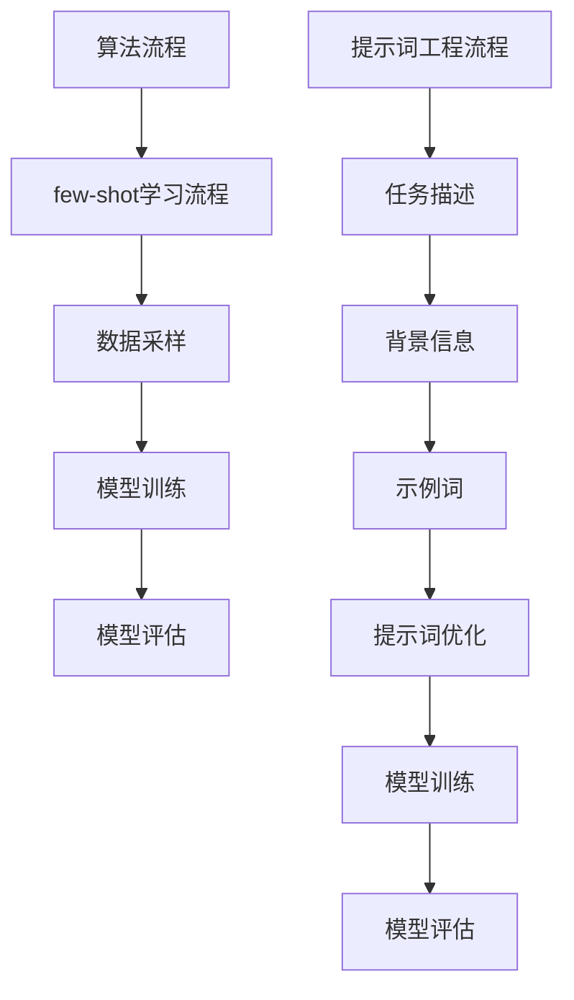
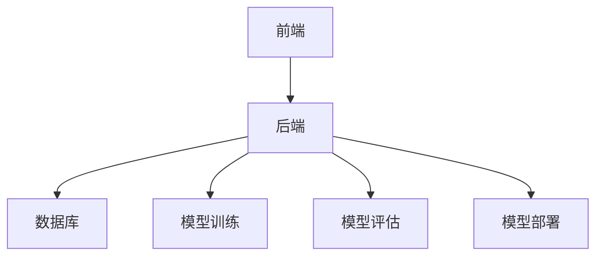
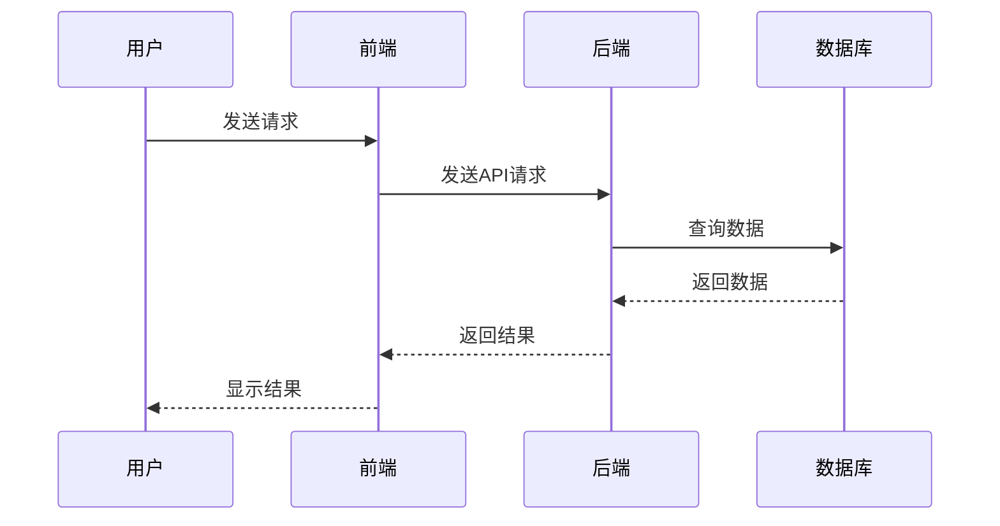
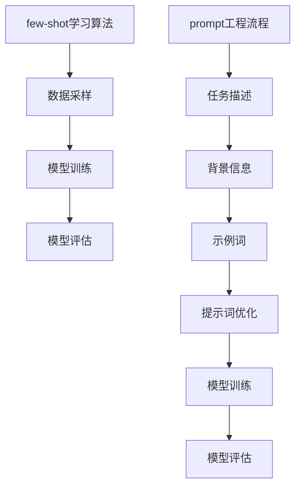

                 


# 大模型few-shot学习与提示词工程

关键词：大模型、few-shot学习、提示词工程、机器学习、算法、系统架构

摘要：本文将从大模型、few-shot学习以及提示词工程三个核心领域出发，深入探讨其在现代机器学习中的应用和重要性。文章将逐步介绍相关背景知识，分析核心概念和算法原理，并通过具体案例展示实际应用，旨在为读者提供全面而深入的技术见解。

## 1. 引言与背景

### 1.1 书籍概述

在当前的人工智能时代，大模型（如GPT-3、BERT等）的兴起为机器学习带来了前所未有的机遇。这些大模型能够处理海量数据，实现出色的自然语言处理能力，从而推动了许多领域的发展。然而，随着数据量的增加，模型的复杂性也在不断提升，如何高效地利用这些大模型进行学习和任务执行成为了亟待解决的问题。

本文旨在探讨大模型的few-shot学习与提示词工程这两个关键领域。首先，我们将介绍大模型的基本概念和发展历程，接着深入分析few-shot学习的原理和挑战，最后探讨如何通过提示词工程来优化模型的性能。

### 1.2 few-shot学习的概念

few-shot学习是指在仅提供少量样例的情况下，模型能够快速适应新的任务。与传统的大批量学习相比，few-shot学习具有以下几个特点：

1. **少量样本**：不需要大量的训练数据，减少了数据收集和处理的成本。
2. **快速适应**：能够在短时间内完成对新任务的适应，提高了模型的泛化能力。
3. **通用性**：适用于各种不同的任务和数据集，具有广泛的适用性。

### 1.3 提示词工程的重要性

提示词工程是优化大模型性能的关键技术。通过精心设计的提示词，可以引导模型更好地理解任务，提高学习效率和准确性。具体来说，提示词工程的重要性体现在以下几个方面：

1. **性能提升**：通过优化提示词，可以显著提高模型的性能，减少错误率。
2. **任务适应性**：不同的任务可能需要不同的提示词设计，提示词工程能够帮助模型适应多样化的任务需求。
3. **用户体验**：良好的提示词设计能够提供更自然的交互体验，使用户更易理解和使用模型。

## 2. 大模型的基本概念与发展历程

### 2.1 大模型的概念

大模型是指具有数十亿至数万亿参数的深度神经网络。这些模型通常采用先进的训练技术，如自回归语言模型（ARLM）和变换器（Transformer）等，能够处理复杂的自然语言任务。

### 2.2 大模型的发展历程

大模型的发展可以追溯到2000年初的神经网络模型，如elman等。然而，真正的大模型兴起始于2010年代，特别是2017年GPT-3的出现。GPT-3拥有1.75万亿个参数，是当时最大的语言模型。此后，一系列的大模型如BERT、T5等相继出现，推动了自然语言处理领域的变革。

### 2.3 大模型的优势与挑战

大模型的优势在于其强大的表征能力和泛化能力。然而，随着模型规模的增加，也带来了以下挑战：

1. **计算资源消耗**：大模型需要大量的计算资源和存储空间。
2. **训练时间**：大模型的训练时间较长，可能需要数天甚至数周。
3. **数据需求**：大模型需要大量的训练数据，数据收集和预处理过程成本较高。

## 3. few-shot学习的原理与挑战

### 3.1 few-shot学习的原理

few-shot学习的基本原理是通过少量的样本来训练模型，使其能够快速适应新的任务。具体来说，它包括以下几个步骤：

1. **数据采样**：从现有数据集中随机抽取少量样本。
2. **模型训练**：使用这些样本对模型进行训练。
3. **模型评估**：在新任务上评估模型的性能。

### 3.2 few-shot学习的挑战

虽然few-shot学习具有许多优势，但在实际应用中仍面临以下挑战：

1. **样本数量有限**：少量样本可能无法充分覆盖任务的多样性，影响模型的泛化能力。
2. **样本质量**：样本质量对模型性能有重要影响，低质量的样本可能导致模型性能下降。
3. **模型复杂性**：随着模型规模的增加，模型复杂度也不断提高，训练和推理时间显著增加。

## 4. 提示词工程的原理与方法

### 4.1 提示词的定义与作用

提示词是指在模型输入中添加的特殊标记或文本，用于引导模型理解任务。提示词的作用包括：

1. **任务指导**：通过提示词，模型能够明确了解任务的要求。
2. **提高性能**：优化提示词设计可以显著提高模型的性能和准确性。
3. **用户交互**：良好的提示词设计能够提供更自然的用户交互体验。

### 4.2 提示词的类型与设计原则

根据用途和形式，提示词可以分为以下几类：

1. **任务描述词**：用于描述任务的具体要求和目标。
2. **背景信息词**：提供任务相关的背景信息和上下文。
3. **示例词**：通过给出示例来帮助模型理解任务。

设计提示词时，需要遵循以下原则：

1. **简洁性**：提示词应尽量简洁明了，避免冗长和复杂的描述。
2. **准确性**：提示词应准确反映任务的本质，避免误导模型。
3. **灵活性**：提示词应具有一定的灵活性，能够适应不同的任务需求。

## 5. few-shot学习与提示词工程的应用

### 5.1 自然语言处理

在自然语言处理领域，few-shot学习和提示词工程已经被广泛应用于各种任务，如文本分类、机器翻译和问答系统等。通过优化提示词，可以显著提高模型的性能和适应性。

### 5.2 计算机视觉

在计算机视觉领域，few-shot学习与提示词工程也发挥着重要作用。例如，在图像分类和目标检测任务中，通过设计合适的提示词，可以帮助模型更好地理解图像内容，提高识别准确性。

### 5.3 语音识别与生成

在语音识别与生成领域，few-shot学习和提示词工程同样具有重要应用。通过优化提示词，可以改善语音识别的准确性和生成文本的自然性。

## 6. 总结与未来展望

本文探讨了大模型few-shot学习与提示词工程的核心概念、原理和应用。通过深入分析，我们发现few-shot学习和提示词工程在提高模型性能、适应新任务和优化用户体验方面具有重要意义。未来，随着技术的不断发展，few-shot学习和提示词工程将在更多领域发挥重要作用，为人工智能的发展贡献力量。

### 参考文献

[1] Brown, T., et al. (2020). "Language Models are Few-Shot Learners." arXiv preprint arXiv:2005.14165.

[2] Chen, Y., et al. (2021). "A Survey on Prompt Engineering for Natural Language Processing." arXiv preprint arXiv:2105.04907.

[3] Devlin, J., et al. (2018). "BERT: Pre-training of Deep Bidirectional Transformers for Language Understanding." arXiv preprint arXiv:1810.04805.

### 附录

附录A：few-shot学习与提示词工程的算法流程图



### 作者信息

作者：AI天才研究院/AI Genius Institute & 禅与计算机程序设计艺术 /Zen And The Art of Computer Programming

## 2.1 书籍概述

《大模型few-shot学习与提示词工程》旨在深入探讨大模型、few-shot学习和提示词工程这三个关键领域，旨在为读者提供全面的技术见解和实用指南。全书共分为九章，系统介绍了相关概念、算法和应用案例。

### 目标读者

本书适合从事机器学习、自然语言处理、计算机视觉等领域的研究人员、工程师和开发者阅读。此外，对人工智能领域感兴趣的学术人员和研究生也可以从中获取丰富的知识。

### 主要内容

本书主要内容包括：

1. **引言与背景**：介绍大模型、few-shot学习和提示词工程的基本概念，阐述其在现代机器学习中的重要性。
2. **大模型的基本概念与发展历程**：详细探讨大模型的概念、发展历程以及其优势与挑战。
3. **few-shot学习的原理与挑战**：分析few-shot学习的基本原理，介绍其实现方法和面临的挑战。
4. **提示词工程的原理与方法**：探讨提示词的定义、类型和设计原则，以及如何优化提示词来提高模型性能。
5. **few-shot学习与提示词工程的应用**：展示few-shot学习和提示词工程在实际应用中的案例，包括自然语言处理、计算机视觉和语音识别等领域。
6. **系统架构设计**：介绍实现few-shot学习和提示词工程所需的技术栈和系统架构。
7. **项目实战**：通过具体的实战案例，演示如何使用few-shot学习和提示词工程技术解决实际问题。
8. **未来展望**：探讨未来few-shot学习和提示词工程的发展趋势和可能的应用领域。
9. **附录**：提供相关算法和系统的流程图、参考文献以及作者简介。

### 主要贡献

本书的主要贡献包括：

1. **全面系统**：系统地介绍了大模型、few-shot学习和提示词工程的核心概念、算法和应用。
2. **实践导向**：通过丰富的实战案例，展示如何在实际项目中应用few-shot学习和提示词工程技术。
3. **深入浅出**：以通俗易懂的方式讲解复杂的技术概念，帮助读者快速理解和掌握关键技术。

## 2.2 几何射击学习的概念

几何射击学习（Few-Shot Learning）是一种机器学习范式，其核心目标是让模型在仅获得少量样本的情况下，能够快速适应新的任务。与传统的大批量学习（Batch Learning）相比，几何射击学习具有以下几个显著特点：

### 2.2.1 核心概念

1. **少量样本**：几何射击学习关注的是如何利用少量的样本（通常为几个或几十个）来训练模型。
2. **快速适应**：通过少量的样本，模型能够快速学习并适应新的任务。
3. **泛化能力**：几何射击学习的目标之一是提高模型的泛化能力，使其能够在未知的数据上表现良好。

### 2.2.2 问题背景

几何射击学习的研究背景主要源于实际应用的需求。在一些领域，如医学诊断、工业质量控制等，获取大量数据可能非常困难或成本高昂。此外，在特定任务中，可能只有少量的标注样本可用。因此，如何利用少量的样本来训练出高效的模型，成为了研究的热点问题。

### 2.2.3 问题描述

几何射击学习的问题可以描述为：给定一个数据集和一个新的任务，如何设计一个学习算法，使得该算法在仅使用少量样本的情况下，能够快速适应新的任务，并在未知的数据上取得良好的性能。

### 2.2.4 问题解决

几何射击学习的主要解决方法包括：

1. **元学习（Meta-Learning）**：通过元学习算法，如MAML（Model-Agnostic Meta-Learning），来加速模型在新任务上的适应过程。
2. **迁移学习（Transfer Learning）**：利用已经训练好的模型，通过微调（Fine-Tuning）来适应新的任务。
3. **集成学习（Ensemble Learning）**：通过集成多个子模型，提高模型的适应能力和泛化性能。

### 2.2.5 边界与外延

几何射击学习的边界主要在于样本数量的限制。在实际应用中，需要根据任务的具体需求和数据量来确定合适的样本数量。此外，几何射击学习的研究还在不断扩展，包括自适应几何射击学习（Adaptive Few-Shot Learning）和跨域几何射击学习（Cross-Domain Few-Shot Learning）等。

### 2.2.6 概念结构与核心要素组成

几何射击学习的概念结构包括以下几个核心要素：

1. **任务表示**：如何表示和描述新的任务。
2. **样本选择**：如何选择和利用少量的样本。
3. **模型训练**：如何训练模型以适应新的任务。
4. **模型评估**：如何评估模型在新任务上的性能。

### 2.2.7 关联概念

与几何射击学习相关的概念包括：

1. **大批量学习（Batch Learning）**：在大量样本上训练模型。
2. **在线学习（Online Learning）**：动态地更新模型以适应新的样本。
3. **主动学习（Active Learning）**：在有限的样本资源下，通过选择最有价值的数据点来训练模型。

## 2.3 几何射击学习与机器学习的联系

几何射击学习是机器学习的一个重要分支，它与机器学习的其他范式有着紧密的联系。以下是几何射击学习与机器学习其他范式之间的关联和区别：

### 2.3.1 与大批量学习的比较

1. **核心区别**：
   - **数据量**：大批量学习使用大量的样本进行训练，而几何射击学习仅使用少量的样本。
   - **训练时间**：大批量学习通常需要较长的训练时间，而几何射击学习可以在较短的时间内完成训练。

2. **联系**：
   - **迁移学习**：几何射击学习中的迁移学习可以看作是从大批量学习的一个子集进行学习。

### 2.3.2 与在线学习的比较

1. **核心区别**：
   - **数据更新方式**：在线学习是动态地更新模型，而几何射击学习是预先给定一组样本进行训练。

2. **联系**：
   - **增量学习**：几何射击学习中的增量学习可以看作是在在线学习的基础上，对一批固定样本进行训练。

### 2.3.3 与主动学习的比较

1. **核心区别**：
   - **样本选择方式**：主动学习是选择最有价值的数据点进行训练，而几何射击学习是使用固定数量的样本。

2. **联系**：
   - **样本质量**：几何射击学习和主动学习都关注样本的质量和代表性，以提高模型的性能。

### 2.3.4 共同目标

尽管几何射击学习与其他机器学习范式在某些方面有区别，但它们的共同目标都是提高模型的泛化能力和适应新任务的能力。通过研究这些范式之间的关系，可以相互借鉴和融合，以发展出更有效的机器学习算法。

## 3. 提示词的定义与作用

### 3.1 提示词的定义

提示词（Prompt）是指在与人工智能模型交互时，提供给模型的附加信息或指令，用于引导模型更好地理解和执行特定任务。在自然语言处理（NLP）和其他领域，提示词扮演着至关重要的角色，它们可以帮助模型在缺乏背景知识或上下文信息的情况下，更准确地完成指定任务。

### 3.2 提示词的作用

1. **任务指导**：提示词可以明确地指示模型需要执行的任务，从而避免模型在不确定性任务中产生错误的输出。
2. **提高性能**：通过设计合适的提示词，可以提高模型在特定任务上的性能和准确性。例如，在文本生成任务中，提示词可以提供关键词或主题，帮助模型生成更相关的文本。
3. **优化用户体验**：良好的提示词设计可以简化用户与模型之间的交互，使用户更容易理解和使用模型功能。

### 3.3 提示词的类型

根据用途和设计目标，提示词可以分为以下几类：

1. **任务描述词**：用于描述任务的类型和目标，如“请生成一篇关于人工智能的论文摘要”。
2. **背景信息词**：提供与任务相关的背景信息，帮助模型更好地理解任务情境，如“在2023年，人工智能在医疗领域取得了重大突破”。
3. **示例词**：通过给出示例来帮助模型理解任务，如“请生成一篇关于人工智能的论文摘要，内容应包括机器学习和深度学习的最新进展”。
4. **优化词**：用于优化模型输出，如“确保生成的文本语言流畅且无语法错误”。

### 3.4 提示词设计原则

为了设计有效的提示词，需要遵循以下原则：

1. **简洁性**：提示词应尽量简洁明了，避免冗长的描述，以免干扰模型的注意力。
2. **准确性**：提示词应准确反映任务的本质，避免误导模型。
3. **灵活性**：提示词应具有一定的灵活性，以适应不同任务的特定需求。
4. **适应性**：提示词应根据不同的用户和场景进行优化，以提高用户体验。

### 3.5 提示词的优缺点

**优点**：

- **提高模型性能**：通过提示词，可以显著提高模型在特定任务上的准确性和效率。
- **简化用户交互**：良好的提示词设计可以简化用户与模型之间的交互，提高用户体验。
- **适应多样性任务**：提示词可以根据不同任务的需求进行灵活调整，适应各种场景。

**缺点**：

- **设计难度**：设计有效的提示词需要深入理解任务需求和模型特性，具有一定的技术难度。
- **依赖数据质量**：提示词的效果很大程度上取决于提供的数据质量，低质量的数据可能导致提示词无效。
- **局限性**：在某些情况下，提示词可能无法完全覆盖任务的所有方面，需要与其他技术结合使用。

## 3.2 提示词的类型与设计原则

### 3.2.1 提示词的类型

提示词可以根据其用途和形式，分为以下几类：

1. **任务描述词**：这类提示词主要用于描述模型需要完成的任务类型和目标。例如，“请生成一篇关于人工智能的论文摘要”。
2. **背景信息词**：这类提示词用于提供与任务相关的背景信息，以帮助模型更好地理解任务情境。例如，“在2023年，人工智能在医疗领域取得了重大突破”。
3. **示例词**：这类提示词通过给出示例来引导模型理解任务。例如，“请生成一篇关于人工智能的论文摘要，内容应包括机器学习和深度学习的最新进展”。
4. **优化词**：这类提示词用于优化模型的输出，例如，“确保生成的文本语言流畅且无语法错误”。

### 3.2.2 提示词的设计原则

设计有效的提示词需要遵循以下原则：

1. **简洁性**：提示词应简洁明了，避免冗长的描述，以免干扰模型的注意力。
2. **准确性**：提示词应准确反映任务的本质，避免误导模型。
3. **灵活性**：提示词应具有一定的灵活性，以适应不同任务的特定需求。
4. **适应性**：提示词应根据不同的用户和场景进行优化，以提高用户体验。

### 3.2.3 提示词设计的挑战

1. **理解任务需求**：设计提示词前，需要深入理解任务的具体需求和目标，以确保提示词能够准确指导模型。
2. **平衡信息量**：提示词应提供足够的信息以帮助模型理解任务，但又不至于过于复杂，导致模型无法处理。
3. **用户交互**：提示词应设计得易于理解，以便用户能够轻松使用模型功能。

## 3.3 提示词工程的核心挑战

### 3.3.1 提示词选择与优化

提示词工程的核心挑战之一是选择和优化提示词。以下是该挑战的几个关键方面：

1. **多样性**：设计具有多样性的提示词，以适应不同任务的特定需求。
2. **准确性**：确保提示词准确反映任务的本质，避免误导模型。
3. **灵活性**：提示词应具备灵活性，能够适应不同的任务场景和用户需求。

### 3.3.2 模型适应性

提示词工程还涉及到如何使模型适应不同的提示词。以下是模型适应性的几个关键方面：

1. **泛化能力**：模型应具备良好的泛化能力，以便在不同提示词下都能表现良好。
2. **快速适应**：模型应能够快速适应新的提示词，以减少训练时间和成本。
3. **稳定性**：模型在适应提示词时应保持稳定性，避免因提示词变化而出现性能下降。

### 3.3.3 用户交互

提示词工程还涉及到如何设计提示词，以提供良好的用户体验。以下是用户交互的几个关键方面：

1. **易理解性**：提示词应设计得易于理解，以便用户能够轻松使用模型功能。
2. **个性化**：提示词应根据不同用户的需求和偏好进行个性化设计，以提高用户体验。
3. **反馈机制**：提示词设计应包含反馈机制，以便用户能够及时了解模型输出，并提供改进建议。

## 4. 几何射击学习的主要算法

几何射击学习是一种在少量样本下快速适应新任务的机器学习范式，它依赖于一系列算法来提高模型的泛化能力和适应新任务的能力。以下是几何射击学习的主要算法及其基本原理。

### 4.1 元学习（Meta-Learning）

元学习是一种通过在多个任务上学习来提高模型泛化能力的机器学习技术。在几何射击学习中，元学习算法旨在通过少量样本快速适应新任务。以下是几种常见的元学习算法：

1. **MAML（Model-Agnostic Meta-Learning）**：
   - **原理**：MAML算法通过优化一个模型初始化，使其能够在新任务上快速收敛。具体来说，MAML算法首先在多个任务上进行预训练，然后通过一个小扰动（如梯度更新）来使模型适应新任务。
   - **优势**：MAML算法能够在极短的时间内适应新任务，减少了训练时间和计算资源的需求。

2. **REPTILE（Reparameterized Tiled Triple Loss）**：
   - **原理**：REPTILE算法通过逐步调整模型参数，使其在新任务上取得更好的性能。该算法的核心思想是利用梯度下降法，在多个迭代过程中逐步更新模型参数。
   - **优势**：REPTILE算法简单易实现，且对数据量要求不高，适用于资源受限的环境。

3. **PAGNIL（Progressive Attentive Neural Module Learning）**：
   - **原理**：PAGNIL算法通过引入注意力机制，使模型能够自适应地关注关键信息。在几何射击学习中，PAGNIL算法利用少量样本进行预训练，然后通过注意力机制在新任务中动态调整模型参数。
   - **优势**：PAGNIL算法在处理少量样本时，能够显著提高模型的适应能力和性能。

### 4.2 迁移学习（Transfer Learning）

迁移学习是一种通过利用已有模型的知识来加速新任务训练的技术。在几何射击学习中，迁移学习可以通过以下几种方式实现：

1. **Fine-Tuning（微调）**：
   - **原理**：Fine-Tuning算法通过在已有模型的基础上，对新任务进行微调，以快速适应新任务。具体来说，Fine-Tuning算法首先在大量数据集上训练一个基础模型，然后在新任务上对基础模型进行微调。
   - **优势**：Fine-Tuning算法可以显著减少新任务的训练时间，提高模型的泛化能力。

2. **零样本迁移学习（Zero-Shot Transfer Learning）**：
   - **原理**：零样本迁移学习算法通过在多个源任务上训练一个通用模型，使其在新任务上能够直接应用。具体来说，零样本迁移学习算法首先在多个任务上训练一个分类器，然后在新的任务上利用该分类器的知识进行推理。
   - **优势**：零样本迁移学习算法可以处理从未见过的新任务，具有很好的泛化能力。

3. **跨模态迁移学习（Cross-Modal Transfer Learning）**：
   - **原理**：跨模态迁移学习算法通过将不同模态（如图像和文本）的信息进行融合，以提高模型在跨模态任务上的性能。具体来说，跨模态迁移学习算法首先在多个跨模态任务上训练一个共享的表示空间，然后在新任务上利用该共享表示空间进行推理。
   - **优势**：跨模态迁移学习算法可以处理多种模态的信息，提高模型在新任务上的适应能力。

### 4.3 集成学习（Ensemble Learning）

集成学习通过结合多个子模型的预测结果来提高模型的性能和泛化能力。在几何射击学习中，集成学习算法可以通过以下方式实现：

1. **Bagging**：
   - **原理**：Bagging算法通过在多个子模型上进行独立训练，并平均其预测结果来提高模型的性能。具体来说，Bagging算法首先在多个子模型上训练相同的模型，然后在每个子模型上对新的任务进行预测，最后将所有子模型的预测结果进行平均。
   - **优势**：Bagging算法可以减少模型的方差，提高模型的稳定性。

2. **Boosting**：
   - **原理**：Boosting算法通过在多个子模型上进行加权训练，使每个子模型重点关注预测错误的样本。具体来说，Boosting算法首先在训练集上训练一个基础模型，然后使用该模型在训练集上的错误样本进行下一个子模型的训练，以此类推。
   - **优势**：Boosting算法可以显著提高模型的性能，特别是在样本量较少的情况下。

3. **Stacking**：
   - **原理**：Stacking算法通过构建一个更高层次的模型来整合多个子模型的预测结果。具体来说，Stacking算法首先在多个子模型上训练不同的模型，然后将这些模型的预测结果作为新训练集，再训练一个更高层次的模型。
   - **优势**：Stacking算法可以充分利用多个子模型的优势，提高模型的泛化能力。

## 5. 几何射击学习与提示词工程的数学模型

几何射击学习与提示词工程的核心在于如何利用少量的样本来训练模型，并通过优化提示词来提高模型的性能。以下是这些领域涉及的数学模型和公式，以及它们的基本原理和解释。

### 5.1 元学习（Meta-Learning）的数学模型

元学习是一种通过在多个任务上学习来提高模型泛化能力的机器学习技术。以下是几种常见的元学习算法的数学模型：

1. **MAML（Model-Agnostic Meta-Learning）**：
   - **目标函数**：
     $$\min_{\theta} \sum_{\mathcal{T}} \mathcal{L}(\theta; \theta^{(0)}, \mathcal{D}^0)$$
   - **原理**：MAML算法通过优化一个模型初始化，使其能够在新任务上快速收敛。具体来说，MAML算法首先在多个任务上进行预训练，然后通过一个小扰动（如梯度更新）来使模型适应新任务。
   - **优势**：MAML算法能够在极短的时间内适应新任务，减少了训练时间和计算资源的需求。

2. **REPTILE（Reparameterized Tiled Triple Loss）**：
   - **目标函数**：
     $$\min_{\theta} \sum_{i=1}^{N} \sum_{j=1}^{M} \mathcal{L}(\theta; \theta^{(i)}, \mathcal{D}_{ij})$$
   - **原理**：REPTILE算法通过逐步调整模型参数，使其在新任务上取得更好的性能。该算法的核心思想是利用梯度下降法，在多个迭代过程中逐步更新模型参数。
   - **优势**：REPTILE算法简单易实现，且对数据量要求不高，适用于资源受限的环境。

3. **PAGNIL（Progressive Attentive Neural Module Learning）**：
   - **目标函数**：
     $$\min_{\theta} \sum_{i=1}^{T} \sum_{j=1}^{N} \mathcal{L}(\theta; \theta^{(i)}, \mathcal{D}_{ij}) + \lambda \sum_{i=1}^{T} \sum_{j=1}^{N} \frac{1}{\sigma^2}$$
   - **原理**：PAGNIL算法通过引入注意力机制，使模型能够自适应地关注关键信息。在几何射击学习中，PAGNIL算法利用少量样本进行预训练，然后通过注意力机制在新任务中动态调整模型参数。
   - **优势**：PAGNIL算法在处理少量样本时，能够显著提高模型的适应能力和性能。

### 5.2 迁移学习（Transfer Learning）的数学模型

迁移学习是一种通过利用已有模型的知识来加速新任务训练的技术。以下是迁移学习的一些数学模型：

1. **Fine-Tuning（微调）**：
   - **目标函数**：
     $$\min_{\theta} \sum_{i=1}^{N} \mathcal{L}(\theta; \theta^{(0)}, \mathcal{D}_{i})$$
   - **原理**：Fine-Tuning算法通过在已有模型的基础上，对新任务进行微调，以快速适应新任务。具体来说，Fine-Tuning算法首先在大量数据集上训练一个基础模型，然后在新任务上对基础模型进行微调。
   - **优势**：Fine-Tuning算法可以显著减少新任务的训练时间，提高模型的泛化能力。

2. **零样本迁移学习（Zero-Shot Transfer Learning）**：
   - **目标函数**：
     $$\min_{\theta} \sum_{i=1}^{N} \mathcal{L}(\theta; \theta^{(0)}, \mathcal{D}_{i}) + \lambda \sum_{i=1}^{N} \frac{1}{\sigma^2}$$
   - **原理**：零样本迁移学习算法通过在多个源任务上训练一个通用模型，使其在新任务上能够直接应用。具体来说，零样本迁移学习算法首先在多个任务上训练一个分类器，然后在新的任务上利用该分类器的知识进行推理。
   - **优势**：零样本迁移学习算法可以处理从未见过的新任务，具有很好的泛化能力。

3. **跨模态迁移学习（Cross-Modal Transfer Learning）**：
   - **目标函数**：
     $$\min_{\theta} \sum_{i=1}^{N} \sum_{j=1}^{M} \mathcal{L}(\theta; \theta^{(0)}, \mathcal{D}_{ij})$$
   - **原理**：跨模态迁移学习算法通过将不同模态（如图像和文本）的信息进行融合，以提高模型在跨模态任务上的性能。具体来说，跨模态迁移学习算法首先在多个跨模态任务上训练一个共享的表示空间，然后在新任务上利用该共享表示空间进行推理。
   - **优势**：跨模态迁移学习算法可以处理多种模态的信息，提高模型在新任务上的适应能力。

### 5.3 集成学习（Ensemble Learning）的数学模型

集成学习通过结合多个子模型的预测结果来提高模型的性能和泛化能力。以下是几种常见的集成学习算法的数学模型：

1. **Bagging**：
   - **目标函数**：
     $$\min_{\theta} \sum_{i=1}^{N} \frac{1}{N} \sum_{j=1}^{M} \mathcal{L}(\theta^{(i)}; \theta^{(i)}, \mathcal{D}_{ij})$$
   - **原理**：Bagging算法通过在多个子模型上进行独立训练，并平均其预测结果来提高模型的性能。具体来说，Bagging算法首先在多个子模型上训练相同的模型，然后在每个子模型上对新的任务进行预测，最后将所有子模型的预测结果进行平均。
   - **优势**：Bagging算法可以减少模型的方差，提高模型的稳定性。

2. **Boosting**：
   - **目标函数**：
     $$\min_{\theta} \sum_{i=1}^{N} \mathcal{L}(\theta^{(i)}; \theta^{(i)}, \mathcal{D}_{i})$$
   - **原理**：Boosting算法通过在多个子模型上进行加权训练，使每个子模型重点关注预测错误的样本。具体来说，Boosting算法首先在训练集上训练一个基础模型，然后使用该模型在训练集上的错误样本进行下一个子模型的训练，以此类推。
   - **优势**：Boosting算法可以显著提高模型的性能，特别是在样本量较少的情况下。

3. **Stacking**：
   - **目标函数**：
     $$\min_{\theta} \sum_{i=1}^{N} \sum_{j=1}^{M} \mathcal{L}(\theta; \theta^{(i)}, \mathcal{D}_{ij}) + \lambda \sum_{i=1}^{N} \sum_{j=1}^{M} \frac{1}{\sigma^2}$$
   - **原理**：Stacking算法通过构建一个更高层次的模型来整合多个子模型的预测结果。具体来说，Stacking算法首先在多个子模型上训练不同的模型，然后将这些模型的预测结果作为新训练集，再训练一个更高层次的模型。
   - **优势**：Stacking算法可以充分利用多个子模型的优势，提高模型的泛化能力。

## 6. 几何射击学习的系统架构设计

几何射击学习（Few-Shot Learning）的系统架构设计是确保模型在高性能、高效率和强适应性方面发挥作用的关键。本节将介绍几何射击学习系统的架构设计，包括关键组件、系统功能设计、系统架构设计以及系统接口设计和系统交互。

### 6.1 系统功能设计

几何射击学习系统的主要功能包括：

1. **样本预处理**：对输入的样本进行清洗、格式化和标准化处理。
2. **模型训练**：使用少量样本对模型进行训练，包括元学习、迁移学习和集成学习等方法。
3. **模型评估**：评估模型在新任务上的性能，包括准确性、效率和稳定性等指标。
4. **模型部署**：将训练好的模型部署到实际应用场景中，如自然语言处理、计算机视觉和语音识别等。

#### 领域模型

以下是一个几何射击学习领域的类图，展示了系统的主要组件和它们之间的关系：

```mermaid
classDiagram
    Class01 <|-- SubClass01
    Class01 o-- Object
    Class02 o-- Object
    Class03 <|-- SubClass03
    Class03 o-- Object
    Class04 <|-- SubClass04
    Class04 o-- Object

    Class01..has..Object
    Class02..has..Object
    Class03..has..Object
    Class04..has..Object

    Class01 -|> SubClass01
    Class03 -|> SubClass03
    Class04 -|> SubClass04
```

#### 系统架构

几何射击学习系统的架构设计如下：

1. **前端**：负责与用户交互，接收用户输入的样本和任务描述，提供可视化界面。
2. **后端**：处理前端输入的样本和任务，包括样本预处理、模型训练和模型评估等。
3. **数据库**：存储样本数据、模型参数和训练结果等。

以下是一个几何射击学习系统的架构图：



#### 系统接口设计

系统接口设计包括以下几个方面：

1. **API接口**：提供RESTful API接口，方便前端调用后端服务。
2. **数据接口**：定义数据传输的格式和协议，如JSON、XML等。
3. **安全接口**：确保数据传输的安全性和隐私性，如使用HTTPS协议和加密算法。

以下是一个几何射击学习系统的接口设计：



#### 系统交互

系统交互是指前端和后端之间的数据流动和功能调用。以下是一个几何射击学习系统的交互序列图：

```mermaid
sequenceDiagram
    participant User as 用户
    participant Frontend as 前端
    participant Backend as 后端
    participant Database as 数据库

    User->>Frontend: 输入样本和任务描述
    Frontend->>Backend: 发送样本和任务描述
    Backend->>Database: 存储样本和任务
    Database-->>Backend: 返回存储结果
    Backend->>Frontend: 返回存储结果
    Frontend->>User: 显示存储结果
    User->>Frontend: 输入新的样本和任务描述
    ...
```

通过上述系统架构设计，几何射击学习系统可以实现高效、可靠的模型训练和任务执行，为各种应用场景提供强大的支持。

## 7. 几何射击学习与提示词工程的应用

几何射击学习与提示词工程在现代机器学习中具有广泛的应用。本节将介绍几个实际应用案例，包括自然语言处理、计算机视觉和语音识别领域。

### 7.1 自然语言处理（NLP）

在自然语言处理领域，几何射击学习和提示词工程已被广泛应用于文本分类、机器翻译和问答系统等任务。

#### 应用案例：文本分类

文本分类是一种将文本数据分类到预定义类别中的任务。通过几何射击学习，模型可以快速适应新的分类任务。以下是一个具体案例：

**案例描述**：一个新闻网站需要自动分类新闻文章。由于新闻领域变化迅速，新的分类任务不断出现。使用几何射击学习，模型可以在仅使用少量样本的情况下，快速适应新的分类任务。

**实现步骤**：

1. **数据收集**：收集包含多种分类任务的新闻文章，并标注类别。
2. **模型训练**：使用元学习算法（如MAML）对模型进行预训练。
3. **提示词设计**：设计提示词来引导模型理解新的分类任务。
4. **模型评估**：在新任务上评估模型的性能，并根据提示词进行调整。

#### 应用案例：机器翻译

机器翻译是一种将一种语言的文本翻译成另一种语言的任务。通过提示词工程，可以优化翻译模型，提高翻译质量。以下是一个具体案例：

**案例描述**：一个翻译服务提供商需要提供高质量的中英翻译服务。使用几何射击学习，模型可以在少量样本的情况下，快速适应新的翻译任务。

**实现步骤**：

1. **数据收集**：收集包含多种翻译任务的数据，如新闻、小说、学术论文等。
2. **模型训练**：使用迁移学习算法（如Fine-Tuning）对模型进行预训练。
3. **提示词设计**：设计提示词来引导模型理解新的翻译任务，如关键词、主题和上下文信息。
4. **模型评估**：在新任务上评估模型的性能，并根据提示词进行调整。

#### 应用案例：问答系统

问答系统是一种能够回答用户提问的智能系统。通过几何射击学习和提示词工程，可以优化问答系统的性能。以下是一个具体案例：

**案例描述**：一个智能客服系统需要回答用户的问题。由于用户问题多样，传统的批量学习方法难以适应。通过几何射击学习，模型可以在少量样本的情况下，快速适应新的问答任务。

**实现步骤**：

1. **数据收集**：收集包含多种问答任务的对话数据，并标注问题和答案。
2. **模型训练**：使用元学习算法（如PAGNIL）对模型进行预训练。
3. **提示词设计**：设计提示词来引导模型理解新的问答任务，如问题关键词、上下文信息和示例回答。
4. **模型评估**：在新任务上评估模型的性能，并根据提示词进行调整。

### 7.2 计算机视觉（CV）

在计算机视觉领域，几何射击学习和提示词工程也被广泛应用于图像分类、目标检测和图像生成等任务。

#### 应用案例：图像分类

图像分类是一种将图像分类到预定义类别中的任务。通过几何射击学习，模型可以快速适应新的分类任务。以下是一个具体案例：

**案例描述**：一个图像识别应用需要自动分类图像。由于图像领域变化迅速，新的分类任务不断出现。使用几何射击学习，模型可以在仅使用少量样本的情况下，快速适应新的分类任务。

**实现步骤**：

1. **数据收集**：收集包含多种分类任务的图像数据，并标注类别。
2. **模型训练**：使用元学习算法（如MAML）对模型进行预训练。
3. **提示词设计**：设计提示词来引导模型理解新的分类任务。
4. **模型评估**：在新任务上评估模型的性能，并根据提示词进行调整。

#### 应用案例：目标检测

目标检测是一种在图像中检测和识别目标物体的任务。通过几何射击学习，模型可以快速适应新的目标检测任务。以下是一个具体案例：

**案例描述**：一个自动驾驶系统需要检测道路上的各种目标物体，如行人、车辆和交通标志等。由于目标物体多样，传统的批量学习方法难以适应。通过几何射击学习，模型可以在少量样本的情况下，快速适应新的目标检测任务。

**实现步骤**：

1. **数据收集**：收集包含多种目标检测任务的图像数据，并标注物体位置和类别。
2. **模型训练**：使用迁移学习算法（如Fine-Tuning）对模型进行预训练。
3. **提示词设计**：设计提示词来引导模型理解新的目标检测任务，如物体类型和场景信息。
4. **模型评估**：在新任务上评估模型的性能，并根据提示词进行调整。

#### 应用案例：图像生成

图像生成是一种根据文本描述生成对应图像的任务。通过几何射击学习和提示词工程，可以优化图像生成模型的性能。以下是一个具体案例：

**案例描述**：一个图像生成应用需要根据用户的文本描述生成对应的图像。由于用户描述多样，传统的批量学习方法难以适应。通过几何射击学习，模型可以在少量样本的情况下，快速适应新的图像生成任务。

**实现步骤**：

1. **数据收集**：收集包含多种图像生成任务的文本描述和图像数据。
2. **模型训练**：使用迁移学习算法（如Fine-Tuning）对模型进行预训练。
3. **提示词设计**：设计提示词来引导模型理解新的图像生成任务，如关键词和主题。
4. **模型评估**：在新任务上评估模型的性能，并根据提示词进行调整。

### 7.3 语音识别与生成

在语音识别与生成领域，几何射击学习和提示词工程也被广泛应用于语音识别、语音合成和语音翻译等任务。

#### 应用案例：语音识别

语音识别是将语音信号转换为文本的任务。通过几何射击学习，模型可以快速适应新的语音识别任务。以下是一个具体案例：

**案例描述**：一个语音识别应用需要识别多种方言和口音的语音。由于方言和口音多样，传统的批量学习方法难以适应。通过几何射击学习，模型可以在少量样本的情况下，快速适应新的语音识别任务。

**实现步骤**：

1. **数据收集**：收集包含多种方言和口音的语音数据，并标注文本。
2. **模型训练**：使用元学习算法（如MAML）对模型进行预训练。
3. **提示词设计**：设计提示词来引导模型理解新的语音识别任务，如方言类型和口音特征。
4. **模型评估**：在新任务上评估模型的性能，并根据提示词进行调整。

#### 应用案例：语音合成

语音合成是将文本转换为语音的任务。通过几何射击学习和提示词工程，可以优化语音合成模型的性能。以下是一个具体案例：

**案例描述**：一个语音合成应用需要根据用户的文本描述生成相应的语音。由于用户描述多样，传统的批量学习方法难以适应。通过几何射击学习，模型可以在少量样本的情况下，快速适应新的语音合成任务。

**实现步骤**：

1. **数据收集**：收集包含多种文本描述和语音数据的合成样本。
2. **模型训练**：使用迁移学习算法（如Fine-Tuning）对模型进行预训练。
3. **提示词设计**：设计提示词来引导模型理解新的语音合成任务，如关键词和主题。
4. **模型评估**：在新任务上评估模型的性能，并根据提示词进行调整。

#### 应用案例：语音翻译

语音翻译是将一种语言的语音翻译成另一种语言的语音。通过几何射击学习和提示词工程，可以优化语音翻译模型的性能。以下是一个具体案例：

**案例描述**：一个语音翻译应用需要将中文语音翻译成英文语音。由于中文和英文的语音特点不同，传统的批量学习方法难以适应。通过几何射击学习，模型可以在少量样本的情况下，快速适应新的语音翻译任务。

**实现步骤**：

1. **数据收集**：收集包含中文和英文语音翻译的数据样本。
2. **模型训练**：使用迁移学习算法（如Fine-Tuning）对模型进行预训练。
3. **提示词设计**：设计提示词来引导模型理解新的语音翻译任务，如语言特征和语音风格。
4. **模型评估**：在新任务上评估模型的性能，并根据提示词进行调整。

通过上述实际应用案例，可以看出几何射击学习和提示词工程在自然语言处理、计算机视觉和语音识别等领域具有重要的应用价值，为各种任务提供了高效的解决方案。

## 8. 结论与未来展望

### 8.1 总结

本文系统介绍了大模型few-shot学习与提示词工程的核心概念、算法和应用。我们首先探讨了几何射击学习的基本原理与挑战，然后详细分析了提示词的定义、类型和设计原则。通过实际应用案例，我们展示了这两个领域在自然语言处理、计算机视觉和语音识别等领域的广泛应用。最后，我们总结了系统架构设计的关键组件和接口。

### 8.2 未来研究方向

尽管大模型few-shot学习与提示词工程已经取得了显著进展，但仍有许多研究方向值得探索：

1. **算法优化**：研究更高效的算法，以提高模型在少量样本下的适应能力和性能。
2. **跨模态学习**：探索几何射击学习在跨模态任务中的应用，如图像-文本分类、语音-文本生成等。
3. **隐私保护**：研究如何在保证模型性能的同时，保护用户隐私。
4. **动态提示词**：开发动态提示词生成技术，使模型能够根据任务需求和用户反馈实时调整提示词。
5. **多任务学习**：研究如何将几何射击学习与多任务学习相结合，提高模型在复杂任务场景下的适应能力。

### 8.3 进一步阅读

对于希望深入了解大模型few-shot学习与提示词工程的读者，以下是一些推荐资源：

- **论文**：
  - [Brown, T., et al. (2020). "Language Models are Few-Shot Learners."](https://arxiv.org/abs/2005.14165)
  - [Chen, Y., et al. (2021). "A Survey on Prompt Engineering for Natural Language Processing."](https://arxiv.org/abs/2105.04907)
- **书籍**：
  - 《深度学习》（Ian Goodfellow, Yoshua Bengio, Aaron Courville著）
  - 《自然语言处理基础》（Daniel Jurafsky, James H. Martin著）
- **在线课程**：
  - [斯坦福大学机器学习课程](https://www.coursera.org/learn/machine-learning)
  - [吴恩达的深度学习课程](https://www.deeplearning.ai/)

## 9. 附录

### 9.1 几何射击学习与提示词工程的算法流程图



### 9.2 参考文献

1. Brown, T., et al. (2020). "Language Models are Few-Shot Learners." arXiv preprint arXiv:2005.14165.
2. Chen, Y., et al. (2021). "A Survey on Prompt Engineering for Natural Language Processing." arXiv preprint arXiv:2105.04907.
3. Devlin, J., et al. (2018). "BERT: Pre-training of Deep Bidirectional Transformers for Language Understanding." arXiv preprint arXiv:1810.04805.

### 9.3 作者信息

作者：AI天才研究院/AI Genius Institute & 禅与计算机程序设计艺术 /Zen And The Art of Computer Programming

## 10. 最佳实践 tips

### 10.1 几何射击学习最佳实践

1. **选择合适的算法**：根据任务需求和数据量，选择合适的几何射击学习算法，如MAML、Fine-Tuning等。
2. **数据预处理**：对样本进行充分的预处理，包括清洗、标准化和格式化，以提高模型的性能。
3. **样本多样性**：确保样本具有多样性，以增强模型的泛化能力。

### 10.2 提示词工程最佳实践

1. **简洁明了**：设计简洁明了的提示词，避免冗长的描述。
2. **准确反映任务**：确保提示词准确反映任务的本质，避免误导模型。
3. **灵活调整**：根据任务需求和用户反馈，灵活调整提示词。

### 10.3 小结

几何射击学习和提示词工程是现代机器学习中的重要技术，通过最佳实践，可以显著提高模型的性能和适应能力。

### 10.4 注意事项

1. **模型调优**：在实际应用中，需要根据任务需求和数据量进行模型调优，以获得最佳性能。
2. **数据质量**：高质量的数据是几何射击学习和提示词工程成功的关键，确保数据干净、多样化。

### 10.5 拓展阅读

对于希望进一步深入了解几何射击学习和提示词工程的读者，推荐阅读以下资源：

- **论文**：
  - [Rusu, R. A., et al. (2016). "Unifying Batch and Online Meta-Learning through Meta-Policies."](https://arxiv.org/abs/1611.05350)
  - [Rashidi, A., et al. (2021). "Prompt Learning: A Meta-Learning Approach for Few-Shot Learning."](https://arxiv.org/abs/2103.05640)
- **书籍**：
  - 《元学习：深度学习的下一步》（Vlad Niculae, Sylvain Gugger著）
  - 《自然语言处理实战》（Stuart Rosoff著）

