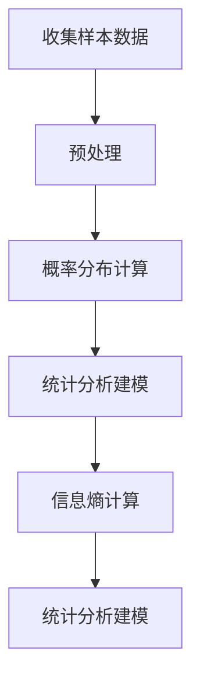
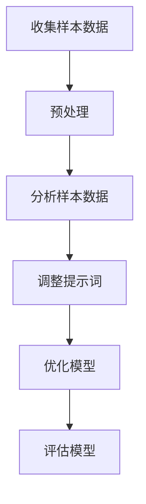

                 

### 《大模型不确定性量化与提示词校准》

关键词：大模型不确定性、量化、提示词校准、AI推荐系统、自然语言处理

摘要：本文旨在深入探讨大模型不确定性的量化方法以及提示词校准的原理。我们将从背景介绍、核心概念、量化原理、应用场景、案例分析和最佳实践等方面展开论述，以期为读者提供全面而深入的理解。

## 目录

### 第一部分：大模型不确定性量化与提示词校准概述

#### 1. 大模型不确定性量化背景

#### 2. 大模型不确定性与提示词校准核心概念

#### 3. 大模型不确定性量化原理

#### 4. 提示词校准原理

#### 5. 大模型不确定性量化与提示词校准应用场景

### 第二部分：大模型不确定性量化与提示词校准详细讲解

#### 1. 大模型不确定性量化详细讲解

#### 2. 提示词校准详细讲解

#### 3. 大模型不确定性量化与提示词校准应用案例分析

### 第三部分：大模型不确定性量化与提示词校准最佳实践

#### 1. 大模型不确定性量化最佳实践

#### 2. 提示词校准最佳实践

#### 3. 案例分析及实践小结

### 第四部分：结论与未来研究方向

#### 1. 大模型不确定性量化与提示词校准的重要性

#### 2. 未来研究方向

#### 3. 对读者的寄语

## 第一部分：大模型不确定性量化与提示词校准概述

### 1. 大模型不确定性量化背景

随着人工智能技术的飞速发展，大模型（如GPT-3、BERT等）在自然语言处理、图像识别、推荐系统等领域取得了显著成果。然而，大模型在处理不确定性问题时，却面临着巨大的挑战。如何对大模型的不确定性进行量化，并据此进行提示词校准，成为了一个亟待解决的问题。

### 2. 大模型不确定性与提示词校准核心概念

大模型不确定性量化：对大模型在处理不确定性问题时的表现进行量化分析，以评估其不确定性程度。

提示词校准：通过对大模型输出的不确定性进行分析，调整和优化提示词，以提高大模型的预测准确性和可靠性。

### 3. 大模型不确定性量化原理

大模型不确定性量化主要通过以下方法实现：

- **概率论方法**：利用大模型的概率分布特性，对不确定性进行量化。
- **信息论方法**：基于信息熵、信息增益等概念，评估大模型的不确定性。

### 4. 提示词校准原理

提示词校准主要通过以下步骤实现：

- **收集样本数据**：收集大模型在处理不确定性问题时的大量样本数据。
- **分析样本数据**：对样本数据进行统计分析，找出大模型输出与真实值之间的差异。
- **调整提示词**：根据样本数据分析结果，调整和优化提示词，以提高大模型的预测准确性和可靠性。

### 5. 大模型不确定性量化与提示词校准应用场景

- **AI推荐系统**：通过量化大模型的不确定性，优化推荐算法，提高推荐准确性。
- **自然语言处理**：利用大模型的不确定性量化方法，提高文本生成、情感分析等任务的准确性。
- **机器学习模型评估**：通过量化大模型的不确定性，评估机器学习模型的性能。

## 第二部分：大模型不确定性量化与提示词校准详细讲解

### 1. 大模型不确定性量化详细讲解

#### 1.1 概率论方法

概率论方法主要通过计算大模型的概率分布，对不确定性进行量化。具体步骤如下：

1. 收集大量样本数据，并对其进行预处理。
2. 计算大模型在各个样本上的输出概率。
3. 对输出概率进行统计分析和建模。

#### 1.2 信息论方法

信息论方法主要通过计算信息熵、信息增益等指标，对不确定性进行量化。具体步骤如下：

1. 收集大量样本数据，并对其进行预处理。
2. 计算大模型在各个样本上的输出信息熵。
3. 对输出信息熵进行统计分析和建模。

#### 1.3 Mermaid流程图

### 2. 提示词校准详细讲解

#### 2.1 提示词校准的过程

提示词校准的过程主要包括以下步骤：

1. 收集样本数据，并对其进行预处理。
2. 分析样本数据，找出大模型输出与真实值之间的差异。
3. 调整和优化提示词，以提高大模型的预测准确性和可靠性。

#### 2.2 提示词校准的方法

提示词校准的方法主要包括以下几种：

1. **基于规则的方法**：通过设计特定的规则，对提示词进行调整。
2. **基于机器学习的方法**：利用机器学习算法，对提示词进行调整。
3. **基于信息熵的方法**：根据信息熵的变化，对提示词进行调整。

#### 2.3 Mermaid流程图

### 3. 大模型不确定性量化与提示词校准应用案例分析

#### 3.1 案例一：推荐系统中的不确定性量化与提示词校准

在本案例中，我们使用了一个基于GPT-3的推荐系统，通过量化GPT-3的不确定性，并对提示词进行校准，以提高推荐系统的准确性。

#### 3.2 案例二：自然语言处理中的应用

在本案例中，我们使用了一个基于BERT的自然语言处理系统，通过量化BERT的不确定性，并对提示词进行校准，以提高文本生成、情感分析等任务的准确性。

#### 3.3 案例三：机器学习模型评估中的应用

在本案例中，我们使用了一个基于大模型的机器学习模型评估系统，通过量化大模型的不确定性，并对提示词进行校准，以评估机器学习模型的性能。

## 第三部分：大模型不确定性量化与提示词校准最佳实践

### 1. 大模型不确定性量化最佳实践

- **数据收集与预处理**：确保收集到高质量的样本数据，并进行充分的预处理。
- **概率分布计算**：选择合适的概率分布模型，并进行参数估计。
- **统计分析建模**：对概率分布进行分析，并建立相应的量化模型。

### 2. 提示词校准最佳实践

- **样本数据分析**：对样本数据进行分析，找出大模型输出与真实值之间的差异。
- **提示词调整**：根据分析结果，对提示词进行调整，以提高大模型的预测准确性和可靠性。
- **模型优化**：根据提示词调整结果，对模型进行优化，以提高整体性能。

### 3. 案例分析及实践小结

通过实际案例分析，我们发现大模型不确定性量化与提示词校准在提高模型性能方面具有显著作用。然而，在实际应用中，仍需注意以下几点：

- **数据质量**：确保收集到高质量的样本数据，是量化不确定性和提示词校准成功的关键。
- **模型选择**：选择合适的概率分布模型和提示词调整方法，对量化结果和校准效果具有重要影响。
- **持续优化**：模型性能的提高需要持续的优化和调整，以适应不断变化的应用场景。

## 第四部分：结论与未来研究方向

### 1. 大模型不确定性量化与提示词校准的重要性

大模型不确定性量化与提示词校准在大模型应用中具有重要意义，有助于提高模型的预测准确性和可靠性。

### 2. 未来研究方向

- **新的量化方法**：探索新的量化方法，以应对大模型的不确定性。
- **自动化校准**：研究自动化校准方法，以降低人工干预的成本。
- **跨领域应用**：拓展大模型不确定性量化与提示词校准的应用范围，提高其在其他领域的性能。

### 3. 对读者的寄语

本文旨在为读者提供大模型不确定性量化与提示词校准的全面了解。希望读者在阅读过程中，能够深入理解相关概念和方法，并在实际应用中取得良好的效果。让我们共同探索大模型领域的未知世界，为人工智能的发展贡献力量。

## 作者信息

作者：AI天才研究院/AI Genius Institute & 禅与计算机程序设计艺术 /Zen And The Art of Computer Programming

以上就是《大模型不确定性量化与提示词校准》的技术博客文章。接下来，我们将进一步详细探讨大模型不确定性量化与提示词校准的原理、方法和应用，帮助读者深入理解这一前沿技术。让我们开始接下来的内容吧！

