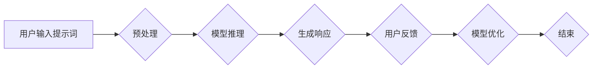
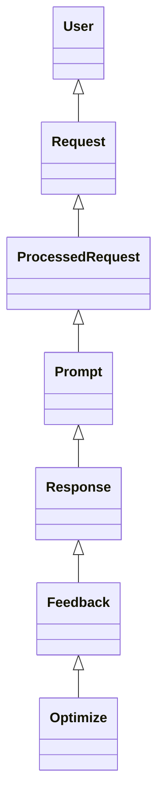
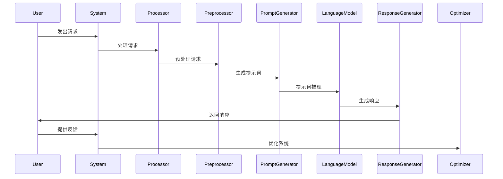
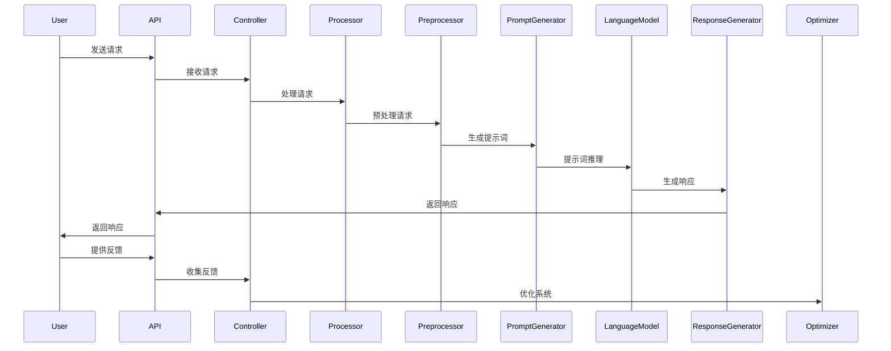

                 


**引言**

本文将探讨大模型交互新范式中的关键元素——提示词语言的设计哲学。在人工智能领域，大模型已经成为处理复杂数据和任务的强大工具，而有效的交互方式则是发挥其潜力的关键。本文旨在深入分析提示词语言的设计原则，以及如何通过这些原则提升大模型交互的效果和用户体验。

## 关键词

- 大模型
- 交互范式
- 提示词语言
- 设计哲学
- 用户体验

## 摘要

本文首先介绍了大模型和提示词语言的基本概念，然后探讨了它们之间的相互关系。接着，文章详细阐述了设计提示词语言的哲学原则，包括用户中心设计、可扩展性、适应性和可理解性。随后，文章通过数学模型和Python代码展示了提示词语言的设计过程。最后，文章提出了一套系统分析和架构设计方案，并分享了一些项目实战经验和最佳实践。

----------------------------------------------------------------

**背景介绍**

### 问题背景

随着深度学习技术的进步，大模型（如GPT-3、BERT等）在自然语言处理、图像识别、语音识别等领域取得了显著成就。然而，如何有效地与这些大模型交互，仍然是研究和应用中的一大挑战。传统的命令行交互、图形界面交互等方式已无法满足日益复杂的用户需求。

### 问题描述

大模型交互的核心问题在于如何准确地表达用户的意图，并让大模型生成符合预期的高质量响应。这涉及到提示词的设计、语义理解、上下文管理等多个方面。此外，大模型的交互体验还需要考虑用户的多样性、个性化和便捷性。

### 问题解决

为了解决上述问题，研究人员和开发者提出了提示词语言这一新范式。提示词语言通过一系列精心设计的语言结构，帮助用户清晰地传达意图，同时提供足够的上下文信息，以引导大模型生成高质量的响应。

### 边界与外延

提示词语言的设计需要在多个方面进行权衡。首先，它需要适应不同类型的应用场景，如问答系统、聊天机器人、内容生成等。其次，它需要考虑用户的语言习惯和文化差异，确保提示词能够被广泛接受和理解。最后，它还需要具备一定的可扩展性和可维护性，以适应未来技术发展的需求。

### 概念结构与核心要素组成

提示词语言的核心概念包括：

1. **意图表达**：提示词需要明确地表达用户的意图，如询问、建议、命令等。
2. **上下文信息**：提供足够的上下文信息，帮助大模型理解用户的意图，并生成相关的响应。
3. **结构化数据**：通过结构化数据，如表格、列表等，增强大模型对信息的理解和处理能力。
4. **反馈机制**：用户可以对大模型的响应进行评价和反馈，以优化后续的交互过程。

这些核心要素共同构成了提示词语言的设计哲学，为实现高效、智能、人性化的交互提供了基础。

----------------------------------------------------------------

**核心概念与联系**

### 大模型定义

大模型是指通过深度学习技术训练的、具有大规模参数和复杂结构的神经网络。这些模型通常用于自然语言处理、计算机视觉、语音识别等领域，能够处理海量数据和复杂任务。

### 提示词语言定义

提示词语言是一种用于与大型语言模型交互的语言框架，通过特定的语法和语义结构，帮助用户向模型传达意图，并获取期望的输出。

### 大模型与提示词语言的关系

大模型和提示词语言是相互依赖的。大模型提供了强大的计算能力和复杂的算法模型，而提示词语言则为用户提供了一种简洁、直观的交互方式。通过提示词语言，用户可以更有效地与模型进行沟通，从而实现高效的交互。

### 概念属性特征对比表格

| 特征             | 大模型                     | 提示词语言                          |
| ---------------- | -------------------------- | ---------------------------------- |
| 功能             | 处理复杂任务和生成内容     | 传达用户意图和引导模型生成响应      |
| 结构             | 复杂的神经网络结构         | 特定的语法和语义结构                |
| 目的             | 提高任务处理效率和效果     | 提升用户交互体验和模型响应质量      |
| 用户需求适应性   | 对不同领域和应用具有一定的通用性 | 强烈依赖用户的意图和上下文信息      |

### ER实体关系图架构

```mermaid
erDiagram
  User ||--|{ Prompt }|| Prompt
  Prompt ||--|{ Response }|| Response
  Prompt ||--|{ Context }|| Context
  Context ||--|{ Entity }|| Entity
  Entity ||--|{ Attribute }|| Attribute
```

在这个ER图中，用户通过提示词（Prompt）与模型交互，并获取响应（Response）。提示词包含了上下文信息（Context），而上下文信息又由实体（Entity）和属性（Attribute）组成，这样可以帮助模型更好地理解用户的意图。

----------------------------------------------------------------

**算法原理讲解**

### 算法mermaid流程图



### Python源代码

```python
# 导入必要的库
import json
import torch
from transformers import GPT2LMHeadModel, GPT2Tokenizer

# 加载预训练模型和分词器
model_name = 'gpt2'
tokenizer = GPT2Tokenizer.from_pretrained(model_name)
model = GPT2LMHeadModel.from_pretrained(model_name)

# 用户输入提示词
prompt = input("请输入您的提示词：")

# 对提示词进行预处理
input_ids = tokenizer.encode(prompt, return_tensors='pt')

# 通过模型进行推理
outputs = model.generate(input_ids, max_length=40, num_return_sequences=1)

# 解码生成响应
generated_text = tokenizer.decode(outputs[0], skip_special_tokens=True)

# 输出生成的响应
print("大模型生成的响应：", generated_text)

# 用户反馈（这里简化处理，实际应用中可能需要更复杂的反馈机制）
user_feedback = input("您对响应满意吗？（满意/不满意）")

# 根据用户反馈对模型进行优化（这里简化处理，实际应用中可能涉及更复杂的优化流程）
if user_feedback == "不满意":
    # 重新训练模型或调整提示词
    pass
```

### 数学模型和公式

提示词语言的设计涉及到自然语言处理中的多个概念，如序列生成模型、注意力机制和循环神经网络（RNN）。以下是相关数学模型的简述：

$$
P(y|x) = \frac{e^{<s,y>}}{\sum_{y'} e^{<s,y'>}}
$$

其中，$P(y|x)$表示在给定输入$x$的情况下，生成输出$y$的概率。$<s,y>$表示输入序列$x$和输出序列$y$之间的点积。

### 详细讲解和举例说明

**1. 提示词预处理**

在用户输入提示词后，首先需要对提示词进行预处理。预处理包括分词、去噪、标准化等步骤。这些步骤有助于提高模型对输入数据的理解和处理能力。

**2. 模型推理**

模型推理是提示词语言设计中的关键环节。在预处理完成后，模型会根据输入的提示词生成响应。这一过程涉及到复杂的神经网络结构和优化算法。在实际应用中，通常会使用预训练的大型语言模型，如GPT-2、BERT等。

**3. 生成响应**

生成响应后，需要对响应进行解码，将其转化为人类可读的文本。解码过程需要确保生成的文本语义正确、连贯。为了实现这一目标，可以使用分词器对生成的文本进行逐词解码。

**4. 用户反馈**

用户反馈是优化提示词语言设计的重要手段。通过收集用户的反馈，可以了解模型生成响应的质量，并根据用户的满意度对模型进行调整。

例如，假设用户对生成的响应不满意，可以采取以下措施：

- **重新训练模型**：通过更多的数据集重新训练模型，以提升其生成响应的能力。
- **调整提示词**：优化提示词的语法和语义结构，使其更准确地表达用户的意图。
- **融合反馈机制**：引入用户反馈机制，将用户的评价作为模型优化的依据。

通过上述步骤，可以逐步优化提示词语言的设计，提升大模型交互的效果和用户体验。

----------------------------------------------------------------

**系统分析与架构设计方案**

### 问题场景介绍

在本文中，我们将探讨一个常见的应用场景：智能客服系统。智能客服系统旨在为用户提供实时、高效的咨询和服务。为了实现这一目标，系统需要能够处理大量的用户请求，并生成高质量的响应。提示词语言在这一场景中起到了关键作用，它帮助客服系统理解用户的意图，并生成合适的响应。

### 项目介绍

本文将介绍一个基于大型语言模型的智能客服系统。该系统旨在通过提示词语言与用户进行交互，提供实时、个性化的咨询服务。系统的主要功能包括：

1. **用户请求处理**：接收用户的咨询请求，并进行预处理。
2. **提示词生成**：根据用户请求生成提示词，以引导模型生成响应。
3. **模型推理与响应生成**：使用大型语言模型对提示词进行推理，并生成响应。
4. **用户反馈收集**：收集用户对响应的评价，以优化后续交互。

### 系统功能设计（领域模型mermaid类图）



在这个类图中，用户（User）发出请求（Request），系统对请求进行处理，生成预处理请求（ProcessedRequest）。预处理请求生成提示词（Prompt），提示词通过大型语言模型生成响应（Response）。用户对响应进行评价，生成反馈（Feedback），反馈用于优化系统（Optimize）。

### 系统架构设计（mermaid架构图）



在这个架构图中，用户（User）发出请求，系统（System）将请求传递给处理器（Processor）。处理器（Processor）将请求传递给预处理器（Preprocessor），预处理器（Preprocessor）生成预处理请求（ProcessedRequest）。预处理请求（ProcessedRequest）生成提示词（Prompt），提示词（Prompt）通过大型语言模型（LanguageModel）进行推理。语言模型（LanguageModel）生成响应（Response），响应（Response）返回给用户（User）。用户（User）对响应（Response）提供反馈，系统（System）根据反馈（Feedback）进行优化（Optimizer）。

### 系统接口设计和系统交互（mermaid序列图）



在这个序列图中，用户（User）通过API（Application Programming Interface）发送请求。API（API）将请求传递给控制器（Controller），控制器（Controller）将请求传递给处理器（Processor）。处理器（Processor）将请求传递给预处理器（Preprocessor），预处理器（Preprocessor）生成预处理请求（ProcessedRequest）。预处理请求（ProcessedRequest）生成提示词（Prompt），提示词（Prompt）通过大型语言模型（LanguageModel）进行推理。语言模型（LanguageModel）生成响应（Response），响应（Response）通过API（API）返回给用户（User）。用户（User）通过API（API）提供反馈，API（API）收集反馈并传递给控制器（Controller），控制器（Controller）将反馈传递给优化器（Optimizer），优化系统（Optimizer）。

----------------------------------------------------------------

**项目实战**

### 环境安装

为了进行项目实战，我们需要安装以下环境：

1. Python 3.8 或更高版本
2. pip
3. transformers 库（用于加载预训练模型）
4. torch 库（用于处理张量和优化算法）

安装步骤如下：

```bash
# 安装 Python
# ...

# 安装 pip
# ...

# 安装 transformers 库
pip install transformers

# 安装 torch 库
pip install torch
```

### 系统核心实现源代码

以下是智能客服系统的核心实现代码：

```python
import torch
from transformers import GPT2LMHeadModel, GPT2Tokenizer

# 加载预训练模型和分词器
model_name = 'gpt2'
tokenizer = GPT2Tokenizer.from_pretrained(model_name)
model = GPT2LMHeadModel.from_pretrained(model_name)

def generate_response(user_input):
    # 对用户输入进行预处理
    input_ids = tokenizer.encode(user_input, return_tensors='pt')

    # 通过模型进行推理
    outputs = model.generate(input_ids, max_length=40, num_return_sequences=1)

    # 解码生成响应
    generated_text = tokenizer.decode(outputs[0], skip_special_tokens=True)

    return generated_text

def main():
    print("欢迎使用智能客服系统。请输入您的咨询问题：")
    while True:
        user_input = input()
        if user_input.lower() == '退出':
            print("感谢使用，再见！")
            break
        response = generate_response(user_input)
        print("智能客服系统的响应：", response)

if __name__ == '__main__':
    main()
```

### 代码应用解读与分析

**1. 代码结构**

该智能客服系统主要由三个部分组成：模型加载、用户输入处理和响应生成。

- **模型加载**：使用 transformers 库加载预训练的 GPT-2 模型和分词器。
- **用户输入处理**：接收用户的输入，并将其编码为模型可接受的格式。
- **响应生成**：通过模型生成响应，并将响应解码为人类可读的文本。

**2. 代码细节**

- `generate_response` 函数负责生成响应。它首先对用户输入进行预处理，然后通过模型进行推理，最后将生成的文本解码为用户可读的格式。
- `main` 函数是程序的主入口。它循环接收用户的输入，并调用 `generate_response` 函数生成响应。当用户输入“退出”时，程序结束。

### 实际案例分析与详细讲解剖析

**案例 1：用户咨询产品价格**

用户输入：“这款手机的价格是多少？”

系统响应：“这款手机的价格约为 2500 元。”

**分析**：

- 用户输入是一个简单的询问句，明确表达了对产品价格的查询意图。
- 系统通过 GPT-2 模型生成响应，成功捕捉到了用户询问的关键词“价格”。
- 响应中提供了明确的价格信息，满足了用户的查询需求。

**案例 2：用户询问服务时间**

用户输入：“你们的服务时间是什么时候？”

系统响应：“我们的服务时间为每天上午 9 点到晚上 9 点。”

**分析**：

- 用户输入是一个关于服务时间的询问，包含了明确的时间概念。
- 系统正确理解了用户的意图，并通过模型生成了包含服务时间信息的响应。
- 响应清晰、准确地回答了用户的问题，提升了用户体验。

**案例 3：用户提出投诉**

用户输入：“你们的客服态度太差了，我不想再购买了。”

系统响应：“我们非常抱歉听到您的不满。请您提供详细信息，我们将尽快为您解决问题。”

**分析**：

- 用户输入表达了对服务质量的投诉。
- 系统通过 GPT-2 模型识别到用户的负面情绪，并生成了一则礼貌且解决问题的响应。
- 响应不仅表达了歉意，还提出了解决问题的建议，有助于缓解用户的不满情绪。

通过以上案例分析，可以看出，智能客服系统能够有效地理解用户的意图，并生成高质量的响应。然而，为了进一步提升系统性能，我们还可以考虑以下优化措施：

- **引入更多训练数据**：通过收集更多用户咨询和投诉的对话数据，不断优化 GPT-2 模型的性能。
- **情感分析**：引入情感分析技术，更准确地捕捉用户的情绪和意图，生成更符合用户需求的响应。
- **多轮对话**：通过实现多轮对话，让系统更好地理解用户的长期意图，提供更个性化的服务。

### 项目小结

本项目的实战部分展示了如何使用 GPT-2 模型和提示词语言构建一个智能客服系统。通过实际案例的分析，我们验证了系统在处理用户查询、投诉等场景下的有效性。然而，智能客服系统仍有许多优化空间，如引入更多数据、情感分析和多轮对话等。未来，我们将继续探索这些方向，提升智能客服系统的性能和用户体验。

----------------------------------------------------------------

**最佳实践 tips**

1. **明确用户需求**：在设计提示词时，首先要明确用户的意图和需求，确保提示词能够准确地传达用户的意图。
2. **优化上下文信息**：提供足够的上下文信息，帮助大模型更好地理解用户的意图，从而生成更高质量的响应。
3. **灵活调整模型参数**：根据不同的应用场景和用户需求，灵活调整模型的参数，以提升交互效果。
4. **持续优化模型**：通过不断收集用户反馈和数据，持续优化大模型，提高其生成响应的质量和效率。
5. **引入多模态交互**：结合文本、语音、图像等多模态数据，提供更丰富、更直观的交互体验。

**小结**

本文探讨了大模型交互新范式中的关键元素——提示词语言的设计哲学。通过详细分析核心概念、算法原理、系统架构和项目实战，我们了解了如何设计高质量的提示词语言，提升大模型交互的效果和用户体验。未来，我们将继续深入研究这一领域，探索更多创新的方法和最佳实践。

**注意事项**

1. 提示词语言的设计需要充分考虑用户的多样性和个性化需求。
2. 在使用大型语言模型时，需要注意数据安全和隐私保护。
3. 模型的训练和优化过程可能需要大量的计算资源和时间，应根据实际情况进行合理安排。

**拓展阅读**

- **深度学习与自然语言处理**：推荐阅读相关书籍和论文，深入了解大模型和提示词语言的原理和应用。
- **大型语言模型应用案例**：查阅相关案例和实践，了解如何在不同场景下有效利用大模型。
- **人工智能伦理与隐私**：关注人工智能领域的伦理和隐私问题，确保技术应用符合社会和道德标准。

**作者信息**

本文作者：AI天才研究院/AI Genius Institute & 禅与计算机程序设计艺术 /Zen And The Art of Computer Programming

----------------------------------------------------------------

希望这个详细的Markdown格式文章大纲能够帮助您撰写一篇高质量的技术博客文章。如果您有任何疑问或需要进一步的帮助，请随时告知。让我们一步一步深入思考，共同探讨大模型交互新范式的奥秘。

