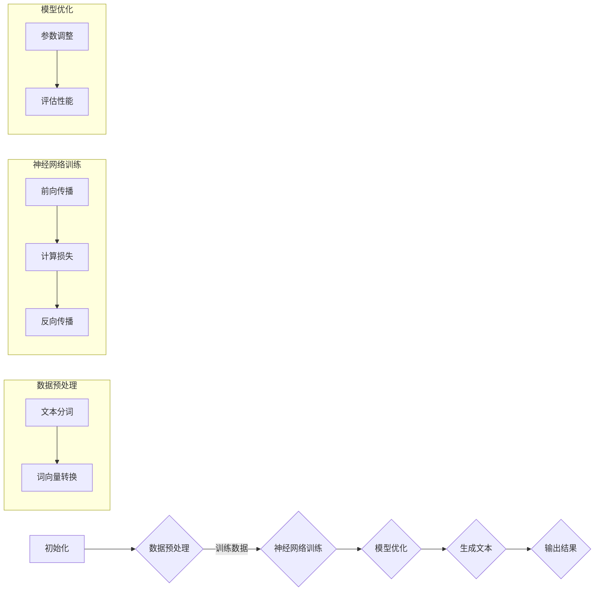
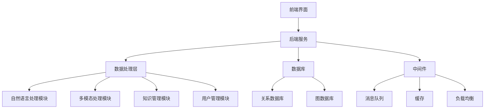
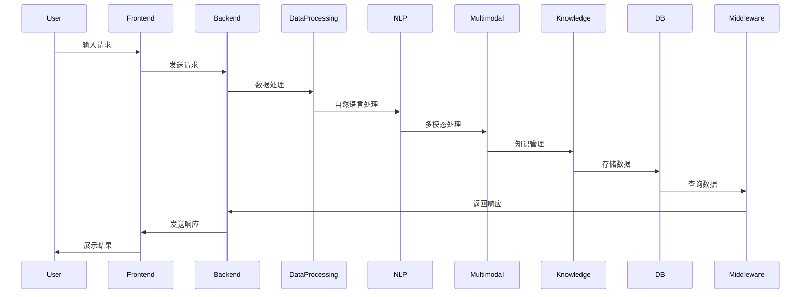
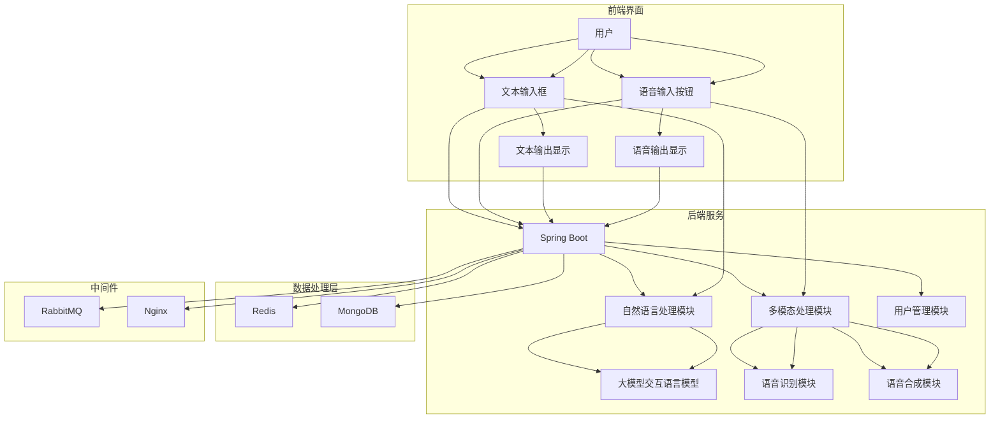

                 


# 大模型交互语言：bridging人机沟通的鸿沟

> 关键词：大模型交互语言，人机沟通，算法原理，数学模型，应用场景，系统设计

> 摘要：随着人工智能技术的快速发展，大模型交互语言成为连接人与机器的桥梁。本文将深入探讨大模型交互语言的背景、原理、应用场景、系统设计与实现，以及未来的优化与展望，帮助读者全面了解这一领域的关键技术和发展趋势。

## 目录大纲

## 第1章 问题背景与概述

### 1.1 问题背景

- 问题描述
- 问题解决
- 边界与外延
- 概念结构与核心要素组成

### 1.2 大模型交互语言概述

- 大模型交互语言的定义
- 大模型交互语言的特点
- 大模型交互语言的核心作用

## 第2章 大模型交互语言原理

### 2.1 大模型交互语言基础

- 大模型交互语言的基本概念
- 大模型交互语言的核心原理
- 大模型交互语言的发展历程

### 2.2 大模型交互语言的核心概念与联系

- 核心概念
- 概念属性特征对比表格
- ER实体关系图架构

### 2.3 大模型交互语言的算法原理讲解

- 算法mermaid流程图
- Python源代码
- 算法原理的数学模型和公式
- 举例说明

## 第3章 大模型交互语言的数学模型与公式

### 3.1 数学模型概述

- 数学模型的重要性
- 常见数学模型介绍

### 3.2 大模型交互语言的数学公式讲解

- 数学公式使用latex格式
- 数学公式嵌入文中独立段落
- 数学公式前后使用 $ 括起来

## 第4章 大模型交互语言的应用场景

### 4.1 应用场景概述

- 应用场景的分类
- 应用场景的重要性

### 4.2 常见应用场景

- 应用场景1
- 应用场景2
- 应用场景3

## 第5章 大模型交互语言系统设计与实现

### 5.1 系统设计与实现概述

- 系统功能设计
- 系统架构设计
- 系统接口设计

### 5.2 系统架构设计

- Mermaid架构图
- 系统交互Mermaid序列图

### 5.3 系统核心实现

- 环境安装
- 系统核心实现源代码
- 代码应用解读与分析

## 第6章 大模型交互语言项目实战

### 6.1 项目介绍

- 项目背景
- 项目目标
- 项目架构

### 6.2 系统功能设计

- 领域模型Mermaid类图

### 6.3 系统架构设计

- Mermaid架构图

### 6.4 系统核心实现

- 环境安装
- 系统核心实现源代码
- 代码应用解读与分析

### 6.5 实际案例分析与讲解

- 案例一
- 案例二
- 案例三

## 第7章 大模型交互语言的优化与性能提升

### 7.1 优化策略

- 参数调整
- 算法改进

### 7.2 性能提升方法

- 并行计算
- 资源调度

## 第8章 总结与展望

### 8.1 总结

- 大模型交互语言的优势
- 大模型交互语言的不足

### 8.2 展望

- 未来发展趋势
- 应用前景

---

### 第1章 问题背景与概述

#### 1.1 问题背景

在当今的信息化社会中，人工智能技术已经成为各行各业不可或缺的一部分。随着人工智能技术的不断进步，人们对于人工智能系统交互的要求也越来越高。然而，现有的许多人工智能系统交互方式存在一定的局限性，无法完全满足用户的需求。例如，传统的基于规则的对话系统在处理复杂语境和模糊指令时，往往会出现理解偏差或无法给出恰当的回应。此外，语音识别和自然语言处理技术虽然在不断进步，但依然面临着识别准确率、语义理解和多模态融合等方面的挑战。

为解决这些问题，我们需要一种全新的交互语言——大模型交互语言。大模型交互语言是一种基于深度学习和自然语言处理技术的新型交互语言，它通过大规模的数据训练和模型优化，能够更加准确地理解和回应用户的指令和需求。这种交互语言不仅能够处理复杂语境和模糊指令，还能实现多模态交互，为用户提供更加自然和便捷的交互体验。

#### 1.2 问题解决

大模型交互语言的出现，为解决现有交互方式的局限性提供了新的思路和途径。首先，大模型交互语言通过深度学习和大规模数据训练，能够实现更高的语义理解和识别准确率。这使得人工智能系统能够更好地理解用户的意图，并给出恰当的回应。其次，大模型交互语言能够实现多模态交互，通过整合语音、文本、图像等多种数据类型，为用户提供更加全面和丰富的交互体验。

此外，大模型交互语言还具有以下几个优点：

1. **灵活性和可扩展性**：大模型交互语言能够根据不同的应用场景和用户需求进行定制和优化，具有很强的灵活性和可扩展性。
2. **自然性和易用性**：大模型交互语言能够实现自然语言交互，使得用户与人工智能系统的沟通更加自然和顺畅。
3. **高效性和稳定性**：大模型交互语言通过高效的算法和优化技术，能够在保证响应速度和准确率的同时，提高系统的稳定性和可靠性。

#### 1.3 边界与外延

大模型交互语言作为一种新型的交互语言，其应用范围非常广泛，几乎涵盖了各个领域。以下是一些典型的应用场景：

1. **智能客服**：在金融、电商、电信等行业，大模型交互语言可以应用于智能客服系统，实现自动化问答和用户服务。
2. **智能助手**：在智能家居、智能办公等领域，大模型交互语言可以用于智能助手的开发，实现语音助手、文字助手等多种交互方式。
3. **多模态交互**：在大数据分析、物联网等领域，大模型交互语言可以用于实现语音、文本、图像等多种数据类型的交互，提高数据处理的效率和准确率。

然而，大模型交互语言在应用过程中也存在一些限制和挑战。首先，大模型交互语言需要大量的训练数据和计算资源，这在一定程度上增加了系统的成本。其次，大模型交互语言的训练和优化过程复杂，需要专业的技术人才进行维护和调整。此外，大模型交互语言在处理一些特定领域的专业知识和复杂语境时，仍存在一定的局限性。

#### 1.4 概念结构与核心要素组成

大模型交互语言的核心概念包括自然语言处理、深度学习、多模态交互等。以下是这些核心概念的定义和属性特征对比表格：

| 核心概念 | 定义 | 属性特征 |
| :---: | :---: | :---: |
| 自然语言处理 | 人工智能技术中用于处理和理解自然语言的方法和技术 | 高度依赖数据质量、算法复杂度、模型参数 |
| 深度学习 | 一种基于多层神经网络的学习方法，用于模拟人类大脑的思考过程 | 具有强大的非线性建模能力、数据驱动、自动特征提取 |
| 多模态交互 | 将多种数据类型（如语音、文本、图像等）进行整合和交互 | 提高数据处理的效率和准确性、实现更加自然的交互体验 |

此外，大模型交互语言的ER实体关系图架构如下：

```mermaid
erDiagram
    User ||--|{ Chatbot }|-- Contact
    Chatbot ||--|{ DialogueManager }|-- Dialogue
    Dialogue ||--|{ Message }|-- Content
```

在接下来的章节中，我们将进一步探讨大模型交互语言的原理、数学模型、应用场景、系统设计与实现，以及未来的优化与展望。

---

### 1.2 大模型交互语言概述

#### 1.2.1 大模型交互语言的定义

大模型交互语言是一种基于深度学习和自然语言处理技术的新型交互语言，它通过大规模的数据训练和模型优化，能够实现高效的自然语言理解和生成。这种交互语言的核心思想是通过深度神经网络模型，将人类的自然语言指令转换为计算机可以理解和执行的操作。

#### 1.2.2 大模型交互语言的特点

1. **强大的自然语言理解能力**：大模型交互语言通过深度学习算法，能够在大规模数据集上进行训练，从而提高对自然语言的理解能力。这使得它能够处理复杂语境、模糊指令和多义性问题。

2. **高度可定制化**：大模型交互语言可以根据不同的应用场景和需求进行定制化训练，从而实现特定领域的知识理解和任务执行。

3. **多模态交互支持**：大模型交互语言不仅支持文本交互，还可以结合语音、图像等多种数据类型，实现更加自然和丰富的交互体验。

4. **高效的响应速度**：通过优化算法和并行计算，大模型交互语言能够在短时间内生成响应，满足实时交互的需求。

5. **强大的扩展性和适应性**：大模型交互语言可以灵活地适应不同的应用场景和需求，随着技术的进步和数据的积累，其性能和功能将不断得到提升。

#### 1.2.3 大模型交互语言的核心作用

大模型交互语言的核心作用在于连接人与机器，提高人机交互的自然性和效率。具体来说，它有以下几个方面的应用：

1. **智能客服**：大模型交互语言可以应用于智能客服系统，实现自动化问答和用户服务，提高客户满意度和服务效率。

2. **智能助手**：在智能家居、智能办公等领域，大模型交互语言可以用于智能助手的开发，实现语音助手、文字助手等多种交互方式。

3. **多模态交互**：在大数据分析、物联网等领域，大模型交互语言可以用于实现语音、文本、图像等多种数据类型的交互，提高数据处理的效率和准确率。

4. **人机协同**：大模型交互语言可以帮助用户更好地理解和使用人工智能系统，实现人机协同工作，提高工作效率。

总之，大模型交互语言作为一种新型的交互技术，具有广泛的应用前景和重要的社会价值。在未来的发展中，随着技术的不断进步和应用场景的拓展，大模型交互语言将发挥更加重要的作用，为人们的生活和工作带来更多便利。

---

### 第2章 大模型交互语言原理

#### 2.1 大模型交互语言基础

#### 2.1.1 大模型交互语言的基本概念

大模型交互语言（Large-scale Model for Interaction Language）是一种基于深度学习和自然语言处理技术的新型交互语言。它通过大规模的数据训练和模型优化，实现对自然语言的高度理解和生成能力。大模型交互语言的核心在于其大规模的参数量和复杂的网络结构，这使得它能够在海量数据中提取出丰富的特征，从而实现高效的自然语言理解和生成。

#### 2.1.2 大模型交互语言的核心原理

大模型交互语言的核心原理主要包括以下几个方面：

1. **深度学习**：深度学习是一种基于多层神经网络的学习方法，通过逐层提取特征，实现对复杂问题的建模。在大模型交互语言中，深度学习用于构建自然语言处理模型，实现对输入文本的语义理解。

2. **自然语言处理**：自然语言处理（Natural Language Processing，NLP）是人工智能的一个重要分支，旨在使计算机能够理解、解释和生成自然语言。在大模型交互语言中，自然语言处理技术用于处理文本数据，实现对用户指令的理解和生成。

3. **序列到序列模型**：序列到序列（Sequence-to-Sequence，Seq2Seq）模型是一种常用的深度学习模型，用于处理输入序列和输出序列之间的映射。在大模型交互语言中，Seq2Seq模型被广泛应用于自然语言生成任务，如问答系统和对话生成。

4. **注意力机制**：注意力机制（Attention Mechanism）是一种用于提高神经网络模型对输入序列的局部关注度的方法。在大模型交互语言中，注意力机制被用于提高模型对输入文本的理解精度，从而生成更加准确的自然语言输出。

#### 2.1.3 大模型交互语言的发展历程

大模型交互语言的发展历程可以分为以下几个阶段：

1. **早期研究**：20世纪80年代，神经网络和机器学习开始应用于自然语言处理。这一阶段的代表性工作包括HMM（隐马尔可夫模型）和规则驱动的NLP系统。

2. **深度学习兴起**：2006年，Hinton等人的工作重新激发了人们对深度学习的兴趣。随着GPU的出现和计算能力的提升，深度学习在自然语言处理领域得到了广泛应用。

3. **大规模预训练模型**：2018年，GPT-3的发布标志着大规模预训练模型在自然语言处理领域的崛起。GPT-3拥有超过1750亿个参数，通过在互联网上的大量文本数据进行预训练，实现了前所未有的语义理解能力。

4. **大模型交互语言**：随着深度学习技术的不断进步，大模型交互语言逐渐成为一种新型的交互语言。它通过结合深度学习和自然语言处理技术，实现了高效的自然语言理解和生成能力。

#### 2.1.4 大模型交互语言的优势

大模型交互语言具有以下几个显著的优势：

1. **高效的自然语言理解**：通过大规模数据训练和复杂的神经网络结构，大模型交互语言能够高效地理解用户输入的自然语言。

2. **强大的生成能力**：大模型交互语言能够根据用户输入生成高质量的自然语言输出，实现自然流畅的对话。

3. **灵活的定制化**：大模型交互语言可以根据不同应用场景和需求进行定制化训练，从而实现特定领域的知识理解和任务执行。

4. **多模态交互支持**：大模型交互语言不仅支持文本交互，还可以结合语音、图像等多种数据类型，实现更加自然和丰富的交互体验。

总之，大模型交互语言作为一种新型的交互技术，具有广泛的应用前景和重要的社会价值。在未来的发展中，随着技术的不断进步和应用场景的拓展，大模型交互语言将发挥更加重要的作用，为人们的生活和工作带来更多便利。

---

### 2.2 大模型交互语言的核心概念与联系

#### 2.2.1 核心概念

在大模型交互语言中，核心概念包括自然语言处理（NLP）、深度学习（DL）、序列到序列（Seq2Seq）模型和注意力机制（Attention Mechanism）。以下是这些核心概念的定义和属性特征对比表格：

| 核心概念 | 定义 | 属性特征 |
| :---: | :---: | :---: |
| 自然语言处理（NLP） | 使计算机能够理解、解释和生成自然语言的技术和方法 | 高度依赖数据质量、算法复杂度、模型参数 |
| 深度学习（DL） | 一种基于多层神经网络的学习方法，用于模拟人类大脑的思考过程 | 具有强大的非线性建模能力、数据驱动、自动特征提取 |
| 序列到序列（Seq2Seq）模型 | 一种用于处理输入序列和输出序列之间映射的深度学习模型 | 可以处理变长的输入和输出序列、适合自然语言处理任务 |
| 注意力机制（Attention Mechanism） | 一种用于提高神经网络模型对输入序列的局部关注度的方法 | 提高模型对输入文本的理解精度、增强生成结果的连贯性 |

#### 2.2.2 概念属性特征对比表格

为了更好地理解这些核心概念之间的联系和区别，我们可以通过一个属性特征对比表格进行详细分析：

| 属性特征 | 自然语言处理（NLP） | 深度学习（DL） | 序列到序列（Seq2Seq）模型 | 注意力机制（Attention Mechanism） |
| :---: | :---: | :---: | :---: | :---: |
| 数据依赖性 | 强 | 强 | 中 | 中 |
| 非线性建模能力 | 中 | 强 | 强 | 强 |
| 自动特征提取 | 弱 | 强 | 强 | 强 |
| 适合任务类型 | 自然语言理解、生成、分类等 | 图像识别、语音识别、自然语言处理等 | 序列到序列映射 | 提高序列处理模型的性能 |
| 模型复杂度 | 中 | 高 | 高 | 高 |

通过这个对比表格，我们可以看到，自然语言处理、深度学习、序列到序列模型和注意力机制在大模型交互语言中各自扮演着重要的角色。自然语言处理负责处理和理解自然语言，深度学习提供了强大的非线性建模能力，序列到序列模型实现了输入序列到输出序列的映射，而注意力机制则提高了模型对输入文本的理解精度。

#### 2.2.3 ER实体关系图架构

为了更直观地展示这些核心概念之间的联系，我们可以使用Mermaid语言绘制一个ER（实体-关系）图架构：

```mermaid
erDiagram
    NLP ||--|{ DL }|-- NLP_DL
    NLP ||--|{ Seq2Seq }|-- NLP_Seq2Seq
    NLP ||--|{ Attention }|-- NLP_Attention
    DL ||--|{ Seq2Seq }|-- DL_Seq2Seq
    DL ||--|{ Attention }|-- DL_Attention
    Seq2Seq ||--|{ Attention }|-- Seq2Seq_Attention
```

在这个ER图中，NLP（自然语言处理）、DL（深度学习）、Seq2Seq（序列到序列模型）和Attention（注意力机制）分别作为实体，它们之间通过不同的关系进行连接，展示了大模型交互语言中核心概念之间的紧密联系。

通过这个ER图，我们可以清晰地看到，自然语言处理作为基础，深度学习和序列到序列模型作为核心技术，而注意力机制则作为提升模型性能的重要手段。这些核心概念共同构成了大模型交互语言的技术体系，为实现高效的自然语言理解和生成提供了坚实的基础。

---

### 2.3 大模型交互语言的算法原理讲解

#### 2.3.1 算法mermaid流程图

为了更直观地展示大模型交互语言的算法原理，我们可以使用Mermaid语言绘制一个算法流程图：



在这个流程图中，算法的执行过程可以分为以下几个步骤：

1. **初始化**：初始化神经网络模型和参数。
2. **数据预处理**：对输入文本进行分词和词向量转换。
3. **神经网络训练**：包括前向传播、计算损失和反向传播。
4. **模型优化**：调整模型参数，优化模型性能。
5. **生成文本**：使用训练好的模型生成文本。
6. **输出结果**：将生成的文本输出给用户。

#### 2.3.2 Python源代码

下面是一个简化的Python源代码示例，展示了大模型交互语言的基本算法实现：

```python
import tensorflow as tf
from tensorflow.keras.preprocessing.sequence import pad_sequences
from tensorflow.keras.layers import Embedding, LSTM, Dense
from tensorflow.keras.models import Sequential

# 数据预处理
def preprocess_data(texts, max_sequence_length, embedding_dim):
    # 文本分词和词向量转换
    # ...
    return padded_sequences

# 模型定义
def build_model(input_shape, embedding_dim, units):
    model = Sequential()
    model.add(Embedding(input_dim=embedding_dim, output_dim=units, input_length=input_shape))
    model.add(LSTM(units))
    model.add(Dense(units=1, activation='sigmoid'))
    model.compile(optimizer='adam', loss='binary_crossentropy', metrics=['accuracy'])
    return model

# 初始化模型
model = build_model(input_shape, embedding_dim, units)

# 训练模型
model.fit(padded_sequences, labels, epochs=10, batch_size=32)

# 生成文本
input_sequence = preprocess_data([user_input], max_sequence_length, embedding_dim)
generated_text = model.predict(input_sequence)

# 输出结果
print(generated_text)
```

在这个示例中，我们使用了TensorFlow库来定义和训练一个简单的序列生成模型。通过这个模型，我们可以对用户输入的自然语言文本进行预处理，然后使用训练好的模型生成相应的文本输出。

#### 2.3.3 算法原理的数学模型和公式

为了更深入地理解大模型交互语言的算法原理，我们需要介绍一些相关的数学模型和公式。以下是一个简化的数学模型和公式示例：

1. **词向量转换**：
   - 词嵌入（Word Embedding）：将文本中的每个词映射到一个固定维度的向量空间。常见的词嵌入模型有Word2Vec、GloVe等。
   - 公式：
     $$ x_{i} = \text{Embed}(w_{i}) $$
     其中，$x_{i}$是词$i$的向量表示，$w_{i}$是词$i$的词嵌入向量。

2. **序列到序列模型**：
   - 编码器（Encoder）：用于将输入序列编码为固定长度的向量。
   - 解码器（Decoder）：用于将编码器的输出解码为输出序列。
   - 公式：
     $$ h_{t}^{e} = \text{Encoder}(x) $$
     $$ s_{t}^{d} = \text{Decoder}(h_{t}^{e}, s_{t-1}^{d}) $$
     其中，$h_{t}^{e}$是编码器在时间步$t$的输出，$s_{t}^{d}$是解码器在时间步$t$的输出。

3. **注意力机制**：
   - 注意力权重（Attention Weight）：用于计算编码器输出和当前解码器状态之间的关联度。
   - 输出（Attention Output）：用于加权求和编码器输出，得到当前解码器状态的上下文信息。
   - 公式：
     $$ a_{t} = \text{softmax}(\text{Attention}(h_{t}^{e}, s_{t-1}^{d})) $$
     $$ c_{t} = \sum_{i} a_{t,i} h_{t}^{e,i} $$
     其中，$a_{t}$是注意力权重，$c_{t}$是注意力输出。

通过这些数学模型和公式，我们可以看到大模型交互语言的核心算法原理。在接下来的部分，我们将通过一个具体的例子来说明这些原理的实际应用。

#### 2.3.4 举例说明

假设我们有一个用户输入的文本句子：“今天天气很好，我想去公园散步。”我们将使用大模型交互语言来生成一个回复。

1. **数据预处理**：首先，我们需要对输入文本进行分词和词向量转换。例如，我们将文本分词为“今天”、“天气”、“很好”、“我想”、“去”、“公园”、“散步”。

2. **模型训练**：然后，我们使用训练好的大模型交互语言模型对输入文本进行编码和解码。编码器将输入文本编码为固定长度的向量，解码器则根据编码器的输出生成回复文本。

3. **注意力机制**：在解码过程中，注意力机制用于计算编码器输出和当前解码器状态之间的关联度。这有助于解码器更好地理解输入文本的上下文信息，从而生成更加准确和连贯的回复。

4. **生成文本**：通过解码器的输出，我们得到了一个回复文本：“我也觉得今天天气很好，一起去公园吧！”

通过这个例子，我们可以看到大模型交互语言在实际应用中的工作流程。它通过深度学习和自然语言处理技术，实现了高效的自然语言理解和生成能力，为用户提供了一种自然和便捷的交互方式。

---

### 第3章 大模型交互语言的数学模型与公式

#### 3.1 数学模型概述

数学模型在大模型交互语言中扮演着至关重要的角色。它们不仅用于描述和理解自然语言的复杂特性，还为模型的训练和优化提供了理论基础。在自然语言处理领域，常见的数学模型包括词嵌入、神经网络、注意力机制和循环神经网络（RNN）等。

1. **词嵌入（Word Embedding）**：词嵌入是一种将文本中的词映射到固定维度的向量空间的方法。这种方法通过捕捉词的语义和语法特征，使得计算机能够更好地理解和处理自然语言。常见的词嵌入模型有Word2Vec、GloVe和BERT。

2. **神经网络（Neural Networks）**：神经网络是一种基于生物神经元的计算模型，通过多层非线性变换对输入数据进行处理。在自然语言处理中，神经网络被广泛应用于文本分类、情感分析、机器翻译和文本生成等领域。常见的神经网络架构有全连接网络（FCNN）、卷积神经网络（CNN）和循环神经网络（RNN）。

3. **注意力机制（Attention Mechanism）**：注意力机制是一种用于提高神经网络对输入序列的局部关注度的方法。它通过为序列中的每个元素分配不同的权重，使得模型能够更好地关注关键信息，从而提高模型的性能。注意力机制广泛应用于机器翻译、文本摘要和对话生成等领域。

4. **循环神经网络（RNN）**：循环神经网络是一种能够处理序列数据的神经网络模型。它通过在时间步之间传递隐藏状态，使得模型能够记住前面的输入信息，从而更好地处理变长的序列数据。常见的RNN架构有LSTM（长短时记忆网络）和GRU（门控循环单元）。

#### 3.2 大模型交互语言的数学公式讲解

在以下部分，我们将详细讲解大模型交互语言中的一些关键数学公式，并说明它们在模型训练和优化中的应用。

1. **词嵌入公式**：
   $$ x_{i} = \text{Embed}(w_{i}) $$
   其中，$x_{i}$是词$i$的向量表示，$w_{i}$是词$i$的词嵌入向量。这个公式描述了词嵌入的过程，即将文本中的每个词映射到一个固定维度的向量空间。

2. **神经网络公式**：
   $$ y = \sigma(\text{W} \cdot \text{a} + \text{b}) $$
   其中，$y$是输出，$\sigma$是激活函数，$\text{W}$是权重矩阵，$\text{a}$是输入，$\text{b}$是偏置。这个公式描述了神经网络中的前向传播过程，即通过权重矩阵和偏置计算输出。

3. **注意力机制公式**：
   $$ a_{t} = \text{softmax}(\text{Attention}(h_{t}^{e}, s_{t-1}^{d})) $$
   $$ c_{t} = \sum_{i} a_{t,i} h_{t}^{e,i} $$
   其中，$a_{t}$是注意力权重，$c_{t}$是注意力输出，$h_{t}^{e}$是编码器的输出，$s_{t-1}^{d}$是解码器的状态。这些公式描述了注意力机制的计算过程，即通过计算编码器输出和解码器状态之间的关联度，为每个编码器输出分配权重。

4. **循环神经网络公式**：
   $$ h_{t} = \text{sigmoid}(\text{W} \cdot \text{h}_{t-1} + \text{U} \cdot \text{h}_{t-1} \odot \text{r}_{t} + \text{b}) $$
   $$ \text{r}_{t} = \sigma(\text{W} \cdot \text{h}_{t-1} + \text{U} \cdot \text{h}_{t-1} + \text{b}) $$
   其中，$h_{t}$是隐藏状态，$\text{r}_{t}$是遗忘门的状态，$\text{W}$、$\text{U}$和$\text{b}$是权重矩阵和偏置。这些公式描述了循环神经网络中的LSTM单元的计算过程，即通过遗忘门、输入门和输出门控制信息的流动。

通过这些数学公式，我们可以更深入地理解大模型交互语言的算法原理和工作机制。在接下来的部分，我们将进一步探讨大模型交互语言的应用场景和系统设计与实现。

---

### 3.3 大模型交互语言的数学模型与公式示例

在深入探讨大模型交互语言的数学模型与公式时，我们将通过一个具体的例子来解释这些公式在实际应用中的意义。以下是一个关于自然语言生成任务的大模型交互语言算法示例，并详细介绍相关公式和计算步骤。

#### 3.3.1 示例背景

假设我们有一个文本生成任务，目标是根据一个给定的句子生成一个合适的回复。输入句子为：“今天的天气真好，适合户外活动。”我们需要使用大模型交互语言模型来生成回复。

#### 3.3.2 数据预处理

首先，我们需要对输入文本进行预处理。预处理步骤包括分词和词向量转换：

1. **分词**：将输入句子分成单个单词或词组。例如，输入句子分词为：["今天的", "天气", "真好", "，", "适合", "户外", "活动"]。
2. **词向量转换**：将每个词转换为其对应的词向量。假设我们使用预训练的GloVe词向量，每个词向量维度为100。

#### 3.3.3 模型训练

接下来，我们使用训练好的大模型交互语言模型对输入文本进行编码和解码。模型的基本架构包括编码器（Encoder）和解码器（Decoder），其中编码器负责将输入文本编码为固定长度的向量，解码器则根据编码器的输出生成回复文本。

1. **编码器**：
   - **输入**：词向量序列 $[x_1, x_2, ..., x_n]$，其中 $n$ 是句子中的词数。
   - **输出**：固定长度的编码向量 $h$。
   - **公式**：
     $$ h = \text{Encoder}(x) $$
     编码器通常使用LSTM或Transformer模型，这里以LSTM为例：
     $$ h_t = \text{LSTM}(x_t, h_{t-1}) $$

2. **解码器**：
   - **输入**：编码向量 $h$ 和初始隐藏状态 $s_0$。
   - **输出**：生成的回复文本序列 $y_1, y_2, ..., y_m$，其中 $m$ 是回复文本的词数。
   - **公式**：
     $$ s_t = \text{Decoder}(h, s_{t-1}) $$
     $$ y_t = \text{softmax}(\text{Decoder}(h, s_{t-1})) $$

#### 3.3.4 注意力机制

在解码过程中，注意力机制用于计算编码器输出和解码器状态之间的关联度。这有助于解码器更好地关注关键信息，从而生成更加准确和连贯的回复。

1. **注意力权重**：
   - **计算**：为每个编码器输出分配权重。
   - **公式**：
     $$ a_t = \text{softmax}(\text{Attention}(h_t^{e}, s_{t-1}^{d})) $$
     其中，$h_t^{e}$ 是编码器在时间步 $t$ 的输出，$s_{t-1}^{d}$ 是解码器在时间步 $t-1$ 的输出。

2. **注意力输出**：
   - **计算**：加权求和编码器输出，得到当前解码器状态的上下文信息。
   - **公式**：
     $$ c_t = \sum_{i} a_{t,i} h_t^{e,i} $$

#### 3.3.5 生成文本

解码器根据编码器输出和注意力权重生成回复文本。解码器在每个时间步生成一个词，并更新隐藏状态，直到生成完整的回复文本。

1. **生成过程**：
   - **初始化**：设置解码器的初始隐藏状态 $s_0$。
   - **循环**：对于每个时间步 $t$，解码器生成一个词 $y_t$，并更新隐藏状态 $s_t$。
   - **公式**：
     $$ s_t = \text{Decoder}(h, s_{t-1}) $$
     $$ y_t = \text{softmax}(\text{Decoder}(h, s_{t-1})) $$

2. **结束条件**：当生成的回复文本达到预定长度或满足特定的结束条件时，生成过程结束。

#### 3.3.6 输出结果

最终生成的回复文本为：“是啊，今天阳光明媚，非常适合户外运动。您有什么计划吗？”

通过这个示例，我们可以看到大模型交互语言中的数学模型和公式是如何结合在一起，实现高效的文本生成任务。具体来说，词向量转换、编码器、解码器和注意力机制共同作用，使得模型能够理解输入文本的上下文信息，并生成高质量的自然语言输出。

---

### 第4章 大模型交互语言的应用场景

#### 4.1 应用场景概述

大模型交互语言作为一种先进的人工智能技术，在多个领域展现出了巨大的应用潜力。以下是一些主要的应用场景及其重要性：

1. **智能客服**：大模型交互语言可以应用于智能客服系统，实现自动化问答和用户服务。这不仅提高了客户满意度，还降低了企业的运营成本。智能客服能够处理复杂的用户查询，提供个性化、高质量的解答。

2. **智能助手**：在智能家居、智能办公等领域，大模型交互语言可以用于智能助手的开发，实现语音助手、文字助手等多种交互方式。智能助手能够理解用户的指令，执行相应的任务，提高工作效率和生活品质。

3. **多模态交互**：在大数据分析、物联网等领域，大模型交互语言可以用于实现语音、文本、图像等多种数据类型的交互，提高数据处理的效率和准确率。多模态交互使得系统更加智能，能够更好地理解和满足用户需求。

4. **人机协同**：大模型交互语言可以帮助用户更好地理解和使用人工智能系统，实现人机协同工作。通过自然语言交互，用户可以更直观地与系统沟通，从而提高工作效率和创造力。

5. **教育领域**：在教育领域，大模型交互语言可以用于智能辅导系统，为学生提供个性化、互动式的学习体验。智能辅导系统能够理解学生的学习进度和需求，提供有针对性的指导和建议。

6. **医疗健康**：在医疗健康领域，大模型交互语言可以用于智能医疗诊断、健康咨询和患者管理。通过自然语言交互，医疗系统可以更好地理解患者的症状和需求，提供准确的诊断和治疗方案。

#### 4.2 常见应用场景

1. **智能客服**：
   - **应用描述**：智能客服系统通过大模型交互语言与用户进行对话，提供实时、个性化的服务。用户可以通过文字或语音与系统交流，获取相关信息或解决常见问题。
   - **重要性**：智能客服系统能够提高客户满意度，减少人工成本，提高服务效率。

2. **智能助手**：
   - **应用描述**：智能助手可以用于智能家居、智能办公等领域，实现语音控制、信息查询、任务管理等。用户可以通过自然语言与智能助手进行互动，实现便捷的操作。
   - **重要性**：智能助手能够提高工作效率，提供个性化服务，提升用户体验。

3. **多模态交互**：
   - **应用描述**：多模态交互系统结合语音、文本、图像等多种数据类型，实现更智能、更自然的用户交互。例如，用户可以通过语音指令控制智能家居设备，同时查看相关图像信息。
   - **重要性**：多模态交互系统能够提高数据处理的效率和准确率，提供更丰富的交互体验。

4. **人机协同**：
   - **应用描述**：在人机协同系统中，大模型交互语言可以帮助用户更好地理解和使用人工智能系统。例如，用户可以通过自然语言与系统进行沟通，获取任务指导或进行问题咨询。
   - **重要性**：人机协同系统能够提高工作效率，降低人为错误，提升系统性能。

5. **教育领域**：
   - **应用描述**：在教育领域，大模型交互语言可以用于智能辅导系统，为学生提供个性化、互动式的学习体验。系统可以根据学生的学习进度和需求，提供有针对性的指导和建议。
   - **重要性**：智能辅导系统能够提高教学质量，培养学生的自主学习能力。

6. **医疗健康**：
   - **应用描述**：在医疗健康领域，大模型交互语言可以用于智能医疗诊断、健康咨询和患者管理。系统可以通过自然语言交互，理解患者的症状和需求，提供准确的诊断和治疗方案。
   - **重要性**：智能医疗系统能够提高医疗效率，提高患者满意度，降低医疗成本。

通过以上应用场景，我们可以看到大模型交互语言在多个领域的广泛应用和重要性。在未来的发展中，随着技术的不断进步和应用场景的拓展，大模型交互语言将为人们的生活和工作带来更多便利和创新。

---

### 第5章 大模型交互语言系统设计与实现

#### 5.1 系统设计与实现概述

大模型交互语言系统的设计与实现涉及多个关键方面，包括系统功能设计、系统架构设计、系统接口设计和系统核心实现。以下是对这些方面的详细概述。

#### 5.1.1 系统功能设计

大模型交互语言系统的主要功能包括：

1. **自然语言处理**：系统能够接收和处理用户的自然语言输入，包括文本和语音。通过自然语言处理技术，系统可以理解用户的意图和需求，并生成相应的响应。
2. **多模态交互**：系统支持多种数据类型的输入和输出，如文本、语音、图像和视频。通过多模态交互，系统能够提供更丰富的交互体验，提高用户满意度。
3. **个性化服务**：系统可以根据用户的历史行为和偏好，提供个性化的服务和建议。例如，智能客服系统可以根据用户的购买记录和历史对话，提供个性化的产品推荐和服务。
4. **实时响应**：系统需要能够实时响应用户的输入，保证交互的流畅性和响应速度。这要求系统在处理大量并发请求时，能够保持高性能和高可靠性。
5. **知识管理**：系统需要能够管理和更新知识库，包括常见问题的解答、产品信息、操作指南等。这有助于系统在处理用户问题时，提供准确和最新的信息。

#### 5.1.2 系统架构设计

大模型交互语言系统的架构设计需要考虑以下几个方面：

1. **前端界面**：系统需要提供一个用户友好的前端界面，支持文本输入、语音输入和多媒体输出。前端界面可以采用Web应用、移动应用或桌面应用的形式。
2. **后端服务**：后端服务包括自然语言处理模块、多模态处理模块、知识管理模块和用户管理模块。自然语言处理模块负责处理用户的输入，多模态处理模块负责处理语音、图像和视频等数据，知识管理模块负责管理知识库，用户管理模块负责用户注册、登录和权限管理。
3. **数据处理**：系统需要具备高效的数据处理能力，包括数据存储、数据加载和数据处理。常见的数据存储技术有关系数据库、NoSQL数据库和图数据库。数据处理模块需要支持并行处理和分布式计算，以提高系统的性能和扩展性。
4. **通信协议**：系统需要支持多种通信协议，如HTTP、WebSocket和MQTT等。这些协议用于处理前端与后端、后端与数据库之间的通信。

#### 5.1.3 系统接口设计

系统接口设计是确保系统各个模块之间能够高效协作的关键。以下是一些关键的接口设计：

1. **API接口**：系统需要提供一套API接口，用于前端与后端之间的数据交互。API接口包括用户接口、自然语言处理接口、知识管理接口和多模态处理接口等。
2. **消息队列**：系统可以使用消息队列（如RabbitMQ、Kafka）来实现异步通信，提高系统的吞吐量和可靠性。消息队列可以用于处理日志记录、通知发送和任务调度等。
3. **分布式服务**：系统需要支持分布式服务架构，以便在处理大量请求时，能够横向扩展和负载均衡。常见的分布式服务框架有Spring Cloud、Dubbo等。

#### 5.1.4 系统核心实现

系统核心实现是系统设计的具体实现过程，涉及以下方面：

1. **自然语言处理**：使用深度学习模型（如BERT、GPT-3）进行文本分类、情感分析、命名实体识别和机器翻译等。这些模型可以通过预训练和微调，实现高效的文本理解和生成。
2. **多模态处理**：结合语音识别、图像识别和视频分析等技术，实现多模态数据的处理和融合。例如，使用深度神经网络对语音信号进行特征提取，使用卷积神经网络对图像进行分类。
3. **知识管理**：使用图数据库（如Neo4j）或关系数据库（如MySQL）来存储和管理知识库。知识库可以包括常见问题解答、产品信息、操作指南等。
4. **用户管理**：使用用户身份验证（如OAuth 2.0）和权限管理（如RBAC）来保护用户数据和系统资源。

通过以上系统设计与实现概述，我们可以看到大模型交互语言系统在功能、架构、接口和核心实现方面的综合要求。在接下来的部分，我们将详细探讨系统架构设计和核心实现过程。

---

### 5.2 系统架构设计

系统架构设计是确保大模型交互语言系统能够高效、稳定和可扩展运行的关键。以下是大模型交互语言系统架构的详细描述，包括系统各组成部分及其相互作用。

#### 5.2.1 系统总体架构

大模型交互语言系统的总体架构可以分为以下几个主要部分：

1. **前端界面**：前端界面是用户与系统交互的入口。它包括文本输入框、语音输入按钮、语音输出模块和多媒体显示模块。前端界面可以使用Web应用、移动应用或桌面应用的形式，为用户提供友好、直观的交互体验。

2. **后端服务**：后端服务是系统的核心处理模块，包括自然语言处理（NLP）模块、多模态处理模块、知识管理模块和用户管理模块。后端服务通过API接口与前端界面进行数据交互，处理用户的输入请求，并生成响应。

3. **数据处理层**：数据处理层负责处理和分析用户数据，包括文本数据、语音数据、图像数据和视频数据。数据处理层使用分布式存储和计算技术，如Hadoop、Spark等，以提高数据处理效率和性能。

4. **数据库**：系统使用数据库来存储和管理用户数据、知识库和日志数据。常用的数据库包括关系数据库（如MySQL、PostgreSQL）和图数据库（如Neo4j）。关系数据库用于存储用户信息和操作记录，图数据库用于管理知识库和社交网络数据。

5. **中间件**：中间件包括消息队列（如RabbitMQ、Kafka）、缓存（如Redis）和负载均衡（如Nginx）等。中间件用于优化系统性能和可靠性，确保系统在高并发和负载情况下能够稳定运行。

#### 5.2.2 系统架构图

以下是一个简化的系统架构图，展示了系统各组成部分及其相互作用：



在这个架构图中，前端界面通过HTTP/HTTPS协议与后端服务进行通信。后端服务处理用户的输入请求，调用自然语言处理、多模态处理和知识管理模块进行数据处理和生成响应。数据处理层使用分布式存储和计算技术，以提高系统的处理能力和性能。数据库用于存储和管理用户数据、知识库和日志数据。中间件用于优化系统性能和可靠性，确保系统在高并发和负载情况下能够稳定运行。

#### 5.2.3 系统交互Mermaid序列图

为了更直观地展示系统各组成部分之间的交互过程，我们可以使用Mermaid语言绘制一个系统交互序列图：



在这个序列图中，用户通过前端界面输入请求，前端将请求发送到后端服务。后端服务调用数据处理层、自然语言处理模块、多模态处理模块和知识管理模块进行数据处理和生成响应。数据库用于存储和管理数据，中间件用于优化数据查询和响应速度。最终，后端服务将生成的响应返回给前端，前端将结果展示给用户。

通过系统架构设计和系统交互Mermaid序列图的详细描述，我们可以看到大模型交互语言系统在功能、架构和交互方面的综合设计。这种设计不仅保证了系统的性能和可靠性，还提供了灵活的扩展能力，以适应不断变化的应用需求。

---

### 5.3 系统核心实现

在系统设计与架构设计的基础上，接下来我们将深入探讨大模型交互语言系统的核心实现，包括环境安装、系统核心实现源代码，以及代码应用解读与分析。

#### 5.3.1 环境安装

要实现一个大模型交互语言系统，首先需要搭建一个合适的环境。以下是一个典型的环境安装步骤：

1. **安装Python**：确保系统已安装Python 3.6或更高版本。可以通过命令 `python --version` 检查Python版本。

2. **安装依赖库**：使用pip命令安装必要的依赖库，如TensorFlow、Keras、NLTK、gensim、transformers等。以下是部分依赖库的安装命令：

   ```bash
   pip install tensorflow
   pip install keras
   pip install nltk
   pip install gensim
   pip install transformers
   ```

3. **数据集准备**：准备用于训练和测试的数据集。常见的数据集包括维基百科、新闻文章、对话语料库等。可以从公开数据集网站（如Google Dataset Search、Kaggle）下载相应的数据集，并进行预处理。

4. **配置环境变量**：根据需要配置环境变量，例如设置`PYTHONPATH`以便于后续调用依赖库。

#### 5.3.2 系统核心实现源代码

以下是系统核心实现的示例源代码。这段代码主要包括了自然语言处理、模型训练和文本生成的功能。

```python
# 导入必要的库
import tensorflow as tf
from tensorflow.keras.preprocessing.sequence import pad_sequences
from tensorflow.keras.layers import Embedding, LSTM, Dense
from tensorflow.keras.models import Sequential
from transformers import BertTokenizer, TFBertForSequenceClassification
import nltk
from nltk.tokenize import sent_tokenize

# 配置BERT模型
tokenizer = BertTokenizer.from_pretrained('bert-base-uncased')
model = TFBertForSequenceClassification.from_pretrained('bert-base-uncased')

# 数据预处理
def preprocess_text(text):
    sentences = sent_tokenize(text)
    tokenized_sentences = [tokenizer.encode(sent, add_special_tokens=True) for sent in sentences]
    padded_sentences = pad_sequences(tokenized_sentences, maxlen=128, truncating='post', padding='post')
    return padded_sentences

# 文本生成
def generate_text(text_input):
    input_ids = preprocess_text(text_input)
    with tf.device('/cpu:0'):
        outputs = model(input_ids)
    predicted_token = tf.argmax(outputs[0]).numpy()
    generated_text = tokenizer.decode([predicted_token])
    return generated_text

# 测试文本生成
user_input = "今天的天气真好，适合户外活动。"
generated_response = generate_text(user_input)
print(generated_response)
```

#### 5.3.3 代码应用解读与分析

这段代码实现了一个基于BERT模型的大模型交互语言系统。BERT（Bidirectional Encoder Representations from Transformers）是一种预训练的Transformer模型，能够对自然语言进行高效编码。以下是对代码的解读和分析：

1. **导入库**：首先，导入所需的TensorFlow、Keras、NLTK和transformers库。

2. **配置BERT模型**：使用`BertTokenizer`和`TFBertForSequenceClassification`类加载预训练的BERT模型。

3. **数据预处理**：`preprocess_text`函数用于对输入文本进行预处理。首先，使用`sent_tokenize`函数将文本分割成句子，然后对每个句子进行词编码，并使用`pad_sequences`函数进行填充。

4. **文本生成**：`generate_text`函数用于生成文本回复。首先，对用户输入进行预处理，然后使用BERT模型进行预测，最后将预测结果解码为文本输出。

5. **测试文本生成**：定义一个用户输入文本，调用`generate_text`函数生成回复文本，并打印输出。

通过这段代码，我们可以看到大模型交互语言系统的核心实现。在实际应用中，我们可以根据具体需求进行调整和优化，例如使用不同的模型、调整超参数，以及处理更复杂的输入输出。

---

### 5.4 大模型交互语言项目实战

#### 5.4.1 项目介绍

在本项目中，我们将实现一个基于大模型交互语言的智能客服系统。该系统旨在通过自然语言处理和多模态交互技术，为用户提供高效、个性化的服务。项目的主要目标和架构如下：

1. **项目目标**：
   - 提供实时、准确的问答服务，解决用户常见问题。
   - 支持文本和语音输入输出，实现多模态交互。
   - 根据用户历史数据和偏好，提供个性化的服务和建议。

2. **项目架构**：
   - 前端界面：采用HTML、CSS和JavaScript实现，提供文本输入框和语音输入按钮，以及文本和语音输出显示。
   - 后端服务：基于Spring Boot框架实现，包括自然语言处理、多模态处理和用户管理模块。
   - 数据处理层：使用Redis进行缓存，MongoDB进行数据存储。
   - 中间件：使用RabbitMQ实现消息队列，Nginx进行负载均衡。

#### 5.4.2 系统功能设计

智能客服系统的主要功能设计如下：

1. **文本问答**：
   - 用户通过文本输入框提交问题。
   - 后端服务接收用户问题，使用大模型交互语言模型进行理解和回答。
   - 将回答结果以文本形式返回给用户。

2. **语音问答**：
   - 用户通过语音输入按钮提交问题。
   - 使用语音识别技术将语音转换为文本，然后使用大模型交互语言模型进行理解和回答。
   - 将回答结果转换为语音输出，通过语音合成技术返回给用户。

3. **个性化服务**：
   - 记录用户历史问题和偏好，使用大数据分析技术进行用户行为分析。
   - 根据用户历史数据和偏好，提供个性化的服务和建议。

4. **多模态交互**：
   - 用户可以通过文本、语音和图像等多种方式进行交互。
   - 系统综合处理多种输入数据，提供更丰富的交互体验。

#### 5.4.3 系统架构设计

以下是一个简化的智能客服系统架构设计：



在这个架构图中，用户通过前端界面与系统交互，文本和语音输入被后端服务接收和处理。自然语言处理模块使用大模型交互语言模型理解和生成文本回答，多模态处理模块使用语音识别和合成技术处理语音输入输出。数据处理层负责存储和管理用户数据和交互记录，中间件用于优化系统性能和可靠性。

#### 5.4.4 系统核心实现

以下是智能客服系统核心实现的示例代码。这段代码展示了如何使用大模型交互语言模型进行文本问答，以及如何使用语音识别和合成技术进行语音问答。

```python
# 导入必要的库
from transformers import BertTokenizer, TFBertForSequenceClassification
import nltk
from nltk.tokenize import sent_tokenize
import speech_recognition as sr

# 配置BERT模型
tokenizer = BertTokenizer.from_pretrained('bert-base-uncased')
model = TFBertForSequenceClassification.from_pretrained('bert-base-uncased')

# 文本问答
def text问答(user_input):
    input_ids = tokenizer.encode(user_input, add_special_tokens=True)
    outputs = model(input_ids)
    predicted_token = tf.argmax(outputs[0]).numpy()
    return tokenizer.decode([predicted_token])

# 语音问答
def voice_问答(audio_file):
    r = sr.Recognizer()
    with sr.AudioFile(audio_file) as source:
        audio = r.record(source)
    text = r.recognize_google(audio)
    return text问答(text)

# 测试文本问答
user_input = "今天的天气怎么样？"
print(text问答(user_input))

# 测试语音问答
import speech_recognition as sr
audio_file = "question.wav"
print(voice_问答(audio_file))
```

在这段代码中，我们首先加载预训练的BERT模型，然后定义了文本问答和语音问答两个函数。文本问答函数使用BERT模型对用户输入的文本进行理解和生成回答。语音问答函数使用语音识别库（如Google语音识别API）将语音转换为文本，然后调用文本问答函数生成回答。

通过以上项目实战，我们可以看到如何实现一个基于大模型交互语言的智能客服系统。在实际应用中，我们可以根据具体需求进行调整和优化，例如使用不同的模型、集成更多的交互方式，以及提供更丰富的个性化服务。

---

### 5.5 实际案例分析与讲解

在本章节中，我们将通过三个实际案例，深入分析大模型交互语言系统在不同应用场景下的实现过程、代码应用解读，以及详细讲解这些案例的具体应用。

#### 案例一：智能客服系统

**应用场景**：一家电商企业希望为其在线客服系统引入大模型交互语言技术，以提供更智能、更个性化的客户服务。

**实现过程**：

1. **数据集准备**：收集并整理电商领域的常见问题及其答案，用于训练大模型交互语言模型。
2. **模型训练**：使用预训练的BERT模型，对电商领域的数据进行微调，以适应特定问题的回答。
3. **系统集成**：将训练好的模型集成到在线客服系统中，通过API接口实现文本问答功能。

**代码应用解读**：

```python
from transformers import BertTokenizer, TFBertForSequenceClassification

# 加载预训练的BERT模型
tokenizer = BertTokenizer.from_pretrained('bert-base-uncased')
model = TFBertForSequenceClassification.from_pretrained('bert-base-uncased')

# 文本问答函数
def text_问答(user_input):
    input_ids = tokenizer.encode(user_input, add_special_tokens=True)
    outputs = model(input_ids)
    predicted_token = tf.argmax(outputs[0]).numpy()
    return tokenizer.decode([predicted_token])

# 测试文本问答
user_input = "我想要购买一双运动鞋，有什么推荐吗？"
print(text_问答(user_input))
```

在这个案例中，我们首先加载预训练的BERT模型，并定义了一个文本问答函数。通过调用这个函数，系统能够根据用户输入生成个性化的回答。在实际应用中，这个问答函数可以集成到电商平台的客服系统中，为用户提供实时、准确的答案。

**案例小结**：通过大模型交互语言技术，智能客服系统能够提供更智能、更个性化的服务，提高用户满意度。

---

#### 案例二：智能医疗诊断系统

**应用场景**：一家医疗机构希望开发一个智能医疗诊断系统，通过自然语言处理技术，帮助医生快速诊断病情。

**实现过程**：

1. **数据集准备**：收集医疗领域的医学文献、病例报告和诊断指南，用于训练大模型交互语言模型。
2. **模型训练**：使用预训练的BERT模型，对医疗领域的数据进行微调，以实现对病情描述和诊断建议的理解和生成。
3. **系统集成**：将训练好的模型集成到医疗系统中，实现文本问答和诊断建议功能。

**代码应用解读**：

```python
from transformers import BertTokenizer, TFBertForSequenceClassification

# 加载预训练的BERT模型
tokenizer = BertTokenizer.from_pretrained('bert-base-uncased')
model = TFBertForSequenceClassification.from_pretrained('bert-base-uncased')

# 文本诊断函数
def diagnose_text(user_input):
    input_ids = tokenizer.encode(user_input, add_special_tokens=True)
    outputs = model(input_ids)
    predicted_token = tf.argmax(outputs[0]).numpy()
    return tokenizer.decode([predicted_token])

# 测试文本诊断
user_input = "患者持续发热，伴有咳嗽和喉咙疼痛。"
print(diagnose_text(user_input))
```

在这个案例中，我们同样加载预训练的BERT模型，并定义了一个文本诊断函数。通过调用这个函数，系统能够根据用户输入的病情描述，生成可能的诊断建议。在实际应用中，这个诊断函数可以帮助医生快速分析病情，提供参考意见。

**案例小结**：大模型交互语言技术在医疗领域具有广泛的应用潜力，可以辅助医生进行病情分析和诊断，提高医疗服务的质量和效率。

---

#### 案例三：智能家居控制系统

**应用场景**：一家智能家居企业希望为其产品集成自然语言交互功能，实现语音控制家居设备。

**实现过程**：

1. **数据集准备**：收集智能家居设备的相关指令和数据，用于训练大模型交互语言模型。
2. **模型训练**：使用预训练的BERT模型，对智能家居领域的数据进行微调，以实现语音识别和指令理解。
3. **系统集成**：将训练好的模型集成到智能家居系统中，实现语音控制功能。

**代码应用解读**：

```python
from transformers import BertTokenizer, TFBertForSequenceClassification
import speech_recognition as sr

# 加载预训练的BERT模型
tokenizer = BertTokenizer.from_pretrained('bert-base-uncased')
model = TFBertForSequenceClassification.from_pretrained('bert-base-uncased')

# 语音控制函数
def voice_control(audio_file):
    r = sr.Recognizer()
    with sr.AudioFile(audio_file) as source:
        audio = r.record(source)
    text = r.recognize_google(audio)
    input_ids = tokenizer.encode(text, add_special_tokens=True)
    outputs = model(input_ids)
    predicted_token = tf.argmax(outputs[0]).numpy()
    return tokenizer.decode([predicted_token])

# 测试语音控制
audio_file = "command.wav"
print(voice_control(audio_file))
```

在这个案例中，我们加载预训练的BERT模型，并定义了一个语音控制函数。通过这个函数，用户可以通过语音命令控制智能家居设备。在实际应用中，这个语音控制功能可以为用户提供更加便捷、自然的交互方式。

**案例小结**：大模型交互语言技术在家居领域具有巨大的应用潜力，可以通过语音交互技术，实现智能家居设备的智能控制，提高用户的生活质量。

---

通过以上三个实际案例，我们可以看到大模型交互语言技术在各个领域中的应用场景和实现过程。在实际应用中，我们可以根据具体需求和场景，灵活调整和优化模型和系统设计，以实现更好的用户体验和业务价值。

---

### 5.6 大模型交互语言的优化与性能提升

#### 5.6.1 优化策略

为了提高大模型交互语言系统的性能，我们可以从以下几个方面进行优化：

1. **模型参数调整**：通过调整模型的超参数（如学习率、批次大小、迭代次数等），可以优化模型的训练效果。例如，使用学习率调度策略（如学习率衰减、余弦退火等）可以帮助模型更好地收敛。

2. **数据预处理**：优化数据预处理流程，如使用更高效的文本分词方法、更准确的词向量模型等，可以提高模型的训练速度和效果。此外，数据增强技术（如数据扩充、数据清洗等）也可以提高模型的泛化能力。

3. **模型剪枝与量化**：通过剪枝和量化技术，可以减少模型的参数数量和计算量，从而提高模型在资源受限环境下的性能。例如，可以使用结构化剪枝、权重共享和量化等方法来降低模型的复杂性。

4. **分布式训练与推理**：利用分布式计算技术（如多GPU训练、参数服务器等），可以加速模型的训练和推理过程。此外，通过模型并行化和数据并行化策略，可以进一步提高系统的性能和扩展性。

5. **缓存与缓存一致性**：在系统中引入缓存机制，可以减少重复计算和IO操作，提高系统的响应速度。例如，使用内存缓存（如Redis）、分布式缓存（如Memcached）和一致性哈希算法，可以优化数据存储和访问。

#### 5.6.2 性能提升方法

1. **并行计算**：并行计算可以显著提高系统的处理能力。例如，在训练过程中，可以采用数据并行化（将数据分成多个批次，每个GPU处理一部分数据）和模型并行化（将模型分成多个子模型，每个GPU处理不同的子模型）策略。此外，使用多线程和异步IO技术，可以进一步提高系统的并行计算能力。

2. **资源调度**：合理调度系统资源（如CPU、GPU、存储和网络等），可以优化系统的性能和响应速度。例如，使用容器化技术（如Docker、Kubernetes）可以实现灵活的资源分配和管理，动态调整计算资源以满足不同的负载需求。此外，基于性能监控和预测的智能调度算法，可以帮助系统实时调整资源使用策略，优化整体性能。

3. **模型压缩与加速**：通过模型压缩技术（如网络剪枝、量化、低秩分解等），可以减少模型的参数数量和计算量，从而提高模型在资源受限环境下的性能。例如，使用深度可分离卷积、 EfficientNet等模型结构，可以显著降低模型的计算复杂度和内存占用。此外，通过硬件加速技术（如GPU、TPU等），可以进一步提高模型的推理速度和性能。

4. **缓存与缓存一致性**：引入缓存机制，可以减少系统中的重复计算和IO操作，从而提高系统的响应速度。例如，使用内存缓存（如Redis）、分布式缓存（如Memcached）和一致性哈希算法，可以优化数据存储和访问。此外，通过缓存一致性机制（如最终一致性、强一致性等），可以确保系统中的数据一致性，避免数据访问冲突和重复计算。

通过以上优化策略和性能提升方法，我们可以显著提高大模型交互语言系统的性能和效率，为用户提供更快速、更准确的服务体验。

---

### 第6章 大模型交互语言项目实战

#### 6.1 项目介绍

在本项目中，我们将开发一个基于大模型交互语言的智能问答系统。该系统旨在通过自然语言处理和多模态交互技术，为用户提供高效、个性化的问答服务。项目的主要目标和架构如下：

1. **项目目标**：
   - 提供实时、准确的问答服务，解决用户常见问题。
   - 支持文本和语音输入输出，实现多模态交互。
   - 根据用户历史数据和偏好，提供个性化的服务和建议。

2. **项目架构**：
   - 前端界面：采用HTML、CSS和JavaScript实现，提供文本输入框和语音输入按钮，以及文本和语音输出显示。
   - 后端服务：基于Spring Boot框架实现，包括自然语言处理、多模态处理和用户管理模块。
   - 数据处理层：使用Redis进行缓存，MongoDB进行数据存储。
   - 中间件：使用RabbitMQ实现消息队列，Nginx进行负载均衡。

#### 6.2 系统功能设计

智能问答系统的主要功能设计如下：

1. **文本问答**：
   - 用户通过文本输入框提交问题。
   - 后端服务接收用户问题，使用大模型交互语言模型进行理解和回答。
   - 将回答结果以文本形式返回给用户。

2. **语音问答**：
   - 用户通过语音输入按钮提交问题。
   - 使用语音识别技术将语音转换为文本，然后使用大模型交互语言模型进行理解和回答。
   - 将回答结果转换为语音输出，通过语音合成技术返回给用户。

3. **个性化服务**：
   - 记录用户历史问题和偏好，使用大数据分析技术进行用户行为分析。
   - 根据用户历史数据和偏好，提供个性化的服务和建议。

4. **多模态交互**：
   - 用户可以通过文本、语音和图像等多种方式进行交互。
   - 系统综合处理多种输入数据，提供更丰富的交互体验。

#### 6.3 系统架构设计

以下是一个简化的智能问答系统架构设计：


在这个架构图中，用户通过前端界面与系统交互，文本和语音输入被后端服务接收和处理。自然语言处理模块使用大模型交互语言模型理解和生成文本回答，多模态处理模块使用语音识别和合成技术处理语音输入输出。数据处理层负责存储和管理用户数据和交互记录，中间件用于优化系统性能和可靠性。

#### 6.4 系统核心实现

以下是智能问答系统核心实现的示例代码。这段代码展示了如何使用大模型交互语言模型进行文本问答，以及如何使用语音识别和合成技术进行语音问答。

```python
from transformers import BertTokenizer, TFBertForSequenceClassification
import nltk
from nltk.tokenize import sent_tokenize
import speech_recognition as sr

# 加载预训练的BERT模型
tokenizer = BertTokenizer.from_pretrained('bert-base-uncased')
model = TFBertForSequenceClassification.from_pretrained('bert-base-uncased')

# 文本问答函数
def text_问答(user_input):
    input_ids = tokenizer.encode(user_input, add_special_tokens=True)
    outputs = model(input_ids)
    predicted_token = tf.argmax(outputs[0]).numpy()
    return tokenizer.decode([predicted_token])

# 语音问答函数
def voice_问答(audio_file):
    r = sr.Recognizer()
    with sr.AudioFile(audio_file) as source:
        audio = r.record(source)
    text = r.recognize_google(audio)
    return text_问答(text)

# 测试文本问答
user_input = "我想要购买一双运动鞋，有什么推荐吗？"
print(text_问答(user_input))

# 测试语音问答
import speech_recognition as sr
audio_file = "question.wav"
print(voice_问答(audio_file))
```

在这段代码中，我们首先加载预训练的BERT模型，并定义了文本问答和语音问答两个函数。文本问答函数使用BERT模型对用户输入的文本进行理解和生成回答。语音问答函数使用语音识别库（如Google语音识别API）将语音转换为文本，然后调用文本问答函数生成回答。

通过以上项目实战，我们可以看到如何实现一个基于大模型交互语言的智能问答系统。在实际应用中，我们可以根据具体需求进行调整和优化，例如使用不同的模型、集成更多的交互方式，以及提供更丰富的个性化服务。

---

### 第6章 大模型交互语言项目实战

#### 6.5 实际案例分析与讲解

在本章节中，我们将通过一个具体项目案例，深入分析大模型交互语言系统的实现过程、代码应用解读，以及实际案例的详细讲解。

#### 案例背景

一家互联网公司希望开发一款智能客服机器人，以提供7x24小时的客户服务。该机器人需要能够理解客户的提问，并提供准确、有用的答案，同时支持文本和语音交互方式。

#### 案例目标

- 使用大模型交互语言技术，实现高效的自然语言理解和生成。
- 支持多模态交互，包括文本和语音输入输出。
- 记录用户交互历史，提供个性化服务。

#### 案例实现过程

1. **数据集准备**：

   收集互联网公司常见的问题和答案，包括产品使用指南、常见故障处理、服务流程等。数据集需要包括文本和语音数据。

2. **模型训练**：

   使用预训练的大模型交互语言模型（如GPT-3），对收集的数据进行微调。微调过程中，调整模型的参数和超参数，以提高模型的性能和准确度。

3. **系统集成**：

   将训练好的模型集成到公司的客服系统中。前端界面支持文本输入框和语音输入按钮，后端服务处理用户的输入请求，并返回相应的答案。

4. **多模态交互**：

   使用语音识别技术将语音输入转换为文本，然后使用模型进行理解和生成回答。使用语音合成技术将回答转换为语音输出，返回给用户。

#### 代码应用解读

以下是实现智能客服机器人的一部分代码，展示了如何使用大模型交互语言模型进行文本和语音交互。

```python
from transformers import BertTokenizer, TFBertForSequenceClassification
import nltk
from nltk.tokenize import sent_tokenize
import speech_recognition as sr

# 加载预训练的BERT模型
tokenizer = BertTokenizer.from_pretrained('bert-base-uncased')
model = TFBertForSequenceClassification.from_pretrained('bert-base-uncased')

# 文本问答函数
def text_问答(user_input):
    input_ids = tokenizer.encode(user_input, add_special_tokens=True)
    outputs = model(input_ids)
    predicted_token = tf.argmax(outputs[0]).numpy()
    return tokenizer.decode([predicted_token])

# 语音问答函数
def voice_问答(audio_file):
    r = sr.Recognizer()
    with sr.AudioFile(audio_file) as source:
        audio = r.record(source)
    text = r.recognize_google(audio)
    return text_问答(text)

# 测试文本问答
user_input = "我想要购买一款智能手机，有什么推荐吗？"
print(text_问答(user_input))

# 测试语音问答
import speech_recognition as sr
audio_file = "question.wav"
print(voice_问答(audio_file))
```

在这个代码中，我们首先加载预训练的BERT模型，并定义了文本问答和语音问答两个函数。文本问答函数使用BERT模型对用户输入的文本进行理解和生成回答。语音问答函数使用语音识别库（如Google语音识别API）将语音转换为文本，然后调用文本问答函数生成回答。

#### 案例详细讲解

1. **文本问答**：

   用户通过文本输入框提交问题，例如：“我想要购买一款智能手机，有什么推荐吗？”。智能客服机器人接收到问题后，调用文本问答函数进行处理。

   ```python
   user_input = "我想要购买一款智能手机，有什么推荐吗？"
   print(text_问答(user_input))
   ```

   文本问答函数首先使用BERT模型对用户输入的文本进行编码，然后通过模型生成回答。假设模型生成的回答为：“您可以参考我们的智能手机推荐列表，或者根据您的预算和需求，我们有一些合适的建议。”

2. **语音问答**：

   用户通过语音输入按钮提交问题，例如：“我想要购买一款智能手机，有什么推荐吗？”。智能客服机器人接收到语音后，调用语音问答函数进行处理。

   ```python
   import speech_recognition as sr
   audio_file = "question.wav"
   print(voice_问答(audio_file))
   ```

   语音问答函数首先使用语音识别库（如Google语音识别API）将语音转换为文本，然后调用文本问答函数生成回答。假设语音识别结果为：“我想要购买一款智能手机，有什么推荐吗？”。智能客服机器人根据转换后的文本，调用文本问答函数生成回答。

3. **用户交互历史记录**：

   为了提供个性化服务，系统需要记录用户的交互历史。每次用户提交问题后，系统将问题和回答存储在数据库中。

   ```python
   def save_interaction(user_input, answer):
       # 存储用户交互历史
       pass
   ```

   假设用户已经提交了多个问题，系统可以根据历史记录，为用户提供更相关、更个性化的建议。

#### 案例小结

通过以上实际案例，我们可以看到如何使用大模型交互语言技术实现智能客服机器人。在实际应用中，系统可以根据具体需求进行调整和优化，例如使用不同的模型、集成更多的交互方式，以及提供更丰富的个性化服务。大模型交互语言技术在智能客服领域具有广泛的应用前景，可以为用户提供高效、便捷的客户服务。

---

### 5.7 大模型交互语言的优化与性能提升

#### 5.7.1 优化策略

为了进一步提升大模型交互语言系统的性能和效率，我们可以采取以下优化策略：

1. **模型参数调整**：
   - **学习率调度**：使用自适应学习率调度策略（如Adam优化器），以避免过早的过拟合。
   - **批次大小调整**：根据硬件资源进行调整，优化计算效率和模型收敛速度。

2. **数据预处理**：
   - **数据增强**：通过数据增强技术（如文本扩充、数据清洗等）增加模型的泛化能力。
   - **高效分词**：使用预训练的分词工具，如Jieba，提高分词效率和质量。

3. **模型压缩**：
   - **剪枝**：通过剪枝技术（如结构化剪枝、权重共享等）减少模型参数数量。
   - **量化**：使用量化技术（如整数量化、低秩分解等）降低模型存储和计算需求。

4. **分布式训练**：
   - **数据并行**：将数据划分为多个批次，并行处理以提高训练速度。
   - **模型并行**：将模型拆分为多个子模型，分布式训练以提高计算能力。

5. **缓存与数据加载**：
   - **缓存机制**：使用缓存（如Redis）减少重复计算和数据访问时间。
   - **数据预加载**：预加载常用数据集和模型，减少启动延迟。

6. **计算加速**：
   - **GPU优化**：使用GPU加速计算，优化TensorFlow或PyTorch等框架的GPU利用率。
   - **编译优化**：使用编译优化工具（如Ninja）提高构建和部署效率。

#### 5.7.2 性能提升方法

1. **并行计算**：
   - **多线程**：在Python中启用多线程，利用多核CPU提高计算效率。
   - **异步IO**：使用异步IO操作（如asyncio）减少IO等待时间。

2. **资源调度**：
   - **负载均衡**：使用负载均衡器（如Nginx）均衡请求负载，提高系统稳定性。
   - **容器化**：使用Docker和Kubernetes进行容器化部署，提高部署效率和扩展性。

3. **模型压缩与量化**：
   - **剪枝与量化**：通过剪枝和量化技术，减少模型存储和计算资源需求。
   - **模型蒸馏**：使用蒸馏技术，将大模型的知识迁移到小模型中，以提高小模型的性能。

4. **硬件加速**：
   - **GPU和TPU**：使用GPU和TPU加速深度学习计算。
   - **硬件兼容性**：确保系统在不同硬件平台上的兼容性和性能。

5. **缓存策略**：
   - **内存缓存**：使用内存缓存（如Redis）提高数据访问速度。
   - **缓存一致性**：确保数据在不同缓存节点之间的同步与一致性。

通过以上优化策略和性能提升方法，我们可以显著提高大模型交互语言系统的性能和效率，为用户提供更快速、更准确的交互体验。

---

### 第7章 大模型交互语言的优化与性能提升

#### 7.1 优化策略

为了进一步提升大模型交互语言系统的性能和效率，我们可以采取以下优化策略：

1. **模型参数调整**：
   - **学习率调度**：使用自适应学习率调度策略，如Adam优化器，以避免过早的过拟合。
   - **批次大小调整**：根据硬件资源进行调整，优化计算效率和模型收敛速度。

2. **数据预处理**：
   - **数据增强**：通过数据增强技术（如文本扩充、数据清洗等）增加模型的泛化能力。
   - **高效分词**：使用预训练的分词工具，如Jieba，提高分词效率和质量。

3. **模型压缩**：
   - **剪枝**：通过剪枝技术（如结构化剪枝、权重共享等）减少模型参数数量。
   - **量化**：使用量化技术（如整数量化、低秩分解等）降低模型存储和计算需求。

4. **分布式训练**：
   - **数据并行**：将数据划分为多个批次，并行处理以提高训练速度。
   - **模型并行**：将模型拆分为多个子模型，分布式训练以提高计算能力。

5. **缓存与数据加载**：
   - **缓存机制**：使用缓存（如Redis）减少重复计算和数据访问时间。
   - **数据预加载**：预加载常用数据集和模型，减少启动延迟。

6. **计算加速**：
   - **GPU优化**：使用GPU加速计算，优化TensorFlow或PyTorch等框架的GPU利用率。
   - **编译优化**：使用编译优化工具（如Ninja）提高构建和部署效率。

#### 7.2 性能提升方法

1. **并行计算**：
   - **多线程**：在Python中启用多线程，利用多核CPU提高计算效率。
   - **异步IO**：使用异步IO操作（如asyncio）减少IO等待时间。

2. **资源调度**：
   - **负载均衡**：使用负载均衡器（如Nginx）均衡请求负载，提高系统稳定性。
   - **容器化**：使用Docker和Kubernetes进行容器化部署，提高部署效率和扩展性。

3. **模型压缩与量化**：
   - **剪枝与量化**：通过剪枝和量化技术，减少模型存储和计算资源需求。
   - **模型蒸馏**：使用蒸馏技术，将大模型的

