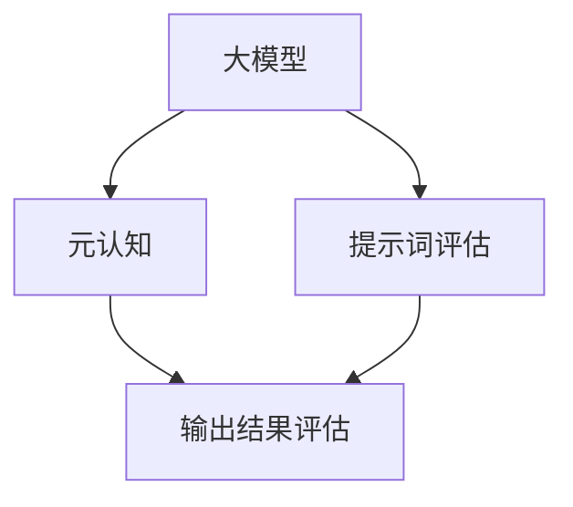
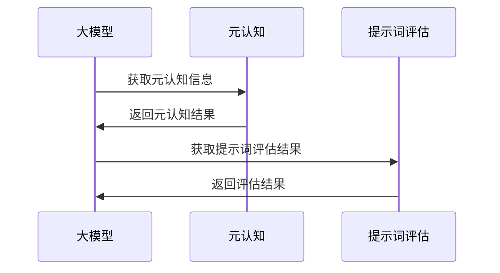

                 

# 大模型元认知与提示词自我评估机制

> 关键词：大模型、元认知、提示词、自我评估、算法原理、系统架构、项目实战

> 摘要：本文旨在探讨大模型元认知与提示词自我评估机制的核心概念、原理及其在人工智能领域中的应用。文章首先介绍了大模型元认知与提示词自我评估机制的问题背景、定义及作用，然后深入分析了元认知原理、机制以及与提示词自我评估的联系，进一步讲解了提示词自我评估算法的原理、流程和实现，最后通过系统分析与架构设计方案，项目实战案例解析，总结了最佳实践、注意事项以及拓展阅读，为人工智能领域的研究者和开发者提供了有价值的参考。

## 第一部分：背景介绍

### 第1章 问题背景

#### 1.1 问题提出

在人工智能领域，大模型的训练和应用越来越广泛，如图像识别、自然语言处理、推荐系统等。然而，大模型在训练和应用过程中，如何确保其输出的准确性和可靠性成为一个重要问题。一方面，大模型在处理复杂任务时，能够产生高质量的输出，但同时也可能因为数据偏差、模型过拟合等因素导致输出错误。另一方面，大模型在处理未知或边缘情况时，可能无法保证其输出结果的正确性。因此，如何对大模型进行有效的自我评估，提高其输出结果的准确性和可靠性，成为当前研究的热点和难点。

#### 1.2 问题解决

为了解决上述问题，我们可以引入元认知与提示词自我评估机制。元认知是指个体对自己认知过程的认知，包括元记忆、元理解和元计划。元认知能够帮助大模型监控自己的认知过程，发现并纠正错误。提示词自我评估机制则是通过生成提示词对大模型输出结果进行评估，从而进一步提高大模型输出结果的准确性和可靠性。

#### 1.3 边界与外延

元认知与提示词自我评估机制在大模型训练和应用中的具体应用场景包括：

1. **训练阶段**：在模型训练过程中，利用元认知对模型性能进行监控，发现并纠正训练过程中的错误，防止模型过拟合。

2. **推理阶段**：在模型应用过程中，利用提示词自我评估机制对模型输出结果进行评估，提高模型输出结果的准确性和可靠性。

3. **实时监控**：对大模型进行实时监控，及时发现并处理异常情况，确保模型始终处于良好状态。

#### 1.4 概念结构与核心要素组成

大模型元认知与提示词自我评估机制的核心概念包括元认知、提示词、自我评估。元认知包括元记忆、元理解和元计划；提示词是一系列具有特定含义的词汇或短语；自我评估是通过提示词对大模型输出结果进行评估的过程。核心要素组成如下：

1. **元认知**：包括元记忆、元理解和元计划。

2. **提示词生成模型**：用于生成提示词。

3. **评估模型**：用于对大模型输出结果进行评估。

4. **反馈机制**：将评估结果反馈给大模型，指导模型调整和优化。

## 第二部分：核心概念与联系

### 第2章 核心概念

#### 2.1 元认知概述

元认知是指个体对自己认知过程的认知。它包括元记忆、元理解和元计划。

1. **元记忆**：指个体对自己记忆过程的认知，包括记忆内容的存储、检索和遗忘。

2. **元理解**：指个体对自己理解过程的认知，包括理解内容的获取、分析和整合。

3. **元计划**：指个体对自己计划过程的认知，包括目标设定、任务分配和策略选择。

#### 2.2 提示词自我评估机制

提示词自我评估机制是指利用提示词对大模型输出结果进行评估的过程。它包括以下三个步骤：

1. **提示词生成**：根据大模型输出结果生成提示词。

2. **评估**：利用评估模型对提示词进行评估，判断大模型输出结果是否正确。

3. **反馈**：将评估结果反馈给大模型，指导模型调整和优化。

### 第三部分：算法原理讲解

### 第3章 元认知原理与机制

#### 3.1 元认知原理

元认知包括元记忆、元理解和元计划。元记忆、元理解和元计划相互关联，共同构成一个完整的元认知体系。

1. **元记忆**：元记忆是指个体对自己记忆过程的认知，包括记忆内容的存储、检索和遗忘。

   - **存储**：将信息存储在记忆中。
   - **检索**：从记忆中获取信息。
   - **遗忘**：随着时间的推移，部分记忆内容会逐渐消失。

2. **元理解**：元理解是指个体对自己理解过程的认知，包括理解内容的获取、分析和整合。

   - **获取**：从外部信息中获取理解内容。
   - **分析**：对获取的信息进行分析和思考。
   - **整合**：将分析的结果整合成新的知识。

3. **元计划**：元计划是指个体对自己计划过程的认知，包括目标设定、任务分配和策略选择。

   - **目标设定**：明确个体要达成的目标。
   - **任务分配**：将目标分解成具体的任务。
   - **策略选择**：选择合适的策略来完成任务。

#### 3.2 元认知机制

元认知机制包括反思模型、监控模型和规划模型。

1. **反思模型**：反思模型是指个体在完成任务后，对任务过程进行反思和总结。它有助于个体发现自身认知过程中的不足，并进行改进。

2. **监控模型**：监控模型是指个体在完成任务过程中，对任务进度和结果进行实时监控。它有助于个体及时发现并解决问题，确保任务顺利完成。

3. **规划模型**：规划模型是指个体在完成任务前，对任务进行规划和设计。它有助于个体明确任务目标、任务分配和策略选择，确保任务高效完成。

#### 3.3 元认知与提示词自我评估的联系

元认知与提示词自我评估机制有着密切的联系。

1. **基础关系**：元认知为提示词自我评估提供了基础。元认知中的元记忆、元理解和元计划可以帮助大模型更好地理解自身输出结果，从而生成更准确的提示词。

2. **作用关系**：提示词自我评估机制可以利用元认知中的元记忆、元理解和元计划，对大模型输出结果进行评估，进一步提高输出结果的准确性和可靠性。

### 第四部分：系统分析与架构设计方案

### 第4章 系统功能设计

#### 4.1 领域模型

在系统功能设计中，我们首先需要构建一个领域模型。领域模型用于描述系统中各个模块之间的关系以及它们所承担的功能。

```mermaid
classDiagram
    class 大模型 {
        +str()
        +repr()
    }
    class 元认知 {
        +str()
        +repr()
    }
    class 提示词评估 {
        +str()
        +repr()
    }
    大模型 --|大于| 元认知
    大模型 --|大于| 提示词评估
```

#### 4.2 系统架构设计

在系统架构设计中，我们主要关注系统中的各个模块以及它们之间的交互关系。



#### 4.3 系统接口设计

系统接口设计主要包括系统内部各个模块之间的接口设计，以及系统与外部系统的接口设计。



### 第五部分：项目实战

### 第5章 环境安装

#### 5.1 环境配置

在项目实战中，首先需要配置相应的开发环境。以下是环境配置的步骤：

1. 安装Python环境
2. 安装深度学习框架（如TensorFlow或PyTorch）
3. 安装其他依赖库（如NumPy、Pandas等）

#### 5.2 系统核心实现

在系统核心实现部分，我们将实现大模型、元认知和提示词评估的核心功能。

```python
# 大模型实现
class 大模型:
    def __init__(self):
        # 初始化大模型
        pass
    
    def train(self, data):
        # 训练大模型
        pass
    
    def predict(self, input_data):
        # 预测输出结果
        pass

# 元认知实现
class 元认知:
    def __init__(self):
        # 初始化元认知
        pass
    
    def monitor(self, model):
        # 监控模型
        pass
    
    def reflect(self, model):
        # 反思模型
        pass

# 提示词评估实现
class 提示词评估:
    def __init__(self):
        # 初始化提示词评估
        pass
    
    def generate_prompt(self, output):
        # 生成提示词
        pass
    
    def evaluate(self, prompt):
        # 评估提示词
        pass
```

#### 5.3 代码应用解读与分析

在代码应用解读与分析部分，我们将对系统核心实现的代码进行解读，并分析其原理和实现方式。

```python
# 大模型代码应用解读
def main():
    # 初始化大模型
    model = 大模型()

    # 加载数据
    data = ...

    # 训练大模型
    model.train(data)

    # 预测输出结果
    output = model.predict(input_data)

    # 生成提示词
    prompt = 提示词评估().generate_prompt(output)

    # 评估提示词
    result = 提示词评估().evaluate(prompt)

    # 输出评估结果
    print(result)

if __name__ == "__main__":
    main()
```

#### 5.4 实际案例分析与详细讲解剖析

在实际情况中，大模型可能会遇到各种复杂的问题。为了更好地理解和应用大模型元认知与提示词自我评估机制，我们通过实际案例进行分析和讲解。

案例：使用大模型进行图像识别任务。

1. **问题描述**：给定一张图片，使用大模型识别图片中的物体。

2. **解决方案**：

   - **训练大模型**：使用大量带有标签的图像数据集对大模型进行训练，使其具备图像识别能力。
   - **预测输出结果**：使用训练好的大模型对给定图片进行预测，得到图片中的物体。
   - **生成提示词**：根据预测结果生成提示词，如“这是一张猫的图片”。
   - **评估提示词**：利用提示词评估机制对提示词进行评估，判断其是否准确。

3. **分析讲解**：

   - **大模型训练**：大模型通过学习大量的图像和标签数据，建立图像与标签之间的对应关系。
   - **预测输出结果**：大模型根据输入图片的特征，利用训练得到的模型参数进行预测，得到图片中的物体。
   - **生成提示词**：根据预测结果，生成描述图片中物体的提示词。
   - **评估提示词**：利用提示词评估机制对提示词进行评估，判断其是否准确。

### 第六部分：最佳实践、小结、注意事项与拓展阅读

#### 6.1 最佳实践

在应用大模型元认知与提示词自我评估机制时，以下是一些最佳实践：

1. **数据准备**：确保训练数据的质量和多样性，以提高大模型的泛化能力。
2. **模型调优**：根据具体任务需求，对大模型进行适当的调优，以提高模型性能。
3. **监控与反思**：定期对大模型进行监控和反思，及时发现并处理潜在问题。

#### 6.2 小结

本文详细介绍了大模型元认知与提示词自我评估机制的核心概念、原理及其在人工智能领域中的应用。通过元认知原理与提示词自我评估机制的深入分析，我们了解到如何利用元认知对大模型进行自我评估，从而提高其输出结果的准确性和可靠性。在系统分析与架构设计方案中，我们展示了如何设计一个具有高效性能和可靠性的大模型系统。通过项目实战和实际案例分析，我们进一步了解了大模型元认知与提示词自我评估机制的具体应用。

#### 6.3 注意事项

在应用大模型元认知与提示词自我评估机制时，需要注意以下几点：

1. **数据质量**：确保训练数据的质量和多样性，以提高大模型的泛化能力。
2. **模型调优**：根据具体任务需求，对大模型进行适当的调优，以提高模型性能。
3. **监控与反思**：定期对大模型进行监控和反思，及时发现并处理潜在问题。

#### 6.4 拓展阅读

1. **《人工智能：一种现代的方法》**：详细介绍了人工智能的基础知识和发展历程，对人工智能领域的读者有很好的参考价值。
2. **《深度学习》**：深度学习领域的经典教材，介绍了深度学习的理论基础和实践方法，对深度学习研究者有很高的参考价值。
3. **《大数据之路：阿里巴巴大数据实践》**：介绍了阿里巴巴在大数据领域的实践经验和教训，对大数据领域的从业者有很好的启示作用。

### 总结

本文对大模型元认知与提示词自我评估机制进行了详细探讨，包括核心概念、原理、系统架构和项目实战等方面。通过本文的阅读，读者可以更好地了解大模型元认知与提示词自我评估机制在人工智能领域中的应用，为其在相关领域的研究和开发提供有益的参考。

作者：AI天才研究院/AI Genius Institute & 禅与计算机程序设计艺术 /Zen And The Art of Computer Programming

