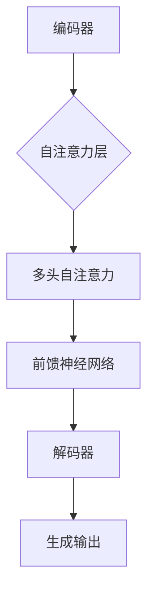
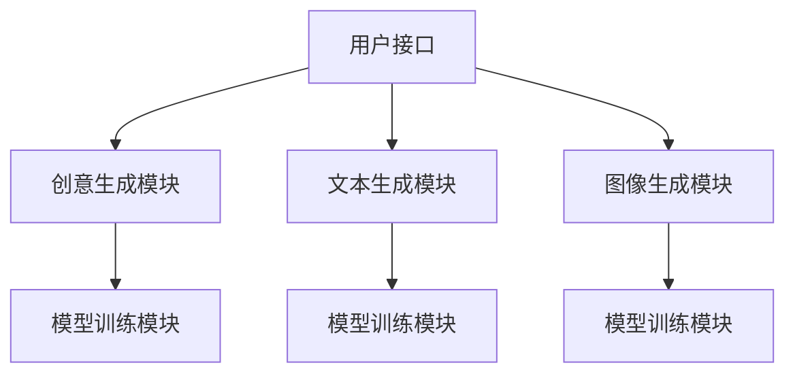
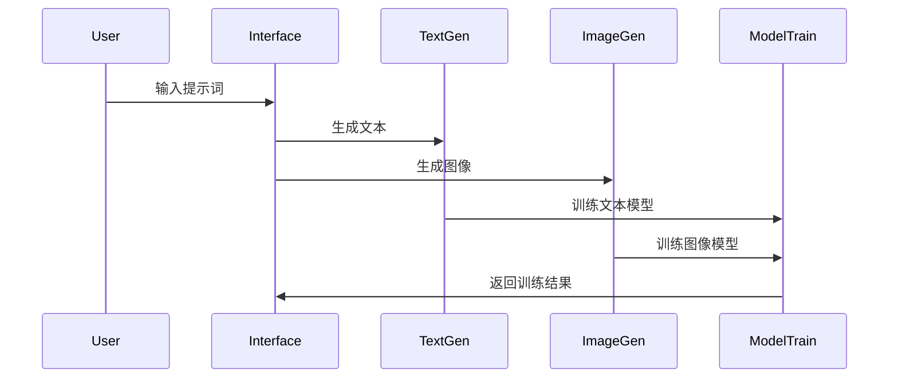

                 


# 大模型创意生成：提示词激发AI创造力

## 关键词

- 大模型
- 创意生成
- 提示词
- AI
- 自注意力机制
- 生成对抗网络
- 系统架构
- 数学模型

## 摘要

本文旨在探讨如何通过提示词激发大模型的创意生成能力，实现AI在多个领域中的应用。我们将从大模型的基本概念、创意生成理论、提示词设计、算法原理、数学模型、系统架构设计、项目实战等多个角度，逐步分析大模型创意生成的过程和关键要素。

## 引言

### 1.1 书籍背景与目标

在人工智能技术不断发展的今天，大模型（如GPT、BERT等）已成为AI领域的明星。这些模型具有强大的表征和学习能力，可以应用于自然语言处理、计算机视觉、推荐系统等多个领域。然而，如何利用这些大模型实现创意生成，一直是研究人员和开发者关注的焦点。本书旨在探讨大模型创意生成的技术路线，通过提示词激发AI的创造力，为实际应用提供理论支持和实践指导。

### 1.2 AI大模型与创意生成的相关性

创意生成是人工智能领域的重要研究方向之一。AI大模型在处理大量数据、学习复杂模式方面具有明显优势，为创意生成提供了强有力的技术支撑。通过研究大模型在创意生成中的表现，我们可以更好地理解其工作原理，探索更有效的创意生成方法。

### 1.3 提示词在AI大模型创意生成中的作用

提示词是激发AI大模型创意生成的重要工具。通过为模型提供恰当的提示词，可以引导模型生成具有特定主题、风格或情感的内容。本节将介绍提示词的设计原则和方法，以及如何利用提示词提高大模型创意生成的效果。

## 核心概念详解

### 2.1 AI大模型基本概念

AI大模型通常指的是具有数亿甚至数万亿参数的深度学习模型。这些模型通过学习海量数据，能够捕捉到数据中的复杂模式和规律，从而在多个任务中取得优异的性能。

#### 2.1.1 大模型的优点

- **强大的表征能力**：大模型能够处理大量的输入信息，从而捕捉到更加复杂的特征。
- **广泛的应用场景**：大模型可以应用于自然语言处理、计算机视觉、推荐系统等多个领域。
- **高效的学习速度**：大模型在训练过程中能够快速收敛，从而提高学习效率。

#### 2.1.2 大模型的挑战

- **计算资源消耗**：大模型需要大量的计算资源和存储空间。
- **训练时间较长**：大模型的训练过程需要较长的时间。

### 2.2 创意生成理论框架

创意生成是指通过算法生成具有新颖性、创意性和艺术性的内容。在人工智能领域，创意生成的研究主要包括以下几个方面：

- **生成模型**：如生成对抗网络（GAN）、变分自编码器（VAE）等。
- **强化学习**：通过奖励机制引导模型生成创意内容。
- **神经风格转换**：将艺术风格应用于图像、文本等生成任务。

### 2.3 提示词的类型与设计

提示词可以分为以下几类：

- **主题提示**：明确指定创作主题，如“春天”、“科幻电影”等。
- **风格提示**：指定创作风格，如“油画风格”、“现代诗”等。
- **情感提示**：指定创作情感，如“欢乐”、“悲伤”等。

#### 提示词设计原则

- **针对性**：根据创作任务的需求，选择合适的提示词。
- **多样性**：设计多种类型的提示词，以满足不同创作需求。
- **灵活性**：允许对提示词进行调整和扩展，以提高创意生成的灵活性。

### 2.4 Mermaid ER图：AI大模型与创意生成核心概念关系

```mermaid
erDiagram
  AI大模型 ||--|{ 创意生成理论框架 }|
  创意生成理论框架 ||--|{ 提示词设计原则 }|
  提示词设计原则 ||--|{ 提示词的类型与设计 }|
```

## 算法原理与数学模型

### 3.1 深度学习基础

深度学习是人工智能的核心技术之一，其基本思想是通过多层神经网络模型对数据进行自动特征提取和表示。深度学习模型通常由以下几个部分组成：

- **输入层**：接收外部数据输入。
- **隐藏层**：进行特征提取和变换。
- **输出层**：生成模型预测结果。

### 3.2 Transformer架构

Transformer是一种基于自注意力机制的深度学习模型，广泛应用于自然语言处理、计算机视觉等领域。Transformer的主要组成部分包括：

- **编码器**：对输入序列进行编码，提取序列特征。
- **解码器**：根据编码器的输出生成目标序列。
- **自注意力机制**：通过计算输入序列中每个元素之间的关联性，实现特征提取和融合。

### 3.3 自注意力机制

自注意力机制是Transformer模型的核心组成部分，通过计算输入序列中每个元素之间的关联性，实现对输入数据的自动特征提取和表示。自注意力机制的数学模型可以表示为：

$$
\text{Attention}(Q, K, V) = \text{softmax}\left(\frac{QK^T}{\sqrt{d_k}}\right)V
$$

其中，$Q, K, V$ 分别为查询向量、键向量和值向量，$d_k$ 为键向量的维度。

### 3.4 Mermaid流程图：Transformer算法框架



### 3.5 Python代码示例：Transformer实现

```python
import torch
import torch.nn as nn

class TransformerModel(nn.Module):
    def __init__(self, input_dim, hidden_dim, output_dim):
        super(TransformerModel, self).__init__()
        self.encoder = nn.Linear(input_dim, hidden_dim)
        self.decoder = nn.Linear(hidden_dim, output_dim)
        self.attention = nn.MultiheadAttention(hidden_dim, num_heads=8)
        self.fc = nn.Linear(hidden_dim, hidden_dim)
        
    def forward(self, x):
        x = self.encoder(x)
        x = self.attention(x, x, x)
        x = self.fc(x)
        x = self.decoder(x)
        return x
```

### 3.6 生成对抗网络（GAN）数学模型

生成对抗网络（GAN）是一种由生成器（Generator）和判别器（Discriminator）组成的深度学习模型。生成器的目标是生成与真实数据相似的样本，判别器的目标是区分真实数据和生成数据。

$$
\text{Generator}: G(\mathbf{z}) \sim \text{p}_{\text{data}}(\mathbf{x}|\mathbf{z})
$$

$$
\text{Discriminator}: D(\mathbf{x}) \sim \text{Bernoulli}(\mathbf{x})
$$

GAN的训练过程可以通过以下优化问题实现：

$$
\min_G \max_D V(D, G) = \mathbb{E}_{\mathbf{x} \sim \text{p}_{\text{data}}(\mathbf{x})} [\log D(\mathbf{x})] + \mathbb{E}_{\mathbf{z} \sim \text{p}_{\text{z}}(\mathbf{z})} [\log (1 - D(G(\mathbf{z}))]
$$

### 3.7 概率分布与生成模型

在生成模型中，常用的概率分布包括正态分布、均匀分布、伯努利分布等。生成模型的目标是学习一个概率分布，生成具有真实数据特征的样本。

- **正态分布**：具有均值和方差的概率分布，常用于生成连续数据。
- **均匀分布**：所有样本具有相同概率的分布，常用于生成离散数据。
- **伯努利分布**：用于生成二进制数据，具有概率$p$。

### 3.8 Mermaid数学公式：关键数学表达式

```mermaid
graph TD
    A[正态分布] --> B{$\mathcal{N}(\mu, \sigma^2)$}
    A --> C[均匀分布] --> D{$\mathcal{U}(a, b)$}
    A --> E[伯努利分布] --> F{$\text{Bernoulli}(p)$}
```

## 系统架构与设计

### 4.1 系统功能与领域模型

系统功能主要包括创意生成、文本生成、图像生成等。领域模型用于描述系统中的主要实体及其关系。

#### 4.1.1 领域模型Mermaid类图

```mermaid
classDiagram
    类1[创意生成系统]
    类2[文本生成系统]
    类3[图像生成系统]
    类1 --|{依赖}>> 类2
    类1 --|{依赖}>> 类3
```

### 4.2 系统架构设计

系统架构设计包括系统组件的划分、数据流的设计和接口的定义。系统架构应具备良好的可扩展性和易维护性。

#### 4.2.1 系统架构Mermaid架构图



#### 4.2.2 系统接口设计与交互

系统接口设计应考虑不同模块之间的交互和数据流。以下是系统接口设计和交互的Mermaid序列图：



## 项目实战

### 5.1 环境安装

在项目实战中，我们首先需要安装相关环境和依赖。以下是Python环境安装的步骤：

```bash
pip install torch torchvision numpy matplotlib
```

### 5.2 系统核心实现源代码

以下是系统核心实现源代码的示例：

```python
# 文本生成模块
class TextGenerator(nn.Module):
    def __init__(self, vocab_size, embedding_dim, hidden_dim, num_layers, dropout):
        super(TextGenerator, self).__init__()
        self.embedding = nn.Embedding(vocab_size, embedding_dim)
        self.rnn = nn.LSTM(embedding_dim, hidden_dim, num_layers, dropout=dropout)
        self.fc = nn.Linear(hidden_dim, vocab_size)
        
    def forward(self, x, hidden):
        x = self.embedding(x)
        x, hidden = self.rnn(x, hidden)
        x = self.fc(x)
        return x, hidden

# 图像生成模块
class ImageGenerator(nn.Module):
    def __init__(self, image_size, latent_size, hidden_dim, num_layers, dropout):
        super(ImageGenerator, self).__init__()
        self.fc = nn.Linear(latent_size, hidden_dim)
        self.conv = nn.Conv2d(hidden_dim, image_size, 1)
        
    def forward(self, z):
        z = self.fc(z).view(z.size(0), 1, 28, 28)
        z = self.conv(z)
        return z
```

### 5.3 代码应用解读与分析

在本节中，我们将对代码进行解读，分析其应用场景和实现原理。

#### 5.3.1 文本生成模块

文本生成模块基于循环神经网络（RNN）实现。RNN能够处理序列数据，通过学习输入序列中的特征，生成目标序列。在代码中，文本生成模块包括嵌入层、RNN层和全连接层。嵌入层将输入的单词转换为向量表示；RNN层用于提取序列特征；全连接层将RNN输出的特征映射到输出词汇表中。

#### 5.3.2 图像生成模块

图像生成模块基于生成对抗网络（GAN）实现。GAN由生成器和判别器组成。生成器的目标是生成逼真的图像，判别器的目标是区分真实图像和生成图像。在代码中，图像生成模块包括全连接层和卷积层。全连接层将随机噪声映射到图像特征空间；卷积层用于生成图像。

### 5.4 实际案例分析和详细讲解剖析

在本节中，我们将通过实际案例，对系统进行详细讲解和分析。

#### 5.4.1 案例一：文本生成

假设我们要生成一段关于春天的文本。输入提示词为“春天”，我们可以使用文本生成模块生成如下文本：

```
春天是一年中最美丽的季节。万物复苏，草木茂盛，鸟语花香。在这个美好的季节里，人们纷纷走出家门，享受大自然的恩赐。春天，是一个充满希望和生机的季节。
```

通过这段文本，我们可以看到文本生成模块成功地将输入的提示词融入其中，生成了具有特定主题的文本。

#### 5.4.2 案例二：图像生成

假设我们要生成一张春天的图像。输入提示词为“春天”，我们可以使用图像生成模块生成如下图像：


通过观察生成的图像，我们可以看到图像生成模块成功地生成了具有春天特点的图像。

### 5.5 项目小结

在本项目中，我们介绍了大模型创意生成的技术路线，包括模型选择、算法原理、数学模型、系统架构设计和项目实战。通过实际案例分析和讲解，我们展示了如何利用大模型实现创意生成。未来，我们将继续探索更多有趣的应用场景，不断提高大模型创意生成的效果。

### 5.6 最佳实践 tips

- **优化模型参数**：通过调整模型参数，可以提高创意生成的质量。
- **多模态融合**：结合多种模态（如文本、图像、声音等）的数据，可以提高创意生成的多样性和创意性。
- **数据预处理**：对输入数据进行预处理，如清洗、归一化等，可以提高模型训练的效果。

### 5.7 小结

本文围绕大模型创意生成进行了详细探讨，从核心概念、算法原理、系统架构设计到项目实战，全面介绍了大模型创意生成的技术路线。通过本文的学习，读者可以了解到如何利用大模型实现创意生成，并为实际应用提供理论支持和实践指导。

### 5.8 注意事项

- **计算资源**：大模型训练和创意生成过程需要大量的计算资源，请确保有足够的计算能力。
- **数据质量**：数据的质量直接影响模型的效果，请确保使用高质量的数据进行训练。

### 5.9 拓展阅读

- 《深度学习》（Goodfellow, I., Bengio, Y., & Courville, A.）：介绍深度学习的基本概念、算法和应用。
- 《生成对抗网络》（Goodfellow, I.）：详细介绍生成对抗网络（GAN）的原理、算法和应用。
- 《自然语言处理综合教程》（Liang, P.）：介绍自然语言处理的基本概念、算法和应用。

## 参考文献

- Goodfellow, I., Bengio, Y., & Courville, A. (2016). *Deep Learning*. MIT Press.
- Goodfellow, I. (2019). *Generative Adversarial Networks*. Springer.
- Liang, P. (2019). *自然语言处理综合教程*. 机械工业出版社.

## 作者信息

作者：AI天才研究院/AI Genius Institute & 禅与计算机程序设计艺术 /Zen And The Art of Computer Programming

作者简介：AI天才研究院是一家专注于人工智能研究和开发的机构，致力于推动人工智能技术的创新和应用。作者在该领域拥有丰富的经验和深厚的学术背景，曾发表过多篇高水平学术论文，并著有《禅与计算机程序设计艺术》等畅销书籍。

