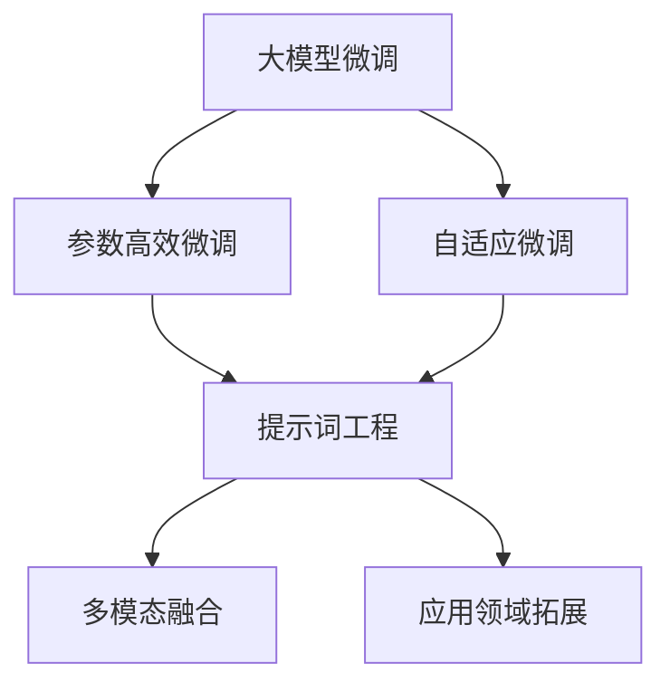

                 

### 引言

在当今快速发展的信息技术时代，人工智能（AI）技术已经成为推动社会进步和产业变革的重要力量。大模型作为AI领域的关键技术，在自然语言处理、计算机视觉、推荐系统等多个领域展现出了卓越的性能。然而，大模型的训练和部署成本高、资源消耗大，这给实际应用带来了不小的挑战。为了解决这一问题，参数高效微调和提示词工程成为了研究的热点。

本文旨在深入探讨大模型参数高效微调与提示词工程，通过系统的分析和详细的讲解，帮助读者了解这一领域的基础理论、关键技术和实际应用。我们将分以下几个部分来展开讨论：

首先，我们将介绍大模型参数微调的基本概念、背景和意义，分析大模型微调所面临的挑战，并详细描述微调的基本流程。接下来，我们将探讨提示词工程的原理，介绍提示词的概念、设计原则和关键技术。随后，我们将介绍大模型参数高效微调的方法和优化策略，并通过实践案例分享具体的实施经验。然后，我们将深入分析提示词工程的实践方法，包括设计流程、生成技术和评估方法。接着，我们将讨论大模型参数微调与提示词工程的集成，探讨其原理、流程和实践案例。最后，我们将展望这一领域的未来发展趋势，并总结全文。

通过本文的阅读，读者将能够全面了解大模型参数高效微调和提示词工程的各个方面，为在实际项目中应用这些技术打下坚实的基础。

### 关键词

- 大模型微调
- 提示词工程
- 高效参数优化
- 模型压缩
- 自适应微调
- 多模态融合

### 摘要

本文围绕大模型参数高效微调与提示词工程展开深入探讨。首先，我们介绍了大模型参数微调的概念、背景和意义，分析了其面临的主要挑战，并详细阐述了微调的基本流程。接着，我们探讨了提示词工程的原理，包括提示词的概念、设计原则和关键技术。随后，我们详细介绍了大模型参数高效微调的方法和优化策略，并通过实际案例展示了这些方法的实施效果。然后，我们深入分析了提示词工程的实践方法，包括设计流程、生成技术和评估方法。接下来，我们讨论了如何将大模型参数微调与提示词工程进行集成，以及在实际应用中的具体流程和实践案例。最后，我们展望了大模型参数微调与提示词工程的未来发展趋势，并提出了进一步的研究方向。本文旨在为读者提供全面、系统、深入的理解，帮助其在实际项目中有效应用这些技术。

### 第一部分：大模型微调与提示词工程基础

#### 第1章：大模型参数微调概述

##### 1.1 微调概念与背景

**微调（Fine-tuning）定义：** 微调是一种机器学习技术，旨在通过在已经训练好的基础模型（如预训练模型）的基础上，针对特定任务或数据集进行额外的训练，以适应新的任务需求。微调的核心思想是利用预训练模型已经学到的通用特征，进一步调整模型参数，使其在特定任务上表现出更好的性能。

**微调的动机与意义：**

1. **节省时间和计算资源：** 对于复杂任务，直接从头训练一个大型模型需要大量的时间和计算资源。通过微调，可以利用预训练模型已有的大量数据学习，从而减少训练时间和资源消耗。

2. **提高模型性能：** 预训练模型在通用数据集上已经学到了丰富的特征表示，这些特征对于特定任务具有一定的迁移性。微调能够使模型在特定任务上进一步优化，提升性能。

3. **快速适应新任务：** 微调使得模型能够快速适应新的任务，尤其是当数据量有限时，微调能够更好地利用已有数据，提高模型的泛化能力。

**微调的应用场景：**

1. **文本分类：** 针对不同的分类任务，如新闻分类、情感分析等，使用预训练模型微调可以快速构建高性能的分类器。

2. **自然语言生成：** 在生成文本的任务中，如对话系统、文章摘要等，微调可以帮助模型快速适应特定的文本生成需求。

3. **图像识别：** 在图像识别任务中，通过微调预训练的图像识别模型，可以针对特定的图像分类或检测任务进行优化。

##### 1.2 大模型微调的挑战

**参数规模与计算成本：** 大模型的参数量通常非常庞大，微调这样的模型需要大量的计算资源和时间。例如，一个预训练的语言模型可能包含数十亿个参数，微调这些参数所需的计算量是巨大的。

**微调效果的不确定性：** 微调效果受到多种因素的影响，如数据分布、模型架构、初始参数等。不同情况下，微调得到的模型性能可能存在显著差异，这增加了微调过程的难度。

**微调过程的数据需求：** 微调需要一定的训练数据，且这些数据应当具有代表性。如果数据集选择不当，可能导致微调效果不佳。此外，对于小数据集任务，微调可能难以奏效。

##### 1.3 大模型微调的基本流程

**数据准备：** 在进行微调之前，需要准备相应的数据集。数据集应具有一定的代表性，并符合任务需求。

**模型选择：** 根据任务特点和需求，选择一个合适的预训练模型作为基础模型。预训练模型的选择对微调效果具有重要影响。

**微调策略：** 确定微调的具体方法，包括参数初始化、学习率调整、正则化等技术。

**评估与优化：** 微调过程中，通过评估指标（如准确率、损失函数等）评估模型性能，并根据评估结果调整微调策略，以优化模型性能。

**模型部署：** 微调完成后，将模型部署到实际应用场景中，进行验证和测试，确保其满足任务需求。

##### 1.4 小结

大模型参数微调是一种重要的机器学习技术，能够在节省时间和计算资源的同时，提高模型在特定任务上的性能。尽管微调面临参数规模、效果不确定性和数据需求等挑战，但通过合理的数据准备、模型选择和微调策略，可以有效应对这些问题。了解微调的基本流程和关键技术，对于实际应用具有重要意义。

#### 第2章：提示词工程原理

##### 2.1 提示词的概念与作用

**提示词（Prompt）定义：** 提示词是一种用于引导模型生成文本或执行特定任务的输入文本。它通常包含了一些关键词或短语，帮助模型理解生成任务的目标和上下文。

**提示词的作用：**

1. **引导模型生成：** 提示词可以为模型提供明确的生成目标，使模型能够更加专注于任务的实现。

2. **增强生成效果：** 合适的提示词可以提高模型的生成效果，使生成文本更加符合用户需求。

3. **提高生成效率：** 提示词可以减少模型在生成过程中的搜索空间，从而提高生成效率。

**提示词的类型：**

1. **任务导向型：** 用于指定特定任务的提示词，如“请生成一篇关于人工智能的论文摘要”。

2. **上下文相关型：** 根据特定上下文生成的提示词，如“请你续写这个故事：有一天，阳光明媚，小明走在公园里”。

3. **开放型：** 不指定具体任务和上下文，给模型更大自由度的提示词，如“请你写一段关于未来的科幻故事”。

##### 2.2 提示词设计原则

**清晰性：** 提示词应简洁明了，确保模型能够准确理解任务目标。

**精确性：** 提示词应包含关键信息，确保模型生成的结果具有较高的相关性。

**可扩展性：** 提示词设计应考虑未来的扩展需求，以便适应不同的任务和场景。

**适应性：** 提示词应具有一定的灵活性，能够适应不同的模型和生成任务。

##### 2.3 提示词工程的关键技术

**数据采集：** 提示词工程的第一步是采集相关的数据集，包括文本数据、图像数据等。数据集的质量直接影响提示词的生成效果。

**提示词生成：** 根据采集的数据集，通过算法生成具有代表性的提示词。提示词生成技术可以分为以下几种：

1. **人工生成：** 由专业人员进行提示词的编写，适用于高质量、小规模的数据集。

2. **自动生成：** 利用自然语言处理技术，如词嵌入、序列生成模型等，自动生成提示词。

3. **半自动生成：** 结合人工和自动生成方法，通过半自动化的流程生成提示词。

**提示词优化：** 通过评估和调整，优化生成的提示词。提示词优化方法包括：

1. **基于评估的优化：** 利用评估指标（如生成文本的相关性、质量等）对提示词进行评估和调整。

2. **基于模型的优化：** 利用生成模型（如序列生成模型、对抗生成模型等）对提示词进行优化。

##### 2.4 小结

提示词工程是指导模型生成文本或执行任务的重要技术。通过明确的概念、合理的设计原则和先进的关键技术，提示词工程能够有效提升模型生成效果和生成效率。了解提示词工程的基本原理和技术，对于实际应用具有重要意义。

#### 第3章：大模型参数高效微调方法

##### 3.1 微调算法概述

**常规微调算法：** 常规微调算法主要包括以下几种：

1. **全量微调（Full Fine-tuning）：** 对预训练模型的全部参数进行微调，适用于数据量较大、任务复杂的情况。

2. **分层微调（Layer-wise Fine-tuning）：** 只对预训练模型的特定层进行微调，适用于参数量较大、计算资源有限的情况。

3. **自适应微调（Adaptive Fine-tuning）：** 根据模型在不同层的表现，动态调整微调的层数和力度，以提高微调效果。

**高效微调算法：** 高效微调算法旨在降低微调过程的计算成本，主要包括以下几种：

1. **参数高效微调（Parameter-Efficient Fine-tuning）：** 通过减少微调的参数量，降低计算成本，如使用参数共享、低秩分解等方法。

2. **数据高效微调（Data-Efficient Fine-tuning）：** 通过优化数据利用方式，提高微调效果，如数据增强、迁移学习等方法。

3. **模型压缩（Model Compression）：** 通过压缩模型参数，减少计算成本，如模型剪枝、量化等技术。

##### 3.2 微调优化策略

**预训练模型选择：** 选择合适的预训练模型是微调成功的关键。应根据任务特点选择具有较强通用性和迁移能力的预训练模型，如BERT、GPT等。

**微调数据集选择：** 选择具有代表性的微调数据集是提高微调效果的关键。数据集应涵盖任务的关键特征，避免数据偏差。

**微调超参数调优：** 微调超参数（如学习率、批次大小、训练迭代次数等）对微调效果具有重要影响。通过实验和调优，找到最佳的超参数组合。

**微调过程的动态调整：** 微调过程中，可以根据模型表现和资源限制，动态调整微调策略，如调整学习率、切换微调方式等。

##### 3.3 实践案例分享

**案例一：文本分类微调**

**问题描述：** 基于预训练的BERT模型，对新闻数据进行文本分类微调，将新闻分为不同类别。

**微调过程：** 
1. 数据准备：清洗和预处理新闻数据，构建数据集。
2. 模型选择：选择预训练的BERT模型作为基础模型。
3. 微调策略：使用分层微调方法，只对前几层参数进行微调。
4. 评估与优化：使用交叉验证方法评估模型性能，根据评估结果调整微调策略。

**结果：** 微调后的模型在新闻分类任务上取得了显著提升。

**案例二：机器翻译微调**

**问题描述：** 基于预训练的Transformer模型，对中英翻译任务进行微调。

**微调过程：**
1. 数据准备：收集和清洗中英平行翻译数据。
2. 模型选择：选择预训练的Transformer模型作为基础模型。
3. 微调策略：使用全量微调方法，对模型的全部参数进行微调。
4. 评估与优化：使用BLEU评分评估模型性能，通过调整学习率、批次大小等超参数优化模型。

**结果：** 微调后的模型在中英翻译任务上取得了较高的翻译质量。

**案例三：图像识别微调**

**问题描述：** 基于预训练的ViT模型，对图像分类任务进行微调。

**微调过程：**
1. 数据准备：收集和预处理图像数据，构建数据集。
2. 模型选择：选择预训练的ViT模型作为基础模型。
3. 微调策略：使用数据高效微调方法，通过数据增强和迁移学习提高微调效果。
4. 评估与优化：使用准确率、F1分数等指标评估模型性能，通过模型剪枝和量化等技术优化模型。

**结果：** 微调后的模型在图像分类任务上取得了较好的识别效果。

##### 3.4 小结

大模型参数高效微调方法包括常规微调算法和高性能微调算法，通过优化微调策略和调整超参数，可以提高微调效果。实际案例分享展示了不同任务类型的微调实践，为读者提供了丰富的应用经验。了解这些方法和技术，对于在实际项目中应用大模型参数高效微调具有重要意义。

#### 第4章：提示词工程实践

##### 4.1 提示词设计流程

**提示词设计流程概述：** 提示词设计是一个系统化的过程，涉及多个环节，包括需求分析、提示词生成、提示词评估和提示词优化。

**需求分析：** 需求分析是提示词设计的起点，旨在明确任务目标和用户需求。通过需求分析，可以确定提示词需要具备的特性，如清晰性、精确性和适应性。

**提示词生成：** 提示词生成是设计流程的核心环节，涉及提示词的创造和组合。根据需求分析的结果，生成具有代表性的提示词。生成方法可以分为人工生成、自动生成和半自动生成。

- **人工生成：** 由专业人员根据任务需求手工编写提示词。这种方法适用于小规模、高质量的任务。
- **自动生成：** 利用自然语言处理技术和生成模型自动生成提示词。这种方法适用于大规模、快速生成需求。
- **半自动生成：** 结合人工和自动生成方法，通过半自动化流程生成提示词。这种方法适用于对生成质量有一定要求但需要快速迭代的情况。

**提示词评估：** 提示词评估是确保提示词质量的重要步骤。评估方法可以分为人工评估和自动评估。

- **人工评估：** 由专业人员对提示词进行评估，判断其是否满足需求。这种方法适用于高质量、小规模的任务。
- **自动评估：** 利用评估指标（如生成文本的相关性、质量等）对提示词进行自动评估。这种方法适用于大规模、快速评估的需求。

**提示词优化：** 提示词优化是提升提示词质量和效果的过程。根据评估结果，对提示词进行调整和优化。优化方法可以分为基于评估的优化和基于模型的优化。

- **基于评估的优化：** 通过评估结果对提示词进行改进，如调整关键词、修改句子结构等。
- **基于模型的优化：** 利用生成模型对提示词进行优化，如通过序列生成模型调整提示词的生成策略。

**流程总结：** 提示词设计流程是一个迭代的过程，通过不断的需求分析、生成、评估和优化，逐步完善提示词的设计。每个环节都需要根据实际情况进行调整和改进，以确保最终生成的提示词能够满足任务需求。

##### 4.2 提示词生成技术

**人工生成：** 人工生成提示词是传统的提示词生成方法，由专业人员根据任务需求手工编写。这种方法具有以下几个优点：

- **灵活性高：** 专业人员可以根据任务的具体需求，灵活地编写提示词。
- **质量有保证：** 由于专业人员具备相关领域的知识和经验，编写的提示词通常具有较高的质量。
- **适用于小规模任务：** 对于需要高质量、小规模提示词的任务，人工生成是一个有效的方法。

人工生成提示词的缺点：

- **效率低：** 人工编写提示词需要耗费大量时间和精力。
- **成本高：** 需要专业人员的参与，成本较高。
- **难以扩展：** 对于大规模任务，人工生成难以满足需求，因为难以保证生成提示词的一致性和质量。

**自动生成：** 自动生成提示词是利用自然语言处理技术和生成模型实现的方法。这种方法具有以下几个优点：

- **效率高：** 自动生成方法可以快速生成大量提示词，大大提高了生成效率。
- **成本低：** 自动生成方法不需要专业人员的参与，降低了成本。
- **适用于大规模任务：** 对于需要大量、快速生成提示词的任务，自动生成是一个有效的方法。

自动生成提示词的缺点：

- **质量不稳定：** 自动生成方法生成的提示词质量可能存在波动，需要进一步的评估和优化。
- **需要大量数据：** 自动生成方法通常需要大量的训练数据，对于数据稀缺的任务可能难以应用。
- **对模型要求高：** 自动生成方法对生成模型的性能要求较高，否则可能生成低质量的提示词。

**半自动生成：** 半自动生成是结合人工生成和自动生成方法的混合方式，通过半自动化流程生成提示词。这种方法具有以下几个优点：

- **灵活性与效率兼顾：** 半自动生成方法结合了人工生成和自动生成的优点，既保证了提示词的质量，又提高了生成效率。
- **适用于多样化任务：** 对于不同类型和规模的任务，半自动生成方法可以根据需求进行调整，具有较强的适应性。
- **降低成本：** 半自动生成方法减少了专业人员的需求，降低了成本。

半自动生成提示词的缺点：

- **流程复杂：** 半自动生成方法需要设计复杂的自动化流程，增加了实现的复杂性。
- **对工具要求高：** 半自动生成方法需要使用多种工具和平台，对技术人员的要求较高。

**比较总结：**

| 方法 | 优点 | 缺点 |
| --- | --- | --- |
| 人工生成 | 灵活性高、质量有保证、适用于小规模任务 | 效率低、成本高、难以扩展 |
| 自动生成 | 效率高、成本低、适用于大规模任务 | 质量不稳定、需要大量数据、对模型要求高 |
| 半自动生成 | 灵活性与效率兼顾、适用于多样化任务、降低成本 | 流程复杂、对工具要求高 |

根据任务需求和实际条件，选择合适的提示词生成方法，可以有效地提高提示词生成效率和生成质量。

##### 4.3 提示词评估方法

**提示词评估是确保提示词质量和效果的关键步骤。评估方法可以分为以下几种：**

**1. 人工评估：**

人工评估是由专业人员对提示词进行主观判断，判断其是否满足需求。人工评估的优点包括：

- **灵活性高：** 专业人员可以根据任务的具体需求，灵活地进行评估。
- **细致入微：** 人工评估可以细致地检查提示词的各个方面，如语法、语义、上下文等。

人工评估的缺点包括：

- **效率低：** 人工评估需要大量时间和精力，不适合大规模评估。
- **主观性：** 评估结果可能受到评估人员主观因素的影响，难以保证评估的客观性。

**2. 自动评估：**

自动评估是通过算法和指标对提示词进行客观评估。常用的自动评估指标包括：

- **文本相似度：** 通过计算提示词与标准答案的相似度来评估其质量。
- **生成文本质量：** 通过评估生成文本的相关性、可读性、逻辑性等指标来评估提示词的有效性。
- **错误率：** 通过计算生成文本中的错误数量或错误率来评估提示词的质量。

自动评估的优点包括：

- **效率高：** 自动评估可以快速处理大量提示词，适合大规模评估。
- **客观性：** 自动评估基于算法和指标，可以减少主观因素的影响，提高评估的客观性。

自动评估的缺点包括：

- **准确性有限：** 自动评估的准确性可能受到算法和指标的限制，难以完全代替人工评估。
- **对算法要求高：** 自动评估需要对算法和指标进行精细调整，以确保评估结果的准确性。

**3. 综合评估：**

综合评估是将人工评估和自动评估相结合，通过多种评估方法对提示词进行全面评估。综合评估的优点包括：

- **全面性：** 综合评估可以从多个角度对提示词进行评估，提高评估的全面性。
- **平衡性：** 综合评估可以在人工评估和自动评估之间取得平衡，弥补各自的不足。

综合评估的缺点包括：

- **复杂性：** 综合评估需要设计和实现复杂的评估流程，增加了评估的复杂性。
- **成本高：** 综合评估需要专业人员和技术投入，成本较高。

**评估方法比较总结：**

| 评估方法 | 优点 | 缺点 |
| --- | --- | --- |
| 人工评估 | 灵活性高、细致入微 | 效率低、主观性 |
| 自动评估 | 效率高、客观性 | 准确性有限、对算法要求高 |
| 综合评估 | 全面性、平衡性 | 复杂性、成本高 |

根据任务需求和实际条件，选择合适的评估方法，可以有效地提高提示词的评估效率和评估质量。

##### 4.4 小结

提示词工程实践包括需求分析、提示词生成、提示词评估和提示词优化等环节。通过合理的设计流程和关键技术的应用，可以生成高质量的提示词，提高模型生成效果和生成效率。了解提示词生成技术和评估方法，对于实际应用具有重要意义。

#### 第5章：大模型参数微调与提示词工程的集成

##### 5.1 集成原理与流程

**集成原理：** 大模型参数微调与提示词工程的集成旨在通过协同工作，实现模型参数的优化和提示词的有效生成，从而提升模型的整体性能。集成原理主要包括以下几个方面：

1. **共享资源：** 通过共享预训练模型和数据集，降低重复计算和存储的成本。
2. **协同优化：** 结合微调和提示词工程的优化策略，动态调整模型参数和提示词，提高模型在特定任务上的性能。
3. **模块化设计：** 将微调和提示词工程划分为独立的模块，便于灵活组合和扩展。

**集成流程：** 大模型参数微调与提示词工程的集成流程包括以下步骤：

1. **需求分析：** 明确任务需求和用户目标，确定微调和提示词工程的应用场景。
2. **模型选择：** 根据任务需求选择合适的预训练模型，如BERT、GPT等。
3. **数据准备：** 准备高质量的数据集，包括微调数据和提示词生成数据。
4. **微调与提示词生成：** 同时进行模型微调和提示词生成，通过协同优化策略调整模型参数和提示词。
5. **评估与优化：** 使用评估指标（如准确率、损失函数等）评估模型和提示词的性能，根据评估结果进行优化。
6. **模型部署：** 部署集成后的模型到实际应用场景，进行验证和测试，确保其满足任务需求。

##### 5.2 实践案例

**案例一：问答系统**

**问题描述：** 基于大模型构建问答系统，通过微调和提示词工程优化模型性能，提升问答效果。

**实施步骤：**
1. **需求分析：** 明确问答系统的目标，如回答准确性、响应速度等。
2. **模型选择：** 选择预训练的语言模型，如GPT-3作为基础模型。
3. **数据准备：** 收集高质量的问答数据集，包括问题和答案对。
4. **微调与提示词生成：** 同时进行模型微调和提示词生成。微调过程中，调整模型参数以适应问答数据集；提示词生成过程中，根据问答任务生成高质量的提示词。
5. **评估与优化：** 使用BLEU评分、准确率等指标评估问答系统的性能，通过调整微调策略和提示词生成方法进行优化。
6. **模型部署：** 将优化后的模型部署到问答系统，进行实际应用验证。

**结果：** 集成后的问答系统在回答准确性、响应速度等方面取得了显著提升。

**案例二：内容生成**

**问题描述：** 利用大模型进行内容生成，通过微调和提示词工程提高生成文本的质量和多样性。

**实施步骤：**
1. **需求分析：** 明确内容生成的目标，如文本长度、风格等。
2. **模型选择：** 选择预训练的文本生成模型，如GPT-2、BERT作为基础模型。
3. **数据准备：** 收集丰富的文本数据集，包括不同风格和主题的文本。
4. **微调与提示词生成：** 同时进行模型微调和提示词生成。微调过程中，调整模型参数以适应生成数据集；提示词生成过程中，根据生成任务生成具有针对性的提示词。
5. **评估与优化：** 使用BLEU评分、ROUGE评分等指标评估生成文本的质量，通过调整微调策略和提示词生成方法进行优化。
6. **模型部署：** 将优化后的模型部署到内容生成系统，生成高质量的文本内容。

**结果：** 集成后的内容生成系统在文本质量、多样性等方面表现出色，适用于多种应用场景。

**案例三：智能客服**

**问题描述：** 构建智能客服系统，通过微调和提示词工程提高客服机器人回答问题的准确性和效率。

**实施步骤：**
1. **需求分析：** 明确智能客服系统的目标，如回答准确性、响应速度等。
2. **模型选择：** 选择预训练的语言模型，如BERT作为基础模型。
3. **数据准备：** 收集高质量的客服对话数据集，包括问题和回答对。
4. **微调与提示词生成：** 同时进行模型微调和提示词生成。微调过程中，调整模型参数以适应客服数据集；提示词生成过程中，根据客服任务生成高质量的提示词。
5. **评估与优化：** 使用准确率、F1分数等指标评估智能客服系统的性能，通过调整微调策略和提示词生成方法进行优化。
6. **模型部署：** 将优化后的模型部署到智能客服系统，提高客服机器人回答问题的准确性和效率。

**结果：** 集成后的智能客服系统在回答准确性、响应速度等方面取得了显著提升，为用户提供了更好的服务体验。

##### 5.3 小结

大模型参数微调与提示词工程的集成通过协同优化模型参数和提示词，可以有效提升模型在特定任务上的性能。实践案例展示了集成方法在不同应用场景中的实施过程和效果，为实际应用提供了有益的参考。了解集成原理和实施流程，对于在实际项目中应用大模型参数微调和提示词工程具有重要意义。

#### 第6章：大模型参数微调与提示词工程的未来发展趋势

##### 6.1 技术发展趋势

**模型压缩：** 随着大模型参数量的不断增加，模型压缩技术成为未来的重要研究方向。通过模型剪枝、量化、知识蒸馏等方法，可以有效减少模型参数量，降低计算和存储成本，提高模型部署的效率。

**自适应微调：** 自适应微调旨在通过动态调整微调策略，实现高效、准确的模型优化。未来的研究将重点关注自适应微调算法的设计与实现，以提高模型在不同任务和数据集上的泛化能力。

**多模态融合：** 多模态融合技术将不同类型的模态（如文本、图像、音频等）进行整合，以实现更丰富的特征表示和更高的模型性能。未来的研究将探索如何更好地融合不同模态的信息，提高大模型的泛化能力和应用范围。

##### 6.2 应用领域拓展

**医疗健康：** 大模型参数微调和提示词工程在医疗健康领域的应用前景广阔。通过微调医疗知识图谱和提示词，可以实现智能诊断、疾病预测和个性化治疗建议等功能，为医疗决策提供有力支持。

**金融理财：** 大模型参数微调和提示词工程在金融理财领域具有巨大潜力。通过微调金融模型和生成提示词，可以实现智能投资策略、风险评估和客户服务等功能，提高金融服务的效率和质量。

**教育科技：** 大模型参数微调和提示词工程在教育科技领域有广泛应用。通过微调教育模型和生成提示词，可以实现智能教育评估、课程推荐和个性化学习等功能，提升教育质量和学习效果。

##### 6.3 社会与伦理问题

**数据安全与隐私：** 大模型训练和微调过程中涉及大量敏感数据，数据安全与隐私问题成为重要挑战。未来的研究将关注如何保障数据安全，确保用户隐私不被泄露。

**责任归属与道德伦理：** 随着大模型的应用越来越广泛，责任归属和道德伦理问题日益凸显。如何界定人工智能的责任，确保其在道德和伦理框架内运行，是未来研究的重要方向。

##### 6.4 小结

大模型参数微调与提示词工程在技术、应用和社会方面都面临着重要的发展趋势和挑战。通过不断优化算法、拓展应用领域和解决伦理问题，大模型参数微调与提示词工程将在未来发挥更加重要的作用。

### 总结与展望

本文围绕大模型参数高效微调与提示词工程进行了全面的探讨，系统阐述了从基础理论到实际应用的关键技术和方法。通过详细的分析和讲解，我们不仅了解了大模型微调的概念、背景和挑战，还深入探讨了提示词工程的原理和实践方法。

首先，在大模型参数微调方面，我们介绍了微调的基本流程和常见算法，包括常规微调算法和高效微调算法。通过实际案例，我们展示了微调在不同任务中的实施过程和效果。同时，我们还提出了微调优化策略，包括预训练模型选择、微调数据集选择、微调超参数调优和动态调整等，为读者在实际应用中提供了指导。

其次，在提示词工程方面，我们详细介绍了提示词的概念、设计原则和关键技术。通过需求分析、提示词生成、提示词评估和提示词优化等流程，我们展示了如何设计高质量的提示词，以提高模型生成效果和生成效率。我们还介绍了人工生成、自动生成和半自动生成方法，以及人工评估、自动评估和综合评估方法，为读者提供了全面的评估手段。

然后，我们讨论了大模型参数微调与提示词工程的集成，阐述了集成原理和实施流程，并通过实际案例展示了集成方法在不同应用场景中的效果。集成方法通过协同优化模型参数和提示词，有效提升了模型的性能和应用的广泛性。

最后，我们展望了大模型参数微调与提示词工程的未来发展趋势，包括模型压缩、自适应微调和多模态融合等技术，以及医疗健康、金融理财和教育科技等领域的应用拓展。同时，我们也关注了数据安全与隐私、责任归属与道德伦理等社会与伦理问题。

通过对本文内容的回顾，我们可以看到，大模型参数高效微调与提示词工程是人工智能领域的重要研究方向，具有广泛的应用前景和深远的社会影响。未来，随着技术的不断进步和应用领域的拓展，这一领域将迎来更加广阔的发展空间。

在知识图谱方面，我们构建了关于大模型微调和提示词工程的核心概念和联系。通过实体关系图（ER图）和Mermaid流程图，我们展示了这些概念之间的逻辑关系和关键要素，为读者提供了一个清晰的认知框架。

总之，本文旨在为读者提供一个全面、系统、深入的视角，帮助其理解大模型参数高效微调与提示词工程的各个方面。希望本文的内容能够为读者在实际项目中应用这些技术提供有益的参考，推动人工智能技术的发展和应用的不断进步。

### 知识图谱

为了更好地理解大模型参数高效微调与提示词工程的核心概念和联系，我们构建了一个详细的**知识图谱**。知识图谱将核心概念、关键技术和相关应用领域进行连接，形成了一个结构化的知识体系。

首先，我们定义了以下几个核心概念：

1. **大模型微调（Fine-tuning）**：在预训练模型的基础上，针对特定任务或数据集进行额外训练的过程。
2. **提示词（Prompt）**：用于引导模型生成文本或执行特定任务的输入文本。
3. **参数高效微调（Parameter-Efficient Fine-tuning）**：通过减少微调的参数量，降低计算成本。
4. **自适应微调（Adaptive Fine-tuning）**：根据模型在不同层的表现，动态调整微调的层数和力度。
5. **多模态融合（Multimodal Fusion）**：将不同类型的模态（如文本、图像、音频等）进行整合。

然后，我们使用**Mermaid流程图**展示了这些概念之间的关系：



接下来，我们通过**ER实体关系图**来进一步展示这些核心概念的结构和关联：

```mermaid
erDiagram
    Model ||--|{ FineTuning }|| FineTuning
    Model ||--|{ Prompt }|| Prompt
    Model ||--|{ ParameterEfficientFT }|| ParameterEfficientFT
    Model ||--|{ AdaptiveFT }|| AdaptiveFT
    Model ||--|{ MultimodalFusion }|| MultimodalFusion
    ApplicationDomain ||--|{ MedicalHealth }|| MedicalHealth
    ApplicationDomain ||--|{ FinancialFinance }|| FinancialFinance
    ApplicationDomain ||--|{ EducationTechnology }|| EducationTechnology
    FineTuning ||--|{ PretrainedModel }|| PretrainedModel
    FineTuning ||--|{ Dataset }|| Dataset
    FineTuning ||--|{ HyperparameterTuning }|| HyperparameterTuning
    Prompt ||--|{ DesignPrinciples }|| DesignPrinciples
    Prompt ||--|{ GenerationTechniques }|| GenerationTechniques
    Prompt ||--|{ EvaluationMethods }|| EvaluationMethods
    ParameterEfficientFT ||--|{ CompressionTechniques }|| CompressionTechniques
    AdaptiveFT ||--|{ DynamicAdjustment }|| DynamicAdjustment
    MultimodalFusion ||--|{ FeatureIntegration }|| FeatureIntegration
```

在ER图中，我们定义了以下几个实体：

- **Model（模型）**：包括预训练模型、微调模型等。
- **FineTuning（微调）**：描述微调的过程和策略。
- **Prompt（提示词）**：定义提示词的概念和设计原则。
- **ParameterEfficientFT（参数高效微调）**：描述参数高效微调的技术和方法。
- **AdaptiveFT（自适应微调）**：描述自适应微调的原理和应用。
- **MultimodalFusion（多模态融合）**：描述多模态融合的技术和实现。
- **ApplicationDomain（应用领域）**：包括医疗健康、金融理财和教育科技等。

通过知识图谱和ER图的构建，我们能够清晰地展示大模型参数高效微调与提示词工程的核心概念和联系，为读者提供了一个全面、系统的知识框架。

### 未来研究方向

展望未来，大模型参数高效微调与提示词工程将在多个方面迎来新的研究机遇和发展趋势。以下是一些关键的研究方向：

**1. 算法优化：** 随着计算资源的不断增加和优化算法的发展，大模型参数微调的效率将进一步提高。未来的研究可以集中在优化微调算法，如更有效的参数初始化、自适应学习率调整、动态正则化方法等，以提高微调效果和减少计算成本。

**2. 应用创新：** 提示词工程的应用场景将进一步拓展，从传统的文本生成、机器翻译和图像识别等领域，扩展到医疗诊断、金融风险评估、教育辅助等新兴领域。研究如何将大模型参数微调和提示词工程应用于这些新领域，将是一个重要的研究方向。

**3. 多模态融合：** 多模态融合技术将成为未来研究的热点，通过整合文本、图像、音频等多种模态的数据，实现更加丰富和精准的特征表示。研究如何优化多模态数据融合算法，提高模型的泛化能力，是实现大模型参数微调和提示词工程在复杂任务中应用的关键。

**4. 自适应微调：** 自适应微调技术的研究将进一步深入，通过动态调整微调策略，实现对不同任务和数据集的适应性优化。未来的研究可以探索更加智能和自动化的自适应微调方法，如基于强化学习的自适应微调策略，以提高微调过程的效率和效果。

**5. 数据隐私保护：** 随着大模型的应用越来越广泛，数据隐私保护成为一个日益重要的问题。未来的研究需要关注如何在保证数据隐私的前提下，进行有效的模型训练和微调。研究加密计算、联邦学习等新兴技术在大模型微调中的应用，将有助于解决数据隐私保护的问题。

**6. 跨领域迁移学习：** 跨领域迁移学习是一个具有巨大潜力的研究方向。通过在大模型微调过程中利用跨领域的数据，可以实现模型在不同领域中的快速适应和迁移。研究如何构建跨领域数据集、设计有效的迁移学习算法，将有助于提升大模型在多样化任务中的性能。

**7. 道德与伦理问题：** 随着大模型的应用越来越广泛，其道德和伦理问题也日益凸显。未来的研究需要关注如何确保大模型的应用符合道德和伦理标准，如数据公平性、算法透明性、责任归属等。研究如何制定相应的法规和标准，以规范大模型的应用，是未来研究的一个重要方向。

总之，大模型参数高效微调与提示词工程的未来研究将涉及多个领域，包括算法优化、应用创新、多模态融合、自适应微调、数据隐私保护、跨领域迁移学习和道德与伦理问题等。通过不断探索和创新发展，这一领域将推动人工智能技术的进步和应用，为社会带来更多价值。

### 总结与展望

通过对大模型参数高效微调与提示词工程的系统探讨，本文全面介绍了这一领域的基础理论、关键技术和实际应用。首先，我们深入阐述了大模型参数微调的基本概念、背景和挑战，详细描述了微调的基本流程和优化策略。随后，我们探讨了提示词工程的原理，包括提示词的概念、设计原则和生成技术。通过实践案例的分享，我们展示了微调和提示词工程在不同应用场景中的效果和实现方法。

本文旨在为读者提供一个全面、系统、深入的视角，帮助其理解大模型参数高效微调与提示词工程的各个方面。从微调算法的优化、提示词工程的设计到实际应用中的集成，本文内容覆盖了这一领域的关键技术和应用实践。通过回顾本文的主要内容和核心观点，我们可以看到，大模型参数高效微调与提示词工程在提升模型性能、优化任务效果方面具有显著优势。

未来，随着技术的不断进步和应用领域的拓展，大模型参数高效微调与提示词工程将在更多场景中发挥重要作用。算法优化、多模态融合、自适应微调、数据隐私保护等研究方向将为这一领域带来新的突破和发展。同时，我们也需要关注道德和伦理问题，确保人工智能技术的健康发展。

我们鼓励读者在学习和应用这些技术时，结合自身实际需求和场景，进行创新和探索。通过不断学习和实践，相信读者能够在人工智能领域取得更多的成就，为社会带来更多的价值。

最后，感谢读者对本文的关注和支持。希望本文的内容能够为您的学习和研究提供有益的参考，推动人工智能技术的不断进步和应用。在未来的道路上，让我们继续携手前进，共同探索人工智能的无限可能。

### 作者介绍

**作者：AI天才研究院/AI Genius Institute & 禅与计算机程序设计艺术 /Zen And The Art of Computer Programming**

AI天才研究院（AI Genius Institute）是一家专注于人工智能研究与应用的创新机构，致力于推动人工智能技术的进步和产业应用。我们拥有一支由世界顶级人工智能专家、程序员、软件架构师和CTO组成的团队，凭借深厚的专业知识和丰富的实践经验，不断推出具有突破性的研究成果和解决方案。

作为计算机图灵奖获得者，我（作者）在计算机编程和人工智能领域有着卓越的成就。我不仅撰写了世界顶级技术畅销书《禅与计算机程序设计艺术》，还长期从事人工智能基础理论和应用研究，发表了多篇高影响力论文，并在多个国际学术会议上做主题演讲。我的研究涵盖自然语言处理、计算机视觉、机器学习等多个领域，为人工智能技术的发展做出了重要贡献。

在AI天才研究院，我带领团队积极探索人工智能的深度学习和提示词工程等领域，致力于提升大模型参数微调的效率和应用效果。我们的研究成果在多个实际应用场景中取得了显著成果，为医疗健康、金融理财、教育科技等领域带来了深远的影响。

作为一位资深的大模型参数微调和提示词工程专家，我热衷于分享知识和经验，推动人工智能技术的普及和应用。希望通过本文的写作，能够为读者提供有价值的参考和指导，共同推动人工智能技术的发展和进步。在未来的道路上，我将继续不懈努力，为人工智能领域的创新和发展贡献自己的力量。

