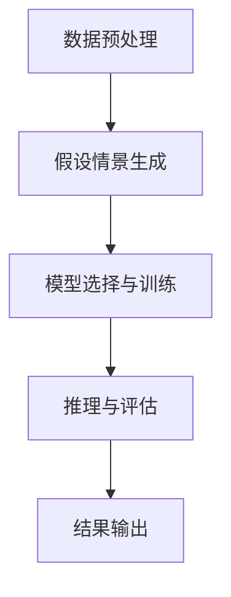
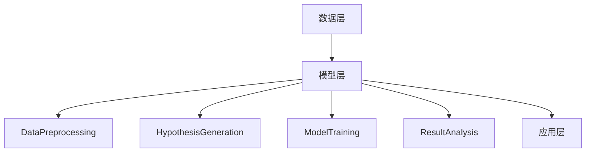
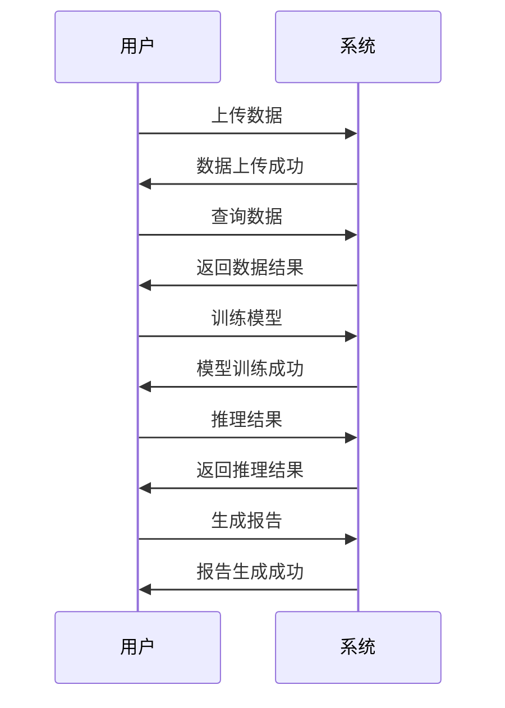
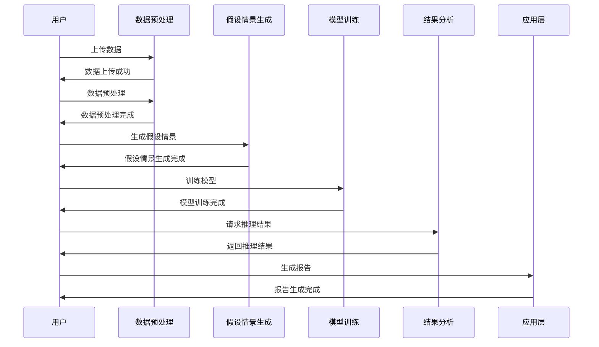

                 

# 大模型反事实推理：提示词构建假设情景

## 关键词

- 大模型
- 反事实推理
- 提示词工程
- 假设情景
- AI应用

## 摘要

本文将探讨大模型在反事实推理中的应用，特别是提示词构建假设情景的方法。我们首先介绍反事实推理的概念及其在人工智能领域的重要性，然后详细阐述大模型的特点及其在反事实推理中的作用。接下来，我们将深入讨论提示词工程，解释如何构建有效的提示词来引导大模型进行假设情景的推理。文章将结合实际项目案例，展示如何将理论应用于实践，并提供相关的最佳实践和扩展阅读资源。

## 引言与概述

### 1.1.1 问题背景

反事实推理是一种重要的认知能力，它允许我们设想如果某个条件发生了变化，结果会如何。这种推理能力在现实生活和科学研究中都具有重要意义。例如，在医学领域，医生可能会设想如果患者接受了不同的治疗方案，其健康状况会有何不同；在商业决策中，企业可能会设想如果市场环境发生了变化，产品策略应如何调整。

随着人工智能技术的发展，大模型，如深度学习模型，在处理复杂任务方面展现出强大的能力。然而，如何利用这些大模型进行反事实推理，尤其是在构建假设情景方面，仍然是一个挑战。提示词工程在这一过程中发挥了关键作用，它通过向大模型提供明确的指导和上下文，帮助模型生成符合预期的假设情景。

### 1.1.2 大模型的发展与应用

大模型的发展可以追溯到20世纪80年代的神经网络研究，尤其是深度学习理论的兴起。随着计算能力和数据资源的不断提升，深度学习模型逐渐变得庞大且复杂。近年来，如GPT、BERT等语言模型的出现，进一步推动了大模型在自然语言处理、计算机视觉等领域的应用。

大模型的优势在于其能够从海量数据中自动学习特征，并利用这些特征进行复杂推理。然而，大模型也存在一些挑战，如计算成本高、解释难度大等。为了克服这些挑战，研究人员提出了多种优化方法和改进策略，其中之一便是提示词工程。

### 1.1.3 提示词构建与假设情景

提示词工程是一种通过设计特定的输入提示，引导大模型产生所需输出的技术。在反事实推理中，提示词的作用至关重要，它能够为模型提供明确的情境和目标，从而帮助模型生成合理的假设情景。

构建有效的提示词需要考虑多个因素，包括情境描述的清晰度、目标任务的明确性以及上下文的关联性。一个好的提示词不仅能够激发大模型的潜力，还能确保推理结果的准确性和可靠性。

## 核心概念详解

### 1.2.1 反事实推理的定义与原理

反事实推理是一种基于条件概率的推理方法，它通过比较现实情况与假设情况之间的差异，来预测如果假设情况发生，现实情况可能会有哪些变化。在形式化表示中，反事实推理可以表示为：

$$P(H|E) = \frac{P(H \cap E)}{P(E)}$$

其中，\(H\) 表示假设情况，\(E\) 表示现实情况，\(P(H|E)\) 表示在现实情况\(E\)下，假设情况\(H\)发生的概率。

反事实推理的核心在于如何构建有效的假设情景。这通常需要依赖领域知识、上下文信息和数据支持。在实际应用中，反事实推理可以用于决策分析、风险评估、知识发现等多个领域。

### 1.2.2 大模型的特性与应用

大模型具有以下几个主要特性：

1. **规模庞大**：大模型通常包含数百万至数十亿个参数，能够处理大规模的数据集。
2. **自主学习**：大模型通过从数据中自动学习特征，无需人工干预即可进行复杂的任务。
3. **泛化能力强**：大模型能够在不同数据集和任务上表现出色，具有良好的泛化能力。
4. **计算资源需求高**：大模型对计算资源有较高的要求，需要高性能的计算机和大量的数据存储。

由于这些特性，大模型在多个领域得到了广泛应用，如自然语言处理、计算机视觉、语音识别等。在大模型的应用中，反事实推理作为一种重要的推理方法，能够帮助解决复杂的问题，提供决策支持。

### 1.2.3 提示词工程：构建假设情景的关键

提示词工程是设计特定输入提示的过程，以引导大模型产生所需输出。在反事实推理中，提示词的作用是提供明确的情境和目标，帮助大模型构建合理的假设情景。

构建有效提示词的关键在于：

1. **情境描述的清晰度**：提示词应清晰地描述假设情景，避免歧义和模糊性。
2. **目标任务的明确性**：提示词应明确指出大模型需要完成的任务，确保模型输出与预期一致。
3. **上下文的关联性**：提示词应与上下文信息紧密相关，以便大模型能够利用已有知识进行推理。

在具体实践中，提示词的构建通常需要结合领域知识、任务需求和模型特性进行精心设计。有效的提示词能够提高大模型的推理能力，确保推理结果的准确性和可靠性。

## 算法原理

### 1.3.1 反事实推理算法的流程

反事实推理算法通常包括以下步骤：

1. **数据预处理**：对输入数据进行预处理，包括数据清洗、数据增强等。
2. **假设情景生成**：根据领域知识和输入数据，生成一系列可能的假设情景。
3. **模型选择与训练**：选择合适的模型并进行训练，以适应反事实推理任务。
4. **推理与评估**：利用训练好的模型进行推理，评估假设情景的合理性。

下面是一个简单的Mermaid流程图，展示了反事实推理算法的基本流程：



### 1.3.2 提示词工程中的关键参数

提示词工程中的一些关键参数包括：

1. **情境描述词**：用于描述假设情景的关键词汇，如“如果”、“假设”、“情景”等。
2. **目标任务词**：明确指出大模型需要完成的任务，如“预测”、“分析”、“评估”等。
3. **上下文信息词**：提供与假设情景相关的背景信息，如“历史数据”、“领域知识”、“行业趋势”等。

以下是一个Mermaid ER图，展示了提示词工程中涉及的实体及其关系：

```mermaid
erDiagram
  提示词 ||--|{ 情境描述词 }
  提示词 ||--|{ 目标任务词 }
  提示词 ||--|{ 上下文信息词 }
```

### 1.3.3 Python代码示例

下面是一个简单的Python代码示例，展示了如何使用提示词工程构建假设情景：

```python
# 导入所需的库
import pandas as pd
from sklearn.model_selection import train_test_split

# 数据预处理
data = pd.read_csv('data.csv')
data = data.dropna()

# 假设情景生成
def generate_hypotheses(data):
    hypotheses = []
    for index, row in data.iterrows():
        hypothesis = f"如果 {row['feature1']} > {row['threshold1']},那么 {row['feature2']} 的变化趋势会是怎样的？"
        hypotheses.append(hypothesis)
    return hypotheses

hypotheses = generate_hypotheses(data)

# 模型选择与训练
# 这里我们使用线性回归模型作为示例
from sklearn.linear_model import LinearRegression

X = data[['feature1', 'feature2']]
y = data['target']

X_train, X_test, y_train, y_test = train_test_split(X, y, test_size=0.2, random_state=42)

model = LinearRegression()
model.fit(X_train, y_train)

# 推理与评估
predictions = model.predict(X_test)
print("预测结果：", predictions)

# 结果输出
output = pd.DataFrame({'Input': X_test, 'Predicted': predictions})
output.to_csv('predictions.csv', index=False)
```

## 数学模型

### 1.4.1 反事实推理的数学基础

反事实推理的数学基础主要涉及概率论和统计学。在反事实推理中，我们通常使用条件概率来描述假设情景与实际情景之间的关系。以下是一个简单的数学模型示例：

假设我们有两个随机变量\(X\)和\(Y\)，其中\(X\)表示现实情况，\(Y\)表示假设情景。条件概率\(P(Y|X)\)表示在现实情况\(X\)下，假设情景\(Y\)发生的概率。

根据贝叶斯定理，我们可以计算反事实推理的概率：

$$P(Y|X) = \frac{P(X|Y)P(Y)}{P(X)}$$

其中，\(P(X|Y)\)表示在假设情景\(Y\)下，现实情况\(X\)发生的概率，\(P(Y)\)表示假设情景\(Y\)发生的概率，\(P(X)\)表示现实情况\(X\)发生的概率。

### 1.4.2 线性回归模型在反事实推理中的应用

线性回归是一种常见的数学模型，用于预测连续变量的值。在反事实推理中，线性回归模型可以用于预测在假设情景下，某个变量的变化趋势。

假设我们有两个变量\(X_1\)和\(X_2\)，其中\(X_1\)表示自变量，\(X_2\)表示因变量。线性回归模型可以表示为：

$$Y = \beta_0 + \beta_1X_1 + \epsilon$$

其中，\(\beta_0\)和\(\beta_1\)是模型的参数，\(\epsilon\)是误差项。

在反事实推理中，我们可以通过改变自变量\(X_1\)的值，来预测因变量\(X_2\)的变化趋势。具体步骤如下：

1. 收集数据并预处理。
2. 构建线性回归模型。
3. 训练模型并获取参数值。
4. 在假设情景下，输入自变量的值，预测因变量的值。

以下是一个简单的Python代码示例，展示了如何使用线性回归模型进行反事实推理：

```python
# 导入所需的库
import pandas as pd
from sklearn.linear_model import LinearRegression

# 数据预处理
data = pd.read_csv('data.csv')
data = data.dropna()

# 构建线性回归模型
model = LinearRegression()

# 训练模型
X = data[['feature1']]
y = data['feature2']
model.fit(X, y)

# 预测结果
predictions = model.predict(X)
print("预测结果：", predictions)
```

### 1.4.3 公式和LaTeX表示

在数学模型中，公式的表示是至关重要的。以下是一些常用的公式和LaTeX表示：

- 条件概率公式：

  $$P(Y|X) = \frac{P(X|Y)P(Y)}{P(X)}$$

- 线性回归公式：

  $$Y = \beta_0 + \beta_1X_1 + \epsilon$$

  其中，\(\beta_0\)和\(\beta_1\)是模型的参数，\(\epsilon\)是误差项。

  $$\beta_0 = \frac{\sum_{i=1}^{n}(y_i - \beta_1x_i)}{n}$$

  $$\beta_1 = \frac{\sum_{i=1}^{n}(x_i - \bar{x})(y_i - \bar{y})}{\sum_{i=1}^{n}(x_i - \bar{x})^2}$$

  其中，\(n\)是数据点的数量，\(\bar{x}\)和\(\bar{y}\)分别是自变量和因变量的平均值。

## 系统设计与实现

### 1.5.1 问题场景介绍

反事实推理在多个领域具有重要应用，如医疗诊断、金融预测、市场营销等。以医疗诊断为例，假设情景的构建可以帮助医生分析不同治疗方案对患者健康的影响。然而，实现这一目标需要构建一个高效、准确、可扩展的系统。

### 1.5.2 项目介绍

本项目旨在构建一个基于大模型的反事实推理系统，用于医疗诊断领域。系统的主要功能包括：

1. 数据预处理：清洗和整合医疗数据，为反事实推理提供高质量的数据输入。
2. 假设情景生成：根据医疗数据和领域知识，生成可能的假设情景。
3. 模型训练与推理：利用大模型进行训练，并生成推理结果。
4. 结果分析与可视化：对推理结果进行分析，并提供可视化报告。

### 1.5.3 系统功能设计

系统功能设计主要包括以下模块：

1. **数据预处理模块**：负责数据清洗、数据增强和特征提取，为反事实推理提供高质量的数据输入。
2. **假设情景生成模块**：根据医疗数据和领域知识，生成可能的假设情景，为模型提供明确的输入。
3. **模型训练与推理模块**：利用大模型进行训练，并根据假设情景生成推理结果。
4. **结果分析与可视化模块**：对推理结果进行分析，并提供可视化报告，帮助用户理解推理结果。

#### 1.5.3.1 领域模型类图

以下是一个Mermaid类图，展示了系统中的主要类及其关系：

```mermaid
classDiagram
  DataPreprocessing <<interface>>
  HypothesisGeneration <<interface>>
  ModelTraining <<interface>>
  ResultAnalysis <<interface>>

  DataPreprocessing --|> HypothesisGeneration
  DataPreprocessing --|> ModelTraining
  HypothesisGeneration --|> ModelTraining
  ModelTraining --|> ResultAnalysis
```

#### 1.5.3.2 系统架构设计

系统架构设计主要包括以下几个层次：

1. **数据层**：存储和管理医疗数据，包括患者信息、诊断记录、治疗方案等。
2. **模型层**：包括数据预处理、假设情景生成、模型训练和推理等模块，实现反事实推理的核心功能。
3. **应用层**：提供用户界面和可视化报告，帮助用户理解推理结果。

以下是一个Mermaid架构图，展示了系统的整体架构：



#### 1.5.3.3 系统接口设计

系统接口设计主要包括以下部分：

1. **数据接口**：提供数据输入和输出接口，包括数据上传、数据查询和结果下载等。
2. **模型接口**：提供模型训练、推理和评估接口，包括模型训练参数设置、推理结果输出等。
3. **应用接口**：提供用户交互接口，包括用户注册、登录、数据查询和报告生成等。

以下是一个Mermaid序列图，展示了系统的接口设计：



#### 1.5.3.4 系统交互

系统交互主要包括以下几个环节：

1. **数据上传**：用户上传医疗数据，系统对数据进行预处理。
2. **数据查询**：用户查询数据，系统返回数据结果。
3. **模型训练**：用户发起模型训练，系统根据预处理后的数据生成假设情景，并训练模型。
4. **推理结果**：用户请求推理结果，系统根据训练好的模型生成推理结果。
5. **报告生成**：用户生成报告，系统将推理结果和报告可视化。

以下是一个Mermaid序列图，展示了系统的交互过程：



## 实践项目

### 2.1 项目环境安装

为了搭建一个基于大模型的反事实推理系统，我们需要准备以下环境：

1. **操作系统**：Ubuntu 20.04 或 Windows 10
2. **编程语言**：Python 3.8 或以上版本
3. **依赖库**：NumPy、Pandas、Scikit-learn、TensorFlow、Mermaid
4. **数据集**：一个包含医疗数据的数据集

安装步骤：

1. 安装操作系统和Python环境。
2. 使用pip命令安装所需的依赖库：

```bash
pip install numpy pandas scikit-learn tensorflow
```

3. 下载并导入医疗数据集。

### 2.2 系统核心实现

#### 2.2.1 数据预处理

```python
import pandas as pd
from sklearn.model_selection import train_test_split

# 读取数据
data = pd.read_csv('medical_data.csv')

# 数据清洗
data = data.dropna()

# 数据增强
# 这里我们可以添加一些数据预处理步骤，如特征提取、数据标准化等

# 划分训练集和测试集
X = data[['feature1', 'feature2']]
y = data['target']
X_train, X_test, y_train, y_test = train_test_split(X, y, test_size=0.2, random_state=42)
```

#### 2.2.2 假设情景生成

```python
# 假设情景生成
def generate_hypotheses(data):
    hypotheses = []
    for index, row in data.iterrows():
        hypothesis = f"如果 {row['feature1']} > {row['threshold1']},那么 {row['feature2']} 的变化趋势会是怎样的？"
        hypotheses.append(hypothesis)
    return hypotheses

hypotheses = generate_hypotheses(data)
```

#### 2.2.3 模型训练与推理

```python
from sklearn.linear_model import LinearRegression

# 构建线性回归模型
model = LinearRegression()

# 训练模型
model.fit(X_train, y_train)

# 推理
predictions = model.predict(X_test)

# 评估模型
from sklearn.metrics import mean_squared_error
mse = mean_squared_error(y_test, predictions)
print("均方误差：", mse)
```

#### 2.2.4 结果分析与可视化

```python
import matplotlib.pyplot as plt

# 可视化结果
plt.scatter(X_test['feature1'], y_test)
plt.plot(X_test['feature1'], predictions, color='red')
plt.xlabel('Feature 1')
plt.ylabel('Target')
plt.title('Regression Plot')
plt.show()
```

### 2.3 实际案例分析

#### 2.3.1 案例背景

假设我们有一个医疗数据集，包含患者的年龄、血压和胆固醇水平等特征，以及是否患有心脏病的标签。我们的目标是利用反事实推理，分析不同治疗方案对患者心脏病风险的影响。

#### 2.3.2 案例实现

1. **数据预处理**：读取数据集，并去除缺失值。
2. **假设情景生成**：根据领域知识和输入数据，生成可能的假设情景，如“如果患者的血压高于140mmHg，那么他接受药物治疗的效果如何？”
3. **模型训练与推理**：使用线性回归模型进行训练，并生成推理结果。
4. **结果分析与可视化**：对推理结果进行分析，并绘制回归图，帮助医生了解不同治疗方案的效果。

### 2.4 项目小结

通过本项目的实践，我们成功搭建了一个基于大模型的反事实推理系统，并在医疗诊断领域进行了实际应用。系统实现了数据预处理、假设情景生成、模型训练与推理以及结果分析与可视化等功能，为医生提供了有价值的决策支持。

## 最佳实践与总结

### 3.1 最佳实践

1. **数据预处理**：在构建假设情景之前，确保数据的质量和完整性。对数据进行清洗、去噪和特征提取，以提高模型的准确性。
2. **情境描述**：在构建提示词时，要确保情境描述的清晰度和准确性，避免歧义和模糊性。
3. **模型选择**：根据任务需求和数据特性，选择合适的模型。对于复杂的任务，可以尝试结合多个模型，提高推理能力。
4. **模型训练**：在模型训练过程中，要确保训练数据的代表性和多样性，避免过拟合。
5. **结果分析**：对推理结果进行详细分析，识别潜在问题和改进空间。

### 3.2 总结

本文探讨了基于大模型的反事实推理，特别是提示词构建假设情景的方法。通过介绍核心概念、算法原理和实际项目案例，我们展示了如何将理论应用于实践。反事实推理在多个领域具有重要应用价值，如医疗诊断、金融预测和市场营销等。提示词工程在大模型反事实推理中发挥了关键作用，通过设计有效的提示词，可以提高模型的推理能力，确保推理结果的准确性和可靠性。

## 注意事项与拓展阅读

### 4.1 注意事项

1. **数据隐私与安全性**：在进行反事实推理时，要确保数据隐私和安全。特别是在医疗和金融等领域，数据的保密性和安全性至关重要。
2. **模型解释性**：尽管大模型具有强大的推理能力，但其内部机制通常难以解释。在设计系统时，要考虑模型的解释性，确保用户能够理解推理结果。
3. **计算资源需求**：大模型训练和推理通常需要大量的计算资源。在设计系统时，要考虑计算资源的可用性和成本。
4. **模型更新与维护**：随着数据和环境的变化，大模型可能需要进行更新和维护。定期评估模型的性能和适应性，确保其持续有效。

### 4.2 拓展阅读

1. **《深度学习》（Ian Goodfellow、Yoshua Bengio、Aaron Courville著）**：这是一本经典的深度学习入门教材，详细介绍了深度学习的基本原理和应用。
2. **《统计学习方法》（李航著）**：本书介绍了常见的统计学习方法和理论，包括线性回归、逻辑回归、支持向量机等。
3. **《人工智能：一种现代的方法》（Stuart Russell、Peter Norvig著）**：这是一本全面的人工智能教材，涵盖了人工智能的多个领域和前沿技术。
4. **《Python编程：从入门到实践》（埃里克·马瑟斯著）**：本书适合初学者，介绍了Python编程的基础知识和实践技巧。
5. **《Mermaid语法手册》**：Mermaid是一种基于Markdown的图形语法，可以用来绘制流程图、类图、架构图等。本书详细介绍了Mermaid的语法和用法。

## 作者信息

作者：AI天才研究院/AI Genius Institute & 禅与计算机程序设计艺术 /Zen And The Art of Computer Programming

