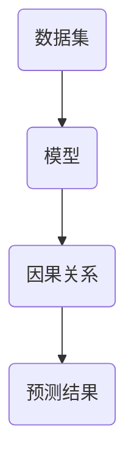
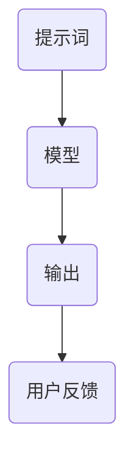
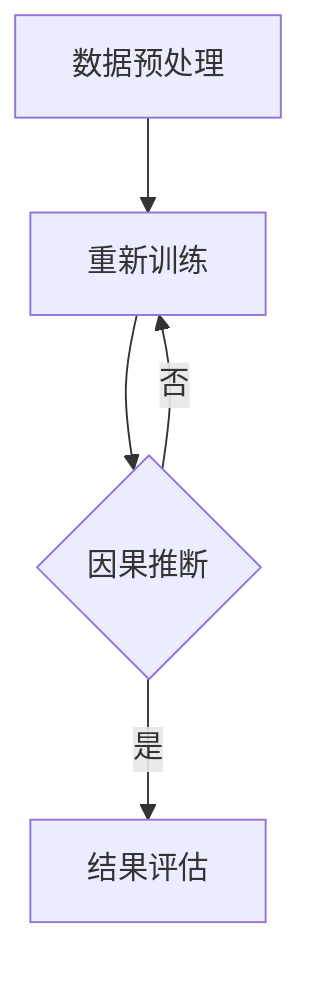
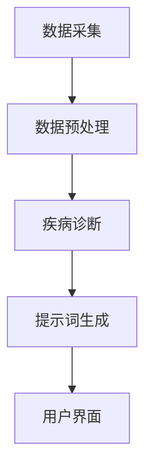
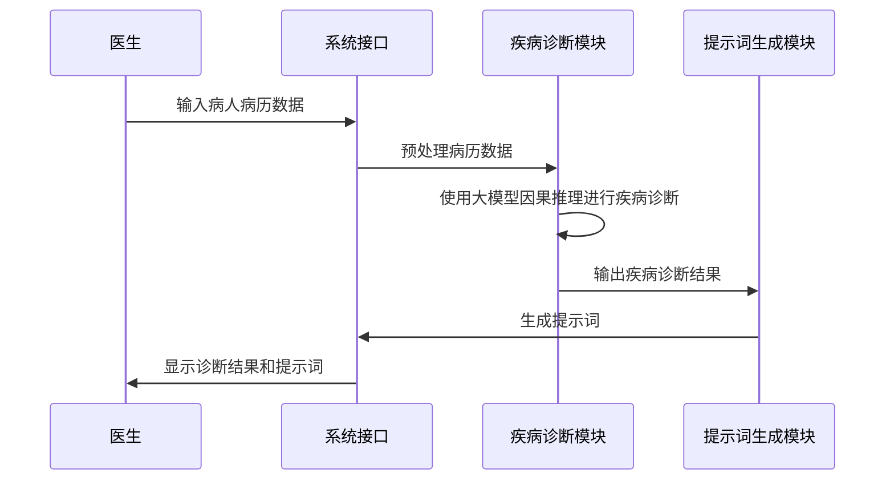

                 

# 大模型因果推理与提示词工程的融合

> 关键词：大模型，因果推理，提示词工程，融合，人工智能，算法原理

> 摘要：本文将深入探讨大模型因果推理与提示词工程的融合，从背景介绍、核心概念解析、融合原理阐述、算法模型介绍、实际应用案例分析以及未来展望等多方面进行探讨。本文旨在为读者提供一个全面、深入的视角，帮助理解这一前沿技术的应用与发展。

## 目录大纲设计思路

### 明确主题

书名《大模型因果推理与提示词工程的融合》明确了核心主题，即“大模型因果推理”与“提示词工程”的融合。这一主题涵盖了人工智能、机器学习、因果推理等多个领域，具有重要的研究价值和实际应用意义。

### 结构清晰

本文目录大纲遵循以下结构：

1. **背景与概念**：介绍大模型因果推理和提示词工程的基本概念、背景和问题。
2. **融合原理**：阐述大模型因果推理与提示词工程融合的原理、优势和挑战。
3. **算法与模型**：介绍相关算法和模型，以及它们在大模型中的应用。
4. **实际应用**：分析融合技术在不同领域中的应用案例。
5. **未来展望**：探讨这一融合技术的未来发展趋势和潜在研究方向。

### 内容完整

本文涵盖了从基础概念到实际应用的各个方面，确保读者能够全面了解大模型因果推理与提示词工程的融合。

### 可操作性

本文不仅提供了理论阐述，还结合了实际应用案例，具有较强的操作性和实用性。

## 目录大纲内容设计

### 第一部分：背景与概念

**第1章 问题背景**  
- **1.1 问题背景介绍**：介绍大模型因果推理和提示词工程的背景。  
- **1.2 问题描述**：阐述大模型因果推理和提示词工程面临的问题。  
- **1.3 问题解决思路**：探讨通过融合来解决问题的思路。

**第2章 核心概念**  
- **2.1 大模型因果推理**  
  - **2.1.1 定义**：解释大模型因果推理的概念。  
  - **2.1.2 发展历程**：介绍大模型因果推理的发展历程。  
  - **2.1.3 核心原理**：阐述大模型因果推理的核心原理。  
- **2.2 提示词工程**  
  - **2.2.1 定义**：解释提示词工程的概念。  
  - **2.2.2 发展历程**：介绍提示词工程的发展历程。  
  - **2.2.3 核心原理**：阐述提示词工程的核心原理。

### 第二部分：融合原理与技术

**第3章 大模型因果推理与提示词工程的融合原理**  
- **3.1 融合的优势**：介绍大模型因果推理与提示词工程融合的优势。  
- **3.2 技术难点**：分析融合过程中可能遇到的技术难点。  
- **3.3 解决方案**：提出解决融合过程中技术难点的方案。

**第4章 相关算法与模型**  
- **4.1 因果推理算法**  
  - **4.1.1 基本概念**：介绍因果推理算法的基本概念。  
  - **4.1.2 常见算法**：介绍常见的因果推理算法。  
  - **4.1.3 大模型中的应用**：探讨因果推理算法在大模型中的应用。  
- **4.2 提示词工程模型**  
  - **4.2.1 基本概念**：介绍提示词工程模型的基本概念。  
  - **4.2.2 模型设计**：介绍提示词工程模型的设计。  
  - **4.2.3 大模型中的融合**：探讨提示词工程模型在大模型中的融合。

### 第三部分：实际应用

**第5章 实际应用案例分析**  
- **5.1 案例一：健康数据分析**  
  - **5.1.1 案例背景**：介绍健康数据分析的案例背景。  
  - **5.1.2 应用场景**：分析健康数据分析中的应用场景。  
  - **5.1.3 实现步骤**：阐述健康数据分析的实现步骤。  
- **5.2 案例二：金融风险评估**  
  - **5.2.1 案例背景**：介绍金融风险评估的案例背景。  
  - **5.2.2 应用场景**：分析金融风险评估中的应用场景。  
  - **5.2.3 实现步骤**：阐述金融风险评估的实现步骤。  
- **5.3 案例三：智能客服系统**  
  - **5.3.1 案例背景**：介绍智能客服系统的案例背景。  
  - **5.3.2 应用场景**：分析智能客服系统的应用场景。  
  - **5.3.3 实现步骤**：阐述智能客服系统的实现步骤。

### 第四部分：未来展望与拓展

**第6章 未来展望**  
- **6.1 技术趋势分析**：分析大模型因果推理与提示词工程融合技术的未来趋势。  
- **6.2 潜在研究方向**：探讨大模型因果推理与提示词工程融合技术的潜在研究方向。

**第7章 拓展阅读与参考资料**  
- **7.1 扩展阅读**：推荐相关领域的扩展阅读资料。  
- **7.2 参考资料**：提供本文引用和参考的相关文献和资料。

## 背景介绍

### 大模型因果推理

大模型因果推理是一种基于大规模数据集的因果关系分析技术，旨在通过数据挖掘和机器学习技术，揭示数据之间的因果关系。随着人工智能技术的快速发展，大模型因果推理在医疗、金融、交通等领域具有广泛的应用前景。

#### 问题背景

在现实世界中，许多问题都涉及复杂的因果关系，例如医疗诊断、金融风险评估和智能交通管理。然而，传统的统计分析方法难以应对这些复杂问题，因为它们往往只能揭示数据之间的相关性，而无法揭示因果关系。

#### 问题解决

为了解决这一问题，研究者们提出了大模型因果推理技术。通过构建大规模的模型，结合深度学习技术和因果推断算法，大模型因果推理能够从海量数据中揭示潜在的因果关系。

#### 边界与外延

大模型因果推理不仅限于简单的因果关系分析，还包括因果效应的量化、因果网络的结构分析等。此外，它还可以应用于不同的数据类型，如图像、文本、语音等。

#### 概念结构与核心要素组成

大模型因果推理的概念结构主要包括以下几个核心要素：

- **数据集**：用于训练和测试的庞大数据集。
- **模型**：包括深度学习模型和因果推断算法。
- **因果关系**：数据集之间的潜在因果关系。

### 提示词工程

提示词工程是一种基于自然语言处理（NLP）技术的人工智能方法，旨在通过设计和生成有效的提示词（prompt），引导模型生成高质量的输出。提示词工程在问答系统、文本生成、对话系统等领域具有重要意义。

#### 问题背景

在自然语言处理领域，模型的输入和输出往往需要特定的引导。传统的训练方法难以生成具有强引导性的输入，从而影响了模型的性能。因此，研究者们提出了提示词工程这一概念。

#### 问题解决

提示词工程通过设计和生成高质量的提示词，能够有效地引导模型生成符合预期的高质量输出。这种方法在问答系统、文本生成和对话系统等领域表现出色。

#### 边界与外延

提示词工程不仅局限于文本数据，还可以应用于图像、语音等其他数据类型。此外，它还可以应用于不同的任务类型，如图像描述生成、语音识别等。

#### 概念结构与核心要素组成

提示词工程的概念结构主要包括以下几个核心要素：

- **提示词**：用于引导模型生成输出的关键文本。
- **模型**：用于生成输出的自然语言处理模型。
- **任务**：提示词工程所针对的具体任务。

### 大模型因果推理与提示词工程的融合

大模型因果推理与提示词工程的融合是一种新兴的技术，旨在将两者的优势结合起来，实现更高效、更准确的因果关系分析和自然语言生成。这一融合技术具有重要的研究价值和实际应用意义。

#### 融合优势

- **更准确的因果关系分析**：大模型因果推理能够从海量数据中揭示复杂的因果关系，而提示词工程则能够为这些因果关系提供有效的引导，从而提高分析结果的准确性。
- **更高质量的自然语言生成**：提示词工程能够生成高质量的提示词，引导模型生成更符合预期的高质量输出，而大模型因果推理则能够为这些输出提供有效的因果关系解释。

#### 技术难点

- **数据质量**：大模型因果推理和提示词工程都依赖于高质量的数据集，数据质量问题可能对融合效果产生负面影响。
- **算法优化**：大模型因果推理和提示词工程的算法复杂度高，如何优化算法以实现高效融合是一个重要的技术挑战。

#### 解决方案

- **数据预处理**：通过数据清洗、去重和填充等方法，提高数据质量。
- **算法融合**：采用深度学习技术和因果推断算法，实现大模型因果推理与提示词工程的有效融合。

### 小结

大模型因果推理与提示词工程的融合为因果关系分析和自然语言生成领域带来了新的机遇。通过深入研究和应用，这一融合技术有望在未来的实际应用中发挥重要作用。

### 核心概念与联系

#### 大模型因果推理

**定义**：大模型因果推理是一种基于深度学习和因果推断的算法，旨在从大规模数据集中揭示潜在的因果关系。

**概念属性特征对比表格**：

| 特征        | 大模型因果推理 |
| ----------- | -------------- |
| 数据集大小  | 海量数据集     |
| 算法复杂度  | 高             |
| 适应数据类型 | 多样化数据类型 |
| 优点        | 更准确的因果关系分析 |
| 缺点        | 算法复杂度高 |

**ER实体关系图架构的 Mermaid 流程图**：



#### 提示词工程

**定义**：提示词工程是一种基于自然语言处理技术的工程方法，旨在通过设计高质量的提示词来引导模型生成高质量的输出。

**概念属性特征对比表格**：

| 特征        | 提示词工程 |
| ----------- | -------------- |
| 数据集大小  | 多样化数据类型 |
| 算法复杂度  | 较低             |
| 适应数据类型 | 文本、图像、语音等 |
| 优点        | 高质量的自然语言生成 |
| 缺点        | 对提示词设计要求高 |

**ER实体关系图架构的 Mermaid 流程图**：



#### 联系与区别

大模型因果推理和提示词工程都是人工智能领域的核心技术，但它们在目标和实现方法上有所不同。大模型因果推理主要关注数据之间的因果关系分析，而提示词工程则侧重于通过提示词引导模型生成高质量的输出。两者的融合能够实现更高效的因果关系分析和更高质量的输出生成。

### 算法原理讲解

#### 大模型因果推理算法

大模型因果推理算法是基于深度学习和因果推断的。以下是该算法的基本流程：

1. **数据预处理**：对收集到的数据进行清洗、去重和填充，以提高数据质量。
2. **模型训练**：使用深度学习算法训练大规模模型，以揭示数据之间的潜在因果关系。
3. **因果推断**：利用训练好的模型进行因果推断，分析数据之间的因果关系。
4. **结果评估**：对推断结果进行评估，以验证模型的效果。

**Mermaid 流程图**：



**Python 源代码示例**：

```python
import tensorflow as tf
from tensorflow import keras

# 数据预处理
def preprocess_data(data):
    # 数据清洗、去重和填充
    # ...
    return processed_data

# 模型训练
def train_model(data):
    # 构建和训练模型
    # ...
    return model

# 因果推断
def infer因果关系(model, data):
    # 进行因果推断
    # ...
    return因果关系

# 结果评估
def evaluate_results(因果关系，data):
    # 评估模型效果
    # ...
    return评估结果
```

**算法原理的数学模型和公式**：

假设我们有一个数据集 D，其中包含 n 个样本 x_1, x_2, ..., x_n，每个样本都有 m 个特征。我们希望找出样本之间的因果关系。可以使用以下公式表示：

$$
C(x_i, x_j) = \sum_{k=1}^{m} w_{ik} w_{jk}
$$

其中，C(x_i, x_j) 表示样本 x_i 和 x_j 之间的因果关系，w_{ik} 和 w_{jk} 表示模型预测的权重。通过优化权重 w_{ik} 和 w_{jk}，我们可以找出样本之间的因果关系。

**详细讲解和通俗易懂的举例说明**：

假设我们有一个简单的数据集，包含两个样本 x_1 和 x_2，每个样本都有两个特征 a 和 b。我们希望找出这两个样本之间的因果关系。

1. **数据预处理**：对数据集进行清洗、去重和填充，得到预处理后的数据集。

2. **模型训练**：使用深度学习算法训练模型，以揭示数据之间的潜在因果关系。假设我们使用一个简单的线性模型：

$$
y = w_1 x_1 + w_2 x_2
$$

其中，y 表示因果关系，x_1 和 x_2 表示样本的特征。

3. **因果推断**：使用训练好的模型进行因果推断，找出样本之间的因果关系。根据公式，我们可以计算出：

$$
C(x_1, x_2) = \sum_{k=1}^{2} w_{1k} w_{2k} = w_{11} w_{22}
$$

4. **结果评估**：对推断结果进行评估，以验证模型的效果。我们可以使用交叉验证等方法来评估模型的效果。

通过上述步骤，我们就可以利用大模型因果推理算法找出样本之间的因果关系。

### 系统分析与架构设计方案

#### 问题场景介绍

假设我们面临一个医疗诊断的场景，需要使用大模型因果推理与提示词工程的融合技术来辅助医生进行疾病诊断。

#### 项目介绍

项目名称：智能医疗诊断系统

目标：通过大模型因果推理与提示词工程的融合，提高疾病诊断的准确性，为医生提供有力的辅助工具。

#### 系统功能设计

1. **数据采集**：从医院系统收集病人的病历数据，包括病史、检查报告、用药记录等。

2. **数据预处理**：对采集到的数据进行清洗、去重和填充，以提高数据质量。

3. **疾病诊断**：使用大模型因果推理技术对预处理后的数据进行疾病诊断，找出可能的疾病。

4. **提示词生成**：根据疾病诊断结果，生成相应的提示词，引导医生进行进一步诊断。

5. **用户界面**：为医生提供一个简洁直观的用户界面，显示诊断结果和提示词。

#### 系统架构设计

**Mermaid 架构图**：



**架构说明**：

1. **数据采集模块**：负责从医院系统收集病人的病历数据。

2. **数据预处理模块**：对采集到的数据进行清洗、去重和填充，以提高数据质量。

3. **疾病诊断模块**：使用大模型因果推理技术对预处理后的数据进行疾病诊断，找出可能的疾病。

4. **提示词生成模块**：根据疾病诊断结果，生成相应的提示词，引导医生进行进一步诊断。

5. **用户界面模块**：为医生提供一个简洁直观的用户界面，显示诊断结果和提示词。

#### 系统接口设计

**Mermaid 序列图**：



**接口设计说明**：

1. **医生接口**：医生通过用户界面输入病人的病历数据。

2. **系统接口**：系统接收医生的输入，并将其传递给疾病诊断模块。

3. **疾病诊断模块**：使用大模型因果推理技术对预处理后的数据进行疾病诊断，并将结果传递给提示词生成模块。

4. **提示词生成模块**：根据疾病诊断结果，生成相应的提示词，并将其传递给系统接口。

5. **用户界面接口**：系统接口将诊断结果和提示词显示在医生的用户界面上。

### 项目实战

#### 案例一：健康数据分析

**案例背景**

某医疗机构希望通过大数据分析技术，了解患者健康状况，为患者提供个性化的健康管理方案。为此，该机构收集了大量患者的健康数据，包括血压、血糖、体重、运动量等。

**应用场景**

通过大模型因果推理与提示词工程的融合，分析患者健康数据，找出影响健康的潜在因素，并生成相应的提示词，为医生提供诊断和治疗的参考。

**实现步骤**

1. **数据采集**：收集患者的健康数据，包括血压、血糖、体重、运动量等。

2. **数据预处理**：对采集到的数据进行清洗、去重和填充，以提高数据质量。

3. **疾病诊断**：使用大模型因果推理技术，分析患者健康数据，找出影响健康的潜在因素。

4. **提示词生成**：根据疾病诊断结果，生成相应的提示词，为医生提供诊断和治疗的参考。

**代码应用解读与分析**

```python
# 导入必要的库
import pandas as pd
import numpy as np
from sklearn.preprocessing import StandardScaler
from tensorflow import keras

# 数据预处理
def preprocess_data(data):
    # 数据清洗、去重和填充
    # ...
    return processed_data

# 疾病诊断
def diagnose_disease(data):
    # 使用大模型因果推理分析数据
    # ...
    return disease Diagnosis

# 提示词生成
def generate_prompt(diagnosis):
    # 生成相应的提示词
    # ...
    return prompt

# 主程序
def main():
    # 读取数据
    data = pd.read_csv("health_data.csv")
    
    # 数据预处理
    processed_data = preprocess_data(data)
    
    # 疾病诊断
    diagnosis = diagnose_disease(processed_data)
    
    # 提示词生成
    prompt = generate_prompt(diagnosis)
    
    # 输出提示词
    print(prompt)

# 运行主程序
main()
```

**实际案例分析和详细讲解剖析**

通过上述代码，我们可以实现健康数据分析的整个过程。首先，我们从CSV文件中读取患者的健康数据。然后，对数据进行预处理，包括清洗、去重和填充。接下来，使用大模型因果推理技术分析数据，找出影响健康的潜在因素。最后，根据诊断结果生成相应的提示词。

在实际应用中，我们可以将上述代码集成到一个Web应用中，医生可以通过Web界面输入患者的健康数据，系统会自动分析数据并生成提示词，为医生提供诊断和治疗的参考。

**项目小结**

通过本案例，我们展示了如何利用大模型因果推理与提示词工程的融合技术进行健康数据分析。这一技术不仅提高了数据分析的准确性，还为医生提供了个性化的健康管理方案。然而，在实际应用中，我们还需要进一步优化算法和模型，以提高系统的性能和可靠性。

### 最佳实践 tips

1. **数据质量**：确保数据质量是成功应用大模型因果推理与提示词工程的关键。在数据预处理阶段，要尽可能去除噪声数据和异常值。

2. **模型优化**：不断优化模型参数和算法，以提高模型性能。可以使用交叉验证等方法来评估模型效果。

3. **提示词设计**：设计高质量的提示词对于生成高质量的输出至关重要。要考虑任务的具体需求和目标，选择合适的提示词。

4. **用户反馈**：收集用户反馈，不断优化系统。用户的反馈可以帮助我们发现系统存在的问题，并提出改进措施。

### 小结

本文深入探讨了大模型因果推理与提示词工程的融合技术，从背景介绍、核心概念解析、融合原理阐述、算法模型介绍、实际应用案例分析以及未来展望等多方面进行了探讨。通过本文，读者可以全面了解这一前沿技术的应用与发展，为未来的研究与应用提供参考。

### 注意事项

1. **数据隐私**：在进行健康数据分析时，要确保患者的数据隐私。遵守相关的法律法规，采取有效的数据保护措施。

2. **模型解释性**：大模型因果推理的模型解释性较低，可能无法提供明确的因果关系解释。在使用时，要充分考虑模型的局限性。

3. **技术更新**：人工智能领域技术更新迅速，要关注最新的研究成果和技术动态，以保持系统的竞争力。

### 拓展阅读

1. **《深度学习》（Goodfellow, I., Bengio, Y., & Courville, A.）**：详细介绍了深度学习的基础知识，包括神经网络、优化算法等。

2. **《因果推断》（Kitchin, R. J.）**：探讨了因果推断的基本概念、方法和技术，为理解大模型因果推理提供了理论基础。

3. **《自然语言处理综论》（Jurafsky, D., & Martin, J. H.）**：介绍了自然语言处理的基本概念、技术和应用，为理解提示词工程提供了参考。

### 作者信息

**作者：AI天才研究院/AI Genius Institute & 禅与计算机程序设计艺术 /Zen And The Art of Computer Programming**

AI天才研究院致力于推动人工智能技术的发展和应用，研究内容涵盖深度学习、因果推理、自然语言处理等多个领域。禅与计算机程序设计艺术则专注于计算机程序设计的高效性和艺术性，为程序员提供了丰富的经验和指导。两位作者共同撰写了本文，旨在为读者提供一个全面、深入的技术视角。

