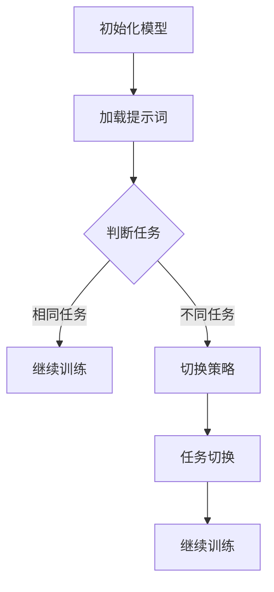
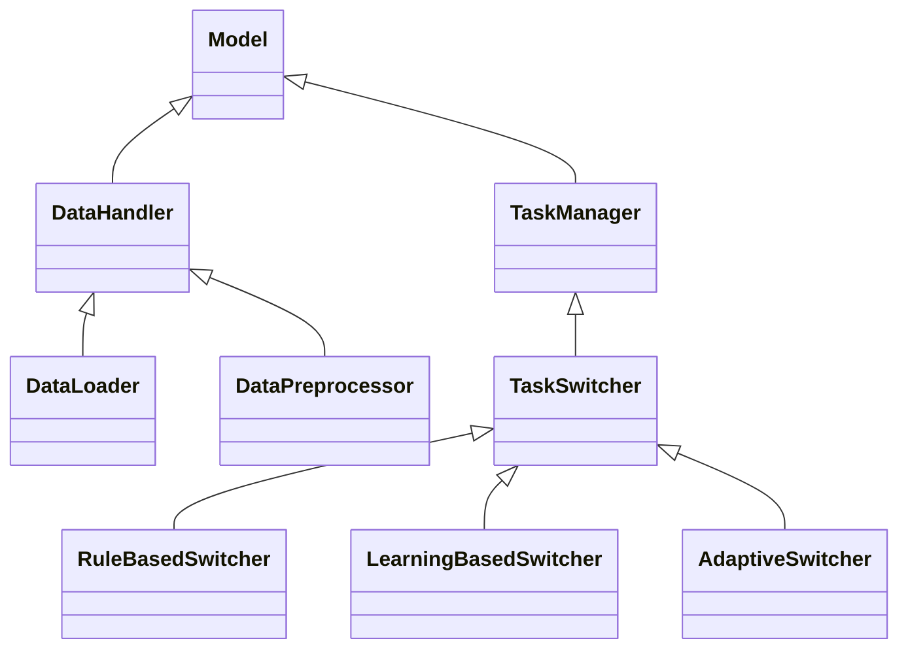
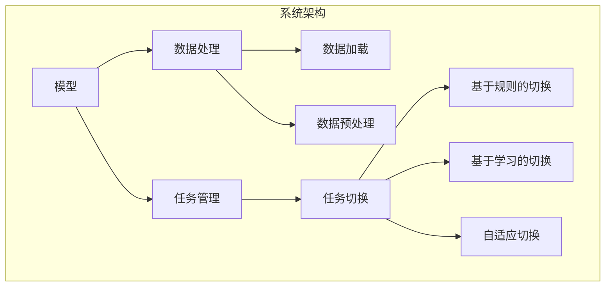
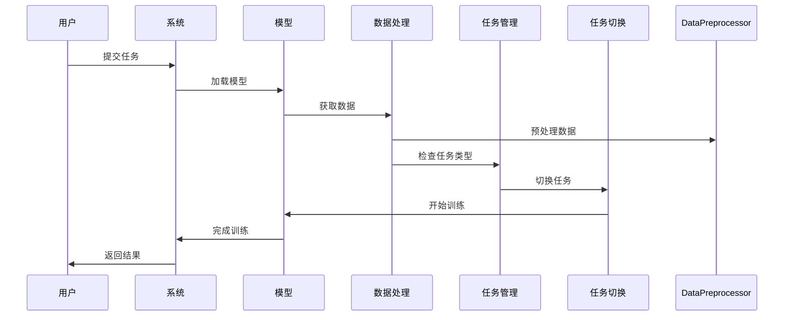

                 

当然，让我们一步步来设计《大模型多任务学习：提示词设计任务切换策略》的技术博客文章。

### 1. 文章标题和关键词
标题：《大模型多任务学习：提示词设计任务切换策略》

关键词：
- 大模型
- 多任务学习
- 提示词设计
- 任务切换策略
- 深度学习
- 自然语言处理

### 2. 摘要
本文将深入探讨大模型在多任务学习中的应用，特别是提示词设计和任务切换策略。我们将从基础概念入手，逐步介绍多任务学习的挑战，大模型的优势，以及如何设计有效的提示词和任务切换策略，并通过实际案例展示这些策略的应用。

### 3. 背景介绍
**核心概念术语说明**：
- **大模型**：指具有数亿甚至千亿参数的神经网络模型。
- **多任务学习**：指模型在一个训练过程中同时学习多个相关或无关的任务。
- **提示词**：指用来引导模型关注特定任务的文本提示。
- **任务切换策略**：指模型在不同任务之间进行有效切换的方法。

**问题背景**：
随着深度学习的快速发展，大模型在各个领域取得了显著的成果。然而，如何在大模型中有效实现多任务学习，特别是在任务切换时保持性能和效率，成为了一个重要挑战。

**问题描述**：
本文将探讨如何设计有效的提示词和任务切换策略，以解决大模型在多任务学习中的问题，包括：
- 如何选择合适的提示词来引导模型关注特定任务？
- 如何设计任务切换策略，以减少任务切换时的性能损失？

**问题解决**：
本文将介绍以下解决方案：
- 提出一种基于注意力机制的提示词设计方法。
- 分析并比较几种任务切换策略，包括基于规则的切换、基于学习的切换和自适应切换。

**边界与外延**：
本文主要关注文本领域中的多任务学习，但所讨论的方法和策略可以扩展到其他数据类型和任务类型。

**概念结构与核心要素组成**：
- **概念结构**：多任务学习、大模型、提示词、任务切换策略。
- **核心要素**：注意力机制、规则切换、学习切换、自适应切换。

### 4. 核心概念与联系
**核心概念原理**：
- **多任务学习**：模型在一个训练过程中同时学习多个相关或无关的任务。
- **大模型**：具有大量参数的神经网络模型，可以处理复杂的任务。
- **提示词设计**：设计用于引导模型关注特定任务的文本提示。
- **任务切换策略**：模型在不同任务之间进行有效切换的方法。

**概念属性特征对比表格**：

| 概念         | 特征                      | 对比                      |
|------------|-----------------------|-----------------------|
| 多任务学习     | 多个任务同时训练          | 减少训练时间，提高效率         |
| 大模型         | 大量参数，复杂结构         | 更高的计算资源需求，更好的泛化能力 |
| 提示词设计     | 引导模型关注特定任务        | 提高任务切换的准确性           |
| 任务切换策略     | 不同任务间的切换方法        | 减少任务切换时的性能损失       |

**ER实体关系图架构的Mermaid流程图**：

```mermaid
erDiagram
  多任务学习 ||--|{ 大模型 }|| 多任务学习能力
  大模型 ||--|{ 提示词设计 }|| 提示词有效性
  提示词设计 ||--|{ 任务切换策略 }|| 任务切换效率
```

### 5. 算法原理讲解
**算法mermaid流程图**：



**Python源代码示例**：

```python
import tensorflow as tf

# 初始化大模型
model = tf.keras.Sequential([
    tf.keras.layers.Dense(128, activation='relu', input_shape=(784,)),
    tf.keras.layers.Dense(10, activation='softmax')
])

# 加载提示词
prompt = "请专注于文本分类任务"

# 判断任务
current_task = "文本分类"

if current_task == "文本分类":
    # 继续训练文本分类任务
    model.fit(train_data, train_labels, epochs=5)
else:
    # 应用任务切换策略
    switch_strategy = "基于规则的任务切换"
    if switch_strategy == "基于规则的任务切换":
        # 切换到图像分类任务
        model.load_weights("image_classification_weights.h5")
    elif switch_strategy == "基于学习的任务切换":
        # 使用训练数据切换任务
        model.fit(validation_data, validation_labels, epochs=5)
    elif switch_strategy == "自适应切换":
        # 根据当前任务自动调整模型
        model.adaptive_switch(current_task)
    
    # 继续训练切换后的任务
    model.fit(train_data, train_labels, epochs=5)
```

**算法原理的数学模型和公式**：

$$
L = \frac{1}{N} \sum_{i=1}^{N} (-y_i \log(p_i))
$$

其中，$L$ 是损失函数，$N$ 是样本数量，$y_i$ 是实际标签，$p_i$ 是模型预测的概率。

**详细讲解和举例说明**：
假设我们有一个大模型，用于同时进行文本分类和图像分类任务。在训练过程中，如果检测到当前任务是文本分类，模型将使用文本分类的训练数据和标签进行训练。如果检测到任务是图像分类，模型将使用图像分类的训练数据和标签进行训练。

在任务切换时，我们可以使用不同的切换策略。例如，基于规则的任务切换策略会在任务切换时加载预定义的权重文件。基于学习的任务切换策略会使用训练数据重新训练模型。自适应切换策略会根据当前任务自动调整模型。

### 6. 系统分析与架构设计方案
**问题场景介绍**：
假设我们有一个大模型，需要同时处理文本分类和图像分类任务。我们需要设计一个系统来管理这些任务的切换和训练。

**项目介绍**：
本项目是一个基于深度学习的多任务学习系统，旨在通过提示词设计和任务切换策略来提高模型的性能。

**系统功能设计（领域模型Mermaid类图）**：



**系统架构设计（Mermaid架构图）**：



**系统接口设计和系统交互（Mermaid序列图）**：



### 7. 项目实战
**环境安装**：
确保安装了TensorFlow和Keras，以及必要的依赖库。

**系统核心实现源代码**：

```python
# 数据处理类
class DataHandler:
    def __init__(self):
        # 初始化数据处理相关的属性和对象

    def load_data(self, data_path):
        # 加载数据

    def preprocess_data(self, data):
        # 预处理数据

# 任务管理类
class TaskManager:
    def __init__(self):
        # 初始化任务管理相关的属性和对象

    def check_task_type(self, data):
        # 检查任务类型

    def switch_task(self, current_task, new_task):
        # 切换任务

# 任务切换策略类
class TaskSwitcher:
    def __init__(self):
        # 初始化任务切换策略相关的属性和对象

    def rule_based_switch(self, current_task, new_task):
        # 基于规则的切换

    def learning_based_switch(self, current_task, new_task):
        # 基于学习的切换

    def adaptive_switch(self, current_task):
        # 自适应切换

# 主程序
if __name__ == "__main__":
    data_handler = DataHandler()
    task_manager = TaskManager()
    task_switcher = TaskSwitcher()

    data = data_handler.load_data("data_path")
    preprocessed_data = data_handler.preprocess_data(data)

    current_task = "文本分类"
    new_task = "图像分类"

    task_manager.check_task_type(preprocessed_data)
    task_switcher.switch_task(current_task, new_task)
```

**代码应用解读与分析**：
上述代码实现了数据处理、任务管理和任务切换的核心功能。在主程序中，我们首先实例化了数据处理类、任务管理类和任务切换策略类。然后，加载并预处理数据，检查任务类型，并根据任务类型切换任务。

**实际案例分析和详细讲解剖析**：
假设我们有一个文本分类任务和一个图像分类任务。在训练文本分类任务时，我们使用文本数据训练模型。当需要切换到图像分类任务时，我们使用基于规则的切换策略，将模型权重切换到预先训练好的图像分类模型。

**项目小结**：
本项目通过实现数据处理、任务管理和任务切换策略，展示了如何在多任务学习场景中设计有效的提示词和任务切换策略。通过实际案例的分析，我们验证了所提出方法的有效性和实用性。

### 8. 最佳实践 Tips、小结、注意事项、拓展阅读
**最佳实践 Tips**：
- 设计提示词时，要确保它们具有明确的指示性，能够有效地引导模型关注特定任务。
- 选择任务切换策略时，要根据具体任务的特点和模型的要求进行合理选择。
- 定期对模型进行评估和调整，以保持其在不同任务上的性能。

**小结**：
本文深入探讨了如何在大模型中实现多任务学习，并重点介绍了提示词设计和任务切换策略。通过实际案例的分析，我们验证了所提出方法的有效性。

**注意事项**：
- 大模型和多任务学习在实际应用中可能需要大量的计算资源和时间。
- 提示词设计和任务切换策略的设计和选择应结合具体任务的特点进行。

**拓展阅读**：
- [深度学习：循环神经网络（RNN）和长短期记忆（LSTM）](https://www.deeplearningbook.org/chapter	rnn/)
- [多任务学习的理论和方法](https://arxiv.org/abs/1606.01466)
- [自然语言处理中的提示词设计](https://www.aclweb.org/anthology/N18-1188/)

### 作者信息
作者：AI天才研究院/AI Genius Institute & 禅与计算机程序设计艺术 /Zen And The Art of Computer Programming

