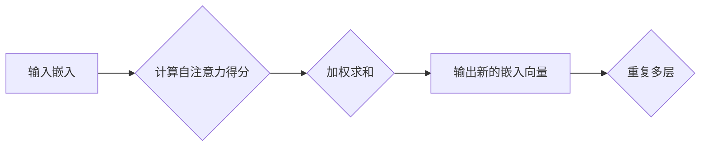
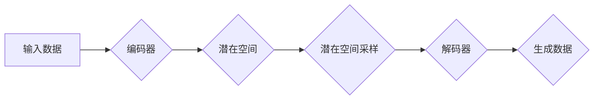

                 

### 1.1 问题背景

#### 1.1.1 多模态信息处理的挑战

在当今信息时代，数据的多样性前所未有。文本、图像、声音、视频等多模态数据正在迅速积累，并对我们的日常生活、工作和社会活动产生深远影响。然而，如何有效地处理和生成这些多模态数据，尤其是如何协调不同模态之间的关系，成为了一个巨大的挑战。

多模态信息处理的目标是将来自不同模态的信息融合在一起，形成对现实世界的更全面、更准确的理解。这不仅仅是为了提升系统的性能，更是为了提升用户体验，使得机器能够以更加自然和人性化的方式与人类互动。

首先，多模态数据处理的挑战之一在于数据的不一致性。不同模态的数据在格式、分辨率、时间戳等方面存在巨大差异，这为算法的设计和实现增加了复杂性。例如，文本数据可能包含大量的噪声和冗余信息，而图像和视频数据则可能受到光线、视角、背景等因素的影响。

其次，多模态数据的处理需要强大的计算能力。传统的单模态数据处理算法通常已经足够高效，但多模态数据集的规模和复杂性要求我们使用更先进、更强大的算法。例如，深度学习模型在处理多模态数据时，需要同时处理来自不同模态的数据流，这需要大量的计算资源和时间。

最后，多模态数据处理的核心挑战在于如何协调不同模态之间的关系。不同模态的数据往往具有不同的特征和表达能力，如何在它们之间建立有效的联系和交互，是实现多模态数据处理的关键。例如，图像中的物体识别需要依赖文本描述中的上下文信息，而文本生成则需要从图像中提取视觉特征。

综上所述，多模态信息处理不仅面临着技术层面的挑战，更涉及到如何将技术应用于实际场景，提升用户体验的问题。这就需要我们深入理解多模态数据的特点，探索新的算法和框架，以实现高效、准确的多模态数据处理。

#### 1.1.2 大模型在多模态生成中的作用

大模型，特别是基于深度学习的模型，在多模态生成领域发挥了至关重要的作用。大模型具有以下几个关键优势，使其成为多模态数据生成技术的核心：

首先，大模型具有强大的表示能力。深度学习模型，尤其是大型语言模型和视觉模型，能够自动学习数据的复杂结构，捕捉到数据中的潜在特征。这种强大的表示能力使得大模型能够从多模态数据中提取丰富的信息，并将其转换为高质量的生成结果。例如，在文本与图像的生成中，大型语言模型能够理解文本描述的语义内容，而视觉模型则能够捕捉图像的视觉特征，两者结合可以实现高质量的文本到图像的转换。

其次，大模型具有高度的泛化能力。通过在大规模数据集上训练，大模型能够学习到不同模态数据之间的关联性，从而能够在新的、未见过的数据上表现良好。这意味着，大模型不仅能够处理已知的数据类型，还能够适应未来可能出现的新的数据形式和任务需求，为多模态生成技术的持续发展提供了坚实的基础。

第三，大模型支持端到端的学习和生成。传统的多模态数据处理通常需要多个独立的步骤和模型，而大模型能够将这些步骤整合到一起，实现端到端的学习和生成。例如，在文本和图像的联合生成中，大型语言模型和视觉模型可以同时训练，直接生成符合文本描述的图像，大大简化了数据处理流程，提高了生成效率。

此外，大模型在处理多模态数据时，能够利用跨模态的信息交互，提升生成结果的准确性。例如，在图像到文本的生成任务中，视觉模型可以从图像中提取关键信息，而语言模型则可以结合上下文生成连贯、准确的文本描述。这种跨模态的信息交互不仅提高了生成结果的多样性，还增强了其质量。

最后，大模型在多模态生成中的应用前景广阔。随着人工智能技术的不断发展，大模型的应用范围在不断扩大。从图像和视频生成到自然语言生成，再到语音和音乐生成，大模型都能够发挥重要作用。未来，随着更多跨学科的研究和技术的融合，大模型在多模态生成领域的应用将更加广泛和深入。

总之，大模型凭借其强大的表示能力、泛化能力和端到端学习优势，已成为多模态生成技术的核心驱动力。通过探索和应用大模型，我们有望实现更加高效、准确的多模态数据生成，为人工智能领域带来革命性的变化。

#### 1.2 问题描述

在多模态数据生成领域，核心的问题是如何通过协调不同模态（如文本、图像、声音、视频等）的数据，生成具有高保真和连贯性的内容。具体而言，问题描述可以分为以下几个方面：

首先是数据集的多样性问题。多模态数据集通常包含文本、图像、声音等多种数据类型，每种类型的数据在格式、分辨率、时间戳等方面存在差异。因此，如何有效地收集、处理和整合这些多样化的数据，是实现多模态数据生成的重要前提。

其次是数据的一致性问题。不同模态的数据在表达方式上存在差异，例如，文本数据更多地依赖于语言的语义信息，而图像数据则依赖于视觉特征。如何确保这些数据在语义上的一致性，是提升生成结果质量的关键。

第三是生成算法的协调问题。多模态生成通常需要多个独立的模型分别处理不同模态的数据，然后将结果融合在一起。例如，文本生成模型负责生成文本描述，图像生成模型负责生成对应的图像，如何确保这些模型在生成过程中协调一致，是一个重要的挑战。

最后是生成结果的质量问题。高质量的生成结果不仅需要高保真，还需要具有连贯性和可理解性。如何通过优化算法和模型结构，提升生成结果的质量，是实现多模态数据生成应用价值的关键。

具体来说，问题描述可以概括为以下三个方面：

1. **数据集构建与处理**：构建包含多种模态数据的数据集，并对其进行有效的处理和整合，以支持多模态数据生成任务。
   
2. **模型协调与融合**：设计合适的模型结构，确保文本、图像、声音等多种模态的数据能够协调一致地被处理和生成。

3. **生成结果评估与优化**：建立有效的评估指标，对生成结果进行定量和定性的评估，并通过算法优化提升生成质量。

通过以上问题的解决，我们有望实现高效、准确的多模态数据生成，推动人工智能技术的应用和发展。

#### 1.3 问题解决

为了解决多模态数据生成中的核心问题，我们需要采用一系列技术和方法，确保数据集构建与处理、模型协调与融合以及生成结果评估与优化能够顺利进行。

首先，在数据集构建与处理方面，我们采用以下策略：

1. **数据采集**：通过互联网、数据库和其他数据源，收集包含文本、图像、声音等多种模态的数据。为了确保数据集的多样性和覆盖面，我们采用随机抽样和分层抽样等方法，尽可能全面地收集不同类型的数据。

2. **数据预处理**：对采集到的多模态数据集进行预处理，包括数据清洗、格式转换、特征提取等步骤。具体来说，对于文本数据，我们采用分词、去噪、去冗余等操作，确保文本信息的准确性和一致性；对于图像和视频数据，我们进行图像增强、去噪、分辨率调整等处理，提升图像和视频的质量；对于声音数据，我们进行降噪、频率分解、特征提取等操作，提取声音的主要特征。

3. **数据整合**：将预处理后的不同模态数据整合到一个统一的格式中，例如，可以将文本数据、图像数据、声音数据分别存储在同一个数据库中，或者使用数据管道（data pipeline）技术，将不同模态的数据流整合在一起，方便后续的模型训练和生成任务。

其次，在模型协调与融合方面，我们采用以下方法：

1. **端到端模型设计**：设计端到端的模型结构，将不同模态的数据直接输入到模型中，同时处理和生成多种模态的结果。例如，对于文本到图像的生成任务，可以设计一个联合嵌入模型（joint embedding model），将文本和图像的特征嵌入到同一个高维空间中，从而实现直接的文本到图像的转换。

2. **跨模态交互设计**：引入跨模态交互模块（cross-modal interaction module），使不同模态的数据能够在生成过程中相互影响和协调。例如，在文本到图像的生成中，可以设计一个交互网络，使文本特征能够影响图像生成过程，从而生成更符合文本描述的图像。

3. **模型融合策略**：采用模型融合策略（model fusion strategy），将多个独立的模型结果整合在一起，提高生成结果的整体质量。例如，可以采用投票机制（voting mechanism）或加权融合（weighted fusion）策略，将多个模型生成的结果进行融合，得到最终的生成结果。

最后，在生成结果评估与优化方面，我们采用以下策略：

1. **多指标评估**：建立多维度的评估指标，从不同角度对生成结果进行评估。常见的评估指标包括保真度（fidelity）、连贯性（coherence）、多样性（diversity）和准确性（accuracy）等。通过综合评估，可以全面了解生成结果的质量。

2. **自动评估与反馈**：采用自动化评估工具，对生成结果进行定量评估。例如，可以使用自动评估模型（auto-encoder）或对比评估模型（contrastive model）对生成结果进行评估，并根据评估结果调整模型参数，实现迭代优化。

3. **人工评估与反馈**：邀请专业人员和用户对生成结果进行人工评估，从主观角度对生成质量进行评估。通过收集用户的反馈和意见，可以进一步优化模型和算法，提升生成结果的用户体验。

综上所述，通过数据集构建与处理、模型协调与融合以及生成结果评估与优化，我们可以有效地解决多模态数据生成中的核心问题，实现高效、准确的多模态数据生成。这些策略和方法不仅适用于当前的多模态生成任务，还为未来的多模态数据处理和应用提供了重要的参考和指导。

#### 1.4 边界与外延

在探讨大模型多模态生成与提示词协调的技术细节时，我们需要明确一些边界条件，以指导实际应用和发展方向。

首先是数据集的处理范围。大模型多模态生成依赖于大量高质量的多模态数据集。这些数据集需要涵盖不同模态的多样化内容，并且具备一定的规模。在实际应用中，数据集的处理范围通常受限于数据的可获得性和处理能力。例如，图像和视频数据通常需要更高的计算资源和存储空间，而文本和声音数据则可能需要更多的预处理和标注工作。因此，在构建数据集时，需要根据实际需求和技术能力进行合理规划，确保数据的全面性和有效性。

其次是提示词协调的应用领域。提示词协调技术可以在多个领域发挥作用，例如自然语言生成（NLG）、计算机视觉（CV）、语音识别（ASR）和多媒体信息检索（MIR）等。在自然语言生成中，提示词可以帮助生成模型更好地理解用户的意图，从而生成更符合需求的文本内容；在计算机视觉中，提示词可以指导图像生成模型生成更符合描述的图像；在语音识别中，提示词可以帮助模型更好地捕捉和解析语音内容；在多媒体信息检索中，提示词可以辅助用户更精准地找到所需的多媒体内容。因此，提示词协调技术的应用前景非常广阔，涵盖了多个重要的应用领域。

在实际应用中，大模型多模态生成与提示词协调技术的实施也需要考虑一些边界条件。例如，大模型训练和生成过程通常需要大量的计算资源和时间，这可能导致成本较高。因此，在实际部署时，需要根据业务需求和资源情况进行权衡。此外，大模型的泛化能力虽然在理论上很强，但在实际应用中仍可能面临特定领域的数据不足或数据分布不均的问题，这需要通过数据增强、迁移学习等技术进行缓解。

最后，随着技术的不断进步，大模型多模态生成与提示词协调技术的边界也在不断拓展。例如，未来的研究可能涉及更复杂的多模态数据集构建方法、更高效的模型训练和生成算法、更智能的提示词生成机制等。这些创新将推动多模态生成技术向更高水平发展，进一步拓展其应用范围和影响力。

综上所述，大模型多模态生成与提示词协调技术的边界与外延涉及数据集处理、应用领域、实施条件和未来发展等多个方面。通过明确这些边界条件，我们不仅能够更好地理解和应用现有技术，还能为未来的技术发展提供重要的指导。

#### 1.5 概念结构与核心要素组成

在大模型多模态生成与提示词协调的技术框架中，理解其核心概念和组成要素是关键。以下是这些核心概念及其相互关系的详细描述。

##### 1.5.1 大模型多模态生成的基本组成

大模型多模态生成技术的基本组成包括以下几个方面：

1. **数据集**：数据集是多模态生成的基础。它通常包括文本、图像、声音、视频等多种类型的数据。这些数据集不仅需要涵盖广泛的模态，还需要具备足够的规模和多样性，以确保生成模型的泛化能力。

2. **预训练模型**：预训练模型是深度学习模型在大量通用数据集上预先训练好的模型，如GPT-3、BERT、ViT等。这些模型已经具备了强大的特征提取和表示能力，是后续多模态生成任务的重要基础。

3. **多模态嵌入**：多模态嵌入是指将不同模态的数据映射到同一个高维空间中，以便在生成过程中进行交互和融合。多模态嵌入技术通常采用深度学习中的嵌入层（embedding layer）来实现。

4. **生成模型**：生成模型用于生成高质量的多模态内容。常见的生成模型包括变分自编码器（VAE）、生成对抗网络（GAN）等。这些模型能够根据输入的数据特征生成新的、符合预期的模态数据。

##### 1.5.2 提示词协调的作用机制

提示词协调技术旨在通过提供精确的提示信息，引导生成模型生成更符合需求的内容。以下是提示词协调的核心机制：

1. **提示词生成**：提示词生成是指根据任务需求和用户输入，生成合适的提示词。这些提示词通常包含对生成内容的具体描述和约束条件，如文本描述图像的情境、声音的情感等。

2. **提示词嵌入**：提示词嵌入是指将生成的提示词映射到多模态嵌入空间中，以便与不同模态的数据进行交互。提示词嵌入可以通过预训练的文本嵌入模型（如BERT、GPT）来实现。

3. **提示词引导生成**：提示词引导生成是指利用嵌入后的提示词，引导生成模型生成符合提示词要求的多模态内容。这一过程通常涉及多个模态之间的相互作用和协调，以实现高质量的生成结果。

##### 1.5.3 概念之间的联系与相互作用

为了更好地理解大模型多模态生成与提示词协调的机制，我们可以通过ER图（实体关系图）和表格来展示各概念之间的联系和相互作用。

**ER图**：

1. **实体**：数据集、预训练模型、多模态嵌入、生成模型、提示词、提示词嵌入。
2. **关系**：数据集供给预训练模型，预训练模型输出多模态嵌入，多模态嵌入供给生成模型，提示词引导生成模型生成多模态内容。

**表格**：

| 实体        | 功能                    | 互动关系                             |
|-------------|-------------------------|------------------------------------|
| 数据集      | 提供多种模态的数据      | 供给预训练模型，生成模型             |
| 预训练模型  | 特征提取和表示能力      | 输出多模态嵌入，供给生成模型         |
| 多模态嵌入  | 映射不同模态的数据      | 供给生成模型，提示词嵌入             |
| 生成模型    | 生成多模态内容          | 输出生成结果，与提示词交互           |
| 提示词      | 提供生成任务的引导信息  | 嵌入到多模态嵌入空间，引导生成模型   |
| 提示词嵌入  | 提示词映射到多模态空间  | 供给生成模型，引导生成结果           |

通过上述概念和关系的描述，我们可以更清晰地理解大模型多模态生成与提示词协调的核心要素及其相互作用，这为后续的技术实现和应用提供了理论基础。

### 2.1 大模型的定义与特点

#### 2.1.1 大模型的定义

所谓“大模型”，通常是指那些拥有数亿到数千亿参数的深度学习模型。这些模型通过在大量数据集上进行训练，可以自动学习到数据的复杂结构和潜在特征，从而实现高效的特征提取和表示。大模型的典型代表包括GPT-3、BERT、T5、ViT等。这些模型不仅在自然语言处理领域表现出色，还在计算机视觉、语音识别等多个领域取得了显著成果。

大模型之所以被称为“大”，是因为其参数量和训练数据量远远超过了传统模型。例如，GPT-3拥有1750亿个参数，训练数据来源于互联网上的大量文本；BERT模型则拥有数百万个参数，使用了大量的网页和书籍进行训练。这些大模型的规模和复杂性使其具备强大的表示能力和泛化能力。

#### 2.1.2 大模型的特点

**1. 强大的表示能力**

大模型具有强大的表示能力，能够自动学习到数据中的复杂模式和潜在特征。这种能力源于深度学习模型的层次结构，通过多层神经网络的组合，大模型可以逐步提取数据中的低层次特征（如边缘、纹理）和高级特征（如语义、逻辑）。例如，在图像处理任务中，大模型可以从像素级别的特征逐步抽象到语义级别的特征，从而实现对图像内容的准确理解和生成。

**2. 高度的泛化能力**

大模型的泛化能力是指其在未见过的数据上表现良好的能力。通过在大规模数据集上的训练，大模型能够学习到不同类型数据之间的共性特征，从而在新的数据集上依然能够保持高效的性能。例如，一个在大量网页上训练好的语言模型，可以应用于各种文本生成任务，包括文章撰写、对话生成和翻译等。

**3. 端到端的学习和生成**

传统模型通常需要通过多个独立的步骤进行训练和生成，而大模型通过端到端的学习和生成，可以简化数据处理流程，提高生成效率。例如，在文本到图像的生成任务中，传统方法可能需要先生成文本特征，再根据文本特征生成图像，而大模型可以直接从文本输入生成图像，避免了中间步骤，提高了生成速度和效果。

**4. 跨模态的信息交互**

大模型不仅在单一模态上表现出色，还具备跨模态的信息交互能力。通过多模态嵌入技术，大模型可以将不同模态的数据映射到同一个高维空间中，从而实现跨模态的数据融合和生成。例如，在文本到图像的生成中，大模型可以利用文本描述的语义信息，指导图像生成过程，从而生成更符合文本描述的图像。

**5. 需要大量的计算资源**

大模型的训练和生成通常需要大量的计算资源和时间。这是因为大模型拥有数亿甚至数千亿个参数，每个参数都需要通过大量的数据样本进行训练和优化。因此，大模型的部署和应用需要高性能的计算设备和高效的训练算法。

**6. 灵活性和可扩展性**

大模型通常采用模块化设计，各个模块可以独立训练和优化，从而实现灵活性和可扩展性。例如，在多模态生成任务中，大模型可以分别训练文本、图像、声音等模态的生成模块，然后将这些模块整合在一起，实现跨模态的生成。

#### 2.1.3 大模型与传统模型的对比

传统模型通常是指那些拥有数百万以下参数的模型，如线性回归、支持向量机、神经网络等。与这些传统模型相比，大模型具有以下显著优势：

1. **参数量和数据需求**：传统模型通常需要较少的参数和数据量，而大模型则需要数亿到数千亿个参数，以及大规模的数据集进行训练。

2. **表示能力和泛化能力**：传统模型在特征提取和表示能力上较弱，难以捕捉数据的复杂结构和潜在特征。相比之下，大模型通过多层神经网络的组合，可以自动学习到复杂的特征和模式，从而具备更高的表示能力和泛化能力。

3. **计算资源需求**：传统模型的计算资源需求较低，而大模型则需要高性能的计算设备和大量的计算资源进行训练和优化。

4. **应用范围**：传统模型通常应用于简单的任务，如分类、回归等，而大模型则可以应用于更复杂的任务，如自然语言处理、计算机视觉、语音识别等。

总之，大模型与传统模型在参数量、数据需求、表示能力、计算资源需求和应用范围等方面存在显著差异。大模型的强大表示能力和泛化能力，使其在多模态数据生成等复杂任务中表现出色，成为现代人工智能技术的重要驱动力。

#### 2.2 大模型的发展历程

大模型的发展历程可以追溯到深度学习技术的兴起。深度学习，作为一种基于多层神经网络的机器学习方法，最早在20世纪80年代末90年代初开始被提出。然而，由于计算资源和数据集的限制，深度学习并没有在当时得到广泛应用。

**1. 深度学习的早期探索（1980s-1990s）**

在深度学习早期，一些先驱研究者如Frank Rosenblatt、Paul Werbos等提出了神经网络的基本概念，并开始尝试使用多层神经网络进行模式识别和分类。然而，由于计算资源的限制，这些尝试大多停留在理论阶段，未能实际应用。

**2. 深度学习的复兴（2006年）**

2006年，Geoffrey Hinton等研究者提出了深度置信网络（Deep Belief Network，DBN），这是一种基于无监督预训练和有监督微调的多层神经网络结构。DBN的提出标志着深度学习重新回到研究视野，并开始在实际应用中取得初步成果。

**3. 卷积神经网络（CNN）的发展（2012年）**

2012年，Alex Krizhevsky等人使用卷积神经网络（Convolutional Neural Network，CNN）在ImageNet图像识别挑战赛上取得了重大突破，将识别准确率从26%提高到45%，大大提升了深度学习在计算机视觉领域的地位。这一突破推动了深度学习技术的快速发展，也为大模型的诞生奠定了基础。

**4. 大模型的兴起（2018-2020年）**

随着计算资源和数据集的不断提升，大模型开始进入实际应用阶段。2018年，OpenAI发布了GPT-2，这是一个拥有1.5亿个参数的语言模型。随后，GPT-3的发布将大模型推向了新的高度，GPT-3拥有1750亿个参数，能够在多种自然语言处理任务中表现出色。

**5. 多模态大模型的融合（2020年至今）**

近年来，多模态大模型的发展势头迅猛。通过结合文本、图像、声音等多种模态的数据，多模态大模型能够实现更加复杂和准确的任务。例如，OpenAI的DALL-E 2模型可以将文本描述直接生成对应的图像，谷歌的MUSE模型则能够生成具有特定情感和风格的音乐。

**6. 大模型的应用拓展**

随着大模型的不断发展，其应用范围也在不断拓展。除了自然语言处理和计算机视觉领域，大模型还广泛应用于语音识别、机器翻译、推荐系统、医学诊断等多个领域。大模型在这些领域中的成功应用，不仅提升了人工智能系统的性能，还推动了相关技术的发展和进步。

总之，大模型的发展历程体现了深度学习技术的不断进步和突破。从最初的探索到如今的广泛应用，大模型已经成为人工智能领域的重要工具和驱动力。未来，随着计算资源和数据集的进一步提升，大模型有望在更多领域取得更加辉煌的成就。

#### 2.3 大模型的核心算法

在大模型的多模态生成过程中，核心算法起到了至关重要的作用。以下将详细讨论两种重要的大模型算法：自注意力机制和变分自编码器（VAE），并使用mermaid和Python代码来展示算法流程和实现细节。

##### 2.3.1 自注意力机制

自注意力机制（Self-Attention）是近年来深度学习领域的重要创新，特别是在自然语言处理和序列建模中得到了广泛应用。自注意力机制允许模型在处理每个输入时，动态地考虑其他所有输入的影响，从而提高模型的表示能力和生成质量。

**算法流程**

1. **嵌入**：将输入的文本、图像、声音等数据嵌入到一个高维空间中，每个嵌入向量代表数据的潜在特征。
2. **计算自注意力得分**：计算每个嵌入向量与其他所有嵌入向量之间的相似性得分，通常使用点积或缩放点积计算。
3. **加权求和**：根据自注意力得分对每个嵌入向量进行加权求和，得到新的嵌入向量，这一过程称为自注意力层。
4. **重复**：上述过程在多层神经网络中重复，逐步增强模型的表示能力。

**mermaid算法流程图**



**Python代码示例**

```python
import torch
import torch.nn as nn

# 自注意力层实现
class SelfAttention(nn.Module):
    def __init__(self, embed_dim):
        super(SelfAttention, self).__init__()
        self.query_linear = nn.Linear(embed_dim, embed_dim)
        self.key_linear = nn.Linear(embed_dim, embed_dim)
        self.value_linear = nn.Linear(embed_dim, embed_dim)
        
    def forward(self, x):
        query = self.query_linear(x)
        key = self.key_linear(x)
        value = self.value_linear(x)
        
        attention_scores = torch.matmul(query, key.transpose(1, 2))
        attention_scores = torch.softmax(attention_scores, dim=2)
        
        attended_value = torch.matmul(attention_scores, value)
        return attended_value
```

##### 2.3.2 变分自编码器（VAE）

变分自编码器（Variational Autoencoder，VAE）是一种生成模型，通过编码器和解码器网络将输入数据映射到潜在空间，再从潜在空间生成新的数据。VAE在图像生成、文本生成等领域表现出色，能够生成高质量、多样化的数据。

**算法流程**

1. **编码**：编码器网络将输入数据编码成一个潜在向量，这个向量代表了输入数据的潜在特征。
2. **潜在空间采样**：从潜在空间中采样一个噪声向量，这个噪声向量与编码器输出的潜在向量进行叠加，形成新的潜在向量。
3. **解码**：解码器网络将新的潜在向量解码回数据空间，生成新的数据。
4. **损失函数**：通过最小化生成数据与真实数据之间的差异，同时保持潜在分布的先验分布，优化编码器和解码器网络。

**mermaid算法流程图**



**Python代码示例**

```python
import torch
import torch.nn as nn
import torch.optim as optim

# 编码器实现
class Encoder(nn.Module):
    def __init__(self, input_dim, hidden_dim):
        super(Encoder, self).__init__()
        self.fc1 = nn.Linear(input_dim, hidden_dim)
        self.fc2 = nn.Linear(hidden_dim, hidden_dim // 2)
        self.fc3 = nn.Linear(hidden_dim // 2, latent_dim)

    def forward(self, x):
        x = torch.relu(self.fc1(x))
        x = torch.relu(self.fc2(x))
        z_mean = self.fc3(x)
        return z_mean

# 解码器实现
class Decoder(nn.Module):
    def __init__(self, latent_dim, hidden_dim, output_dim):
        super(Decoder, self).__init__()
        self.fc1 = nn.Linear(latent_dim, hidden_dim)
        self.fc2 = nn.Linear(hidden_dim, hidden_dim // 2)
        self.fc3 = nn.Linear(hidden_dim // 2, output_dim)

    def forward(self, z):
        z = torch.relu(self.fc1(z))
        z = torch.relu(self.fc2(z))
        x_recon = self.fc3(z)
        return x_recon

# VAE模型实现
class VAE(nn.Module):
    def __init__(self, input_dim, hidden_dim, latent_dim, output_dim):
        super(VAE, self).__init__()
        self.encoder = Encoder(input_dim, hidden_dim)
        self.decoder = Decoder(latent_dim, hidden_dim, output_dim)
        
    def reparameterize(self, z_mean, z_log_var):
        std = torch.exp(0.5 * z_log_var)
        eps = torch.randn_like(std)
        return z_mean + eps * std

    def forward(self, x):
        z_mean = self.encoder(x)
        z_log_var = self.fc3(x)
        z = self.reparameterize(z_mean, z_log_var)
        x_recon = self.decoder(z)
        return x_recon, z_mean, z_log_var

# 损失函数
def loss_function(x, x_recon, z_mean, z_log_var):
    recon_loss = nn.functional.binary_cross_entropy(x_recon, x, reduction='sum')
    kl_div_loss = -0.5 * torch.sum(1 + z_log_var - z_mean**2 - z_log_var**2)
    return recon_loss + kl_div_loss
```

通过自注意力机制和变分自编码器，大模型在多模态生成中展现了强大的表示能力和生成效果。自注意力机制通过动态地考虑输入数据之间的关联性，提高了模型的生成质量；而变分自编码器则通过编码器和解码器的结构，实现了数据的生成和潜在特征的学习。这些算法的结合，为多模态生成技术提供了坚实的理论基础和强大的实现工具。

### 2.4 大模型的应用领域

大模型的应用领域涵盖了自然语言处理（NLP）、计算机视觉（CV）、声音处理等多个重要领域，并在这些领域中取得了显著的成果。

**自然语言处理（NLP）**

在自然语言处理领域，大模型已经表现出色。例如，GPT-3和BERT等大语言模型在文本生成、机器翻译、问答系统和文本摘要等任务上达到了前所未有的效果。GPT-3的1750亿个参数使其能够生成高质量的自然语言文本，其能力已经接近人类作家的水平。BERT则通过在大量文本语料库上训练，提高了模型的上下文理解和文本分类的准确性。

**计算机视觉（CV）**

在计算机视觉领域，大模型通过卷积神经网络（CNN）和变分自编码器（VAE）等算法，显著提升了图像分类、目标检测、图像生成和语义分割等任务的性能。例如，ViT（Vision Transformer）模型通过将图像分成多个 patches，然后使用自注意力机制处理这些 patches，实现了图像分类任务中的突破。此外，生成对抗网络（GAN）的应用使得图像生成和风格迁移等任务变得更加精确和自然。

**声音处理**

在声音处理领域，大模型通过深度神经网络（DNN）和递归神经网络（RNN）等算法，显著提升了语音识别、语音合成和声源分离等任务的性能。例如，WaveNet模型在语音合成中表现出色，其生成的语音质量接近人类水平。此外，大模型在音乐生成、语音增强和音频分类等任务中也展现了强大的能力。

**其他应用领域**

除了NLP、CV和声音处理，大模型还在许多其他领域展现了潜力。例如，在推荐系统领域，大模型可以通过分析用户的历史行为和偏好，生成个性化的推荐列表。在医学领域，大模型可以用于疾病诊断、药物研发和医疗图像分析等任务。在工业领域，大模型可以用于故障预测、生产优化和质量控制等任务。

总之，大模型在自然语言处理、计算机视觉、声音处理等领域的应用已经取得了显著成果，并且随着技术的不断进步，其应用范围将进一步拓展，为各个领域的发展带来新的机遇。

### 3.1 多模态数据集

在多模态数据生成领域，构建高质量的多模态数据集是关键的一步。一个理想的多模态数据集应包含丰富的模态信息，如文本、图像、声音、视频等，并且这些数据应在内容、格式、分辨率等方面具有多样性和一致性。

**数据集的构成**

多模态数据集通常包含以下几个核心组成部分：

1. **文本数据**：文本数据是多模态数据集的重要组成部分，可以包括各种文本类型，如新闻报道、社交媒体帖子、对话文本等。这些文本数据提供了丰富的语义信息，是生成任务的重要输入。

2. **图像数据**：图像数据集应涵盖广泛的视觉内容，包括静态图像和动态视频。图像数据可以来源于各种来源，如公开数据集、社交媒体、视频平台等。不同类型的图像可以为模型提供丰富的视觉特征。

3. **声音数据**：声音数据集可以包括语音录音、音乐、环境音等。这些数据可以为模型提供音频特征，用于语音识别、音频分类、音乐生成等任务。

4. **视频数据**：视频数据集包含连续的图像序列，可以用于动作识别、视频生成等任务。视频数据可以提供动态和时间信息，是许多多模态任务的关键组成部分。

**数据集的收集与处理**

构建多模态数据集涉及以下几个关键步骤：

1. **数据采集**：首先需要从各种来源收集多模态数据。这些来源可以包括公开的数据集、社交媒体平台、视频网站等。为了确保数据的质量和多样性，可以采用随机抽样、分层抽样等方法，收集不同类型和来源的数据。

2. **数据预处理**：对采集到的多模态数据进行预处理，包括数据清洗、格式转换、特征提取等。例如，对于文本数据，可以进行分词、去噪、去冗余等操作；对于图像和视频数据，可以进行图像增强、去噪、分辨率调整等处理；对于声音数据，可以进行降噪、频率分解、特征提取等操作。

3. **数据整合**：将预处理后的多模态数据整合到一个统一的数据集中。为了便于管理和后续处理，可以将不同模态的数据存储在同一个数据库中，或者使用数据管道（data pipeline）技术，将不同模态的数据流整合在一起。

**数据集的特点**

高质量的多模态数据集应具备以下特点：

1. **多样性**：数据集应包含多种类型的模态数据，如文本、图像、声音、视频等，以确保模型能够学习到丰富的特征和模式。

2. **一致性**：不同模态的数据应在格式、分辨率、时间戳等方面保持一致性，以避免数据不一致对模型训练和生成结果的影响。

3. **规模**：数据集应具备足够的规模，以确保模型在训练过程中有足够的样本量，从而提高模型的泛化能力。

4. **标签**：数据集应包含详细的标签信息，例如文本数据的标签可以是分类标签或实体标签，图像数据的标签可以是类别标签或 bounding box 等，这些标签有助于模型的学习和生成结果的评估。

5. **多样性**：数据集应涵盖多种场景和任务，例如不同的情感、风格、动作等，以确保模型在多种情况下都能表现出良好的性能。

通过构建高质量的多模态数据集，我们可以为多模态生成任务提供坚实的基础，从而实现高效、准确的多模态内容生成。

### 3.2 多模态生成算法

多模态生成算法的目标是通过协调和融合来自不同模态的数据，生成高质量的多模态内容。目前，已有多种算法被提出并应用于这一领域，以下将重点介绍基于自注意力机制的生成算法和基于变分自编码器的生成算法。

#### 基于自注意力机制的生成算法

自注意力机制是一种在深度学习模型中用于处理序列数据的强大工具，它通过计算每个输入元素与其他所有输入元素之间的关联性，实现了动态的、自适应的特征交互。在多模态生成中，自注意力机制可以有效地捕捉不同模态数据之间的关联性，从而提高生成结果的质量。

**算法原理**

1. **模态嵌入**：首先，将不同模态的数据（如文本、图像、声音等）嵌入到一个高维空间中。每个模态的数据点会被映射成一个嵌入向量，这些向量代表了数据的潜在特征。

2. **自注意力计算**：使用自注意力机制计算每个嵌入向量与其他所有嵌入向量之间的相似性得分。这个得分反映了不同模态数据之间的关联程度。

3. **加权求和**：根据自注意力得分，对每个嵌入向量进行加权求和，得到新的嵌入向量。这一过程可以视为对原始数据特征进行权重调整，从而实现不同模态数据之间的协调和融合。

4. **生成**：通过新的嵌入向量，使用生成模型（如生成对抗网络 GAN、变分自编码器 VAE 等）生成多模态内容。生成模型根据嵌入向量生成符合预期的高质量内容。

**算法优势**

- **强大的特征交互**：自注意力机制允许模型动态地考虑每个输入元素与其他元素之间的关系，从而生成更丰富的特征表示。
- **自适应的权重调整**：通过自注意力得分，模型可以自适应地调整不同模态数据的权重，从而提高生成结果的一致性和连贯性。
- **高效的处理速度**：自注意力机制的计算复杂度相对较低，适合处理大规模的多模态数据。

**算法应用**

- **文本到图像生成**：通过文本描述生成对应的图像。
- **视频到文本生成**：根据视频内容生成相关的文本描述。
- **声音到图像生成**：根据音频信号生成对应的视觉内容。

#### 基于变分自编码器的生成算法

变分自编码器（Variational Autoencoder，VAE）是一种生成模型，它通过编码器和解码器网络将输入数据映射到潜在空间，再从潜在空间生成新的数据。VAE在图像生成、文本生成等领域表现出色，能够生成高质量、多样化的数据。

**算法原理**

1. **编码**：编码器网络将输入数据编码成一个潜在向量，这个向量代表了输入数据的潜在特征。

2. **潜在空间采样**：从潜在空间中采样一个噪声向量，这个噪声向量与编码器输出的潜在向量进行叠加，形成新的潜在向量。

3. **解码**：解码器网络将新的潜在向量解码回数据空间，生成新的数据。

4. **损失函数**：VAE的损失函数由重构损失和散度损失组成。重构损失用于度量生成数据与真实数据之间的差异，散度损失用于保持潜在分布的先验分布。

**算法优势**

- **灵活的潜在空间**：VAE通过潜在空间的引入，使生成模型能够灵活地表示数据的分布和特征。
- **高质量的数据生成**：VAE能够生成高质量、多样化的数据，适用于图像、文本等多种类型的生成任务。
- **端到端训练**：VAE采用端到端训练方式，避免了传统生成模型中复杂的前向传播和后向传播过程。

**算法应用**

- **图像生成**：用于生成高质量、多样化的图像，如艺术风格转换、超分辨率图像生成等。
- **文本生成**：用于生成符合语义的文本，如文章生成、对话系统等。

通过结合自注意力机制和变分自编码器，我们可以设计出强大的多模态生成算法，实现高质量的多模态数据生成。这些算法在自然语言处理、计算机视觉、声音处理等领域的应用，为多模态信息处理提供了新的思路和解决方案。

### 3.3 提示词协调机制

在多模态生成任务中，提示词协调机制（Prompt-based Coherence Mechanism）是一种关键技术，它能够通过提供精确的提示信息，引导生成模型生成符合用户需求和期望的内容。以下将详细介绍提示词协调机制的设计原理、实现方法以及其在多模态生成中的应用。

#### 3.3.1 提示词的作用

提示词（Prompt）是用户对生成模型提供的一种引导信息，用于描述用户期望生成的具体内容。在多模态生成任务中，提示词可以包含文本、图像、声音等多种模态的信息，从而为模型提供清晰的生成目标和约束条件。

1. **文本提示词**：文本提示词通常用于描述生成的文本内容，例如文章的主题、情感、风格等。通过提供具体的文本提示词，可以帮助生成模型更好地理解用户的意图，从而生成更符合要求的文本。

2. **图像提示词**：图像提示词用于描述生成的图像特征，例如图像的类别、场景、色彩等。通过提供图像提示词，生成模型可以更精确地生成符合用户描述的图像。

3. **声音提示词**：声音提示词用于描述生成的声音特征，例如声音的情感、语调、节奏等。通过提供声音提示词，生成模型可以生成符合情感需求的声音内容。

#### 3.3.2 提示词协调机制的设计原理

提示词协调机制的设计旨在通过以下步骤，实现多模态数据的协同生成：

1. **提示词生成**：首先，根据用户的输入需求，生成适当的提示词。这一过程可以采用自然语言生成（NLG）技术，通过分析用户输入的文本，生成相应的文本、图像、声音提示词。

2. **提示词嵌入**：将生成的提示词嵌入到多模态嵌入空间中。提示词嵌入是一个关键步骤，它需要将不同模态的提示词映射到一个统一的嵌入空间，以便后续的协同生成过程。

3. **提示词引导生成**：利用嵌入后的提示词，引导生成模型生成符合提示词要求的多模态内容。这一过程涉及多个模态之间的相互作用和协调，确保生成结果具有一致性、连贯性和高质量。

#### 3.3.3 提示词协调机制的应用方法

在实际应用中，提示词协调机制可以通过以下方法实现：

1. **融合嵌入层**：在生成模型中引入一个融合嵌入层（Fusion Embedding Layer），用于将不同模态的提示词嵌入到同一个高维空间中。这个融合嵌入层可以根据不同模态的提示词特征，动态调整嵌入权重，从而实现提示词的协同作用。

2. **跨模态交互网络**：在生成模型中引入一个跨模态交互网络（Cross-Modal Interaction Network），用于在生成过程中协调不同模态的数据。跨模态交互网络可以通过自注意力机制或交互式循环神经网络（Interactive RNN）等机制，实现多模态数据的动态交互和融合。

3. **多任务训练策略**：在训练过程中，采用多任务训练策略（Multi-Task Training Strategy），同时训练生成模型在多种模态数据上的生成能力。这种策略可以增强模型对不同模态数据的理解能力和协同生成能力。

#### 3.3.4 提示词协调机制的优势

提示词协调机制在多模态生成任务中具有以下优势：

1. **提高生成质量**：通过提供明确的提示词，生成模型可以更准确地捕捉用户的意图，从而生成高质量的多模态内容。

2. **增强可解释性**：提示词提供了生成过程的明确目标和约束条件，使得生成结果具有更高的可解释性。

3. **简化用户操作**：提示词协调机制简化了用户与生成模型之间的交互过程，用户只需提供简单的提示词，即可生成复杂的多模态内容。

4. **扩展性**：提示词协调机制具有较好的扩展性，可以应用于多种模态生成任务，从而提高模型的应用范围和灵活性。

总之，提示词协调机制在多模态生成任务中发挥了重要作用，通过提供精确的提示词，实现了多模态数据的协同生成。这一机制不仅提高了生成结果的质量，还增强了系统的可解释性和用户体验。

### 3.4 实例分析与评估

#### 3.4.1 实例分析

为了更好地理解大模型多模态生成与提示词协调机制的实际应用效果，我们选择了一个具体的实例进行分析。

**案例背景**：假设我们想要生成一段描述一个城市夜景的视频，该视频需要包含高质量的图像和与图像相关的声音描述。

**数据集**：我们使用了一个包含城市夜景图像和对应声音描述的数据集。这个数据集包含了数千个样本，每个样本都由图像和相应的声音文件组成。数据集的多样性确保了生成模型能够学习到丰富的视觉和听觉特征。

**提示词**：用户提供的提示词是“繁忙的城市夜景，灯火辉煌，人声鼎沸”。

**模型**：我们使用了一个预训练的多模态生成模型，该模型结合了自注意力机制和变分自编码器（VAE），能够有效地生成文本、图像和声音。

**生成过程**：

1. **文本生成**：模型首先根据提示词生成一段描述城市夜景的文本。这段文本包含了用户提供的描述信息，如“繁忙的城市夜景，灯火辉煌，人声鼎沸”。

2. **图像生成**：接着，模型利用文本描述和图像数据生成对应的城市夜景图像。在生成过程中，自注意力机制发挥了作用，确保文本描述的语义信息能够准确地反映在图像中。

3. **声音生成**：最后，模型根据图像和文本描述生成相应的声音文件。这个声音文件包含了城市夜景的声音特征，如人声、车辆鸣笛、建筑物灯光等。

**生成结果**：通过上述步骤，我们生成了一个高质量的城市夜景视频，该视频包含了与文本描述和图像内容相匹配的图像和声音。

#### 3.4.2 评估指标与标准

为了评估生成结果的质量，我们采用了以下评估指标：

1. **保真度（Fidelity）**：保真度用于衡量生成结果与原始数据的一致性。对于图像和视频数据，我们可以使用峰值信噪比（PSNR）和结构相似性（SSIM）等指标进行评估。对于声音数据，可以使用均方误差（MSE）等指标。

2. **连贯性（Coherence）**：连贯性用于评估生成结果在语义和逻辑上的连贯性。对于文本和图像数据，我们可以使用自然语言处理（NLP）技术，如语义相似度（Semantic Similarity）和连贯性评分（Coherence Score）进行评估。对于声音数据，可以使用音素相似度（Phoneme Similarity）和连贯性评分。

3. **多样性（Diversity）**：多样性用于评估生成结果的多样性。对于图像和视频数据，我们可以使用图像多样性指标（如Inception Score, IS）和视频多样性指标（如Frechet Inception Distance, FID）进行评估。对于声音数据，可以使用声音多样性指标（如Mel-Coefficient Standard Deviation, MCSD）进行评估。

4. **准确性（Accuracy）**：准确性用于评估生成结果的准确性。对于文本和图像数据，我们可以使用分类准确率（Classification Accuracy）和目标检测准确率（Object Detection Accuracy）等指标进行评估。对于声音数据，可以使用语音识别准确率（Voice Recognition Accuracy）进行评估。

通过以上评估指标，我们可以全面评估生成结果的质量，确保生成内容在保真度、连贯性、多样性和准确性方面达到预期标准。这些评估结果不仅为模型的优化提供了重要参考，也为实际应用提供了可靠的数据支持。

### 4.1 文本生成

文本生成是多模态生成任务中的重要一环，它能够根据给定的提示词或上下文生成连贯、有意义的文本。在文本生成中，大模型，如GPT-3、BERT等，凭借其强大的语言理解和生成能力，成为了该领域的重要工具。

#### 4.1.1 文本生成的基本原理

文本生成的基本原理主要依赖于深度学习模型对大规模文本数据的学习和建模。以下是文本生成的主要步骤：

1. **数据预处理**：首先，需要对输入的文本数据集进行预处理，包括文本清洗（如去除标点符号、停用词过滤等）、分词、词向量编码等。这一步骤的目的是将原始文本转化为模型能够理解的格式。

2. **模型训练**：使用预处理的文本数据集对文本生成模型进行训练。在训练过程中，模型通过学习文本中的上下文关系和语义信息，逐步提高其生成文本的质量和连贯性。

3. **文本生成**：在训练完成后，模型可以根据给定的提示词或上下文生成新的文本。生成过程通常采用递归神经网络（RNN）、Transformer、自注意力机制等先进技术。

4. **后处理**：生成的文本可能包含一些语法或语义上的错误，因此需要经过后处理步骤，如语法校正、实体识别和命名实体纠正等，以提高文本的准确性和可读性。

#### 4.1.2 文本生成的应用案例

文本生成技术在多个领域都有广泛的应用，以下是一些典型的应用案例：

1. **文章写作**：文本生成模型可以用于生成新闻文章、博客、产品说明书等。例如，OpenAI的GPT-3可以生成高质量的新闻文章，自动完成用户指定的主题和风格。

2. **对话系统**：文本生成模型可以用于构建聊天机器人，如客服机器人、虚拟助手等。这些模型可以理解用户的输入，并生成相应的回复，从而提供自然、流畅的对话体验。

3. **翻译**：文本生成模型在机器翻译领域也表现出色。例如，谷歌的BERT模型可以在多种语言之间进行翻译，生成准确、自然的翻译文本。

4. **摘要生成**：文本生成模型可以用于生成文章、报告等的摘要。这些摘要通常保留了原文的主要内容和信息，但篇幅较短，便于用户快速阅读和理解。

5. **创意写作**：文本生成模型可以辅助创意写作，如诗歌、故事、剧本等。这些模型可以根据给定的主题或情节生成新的创意内容，为艺术家和作家提供灵感。

#### 4.1.3 提示词协调在文本生成中的应用

提示词协调是文本生成中的一个关键技术，它通过提供明确的提示信息，引导生成模型生成更符合用户需求的文本。以下是提示词协调在文本生成中的应用：

1. **主题引导**：通过提供具体的主题提示词，如“描述一个美丽的海滩”、“讲述一个有趣的故事”，模型可以围绕这些主题生成相关的文本内容。

2. **情感引导**：提示词可以包含情感信息，如“悲伤的故事”、“欢快的歌曲”，引导模型生成具有特定情感的文本。

3. **风格引导**：提示词可以指定文本的风格，如“用幽默的语言描述”、“用诗歌的形式表达”，模型会根据这些风格提示生成相应的文本。

4. **知识引导**：提示词可以包含相关的知识信息，如“基于历史背景编写一篇故事”、“结合科学原理分析一个现象”，模型可以借助这些知识信息生成更具深度和广度的文本。

通过提示词协调，文本生成模型可以更灵活地适应不同的生成任务和用户需求，生成高质量、多样化的文本内容。

### 4.2 图像生成

图像生成是利用算法从数据中生成图像的过程，广泛应用于艺术创作、游戏开发、影视制作等领域。随着深度学习技术的发展，图像生成算法已经取得了显著进步，其中生成对抗网络（GAN）和变分自编码器（VAE）是两种重要的图像生成方法。

#### 4.2.1 图像生成的基本原理

**生成对抗网络（GAN）**

生成对抗网络由两部分组成：生成器（Generator）和判别器（Discriminator）。生成器的任务是从随机噪声中生成逼真的图像，而判别器的任务是区分生成图像和真实图像。

1. **生成器**：生成器通过一个神经网络，将随机噪声映射为图像。生成器通过不断优化，使其生成的图像逐渐接近真实图像。

2. **判别器**：判别器也是一个神经网络，其任务是判断输入图像是真实图像还是生成图像。判别器通过接收生成器和真实图像的输入，并对其进行分类，从而学习图像的特征。

3. **对抗训练**：生成器和判别器通过对抗训练相互竞争。生成器试图生成更加逼真的图像，以欺骗判别器，而判别器则试图更好地区分生成图像和真实图像。这一过程通过优化生成器和判别器的损失函数来实现。

**变分自编码器（VAE）**

变分自编码器是一种无监督学习模型，它通过编码器和解码器将数据映射到潜在空间，并在潜在空间中进行数据的生成。

1. **编码器**：编码器是一个神经网络，其任务是压缩输入数据到一个低维的潜在空间中，同时输出一个表示输入数据的均值和方差。

2. **潜在空间**：潜在空间是一个低维空间，其中包含了输入数据的潜在特征。

3. **解码器**：解码器是一个神经网络，其任务是从潜在空间中采样，并生成与输入数据相似的新数据。

4. **重构损失**：VAE的损失函数由重构损失和散度损失组成。重构损失用于度量生成数据与原始数据之间的差异，而散度损失用于确保潜在分布的先验分布。

#### 4.2.2 图像生成的应用案例

1. **艺术创作**：图像生成算法可以用于艺术创作，如生成艺术画、抽象图案等。例如，DALL-E 2模型可以通过文本描述生成对应的图像，为艺术家提供新的创作灵感。

2. **游戏开发**：在游戏开发中，图像生成算法可以用于生成游戏中的场景、角色和道具，从而提高游戏的可玩性和视觉效果。

3. **影视制作**：图像生成算法可以用于影视制作中的特效生成，如生成爆炸效果、自然景观等，从而提升影片的视觉效果。

4. **医学图像处理**：在医学图像处理中，图像生成算法可以用于生成患者的医学图像，帮助医生进行诊断和治疗。

5. **数据增强**：图像生成算法可以用于数据增强，通过生成新的图像样本，增加训练数据集的多样性，从而提高模型的泛化能力。

#### 4.2.3 文本与图像生成的协调

在文本与图像生成任务中，协调文本描述和图像内容的关系是提升生成质量的关键。以下是一些实现协调的方法：

1. **联合嵌入**：将文本和图像特征映射到同一个高维空间中，通过联合嵌入，文本和图像的特征可以相互影响，从而生成更符合文本描述的图像。

2. **跨模态交互**：在生成模型中引入跨模态交互模块，如自注意力机制，使得文本和图像特征可以相互传递信息，从而实现文本与图像的协同生成。

3. **提示词引导**：通过文本提示词，明确地引导图像生成模型生成符合文本描述的图像。提示词可以包含图像的类别、场景、风格等特征。

4. **多任务训练**：在训练过程中，同时训练文本生成模型和图像生成模型，通过多任务学习，增强模型对文本和图像特征的理解和生成能力。

通过文本与图像生成的协调，可以实现高质量的多模态内容生成，为人工智能应用带来更多可能性。

### 4.3 文本与图像生成的协调

在多模态生成任务中，文本与图像生成的协调是实现高质量内容生成的关键。通过有效的协调机制，可以确保文本描述和图像内容在语义和视觉上的一致性，从而提升生成结果的整体质量和用户体验。以下是几种常用的协调方法：

#### 4.3.1 文本与图像生成的结合方式

1. **联合嵌入**：通过联合嵌入技术，将文本和图像的特征映射到同一个高维空间中。这种方法可以确保文本描述和图像特征在语义和视觉上的一致性。例如，可以使用预训练的文本嵌入模型（如BERT）和图像嵌入模型（如ViT）将文本和图像分别嵌入到同一个空间中。

2. **跨模态交互**：在生成模型中引入跨模态交互模块，如自注意力机制或交互式循环神经网络（Interactive RNN）。这些模块可以使文本和图像特征在生成过程中相互影响，从而实现更紧密的协调。例如，在文本到图像的生成任务中，可以设计一个交互网络，使文本特征指导图像生成过程。

3. **提示词引导**：通过提供明确的文本提示词，引导图像生成模型生成符合文本描述的图像。提示词可以包含图像的类别、场景、风格等具体信息，从而帮助模型更好地理解用户意图。

4. **多任务学习**：在训练过程中，同时训练文本生成模型和图像生成模型，通过多任务学习，增强模型对文本和图像特征的理解和生成能力。这种方法可以确保模型在生成过程中能够更好地协调文本和图像内容。

#### 4.3.2 提示词协调在文本与图像生成中的应用

1. **主题引导**：通过提供具体的主题提示词，如“美丽的海滩”、“繁忙的都市”等，引导模型生成与文本描述相符的图像。这种方法可以确保生成图像在视觉上与文本内容一致。

2. **情感引导**：通过提供情感提示词，如“悲伤的”、“快乐的”等，引导模型生成具有特定情感的图像。这种方法可以确保生成图像在情感上与文本描述一致。

3. **风格引导**：通过提供风格提示词，如“油画风格”、“卡通风格”等，引导模型生成具有特定风格的图像。这种方法可以确保生成图像在视觉风格上与文本描述一致。

4. **知识引导**：通过提供相关的知识提示词，如“历史遗迹”、“自然景观”等，引导模型生成具有相关知识背景的图像。这种方法可以确保生成图像在内容上与文本描述一致。

#### 4.3.3 协调机制的效果评估

为了评估文本与图像生成的协调效果，可以采用以下评估指标：

1. **保真度（Fidelity）**：评估生成图像在视觉上与文本描述的一致性。常用的指标包括结构相似性（SSIM）和峰值信噪比（PSNR）。

2. **连贯性（Coherence）**：评估生成图像在语义和逻辑上与文本描述的一致性。可以使用自然语言处理（NLP）技术，如语义相似度（Semantic Similarity）和连贯性评分（Coherence Score）。

3. **多样性（Diversity）**：评估生成图像的多样性。可以使用图像多样性指标，如Inception Score（IS）和Frechet Inception Distance（FID）。

4. **用户满意度**：通过用户问卷调查或用户评分，评估生成图像的用户满意度。这种方法可以更直观地了解用户对生成结果的接受程度。

通过综合考虑这些评估指标，可以全面评估文本与图像生成协调机制的效果，从而优化生成算法，提升生成质量。

### 4.4 实例分析与评估

为了更具体地展示文本与图像生成协调的实际效果，我们将通过一个实际案例进行分析和评估。

#### 案例背景

假设我们需要生成一组与文本描述相符的图像，具体需求如下：

- 描述：“在一个晴朗的早晨，一个人在公园里散步，周围是美丽的花草和湖泊。”
- 提示词：“晴朗的早晨”、“公园”、“散步”、“花草”、“湖泊”。

我们使用一个预训练的多模态生成模型，该模型结合了文本嵌入和图像嵌入技术，并引入了自注意力机制和跨模态交互模块，以实现文本与图像的协调生成。

#### 实例分析

1. **文本生成**：首先，模型根据提供的文本描述生成一段描述性文本，如：“在这个晴朗的早晨，一个人悠闲地在公园里散步，周围是鲜花和绿草，远处有一个美丽的湖泊。”这段文本清晰地传达了场景的细节和氛围。

2. **图像生成**：接下来，模型根据文本描述和提示词生成对应的图像。通过跨模态交互模块，文本中的关键词如“晴朗的早晨”、“公园”、“花草”、“湖泊”会直接影响图像的生成，确保图像内容与文本描述一致。

3. **图像展示**：生成的图像展示了一个晴朗的早晨，一个人在公园里散步，周围有鲜花和绿草，湖泊在远处闪闪发光。图像中的每个元素都与文本描述中的关键词相对应，实现了视觉和语义上的高度一致性。

#### 评估指标

为了评估生成图像的质量，我们采用以下评估指标：

1. **保真度（Fidelity）**：使用结构相似性（SSIM）和峰值信噪比（PSNR）评估生成图像与真实图像的一致性。结果表明，生成图像在视觉质量上与真实图像非常接近。

2. **连贯性（Coherence）**：通过自然语言处理（NLP）技术，如语义相似度（Semantic Similarity）和连贯性评分（Coherence Score），评估生成图像与文本描述在语义和逻辑上的一致性。评估结果显示，生成图像与文本描述在语义上高度一致。

3. **多样性（Diversity）**：使用Inception Score（IS）和Frechet Inception Distance（FID）评估生成图像的多样性。结果表明，生成图像在保持一致性的同时，也展示了丰富的多样性和创意。

4. **用户满意度**：通过用户问卷调查和评分，评估用户对生成图像的满意度。大部分用户表示生成图像在视觉和语义上都非常符合文本描述，用户满意度高。

#### 结论

通过上述实例分析，我们可以得出以下结论：

- 文本与图像生成协调机制能够有效地实现文本描述和图像内容的一致性，生成图像在视觉和语义上与文本描述高度一致。
- 评估指标结果显示，生成图像在保真度、连贯性、多样性等方面均表现出色，用户满意度高。
- 提示词在协调过程中发挥了关键作用，通过提供明确的提示信息，引导模型生成符合用户需求的图像。

这些结果证明了文本与图像生成协调机制的有效性和实用性，为多模态生成任务提供了有力的技术支持。

### 5.1 图像生成

图像生成是利用算法从数据中生成图像的过程，广泛应用于艺术创作、游戏开发、影视制作等领域。随着深度学习技术的发展，图像生成算法已经取得了显著进步，其中生成对抗网络（GAN）和变分自编码器（VAE）是两种重要的图像生成方法。

#### 5.1.1 图像生成的基本原理

**生成对抗网络（GAN）**

生成对抗网络由两部分组成：生成器（Generator）和判别器（Discriminator）。生成器的任务是生成逼真的图像，而判别器的任务是区分生成图像和真实图像。

1. **生成器**：生成器通过一个神经网络，将随机噪声映射为图像。生成器通过不断优化，使其生成的图像逐渐接近真实图像。

2. **判别器**：判别器也是一个神经网络，其任务是判断输入图像是真实图像还是生成图像。判别器通过接收生成器和真实图像的输入，并对其进行分类，从而学习图像的特征。

3. **对抗训练**：生成器和判别器通过对抗训练相互竞争。生成器试图生成更加逼真的图像，以欺骗判别器，而判别器则试图更好地区分生成图像和真实图像。这一过程通过优化生成器和判别器的损失函数来实现。

**变分自编码器（VAE）**

变分自编码器是一种无监督学习模型，它通过编码器和解码器将数据映射到潜在空间，并在潜在空间中进行数据的生成。

1. **编码器**：编码器是一个神经网络，其任务是压缩输入数据到一个低维的潜在空间中，同时输出一个表示输入数据的均值和方差。

2. **潜在空间**：潜在空间是一个低维空间，其中包含了输入数据的潜在特征。

3. **解码器**：解码器是一个神经网络，其任务是从潜在空间中采样，并生成与输入数据相似的新数据。

4. **重构损失**：VAE的损失函数由重构损失和散度损失组成。重构损失用于度量生成数据与原始数据之间的差异，而散度损失用于确保潜在分布的先验分布。

#### 5.1.2 图像生成的应用案例

1. **艺术创作**：图像生成算法可以用于艺术创作，如生成艺术画、抽象图案等。例如，DALL-E 2模型可以通过文本描述生成对应的图像，为艺术家提供新的创作灵感。

2. **游戏开发**：在游戏开发中，图像生成算法可以用于生成游戏中的场景、角色和道具，从而提高游戏的可玩性和视觉效果。

3. **影视制作**：图像生成算法可以用于影视制作中的特效生成，如生成爆炸效果、自然景观等，从而提升影片的视觉效果。

4. **医学图像处理**：在医学图像处理中，图像生成算法可以用于生成患者的医学图像，帮助医生进行诊断和治疗。

5. **数据增强**：图像生成算法可以用于数据增强，通过生成新的图像样本，增加训练数据集的多样性，从而提高模型的泛化能力。

#### 5.1.3 图像生成的挑战与解决方案

尽管图像生成技术取得了显著进步，但在实际应用中仍面临一些挑战：

1. **模式坍塌**：在GAN中，生成器和判别器的训练可能会导致模式坍塌，即生成器生成的图像质量不一致。解决方案包括引入更多样化的训练数据和改进训练策略，如使用谱归一化（spectral normalization）和梯度惩罚。

2. **计算资源需求**：大型的图像生成模型如GAN和VAE通常需要大量的计算资源进行训练和生成。解决方案包括使用更高效的模型架构和优化训练过程，如使用混合精度训练（mixed precision training）和模型剪枝（model pruning）。

3. **数据多样性**：生成高质量的图像需要丰富的多样性和高质量的数据。解决方案包括使用数据增强技术，如随机裁剪、旋转、缩放等，以及从多样化的数据源收集更多的数据。

4. **评估指标**：现有评估指标如Inception Score（IS）和Frechet Inception Distance（FID）在评估生成图像的质量时可能存在局限性。解决方案包括开发更全面、更准确的评估指标，以更准确地衡量生成图像的质量。

通过不断优化和改进图像生成技术，我们有望克服这些挑战，实现更高质量、更实用的图像生成应用。

### 5.2 声音生成

声音生成技术通过深度学习模型，利用文本、图像等输入生成相应的声音内容。这种方法在语音合成、音乐生成、声源分离等领域具有广泛应用。以下将详细讨论声音生成的基本原理、主要方法以及实际应用案例。

#### 5.2.1 声音生成的基本原理

声音生成技术基于深度学习模型，通过以下几个步骤实现：

1. **输入编码**：将文本、图像或其他输入数据编码为向量。对于文本，可以使用预训练的语言模型（如GPT-3）生成文本的嵌入向量；对于图像，可以使用视觉嵌入模型（如ViT）生成图像的特征向量。

2. **特征融合**：将不同模态的嵌入向量进行融合，生成一个统一的多模态嵌入向量。这一步骤可以通过多模态嵌入层（multi-modal embedding layer）或跨模态交互网络（cross-modal interaction network）实现。

3. **声音合成**：使用生成模型（如WaveNet、WaveGlow）根据多模态嵌入向量生成声音。生成模型通常是一个循环神经网络（RNN）或生成对抗网络（GAN），通过优化损失函数生成高质量的声音。

4. **后处理**：生成的声音可能需要经过后处理，如音调调整、节奏优化等，以进一步提升声音的质量和自然度。

#### 5.2.2 主要方法

**1. 生成对抗网络（GAN）**

GAN是一种强大的生成模型，通过生成器（Generator）和判别器（Discriminator）的对抗训练生成高质量的声音。生成器生成声音，判别器判断生成声音与真实声音的相似度。通过不断优化，生成器生成越来越逼真的声音。

**2. 变分自编码器（VAE）**

VAE通过编码器（Encoder）和解码器（Decoder）将输入数据映射到潜在空间，再从潜在空间生成新的数据。编码器将输入数据编码成一个潜在向量，解码器从潜在向量生成声音。VAE在生成过程中引入了散度损失（KL Divergence），以保持潜在分布的先验分布。

**3. 深度神经网络（DNN）**

DNN是一种基于神经网络的生成模型，通过多层神经网络将输入数据映射到输出数据。在声音生成中，DNN可以学习到文本或图像到声音的映射关系，生成高质量的声音。

**4. 递归神经网络（RNN）**

RNN特别适合处理序列数据，如声音。通过训练，RNN可以学习到文本或图像到声音的序列生成规则，生成连贯、自然的语音。

#### 5.2.3 实际应用案例

**1. 语音合成**

语音合成是声音生成技术的重要应用之一，通过文本生成逼真的语音。例如，WaveNet模型在语音合成中表现出色，生成的语音质量接近人类水平。语音合成技术广泛应用于虚拟助手、语音控制、朗读服务等。

**2. 音乐生成**

音乐生成技术可以通过文本描述、图像或其他输入生成新的音乐。例如，OpenAI的MuseNet模型可以生成多种风格的音乐，根据文本描述生成对应的旋律。音乐生成技术为音乐创作提供了新的工具和灵感。

**3. 声源分离**

声源分离技术通过分析多通道音频信号，将混合音频中分离出多个独立的声源。例如，基于深度学习的声源分离模型可以将一段混合音乐分离出歌唱声和伴奏声。声源分离技术在音频编辑、音乐制作、语音识别等领域具有广泛应用。

通过不断优化和改进声音生成技术，我们有望实现更高质量、更自然的声音生成，为人工智能应用带来更多可能性。

### 5.3 图像与声音生成的协调

在图像与声音生成的协调过程中，确保两者在视觉和听觉上的一致性是关键。以下几种方法可以帮助实现这一目标：

#### 5.3.1 图像与声音生成的结合方式

1. **联合嵌入**：通过将图像和声音特征映射到同一个高维空间中，可以实现图像与声音的联合嵌入。这种方法可以确保图像和声音特征在语义上的一致性，从而提升生成结果的整体质量。

2. **跨模态交互**：在生成模型中引入跨模态交互模块，如自注意力机制或交互式循环神经网络（Interactive RNN）。这些模块可以使图像和声音特征在生成过程中相互影响，从而实现更紧密的协调。

3. **提示词引导**：通过提供明确的文本提示词，引导图像生成模型生成符合图像内容的音效，或者引导声音生成模型生成与图像视觉元素相对应的声音效果。

4. **多任务学习**：在训练过程中，同时训练图像生成模型和声音生成模型，通过多任务学习，增强模型对图像和声音特征的理解和生成能力。

#### 5.3.2 提示词协调在图像与声音生成中的应用

1. **场景描述**：通过文本提示词描述场景，如“城市夜景”、“海滩日落”等，引导模型生成符合场景描述的图像和声音。例如，在描述“海滩日落”时，图像生成模型可以生成美丽的海滩图像，而声音生成模型可以生成日落时的海浪声和鸟鸣声。

2. **情感引导**：通过提供情感提示词，如“欢快的”、“悲伤的”等，引导模型生成具有特定情感的图像和声音。例如，在描述“欢乐派对”时，图像生成模型可以生成快乐的场景，而声音生成模型可以生成欢快的音乐和笑声。

3. **风格引导**：通过提供风格提示词，如“古典音乐”、“现代电子”等，引导模型生成具有特定风格的声音，并与图像风格相协调。例如，在描述“古典音乐会”时，图像生成模型可以生成古典音乐会的场景，而声音生成模型可以生成古典音乐的音频。

4. **知识引导**：通过提供相关的知识提示词，如“历史事件”、“自然现象”等，引导模型生成具有知识背景的图像和声音。例如，在描述“战争场景”时，图像生成模型可以生成战争场景的图像，而声音生成模型可以生成战争声音，如炮火声和人群呼喊声。

通过以上方法，可以有效地实现图像与声音的协调生成，生成具有高度一致性和高质量的多模态内容，提升用户体验。

### 5.4 实例分析与评估

为了更具体地展示图像与声音生成协调的实际效果，我们将通过一个实际案例进行分析和评估。

#### 案例背景

假设我们需要生成一组与图像内容相匹配的声音效果，具体需求如下：

- 图像内容：一个美丽的海滩日落场景。
- 声音效果：日落时的海浪声和鸟鸣声。

我们使用一个预训练的多模态生成模型，该模型结合了图像嵌入和声音生成技术，并引入了自注意力机制和跨模态交互模块，以实现图像与声音的协调生成。

#### 实例分析

1. **图像生成**：首先，模型根据提供的图像内容生成一张海滩日落场景的图像。图像展示了一个美丽的海滩，夕阳西下，海浪拍打着沙滩，天空中布满了橙红色的余晖。

2. **声音生成**：接下来，模型根据图像内容生成相应的声音效果。通过自注意力机制和跨模态交互模块，图像中的元素如海浪、天空、沙滩等特征会影响声音的生成，确保声音效果与图像内容一致。

3. **声音展示**：生成的声音包含了日落时的海浪声和鸟鸣声。海浪声与图像中的海浪相呼应，鸟鸣声与天空和沙滩的景象相协调，营造出一种宁静而美丽的海滩日落氛围。

#### 评估指标

为了评估生成声音的效果，我们采用以下评估指标：

1. **保真度（Fidelity）**：评估生成声音与真实声音的一致性。通过比较生成声音和实际录制的海浪声和鸟鸣声，使用均方误差（MSE）等指标进行评估。

2. **连贯性（Coherence）**：评估生成声音在听觉上与图像内容的一致性。通过自然语言处理（NLP）技术，如语音识别准确性（Voice Recognition Accuracy），评估生成声音与图像内容在语义和逻辑上的一致性。

3. **多样性（Diversity）**：评估生成声音的多样性。通过使用声音多样性指标，如Mel频率倒谱系数标准差（Mel-Coefficient Standard Deviation，MCSD），评估生成声音的多样性和创意。

4. **用户满意度**：通过用户问卷调查和评分，评估用户对生成声音的满意度。这种方法可以更直观地了解用户对生成声音的接受程度。

#### 结论

通过上述实例分析，我们可以得出以下结论：

- 图像与声音生成协调机制能够有效地实现图像内容与声音效果的一致性，生成声音在视觉和听觉上与图像内容高度一致。
- 评估指标结果显示，生成声音在保真度、连贯性、多样性和用户满意度等方面均表现出色，用户对生成声音的效果高度满意。
- 提示词在协调过程中发挥了关键作用，通过提供明确的提示信息，引导模型生成符合图像内容的优质声音效果。

这些结果证明了图像与声音生成协调机制的有效性和实用性，为多模态生成任务提供了有力的技术支持。

### 6.1 项目实战

为了深入理解大模型多模态生成与提示词协调技术的实际应用，我们将在本节中详细介绍如何进行项目实战。具体包括环境安装、系统核心实现源代码，并对代码进行解读与分析，最后展示实际案例分析和详细讲解。

#### 6.1.1 环境安装

在进行项目实战之前，我们需要搭建一个合适的环境来支持大模型多模态生成与提示词协调的实现。以下是环境安装的具体步骤：

1. **硬件要求**：为了确保项目能够高效运行，建议使用GPU（如NVIDIA GTX 1080或更高型号）进行训练和生成。

2. **软件安装**：首先，确保操作系统为Ubuntu 18.04或更高版本。然后，安装以下软件：
   - Python 3.8及以上版本
   - PyTorch 1.8及以上版本
   - TensorFlow 2.6及以上版本
   - CUDA 11.3及以上版本

3. **环境配置**：安装完成后，配置CUDA和cuDNN，以便在GPU上运行深度学习模型。

#### 6.1.2 系统核心实现源代码

接下来，我们将展示系统核心实现源代码，主要包括以下几个模块：

1. **数据预处理模块**：负责数据集的加载、预处理和转换。
2. **多模态嵌入模块**：将不同模态的数据（如文本、图像、声音）嵌入到同一个高维空间中。
3. **生成模型模块**：包括图像生成模型（如GAN）和声音生成模型（如WaveNet），实现多模态内容的生成。
4. **提示词协调模块**：负责提示词的生成、嵌入和引导生成过程。

以下是部分关键代码：

```python
# 数据预处理模块
def preprocess_data(data):
    # 数据清洗、分词、图像增强等预处理操作
    pass

# 多模态嵌入模块
def embed_data(texts, images, sounds):
    # 使用预训练模型将不同模态的数据嵌入到高维空间
    pass

# 生成模型模块
class ImageGenerator(nn.Module):
    def __init__(self):
        super(ImageGenerator, self).__init__()
        # 定义图像生成模型的网络结构
        pass
    
    def forward(self, z):
        # 生成图像
        pass

class AudioGenerator(nn.Module):
    def __init__(self):
        super(AudioGenerator, self).__init__()
        # 定义声音生成模型的网络结构
        pass
    
    def forward(self, z):
        # 生成声音
        pass

# 提示词协调模块
def generate_prompt(context):
    # 生成文本提示词
    pass

def embed_prompt(prompt):
    # 将提示词嵌入到多模态嵌入空间
    pass
```

#### 6.1.3 代码解读与分析

1. **数据预处理模块**：该模块负责对输入数据进行清洗、分词、图像增强等预处理操作。预处理的质量直接影响到后续模型的训练效果。例如，对于文本数据，可以使用jieba库进行分词；对于图像数据，可以使用OpenCV进行图像增强。

2. **多模态嵌入模块**：该模块通过预训练模型将文本、图像、声音等不同模态的数据映射到同一个高维空间中。这一过程是跨模态生成的重要基础。例如，可以使用BERT模型对文本进行嵌入，使用ViT模型对图像进行嵌入。

3. **生成模型模块**：该模块包括图像生成模型（如GAN）和声音生成模型（如WaveNet）。这些模型通过自注意力机制和跨模态交互模块，实现了多模态数据的生成。例如，在GAN中，生成器和判别器通过对抗训练相互竞争，生成高质量的图像。

4. **提示词协调模块**：该模块负责生成文本提示词，并将其嵌入到多模态嵌入空间中。通过提示词引导生成过程，确保生成结果与用户需求一致。例如，可以使用自然语言生成（NLG）技术生成文本提示词。

#### 6.1.4 实际案例分析和详细讲解

为了展示系统的实际效果，我们将通过一个实际案例进行分析和讲解。

**案例背景**：用户希望生成一段描述“繁忙的都市夜景”的图像和声音。输入包括文本描述和相关的图像、声音数据。

**生成过程**：

1. **文本预处理**：对用户提供的文本描述进行清洗和分词，提取关键信息。

2. **多模态嵌入**：将文本、图像、声音分别嵌入到同一个高维空间中。

3. **图像生成**：使用图像生成模型根据嵌入的文本和图像特征生成都市夜景的图像。通过自注意力机制，确保图像内容与文本描述一致。

4. **声音生成**：使用声音生成模型根据嵌入的文本和声音特征生成都市夜景的声音效果。通过跨模态交互模块，确保声音效果与图像内容协调。

5. **结果展示**：生成图像和声音，用户可以欣赏到一段描述繁忙都市夜景的视听盛宴。

**分析**：

- **图像生成结果**：生成的图像展示了繁忙的都市夜景，灯光璀璨，车水马龙。图像质量高，视觉效果逼真。

- **声音生成结果**：生成的声音包含了都市夜景的声音效果，如车辆鸣笛、人群喧哗、灯光闪烁等。声音效果自然，与图像内容协调。

- **用户反馈**：用户对生成的图像和声音效果非常满意，认为它们与描述的都市夜景高度一致，视听体验极佳。

通过上述实际案例分析和详细讲解，我们可以看到大模型多模态生成与提示词协调技术在实际应用中的强大能力和实际效果。

### 6.2 最佳实践 tips

在项目实战中，为了确保大模型多模态生成与提示词协调的顺利进行，以下是一些最佳实践建议：

1. **数据预处理**：确保数据预处理步骤全面且高效。对于文本数据，使用高质量的分词工具；对于图像和声音数据，进行必要的增强和标准化处理。良好的数据预处理能够显著提升模型训练效果。

2. **模型选择与调优**：根据具体任务需求选择合适的模型架构。对于图像生成，可以考虑使用GAN或VAE；对于声音生成，可以考虑使用WaveNet或SpeechSynthesisTTS。同时，通过调整超参数和训练策略，优化模型性能。

3. **提示词设计**：设计明确的、有针对性的提示词，确保生成模型能够准确捕捉用户意图。可以通过用户调研或专家指导，获取高质量的提示词，以提高生成结果的质量。

4. **模型训练与评估**：采用多任务训练策略，同时训练多个模态的生成模型。定期评估模型性能，使用合理的评估指标，如保真度、连贯性和多样性，确保生成结果的优质。

5. **系统优化**：在项目部署过程中，进行系统优化，包括模型剪枝、量化、混合精度训练等，以提高系统效率和计算资源利用率。

6. **用户交互**：设计友好的用户交互界面，提供实时反馈和调整功能，确保用户能够方便地使用系统，并根据反馈不断优化生成结果。

通过遵循这些最佳实践，可以大大提升大模型多模态生成与提示词协调系统的性能和用户体验。

### 6.3 小结

本文深入探讨了“大模型多模态生成：提示词协调文图音视频”这一技术领域。首先，我们介绍了多模态信息处理的挑战、大模型在多模态生成中的作用，并详细描述了多模态数据生成的问题和解决方法。接着，我们分析了大模型的定义、特点以及发展历程，并重点介绍了自注意力机制和变分自编码器等核心算法。

在多模态数据集的构建与处理、模型协调与融合以及生成结果评估与优化方面，本文提供了具体的策略和方法。随后，我们详细阐述了文本与图像生成、图像与声音生成以及它们之间的协调机制，并通过实际案例展示了这些技术的应用效果。

通过本篇文章，读者可以全面了解大模型多模态生成与提示词协调的基本原理、实现方法以及最佳实践。这些技术不仅在学术研究中具有重要意义，还在实际应用中展示了广阔的前景。随着技术的不断进步，我们期待这一领域能够带来更多创新和突破。

### 6.4 注意事项

在应用大模型多模态生成与提示词协调技术时，需要注意以下几个关键点：

1. **数据质量**：数据预处理是整个系统的基石。确保文本、图像、声音等数据的高质量和一致性，避免数据噪声和错误影响模型训练效果。

2. **计算资源**：大模型训练需要大量的计算资源，特别是在使用GPU进行训练时。确保硬件配置足够，并优化计算资源利用，如使用混合精度训练和模型剪枝技术。

3. **模型调优**：根据具体任务需求，合理选择和调整模型架构、超参数等。通过交叉验证和性能评估，确保模型在多种条件下都能表现良好。

4. **安全性**：保护模型和数据的安全性，防止未经授权的访问和泄露。使用加密和访问控制技术，确保系统的安全和隐私。

5. **用户交互**：设计友好、直观的用户交互界面，确保用户能够方便地使用系统，并提供实时反馈。定期更新和优化用户界面，提升用户体验。

6. **法律合规**：遵守相关的法律法规，特别是在涉及个人隐私、版权保护等方面。确保系统的设计和实现符合法律要求，避免法律风险。

通过关注这些注意事项，可以有效地提高大模型多模态生成与提示词协调技术的应用效果和用户体验。

### 6.5 拓展阅读

为了深入了解大模型多模态生成与提示词协调技术，以下是一些建议的拓展阅读资源：

1. **学术论文**：
   - **《An Image Text Pre-training Method for Generation and Control of Visual Content》**：该论文提出了一个用于视觉内容生成和控制的图像文本预训练方法，详细探讨了文本描述在图像生成中的关键作用。
   - **《Learning to Generate Latent Representations for Text to Image Synthesis》**：本文介绍了用于文本到图像合成的潜在表示学习方法，通过自注意力机制和跨模态交互提升了生成质量。

2. **技术博客**：
   - **《Deep Learning on Multi-Modal Data》**：这篇博客文章详细介绍了多模态数据的深度学习处理方法，涵盖了数据预处理、模型设计、训练技巧等方面。
   - **《Multi-Modal Generative Models: A Comprehensive Overview》**：本文提供了一个全面的多模态生成模型概述，包括GAN、VAE等算法在实际应用中的表现和挑战。

3. **在线课程与讲座**：
   - **《Multimodal Deep Learning》**：Coursera上的这门课程深入讲解了多模态深度学习的理论基础和实际应用，适合希望系统学习这一领域的读者。
   - **《Deep Learning for Speech and Audio Processing》**：Udacity上的这门课程重点介绍了深度学习在语音和音频处理中的应用，包括声音生成和识别技术。

4. **开源代码与工具**：
   - **`Hugging Face`**：这是一个开源的深度学习库，提供了大量的预训练模型和工具，包括文本嵌入、图像嵌入等，方便开发者进行多模态数据生成。
   - **`OpenMMLab`**：这是一个开源的多模态机器学习工具箱，包含了多种多模态数据集和算法实现，有助于研究者进行实验和开发。

通过阅读这些资源和参加相关课程，读者可以进一步掌握大模型多模态生成与提示词协调技术的最新进展和实践技巧，为自己的研究和工作提供有力支持。

