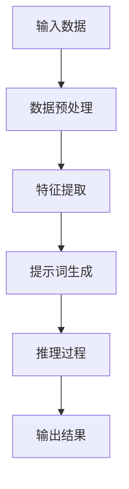
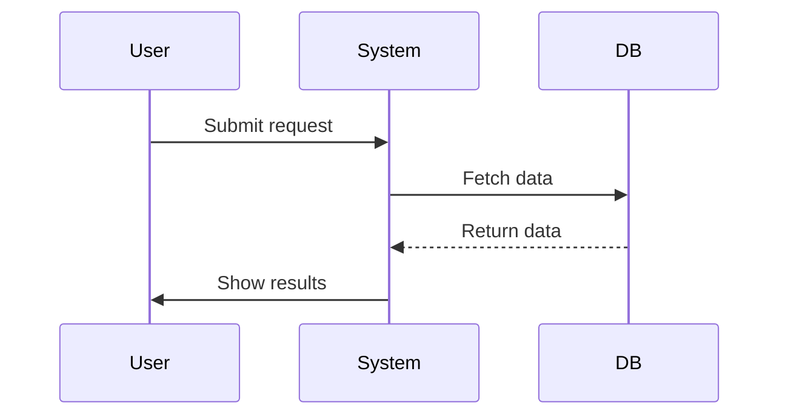
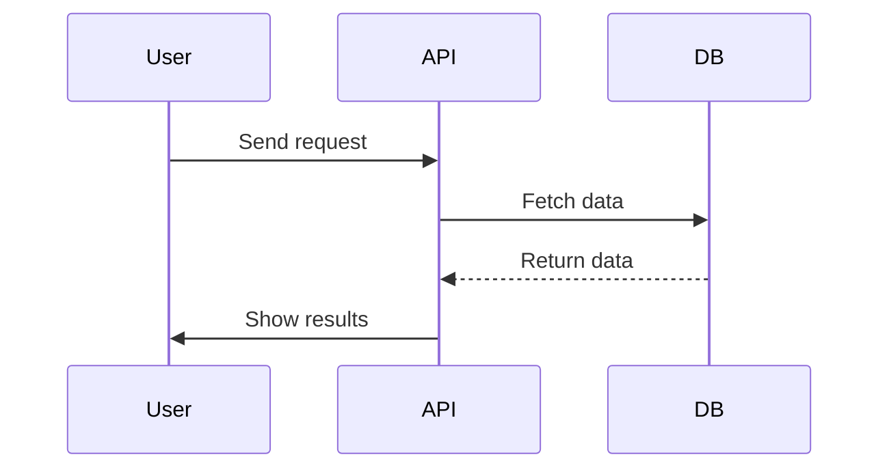
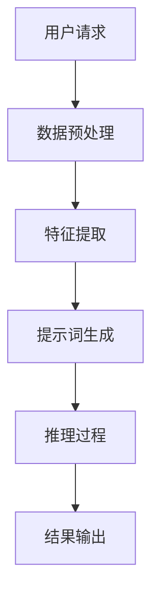

                 

**《大模型多角度推理：提示词构建全面分析框架》**

### 关键词：大模型、多角度推理、提示词、算法、数学模型、系统架构

### 摘要：
本文深入探讨了大模型多角度推理中的提示词构建，从背景与核心概念出发，逐步分析大模型、多角度推理和提示词的核心概念与联系，讲解算法原理和数学模型，最后通过系统分析与架构设计以及项目实战，全面解析了提示词构建的全面分析框架。本文旨在为读者提供一个全面、系统、易懂的指南，帮助理解和应用这一关键技术。

## 第一部分：背景与核心概念

### 第1章 问题背景与定义

#### 1.1 问题的提出
随着人工智能技术的飞速发展，大模型在各个领域得到了广泛应用。然而，如何有效利用大模型进行多角度推理，特别是如何构建高质量的提示词，成为了一个亟待解决的问题。

#### 1.2 大模型的定义
大模型，通常指的是参数量巨大、能够处理大规模数据的人工神经网络。它们具有强大的表示能力和推理能力，能够处理复杂的任务。

#### 1.3 多角度推理的概念
多角度推理，指的是从不同的角度或视角对问题进行推理。这在大模型中尤为重要，因为大模型能够处理大量的数据，从而从多个角度提供更为全面的推理结果。

#### 1.4 提示词的作用与意义
提示词，是引导大模型进行特定推理的关键。它们能够帮助大模型理解问题背景，提高推理的准确性和效率。

#### 1.5 边界与外延
在构建提示词时，需要明确其边界，确保提示词的通用性和适应性。同时，了解提示词的外延，能够帮助构建更加全面和灵活的提示词体系。

#### 1.6 概念结构与核心要素组成
大模型、多角度推理和提示词之间有着紧密的联系。理解这些概念的结构和核心要素组成，对于构建有效的提示词至关重要。

## 第二部分：核心概念与联系

### 第2章 大模型原理

#### 2.1 大模型的基本原理
大模型基于深度学习技术，通过多层神经网络对数据进行学习，提取特征，并利用这些特征进行推理。

#### 2.2 大模型的架构设计
大模型的架构设计包括输入层、隐藏层和输出层。每个层都有其特定的作用和特点。

#### 2.3 大模型的核心特点
大模型具有强大的学习能力、泛化能力和推理能力。这些特点使得大模型在复杂任务中表现优异。

#### 2.4 大模型与传统AI的区别
大模型与传统AI的区别主要体现在参数量、数据处理能力和推理能力上。大模型能够处理更大规模的数据，并提供更为全面的推理结果。

### 第3章 多角度推理

#### 3.1 多角度推理的定义
多角度推理，是指从不同的角度或视角对问题进行推理。这有助于提供更为全面和深入的推理结果。

#### 3.2 多角度推理的原理
多角度推理基于数据的多维度特性，通过综合不同角度的信息，提高推理的准确性和可靠性。

#### 3.3 多角度推理的类型
多角度推理可以分为数据驱动、模型驱动和混合驱动三种类型。每种类型都有其特定的应用场景和优势。

#### 3.4 多角度推理的应用场景
多角度推理在自然语言处理、计算机视觉、推荐系统等领域有着广泛的应用。通过多角度推理，能够提供更为准确的预测和决策。

### 第4章 提示词构建

#### 4.1 提示词的概念
提示词，是引导大模型进行特定推理的关键词或短语。它们能够帮助大模型理解问题背景，提供必要的上下文信息。

#### 4.2 提示词的构建方法
提示词的构建方法包括关键词提取、句子生成和语境构建等。每种方法都有其特定的应用场景和效果。

#### 4.3 提示词的有效性评估
评估提示词的有效性，可以通过对比不同提示词的推理结果，以及通过用户反馈和实际应用效果来衡量。

#### 4.4 提示词的应用实例
通过具体的应用实例，可以展示如何构建和优化提示词，以及如何利用提示词提升大模型的推理能力。

## 第三部分：算法原理讲解

### 第5章 算法原理

#### 5.1 算法的基本原理
算法的基本原理是通过特定的计算步骤，实现对问题的求解。在大模型中，算法用于优化提示词的生成和推理过程。

#### 5.2 算法流程图
通过mermaid流程图，可以清晰地展示算法的流程，包括输入、处理和输出等步骤。



#### 5.3 算法的数学模型与公式
算法的数学模型和公式用于描述其内部机制和计算过程。通过这些模型和公式，可以更深入地理解算法的工作原理。

$$
\text{输出结果} = f(\text{输入数据}, \text{提示词})
$$

#### 5.4 算法的Python实现
```python
# Python代码实现
def generate_suggestions(data, prompts):
    # 数据预处理
    processed_data = preprocess_data(data)
    # 特征提取
    features = extract_features(processed_data)
    # 提示词生成
    suggestions = []
    for feature in features:
        suggestion = generate_prompt(feature, prompts)
        suggestions.append(suggestion)
    # 推理过程
    results = []
    for suggestion in suggestions:
        result = perform_inference(suggestion)
        results.append(result)
    # 输出结果
    return results
```

#### 5.5 通俗易懂的举例说明
通过具体的例子，可以更直观地理解算法的原理和应用。例如，在自然语言处理中，如何利用提示词生成高质量的回答。

## 第四部分：数学模型和数学公式

### 第6章 数学模型

#### 6.1 数学模型的基本概念
数学模型是用于描述现实世界问题的一种抽象结构。在大模型多角度推理中，数学模型用于描述提示词生成和推理的过程。

#### 6.2 数学模型在多角度推理中的应用
数学模型在多角度推理中用于整合不同角度的信息，提高推理的准确性和可靠性。

#### 6.3 数学模型的推导与解释
通过推导和解释数学模型，可以更深入地理解多角度推理的原理和过程。

### 第7章 数学公式

#### 7.1 数学公式的基本格式
数学公式通常使用LaTeX格式进行表示。在大模型多角度推理中，LaTeX公式用于描述提示词生成和推理的数学模型。

$$
P(\text{输出结果}|\text{输入数据}, \text{提示词}) = \frac{P(\text{输入数据}, \text{提示词}| \text{输出结果})P(\text{输出结果})}{P(\text{输入数据}, \text{提示词})}
$$

#### 7.2 数学公式在Python中的应用
在Python中，可以使用`sympy`库来处理和计算LaTeX数学公式。

```python
from sympy import symbols, Eq, solve

x, y = symbols('x y')
eq = Eq(x**2 + y**2 - 1, 0)
sol = solve(eq, y)
print(sol)
```

#### 7.3 举例说明
通过具体的例子，可以更直观地理解数学公式在多角度推理中的应用。例如，如何利用数学模型进行数据可视化。

## 第五部分：系统分析与架构设计

### 第8章 问题场景介绍

#### 8.1 问题背景
在现代企业中，如何利用大模型进行多角度推理，以提高业务决策的准确性和效率，成为一个重要问题。

#### 8.2 项目介绍
本项目旨在构建一个基于大模型的多角度推理系统，用于支持企业的决策过程。

### 第9章 系统功能设计

#### 9.1 领域模型
领域模型是系统设计的核心。通过mermaid类图，可以清晰地展示系统的领域模型。

```mermaid
classDiagram
Class01 <|-- Class02
Class03 --| Class04
Class05 : +method1()
Class06 : +method2()
Class07 : +method3()
Class01 <.. Class07
Class08 ..|> Class07
Class09 --| Class07
Class10 : <<interface>> Interface
Class11 : <<enum>> Enum
Class12 : <<annotation>> Annotation
```

#### 9.2 系统功能设计
系统功能设计包括数据预处理、特征提取、提示词生成、推理过程和结果输出等。

### 第10章 系统架构设计

#### 10.1 系统架构设计
系统架构设计是系统设计的核心。通过mermaid架构图，可以清晰地展示系统的架构设计。



#### 10.2 系统接口设计
系统接口设计包括API接口和数据库接口。通过mermaid序列图，可以清晰地展示系统的接口设计。



### 第11章 系统交互

#### 11.1 系统交互设计
系统交互设计包括用户与系统、系统与数据库之间的交互过程。

#### 11.2 系统交互流程图
通过mermaid流程图，可以清晰地展示系统的交互流程。



## 第六部分：项目实战

### 第12章 环境安装

#### 12.1 环境安装步骤
详细描述如何搭建项目环境，包括安装所需的软件和依赖库。

#### 12.2 遇到的问题与解决方案
记录在环境安装过程中遇到的问题，以及相应的解决方案。

### 第13章 系统核心实现

#### 13.1 系统核心实现源代码
展示系统的核心实现代码，包括数据预处理、特征提取、提示词生成、推理过程和结果输出等。

#### 13.2 代码应用解读与分析
对核心实现代码进行解读和分析，解释其原理和实现过程。

### 第14章 实际案例分析

#### 14.1 实际案例分析
通过具体案例，展示系统在实际应用中的效果。

#### 14.2 详细讲解剖析
对案例进行详细讲解和分析，阐述系统如何解决实际问题。

### 第15章 项目小结

#### 15.1 项目总结
总结项目的核心成果和经验。

#### 15.2 最佳实践 tips
提供一些最佳实践建议，帮助读者更好地应用所学知识。

#### 15.3 小结与注意事项
对项目进行总结，强调关键点和注意事项。

#### 15.4 拓展阅读
推荐一些相关阅读资料，帮助读者进一步深入学习。

---

**作者：AI天才研究院/AI Genius Institute & 禅与计算机程序设计艺术 /Zen And The Art of Computer Programming** 

**全文完**

---

**备注：**
1. 文章内容仅供参考，实际应用时请结合具体场景进行调整。
2. 文章中的mermaid图和LaTeX公式需要根据实际markdown支持情况进行调整。

---

**附录：**
- [附录1：术语解释](#术语解释)
- [附录2：参考文献](#参考文献)

