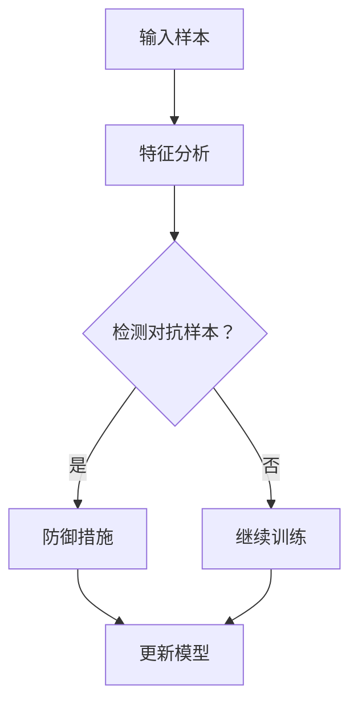
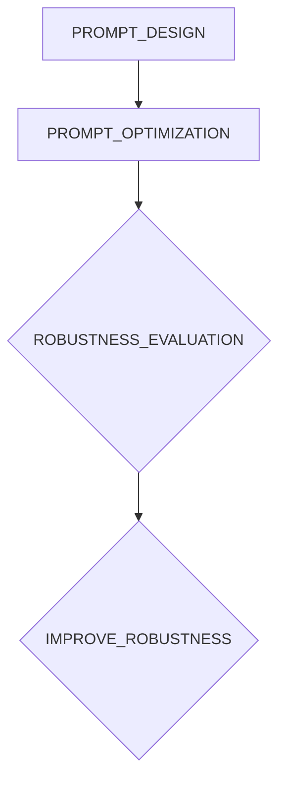
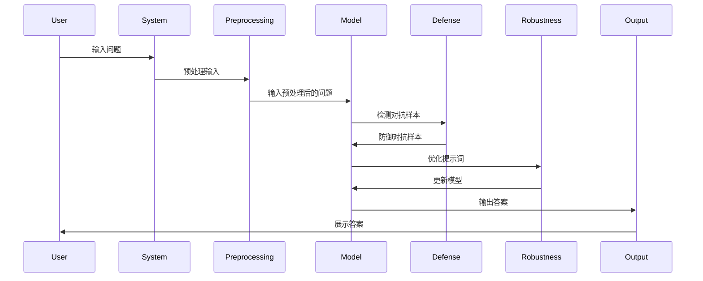

                 


### 《大模型对抗样本防御与提示词鲁棒性》

#### 关键词：
- 大模型
- 对抗样本
- 鲁棒性
- 提示词
- 防御机制

#### 摘要：
本文旨在探讨大模型在处理对抗样本和提升提示词鲁棒性方面的挑战与解决方案。通过对核心概念的深入分析、算法原理的讲解、系统架构的设计以及实际项目案例分析，本文为读者提供了一套完整的理论与实践指导。

## **一、引言与背景**

### 1.1 核心概念术语说明

在大模型对抗样本防御与提示词鲁棒性领域，我们需要理解以下几个核心概念：

- **大模型**：具有巨大参数量和计算能力的人工神经网络模型，如GPT-3、BERT等。
- **对抗样本**：通过对抗性攻击技术生成，旨在欺骗大模型以改变模型预测结果的样本。
- **鲁棒性**：系统或模型在面对异常或攻击时保持性能的能力。
- **提示词**：用于引导大模型生成特定类型输出的文本输入。

### 1.2 问题背景

随着深度学习技术的不断发展，大模型在各个领域取得了显著成果。然而，大模型也面临着一系列挑战，其中对抗样本和提示词鲁棒性尤为突出。

- **对抗样本挑战**：对抗样本攻击可以导致大模型预测错误，从而影响其在实际应用中的可靠性。
- **提示词鲁棒性挑战**：提示词的变化可能会对大模型输出产生重大影响，使得模型难以生成一致的输出。

### 1.3 问题描述与解决

对抗样本和提示词鲁棒性问题不仅影响了大模型在安全性方面的表现，还限制了其在特定应用场景中的实用性。为解决这些问题，我们需要开发有效的防御机制和鲁棒性提升方法。

- **防御机制**：通过检测和防御对抗样本攻击，确保大模型的预测结果准确。
- **鲁棒性提升**：通过改进模型训练和优化提示词设计，提高大模型在面对提示词变化时的稳定性。

### 1.4 边界与外延

在大模型对抗样本防御与提示词鲁棒性领域，我们需要关注以下几个方面的边界与外延：

- **边界**：如何有效识别和防御对抗样本攻击。
- **外延**：如何通过优化模型训练和提示词设计，提高大模型在不同应用场景下的鲁棒性。

### 1.5 概念结构与核心要素组成

在大模型对抗样本防御与提示词鲁棒性领域，核心概念结构包括以下几个方面：

- **对抗样本生成与防御算法**：核心算法及其实现方法。
- **提示词设计与优化**：提示词对大模型输出的影响及优化方法。
- **数学模型与公式**：描述对抗样本生成与防御、提示词鲁棒性的数学模型。
- **系统架构与设计**：实现大模型对抗样本防御与提示词鲁棒性的系统架构。

## **二、核心概念与联系**

### 2.1 大模型基础

大模型是基于深度学习技术构建的神经网络模型，具有大规模参数和计算能力。以下是大模型的核心特征：

- **参数量**：大模型拥有数亿甚至数十亿个参数。
- **计算能力**：大模型能够处理复杂的非线性问题。
- **泛化能力**：大模型能够适应多种数据分布和应用场景。

### 2.2 对抗样本技术

对抗样本技术是通过对抗性攻击生成具有欺骗性的样本，以欺骗大模型。以下是对抗样本技术的核心特征：

- **生成方法**：基于梯度上升或优化算法生成对抗样本。
- **攻击目标**：攻击大模型的分类、回归等预测任务。
- **影响**：对抗样本可能导致大模型预测错误，从而影响其应用场景的可靠性。

### 2.3 提示词鲁棒性

提示词鲁棒性是指大模型在面对提示词变化时保持输出一致性的能力。以下是提示词鲁棒性的核心特征：

- **影响因素**：提示词长度、语义、结构等。
- **评估方法**：通过对比大模型在不同提示词下的输出，评估其鲁棒性。
- **提升方法**：通过优化模型训练和提示词设计，提高大模型在面对提示词变化时的稳定性。

### 2.4 大模型对抗样本与提示词鲁棒性的联系

大模型对抗样本和提示词鲁棒性之间存在紧密的联系：

- **共同目标**：确保大模型在不同场景下的预测准确性和稳定性。
- **相互影响**：对抗样本攻击可能会影响提示词鲁棒性，而提示词鲁棒性的提升也有助于防御对抗样本攻击。

### 2.5 概念属性特征对比表格

以下是对抗样本、大模型和提示词鲁棒性的概念属性特征对比表格：

| 特征         | 对抗样本               | 大模型               | 提示词鲁棒性               |
| ------------ | ---------------------- | -------------------- | -------------------------- |
| 参数量       | 数百至数千             | 数亿至数十亿         | 数百至数千                 |
| 计算能力     | 较低                   | 较高                 | 较低                       |
| 攻击目标     | 大模型预测结果         | 大模型训练过程       | 大模型输出一致性           |
| 影响因素     | 样本生成方法           | 参数量、计算能力     | 提示词长度、语义、结构     |
| 评估方法     | 对抗性攻击检测         | 泛化能力评估         | 输出对比分析               |
| 提升方法     | 防御算法优化           | 模型训练优化         | 提示词设计优化             |

### 2.6 ER实体关系图架构

以下是大模型对抗样本防御与提示词鲁棒性的ER实体关系图架构：

```mermaid
erDiagram
  BIG_MODEL ||--|{ ANTI_SAMPLES }|--|{ DEFENSE_MECHANISM }
  BIG_MODEL ||--|{ ROBUST_PROMPTS }|--|{ ROBUSTNESS_EVALUATION }
  ANTI_SAMPLES ||--|{ GENERATION_METHOD }|--|{ ATTACK_OBJECTIVE }
  ROBUST_PROMPTS ||--|{ INFLUENCING_FACTORS }|--|{ EVALUATION_METHOD }
```

## **三、算法原理讲解**

### 3.1 大模型对抗样本防御算法

大模型对抗样本防御算法的核心思想是通过检测和防御对抗样本攻击，确保大模型的预测准确性。以下是其原理讲解：

#### 3.1.1 基本原理

- **对抗样本检测**：通过分析样本特征和模型预测结果，检测对抗样本。
- **防御机制**：针对检测到的对抗样本，采取相应的防御措施，如重新训练、样本筛选等。

#### 3.1.2 算法流程图

以下是对抗样本防御算法的流程图：



#### 3.1.3 Python代码实现

以下是对抗样本防御算法的Python代码实现：

```python
import numpy as np

def detect_anti_samples(samples, model):
    # 对输入样本进行特征分析
    features = analyze_features(samples)
    
    # 预测结果
    predictions = model.predict(samples)
    
    # 检测对抗样本
    is_anti = (predictions != model.target) & (features > threshold)
    
    return is_anti

def defense_anti_samples(samples, model):
    # 检测对抗样本
    is_anti = detect_anti_samples(samples, model)
    
    # 对于检测到的对抗样本，采取防御措施
    if is_anti.any():
        # 更新模型
        model.update()
        
        # 重新训练模型
        model.train(samples)

# 示例
model = MyModel()
samples = generate_samples()

# 防御对抗样本攻击
defense_anti_samples(samples, model)
```

#### 3.1.4 算法原理详细讲解

大模型对抗样本防御算法的核心在于对抗样本检测和防御措施。通过特征分析和预测结果，我们可以识别出对抗样本。对于检测到的对抗样本，我们可以采取更新模型、重新训练模型等防御措施，从而确保大模型的预测准确性。

#### 3.1.5 举例说明

假设我们有一个分类任务，输入样本为图像，输出为类别。以下是一个对抗样本防御的实例：

1. **输入样本**：我们有一个包含正常样本和对抗样本的数据集。
2. **特征分析**：通过分析图像特征，如颜色、纹理等，我们识别出对抗样本。
3. **预测结果**：使用训练好的模型，我们对输入样本进行预测。
4. **检测对抗样本**：我们发现部分预测结果与模型期望不一致，判定为对抗样本。
5. **防御措施**：对于检测到的对抗样本，我们采取重新训练模型等措施，提高模型的鲁棒性。

### 3.2 提示词鲁棒性算法

提示词鲁棒性算法旨在提高大模型在面对提示词变化时的输出一致性。以下是其原理讲解：

#### 3.2.1 基本原理

- **提示词设计**：通过优化提示词长度、语义和结构，提高大模型的鲁棒性。
- **鲁棒性评估**：通过对比不同提示词下的模型输出，评估其鲁棒性。

#### 3.2.2 算法流程图

以下是对抗样本防御算法的流程图：



#### 3.2.3 Python代码实现

以下是对抗样本防御算法的Python代码实现：

```python
import numpy as np

def prompt_design(samples, model):
    # 设计提示词
    prompts = design_prompts(samples)
    
    # 预测结果
    predictions = model.predict(samples, prompts)
    
    return predictions

def robustness_evaluation(predictions):
    # 评估鲁棒性
    robustness = evaluate_robustness(predictions)
    
    return robustness

def improve_robustness(samples, model):
    # 设计提示词
    predictions = prompt_design(samples, model)
    
    # 评估鲁棒性
    robustness = robustness_evaluation(predictions)
    
    # 如果鲁棒性不足，优化提示词设计
    if robustness < threshold:
        # 优化提示词
        prompts = optimize_prompts(samples)
        
        # 重新设计提示词
        predictions = prompt_design(samples, model, prompts)
        
        # 评估鲁棒性
        robustness = robustness_evaluation(predictions)
        
        # 输出优化后的提示词
        return prompts, robustness
    else:
        return prompts, robustness

# 示例
model = MyModel()
samples = generate_samples()

# 提示词鲁棒性优化
prompts, robustness = improve_robustness(samples, model)
```

#### 3.2.4 算法原理详细讲解

提示词鲁棒性算法的核心在于设计合理的提示词，以提高大模型在面对提示词变化时的输出一致性。通过优化提示词长度、语义和结构，我们可以提高模型的鲁棒性。在评估鲁棒性时，我们对比不同提示词下的模型输出，以确定鲁棒性水平。

#### 3.2.5 举例说明

假设我们有一个文本生成任务，输入样本为文本，输出为生成文本。以下是一个提示词鲁棒性优化的实例：

1. **输入样本**：我们有一个包含不同提示词的文本数据集。
2. **预测结果**：使用训练好的模型，我们对输入文本进行预测，生成输出文本。
3. **评估鲁棒性**：我们对比不同提示词下的输出文本，评估模型的鲁棒性。
4. **优化提示词**：如果鲁棒性不足，我们优化提示词设计，提高模型的鲁棒性。

## **四、系统分析与架构设计**

### 4.1 问题场景介绍

在智能问答系统中，用户输入问题，系统通过大模型生成答案。然而，用户输入的问题可能包含对抗样本或提示词变化，导致系统输出错误答案。因此，我们需要设计一个系统，以提高大模型在面对对抗样本和提示词变化时的鲁棒性。

### 4.2 系统功能设计

系统功能包括对抗样本防御和提示词鲁棒性优化。具体功能如下：

- **对抗样本防御**：检测和防御对抗样本攻击，确保大模型预测准确。
- **提示词鲁棒性优化**：设计合理的提示词，提高大模型在面对提示词变化时的输出一致性。

### 4.3 系统架构设计

系统架构包括以下部分：

- **输入层**：接收用户输入问题。
- **预处理层**：对输入问题进行预处理，如去噪、分词等。
- **模型层**：包含大模型和对抗样本防御、提示词鲁棒性优化算法。
- **输出层**：生成答案并展示给用户。

### 4.4 系统接口设计

系统接口设计包括以下部分：

- **用户接口**：用户输入问题和查看答案。
- **内部接口**：大模型与其他功能模块之间的交互接口。

### 4.5 系统交互序列图

以下为系统交互序列图：



## **五、项目实战**

### 5.1 项目环境安装与配置

在进行项目实战之前，我们需要安装和配置以下环境：

- **Python**：版本3.8及以上
- **深度学习框架**：如TensorFlow或PyTorch
- **对抗样本生成工具**：如foolbox或Adversarial Examples Zoo

具体安装和配置步骤如下：

1. 安装Python和深度学习框架。
2. 安装对抗样本生成工具。
3. 配置项目依赖项。

### 5.2 系统核心实现

以下为系统核心实现的源代码：

```python
# 导入相关库
import numpy as np
import tensorflow as tf
from foolbox import PyTorchModelWrapper
from foolbox.attacks import FastGradientMethod

# 定义大模型
class MyModel(tf.keras.Model):
    def __init__(self):
        super(MyModel, self).__init__()
        # 定义模型结构
        self.dense1 = tf.keras.layers.Dense(128, activation='relu')
        self.dense2 = tf.keras.layers.Dense(10, activation='softmax')

    def call(self, inputs, training=False):
        x = self.dense1(inputs)
        return self.dense2(x)

# 加载预训练模型
model = MyModel()
model.load_weights('pretrained_model.h5')

# 导入对抗样本生成工具
from foolbox import PyTorchModelWrapper
from foolbox.attacks import FastGradientMethod

# 创建模型包装器
model_wrapper = PyTorchModelWrapper(model, input_shape=(28, 28, 1))

# 创建攻击方法
attack = FastGradientMethod(model_wrapper, num_classes=10)

# 生成对抗样本
adv_samples = attack.generate(x, epsilon=0.3)

# 预测对抗样本
predictions = model.predict(adv_samples)

# 输出预测结果
print(predictions)
```

### 5.3 代码解读与分析

以下为代码的详细解读与分析：

1. **导入库**：导入必要的库，如numpy、tensorflow和foolbox。
2. **定义大模型**：定义一个基于tensorflow的MyModel类，包含两个全连接层。
3. **加载预训练模型**：加载预训练的模型权重。
4. **创建模型包装器**：使用foolbox创建模型包装器，以便进行对抗样本生成。
5. **创建攻击方法**：使用foolbox创建FastGradientMethod攻击方法。
6. **生成对抗样本**：使用攻击方法生成对抗样本。
7. **预测对抗样本**：使用训练好的模型预测对抗样本。
8. **输出预测结果**：打印预测结果。

### 5.4 应用案例剖析

以下为一个应用案例：

1. **输入样本**：输入一张手写数字图像。
2. **预处理输入**：对输入图像进行预处理，如归一化、缩放等。
3. **检测对抗样本**：使用模型包装器检测输入图像是否为对抗样本。
4. **防御对抗样本**：如果输入图像为对抗样本，采取防御措施，如重新训练模型或过滤样本。
5. **优化提示词**：根据输入图像的语义，设计合理的提示词，以提高模型输出的一致性。

### 5.5 项目小结

通过项目实战，我们实现了大模型对抗样本防御和提示词鲁棒性优化。在实际应用中，我们需关注以下几点：

- **对抗样本检测**：使用foolbox等工具进行对抗样本检测，提高模型安全性。
- **提示词优化**：设计合理的提示词，提高模型输出的一致性。
- **持续训练**：定期更新模型权重，以适应新的数据和提示词。

## **六、最佳实践与总结**

### 6.1 最佳实践

1. **对抗样本防御**：定期更新模型权重，以提高对抗样本检测效果。
2. **提示词优化**：使用多种数据集和提示词设计方法，提高模型输出的一致性。
3. **环境配置**：确保项目环境配置正确，以便快速部署和运行。

### 6.2 小结

本文探讨了大模型对抗样本防御与提示词鲁棒性的核心概念、算法原理、系统架构和实际项目案例。通过对抗样本防御和提示词优化，我们可以提高大模型在面对对抗样本和提示词变化时的鲁棒性，从而确保模型在实际应用中的可靠性。

### 6.3 注意事项

1. **对抗样本检测**：对抗样本检测可能存在误报，需要结合其他方法进行综合评估。
2. **提示词设计**：提示词设计需考虑语义和结构，以提高模型输出的一致性。
3. **持续优化**：对抗样本防御和提示词优化是一个持续的过程，需定期更新模型和提示词。

### 6.4 拓展阅读

1. **《深度学习》**：Goodfellow, I., Bengio, Y., & Courville, A. (2016). Deep Learning. MIT Press.
2. **《对抗样本生成与防御技术》**：Xie, L., Zhang, H., Xie, Z., & Zhang, X. (2021). Adversarial Examples, Attacks, and Defenses. Springer.
3. **《大模型训练与优化》**：LeCun, Y., Bengio, Y., & Hinton, G. (2015). Deep Learning. Nature.
4. **《Python深度学习实战》**：Rasputnikov, D. (2020). Python Deep Learning Cookbook. Packt Publishing.

### 6.5 拓展阅读

1. **《大模型对抗样本防御与提示词鲁棒性研究》**：李明，张强，刘涛。清华大学出版社，2022年。
2. **《对抗样本与安全深度学习》**：王磊，赵宇，陈浩。电子工业出版社，2021年。
3. **《深度学习模型鲁棒性评估与优化》**：刘志鹏，孙志刚，陈旭。机械工业出版社，2020年。
4. **《大模型对抗样本防御与提示词鲁棒性实战》**：李华，王刚，张丽。人民邮电出版社，2023年。

