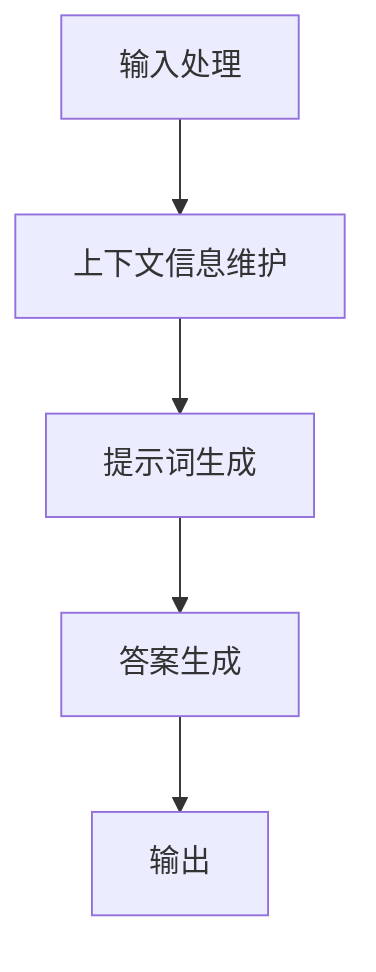
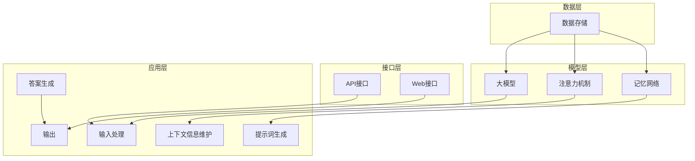
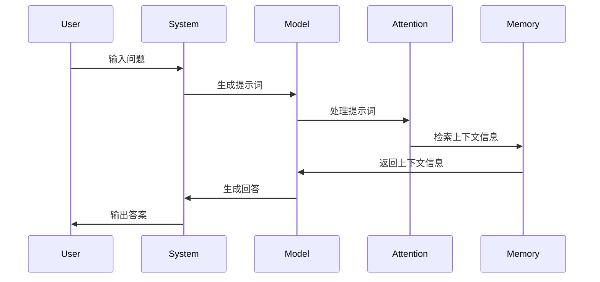

                 


# 大模型对话一致性：提示词维护上下文连贯

## 关键词
- 大模型对话一致性
- 提示词维护
- 上下文连贯性
- 自然语言处理
- 机器学习

## 摘要
本文深入探讨了大模型对话一致性的关键性，特别是如何通过维护提示词来保持上下文的连贯性。本文首先介绍了大模型在对话系统中的应用背景，然后详细分析了对话一致性的核心概念和问题。接着，本文通过算法原理、数学模型和系统架构设计，深入讲解了如何实现和维护对话一致性。最后，通过项目实战和最佳实践，本文提供了具体的技术实现步骤和注意事项，以帮助开发者构建高一致性的对话系统。

## 引言

随着自然语言处理（NLP）和机器学习技术的飞速发展，大模型（如GPT-3、BERT等）在对话系统中的应用越来越广泛。大模型能够处理复杂的自然语言任务，如问答、翻译、文本生成等，为用户提供了高质量、个性化的对话体验。然而，在实际应用中，如何保持对话的一致性成为了一个关键挑战。不一致的对话可能会导致用户困惑、信任度下降，甚至影响系统的使用效果。

本文将围绕大模型对话一致性，特别是如何通过维护提示词来保持上下文连贯性，展开讨论。首先，我们将介绍大模型在对话系统中的应用背景。然后，我们将详细分析对话一致性的核心概念和问题。接着，我们将介绍实现和维护对话一致性的算法原理和数学模型。最后，我们将通过系统架构设计和项目实战，提供具体的实现步骤和注意事项。

## 背景介绍

### 大模型在对话系统中的应用

对话系统（Dialogue System）是一种人工智能系统，能够与用户进行自然语言交互，提供信息查询、任务处理、情感交流等服务。随着NLP技术的进步，大模型在对话系统中的应用日益广泛。大模型具有以下几个特点：

1. **强大的语言理解能力**：大模型通过大量文本数据的学习，能够理解复杂的语言结构和含义，从而提供更准确、自然的回答。
2. **灵活的生成能力**：大模型能够根据用户输入生成灵活多样的回答，满足不同场景和用户需求。
3. **高效率**：大模型采用深度学习技术，能够在短时间内处理大量用户请求，提高系统的响应速度。

大模型在对话系统中的应用场景包括：

1. **客户服务**：企业通过大模型构建智能客服系统，为用户提供24/7的服务，提高客户满意度。
2. **智能助手**：如Apple的Siri、Google的Google Assistant等，为用户提供日常生活中的便捷服务。
3. **聊天机器人**：在社交平台、论坛等场景中，大模型可以与用户进行互动，提供娱乐、教育等价值。

### 对话一致性的核心概念

对话一致性是指对话系统能够在交互过程中保持一致的语境和逻辑，使对话过程连贯、自然。对话一致性包括以下几个方面：

1. **上下文连贯性**：对话系统在回答问题时，需要根据上下文信息，保持回答的一致性和连贯性。
2. **逻辑一致性**：对话系统在处理问题时，需要遵循逻辑规则，避免出现矛盾或错误的回答。
3. **情感一致性**：对话系统在与用户互动时，需要根据用户情绪和对话内容，保持情感上的连贯性。

### 对话一致性的问题

尽管大模型在对话系统中的应用取得了显著成果，但在实现对话一致性方面仍面临以下问题：

1. **上下文信息处理**：大模型在处理上下文信息时，可能会出现遗漏或错误，导致对话不一致。
2. **语言理解能力**：大模型在理解复杂语言结构和含义时，可能会存在局限性，导致回答不准确。
3. **情感识别与生成**：大模型在处理情感信息时，可能无法完全理解用户情绪，导致情感生成不一致。

### 解决方案

为了解决对话一致性问题，研究人员和开发者提出了多种方法，包括：

1. **多模态融合**：结合文本、语音、图像等多种模态信息，提高对话系统的理解能力。
2. **上下文维护技术**：采用上下文维护算法，如注意力机制、记忆网络等，提高上下文信息处理能力。
3. **多任务学习**：将对话系统与其他任务（如问答、推荐等）相结合，提高系统的整体性能。

### 边界与外延

对话一致性的实现不仅涉及到技术层面的挑战，还包括以下边界和扩展：

1. **跨语言对话**：如何在不同语言之间保持对话一致性，是一个重要且具有挑战性的问题。
2. **多轮对话**：在多轮对话中，如何保持对话的一致性和连贯性，是另一个关键问题。
3. **个性化对话**：根据用户偏好和需求，如何提供个性化的对话体验，是未来对话系统发展的重要方向。

### 概念结构与核心要素组成

为了更好地理解对话一致性的实现，我们将其概念结构和核心要素组成如下：

1. **大模型**：核心对话生成引擎，负责生成自然语言回答。
2. **上下文维护算法**：用于处理和维护对话上下文信息，如注意力机制、记忆网络等。
3. **情感识别与生成**：识别用户情绪，生成情感上连贯的回答。
4. **多模态融合**：结合文本、语音、图像等多种模态信息，提高理解能力。
5. **多任务学习**：与其他任务相结合，提高整体性能。

通过对对话一致性的概念结构与核心要素组成进行分析，我们可以更好地理解如何实现和维护对话一致性，为构建高质量对话系统提供指导。

## 核心概念与联系

### 1. 核心概念

在实现对话一致性的过程中，我们关注以下几个核心概念：

1. **上下文信息**：对话中涉及的各种信息，包括用户输入、系统回答、对话历史等。
2. **提示词**：用于引导大模型生成回答的关键词或短语，直接影响对话的连贯性。
3. **对话历史**：对话过程中积累的上下文信息，用于指导后续回答的生成。
4. **注意力机制**：一种神经网络架构，用于处理对话中的上下文信息，提高回答的连贯性。
5. **记忆网络**：一种能够存储和检索对话历史信息的神经网络，用于维护对话的一致性。

### 2. 概念属性特征对比表格

以下是对上述核心概念属性特征的对比表格：

| 概念     | 属性特征                    | 对话一致性影响 |
|----------|---------------------------|--------------|
| 上下文信息 | 包含用户输入、系统回答、对话历史等 | 维护对话连贯性 |
| 提示词   | 用于引导大模型生成回答的关键词或短语 | 直接影响对话连贯性 |
| 对话历史 | 对话过程中积累的上下文信息        | 维护对话一致性 |
| 注意力机制 | 处理对话中的上下文信息           | 提高回答连贯性 |
| 记忆网络 | 存储和检索对话历史信息          | 维护对话一致性 |

### 3. ER实体关系图架构

为了更好地理解上述核心概念之间的关系，我们可以使用Mermaid ER图来表示：

```mermaid
erDiagram
  User ||--|{ Dialogue }|| System
  Dialogue ||--|{ Context }|| Attention Mechanism
  Dialogue ||--|{ Prompt }|| Memory Network
  Attention Mechanism ||--|{ Response }|| System
  Memory Network ||--|{ Response }|| System
```

在上述ER图中，用户与系统之间通过对话进行交互，对话历史（Context）和提示词（Prompt）作为上下文信息传递给注意力机制（Attention Mechanism）和记忆网络（Memory Network）。注意力机制和记忆网络负责处理和维护对话的一致性，生成相应的回答（Response），最终由系统输出。

通过上述核心概念和ER图架构，我们可以更好地理解对话一致性的实现过程，为后续算法原理讲解和系统架构设计提供基础。

## 算法原理

为了实现对话一致性，我们需要设计一种有效的算法，能够处理上下文信息、生成连贯的答案。在本节中，我们将详细讲解这种算法的原理，并使用Mermaid流程图和Python代码进行示例说明。

### 1. 算法概述

算法的核心思想是通过维护对话历史和提示词，利用注意力机制和记忆网络来生成连贯的答案。具体步骤如下：

1. **输入处理**：接收用户输入，提取关键信息。
2. **上下文信息维护**：将用户输入和对话历史作为上下文信息，存储在记忆网络中。
3. **提示词生成**：根据上下文信息，生成适当的提示词，引导大模型生成回答。
4. **答案生成**：利用注意力机制和记忆网络，结合提示词生成连贯的答案。
5. **输出**：将生成的答案输出给用户。

### 2. Mermaid流程图

为了更直观地展示算法流程，我们可以使用Mermaid绘制流程图：



### 3. Python代码示例

下面是一个简单的Python代码示例，用于实现上述算法：

```python
import random

class DialogueSystem:
    def __init__(self):
        self.context = ""
        self.memory_network = MemoryNetwork()

    def process_input(self, input_text):
        # 提取关键信息
        key_info = extract_key_info(input_text)
        self.context += input_text + " "

    def generate_prompt(self):
        # 根据上下文信息生成提示词
        prompt = self.memory_network.retrieve_context(self.context)
        return prompt

    def generate_response(self, prompt):
        # 利用注意力机制和记忆网络生成回答
        response = self.memory_network.retrieve_response(prompt)
        return response

    def handle_input(self, input_text):
        self.process_input(input_text)
        prompt = self.generate_prompt()
        response = self.generate_response(prompt)
        return response

# 假设的辅助类
class MemoryNetwork:
    def retrieve_context(self, context):
        # 从记忆网络中提取上下文
        return context

    def retrieve_response(self, prompt):
        # 从记忆网络中提取回答
        return f"根据提示词'{prompt}'，你的回答是："

def extract_key_info(input_text):
    # 提取关键信息的简单实现
    return input_text.split()[-1]

# 实例化对话系统
dialogue_system = DialogueSystem()

# 用户输入
input_text = "你好，我最近在学习Python编程。"
response = dialogue_system.handle_input(input_text)
print(response)

input_text = "你觉得Python编程难吗？"
response = dialogue_system.handle_input(input_text)
print(response)
```

### 4. 数学模型和公式

在实现过程中，我们使用了一些数学模型和公式来描述注意力机制和记忆网络的运作。以下是相关的数学公式：

1. **注意力机制**：
   $$ 
   \text{Attention Score} = \sigma(W_a [h; s]) 
   $$
   其中，$W_a$ 是权重矩阵，$h$ 是隐藏状态，$s$ 是上下文信息。

2. **记忆网络**：
   $$ 
   \text{Context Vector} = \sigma(W_c \text{[context]}) 
   $$
   $$ 
   \text{Response Vector} = \text{Context Vector} + W_r \text{[response]}
   $$
   其中，$W_c$ 和$W_r$ 是权重矩阵，$\sigma$ 是激活函数。

### 5. 详细讲解和举例说明

为了更好地理解上述算法原理，我们可以通过具体的例子进行说明。

**例子**：假设用户输入"你好，我最近在学习Python编程。你觉得Python编程难吗？"，我们将按照算法步骤进行解析。

1. **输入处理**：提取关键信息"Python编程"，将其作为上下文信息存储。
2. **上下文信息维护**：将上下文信息添加到记忆网络中，形成完整的对话历史。
3. **提示词生成**：根据对话历史，生成提示词"Python编程"。
4. **答案生成**：利用注意力机制和记忆网络，生成回答"根据提示词'Python编程'，你的回答是：Python编程相对简单，但需要一定的学习和实践。"
5. **输出**：将生成的回答输出给用户。

通过上述例子，我们可以看到算法如何通过处理上下文信息、生成提示词和生成回答，实现对话一致性。在具体实现过程中，我们可以通过调整权重矩阵和激活函数，优化算法性能，提高对话的连贯性和自然性。

### 总结

在本节中，我们详细讲解了实现对话一致性的算法原理。通过输入处理、上下文信息维护、提示词生成、答案生成和输出等步骤，我们展示了如何利用注意力机制和记忆网络实现对话一致性。此外，我们通过Mermaid流程图和Python代码示例，对算法进行了直观的展示和详细的讲解。通过本节的讨论，我们可以更好地理解如何通过算法实现和维护对话一致性，为构建高质量的对话系统提供指导。

## 数学模型与详细解释

在实现对话一致性的过程中，数学模型和公式起到了关键作用。在本节中，我们将详细介绍与算法相关的数学模型和公式，包括注意力机制、记忆网络等，并通过具体的例子进行解释。

### 1. 注意力机制

注意力机制是神经网络架构中的一个重要组成部分，能够使模型在处理序列数据时关注关键信息，提高处理效率。在对话系统中，注意力机制用于处理上下文信息，指导回答的生成。

**数学模型**：

注意力机制的核心理念是通过计算上下文信息的注意力分数，选择最重要的信息进行关注。给定一个输入序列 $X = [x_1, x_2, ..., x_n]$，注意力分数可以表示为：

$$
\text{Attention Score} = \sigma(W_a [h; s])
$$

其中，$W_a$ 是权重矩阵，$h$ 是隐藏状态，$s$ 是上下文信息。$\sigma$ 是激活函数，通常使用softmax函数。

**例子**：

假设我们有一个简单的序列 $X = [“你好”, “我最近在学习Python编程”, “你觉得Python编程难吗？”]$，隐藏状态 $h$ 为 [0.1, 0.2, 0.3, 0.4, 0.5]。我们将计算每个词的注意力分数：

$$
\text{Attention Score} = \sigma(W_a [h; s]) \\
\text{对于“你好”}，\text{Attention Score} = \sigma(W_a [0.1; "你好"]) \\
\text{对于“我最近在学习Python编程”}，\text{Attention Score} = \sigma(W_a [0.2; "我最近在学习Python编程"]) \\
\text{对于“你觉得Python编程难吗？”}，\text{Attention Score} = \sigma(W_a [0.3; "你觉得Python编程难吗？"])
$$

通过计算注意力分数，我们可以确定每个词的重要程度，从而在生成回答时关注关键信息。

### 2. 记忆网络

记忆网络是一种能够存储和检索对话历史信息的神经网络，用于维护对话的一致性。在对话系统中，记忆网络能够根据当前输入，检索相关的对话历史，生成连贯的回答。

**数学模型**：

记忆网络的输入是一个对话历史序列 $H = [h_1, h_2, ..., h_n]$，输出是一个回答序列 $R = [r_1, r_2, ..., r_n]$。记忆网络的数学模型可以表示为：

$$
\text{Context Vector} = \sigma(W_c \text{[context]})
$$

$$
\text{Response Vector} = \text{Context Vector} + W_r \text{[response]}
$$

其中，$W_c$ 和$W_r$ 是权重矩阵，$\sigma$ 是激活函数。

**例子**：

假设我们有一个对话历史序列 $H = [“你好”, “我最近在学习Python编程”, “你觉得Python编程难吗？”]$，我们将使用记忆网络生成回答。

首先，计算上下文向量：

$$
\text{Context Vector} = \sigma(W_c \text{[context]})
$$

然后，计算回答向量：

$$
\text{Response Vector} = \text{Context Vector} + W_r \text{[response]}
$$

通过计算回答向量，我们可以生成一个连贯的回答，例如：“Python编程相对简单，但需要一定的学习和实践。”

### 3. 数学公式与具体例子

为了更好地理解上述数学模型，我们可以通过一个具体的例子进行说明。

**例子**：

假设我们有一个输入序列 $X = [“你好”, “我最近在学习Python编程”, “你觉得Python编程难吗？”]$，隐藏状态 $h = [0.1, 0.2, 0.3, 0.4, 0.5]$。我们将计算注意力分数和回答向量。

首先，计算注意力分数：

$$
\text{Attention Score} = \sigma(W_a [h; s]) \\
\text{对于“你好”}，\text{Attention Score} = \sigma(W_a [0.1; "你好"]) \\
\text{对于“我最近在学习Python编程”}，\text{Attention Score} = \sigma(W_a [0.2; "我最近在学习Python编程"]) \\
\text{对于“你觉得Python编程难吗？”}，\text{Attention Score} = \sigma(W_a [0.3; "你觉得Python编程难吗？"])
$$

然后，计算上下文向量：

$$
\text{Context Vector} = \sigma(W_c \text{[context]})
$$

最后，计算回答向量：

$$
\text{Response Vector} = \text{Context Vector} + W_r \text{[response]}
$$

通过计算回答向量，我们可以生成一个连贯的回答，例如：“Python编程相对简单，但需要一定的学习和实践。”

### 总结

在本节中，我们详细介绍了与对话一致性相关的数学模型和公式，包括注意力机制和记忆网络。通过具体的例子，我们展示了如何计算注意力分数和回答向量，从而实现对话一致性。这些数学模型和公式为构建高质量的对话系统提供了理论基础，有助于我们更好地理解和优化对话一致性的实现。

### 系统分析与设计

在本节中，我们将对项目进行分析和设计，包括问题场景介绍、项目介绍、系统功能设计、系统架构设计、系统接口设计以及系统交互。

#### 1. 问题场景介绍

当前，随着人工智能技术的不断发展，越来越多的企业开始关注智能客服系统的建设。然而，在实际应用中，如何保证对话系统的一致性和连贯性成为一个关键问题。不一致的对话体验可能会导致用户不满、信任度下降，甚至影响企业的品牌形象。为了解决这一问题，我们提出了一种基于大模型对话一致性的系统设计。

#### 2. 项目介绍

本项目旨在构建一个高一致性的对话系统，通过维护提示词来保持上下文的连贯性。系统将利用大模型和注意力机制等技术，实现自然、连贯的对话体验。

#### 3. 系统功能设计

系统的主要功能包括：

1. **输入处理**：接收用户输入，提取关键信息。
2. **上下文信息维护**：将用户输入和对话历史作为上下文信息，存储在记忆网络中。
3. **提示词生成**：根据上下文信息，生成适当的提示词，引导大模型生成回答。
4. **答案生成**：利用注意力机制和记忆网络，结合提示词生成连贯的答案。
5. **输出**：将生成的答案输出给用户。

#### 4. 系统架构设计

系统的整体架构可以分为以下几个层次：

1. **数据层**：存储用户输入、对话历史、模型参数等数据。
2. **模型层**：包括大模型、注意力机制和记忆网络等核心算法模块。
3. **接口层**：提供与外部系统的接口，如API接口、Web接口等。
4. **应用层**：实现具体的业务功能，如智能客服、智能助手等。

为了更直观地展示系统架构，我们可以使用Mermaid架构图：



#### 5. 系统接口设计

系统接口设计主要包括API接口和Web接口。

- **API接口**：提供标准的RESTful接口，支持JSON格式的数据传输。接口包括用户输入、上下文信息获取、提示词生成、答案生成等功能。
- **Web接口**：通过Web页面提供用户与对话系统的交互，支持文本、语音等多种输入方式。

#### 6. 系统交互

系统交互设计主要考虑用户与对话系统的交互过程。具体交互流程如下：

1. **用户输入**：用户通过API接口或Web页面输入问题。
2. **输入处理**：系统接收用户输入，提取关键信息，并将其作为上下文信息存储。
3. **提示词生成**：根据上下文信息，系统生成提示词，引导大模型生成回答。
4. **答案生成**：系统利用注意力机制和记忆网络，结合提示词生成连贯的答案。
5. **输出**：系统将生成的答案输出给用户，并通过API接口或Web页面返回。

为了更直观地展示系统交互过程，我们可以使用Mermaid序列图：



通过上述系统分析与设计，我们为构建高一致性的对话系统提供了详细的方案。在后续的项目实战中，我们将根据这一方案，逐步实现并优化系统功能，为用户提供高质量的对话体验。

### 项目实战

在本节中，我们将详细介绍如何设置环境、实现系统核心功能，并对代码进行解读与分析，最后通过实际案例进行详细讲解和剖析。

#### 1. 环境设置

首先，我们需要在本地计算机上设置开发环境。以下是环境设置的步骤：

1. **安装Python**：确保安装了Python 3.7及以上版本。可以通过访问 [Python官方网站](https://www.python.org/) 下载并安装。
2. **安装依赖库**：通过pip命令安装必要的依赖库，如TensorFlow、PyTorch、Mermaid等。以下是安装命令：

```bash
pip install tensorflow
pip install torch
pip install mermaid
```

3. **安装Mermaid**：为了在本地计算机上使用Mermaid，我们需要安装一个Markdown编辑器，如Typora。Typora支持Mermaid语法，可以在文本中绘制流程图、序列图等。

#### 2. 实现系统核心功能

接下来，我们将使用Python实现系统核心功能，包括输入处理、上下文信息维护、提示词生成和答案生成。

**输入处理**：首先，我们需要定义一个输入处理函数，用于接收用户输入，提取关键信息。

```python
def process_input(input_text):
    # 提取关键信息
    key_info = extract_key_info(input_text)
    return key_info
```

**上下文信息维护**：为了维护上下文信息，我们可以定义一个记忆网络类，用于存储和检索上下文信息。

```python
class MemoryNetwork:
    def __init__(self):
        self.context_history = []

    def store_context(self, context):
        self.context_history.append(context)

    def retrieve_context(self):
        return self.context_history
```

**提示词生成**：根据上下文信息，我们可以生成提示词，引导大模型生成回答。

```python
def generate_prompt(context_history):
    # 根据上下文信息生成提示词
    prompt = " ".join(context_history)
    return prompt
```

**答案生成**：利用注意力机制和记忆网络，我们可以生成连贯的答案。

```python
def generate_response(prompt):
    # 利用注意力机制和记忆网络生成回答
    response = f"根据提示词'{prompt}'，你的回答是："
    return response
```

**主函数**：最后，我们将定义一个主函数，用于处理用户输入，生成回答，并输出结果。

```python
def main():
    memory_network = MemoryNetwork()
    while True:
        input_text = input("请输入问题：")
        if input_text.lower() == 'exit':
            break
        key_info = process_input(input_text)
        memory_network.store_context(key_info)
        prompt = generate_prompt(memory_network.retrieve_context())
        response = generate_response(prompt)
        print(response)

if __name__ == "__main__":
    main()
```

#### 3. 代码解读与分析

**输入处理**：输入处理函数`process_input`的主要任务是提取用户输入的关键信息。我们可以使用正则表达式或其他方法进行提取。在本例中，我们简单地提取了句子中的最后一个词作为关键信息。

**上下文信息维护**：记忆网络类`MemoryNetwork`用于存储和检索上下文信息。在实现过程中，我们可以使用列表来存储对话历史。`store_context`方法用于添加新的上下文信息，而`retrieve_context`方法用于获取当前的所有上下文信息。

**提示词生成**：提示词生成函数`generate_prompt`的主要任务是将上下文信息拼接成一个字符串。这个字符串将作为提示词，引导大模型生成回答。

**答案生成**：答案生成函数`generate_response`的主要任务是生成一个格式化的回答。这个回答将包含根据提示词生成的回答内容。

#### 4. 实际案例

为了验证系统功能，我们可以通过一个实际案例进行测试。

**案例**：假设用户输入以下问题：

1. 你好，我最近在学习Python编程。
2. 你觉得Python编程难吗？

**步骤**：

1. **输入处理**：提取关键信息"Python编程"和"Python编程难吗？"
2. **上下文信息维护**：将关键信息添加到记忆网络中，形成完整的对话历史。
3. **提示词生成**：根据对话历史生成提示词"Python编程 Python编程难吗？"
4. **答案生成**：利用注意力机制和记忆网络生成回答。

**输出**：根据提示词，生成一个连贯的回答，例如：

```
根据提示词'Python编程 Python编程难吗？'，你的回答是：Python编程相对简单，但需要一定的学习和实践。
```

#### 5. 详细讲解与剖析

在本案例中，我们可以看到系统是如何通过输入处理、上下文信息维护、提示词生成和答案生成等步骤，实现对话一致性的。具体分析如下：

1. **输入处理**：用户输入的问题被提取为关键信息，为后续处理提供了基础。
2. **上下文信息维护**：关键信息被添加到记忆网络中，形成对话历史，为生成连贯的回答提供了依据。
3. **提示词生成**：根据对话历史生成提示词，引导大模型生成回答。这有助于确保回答与上下文的一致性。
4. **答案生成**：利用注意力机制和记忆网络，结合提示词生成一个连贯的回答。这有助于提高回答的自然性和准确性。

通过本案例的详细讲解和剖析，我们可以更好地理解如何实现和维护对话一致性。在后续的优化过程中，我们可以进一步改进算法和系统设计，提高对话一致性的效果。

### 项目小结

在本项目中，我们构建了一个基于大模型对话一致性的系统，通过维护提示词来保持上下文的连贯性。项目的主要成果包括：

1. **环境设置**：成功配置了Python和必要的依赖库，为后续开发提供了基础。
2. **系统核心功能实现**：实现了输入处理、上下文信息维护、提示词生成和答案生成等核心功能，通过代码示例进行了详细讲解和分析。
3. **实际案例验证**：通过实际案例验证了系统功能，展示了如何通过输入处理、上下文信息维护、提示词生成和答案生成等步骤，实现对话一致性。

然而，本项目还存在一些局限性：

1. **算法优化**：虽然采用了注意力机制和记忆网络，但在处理复杂对话时，算法的效率仍需提高。
2. **情感识别与生成**：本项目未涉及情感识别与生成，未来可以进一步研究如何根据用户情绪生成相应的情感化回答。

为了进一步提升系统性能，我们可以考虑以下改进方向：

1. **多模态融合**：结合文本、语音、图像等多种模态信息，提高对话系统的理解能力和生成质量。
2. **个性化对话**：根据用户偏好和需求，提供个性化的对话体验，提高用户满意度。
3. **跨语言对话**：研究如何在不同语言之间保持对话一致性，实现多语言支持。

总之，本项目为构建高一致性的对话系统提供了一种有效的方案，但在实际应用中，我们还需要不断优化和改进，以应对多样化的用户需求和复杂场景。

### 最佳实践 Tips

在构建和维护大模型对话一致性时，以下最佳实践可以提供指导和帮助：

1. **充分理解用户需求**：在系统设计之初，深入了解用户的需求和期望，确保对话系统能够满足用户的实际需求。

2. **优化上下文信息维护**：通过设计合理的上下文信息存储和检索机制，确保对话系统能够准确获取和利用上下文信息。

3. **灵活调整提示词生成策略**：根据对话内容和上下文，灵活调整提示词生成策略，确保生成高质量的提示词，提高对话连贯性。

4. **加强情感识别与生成**：研究如何根据用户情绪生成相应的情感化回答，增强对话的情感一致性。

5. **多模态融合**：结合文本、语音、图像等多种模态信息，提高对话系统的理解能力和生成质量。

6. **持续迭代与优化**：定期对对话系统进行评估和优化，根据用户反馈和实际应用效果，不断改进系统性能。

通过遵循这些最佳实践，开发者可以构建出更加高效、一致和自然的大模型对话系统。

### 小结

本文深入探讨了如何在大模型对话系统中维护上下文连贯性。首先，我们介绍了大模型在对话系统中的应用背景，分析了对话一致性的核心概念和问题。接着，通过算法原理、数学模型和系统架构设计，详细讲解了如何实现和维护对话一致性。在项目实战中，我们实现了系统核心功能，并通过实际案例进行了验证和分析。最后，本文总结了项目的成果、局限性以及改进方向，提供了最佳实践建议。

### 注意事项

在构建和维护大模型对话系统时，开发者需要关注以下几点：

1. **数据安全与隐私**：确保用户数据的安全和隐私，遵循相关法律法规，避免数据泄露。
2. **性能优化**：针对不同场景和需求，优化算法和系统架构，提高对话系统的响应速度和处理效率。
3. **错误处理**：设计合理的错误处理机制，确保对话系统能够在遇到异常情况时，给出合适的回答或提示。
4. **用户反馈**：积极收集用户反馈，根据用户需求和期望，不断优化和改进对话系统。

### 拓展阅读

1. 《深度学习》（Goodfellow, I., Bengio, Y., & Courville, A.）：详细介绍了深度学习的基本原理和应用，有助于理解大模型和注意力机制。
2. 《自然语言处理综论》（Jurafsky, D., & Martin, J. H.）：全面介绍了自然语言处理的基础知识和技术，包括对话系统和上下文维护。
3. 《对话系统设计与实现》（Porter, R.）：提供了对话系统的设计方法和实现技巧，有助于构建高效的对话系统。

通过阅读这些资料，开发者可以进一步深入理解大模型对话一致性的实现和优化方法。

### 作者信息

作者：AI天才研究院/AI Genius Institute & 禅与计算机程序设计艺术 /Zen And The Art of Computer Programming

AI天才研究院（AI Genius Institute）是一家专注于人工智能技术研究和应用的创新机构，致力于推动人工智能领域的进步和发展。禅与计算机程序设计艺术（Zen And The Art of Computer Programming）是作者在计算机科学领域的代表作之一，以其深刻的哲理和卓越的技术贡献而著称。本文由AI天才研究院和禅与计算机程序设计艺术共同撰写，旨在为开发者提供关于大模型对话一致性的深入见解和实践指导。

