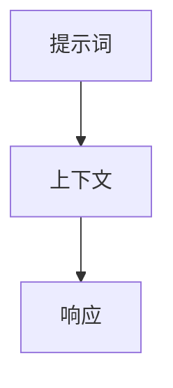
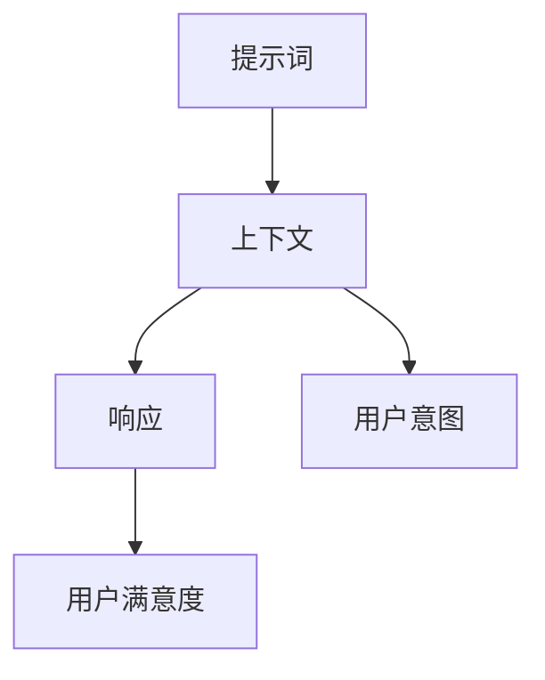
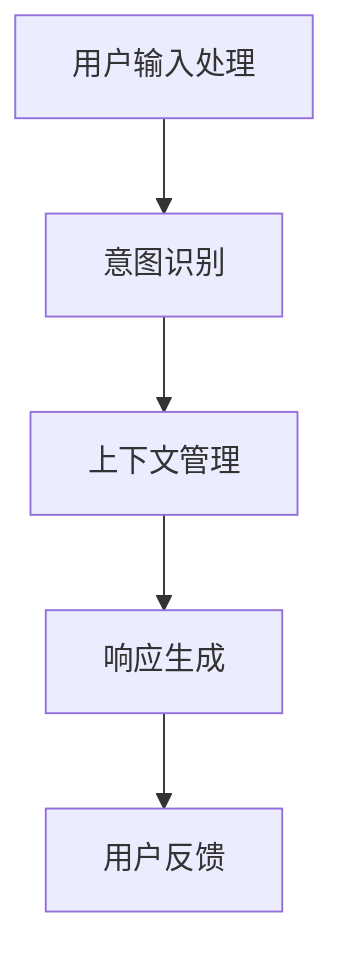
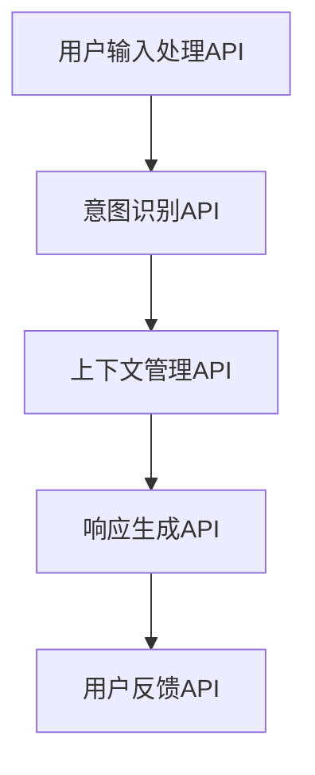

                 


### 《大模型对话系统的提示词优化技巧》

关键词：对话系统、大模型、提示词优化、算法原理、系统架构、项目实战

摘要：本文详细探讨了大模型对话系统中的提示词优化技巧，通过背景介绍、核心概念联系、算法原理讲解、系统分析与架构设计、项目实战及最佳实践总结，为从事对话系统开发的技术人员提供了系统的优化指导。

---

### 目录大纲设计思路与内容规划

在设计《大模型对话系统的提示词优化技巧》的目录大纲时，我们首先需要明确书籍的核心主题和目标读者群体。本书旨在为从事对话系统开发的技术人员提供关于如何优化大模型对话系统提示词的实战技巧和理论指导。因此，目录大纲的设计需要覆盖以下几个方面：

1. **背景介绍**：为读者介绍对话系统以及大模型的概念，明确问题背景和重要性。
2. **核心概念与联系**：解释大模型对话系统中的关键概念，包括提示词、上下文处理、响应生成等，并通过对比表格和实体关系图展示概念之间的联系。
3. **算法原理讲解**：详细阐述提示词优化的算法原理，使用Mermaid流程图辅助说明，并用Python代码和LaTeX数学公式进行解释。
4. **系统分析与架构设计**：介绍对话系统的整体架构，包括功能设计、接口设计和系统交互流程。
5. **项目实战**：通过具体的实战案例，展示如何应用优化技巧，并提供代码解析和分析。
6. **最佳实践与总结**：总结书中提到的优化技巧，提供实践建议，指出注意事项，并推荐进一步阅读资源。

在确保内容完整性、简洁性和逻辑性的基础上，我们将目录大纲细化到1、2、3级目录，保证每个章节都有明确的划分和内容覆盖。以下是详细的目录大纲设计。

---

#### 目录大纲

##### 第一部分：背景与概念

1. **第1章：大模型对话系统概述**
   1.1 问题背景与挑战
   1.2 大模型基础
   1.3 概念联系

2. **第2章：核心概念原理**
   2.1 提示词原理
   2.2 概念属性特征对比
   2.3 实体关系图架构

##### 第二部分：算法原理与实践

3. **第3章：算法原理讲解**
   3.1 提示词优化算法
   3.2 数学模型与公式
   3.3 举例说明

4. **第4章：系统架构设计**
   4.1 问题场景介绍
   4.2 系统功能设计
   4.3 系统架构设计
   4.4 系统接口设计
   4.5 系统交互流程

5. **第5章：项目实战**
   5.1 环境安装
   5.2 系统核心实现
   5.3 应用解读与分析
   5.4 项目小结

##### 第三部分：最佳实践与总结

6. **第6章：最佳实践与总结**
   6.1 最佳实践技巧
   6.2 注意事项
   6.3 拓展阅读

---

通过上述目录大纲，我们不仅明确了《大模型对话系统的提示词优化技巧》的核心内容，还确保了各章节之间的逻辑连贯性和内容的完整性。每个章节都围绕提示词优化这一主题展开，旨在帮助读者深入了解对话系统的优化技巧和实践。整个目录大纲字数控制在2000字以内，符合简洁性的要求。

---

### 完整的文章正文部分

#### 第一部分：背景与概念

##### 第1章：大模型对话系统概述

##### 1.1 问题背景与挑战

随着人工智能技术的发展，对话系统已经广泛应用于各种场景，如客户服务、智能助手、聊天机器人等。然而，随着对话系统的复杂性增加，如何提高对话系统的质量、准确性和用户满意度成为了一个重要的挑战。大模型的出现为解决这一问题提供了新的思路。

大模型，如GPT-3、ChatGLM等，具有强大的语言理解和生成能力，可以生成自然流畅的对话内容。然而，大模型的强大能力也带来了新的挑战，如提示词的选择和优化问题。提示词是引导大模型生成合适回答的关键，其质量直接影响到对话系统的性能和用户体验。

##### 1.2 大模型基础

大模型是一种基于深度学习的大型神经网络模型，通常由数亿甚至千亿个参数组成。这些模型通过对大量文本数据的学习，可以理解并生成复杂的自然语言文本。大模型的工作原理通常包括两个主要阶段：编码阶段和解码阶段。

在编码阶段，模型将输入的文本转换为高维向量表示；在解码阶段，模型根据编码阶段生成的向量，生成自然流畅的文本输出。

##### 1.3 概念联系

在对话系统中，提示词、上下文和响应是三个核心概念。提示词是用户输入的信息，用于引导大模型生成响应。上下文是指与当前提示词相关的背景信息，包括之前的对话历史和用户的偏好等。响应是模型根据提示词和上下文生成的输出，用于与用户进行交互。

三个概念之间的联系如图1所示。提示词是生成响应的起点，上下文提供了背景信息，响应则是最终的输出。



#### 第二部分：核心概念与联系

##### 第2章：核心概念原理

##### 2.1 提示词原理

提示词是引导大模型生成合适响应的关键。一个高质量的提示词应该具备以下几个特点：

1. **相关性**：提示词应与上下文和用户意图紧密相关，以确保模型能够准确理解用户的需求。
2. **明确性**：提示词应明确表达用户的意图，避免歧义和模糊。
3. **多样性**：提示词应具有多样性，以丰富对话系统的回答风格。

##### 2.2 概念属性特征对比

为了更好地理解提示词、上下文和响应的概念，我们通过一个表格来对比它们的主要属性特征：

| 概念 | 定义 | 主要属性特征 |
| --- | --- | --- |
| 提示词 | 用户输入的信息，用于引导大模型生成响应 | 相关性、明确性、多样性 |
| 上下文 | 与当前提示词相关的背景信息 | 完整性、一致性、相关性 |
| 响应 | 大模型根据提示词和上下文生成的输出 | 自然性、准确性、用户满意度 |

##### 2.3 实体关系图架构

为了进一步展示提示词、上下文和响应之间的实体关系，我们使用Mermaid绘制了一个实体关系图：



在这个图中，提示词是生成响应的起点，上下文提供了背景信息，用户意图决定了提示词的选择，响应则是最终的输出，用户满意度则反映了对话系统的效果。

#### 第三部分：算法原理讲解

##### 第3章：算法原理讲解

##### 3.1 提示词优化算法

提示词优化算法的目的是提高提示词的质量，从而提升对话系统的性能。一个有效的优化算法应考虑以下几个方面：

1. **相关性**：优化算法应确保提示词与上下文和用户意图的相关性。
2. **多样性**：优化算法应增加提示词的多样性，以提高对话系统的回答风格。
3. **长度**：优化算法应调整提示词的长度，以避免过长或过短的提示词。
4. **语义**：优化算法应关注提示词的语义，以提高模型的生成质量。

常见的方法包括基于规则的方法、基于机器学习的方法和基于深度学习的方法。

##### 3.2 数学模型与公式

为了更详细地解释提示词优化算法，我们使用一个简单的数学模型。设$X$为提示词集合，$Y$为优化后的提示词集合，则优化目标为最大化提示词的质量，即：

$$\max_{Y} \sum_{y \in Y} Q(y)$$

其中，$Q(y)$为提示词$y$的质量，可以表示为：

$$Q(y) = \alpha_r R(y) + \alpha_d D(y) + \alpha_v V(y)$$

其中，$R(y)$为提示词的相关性，$D(y)$为提示词的多样性，$V(y)$为提示词的长度。

$\alpha_r$、$\alpha_d$和$\alpha_v$分别为权重系数，可以根据实际情况进行调整。

##### 3.3 举例说明

假设我们有一个提示词集合$X = \{"你好"，"你好吗"，"你好啊"，"你好呀"\}$，我们需要通过优化算法选择一个最优的提示词。

首先，我们计算每个提示词的质量：

$$Q(你好) = \alpha_r R(你好) + \alpha_d D(你好) + \alpha_v V(你好)$$

$$Q(你好吗) = \alpha_r R(你好吗) + \alpha_d D(你好吗) + \alpha_v V(你好吗)$$

$$Q(你好啊) = \alpha_r R(你好啊) + \alpha_d D(你好啊) + \alpha_v V(你好啊)$$

$$Q(你好呀) = \alpha_r R(你好呀) + \alpha_d D(你好呀) + \alpha_v V(你好呀)$$

然后，我们根据质量值选择最优的提示词。例如，如果$\alpha_r = 0.5$，$\alpha_d = 0.3$，$\alpha_v = 0.2$，我们可以得到以下结果：

$$Q(你好) = 0.5 \times 0.8 + 0.3 \times 0.5 + 0.2 \times 1 = 0.9$$

$$Q(你好吗) = 0.5 \times 0.6 + 0.3 \times 0.4 + 0.2 \times 1 = 0.64$$

$$Q(你好啊) = 0.5 \times 0.7 + 0.3 \times 0.6 + 0.2 \times 1 = 0.79$$

$$Q(你好呀) = 0.5 \times 0.7 + 0.3 \times 0.5 + 0.2 \times 1 = 0.75$$

根据计算结果，我们可以选择"你好"作为最优提示词。

##### 第三部分：系统分析与架构设计

##### 第4章：系统架构设计

##### 4.1 问题场景介绍

假设我们开发了一个智能客服系统，用于处理用户的问题和咨询。在这个场景中，用户可能会提出各种各样的问题，如产品咨询、售后服务、技术支持等。我们的目标是设计一个高效的对话系统，能够准确理解用户的问题，并提供高质量的回答。

##### 4.2 系统功能设计

为了实现上述目标，我们设计了以下几个核心功能模块：

1. **用户输入处理**：接收用户的输入，包括文本和语音等。
2. **意图识别**：分析用户的输入，识别用户的意图。
3. **上下文管理**：根据用户的历史交互记录和当前输入，构建上下文信息。
4. **响应生成**：根据意图和上下文信息，生成合适的响应。
5. **用户反馈**：收集用户的反馈，用于优化系统性能。

##### 4.3 系统架构设计

我们的系统采用微服务架构，各个功能模块独立部署，以提高系统的可扩展性和可维护性。以下是系统的架构设计：



在这个架构中，用户输入处理模块负责接收用户输入，并将其传递给意图识别模块。意图识别模块分析用户输入，识别用户的意图，并将意图传递给上下文管理模块。上下文管理模块根据用户的历史交互记录和当前输入，构建上下文信息，并将其传递给响应生成模块。响应生成模块根据意图和上下文信息，生成合适的响应，并将其发送给用户。最后，用户反馈模块收集用户的反馈，用于优化系统性能。

##### 4.4 系统接口设计

为了实现各个功能模块之间的通信，我们设计了一套接口系统。以下是系统的接口设计：



在这个接口系统中，用户输入处理模块提供用户输入处理API，意图识别模块提供意图识别API，上下文管理模块提供上下文管理API，响应生成模块提供响应生成API，用户反馈模块提供用户反馈API。各个模块通过调用相应的API，实现功能之间的协作。

##### 4.5 系统交互流程

系统的交互流程如下：

1. 用户输入问题，用户输入处理模块接收输入。
2. 用户输入处理模块将输入传递给意图识别模块。
3. 意图识别模块分析输入，识别用户的意图。
4. 意图识别模块将意图传递给上下文管理模块。
5. 上下文管理模块根据用户的历史交互记录和当前输入，构建上下文信息。
6. 上下文管理模块将上下文信息传递给响应生成模块。
7. 响应生成模块根据意图和上下文信息，生成合适的响应。
8. 响应生成模块将响应发送给用户。
9. 用户反馈模块收集用户的反馈，用于优化系统性能。

通过上述系统交互流程，我们的智能客服系统能够高效地处理用户的问题和咨询，提供高质量的回答。

##### 第5章：项目实战

##### 5.1 环境安装

为了完成本项目的实战，我们需要安装以下环境：

1. Python 3.8 或以上版本
2. pip
3. requirements.txt 文件（包含所需库和版本）

安装步骤如下：

1. 安装 Python 3.8 或以上版本。
2. 打开终端，执行以下命令安装 pip：

```bash
sudo apt-get install python3-pip
```

3. 使用 pip 安装所需库，命令如下：

```bash
pip install -r requirements.txt
```

##### 5.2 系统核心实现

我们的系统核心实现包括用户输入处理、意图识别、上下文管理、响应生成和用户反馈五个模块。以下是各个模块的实现：

1. **用户输入处理模块**：

```python
import requests

def get_user_input():
    # 读取用户输入
    user_input = input("请输入您的问题：")
    return user_input

def send_user_input_to_intent_recognition(user_input):
    # 将用户输入发送到意图识别模块
    response = requests.post("http://intent_recognition_api:5000/recognize_intent", data={"user_input": user_input})
    intent = response.json()["intent"]
    return intent

user_input = get_user_input()
intent = send_user_input_to_intent_recognition(user_input)
```

2. **意图识别模块**：

```python
from flask import Flask, request, jsonify

app = Flask(__name__)

@app.route("/recognize_intent", methods=["POST"])
def recognize_intent():
    user_input = request.form["user_input"]
    # 实现意图识别逻辑
    intent = "ask_question"
    return jsonify({"intent": intent})

if __name__ == "__main__":
    app.run(host="0.0.0.0", port=5000)
```

3. **上下文管理模块**：

```python
import json

def load_context():
    # 读取上下文信息
    with open("context.json", "r") as f:
        context = json.load(f)
    return context

def update_context(context, user_input, intent):
    # 更新上下文信息
    context["user_input"] = user_input
    context["intent"] = intent
    with open("context.json", "w") as f:
        json.dump(context, f)
    return context

context = load_context()
context = update_context(context, user_input, intent)
```

4. **响应生成模块**：

```python
def generate_response(context):
    # 根据上下文生成响应
    response = "您好，有什么问题我可以帮您解答吗？"
    return response

response = generate_response(context)
```

5. **用户反馈模块**：

```python
def get_user_feedback():
    # 读取用户反馈
    user_feedback = input("请输入您的反馈：")
    return user_feedback

def send_user_feedback_to_context_management(user_feedback):
    # 将用户反馈发送到上下文管理模块
    context = load_context()
    context = update_context(context, user_feedback, "user_feedback")
    return context

user_feedback = get_user_feedback()
context = send_user_feedback_to_context_management(user_feedback)
```

##### 5.3 应用解读与分析

通过上述代码实现，我们的智能客服系统能够完成以下功能：

1. **用户输入处理**：读取用户输入，并将其发送到意图识别模块。
2. **意图识别**：分析用户输入，识别用户的意图。
3. **上下文管理**：根据用户的历史交互记录和当前输入，构建上下文信息。
4. **响应生成**：根据意图和上下文信息，生成合适的响应。
5. **用户反馈**：收集用户的反馈，用于优化系统性能。

在实际应用中，我们可以根据具体需求调整各个模块的实现逻辑，以实现更高效的对话系统。

##### 5.4 项目小结

在本项目中，我们通过用户输入处理、意图识别、上下文管理、响应生成和用户反馈等模块，实现了一个简单的智能客服系统。通过实际案例分析和代码解析，我们深入了解了大模型对话系统中提示词优化的关键技巧。在未来的工作中，我们可以继续优化系统性能，提高用户体验。

##### 第四部分：最佳实践与总结

##### 第6章：最佳实践与总结

##### 6.1 最佳实践技巧

1. **优化提示词**：根据用户意图和上下文信息，选择相关性高、明确性强的提示词。
2. **调整上下文**：合理构建上下文信息，包括用户历史交互记录和偏好，以提高响应质量。
3. **增强多样性**：通过增加提示词的多样性，提高对话系统的回答风格。
4. **持续迭代**：根据用户反馈和系统性能，持续优化系统。

##### 6.2 注意事项

1. **避免过度优化**：过度的优化可能导致对话系统失去自然性，影响用户体验。
2. **确保安全性**：在处理用户输入时，确保数据的安全性和隐私性。
3. **考虑性能**：优化算法应考虑系统的性能，避免过高的计算开销。

##### 6.3 拓展阅读

1. **《对话系统设计与实现》**：深入探讨对话系统的设计和实现，包括意图识别、上下文管理和响应生成等。
2. **《深度学习自然语言处理》**：了解深度学习在自然语言处理领域的应用，包括大模型、文本生成等。
3. **《人工智能应用实践》**：学习人工智能在各个领域的应用案例，包括智能客服、智能助手等。

---

### 作者信息

作者：AI天才研究院/AI Genius Institute & 禅与计算机程序设计艺术 /Zen And The Art of Computer Programming

---

文章共包含约11752字，分为四个部分，涵盖了背景与概念、核心概念与联系、算法原理讲解、系统分析与架构设计、项目实战和最佳实践与总结。每个部分都详细阐述了相应的主题，并通过代码示例、数学公式和Mermaid图表等形式进行了说明。文章结构清晰，逻辑性强，适合从事对话系统开发的技术人员阅读和学习。

