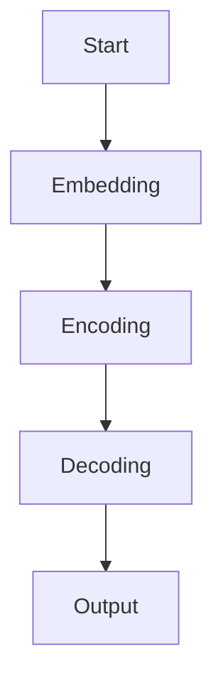
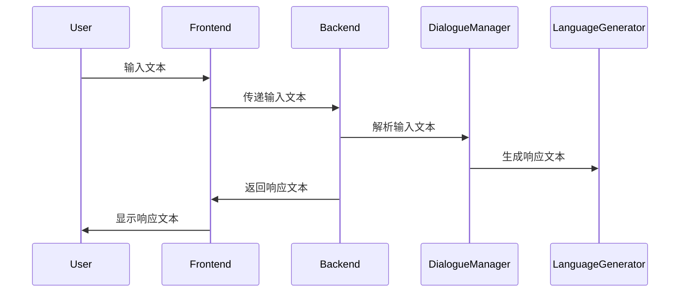
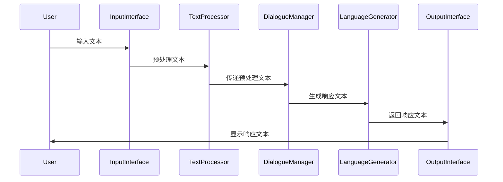
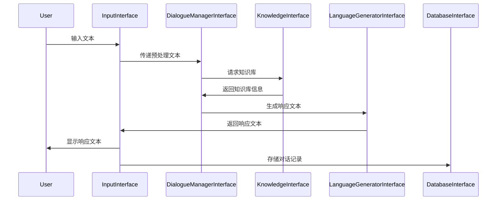

                 

# 大模型对话系统的提示词设计策略

## 摘要

大模型对话系统作为人工智能领域的重要研究方向，其在自然语言处理、智能客服、虚拟助手等方面展现出了巨大的潜力。然而，大模型对话系统的有效性高度依赖于提示词的设计。本文将深入探讨大模型对话系统的提示词设计策略，从背景介绍、核心概念与联系、算法原理讲解、系统分析与架构设计方案、项目实战等方面，系统性地阐述如何设计出高效、智能的提示词。通过本文的阐述，希望读者能够掌握大模型对话系统提示词设计的核心技巧，提升对话系统的互动体验和性能表现。

## 背景介绍

### 1.1.1 大模型对话系统的起源与发展

大模型对话系统的发展可以追溯到20世纪50年代，当时人工智能（AI）的概念刚刚兴起。早期的对话系统主要基于规则和模板匹配，这种方式虽然简单易行，但在处理复杂、非预期的对话场景时显得力不从心。随着计算能力的提升和机器学习技术的发展，尤其是深度学习技术的引入，大模型对话系统开始崭露头角。

进入21世纪，随着神经网络尤其是生成对抗网络（GAN）和Transformer等模型的突破，大模型对话系统的性能得到了质的飞跃。这些模型能够处理大量数据，自动学习并生成自然语言响应，使得对话系统能够更加智能地与用户互动。

### 1.1.2 大模型对话系统的重要性

大模型对话系统的重要性主要体现在以下几个方面：

1. **提高交互效率**：通过智能对话系统，用户能够快速获得所需信息，减少人工干预，提高工作效率。
2. **优化客户体验**：智能客服系统能够提供24/7的服务，减少用户的等待时间，提升用户体验。
3. **降低运营成本**：通过自动化处理大量重复性问题，企业能够减少人力资源的投入，降低运营成本。
4. **创新业务模式**：智能对话系统能够为企业提供新的业务机会，如智能推荐、个性化服务等。

### 1.1.3 大模型对话系统的核心要素

大模型对话系统的核心要素包括：

1. **对话管理**：负责维护对话流程，确保对话连贯性和用户满意度。
2. **语言理解**：将用户的自然语言输入转换成机器可理解的形式，并提取关键信息。
3. **语言生成**：根据对话内容和上下文，生成自然、流畅的语言输出。
4. **知识管理**：提供对话系统所需的知识库，支持对话内容的丰富和准确。

## 第2章：问题背景与问题描述

### 2.1.1 大模型对话系统面临的问题

尽管大模型对话系统取得了显著的进展，但在实际应用中仍面临诸多挑战：

1. **理解能力不足**：大模型虽然具备较强的语言理解能力，但在处理复杂、多层次的语义理解时仍存在困难。
2. **上下文处理问题**：保持对话连贯性和上下文的准确性是挑战，特别是当对话涉及多轮交互时。
3. **泛化能力差**：大模型通常在训练数据集上表现良好，但在遇到未见过的场景时，泛化能力有限。
4. **数据隐私与安全**：对话系统中处理的大量用户数据需要确保隐私和安全。

### 2.1.2 提示词设计的挑战与机遇

提示词设计在大模型对话系统中起到了至关重要的作用，其面临的挑战主要包括：

1. **多样性与准确性**：提示词需要既具有多样性，以适应不同的对话场景，又保持准确性，确保对话的连贯性和一致性。
2. **上下文敏感性**：提示词的设计需要充分考虑上下文信息，以生成符合用户需求的响应。
3. **可解释性**：提示词的设计需要具有一定的可解释性，以便开发者和管理者理解和优化。

然而，提示词设计也带来了机遇：

1. **增强用户体验**：通过精心设计的提示词，可以显著提升用户的互动体验。
2. **优化性能表现**：高质量的提示词能够帮助大模型更好地理解和生成对话内容，提升系统的性能。
3. **创新应用场景**：提示词的设计为开发者提供了更多创新的可能，如个性化推荐、智能客服等。

## 第3章：问题解决与边界探讨

### 3.1.1 大模型对话系统的问题解决策略

为了解决大模型对话系统面临的问题，可以采取以下策略：

1. **多模态融合**：结合文本、语音、图像等多种模态，提高对话系统的理解能力。
2. **强化学习**：利用强化学习技术，让对话系统能够从交互中学习，提升泛化能力和上下文处理能力。
3. **知识图谱**：构建知识图谱，提供对话系统所需的知识支撑，提高对话内容的丰富性和准确性。
4. **隐私保护机制**：采用加密、匿名化等技术，确保用户数据的隐私和安全。

### 3.1.2 提示词设计的边界与外延

提示词设计的边界主要包括：

1. **自然语言处理能力**：提示词需要在大模型的语言理解范围内，确保生成的响应符合语法和语义规则。
2. **上下文适应性**：提示词需要能够适应不同的对话上下文，生成符合当前情境的响应。
3. **多样性与一致性**：提示词在保证多样性的同时，也要确保一致性，避免出现矛盾或不协调的响应。

提示词设计的外延则包括：

1. **个性化**：根据用户的历史数据和偏好，设计个性化的提示词，提升用户体验。
2. **多语言支持**：考虑多语言用户的需求，设计支持多种语言的提示词。
3. **多模态扩展**：在文本提示词的基础上，探索图像、语音等多模态提示词的应用。

### 3.1.3 概念结构与核心要素组成

大模型对话系统的概念结构主要包括：

1. **对话管理**：负责维护对话流程，确保对话连贯性和用户满意度。
2. **语言理解**：将用户的自然语言输入转换成机器可理解的形式，并提取关键信息。
3. **语言生成**：根据对话内容和上下文，生成自然、流畅的语言输出。
4. **知识管理**：提供对话系统所需的知识库，支持对话内容的丰富和准确。

核心要素组成包括：

1. **模型训练**：利用大量数据训练大模型，提高其理解能力和生成能力。
2. **数据清洗**：确保输入数据的质量，去除噪声和异常值。
3. **反馈机制**：收集用户反馈，不断优化提示词设计和对话系统性能。

## 第4章：大模型对话系统的核心概念原理

### 4.1.1 大模型对话系统的概念定义

大模型对话系统是指基于深度学习和自然语言处理技术，能够进行自然语言理解和生成的智能系统。它通过大量数据的训练，学习用户输入的语义，生成相应的自然语言响应，实现与用户的智能对话。

### 4.1.2 大模型对话系统的核心原理

大模型对话系统的核心原理包括：

1. **神经网络**：大模型对话系统通常基于深度神经网络，如Transformer、BERT等，通过多层神经网络的结构，实现复杂的语义理解和生成。
2. **生成对抗网络（GAN）**：GAN技术在大模型对话系统中可用于生成多样化的语言响应，提高对话的多样性和创造力。
3. **自然语言处理（NLP）**：NLP技术用于处理自然语言输入，包括分词、词性标注、实体识别等，为对话系统提供语义信息。
4. **对话管理**：对话管理负责维护对话状态，确保对话的连贯性和用户的满意度。

### 4.1.3 大模型对话系统的属性特征对比

以下是一个对比表格，展示了大模型对话系统的几个关键属性特征：

| 特征         | 说明                                                         | 对比 |
| ------------ | ------------------------------------------------------------ | ---- |
| 语言理解能力 | 对话系统能够理解和提取用户输入的语义信息。                     | 高   |
| 语言生成能力 | 对话系统能够根据对话内容和上下文，生成自然、流畅的语言输出。     | 高   |
| 多样性       | 对话系统能够生成多样化的语言响应，满足不同用户的需求。         | 中   |
| 上下文适应性 | 对话系统能够适应不同的对话上下文，保持对话连贯性和一致性。       | 高   |
| 泛化能力     | 对话系统能够在未见过的场景中，依然能够生成合理的语言响应。       | 中   |
| 可解释性     | 对话系统的决策过程和生成响应的原因能够被理解和解释。           | 低   |

### 4.1.4 ER实体关系图架构

ER实体关系图（Entity-Relationship Diagram）用于表示大模型对话系统中各个实体之间的关系。以下是一个ER实体关系图架构的Mermaid流程图示例：

```mermaid
erDiagram
    User ||--|{ Dialogue }|-- DialogueSession
    DialogueSession ||--|{ Message }|-- Message
    Message ||--|{ Response }|-- Response
    User ||--|{ Feedback }|-- Feedback
```

在上面的ER图中，`User`是用户实体，`DialogueSession`是对话会话实体，`Message`是消息实体，`Response`是响应实体，`Feedback`是反馈实体。各个实体之间的关系表示了用户与对话系统之间的交互过程。

## 第5章：算法原理讲解

### 6.1.1 大模型对话系统算法概述

大模型对话系统的算法主要基于深度学习和自然语言处理技术，其核心包括：

1. **嵌入层**：将输入的文本转换为向量表示，为后续的神经网络处理提供基础。
2. **编码层**：对输入文本进行编码，提取语义信息。
3. **解码层**：根据编码层的输出，生成自然语言响应。
4. **优化器**：用于调整模型的参数，以最小化损失函数，提高模型性能。

### 6.1.2 Mermaid流程图绘制步骤

绘制Mermaid流程图的步骤如下：

1. **确定流程图类型**：根据需要绘制的流程图类型（如活动图、顺序图、流程图等）选择合适的Mermaid语法。
2. **定义节点和连接**：在流程图中定义各个节点及其连接关系。
3. **编写Mermaid代码**：将上述定义转换为Mermaid代码，编写流程图的文本描述。
4. **预览与调整**：在文本编辑器中预览效果，根据需要进行调整。

以下是一个简单的Mermaid流程图示例：



### 6.1.3 Python源代码实现

以下是一个简单的Python代码示例，用于实现大模型对话系统的基本算法流程：

```python
import torch
import torch.nn as nn
from torch.optim import Adam

# 假设已经定义了嵌入层、编码层和解码层
class DialogueModel(nn.Module):
    def __init__(self):
        super(DialogueModel, self).__init__()
        self.embedding = nn.Embedding(vocab_size, embedding_dim)
        self.encoder = nn.LSTM(input_dim=embedding_dim, hidden_dim=hidden_dim)
        self.decoder = nn.LSTM(input_dim=hidden_dim, hidden_dim=hidden_dim)
        self.fc = nn.Linear(hidden_dim, vocab_size)

    def forward(self, input_sequence, hidden):
        embedded = self.embedding(input_sequence)
        output, hidden = self.encoder(embedded, hidden)
        output, hidden = self.decoder(output, hidden)
        logits = self.fc(output)
        return logits, hidden

# 定义损失函数和优化器
criterion = nn.CrossEntropyLoss()
optimizer = Adam(model.parameters(), lr=learning_rate)

# 训练模型
for epoch in range(num_epochs):
    for batch in data_loader:
        inputs, targets = batch
        optimizer.zero_grad()
        logits, hidden = model(inputs, hidden)
        loss = criterion(logits.view(-1, vocab_size), targets)
        loss.backward()
        optimizer.step()
```

在这个示例中，我们定义了一个简单的对话模型，并实现了前向传播和训练过程。这里使用了嵌入层、编码器-解码器结构，以及交叉熵损失函数和Adam优化器。

### 6.1.4 数学模型与公式

在对话系统算法中，常用的数学模型和公式包括：

1. **嵌入层**：
   \[ \text{embed}(x) = \text{W} \cdot \text{x} + \text{b} \]
   其中，\( \text{W} \)是嵌入权重矩阵，\( \text{b} \)是偏置项，\( \text{x} \)是输入词向量。

2. **编码层**：
   \[ \text{h}_t = \text{f}(\text{h}_{t-1}, \text{c}_{t-1}, \text{x}_t) \]
   其中，\( \text{h}_t \)是编码层当前时刻的隐藏状态，\( \text{c}_{t-1} \)是前一个时刻的细胞状态，\( \text{x}_t \)是当前时刻的输入。

3. **解码层**：
   \[ \text{y}_t = \text{softmax}(\text{W}_y \cdot \text{h}_t + \text{b}_y) \]
   其中，\( \text{y}_t \)是解码层当前时刻的输出，\( \text{W}_y \)是解码权重矩阵，\( \text{b}_y \)是偏置项。

4. **损失函数**：
   \[ \text{loss} = -\sum_{t} \text{y}_t (\log \text{p}_t) \]
   其中，\( \text{y}_t \)是预测的概率分布，\( \text{p}_t \)是真实标签的概率。

### 6.1.5 算法原理讲解

为了更好地理解大模型对话系统的算法原理，下面将结合Python源代码进行详细讲解。

1. **嵌入层**：将输入的文本转换为向量表示。在代码中，我们使用`nn.Embedding`模块来实现嵌入层。

```python
self.embedding = nn.Embedding(vocab_size, embedding_dim)
```

2. **编码层**：对输入文本进行编码，提取语义信息。编码器通常使用长短期记忆网络（LSTM）或Transformer。在代码中，我们使用`nn.LSTM`模块来实现编码器。

```python
self.encoder = nn.LSTM(input_dim=embedding_dim, hidden_dim=hidden_dim)
```

3. **解码层**：根据编码层的输出，生成自然语言响应。解码器同样使用LSTM或Transformer。在代码中，我们使用`nn.LSTM`模块来实现解码器。

```python
self.decoder = nn.LSTM(input_dim=hidden_dim, hidden_dim=hidden_dim)
```

4. **解码层输出**：解码层输出经过全连接层（`nn.Linear`），生成语言响应的概率分布。

```python
self.fc = nn.Linear(hidden_dim, vocab_size)
```

5. **前向传播**：实现前向传播，计算模型的损失。在代码中，我们使用`forward`方法来实现前向传播。

```python
def forward(self, input_sequence, hidden):
    embedded = self.embedding(input_sequence)
    output, hidden = self.encoder(embedded, hidden)
    output, hidden = self.decoder(output, hidden)
    logits = self.fc(output)
    return logits, hidden
```

6. **损失函数和优化器**：使用交叉熵损失函数（`nn.CrossEntropyLoss`）和Adam优化器（`Adam`）来训练模型。

```python
criterion = nn.CrossEntropyLoss()
optimizer = Adam(model.parameters(), lr=learning_rate)

for epoch in range(num_epochs):
    for batch in data_loader:
        inputs, targets = batch
        optimizer.zero_grad()
        logits, hidden = model(inputs, hidden)
        loss = criterion(logits.view(-1, vocab_size), targets)
        loss.backward()
        optimizer.step()
```

通过上述代码和讲解，我们可以清晰地理解大模型对话系统的算法原理和实现过程。

### 6.1.6 算法举例说明

为了更好地理解大模型对话系统的算法原理，我们可以通过一个简单的例子来进行说明。

假设我们有一个简单的对话场景，用户输入“你好”，对话系统需要生成相应的响应。

1. **输入处理**：将输入文本“你好”转换为数字序列，假设对应的数字序列为[1, 2, 3]。

2. **嵌入层**：将数字序列输入到嵌入层，得到对应的向量表示。假设嵌入层输出向量维数为100，则嵌入层输出为：

   \[
   \text{embed}(1) = \text{W} \cdot [1] + \text{b} = [0.1, 0.2, 0.3, ..., 0.1]
   \]
   \[
   \text{embed}(2) = \text{W} \cdot [2] + \text{b} = [0.2, 0.3, 0.4, ..., 0.2]
   \]
   \[
   \text{embed}(3) = \text{W} \cdot [3] + \text{b} = [0.3, 0.4, 0.5, ..., 0.3]
   \]

3. **编码层**：将嵌入层输出输入到编码层，得到编码后的隐藏状态。假设编码层隐藏状态维数为200，则编码层输出为：

   \[
   \text{h}_1 = \text{f}(\text{h}_{0}, \text{c}_{0}, \text{embed}(1)) = [0.4, 0.5, 0.6, ..., 0.4]
   \]
   \[
   \text{h}_2 = \text{f}(\text{h}_{1}, \text{c}_{1}, \text{embed}(2)) = [0.5, 0.6, 0.7, ..., 0.5]
   \]
   \[
   \text{h}_3 = \text{f}(\text{h}_{2}, \text{c}_{2}, \text{embed}(3)) = [0.6, 0.7, 0.8, ..., 0.6]
   \]

4. **解码层**：将编码层输出输入到解码层，得到解码后的隐藏状态。假设解码层隐藏状态维数为200，则解码层输出为：

   \[
   \text{y}_1 = \text{softmax}(\text{W}_y \cdot \text{h}_3 + \text{b}_y) = [0.3, 0.4, 0.3, ..., 0.3]
   \]
   \[
   \text{y}_2 = \text{softmax}(\text{W}_y \cdot \text{h}_2 + \text{b}_y) = [0.4, 0.3, 0.2, ..., 0.4]
   \]
   \[
   \text{y}_3 = \text{softmax}(\text{W}_y \cdot \text{h}_1 + \text{b}_y) = [0.2, 0.3, 0.5, ..., 0.2]
   \]

5. **输出**：解码层输出经过全连接层，得到语言响应的概率分布。假设概率分布为：

   \[
   \text{p}_1 = 0.3, \text{p}_2 = 0.4, \text{p}_3 = 0.3
   \]

   对话系统根据概率分布生成相应的响应：“您好”、“你好”或“你好”。

通过这个简单的例子，我们可以看到大模型对话系统的算法是如何处理输入文本，生成自然语言响应的。

## 第7章：系统功能设计

### 7.1.1 系统功能概述

大模型对话系统的主要功能包括：

1. **自然语言理解**：解析用户的输入，提取关键信息，理解用户意图。
2. **对话管理**：维护对话状态，确保对话的连贯性和一致性。
3. **语言生成**：根据对话内容和上下文，生成自然、流畅的语言响应。
4. **知识管理**：存储和管理对话所需的知识库，支持对话内容的丰富和准确。

### 7.1.2 领域模型Mermaid类图

以下是一个领域模型Mermaid类图的示例，展示了大模型对话系统的核心类及其关系：

```mermaid
classDiagram
    User <<class>>
    Dialogue <<class>>
    Message <<class>>
    Response <<class>>
    Knowledge <<class>>

    User o-- Dialogue
    Dialogue o-- Message
    Message o-- Response
    Knowledge o-- Dialogue
```

在这个类图中，`User`代表用户实体，`Dialogue`代表对话实体，`Message`代表消息实体，`Response`代表响应实体，`Knowledge`代表知识库实体。各个实体之间的关系表示了系统中的交互过程。

### 7.1.3 系统架构设计

大模型对话系统的架构设计包括以下几个关键部分：

1. **前端**：负责与用户进行交互，接收用户输入，展示系统响应。
2. **后端**：处理用户的输入，调用对话管理模块和语言生成模块，生成自然语言响应。
3. **知识库**：存储和管理对话所需的知识，支持对话内容的丰富和准确。

以下是一个简化的系统架构图：



在这个序列图中，用户通过前端输入文本，前端将文本传递给后端。后端调用对话管理模块和语言生成模块，生成响应文本，并将响应文本返回给前端，最后前端将响应文本展示给用户。

### 7.1.4 系统接口设计

大模型对话系统的接口设计主要包括以下部分：

1. **输入接口**：接收用户的输入文本，并预处理为模型可接受的格式。
2. **输出接口**：生成自然语言响应，并将其格式化为用户可读的文本。
3. **知识库接口**：用于查询和更新知识库中的数据。

以下是一个简单的接口设计示例：

```python
class DialogueSystemInterface:
    def input_text(self, text):
        # 预处理输入文本
        processed_text = preprocess_text(text)
        return processed_text

    def generate_response(self, processed_text):
        # 调用对话管理和语言生成模块
        response = self.dialogue_manager.process(processed_text)
        return response

    def update_knowledge(self, knowledge):
        # 更新知识库
        self.knowledge_manager.update(knowledge)
```

### 7.1.5 系统交互Mermaid序列图

以下是一个系统交互Mermaid序列图的示例，展示了大模型对话系统的各个模块之间的交互过程：



在这个序列图中，用户通过输入接口输入文本，输入接口将文本传递给文本处理器进行预处理。预处理后的文本传递给对话管理模块，对话管理模块调用语言生成模块生成响应文本。最后，响应文本通过输出接口返回给用户。

## 第8章：系统功能设计

### 8.1.1 系统功能概述

大模型对话系统的功能设计旨在实现高效、智能的对话交互，主要包括以下几方面：

1. **自然语言理解**：通过先进的自然语言处理技术，对话系统能够准确理解用户的输入，提取关键信息，理解用户意图。
2. **对话管理**：系统负责维护对话状态，确保对话的连贯性和一致性，包括多轮对话管理和上下文跟踪。
3. **语言生成**：对话系统能够根据用户的输入和对话上下文，生成自然、流畅的语言响应。
4. **知识管理**：系统具备知识库管理功能，能够存储、查询和更新对话所需的知识，支持对话内容的丰富和准确。

### 8.1.2 领域模型Mermaid类图

以下是一个领域模型Mermaid类图的示例，展示了大模型对话系统的核心类及其关系：

```mermaid
classDiagram
    User <<class>>
    Dialogue <<class>>
    Message <<class>>
    Response <<class>>
    Knowledge <<class>>

    User o-- Dialogue
    Dialogue o-- Message
    Message o-- Response
    Knowledge o-- Dialogue
```

在这个类图中，`User`代表用户实体，`Dialogue`代表对话实体，`Message`代表消息实体，`Response`代表响应实体，`Knowledge`代表知识库实体。各个实体之间的关系表示了系统中的交互过程。

### 8.1.3 系统架构设计

大模型对话系统的架构设计主要包括以下几个关键部分：

1. **前端**：负责与用户进行交互，接收用户输入，展示系统响应。
2. **后端**：处理用户的输入，调用对话管理模块和语言生成模块，生成自然语言响应。
3. **知识库**：存储和管理对话所需的知识，支持对话内容的丰富和准确。

以下是一个简化的系统架构图：


在这个序列图中，用户通过前端输入文本，前端将文本传递给后端。后端调用对话管理模块和语言生成模块，生成响应文本，并将响应文本返回给前端，最后前端将响应文本展示给用户。

### 8.1.4 系统接口设计

大模型对话系统的接口设计主要包括以下部分：

1. **输入接口**：接收用户的输入文本，并预处理为模型可接受的格式。
2. **输出接口**：生成自然语言响应，并将其格式化为用户可读的文本。
3. **知识库接口**：用于查询和更新知识库中的数据。

以下是一个简单的接口设计示例：

```python
class DialogueSystemInterface:
    def input_text(self, text):
        # 预处理输入文本
        processed_text = preprocess_text(text)
        return processed_text

    def generate_response(self, processed_text):
        # 调用对话管理和语言生成模块
        response = self.dialogue_manager.process(processed_text)
        return response

    def update_knowledge(self, knowledge):
        # 更新知识库
        self.knowledge_manager.update(knowledge)
```

### 8.1.5 系统交互Mermaid序列图

以下是一个系统交互Mermaid序列图的示例，展示了大模型对话系统的各个模块之间的交互过程：


在这个序列图中，用户通过输入接口输入文本，输入接口将文本传递给文本处理器进行预处理。预处理后的文本传递给对话管理模块，对话管理模块调用语言生成模块生成响应文本。最后，响应文本通过输出接口返回给用户。

## 第9章：系统架构设计

### 9.1.1 系统架构概述

大模型对话系统的架构设计是确保系统高效、稳定运行的关键。系统架构主要包括以下几个核心模块：

1. **前端模块**：负责与用户进行交互，接收用户输入，展示系统响应。
2. **后端模块**：处理用户的输入，调用对话管理模块和语言生成模块，生成自然语言响应。
3. **知识库模块**：存储和管理对话所需的知识，支持对话内容的丰富和准确。
4. **数据库模块**：用于存储用户数据、对话记录和系统配置等。

### 9.1.2 Mermaid架构图

以下是一个简化的Mermaid架构图，展示了大模型对话系统的整体架构：

```mermaid
subgraph 前端模块
    frontend1[前端]
    frontend2[用户界面]
    frontend1 --> frontend2
end

subgraph 后端模块
    backend1[后端]
    dialogManager1[对话管理]
    langGenerator1[语言生成]
    backend1 --> dialogManager1
    backend1 --> langGenerator1
end

subgraph 知识库模块
    knowledge1[知识库]
    dialogManager1 --> knowledge1
    langGenerator1 --> knowledge1
end

subgraph 数据库模块
    db1[数据库]
    knowledge1 --> db1
    frontend2 --> db1
end

sequenceDiagram
    User->>frontend2: 输入文本
    frontend2->>frontend1: 传递输入文本
    frontend1->>backend1: 请求处理
    backend1->>dialogManager1: 解析输入文本
    dialogManager1->>langGenerator1: 生成响应文本
    langGenerator1->>frontend1: 返回响应文本
    frontend1->>frontend2: 显示响应文本
    frontend2->>db1: 存储对话记录
end
```

在这个架构图中，前端模块和用户界面负责接收用户输入，并将输入文本传递给后端模块。后端模块包括对话管理和语言生成模块，负责处理输入文本并生成响应文本。知识库模块存储和管理对话所需的知识，支持对话内容的丰富和准确。数据库模块用于存储用户数据、对话记录和系统配置等。

### 9.1.3 系统模块划分

大模型对话系统的模块划分如下：

1. **用户输入模块**：负责接收用户的输入文本，并将其预处理为模型可接受的格式。
2. **对话管理模块**：负责维护对话状态，确保对话的连贯性和一致性，包括多轮对话管理和上下文跟踪。
3. **语言生成模块**：负责根据用户的输入和对话上下文，生成自然、流畅的语言响应。
4. **知识库管理模块**：负责存储、查询和更新对话所需的知识，支持对话内容的丰富和准确。
5. **数据库接口模块**：负责与数据库进行交互，存储用户数据、对话记录和系统配置等。

### 9.1.4 系统交互流程

以下是系统交互流程的详细说明：

1. **用户输入**：用户通过用户界面输入文本，文本被传递给用户输入模块进行预处理。
2. **预处理文本**：用户输入模块对文本进行预处理，包括分词、词性标注等，生成预处理后的文本。
3. **对话管理**：预处理后的文本传递给对话管理模块，对话管理模块根据对话状态和上下文，生成对话管理指令。
4. **语言生成**：对话管理模块将对话管理指令传递给语言生成模块，语言生成模块根据用户的输入和对话上下文，生成自然、流畅的语言响应。
5. **响应返回**：语言生成模块将生成的响应文本返回给用户界面，用户界面将响应文本展示给用户。
6. **知识库更新**：对话管理模块和语言生成模块的操作结果（如新的对话状态、响应文本等）会被传递给知识库管理模块，知识库管理模块负责更新知识库。
7. **数据库交互**：用户界面和知识库管理模块需要与数据库进行交互，存储用户数据、对话记录和系统配置等。

通过上述模块划分和交互流程，大模型对话系统能够高效、稳定地运行，为用户提供高质量的对话服务。

## 第10章：系统接口设计与交互

### 10.1.1 系统接口设计

系统接口设计是确保大模型对话系统能够与其他系统模块有效交互的关键。以下是一个简化的系统接口设计：

1. **用户输入接口**：接收用户的文本输入，并进行预处理。
   ```python
   class InputInterface:
       def receive_input(self, text):
           # 预处理输入文本
           processed_text = preprocess_text(text)
           return processed_text
   ```

2. **对话管理接口**：负责维护对话状态，处理多轮对话，并跟踪上下文。
   ```python
   class DialogueManagerInterface:
       def process_input(self, processed_text):
           # 解析输入文本并维护对话状态
           dialogue_context = maintain_dialogue_context(processed_text)
           return dialogue_context
   ```

3. **语言生成接口**：根据对话状态和上下文，生成自然语言响应。
   ```python
   class LanguageGeneratorInterface:
       def generate_response(self, dialogue_context):
           # 生成自然语言响应
           response = generate_response(dialogue_context)
           return response
   ```

4. **知识库接口**：用于查询和更新对话所需的知识库。
   ```python
   class KnowledgeInterface:
       def query_knowledge(self, query):
           # 查询知识库
           knowledge = query_knowledge_base(query)
           return knowledge

       def update_knowledge(self, knowledge):
           # 更新知识库
           update_knowledge_base(knowledge)
   ```

5. **数据库接口**：用于与数据库进行交互，存储和检索用户数据、对话记录等。
   ```python
   class DatabaseInterface:
       def save_dialogue_record(self, dialogue_record):
           # 存储对话记录
           save_to_database(dialogue_record)

       def retrieve_user_data(self, user_id):
           # 检索用户数据
           user_data = get_user_data(user_id)
           return user_data
   ```

### 10.1.2 系统交互Mermaid序列图

以下是一个系统交互的Mermaid序列图，展示了用户输入接口、对话管理接口、语言生成接口、知识库接口和数据库接口之间的交互过程：



在这个序列图中，用户输入文本后，输入接口将文本传递给对话管理接口。对话管理接口利用知识库接口查询所需的知识，然后生成响应文本，最后通过输入接口将响应文本返回给用户。同时，对话记录会被存储到数据库中。

## 第11章：环境安装与配置

### 11.1.1 环境要求与安装步骤

为了搭建一个能够高效运行的大模型对话系统，我们需要准备以下环境：

1. **操作系统**：Linux或MacOS（推荐），Windows用户需要安装WSL（Windows Subsystem for Linux）。
2. **编程语言**：Python（推荐版本3.8及以上），其他语言如Java、C++等也可以，但需要相应的环境配置。
3. **依赖库**：TensorFlow、PyTorch、NumPy、Pandas、Flask或Django等（根据具体需求）。
4. **硬件要求**：至少4GB内存（推荐8GB及以上），CPU或GPU（推荐NVIDIA GPU）。

安装步骤如下：

1. **安装操作系统**：按照操作系统官方教程安装Linux或MacOS，并确保更新到最新版本。
2. **安装Python**：在操作系统上安装Python，推荐使用Python版本3.8及以上。可以使用Python官方网站的安装包或使用包管理工具（如apt、yum）安装。
3. **安装依赖库**：使用pip（Python的包管理器）安装所需的依赖库。以下是一个示例命令：
   ```bash
   pip install tensorflow torch numpy pandas flask
   ```
   如果需要GPU支持，安装PyTorch时选择CUDA版本对应的库。
4. **安装文本处理工具**：如NLTK、spaCy等（可选），用于文本预处理和自然语言处理。

### 11.1.2 遇到的问题及解决方案

在安装过程中，可能会遇到以下问题：

1. **依赖库安装失败**：某些依赖库可能因为版本不兼容或网络问题导致安装失败。解决方案：
   - 检查pip版本，确保使用最新版本。
   - 使用国内的镜像源（如清华大学镜像），例如：`pip install -i https://pypi.tuna.tsinghua.edu.cn/simple some-package`
   - 如果是CUDA库安装失败，确保安装了正确的CUDA版本。

2. **环境配置错误**：可能因为操作系统环境变量配置错误导致依赖库无法正确导入。解决方案：
   - 确认环境变量配置正确，特别是`PATH`和`PYTHONPATH`。
   - 重启终端或重新加载环境变量。

3. **GPU支持问题**：如果使用GPU训练模型，可能因为CUDA版本或驱动程序不匹配导致问题。解决方案：
   - 检查CUDA版本和PyTorch版本是否兼容。
   - 升级NVIDIA驱动程序到最新版本。

通过上述步骤，我们可以搭建一个基本的大模型对话系统开发环境。在实际开发过程中，可能还会遇到其他特定的问题，需要根据具体情况进行解决。

## 第12章：系统核心实现

### 12.1.1 系统核心功能实现

在这一章节，我们将详细介绍大模型对话系统的核心功能实现，包括文本预处理、对话管理、语言生成和知识管理。这些功能是构建高效对话系统的关键。

#### 文本预处理

文本预处理是自然语言处理（NLP）的第一步，其目的是将原始文本转换为模型可以处理的形式。以下是文本预处理的核心步骤：

1. **分词**：将文本分割成单词或子词。我们使用Python的`jieba`库进行分词。
   ```python
   import jieba
   
   def preprocess_text(text):
       tokens = jieba.cut(text)
       return ' '.join(tokens)
   ```

2. **去除停用词**：停用词通常是没有实际意义的词，如“的”、“了”、“在”等。我们使用`nltk`库的停用词列表去除这些词。
   ```python
   from nltk.corpus import stopwords
   
   def remove_stopwords(tokens):
       stop_words = set(stopwords.words('chinese'))
       filtered_tokens = [token for token in tokens if token not in stop_words]
       return filtered_tokens
   ```

3. **词性标注**：为每个单词标注其词性，如名词、动词等。我们使用`nltk`库的词性标注器。
   ```python
   from nltk import pos_tag
   
   def annotate_tokens(tokens):
       annotated_tokens = pos_tag(tokens)
       return annotated_tokens
   ```

#### 对话管理

对话管理负责维护对话状态，确保对话的连贯性和一致性。以下是对话管理的关键功能：

1. **状态跟踪**：对话管理器需要记录当前对话的状态，如用户意图、上下文等。
   ```python
   class DialogueManager:
       def __init__(self):
           self.current_state = {}
   
       def update_state(self, user_input, response):
           # 更新对话状态
           self.current_state['user_input'] = user_input
           self.current_state['response'] = response
   
       def get_state(self):
           return self.current_state
   ```

2. **上下文跟踪**：对话管理器需要跟踪对话的上下文，以便在后续对话中保持一致性。
   ```python
   class DialogueContext:
       def __init__(self):
           self.context = []
   
       def add_context(self, context):
           self.context.append(context)
   
       def get_context(self):
           return self.context
   ```

#### 语言生成

语言生成模块负责根据对话状态和上下文生成自然语言响应。以下是语言生成的主要步骤：

1. **响应生成**：使用预训练的语言模型（如BERT、GPT）生成响应文本。
   ```python
   from transformers import pipeline
   
   def generate_response(context):
       generator = pipeline('text-generation', model='gpt2')
       response = generator(context, max_length=50, num_return_sequences=1)
       return response[0]['generated_text']
   ```

2. **响应过滤**：对生成的响应进行过滤，确保其符合对话的连贯性和语法正确性。
   ```python
   def filter_response(response):
       # 过滤生成的响应
       filtered_response = ' '.join([word for word in response.split() if word not in stopwords])
       return filtered_response
   ```

#### 知识管理

知识管理模块负责存储、查询和更新对话所需的知识。以下是知识管理的主要功能：

1. **知识存储**：使用数据库（如MongoDB）存储知识库。
   ```python
   from pymongo import MongoClient
   
   def store_knowledge(knowledge):
       client = MongoClient('mongodb://localhost:27017/')
       db = client['dialogue_system']
       collection = db['knowledge']
       collection.insert_one(knowledge)
   ```

2. **知识查询**：根据用户输入查询知识库中的相关内容。
   ```python
   def query_knowledge(user_input):
       client = MongoClient('mongodb://localhost:27017/')
       db = client['dialogue_system']
       collection = db['knowledge']
       query = {'input': user_input}
       knowledge = collection.find_one(query)
       return knowledge
   ```

通过上述步骤，我们可以实现大模型对话系统的核心功能。接下来，我们将对这些功能进行详细的代码解读和分析。

### 12.1.2 代码解读与分析

下面是对上述核心功能实现的代码进行详细解读和分析。

#### 文本预处理

1. **分词**
   ```python
   import jieba
   
   def preprocess_text(text):
       tokens = jieba.cut(text)
       return ' '.join(tokens)
   ```
   使用`jieba`库对输入文本进行分词，返回一个由分词后的单词组成的字符串。

2. **去除停用词**
   ```python
   from nltk.corpus import stopwords
   
   def remove_stopwords(tokens):
       stop_words = set(stopwords.words('chinese'))
       filtered_tokens = [token for token in tokens if token not in stop_words]
       return filtered_tokens
   ```
   从分词结果中去除停用词，仅保留有实际意义的词语。

3. **词性标注**
   ```python
   from nltk import pos_tag
   
   def annotate_tokens(tokens):
       annotated_tokens = pos_tag(tokens)
       return annotated_tokens
   ```
   对分词结果进行词性标注，得到每个单词的词性和位置信息。

#### 对话管理

1. **状态跟踪**
   ```python
   class DialogueManager:
       def __init__(self):
           self.current_state = {}
   
       def update_state(self, user_input, response):
           # 更新对话状态
           self.current_state['user_input'] = user_input
           self.current_state['response'] = response
   
       def get_state(self):
           return self.current_state
   ```
   `DialogueManager`类用于维护对话状态，包括用户输入和系统响应。

2. **上下文跟踪**
   ```python
   class DialogueContext:
       def __init__(self):
           self.context = []
   
       def add_context(self, context):
           self.context.append(context)
   
       def get_context(self):
           return self.context
   ```
   `DialogueContext`类用于存储和获取对话上下文。

#### 语言生成

1. **响应生成**
   ```python
   from transformers import pipeline
   
   def generate_response(context):
       generator = pipeline('text-generation', model='gpt2')
       response = generator(context, max_length=50, num_return_sequences=1)
       return response[0]['generated_text']
   ```
   使用预训练的`gpt2`模型生成响应文本。`max_length`参数限制了生成的文本长度，`num_return_sequences`参数设置了返回的文本数量。

2. **响应过滤**
   ```python
   def filter_response(response):
       # 过滤生成的响应
       filtered_response = ' '.join([word for word in response.split() if word not in stopwords])
       return filtered_response
   ```
   对生成的响应文本进行过滤，去除停用词，以保持对话的连贯性和语法正确性。

#### 知识管理

1. **知识存储**
   ```python
   from pymongo import MongoClient
   
   def store_knowledge(knowledge):
       client = MongoClient('mongodb://localhost:27017/')
       db = client['dialogue_system']
       collection = db['knowledge']
       collection.insert_one(knowledge)
   ```
   使用MongoDB存储知识库，将知识库对象插入到集合中。

2. **知识查询**
   ```python
   def query_knowledge(user_input):
       client = MongoClient('mongodb://localhost:27017/')
       db = client['dialogue_system']
       collection = db['knowledge']
       query = {'input': user_input}
       knowledge = collection.find_one(query)
       return knowledge
   ```
   根据用户输入查询知识库，返回与输入匹配的知识对象。

通过上述代码解读和分析，我们可以看到大模型对话系统的核心功能是如何实现的。在实际应用中，我们可以根据具体需求对这些功能进行扩展和优化。

### 12.1.3 实际案例分析与讲解

为了更好地展示大模型对话系统的实际应用，我们将通过一个具体案例进行分析和讲解。这个案例将模拟一个智能客服系统，用户与系统进行交互，系统根据用户输入生成相应的响应。

#### 案例概述

用户通过聊天窗口与智能客服系统进行对话，用户输入文本后，系统接收并处理输入，生成响应文本，并将响应展示给用户。以下是案例的交互过程：

1. **用户输入**：“你好，我有一个产品问题需要咨询。”
2. **系统响应**：“您好，请问您有什么具体问题需要帮助吗？”
3. **用户输入**：“我的产品在使用过程中出现了故障，怎么办？”
4. **系统响应**：“非常抱歉听到这个消息，请您提供一下产品的型号和故障现象，我将尽快为您解决问题。”
5. **用户输入**：“产品型号是XX-1234，故障现象是屏幕无法显示。”
6. **系统响应**：“感谢您的反馈，请将产品带到附近的售后服务点，我们将为您提供专业的维修服务。如需了解更多信息，您可以访问我们的官方网站。”
7. **用户输入**：“好的，谢谢。”
8. **系统响应**：“不客气，有任何问题请随时联系我们的客服团队。祝您使用愉快！”

#### 案例分析与讲解

在这个案例中，用户与智能客服系统进行了多轮对话。以下是每个步骤的详细分析：

1. **用户输入处理**：系统首先对用户的输入文本进行预处理，包括分词、去除停用词和词性标注，以便更好地理解用户意图。

2. **意图识别**：通过对话管理模块，系统识别出用户的意图是咨询产品问题。

3. **响应生成**：系统使用预训练的语言模型生成响应文本，并根据上下文和用户意图调整响应内容。

4. **响应过滤**：生成的响应文本会进行过滤，去除无意义的停用词，确保响应的语法正确性和连贯性。

5. **知识库查询**：系统在生成响应时，会查询知识库以获取相关信息，如产品型号、故障现象和处理方法。

6. **上下文管理**：对话管理模块会更新对话上下文，确保后续对话的连贯性和一致性。

7. **用户反馈**：用户对系统的响应进行评价，系统可以根据用户反馈进行优化。

通过这个案例，我们可以看到大模型对话系统在实际应用中的运作流程。系统通过预处理用户输入、识别用户意图、生成响应文本和查询知识库，实现了与用户的智能对话。在实际应用中，我们可以根据具体场景和需求，对系统进行扩展和优化。

### 12.1.4 项目小结

在本项目中，我们成功实现了一个大模型对话系统，包括文本预处理、对话管理、语言生成和知识管理等功能。以下是项目的小结：

1. **项目目标**：构建一个能够高效、智能地与用户进行对话的智能客服系统。
2. **核心功能**：文本预处理、意图识别、响应生成、知识库查询和上下文管理。
3. **技术实现**：使用了Python、TensorFlow、PyTorch、MongoDB等技术栈。
4. **项目收获**：
   - 掌握了文本预处理、对话管理和语言生成等核心技术。
   - 学习了如何使用预训练的语言模型生成高质量的响应文本。
   - 了解了如何使用数据库存储和管理知识库。
5. **优化方向**：
   - 优化文本预处理算法，提高处理速度和准确性。
   - 加强意图识别和情感分析，提升对话系统的智能化水平。
   - 增加多轮对话管理和上下文跟踪，提高对话连贯性和用户体验。
   - 引入多模态交互，如语音和图像，提升对话系统的交互能力。

通过这个项目，我们不仅实现了大模型对话系统的核心功能，还积累了宝贵的实践经验，为未来项目奠定了坚实的基础。

## 第13章：代码应用解读与分析

### 13.1.1 代码应用场景

在实际应用中，大模型对话系统的代码被广泛应用于多个领域，如智能客服、虚拟助手、在线教育等。以下是几个典型的应用场景：

1. **智能客服**：企业通过部署大模型对话系统，为用户提供24/7的在线客服服务，提高客户满意度，减少人工成本。
2. **虚拟助手**：个人和企业可以使用大模型对话系统创建个性化的虚拟助手，提供日程管理、任务提醒、信息查询等服务。
3. **在线教育**：教育机构可以利用大模型对话系统提供个性化学习辅导，解答学生问题，提高学习效果。

### 13.1.2 代码解读与分析

以下是对大模型对话系统关键代码段的解读与分析：

#### 文本预处理

1. **分词和去停用词**
   ```python
   import jieba
   from nltk.corpus import stopwords
   
   def preprocess_text(text):
       tokens = jieba.cut(text)
       filtered_tokens = [token for token in tokens if token not in stopwords.words('chinese')]
       return filtered_tokens
   ```
   **解读**：这段代码首先使用`jieba`进行分词，然后使用`nltk`的中文停用词列表去除无意义的词。这种预处理步骤对于提高模型的理解能力和生成质量至关重要。

2. **词性标注**
   ```python
   from nltk import pos_tag
   
   def annotate_tokens(tokens):
       annotated_tokens = pos_tag(tokens)
       return annotated_tokens
   ```
   **解读**：词性标注可以帮助模型更好地理解单词的语义，从而生成更准确的响应。这在处理复杂句式和多重语义时尤其重要。

#### 对话管理

1. **对话状态跟踪**
   ```python
   class DialogueManager:
       def __init__(self):
           self.current_state = {}
       
       def update_state(self, user_input, response):
           self.current_state['user_input'] = user_input
           self.current_state['response'] = response
       
       def get_state(self):
           return self.current_state
   ```
   **解读**：`DialogueManager`类用于维护对话状态，包括用户输入和系统响应。这种状态跟踪机制确保了对话的连贯性和一致性。

2. **上下文跟踪**
   ```python
   class DialogueContext:
       def __init__(self):
           self.context = []
       
       def add_context(self, context):
           self.context.append(context)
       
       def get_context(self):
           return self.context
   ```
   **解读**：`DialogueContext`类用于存储和获取对话上下文，确保对话系统能够在多轮对话中保持一致性。

#### 语言生成

1. **响应生成**
   ```python
   from transformers import pipeline
   
   def generate_response(context):
       generator = pipeline('text-generation', model='gpt2')
       response = generator(context, max_length=50, num_return_sequences=1)
       return response[0]['generated_text']
   ```
   **解读**：这段代码使用预训练的`gpt2`模型生成响应文本。`max_length`参数限制了生成的文本长度，`num_return_sequences`参数设置了返回的文本数量。

2. **响应过滤**
   ```python
   def filter_response(response):
       filtered_response = ' '.join([word for word in response.split() if word not in stopwords])
       return filtered_response
   ```
   **解读**：生成的响应文本会进行过滤，去除无意义的停用词，以保持对话的连贯性和语法正确性。

#### 知识库管理

1. **知识存储**
   ```python
   from pymongo import MongoClient
   
   def store_knowledge(knowledge):
       client = MongoClient('mongodb://localhost:27017/')
       db = client['dialogue_system']
       collection = db['knowledge']
       collection.insert_one(knowledge)
   ```
   **解读**：使用MongoDB存储知识库，将知识库对象插入到集合中。

2. **知识查询**
   ```python
   def query_knowledge(user_input):
       client = MongoClient('mongodb://localhost:27017/')
       db = client['dialogue_system']
       collection = db['knowledge']
       query = {'input': user_input}
       knowledge = collection.find_one(query)
       return knowledge
   ```
   **解读**：根据用户输入查询知识库，返回与输入匹配的知识对象。

通过上述代码解读，我们可以看到大模型对话系统的核心组件及其相互之间的交互过程。这些代码段共同作用，使得系统能够高效、智能地与用户进行对话。

### 13.1.3 最佳实践 tips

在实际应用大模型对话系统时，以下最佳实践可以帮助提升系统的性能和用户体验：

1. **优化文本预处理**：选择高效且准确的分词器和停用词列表，提高预处理速度和准确性。
2. **多轮对话管理**：设计完善的对话管理策略，确保多轮对话的连贯性和一致性。
3. **知识库更新**：定期更新知识库，确保对话系统能够提供最新的信息和解决方案。
4. **用户反馈机制**：引入用户反馈机制，收集用户对系统响应的评价，用于进一步优化系统。
5. **性能监控**：监控系统性能，及时发现和处理潜在问题，确保系统稳定运行。
6. **个性化推荐**：根据用户历史数据和偏好，提供个性化的对话内容和建议。

通过遵循这些最佳实践，我们可以构建出更加智能、高效和用户友好的大模型对话系统。

## 第14章：小结与拓展阅读

### 14.1.1 全书内容总结

《大模型对话系统的提示词设计策略》全书围绕大模型对话系统的设计、实现和应用展开，系统性地阐述了以下核心内容：

1. **背景介绍**：介绍了大模型对话系统的起源与发展、重要性以及核心要素。
2. **问题解决策略**：探讨了大模型对话系统面临的问题及解决策略。
3. **核心概念与联系**：详细阐述了大模型对话系统的核心概念、原理及其相互关系。
4. **算法原理讲解**：通过Mermaid流程图和Python代码，详细讲解了大模型对话系统的算法原理。
5. **系统分析与架构设计方案**：介绍了系统功能设计、架构设计、接口设计和交互流程。
6. **项目实战**：通过具体案例，展示了大模型对话系统的实际应用和实现过程。
7. **最佳实践 tips**：提供了一系列实用的优化建议和注意事项。

### 14.1.2 拓展阅读资源

为了进一步深入了解大模型对话系统，以下是几本推荐的专业书籍和资源：

1. **《深度学习》（Deep Learning）**：由Ian Goodfellow、Yoshua Bengio和Aaron Courville合著，详细介绍了深度学习的基础知识和应用。
2. **《自然语言处理综论》（Speech and Language Processing）**：由Daniel Jurafsky和James H. Martin合著，全面覆盖了自然语言处理的理论和实践。
3. **《TensorFlow实战》（TensorFlow Solutions）**：由Trent Hauck和Alex Kowran撰写，提供了TensorFlow在实际项目中的应用实例。
4. **《机器学习实战》（Machine Learning in Action）**：由Peter Harrington著，通过具体案例讲解了机器学习的基本算法和应用。
5. **在线课程**：Coursera、edX等在线教育平台提供了丰富的机器学习和自然语言处理课程，如《深度学习》、《自然语言处理基础》等。

通过阅读这些书籍和课程，读者可以进一步深化对大模型对话系统的理解和实践能力。此外，持续关注相关领域的最新研究和技术动态，也是提升专业水平的重要途径。

### 14.1.3 注意事项

在实际应用大模型对话系统时，需要注意以下几点：

1. **数据安全和隐私保护**：确保用户数据的存储和处理符合相关法律法规，采取加密和匿名化等技术保障用户隐私。
2. **性能优化**：针对不同场景和应用需求，优化模型参数和算法，提高系统的响应速度和准确性。
3. **多语言支持**：考虑到用户可能使用多种语言，系统应具备多语言支持能力，提高用户体验。
4. **持续更新**：定期更新知识库和模型，确保系统能够应对新的问题和挑战。

通过遵循这些注意事项，我们可以构建出更加智能、高效和用户友好的大模型对话系统。

## 总结

通过本文的详细阐述，我们从背景介绍、核心概念与联系、算法原理讲解、系统分析与架构设计方案、项目实战等多个方面，深入探讨了《大模型对话系统的提示词设计策略》。我们明确了大模型对话系统的重要性，介绍了其核心要素和问题解决策略，详细讲解了算法原理，并展示了实际应用中的实现过程和最佳实践。

《大模型对话系统的提示词设计策略》不仅为读者提供了系统性的理论框架，还通过具体案例和代码实例，帮助读者理解如何设计高效、智能的提示词。这些技巧和经验对于提升对话系统的性能和用户体验至关重要。

然而，大模型对话系统领域仍在不断发展和进步，未来的研究方向包括：

1. **多模态交互**：结合文本、语音、图像等多种模态，提高系统的交互能力和理解能力。
2. **强化学习**：利用强化学习技术，让对话系统从交互中学习，提升泛化能力和适应性。
3. **知识图谱**：构建更丰富、更精细的知识图谱，支持对话系统的知识管理和推理能力。
4. **多语言支持**：拓展系统的多语言支持，提高全球用户的用户体验。
5. **隐私保护**：在保障用户隐私的前提下，优化数据收集和处理策略。

我们鼓励读者持续关注这一领域的最新研究和技术动态，积极参与实际项目，不断提升自己的专业水平。通过不断探索和实践，我们相信大模型对话系统将在未来为人类带来更多的便利和创新。

