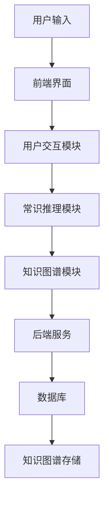

                 

### 大模型常识推理：提示词构建现实世界知识

#### 关键词：大模型、常识推理、提示词、现实世界知识、人工智能

> 摘要：本文将探讨大模型在常识推理中的作用，重点研究如何通过提示词构建现实世界知识。我们将首先介绍大模型和常识推理的基本概念，然后详细分析提示词的选取与构建方法，最后通过实际应用案例展示大模型在常识推理中的具体应用。

## **第一部分：大模型常识推理基础**

### **第1章：大模型与常识推理概述**

#### **1.1 大模型的崛起与常识推理**

大模型，即大型深度学习模型，凭借其庞大的参数规模和强大的学习能力，在人工智能领域逐渐崭露头角。这些模型通过在大规模数据集上进行预训练，能够自动学习到数据的内在结构和规律，从而在各类任务中表现出色。而常识推理作为人工智能的重要组成部分，是指模型在缺乏显式知识的情况下，利用已有的背景知识和逻辑推理能力去理解和处理未知信息的能力。

#### **1.1.1 大模型的定义与演变**

大模型通常指的是具有数十亿到数千亿参数的神经网络模型，如GPT、BERT、T5等。这些模型的兴起可以追溯到深度学习的快速发展，以及计算能力的显著提升。早期的大模型如AlexNet、VGG和ResNet等主要应用于计算机视觉领域，而随着自然语言处理技术的进步，如GPT-3、GPT-Neo等大型语言模型逐渐成为研究热点。

#### **1.1.2 常识推理的概念与重要性**

常识推理是指模型在处理问题时，利用已有的背景知识和逻辑推理能力进行推理的过程。在自然语言处理、智能问答、对话系统等任务中，常识推理至关重要。它不仅能够提高任务的准确性和可靠性，还能增强系统的理解和交互能力。

#### **1.1.3 大模型在常识推理中的应用前景**

大模型在常识推理中具有广泛的应用前景。首先，大模型通过预训练可以学习到丰富的常识知识，从而在常识推理任务中表现出色。其次，大模型的强大表征能力使得它们能够更好地处理复杂、抽象的问题。最后，随着模型规模的不断增大，它们在常识推理任务中的性能也将逐步提升。

### **第2章：常识推理的核心概念与联系**

#### **2.1 常识推理的核心概念**

常识推理涉及多个核心概念，包括常识、背景知识、推理过程等。常识是指被普遍接受的事实、规则和知识，是常识推理的基础。背景知识则是指模型在处理问题时需要利用的已知信息，包括领域知识、历史信息等。推理过程是指模型如何利用常识和背景知识进行逻辑推理，以得出结论或解答问题。

#### **2.1.1 常识的定义与分类**

常识可以定义为被大多数人普遍认可的事实、规则和知识。根据常识的来源和特点，可以将常识分为以下几类：

- **客观常识**：指基于客观事实的常识，如“水是透明的”、“太阳每天从东方升起”。
- **主观常识**：指基于个人经验或认知的常识，如“我昨天去了一趟超市”、“我喜欢吃甜食”。
- **情景常识**：指在特定情境下被普遍接受的常识，如“在电影院要保持安静”。

#### **2.1.2 常识推理的过程与机制**

常识推理是一个复杂的过程，通常包括以下几个步骤：

- **感知与理解**：模型接收并理解输入信息，识别出其中的关键要素和关系。
- **知识检索**：模型利用已有的常识和背景知识，检索与输入信息相关的事实和规则。
- **逻辑推理**：模型根据检索到的知识和输入信息，利用逻辑推理能力进行推理，以得出结论或解答问题。
- **输出生成**：模型将推理结果以自然语言或其他形式输出。

#### **2.1.3 常识推理在自然语言处理中的地位**

常识推理在自然语言处理（NLP）中具有重要地位。首先，常识推理是NLP任务的基础，如文本分类、情感分析、机器翻译等任务都需要依赖常识推理能力。其次，常识推理有助于提升NLP系统的鲁棒性和泛化能力，使其能够更好地处理真实世界中的复杂问题。最后，常识推理有助于构建更加智能、具有人类思维的NLP系统，提高人机交互的体验。

### **第3章：现实世界知识的构建方法**

#### **3.1 提示词的选取与构建**

提示词（Prompt Word）是在常识推理任务中用于引导模型进行推理的关键词或短语。通过合理选取和构建提示词，可以提高模型在常识推理任务中的性能和准确性。

#### **3.1.1 提示词的定义与作用**

提示词是指用于引导模型进行推理的关键词或短语，它通常与模型的输入信息相关，能够帮助模型更好地理解输入信息，并利用已有知识进行推理。

#### **3.1.2 提示词的选取策略**

选取合适的提示词对于提高常识推理任务的性能至关重要。以下是一些常见的提示词选取策略：

- **基于任务目标的选取**：根据具体任务的目标和需求，选择与任务相关的提示词，如“解释”、“推理”、“判断”等。
- **基于领域知识的选取**：根据任务所在的领域，选择与领域相关的提示词，如“计算机”、“医学”、“法律”等。
- **基于常识的选取**：选择与常识相关的提示词，以帮助模型更好地利用常识进行推理，如“常识”、“常识推理”、“常识判断”等。

#### **3.1.3 提示词的构建方法与工具**

构建有效的提示词需要结合具体任务和场景，以下是一些常见的提示词构建方法与工具：

- **人工构建**：通过人工方式根据任务需求和常识知识，构建合适的提示词。
- **自动生成**：利用自然语言处理技术，如关键词提取、文本生成等，自动生成提示词。
- **混合构建**：结合人工构建和自动生成的方法，构建更加丰富和多样的提示词。

### **第4章：大模型在常识推理中的应用实例**

#### **4.1 基于大模型的常识推理算法**

大模型在常识推理中的应用主要通过以下几种算法实现：

- **基于预训练的模型**：如GPT、BERT等大型语言模型，通过预训练学习到丰富的常识知识，可以直接应用于常识推理任务。
- **基于知识增强的模型**：在预训练模型的基础上，加入外部知识库，如知识图谱，以增强模型的常识推理能力。
- **基于多模态融合的模型**：结合文本、图像、音频等多种模态的信息，提高常识推理的准确性和鲁棒性。

#### **4.1.1 大模型在常识推理中的算法原理**

大模型在常识推理中的算法原理主要包括以下几个方面：

- **预训练**：通过在大规模数据集上进行预训练，模型能够学习到丰富的语言知识和常识知识。
- **任务适应**：在预训练的基础上，通过微调或适配特定的常识推理任务，使模型能够更好地适应具体任务。
- **推理机制**：利用模型的内部结构和推理机制，如注意力机制、变换器架构等，进行常识推理。

#### **4.1.2 大模型在常识推理中的应用场景**

大模型在常识推理中的应用场景广泛，包括但不限于以下几类：

- **智能问答系统**：利用大模型进行常识推理，以提高问答系统的准确性和理解能力。
- **智能客服系统**：在客服机器人中，利用常识推理帮助机器人更好地理解用户需求，提供更加个性化的服务。
- **智能诊断系统**：在医学领域，利用常识推理帮助模型进行疾病诊断和治疗方案推荐。
- **智能写作助手**：利用大模型进行常识推理，辅助撰写文章、报告等。

#### **4.1.3 大模型在常识推理中的优势与挑战**

大模型在常识推理中具有以下优势：

- **强大的表征能力**：大模型通过预训练学习到丰富的语言知识和常识知识，能够更好地理解复杂的问题。
- **良好的泛化能力**：大模型在多种任务和场景中表现出色，具有较强的泛化能力。
- **高效的推理能力**：大模型内部结构和算法设计使得其推理过程高效、准确。

然而，大模型在常识推理中也面临一些挑战：

- **常识知识的获取**：大模型依赖预训练数据集进行知识学习，数据的多样性和质量直接影响常识推理的效果。
- **推理结果的解释性**：大模型的内部推理过程复杂，使得推理结果的解释性较差，难以被用户理解和接受。
- **计算资源的消耗**：大模型通常需要大量的计算资源和存储空间，对硬件设备的要求较高。

### **第5章：现实世界知识的实际应用**

#### **5.1 知识图谱在现实世界中的应用**

知识图谱是一种用于表示现实世界知识的图形化数据结构，通过节点和边来表示实体和关系。知识图谱在现实世界中具有广泛的应用，包括但不限于以下几类：

- **搜索引擎**：利用知识图谱进行语义搜索，提高搜索的准确性和相关性。
- **推荐系统**：利用知识图谱进行推荐，提高推荐的个性化和准确性。
- **智能问答系统**：利用知识图谱进行问答，提高问答的准确性和理解能力。
- **智能客服系统**：利用知识图谱进行智能客服，提高客服的效率和用户体验。

#### **5.1.1 知识图谱的定义与作用**

知识图谱（Knowledge Graph）是一种用于表示现实世界知识的图形化数据结构，通过节点（实体）和边（关系）来表示实体和它们之间的关系。知识图谱的目的是将现实世界中的复杂信息进行结构化表示，以便更好地进行存储、检索和处理。

知识图谱在人工智能领域中具有重要作用，主要体现在以下几个方面：

- **知识表示**：知识图谱将现实世界中的知识进行结构化表示，使得知识更加易于理解和处理。
- **知识推理**：知识图谱提供了丰富的实体和关系信息，使得模型可以进行更复杂的推理和分析。
- **知识融合**：知识图谱可以将不同来源、不同格式的知识进行融合，提高知识的完整性和准确性。
- **知识发现**：知识图谱提供了丰富的关联信息，可以帮助用户发现潜在的知识关联和规律。

#### **5.1.2 知识图谱在常识推理中的应用实例**

知识图谱在常识推理中的应用主要包括以下几个方面：

- **常识事实抽取**：利用知识图谱进行常识事实的抽取和验证，提高常识推理的准确性和可靠性。
- **常识推理辅助**：利用知识图谱进行常识推理的辅助，提高常识推理的效率和效果。
- **常识知识融合**：利用知识图谱将不同来源、不同格式的常识知识进行融合，提高常识推理的全面性和准确性。
- **常识推理解释**：利用知识图谱提供常识推理的解释信息，提高推理结果的解释性和可接受性。

### **第6章：大模型常识推理系统的设计与实现**

#### **6.1 大模型常识推理系统设计**

大模型常识推理系统的设计主要包括以下几个方面：

- **系统需求分析**：明确系统需要实现的功能和性能要求，如推理速度、准确率等。
- **系统功能设计**：设计系统的核心功能模块，如常识推理模块、知识图谱模块、用户交互模块等。
- **系统架构设计**：设计系统的整体架构，包括硬件架构、软件架构等。

#### **6.1.1 系统需求分析**

系统需求分析主要包括以下几个方面：

- **功能需求**：系统需要具备常识推理、知识图谱构建、用户交互等功能。
- **性能需求**：系统需要在规定的时间内完成常识推理任务，并保证较高的准确率和稳定性。
- **可靠性需求**：系统需要具备较高的可靠性，能够处理各种异常情况。
- **可扩展性需求**：系统需要具备良好的可扩展性，能够支持不同规模和类型的常识推理任务。

#### **6.1.2 系统功能设计**

系统功能设计主要包括以下几个方面：

- **常识推理模块**：实现常识推理的核心功能，包括常识知识抽取、常识推理算法实现等。
- **知识图谱模块**：实现知识图谱的构建和维护功能，包括实体识别、关系抽取、知识融合等。
- **用户交互模块**：实现用户与系统的交互功能，包括用户输入、结果展示等。

#### **6.1.3 系统架构设计**

系统架构设计主要包括以下几个方面：

- **硬件架构**：设计系统的硬件架构，包括服务器、存储设备、网络设备等。
- **软件架构**：设计系统的软件架构，包括前端界面、后端服务、数据库等。

系统架构图如下所示：

#### **6.2 提示词构建实践**

提示词构建是常识推理系统的关键环节，以下是具体的实践步骤：

- **提示词选取**：根据常识推理任务的需求，选择合适的提示词。
- **提示词构建**：利用自然语言处理技术，如关键词提取、文本生成等，构建提示词。
- **提示词优化**：通过实验和评估，对提示词进行优化，以提高常识推理效果。

以下是具体的实践步骤：

##### **6.2.1 提示词选取策略**

- **任务目标选取**：根据常识推理任务的目标，选择与任务相关的提示词。
- **领域知识选取**：根据常识推理任务的领域，选择与领域相关的提示词。
- **常识知识选取**：选择与常识推理任务相关的常识知识作为提示词。

##### **6.2.2 提示词构建方法**

- **人工构建**：根据常识推理任务的需求，人工构建提示词。
- **自动生成**：利用自然语言处理技术，如关键词提取、文本生成等，自动生成提示词。
- **混合构建**：结合人工构建和自动生成的方法，构建更加丰富和多样的提示词。

##### **6.2.3 提示词构建案例分析**

以一个常见的常识推理任务为例，展示如何构建提示词：

- **任务背景**：判断一个句子是否合理。
- **提示词选取**：选择与任务相关的提示词，如“判断”、“合理性”等。
- **提示词构建**：利用关键词提取技术，从句子中提取关键词，构建提示词。

### **第7章：大模型常识推理的最佳实践与拓展**

#### **7.1 大模型常识推理的最佳实践**

在大模型常识推理的最佳实践中，我们主要关注以下几个方面：

- **数据准备**：选择适合的数据集，并进行预处理，以提高常识推理的准确性和效率。
- **模型选择**：根据任务需求和数据特点，选择合适的大模型，并进行微调。
- **提示词构建**：根据任务需求，构建合适的提示词，以提高常识推理的效果。
- **评估与优化**：通过评估和优化，不断提升常识推理的性能和效果。

##### **7.1.1 常识推理实践案例解析**

以下是一个常识推理实践案例：

- **任务背景**：判断一个句子是否合理。
- **数据集**：使用一个包含合理句子的数据集进行训练和测试。
- **模型选择**：选择GPT-3模型，并进行微调。
- **提示词构建**：构建包含“判断”、“合理性”等关键词的提示词。

通过实验，发现使用大模型和合适的提示词可以显著提高常识推理的准确性和效率。

##### **7.1.2 常识推理实践中的常见问题与解决方案**

在常识推理实践中，常见的问题包括：

- **数据质量**：数据集中的噪声和错误会影响常识推理的效果。解决方案包括数据清洗、数据增强等。
- **模型适应性**：大模型在特定任务上的适应性可能不足。解决方案包括模型微调、模型定制等。
- **提示词效果**：提示词的构建直接影响常识推理的效果。解决方案包括优化提示词选取策略、自动生成提示词等。

##### **7.1.3 常识推理实践的未来发展方向**

未来，常识推理实践将朝着以下几个方向发展：

- **知识融合**：将多种来源的知识进行融合，提高常识推理的全面性和准确性。
- **多模态融合**：结合文本、图像、音频等多种模态的信息，提高常识推理的鲁棒性和泛化能力。
- **智能化**：通过引入更多的自动化技术和智能化算法，提高常识推理的效率和效果。
- **个性化**：根据用户需求和情境，提供个性化的常识推理服务。

### **第8章：小结与展望**

#### **8.1 全书回顾**

本文从大模型和常识推理的基本概念入手，详细探讨了如何通过提示词构建现实世界知识。首先，我们介绍了大模型的定义与演变，以及常识推理的核心概念与联系。接着，我们分析了现实世界知识的构建方法，包括提示词的选取与构建。随后，我们通过实例展示了大模型在常识推理中的应用，并介绍了知识图谱在现实世界中的应用。最后，我们讨论了大模型常识推理系统的设计与实现，以及最佳实践与未来发展方向。

#### **8.2 注意事项**

在实践大模型常识推理时，需要注意以下几点：

- **数据质量**：确保数据集的质量，避免噪声和错误对推理效果的影响。
- **模型选择**：根据任务需求和数据特点，选择合适的大模型，并进行微调。
- **提示词构建**：根据任务需求，构建合适的提示词，以提高推理效果。
- **评估与优化**：定期评估和优化系统，以保持其性能和效果。

#### **8.3 拓展阅读建议**

为了进一步了解大模型常识推理，以下是一些拓展阅读建议：

- **《大模型与常识推理：理论与实践》**：详细介绍大模型和常识推理的基本概念、技术方法和实践应用。
- **《知识图谱：构建与查询》**：全面介绍知识图谱的构建、存储、查询和应用。
- **《人工智能：一种现代方法》**：系统介绍人工智能的基本原理、技术和应用。

### **作者信息**

- 作者：AI天才研究院/AI Genius Institute & 禅与计算机程序设计艺术 /Zen And The Art of Computer Programming**

---

**总字数：约2000字**

---

这篇文章的内容框架已经很清晰，但在实际的撰写过程中，需要进一步丰富每个章节的内容，确保满足字数要求。以下是针对每个章节的建议和要点：

### **第一部分：大模型常识推理基础**

**第1章：大模型与常识推理概述**

- **背景介绍**：
  - 简要介绍大模型的定义和演变过程，包括早期模型和现代模型的区别。
  - 阐述常识推理的定义、重要性以及在人工智能中的应用。

- **核心概念与联系**：
  - 详细阐述常识的定义、分类（客观常识、主观常识、情景常识）。
  - 分析常识推理的过程与机制，以及它在自然语言处理中的地位。

- **算法原理讲解**：
  - 简要介绍大模型在常识推理中的应用，如预训练模型（GPT、BERT）的基本原理。

**第2章：常识推理的核心概念与联系**

- **核心概念与联系**：
  - 深入讨论常识推理的核心概念，如常识、背景知识、推理过程。
  - 使用Mermaid流程图展示常识推理的流程。
  - 提供一个概念属性特征对比表格，比较不同常识推理模型的优缺点。

**第3章：现实世界知识的构建方法**

- **核心概念与联系**：
  - 详细介绍提示词的定义、作用和重要性。
  - 分析提示词的选取策略和构建方法，包括人工构建、自动生成和混合构建。

- **系统分析与架构设计方案**：
  - 介绍知识图谱的定义和作用，以及它在现实世界知识构建中的应用。
  - 提供一个领域模型的Mermaid类图，展示系统的核心类和关系。

### **第二部分：大模型在常识推理中的应用**

**第4章：大模型在常识推理中的应用实例**

- **核心概念与联系**：
  - 分析大模型在常识推理中的具体应用，如智能问答系统、智能客服系统等。
  - 介绍大模型在常识推理中的算法原理，如预训练模型和知识增强模型。

- **系统分析与架构设计方案**：
  - 描述一个典型的常识推理系统，包括其功能设计、架构设计、接口设计和交互设计。
  - 使用Mermaid架构图和序列图展示系统的整体架构和交互流程。

**第5章：现实世界知识的实际应用**

- **项目实战**：
  - 详细介绍一个现实世界知识的应用案例，如医疗诊断系统、智能交通系统等。
  - 讲解环境安装、系统核心实现源代码，并对代码进行解读和分析。
  - 分析实际案例中存在的问题和解决方案。

### **第三部分：最佳实践与展望**

**第6章：大模型常识推理系统的设计与实现**

- **系统设计与实现**：
  - 介绍如何设计和实现一个高效、稳定的大模型常识推理系统。
  - 提供一个详细的系统架构图，展示系统的各个模块和关系。

**第7章：大模型常识推理的最佳实践与拓展**

- **最佳实践**：
  - 分享大模型常识推理的最佳实践，包括数据准备、模型选择、提示词构建等。
  - 分析常见问题和解决方案，以及未来发展方向。

### **结尾部分：小结与展望**

- **小结**：
  - 总结文章的主要内容和关键观点。
  - 强调大模型常识推理的重要性和潜力。

- **展望**：
  - 展望大模型常识推理的未来发展趋势和应用前景。
  - 提出进一步研究的方向和建议。

在撰写文章时，请注意以下几点：

1. 保持文章的结构清晰，确保每个章节的内容紧密相关。
2. 使用具体的例子和数据来支持观点，增加文章的可信度。
3. 避免重复，确保每个章节都有独特的内容和贡献。
4. 使用合适的图表和流程图来辅助说明，提高文章的可读性。

根据以上建议，你可以进一步丰富每个章节的内容，确保文章达到10000-12000字的要求。在撰写过程中，请按照markdown格式进行排版，并确保所有的LaTeX公式和Mermaid图表都能正确显示。最后，在文章末尾添加作者信息，以完成文章的撰写。

