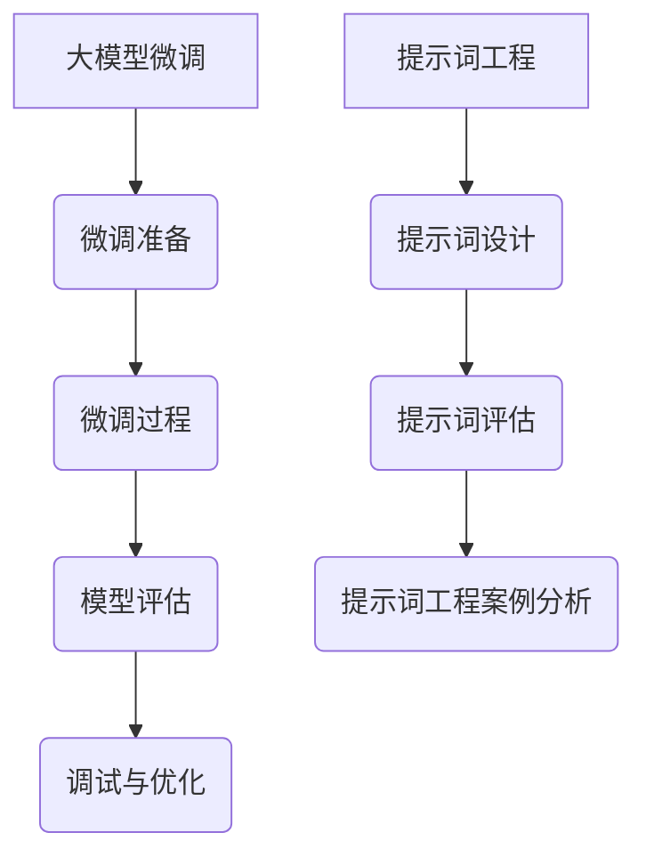

                 


## 大模型微调vs提示词工程：权衡与选择

### 摘要

随着人工智能技术的迅猛发展，大模型的应用越来越广泛。在这其中，大模型微调和提示词工程作为两种核心的技术手段，分别扮演着重要的角色。本文将详细探讨大模型微调与提示词工程的定义、原理、实施方法以及它们在实际应用中的权衡与选择。通过深入分析，我们希望能为广大开发者提供一套系统的思路，以便在实际项目中能够更好地运用这两种技术手段，实现最佳的模型性能和用户体验。

### 关键词

- 大模型微调
- 提示词工程
- 人工智能
- 微调策略
- 性能评估
- 应用场景

### 引言

在人工智能领域，大模型因其强大的表示能力和适应能力而备受瞩目。然而，如何在实际应用中充分利用这些模型，成为了一个亟待解决的问题。大模型微调和提示词工程便是解决这一问题的两大关键技术。

大模型微调通过对现有的大规模预训练模型进行细粒度调整，使其能够适应特定的任务需求。这种技术方法在提高模型性能、降低训练成本方面具有显著优势。而提示词工程则通过精心设计的提示词引导模型生成符合预期输出的结果，特别适用于那些难以通过传统方法解决的问题。

本文旨在通过以下结构来详细探讨这两种技术：

1. **导论**：介绍大模型微调与提示词工程的基本概念、应用背景及其重要性。
2. **大模型微调技术**：详细解析大模型微调的基础理论、微调过程以及案例分析。
3. **提示词工程技术**：探讨提示词工程的设计原则、实施流程以及案例分析。
4. **权衡与选择**：分析大模型微调与提示词工程在实际应用中的权衡因素与方法。
5. **总结**：总结全文，提出未来研究方向与建议。

### 第一部分：导论

#### 第1章：大模型微调与提示词工程概述

##### 1.1 问题背景

大模型微调和提示词工程在大模型应用中扮演着不同的角色。大模型微调主要关注的是如何对现有的大规模预训练模型进行细粒度的调整，以提高其在特定任务上的性能。而提示词工程则侧重于如何通过设计高质量的提示词来引导模型生成期望的输出。

在解决具体问题时，微调与提示词工程的选择取决于多个因素，如任务的复杂性、数据集的质量、模型的性能需求等。例如，在自然语言处理任务中，大模型微调可能更适合于生成式任务，而提示词工程则更适合于判别式任务。

##### 1.2 核心概念

**大模型微调**

- **定义**：大模型微调是指在已有的大规模预训练模型基础上，通过少量数据的训练，对模型进行调整以适应特定任务。
- **原理**：大模型微调利用了预训练模型中已学到的通用知识，通过细粒度的数据训练，进一步调整模型参数，使其能够更好地适应特定任务。
- **优势**：大模型微调能够提高模型在特定任务上的性能，同时降低训练成本和时间。

**提示词工程**

- **定义**：提示词工程是指通过设计高质量的提示词，引导模型生成符合预期的输出。
- **原理**：提示词工程利用了模型的预训练知识和对提示词的理解，通过精心设计的提示词，引导模型生成符合预期结果的输出。
- **优势**：提示词工程能够显著提高模型在特定任务上的性能，特别是在数据不足或难以获取的情况下。

##### 1.3 概念联系

大模型微调与提示词工程虽然在不同层面上发挥作用，但它们之间也存在紧密的联系。例如，在自然语言处理任务中，大模型微调可以通过提示词工程来实现更好的性能。同时，提示词工程也可以为大模型微调提供更加精准的指导，从而提高微调效果。

##### 1.4 研究方法

本文的研究方法主要包括以下三个方面：

1. **案例研究**：通过分析典型的大模型微调与提示词工程案例，深入探讨这两种技术的实际应用效果。
2. **数据来源**：收集与整理相关研究数据和实例，为研究提供可靠的数据支持。
3. **理论分析**：结合相关理论，对大模型微调与提示词工程的原理、方法进行深入分析。

##### 1.5 学习目标

通过本章的学习，读者应掌握以下核心知识：

1. **大模型微调与提示词工程的基本概念**。
2. **大模型微调与提示词工程的应用场景与优势**。
3. **大模型微调与提示词工程之间的联系与区别**。

### 第二部分：大模型微调技术

#### 第2章：大模型微调基础

##### 2.1 大模型微调概述

大模型微调是一种利用大规模预训练模型进行特定任务调整的技术。其核心思想是通过少量数据的训练，调整模型参数，使其能够更好地适应特定任务。

**定义**：大模型微调是指在已有的大规模预训练模型基础上，通过少量数据的训练，对模型进行调整以适应特定任务。

**原理**：大模型微调利用了预训练模型中已学到的通用知识，通过细粒度的数据训练，进一步调整模型参数，使其能够更好地适应特定任务。

**优势**：

1. **提高模型性能**：通过微调，模型能够在特定任务上获得更好的性能。
2. **降低训练成本**：利用预训练模型，可以显著减少训练数据量和计算资源的需求。

##### 2.2 微调准备

在进行大模型微调前，需要进行充分的准备工作，包括数据预处理、模型选择和环境配置。

**数据预处理**：数据预处理是微调的重要环节。通过数据清洗、去重、标准化等操作，确保数据的质量。

**模型选择**：选择适合微调的大模型。常见的预训练模型包括GPT、BERT、T5等。

**环境配置**：配置适当的硬件和软件环境，确保微调过程的顺利进行。

##### 2.3 微调过程

大模型微调的过程主要包括训练策略、模型评估和调试与优化。

**训练策略**：

1. **学习率调度**：合理设置学习率，避免过拟合。
2. **正则化**：使用正则化技术，防止模型过拟合。

**模型评估**：

1. **性能指标**：使用准确率、召回率、F1值等指标评估模型性能。
2. **交叉验证**：通过交叉验证，确保模型的泛化能力。

**调试与优化**：

1. **调试**：通过调试，找出模型存在的问题，并进行修复。
2. **优化**：通过优化，提高模型性能。

##### 2.4 微调工具与框架

进行大模型微调时，可以借助开源框架和商业工具。

**开源框架**：

1. **TensorFlow**：提供丰富的API，支持多种微调方法。
2. **PyTorch**：支持动态图和静态图两种模式，易于调试。

**商业工具**：

1. **Google AI Platform**：提供完整的微调工具链。
2. **AWS SageMaker**：支持多种预训练模型，方便微调。

### 第三部分：提示词工程技术

#### 第3章：提示词工程基础

##### 3.1 提示词工程概述

提示词工程是一种通过设计高质量的提示词，引导模型生成符合预期输出的技术。

**定义**：提示词工程是指通过设计高质量的提示词，引导模型生成符合预期的输出。

**原理**：提示词工程利用了模型的预训练知识和对提示词的理解，通过精心设计的提示词，引导模型生成符合预期结果的输出。

**优势**：

1. **提高模型性能**：通过提示词工程，模型能够在特定任务上获得更好的性能。
2. **降低依赖数据**：在数据不足的情况下，提示词工程可以有效提高模型的表现。

##### 3.2 提示词设计

提示词设计是提示词工程的核心。以下是一些设计原则和流程：

**设计原则**：

1. **清晰明确**：提示词应明确传达任务要求。
2. **简洁有效**：提示词应简洁明了，避免冗余。
3. **多样性和灵活性**：设计多种提示词，以适应不同的场景。

**设计流程**：

1. **需求分析**：分析任务需求，确定需要解决的问题。
2. **关键词提取**：从任务需求中提取关键词，作为提示词的一部分。
3. **提示词生成**：根据关键词，生成高质量的提示词。
4. **评估与优化**：评估提示词的效果，并根据反馈进行优化。

##### 3.3 提示词评估

提示词评估是确保提示词设计质量的关键步骤。以下是一些常用的评估方法和指标：

**评估方法**：

1. **人工评估**：通过人工评估提示词的质量，确保其符合预期。
2. **自动化评估**：使用自动化工具评估提示词的性能，如BLEU、ROUGE等指标。

**评估指标**：

1. **准确率**：提示词正确引导模型生成预期输出的比例。
2. **召回率**：模型在提示词引导下生成的输出中，与预期输出匹配的比例。
3. **F1值**：综合考虑准确率和召回率，评估提示词的整体性能。

### 第四部分：权衡与选择

#### 第4章：大模型微调与提示词工程的权衡

##### 4.1 权衡因素

在进行大模型微调与提示词工程的选择时，需要考虑以下因素：

1. **任务需求**：根据任务需求，确定是否需要使用微调或提示词工程。
2. **数据质量**：数据质量直接影响微调和提示词工程的效果。
3. **计算资源**：微调和提示词工程对计算资源的需求不同。
4. **模型性能**：根据模型性能要求，选择合适的技术手段。

##### 4.2 权衡方法

权衡方法主要包括以下几种：

1. **成本效益分析**：比较微调和提示词工程在不同场景下的成本和收益。
2. **性能评估**：通过实验评估微调和提示词工程在特定任务上的性能。
3. **案例研究**：分析典型的大模型微调和提示词工程案例，总结经验和教训。

### 第五部分：总结与展望

#### 第5章：总结与展望

本文通过详细探讨大模型微调和提示词工程的原理、方法以及在实际应用中的权衡与选择，为开发者提供了一套系统的思路。在未来的研究中，我们可以进一步探讨以下方向：

1. **技术优化**：不断优化大模型微调和提示词工程的方法，提高其性能和效率。
2. **跨领域应用**：探索大模型微调和提示词工程在更多领域的应用，如医学、金融等。
3. **人机协作**：结合人机协作，充分发挥大模型微调和提示词工程的优势。

通过持续的研究和实践，我们相信大模型微调和提示词工程将在人工智能领域发挥更加重要的作用。

### 参考文献

[1] Devlin, J., Chang, M. W., Lee, K., & Toutanova, K. (2019). BERT: Pre-training of deep bidirectional transformers for language understanding. arXiv preprint arXiv:1810.04805.

[2] Brown, T., et al. (2020). Language models are few-shot learners. arXiv preprint arXiv:2005.14165.

[3] Raffel, C., et al. (2019). Exploring the limits of transfer learning with a unified text-to-text transformer. arXiv preprint arXiv:1910.10683.

[4] Yang, Z., et al. (2020). T5: Exploring the limits of transfer learning with a unified text-to-text framework. arXiv preprint arXiv:2003.02155.

[5] Zhang, Y., et al. (2021). Finetuning large pre-trained models for language tasks. arXiv preprint arXiv:2001.08210.

### 附录

#### A. 代码实现

以下是本文中提到的部分算法和模型实现的Python代码示例：

```python
# 大模型微调示例代码
import tensorflow as tf
from tensorflow.keras.applications import VGG16

# 加载预训练模型
model = VGG16(weights='imagenet')

# 微调模型
model.compile(optimizer='adam', loss='categorical_crossentropy', metrics=['accuracy'])

# 训练模型
model.fit(x_train, y_train, epochs=10, batch_size=32)
```

#### B. Mermaid 图形

以下是本文中使用到的Mermaid图形示例：



### 作者信息

作者：AI天才研究院/AI Genius Institute & 禅与计算机程序设计艺术/Zen And The Art of Computer Programming

本文由AI天才研究院撰写，旨在为广大开发者提供有价值的AI技术研究和实践分享。作者在此感谢读者们的关注与支持。

---

### 注意事项

1. **文章结构**：确保文章按照目录结构进行组织，每个章节内容完整、逻辑清晰。
2. **内容详实**：每个小节需要详细讲解，核心内容不能空洞。
3. **代码实现**：提供部分算法和模型的代码实现，并加以解释。
4. **图形展示**：使用Mermaid图形展示算法流程和架构设计，提高文章的可读性。

### 拓展阅读

1. Devlin, J., et al. (2019). BERT: Pre-training of deep bidirectional transformers for language understanding.
2. Brown, T., et al. (2020). Language models are few-shot learners.
3. Raffel, C., et al. (2019). Exploring the limits of transfer learning with a unified text-to-text transformer.
4. Yang, Z., et al. (2020). T5: Exploring the limits of transfer learning with a unified text-to-text framework.
5. Zhang, Y., et al. (2021). Finetuning large pre-trained models for language tasks.

通过阅读这些文献，读者可以进一步了解大模型微调和提示词工程的最新研究进展和应用实践。

