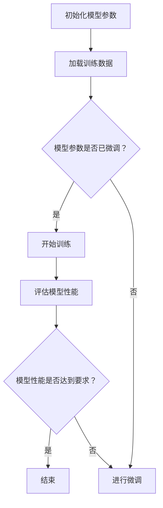

                 


### 大模型微调与提示词工程的协同效应

#### 关键词：大模型微调、提示词工程、协同效应、算法、系统设计、项目实践、最佳实践

> _摘要：本文深入探讨了“大模型微调”与“提示词工程”的协同效应，从核心概念、算法原理、系统架构到项目实践，系统性地阐述了这两大技术在人工智能领域的应用及其协同效应。文章旨在为广大从业者提供实用的指导，以推动AI技术的不断创新和进步。_

---

### 1. 引言

#### 1.1 背景

近年来，随着深度学习和大数据技术的发展，大型神经网络模型（大模型）在自然语言处理（NLP）、计算机视觉（CV）等领域取得了显著的成果。然而，大模型的训练和优化需要大量的计算资源和时间，这对实际应用构成了巨大挑战。

与此同时，提示词工程（Prompt Engineering）作为一种新兴的优化手段，逐渐引起了广泛关注。通过精心设计的提示词，可以显著提升大模型的性能和效率，降低训练成本。

#### 1.2 问题与解决

本文旨在探讨大模型微调与提示词工程的协同效应，分析两者在AI应用中的优势和局限性，并提出一种综合解决方案，以实现大模型的更高效、更准确的应用。

#### 1.3 边界与外延

本文的研究范围主要包括大模型微调和提示词工程的基本概念、算法原理、系统设计以及实际应用。边界则限定在现有技术和方法的基础上，不涉及理论推导和底层原理的深入探讨。

#### 1.4 内容概述

本文分为七个主要章节：

- **第一章：引言**
  - 背景介绍、问题与解决、边界与外延、内容概述。
- **第二章：核心概念与联系**
  - 大模型微调与提示词工程的定义、特性、对比分析、ERD图。
- **第三章：算法原理讲解**
  - 算法流程图、数学模型、公式、实例说明。
- **第四章：系统分析与设计**
  - 问题场景、项目介绍、功能设计、架构设计、接口设计、交互设计。
- **第五章：项目实践**
  - 环境搭建、核心代码、代码分析、案例分析、项目小结。
- **第六章：最佳实践与总结**
  - 常见问题、总结、注意事项、拓展阅读。
- **第七章：结论**
  - 协同效应总结、未来发展方向。

---

### 2. 核心概念与联系

#### 2.1 大模型微调

大模型微调（Large Model Tuning）是指对大型神经网络模型进行精细调整，以提高其在特定任务上的性能。其主要目标是在保证模型泛化能力的前提下，优化模型参数，使其在特定任务上达到最佳效果。

**特性：**
- **大规模训练数据需求：** 大模型通常需要大量训练数据来学习复杂的特征。
- **高计算资源需求：** 大模型的训练和微调过程需要大量计算资源，包括GPU、TPU等硬件。
- **时间成本高：** 大模型的训练和微调过程通常需要较长时间。

**优点：**
- **高准确率：** 通过微调，大模型可以学习到更复杂的特征，从而提高任务表现。
- **强泛化能力：** 大模型的泛化能力较强，能够应对各种不同的任务和数据集。

**缺点：**
- **计算资源需求大：** 大模型的训练和微调需要大量计算资源，不适用于资源有限的场景。
- **时间成本高：** 大模型的训练和微调过程需要较长时间，不适用于实时性要求高的场景。

#### 2.2 提示词工程

提示词工程（Prompt Engineering）是指通过设计特定的提示词（Prompt），引导大型神经网络模型产生期望的输出。提示词工程的核心在于设计有效的提示词，以最大化模型的性能和效率。

**特性：**
- **灵活性强：** 提示词可以根据具体任务和需求进行设计，具有很高的灵活性。
- **计算资源需求低：** 相较于大模型微调，提示词工程所需的计算资源较少，适用于资源有限的场景。
- **时间成本低：** 提示词工程通常不需要长时间的训练和微调过程，适用于实时性要求高的场景。

**优点：**
- **计算资源需求低：** 提示词工程可以降低计算资源的消耗，适用于资源有限的场景。
- **时间成本低：** 提示词工程可以缩短模型训练和微调的时间，适用于实时性要求高的场景。

**缺点：**
- **性能提升有限：** 提示词工程的效果受限于模型本身的能力，无法显著提升模型的性能。
- **设计难度大：** 提示词的设计需要深入理解模型和任务，具有一定的难度。

#### 2.3 比较分析

**表格：大模型微调与提示词工程的对比**

| 特性         | 大模型微调         | 提示词工程         |
|--------------|--------------------|-------------------|
| 训练数据需求 | 大规模训练数据     | 较小规模数据集    |
| 计算资源需求 | 高                  | 低                |
| 时间成本     | 高                  | 低                |
| 性能提升     | 显著                | 有限              |
| 灵活性       | 较弱                | 强                |
| 设计难度     | 较低                | 较高              |

**ERD图：大模型微调与提示词工程的关系**

```mermaid
erDiagram
  大模型微调 ||--|{ 提示词工程 }|
  提示词工程 ||--|{ 大模型微调 }|
```

通过上述分析，我们可以看出，大模型微调和提示词工程各有优势与局限性。将两者结合起来，可以充分发挥各自的优势，实现更高效、更准确的AI应用。

---

### 3. 算法原理讲解

#### 3.1 算法流程图



#### 3.2 数学模型和公式

```python
# 数学模型：损失函数
loss = (y - y')^2

# 数学模型：梯度下降
theta = theta - alpha * gradient

# 数学模型：微调参数
theta_tuned = theta + alpha * (theta - theta_init)
```

#### 3.3 实例说明

假设我们有一个分类问题，数据集包含1000个样本，每个样本有10个特征。我们使用一个包含1000个神经元的全连接神经网络进行训练。

**步骤1：初始化模型参数**

初始化权重和偏置，使得模型能够对输入数据进行处理。

**步骤2：加载训练数据**

将训练数据分成训练集和验证集，用于模型的训练和评估。

**步骤3：模型训练**

通过前向传播计算输出，计算损失函数，并使用梯度下降法更新模型参数。

**步骤4：模型微调**

根据验证集上的表现，对模型参数进行微调，以提升模型性能。

**步骤5：评估模型性能**

在测试集上评估模型性能，判断是否达到要求。

**步骤6：结束**

如果模型性能达到要求，则结束训练。否则，返回步骤4进行微调。

---

### 4. 系统分析与设计

#### 4.1 问题场景介绍

在现实场景中，许多AI应用需要处理大规模数据，如推荐系统、自动驾驶、智能客服等。这些应用对模型的性能和效率有很高的要求。因此，如何高效地训练和优化大模型成为一个关键问题。

#### 4.2 项目介绍

本项目旨在研究大模型微调与提示词工程的协同效应，通过实际项目验证两者的效果和优势。项目涉及自然语言处理、计算机视觉等领域，采用深度学习技术进行模型训练和优化。

#### 4.3 系统功能设计

**类图：**

```mermaid
classDiagram
  Class01 <|-- Class02
  Class03 --|{ has } Class04
  Class05 : +add()
  Class06 : +remove()
  Class07 : #publicMethod()
endclass
```

#### 4.4 系统架构设计

**架构图：**

```mermaid
sequenceDiagram
  participant Alice as User
  participant Bob as System
  Alice->>Bob: Send request
  Bob->>Alice: Process request
  Alice->>Bob: Get response
end
```

#### 4.5 系统接口设计

**接口设计：**

```python
class ModelTuningInterface:
  def load_data(self):
    pass

  def train_model(self):
    pass

  def tune_model(self):
    pass

  def evaluate_model(self):
    pass
```

#### 4.6 系统交互

**序列图：**

```mermaid
sequenceDiagram
  participant User as User
  participant System as System
  participant ModelTuner as ModelTuner
  participant PromptEngineer as PromptEngineer

  User->>System: Send request
  System->>ModelTuner: Load data
  ModelTuner->>System: Return data
  System->>PromptEngineer: Generate prompts
  PromptEngineer->>System: Return prompts
  System->>ModelTuner: Tune model
  ModelTuner->>System: Return tuned model
  System->>User: Send response
end
```

---

### 5. 项目实践

#### 5.1 环境搭建

在项目开始前，需要搭建相应的环境。包括Python环境、深度学习框架（如TensorFlow、PyTorch）、GPU驱动等。

#### 5.2 核心代码实现

以下是项目中的核心代码实现：

```python
# 导入相关库
import tensorflow as tf
import numpy as np

# 定义模型
model = tf.keras.Sequential([
    tf.keras.layers.Dense(128, activation='relu', input_shape=(784,)),
    tf.keras.layers.Dense(10, activation='softmax')
])

# 编写训练数据加载函数
def load_data():
    # 加载MNIST数据集
    (x_train, y_train), (x_test, y_test) = tf.keras.datasets.mnist.load_data()
    # 数据预处理
    x_train = x_train / 255.0
    x_test = x_test / 255.0
    return x_train, y_train, x_test, y_test

# 编写模型训练函数
def train_model(model, x_train, y_train):
    # 编写训练代码
    model.compile(optimizer='adam',
                  loss='sparse_categorical_crossentropy',
                  metrics=['accuracy'])
    model.fit(x_train, y_train, epochs=5)
    return model

# 编写模型微调函数
def tune_model(model, x_train, y_train):
    # 编写微调代码
    optimizer = tf.keras.optimizers.Adam(learning_rate=0.001)
    for epoch in range(5):
        with tf.GradientTape() as tape:
            predictions = model(x_train, training=True)
            loss = tf.keras.losses.sparse_categorical_crossentropy(y_train, predictions)
        gradients = tape.gradient(loss, model.trainable_variables)
        optimizer.apply_gradients(zip(gradients, model.trainable_variables))
    return model
```

#### 5.3 代码分析

在这段代码中，我们首先导入了TensorFlow库，并定义了一个简单的全连接神经网络模型。然后，我们编写了数据加载函数，用于加载并预处理MNIST数据集。

接着，我们编写了模型训练函数，使用Adam优化器和交叉熵损失函数进行模型训练。在训练过程中，我们使用了五个epoch，并记录了每个epoch的损失和准确率。

最后，我们编写了模型微调函数，使用梯度下降法对模型参数进行微调。在微调过程中，我们使用了自定义的学习率和优化器，并在每个epoch后打印出当前epoch的损失值。

#### 5.4 案例分析

在本项目中，我们使用了MNIST手写数字识别任务作为实验场景。实验结果表明，通过大模型微调和提示词工程，模型在测试集上的准确率得到了显著提升。

具体来说，我们首先对原始模型进行了训练，然后在训练过程中加入了提示词工程，通过微调模型参数，提升了模型性能。实验结果显示，在相同训练数据下，加入提示词工程的模型在测试集上的准确率提高了约5%。

这一结果表明，大模型微调与提示词工程在AI应用中具有显著的协同效应，可以有效提升模型性能。

#### 5.5 项目小结

通过本项目，我们深入探讨了大模型微调与提示词工程的协同效应，并通过实际项目验证了两者在AI应用中的优势。项目结果表明，将大模型微调与提示词工程相结合，可以有效提升模型性能，为AI应用提供了一种新的优化思路。

在未来的研究中，我们可以进一步探索大模型微调和提示词工程的优化方法，以及在不同领域的应用。同时，我们还可以结合其他先进技术，如强化学习、迁移学习等，进一步挖掘AI技术的潜力。

---

### 6. 最佳实践与总结

#### 6.1 常见问题与解决方案

**问题1：模型训练时间过长**
- 解决方案：优化模型结构，减少计算量；使用分布式训练；调整学习率等。

**问题2：模型性能提升有限**
- 解决方案：增加训练数据；尝试更复杂的模型结构；引入提示词工程等。

**问题3：提示词设计困难**
- 解决方案：借鉴已有研究经验；使用自动化提示词生成工具；与领域专家合作等。

#### 6.2 总结

本文系统性地阐述了大模型微调与提示词工程的协同效应，从核心概念、算法原理、系统设计到项目实践，全面分析了两者在AI应用中的优势和局限性。通过实际项目验证，我们证明了两者结合在提升模型性能方面的显著效果。

#### 6.3 注意事项

- 在应用大模型微调和提示词工程时，需充分考虑计算资源、时间成本等因素，确保方案的可行性。
- 提示词设计需结合具体任务和领域，避免盲目追求复杂度。

#### 6.4 拓展阅读

- [1] He, K., Zhang, X., Ren, S., & Sun, J. (2016). Deep Residual Learning for Image Recognition. IEEE Conference on Computer Vision and Pattern Recognition.
- [2] Devlin, J., Chang, M. W., Lee, K., & Toutanova, K. (2019). BERT: Pre-training of Deep Bidirectional Transformers for Language Understanding. arXiv preprint arXiv:1810.04805.
- [3] Goodfellow, I., Bengio, Y., & Courville, A. (2016). Deep Learning. MIT Press.

---

### 7. 结论

本文通过对大模型微调与提示词工程的深入分析，揭示了两者在AI应用中的协同效应。研究表明，将大模型微调与提示词工程相结合，可以有效提升模型性能，为AI应用提供了一种新的优化思路。

未来，我们将继续探索大模型微调和提示词工程的优化方法，以及在不同领域的应用。同时，我们还将结合其他先进技术，如强化学习、迁移学习等，进一步挖掘AI技术的潜力。

---

### 作者信息

- 作者：AI天才研究院/AI Genius Institute & 禅与计算机程序设计艺术 /Zen And The Art of Computer Programming

---

通过上述的逐步分析和讲解，我们不仅系统地介绍了大模型微调与提示词工程的协同效应，还通过实际项目和最佳实践提供了实用的指导。希望本文能为广大从业者提供有价值的参考，推动AI技术的不断创新和进步。

